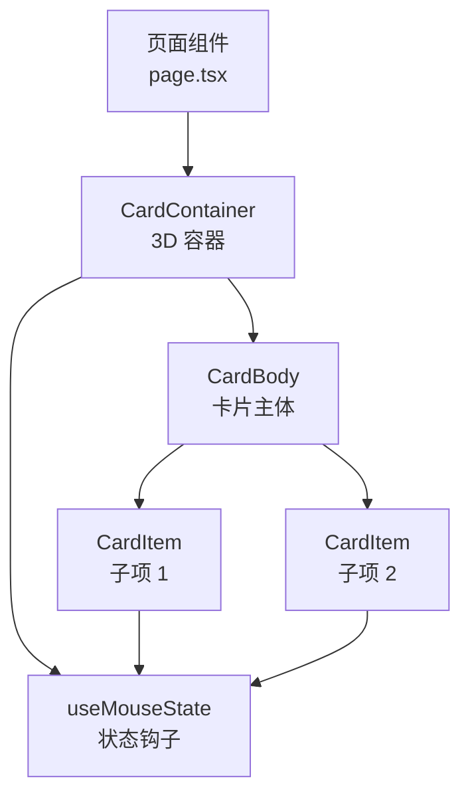
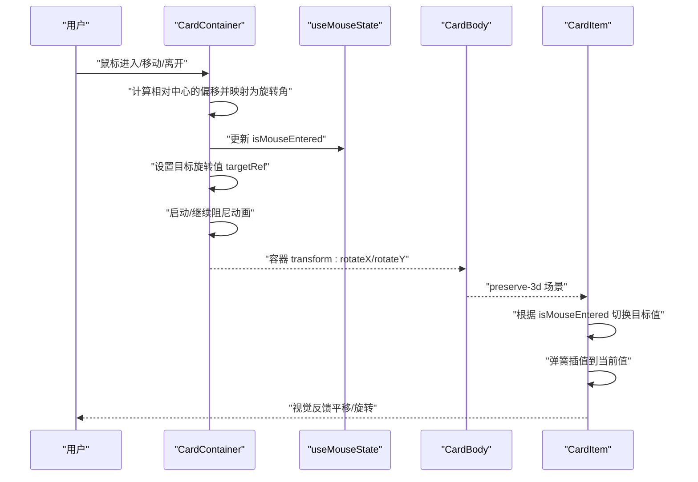
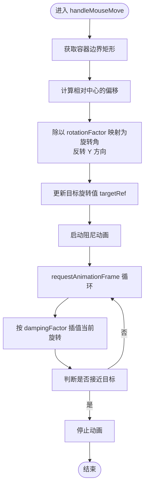
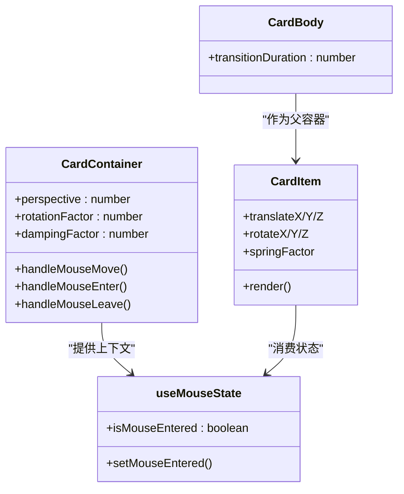
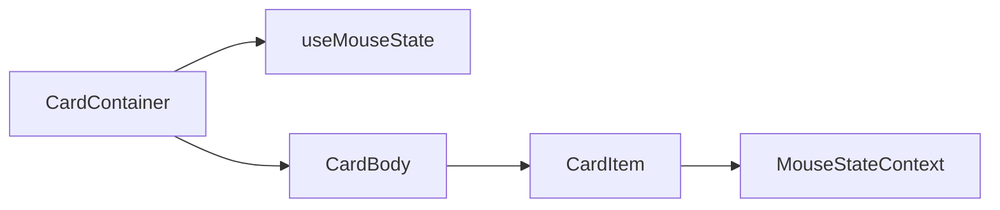

# 3D卡片效果

<cite>
**本文引用的文件**
- [CardContainer.tsx](file://blog-system2/frontend/src/components/Home/3DCardEffect/CardContainer.tsx)
- [useMouseState.ts](file://blog-system2/frontend/src/components/Home/3DCardEffect/useMouseState.ts)
- [CardBody.tsx](file://blog-system2/frontend/src/components/Home/3DCardEffect/CardBody.tsx)
- [CardItem.tsx](file://blog-system2/frontend/src/components/Home/3DCardEffect/CardItem.tsx)
- [page.tsx](file://blog-system2/frontend/src/app/page.tsx)
</cite>

## 目录
1. [简介](#简介)
2. [项目结构](#项目结构)
3. [核心组件](#核心组件)
4. [架构总览](#架构总览)
5. [详细组件分析](#详细组件分析)
6. [依赖分析](#依赖分析)
7. [性能考虑](#性能考虑)
8. [故障排查指南](#故障排查指南)
9. [结论](#结论)
10. [附录：API 参考与配置参数](#附录api-参考与配置参数)

## 简介
本技术文档围绕 3D 卡片效果的实现展开，重点解析以下内容：
- CardContainer 组件如何通过 Three.js 风格的 3D 变换矩阵（旋转）实现鼠标悬停时的自然倾斜反馈
- 鼠标位置到旋转角度的映射算法与阻尼动画的物理模拟
- useMouseState 钩子的状态管理机制（进入、移动、离开）
- CardBody 与 CardItem 的层级关系、样式传递与 transformStyle 的协同
- 关键配置项：perspective 透视距离、rotationFactor 旋转因子、dampingFactor 阻尼系数的原理与调优
- 移动端触摸事件适配与性能优化策略
- 完整 API 参考、配置参数说明与可扩展点

## 项目结构
该功能位于 Home 页面的 3D 卡片模块中，采用“容器 + 内容体 + 子项”的分层设计：
- CardContainer：3D 容器，负责鼠标事件监听、旋转目标值计算与阻尼动画
- CardBody：卡片主体，承载子项并设置 3D 变换保留
- CardItem：子项元素，基于鼠标状态与属性配置执行平移/旋转动画
- useMouseState：共享的鼠标进入状态钩子，供子项感知容器交互状态

图表来源
- [page.tsx:983-1056](file://blog-system2/frontend/src/app/page.tsx#L983-L1056)
- [CardContainer.tsx:19-120](file://blog-system2/frontend/src/components/Home/3DCardEffect/CardContainer.tsx#L19-L120)
- [CardBody.tsx:12-29](file://blog-system2/frontend/src/components/Home/3DCardEffect/CardBody.tsx#L12-L29)
- [CardItem.tsx:34-135](file://blog-system2/frontend/src/components/Home/3DCardEffect/CardItem.tsx#L34-L135)
- [useMouseState.ts:3-10](file://blog-system2/frontend/src/components/Home/3DCardEffect/useMouseState.ts#L3-L10)

章节来源
- [page.tsx:983-1056](file://blog-system2/frontend/src/app/page.tsx#L983-L1056)

## 核心组件
- CardContainer：提供 3D 容器与透视环境，计算鼠标相对容器中心的偏移并映射为旋转角，结合阻尼动画实现顺滑过渡；同时暴露上下文给子项使用。
- CardBody：作为 3D 场景中的“卡片平面”，设置 preserve-3d 以保证子项的 3D 叠加效果。
- CardItem：根据容器状态与 props 中的平移/旋转参数，在进入/离开时切换目标值，并通过弹簧式插值实现自然动画。
- useMouseState：轻量级状态钩子，仅维护 isMouseEntered 布尔值，供子项决定是否应用 3D 变换。

章节来源
- [CardContainer.tsx:19-120](file://blog-system2/frontend/src/components/Home/3DCardEffect/CardContainer.tsx#L19-L120)
- [CardBody.tsx:12-29](file://blog-system2/frontend/src/components/Home/3DCardEffect/CardBody.tsx#L12-L29)
- [CardItem.tsx:34-135](file://blog-system2/frontend/src/components/Home/3DCardEffect/CardItem.tsx#L34-L135)
- [useMouseState.ts:3-10](file://blog-system2/frontend/src/components/Home/3DCardEffect/useMouseState.ts#L3-L10)

## 架构总览
下图展示了从用户交互到 3D 变换的完整流程：鼠标事件 → 计算旋转目标 → 阻尼插值 → 应用 transform。

图表来源
- [CardContainer.tsx:78-99](file://blog-system2/frontend/src/components/Home/3DCardEffect/CardContainer.tsx#L78-L99)
- [CardContainer.tsx:47-76](file://blog-system2/frontend/src/components/Home/3DCardEffect/CardContainer.tsx#L47-L76)
- [useMouseState.ts:3-10](file://blog-system2/frontend/src/components/Home/3DCardEffect/useMouseState.ts#L3-L10)
- [CardItem.tsx:67-122](file://blog-system2/frontend/src/components/Home/3DCardEffect/CardItem.tsx#L67-L122)

## 详细组件分析

### CardContainer：3D 容器与阻尼旋转
- 透视与容器层级
  - 外层容器设置 perspective，形成 3D 视觉空间
  - 内层容器设置 transform-style: preserve-3d，确保子项在 3D 空间内正确叠放
- 鼠标位置到旋转角度映射
  - 获取容器边界矩形，计算鼠标相对中心的偏移
  - 将偏移除以 rotationFactor 得到目标旋转角（弧度近似），并反转 Y 轴方向
- 阻尼动画
  - 使用 requestAnimationFrame 循环，按 1 - dampingFactor 的因子插值当前旋转到目标
  - 当累积误差小于阈值时停止动画，避免不必要的帧循环
- 状态与生命周期
  - 初始化检测是否为触摸设备（hover:none 且 pointer:coarse）
  - 清理动画资源，防止内存泄漏

图表来源
- [CardContainer.tsx:78-99](file://blog-system2/frontend/src/components/Home/3DCardEffect/CardContainer.tsx#L78-L99)
- [CardContainer.tsx:47-76](file://blog-system2/frontend/src/components/Home/3DCardEffect/CardContainer.tsx#L47-L76)

章节来源
- [CardContainer.tsx:19-120](file://blog-system2/frontend/src/components/Home/3DCardEffect/CardContainer.tsx#L19-L120)

### useMouseState：状态钩子
- 功能：提供 isMouseEntered 布尔状态与 setter，供子组件感知容器交互状态
- 设计：最小化状态粒度，避免额外依赖，便于跨组件共享

章节来源
- [useMouseState.ts:3-10](file://blog-system2/frontend/src/components/Home/3DCardEffect/useMouseState.ts#L3-L10)

### CardBody：3D 主体与样式传递
- 设置 transform-style: preserve-3d，使子项的 3D 叠加生效
- 提供 transitionDuration 控制阴影等视觉属性的过渡时间
- 使用 will-change: transform, box-shadow 提升渲染性能

章节来源
- [CardBody.tsx:12-29](file://blog-system2/frontend/src/components/Home/3DCardEffect/CardBody.tsx#L12-L29)

### CardItem：层级关系与弹簧动画
- 层级关系
  - CardItem 作为 CardBody 的直接子节点，处于同一 3D 场景中
  - 通过 translateZ/rotateX/Y/Z 实现前后层次与倾斜效果
- 状态驱动
  - 当容器进入时，targetRef 设为 props 中的平移/旋转参数
  - 离开时，targetRef 回归为 0，回到初始态
- 弹簧插值
  - 使用 springFactor 对六个自由度（x/y/z/roll/pitch/yaw）进行插值
  - 当累计误差低于阈值时停止动画，减少帧消耗

图表来源
- [CardContainer.tsx:10-17](file://blog-system2/frontend/src/components/Home/3DCardEffect/CardContainer.tsx#L10-L17)
- [useMouseState.ts:3-10](file://blog-system2/frontend/src/components/Home/3DCardEffect/useMouseState.ts#L3-L10)
- [CardBody.tsx:6-10](file://blog-system2/frontend/src/components/Home/3DCardEffect/CardBody.tsx#L6-L10)
- [CardItem.tsx:7-32](file://blog-system2/frontend/src/components/Home/3DCardEffect/CardItem.tsx#L7-L32)

章节来源
- [CardItem.tsx:34-135](file://blog-system2/frontend/src/components/Home/3DCardEffect/CardItem.tsx#L34-L135)

### 数学原理与算法要点
- 3D 变换矩阵（概念性说明）
  - 本实现未直接使用 Three.js 矩阵库，而是通过 CSS 3D 变换表达等效效果
  - 容器的 rotateX/rotateY 形成绕 X/Y 轴的旋转；子项的 translateZ/rotateX/Y/Z 形成深度与倾斜
- 鼠标位置到旋转映射
  - 相对中心偏移经 rotationFactor 归一化，得到旋转角（度）
  - Y 轴方向取反以符合视觉直觉（上倾/下压）
- 阻尼与弹簧插值
  - 阻尼：当前值 = 上一值 + (目标值 - 上一值) × factor，factor = 1 - dampingFactor
  - 弹簧：当前值 = 上一值 + (目标值 - 上一值) × springFactor，springFactor ∈ (0,1)

章节来源
- [CardContainer.tsx:78-99](file://blog-system2/frontend/src/components/Home/3DCardEffect/CardContainer.tsx#L78-L99)
- [CardContainer.tsx:47-76](file://blog-system2/frontend/src/components/Home/3DCardEffect/CardContainer.tsx#L47-L76)
- [CardItem.tsx:85-116](file://blog-system2/frontend/src/components/Home/3DCardEffect/CardItem.tsx#L85-L116)

## 依赖分析
- 组件耦合
  - CardContainer 与 useMouseState 通过 Context 解耦，降低耦合度
  - CardItem 依赖 CardContainer 的上下文，但不直接依赖 DOM 或第三方库
- 外部依赖
  - 无外部 3D 引擎依赖，纯 CSS 3D + requestAnimationFrame
- 潜在风险
  - 阻尼/弹簧插值在极端参数下可能出现抖动或延迟，需通过参数校准

图表来源
- [CardContainer.tsx:6-8](file://blog-system2/frontend/src/components/Home/3DCardEffect/CardContainer.tsx#L6-L8)
- [CardItem.tsx:48](file://blog-system2/frontend/src/components/Home/3DCardEffect/CardItem.tsx#L48)

章节来源
- [CardContainer.tsx:19-120](file://blog-system2/frontend/src/components/Home/3DCardEffect/CardContainer.tsx#L19-L120)
- [CardItem.tsx:34-135](file://blog-system2/frontend/src/components/Home/3DCardEffect/CardItem.tsx#L34-L135)

## 性能考虑
- 动画帧控制
  - 使用 requestAnimationFrame 启动/推进动画，避免定时器造成的卡顿
  - 当接近目标值时主动停止动画，减少无效帧
- 视觉提示
  - CardBody 设置 will-change: transform, box-shadow，提升合成层优化概率
- 触摸设备适配
  - 通过媒体查询检测触摸设备，避免在触摸设备上启用鼠标专属动画
- 进一步优化建议
  - 对高频事件（mousemove）做节流/去抖
  - 在大容器上限制动画范围，仅在可视区域附近启用
  - 使用 transform3d 替代复杂阴影/滤镜以减少重排重绘

章节来源
- [CardContainer.tsx:36-37](file://blog-system2/frontend/src/components/Home/3DCardEffect/CardContainer.tsx#L36-L37)
- [CardContainer.tsx:67-70](file://blog-system2/frontend/src/components/Home/3DCardEffect/CardContainer.tsx#L67-L70)
- [CardBody.tsx:20-24](file://blog-system2/frontend/src/components/Home/3DCardEffect/CardBody.tsx#L20-L24)
- [CardItem.tsx:56-57](file://blog-system2/frontend/src/components/Home/3DCardEffect/CardItem.tsx#L56-L57)
- [CardItem.tsx:105-111](file://blog-system2/frontend/src/components/Home/3DCardEffect/CardItem.tsx#L105-L111)

## 故障排查指南
- 现象：鼠标移动无响应
  - 检查容器是否设置了 transform-style: preserve-3d
  - 确认是否在触摸设备上运行（触摸设备会禁用鼠标动画）
- 现象：旋转过度或不足
  - 调整 rotationFactor，增大使更敏感，减小使更柔和
- 现象：动画卡顿或延迟
  - 调整 dampingFactor/springFactor，使插值更平滑
  - 检查是否有过多元素参与 3D 变换
- 现象：离开后不回弹
  - 确认 handleMouseLeave 是否被触发，以及 targetRef 是否被置零

章节来源
- [CardContainer.tsx:105-110](file://blog-system2/frontend/src/components/Home/3DCardEffect/CardContainer.tsx#L105-L110)
- [CardContainer.tsx:94-99](file://blog-system2/frontend/src/components/Home/3DCardEffect/CardContainer.tsx#L94-L99)
- [CardItem.tsx:78-80](file://blog-system2/frontend/src/components/Home/3DCardEffect/CardItem.tsx#L78-L80)

## 结论
该 3D 卡片效果通过“容器 + 主体 + 子项”的分层结构与轻量状态钩子，实现了自然的鼠标交互反馈。其核心在于：
- 将鼠标偏移映射为旋转角
- 使用阻尼/弹簧插值实现顺滑动画
- 通过 preserve-3d 与 translateZ/rotateX/Y/Z 构建层次感
- 针对触摸设备的适配与性能优化

开发者可在现有基础上扩展更多子项类型、自定义变换曲线或引入更复杂的 3D 参数组合。

## 附录：API 参考与配置参数

### CardContainer Props
- children：React 节点，子项容器
- className：字符串，容器类名
- containerClassName：字符串，外层容器类名
- rotationFactor：数字，默认 15，影响鼠标偏移到旋转角的映射灵敏度
- perspective：数字，默认 1200，CSS 透视距离，影响 3D 视觉强度
- dampingFactor：数字，默认 0.9，阻尼系数，越接近 1 越“慢”越顺滑

章节来源
- [CardContainer.tsx:10-17](file://blog-system2/frontend/src/components/Home/3DCardEffect/CardContainer.tsx#L10-L17)

### CardBody Props
- children：React 节点
- className：字符串，主体类名
- transitionDuration：数字，默认 200，过渡持续时间（ms）

章节来源
- [CardBody.tsx:6-10](file://blog-system2/frontend/src/components/Home/3DCardEffect/CardBody.tsx#L6-L10)

### CardItem Props
- children：React 节点
- className：字符串，子项类名
- as：字符串，默认 "div"，支持 div/a/button/p/h1-h6/span
- translateX/translateY/translateZ：数字或字符串，默认 0，控制平移
- rotateX/rotateY/rotateZ：数字或字符串，默认 0，控制旋转
- springFactor：数字，默认 0.15，弹簧插值系数
- 其他：透传给底层元素（如 href、onClick 等）

章节来源
- [CardItem.tsx:7-32](file://blog-system2/frontend/src/components/Home/3DCardEffect/CardItem.tsx#L7-L32)

### 使用示例（路径）
- 在页面中引入并嵌套使用：[page.tsx:983-1056](file://blog-system2/frontend/src/app/page.tsx#L983-L1056)