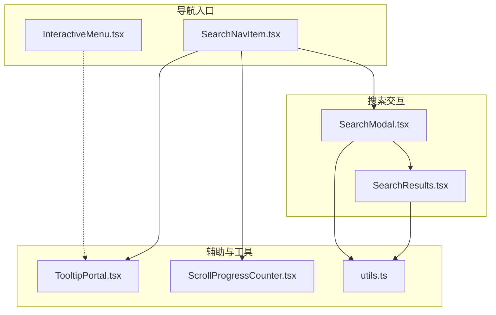
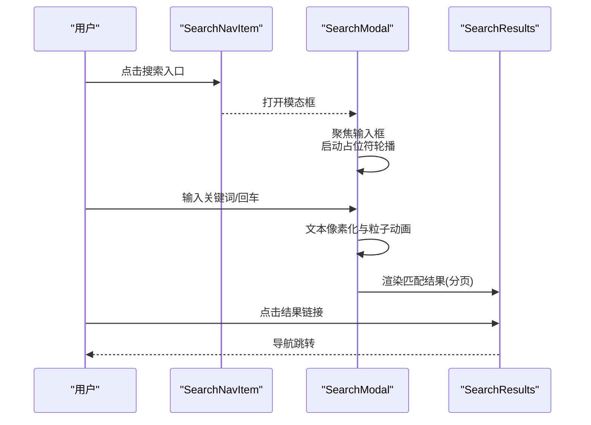
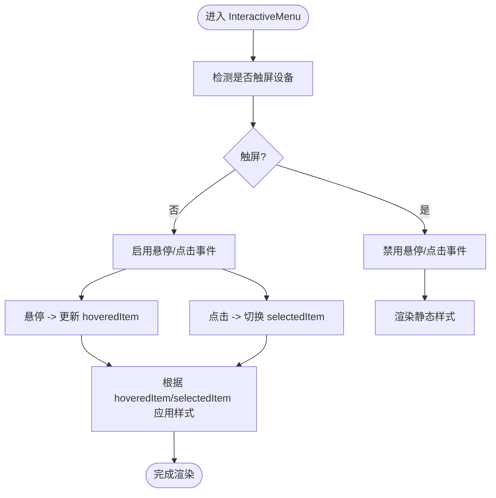
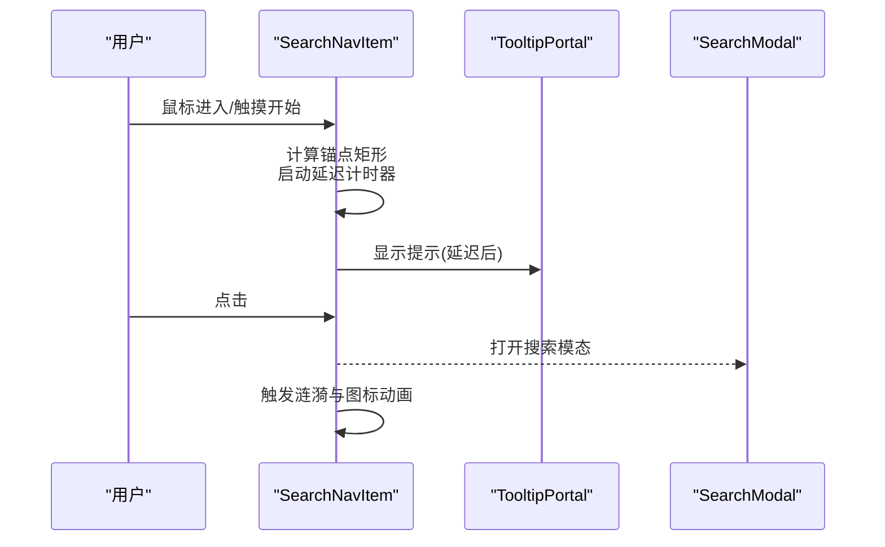
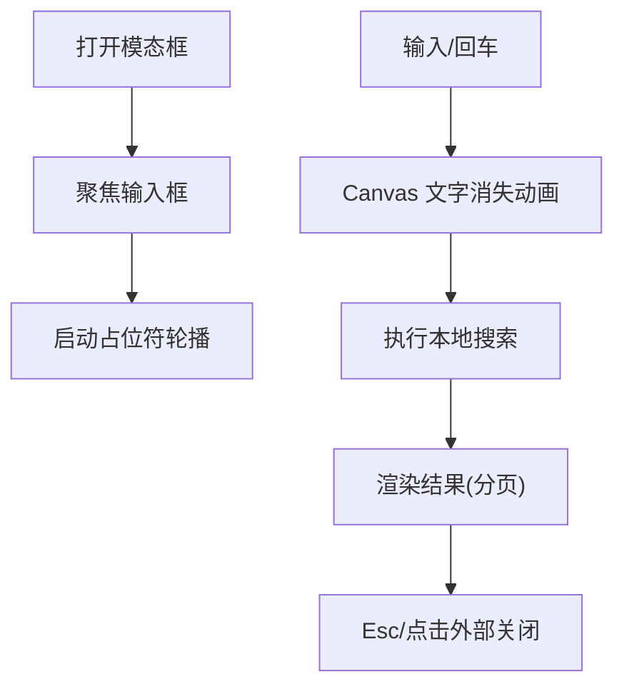
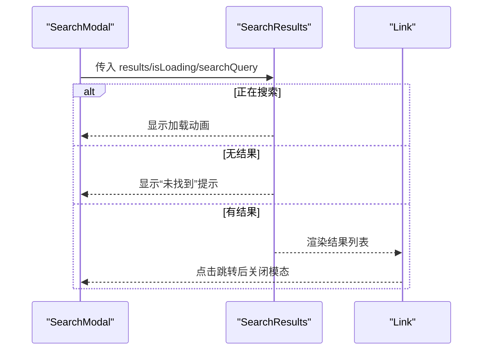
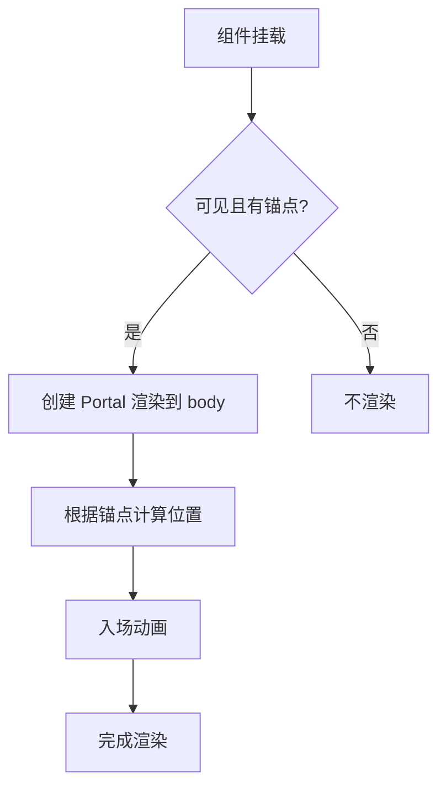
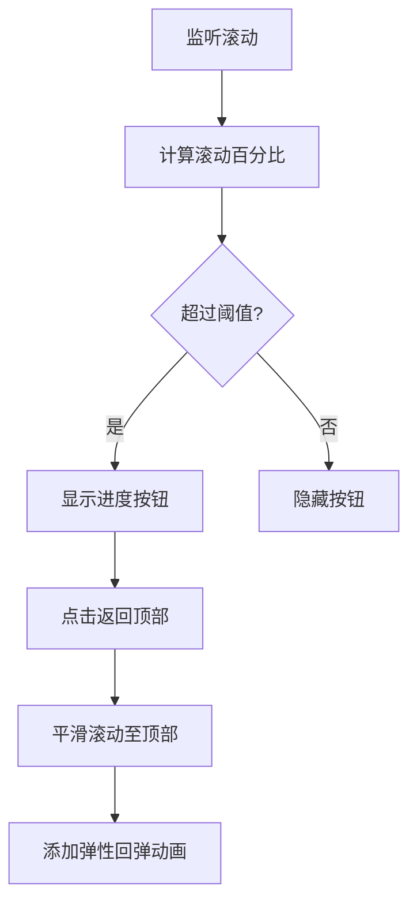
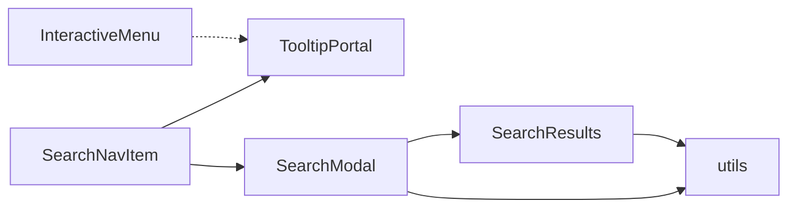

# 交互菜单设计

<cite>
**本文引用的文件**
- [InteractiveMenu.tsx](file://blog-system2/frontend/src/components/Home/InteractiveMenu.tsx)
- [SearchNavItem.tsx](file://blog-system2/frontend/src/components/Home/SearchNavItem.tsx)
- [SearchModal.tsx](file://blog-system2/frontend/src/components/Search/SearchModal.tsx)
- [SearchResults.tsx](file://blog-system2/frontend/src/components/Search/SearchResults.tsx)
- [TooltipPortal.tsx](file://blog-system2/frontend/src/components/Home/TooltipPortal.tsx)
- [ScrollProgressCounter.tsx](file://blog-system2/frontend/src/components/Home/ScrollProgressCounter.tsx)
- [utils.ts](file://blog-system2/frontend/src/lib/utils.ts)
- [page.tsx](file://blog-system2/frontend/src/app/page.tsx)
</cite>

## 目录
1. [引言](#引言)
2. [项目结构](#项目结构)
3. [核心组件](#核心组件)
4. [架构总览](#架构总览)
5. [详细组件分析](#详细组件分析)
6. [依赖关系分析](#依赖关系分析)
7. [性能考虑](#性能考虑)
8. [故障排查指南](#故障排查指南)
9. [结论](#结论)
10. [附录](#附录)

## 引言
本技术文档围绕交互菜单系统展开，重点解析以下能力：
- InteractiveMenu 组件的动态定位、悬停与点击响应机制
- SearchModal 与 SearchResults 的搜索交互流程（含键盘导航、结果高亮与跳转）
- 菜单状态管理、焦点控制与无障碍访问
- 移动端菜单适配与手势支持策略
- 动画效果配置与自定义样式方法
- 性能优化与内存泄漏防护
- 便于开发者理解与扩展的实现要点

## 项目结构
交互菜单系统由“导航入口”“搜索模态”“结果列表”“提示气泡”“滚动进度”等模块协同组成，采用客户端组件与动画库结合的方式实现流畅体验。

图示来源
- [SearchNavItem.tsx:17-214](file://blog-system2/frontend/src/components/Home/SearchNavItem.tsx#L17-L214)
- [InteractiveMenu.tsx:16-71](file://blog-system2/frontend/src/components/Home/InteractiveMenu.tsx#L16-L71)
- [SearchModal.tsx:22-935](file://blog-system2/frontend/src/components/Search/SearchModal.tsx#L22-L935)
- [SearchResults.tsx:24-96](file://blog-system2/frontend/src/components/Search/SearchResults.tsx#L24-L96)
- [TooltipPortal.tsx:13-56](file://blog-system2/frontend/src/components/Home/TooltipPortal.tsx#L13-L56)
- [ScrollProgressCounter.tsx:10-241](file://blog-system2/frontend/src/components/Home/ScrollProgressCounter.tsx#L10-L241)
- [utils.ts:4-6](file://blog-system2/frontend/src/lib/utils.ts#L4-L6)

章节来源
- [SearchNavItem.tsx:17-214](file://blog-system2/frontend/src/components/Home/SearchNavItem.tsx#L17-L214)
- [InteractiveMenu.tsx:16-71](file://blog-system2/frontend/src/components/Home/InteractiveMenu.tsx#L16-L71)
- [SearchModal.tsx:22-935](file://blog-system2/frontend/src/components/Search/SearchModal.tsx#L22-L935)
- [SearchResults.tsx:24-96](file://blog-system2/frontend/src/components/Search/SearchResults.tsx#L24-L96)
- [TooltipPortal.tsx:13-56](file://blog-system2/frontend/src/components/Home/TooltipPortal.tsx#L13-L56)
- [ScrollProgressCounter.tsx:10-241](file://blog-system2/frontend/src/components/Home/ScrollProgressCounter.tsx#L10-L241)
- [utils.ts:4-6](file://blog-system2/frontend/src/lib/utils.ts#L4-L6)

## 核心组件
- InteractiveMenu：右侧动态菜单，支持悬停高亮、点击选中、移动端触控屏蔽与渐变样式
- SearchNavItem：导航中的搜索入口，具备图标动画、延时提示、触摸涟漪与电路背景
- SearchModal：搜索弹窗，含占位符轮播、输入动画、结果分页与键盘关闭
- SearchResults：搜索结果列表，支持加载态、空结果提示与结果高亮
- TooltipPortal：提示气泡，使用 Portal 渲染至 body，随锚点定位
- ScrollProgressCounter：移动端返回顶部进度计数器，带弹性回弹动画
- utils：通用类名合并工具

章节来源
- [InteractiveMenu.tsx:16-71](file://blog-system2/frontend/src/components/Home/InteractiveMenu.tsx#L16-L71)
- [SearchNavItem.tsx:17-214](file://blog-system2/frontend/src/components/Home/SearchNavItem.tsx#L17-L214)
- [SearchModal.tsx:22-935](file://blog-system2/frontend/src/components/Search/SearchModal.tsx#L22-L935)
- [SearchResults.tsx:24-96](file://blog-system2/frontend/src/components/Search/SearchResults.tsx#L24-L96)
- [TooltipPortal.tsx:13-56](file://blog-system2/frontend/src/components/Home/TooltipPortal.tsx#L13-L56)
- [ScrollProgressCounter.tsx:10-241](file://blog-system2/frontend/src/components/Home/ScrollProgressCounter.tsx#L10-L241)
- [utils.ts:4-6](file://blog-system2/frontend/src/lib/utils.ts#L4-L6)

## 架构总览
交互菜单系统通过“入口触发 -> 模态呈现 -> 结果渲染 -> 跳转导航”的链路完成端到端交互；同时配合提示与进度组件提升可用性与可访问性。

图示来源
- [SearchNavItem.tsx:128-139](file://blog-system2/frontend/src/components/Home/SearchNavItem.tsx#L128-L139)
- [SearchModal.tsx:115-122](file://blog-system2/frontend/src/components/Search/SearchModal.tsx#L115-L122)
- [SearchModal.tsx:64-95](file://blog-system2/frontend/src/components/Search/SearchModal.tsx#L64-L95)
- [SearchModal.tsx:276-298](file://blog-system2/frontend/src/components/Search/SearchModal.tsx#L276-L298)
- [SearchModal.tsx:300-428](file://blog-system2/frontend/src/components/Search/SearchModal.tsx#L300-L428)
- [SearchResults.tsx:52-94](file://blog-system2/frontend/src/components/Search/SearchResults.tsx#L52-L94)

## 详细组件分析

### InteractiveMenu 组件
- 动态定位与悬停效果
  - 基于媒体查询识别触屏设备，对悬停/点击事件进行条件绑定
  - 通过状态机维护 hoveredItem 与 selectedItem，实现“主次层级”视觉差异
  - 使用过渡与字体尺寸变化表达聚焦与选中状态
- 点击响应机制
  - 在非触屏设备上支持点击切换选中项；触屏设备默认禁用该行为
- 样式与动画
  - 使用缓动曲线与持续时间统一动画节奏，保证顺滑体验
  - 选中态下附加强调色点，增强可识别性

图示来源
- [InteractiveMenu.tsx:16-71](file://blog-system2/frontend/src/components/Home/InteractiveMenu.tsx#L16-L71)

章节来源
- [InteractiveMenu.tsx:16-71](file://blog-system2/frontend/src/components/Home/InteractiveMenu.tsx#L16-L71)

### SearchNavItem 组件
- 入口触发与动画
  - 点击触发打开搜索模态框；图标支持缩放、边距与涟漪反馈
  - 根据窗口宽度动态调整动画幅度，移动端更收敛
- 提示气泡
  - 延迟显示提示文本，使用 Portal 将气泡渲染至 body，避免层级遮挡
  - 监听滚动与窗口尺寸变化，实时更新锚点矩形，保证定位准确
- 电路背景与搜索态
  - SVG 电路路径与 LED 点闪烁，配合搜索态高亮提示

图示来源
- [SearchNavItem.tsx:42-88](file://blog-system2/frontend/src/components/Home/SearchNavItem.tsx#L42-L88)
- [SearchNavItem.tsx:128-139](file://blog-system2/frontend/src/components/Home/SearchNavItem.tsx#L128-L139)
- [TooltipPortal.tsx:29-54](file://blog-system2/frontend/src/components/Home/TooltipPortal.tsx#L29-L54)

章节来源
- [SearchNavItem.tsx:17-214](file://blog-system2/frontend/src/components/Home/SearchNavItem.tsx#L17-L214)
- [TooltipPortal.tsx:13-56](file://blog-system2/frontend/src/components/Home/TooltipPortal.tsx#L13-L56)

### SearchModal 组件
- 状态与生命周期
  - 打开时聚焦输入框、启动占位符轮播；关闭时重置状态
  - 支持点击外部区域与 Esc 键关闭
- 搜索与结果
  - 本地聚合 posts、notices、resources、about 四类数据源
  - 高亮命中关键词，去重后分页展示
- 动画与输入体验
  - Canvas 文本像素化与粒子扩散动画，移动端跳过动画直连搜索
  - 输入框禁用透明文本期间禁止交互，避免误触
- 分页与键盘导航
  - 结果分页，键盘 Enter 触发搜索

图示来源
- [SearchModal.tsx:115-122](file://blog-system2/frontend/src/components/Search/SearchModal.tsx#L115-L122)
- [SearchModal.tsx:64-95](file://blog-system2/frontend/src/components/Search/SearchModal.tsx#L64-L95)
- [SearchModal.tsx:276-298](file://blog-system2/frontend/src/components/Search/SearchModal.tsx#L276-L298)
- [SearchModal.tsx:300-428](file://blog-system2/frontend/src/components/Search/SearchModal.tsx#L300-L428)
- [SearchModal.tsx:443-472](file://blog-system2/frontend/src/components/Search/SearchModal.tsx#L443-L472)

章节来源
- [SearchModal.tsx:22-935](file://blog-system2/frontend/src/components/Search/SearchModal.tsx#L22-L935)

### SearchResults 组件
- 加载态与空结果
  - 搜索中显示旋转指示器与提示文案
  - 无结果时提示“未找到”
- 结果高亮与跳转
  - 标题与摘要使用高亮标记包裹，安全注入 HTML
  - 点击结果链接触发页面跳转，关闭模态框

图示来源
- [SearchResults.tsx:24-96](file://blog-system2/frontend/src/components/Search/SearchResults.tsx#L24-L96)

章节来源
- [SearchResults.tsx:24-96](file://blog-system2/frontend/src/components/Search/SearchResults.tsx#L24-L96)

### TooltipPortal 组件
- Portal 渲染
  - 将提示气泡挂载到 document.body，避免父级 overflow 或层级问题
- 定位与动画
  - 基于锚点矩形计算定位，添加轻微偏移与箭头三角
  - 进入/退出使用轻量动画，保证流畅且低开销

图示来源
- [TooltipPortal.tsx:13-56](file://blog-system2/frontend/src/components/Home/TooltipPortal.tsx#L13-L56)

章节来源
- [TooltipPortal.tsx:13-56](file://blog-system2/frontend/src/components/Home/TooltipPortal.tsx#L13-L56)

### ScrollProgressCounter 组件（移动端适配）
- 滚动进度与可见性
  - 监听滚动计算百分比，超过阈值显示按钮
  - 底部状态显示“顶部”文案并触发弹性回弹动画
- 返回顶部交互
  - 平滑滚动至顶部，二次强制滚动确保稳定到达
  - 使用布局动画与弹性关键帧增强手感

图示来源
- [ScrollProgressCounter.tsx:47-123](file://blog-system2/frontend/src/components/Home/ScrollProgressCounter.tsx#L47-L123)

章节来源
- [ScrollProgressCounter.tsx:10-241](file://blog-system2/frontend/src/components/Home/ScrollProgressCounter.tsx#L10-L241)

## 依赖关系分析
- 组件耦合
  - SearchNavItem 作为入口，依赖 TooltipPortal 与 SearchModal
  - SearchModal 依赖 utils 类名合并工具，内部组合 SearchResults
  - InteractiveMenu 与 TooltipPortal 独立存在，互不直接依赖
- 外部依赖
  - 动画与布局：framer-motion、Tailwind CSS
  - 图标：react-icons
  - 工具函数：clsx、tailwind-merge

图示来源
- [SearchNavItem.tsx:17-214](file://blog-system2/frontend/src/components/Home/SearchNavItem.tsx#L17-L214)
- [SearchModal.tsx:22-935](file://blog-system2/frontend/src/components/Search/SearchModal.tsx#L22-L935)
- [SearchResults.tsx:24-96](file://blog-system2/frontend/src/components/Search/SearchResults.tsx#L24-L96)
- [utils.ts:4-6](file://blog-system2/frontend/src/lib/utils.ts#L4-L6)
- [InteractiveMenu.tsx:16-71](file://blog-system2/frontend/src/components/Home/InteractiveMenu.tsx#L16-L71)

章节来源
- [SearchNavItem.tsx:17-214](file://blog-system2/frontend/src/components/Home/SearchNavItem.tsx#L17-L214)
- [SearchModal.tsx:22-935](file://blog-system2/frontend/src/components/Search/SearchModal.tsx#L22-L935)
- [SearchResults.tsx:24-96](file://blog-system2/frontend/src/components/Search/SearchResults.tsx#L24-L96)
- [utils.ts:4-6](file://blog-system2/frontend/src/lib/utils.ts#L4-L6)
- [InteractiveMenu.tsx:16-71](file://blog-system2/frontend/src/components/Home/InteractiveMenu.tsx#L16-L71)

## 性能考虑
- 动画与渲染
  - 使用 requestAnimationFrame 控制粒子动画帧率，避免阻塞主线程
  - Canvas 绘制仅在输入变化时触发，减少不必要的重绘
- 内存与事件
  - 所有事件监听在组件卸载时清理，避免内存泄漏
  - 计时器在每次设置前先清理，防止重复定时任务
- 交互节流
  - 搜索输入防抖建议：可在输入回调中加入节流/防抖策略
  - 滚动事件监听建议使用被动监听或节流封装
- 可访问性
  - 为按钮与模态框提供 aria-label 与键盘关闭支持
  - 悬停屏蔽策略避免误触，提升移动端可用性

章节来源
- [SearchModal.tsx:232-298](file://blog-system2/frontend/src/components/Search/SearchModal.tsx#L232-L298)
- [SearchNavItem.tsx:114-120](file://blog-system2/frontend/src/components/Home/SearchNavItem.tsx#L114-L120)
- [SearchModal.tsx:135-169](file://blog-system2/frontend/src/components/Search/SearchModal.tsx#L135-L169)

## 故障排查指南
- 模态框无法关闭
  - 检查点击外部关闭与 Esc 键监听是否正确注册与清理
  - 章节来源: [SearchModal.tsx:135-169](file://blog-system2/frontend/src/components/Search/SearchModal.tsx#L135-L169)
- 搜索无结果或异常
  - 确认数据源接口可达与 JSON 结构一致
  - 检查高亮正则与去重逻辑
  - 章节来源: [SearchModal.tsx:300-428](file://blog-system2/frontend/src/components/Search/SearchModal.tsx#L300-L428)
- 提示气泡位置异常
  - 确保锚点矩形存在且在滚动/窗口尺寸变化时更新
  - 章节来源: [SearchNavItem.tsx:74-88](file://blog-system2/frontend/src/components/Home/SearchNavItem.tsx#L74-L88)
- 动画卡顿
  - 检查 Canvas 帧循环与清理逻辑，避免累积定时器
  - 章节来源: [SearchModal.tsx:232-298](file://blog-system2/frontend/src/components/Search/SearchModal.tsx#L232-L298)

## 结论
交互菜单系统通过入口组件、模态框、结果列表与辅助组件的协作，实现了从触发到跳转的完整交互闭环。其在动画、可访问性与移动端适配上均有明确策略，同时提供了清晰的状态管理与事件清理机制，便于后续扩展与维护。

## 附录
- 动画与样式参考
  - 页面级动画关键帧与类名定义可作为组件动画风格参考
  - 章节来源: [page.tsx:209-247](file://blog-system2/frontend/src/app/page.tsx#L209-L247)