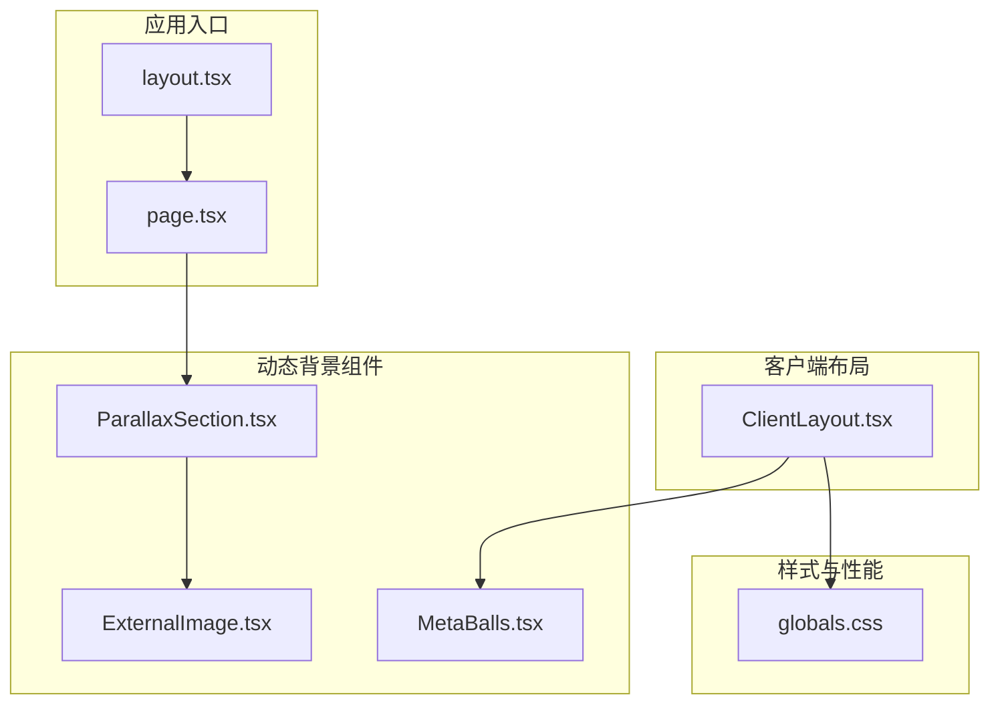
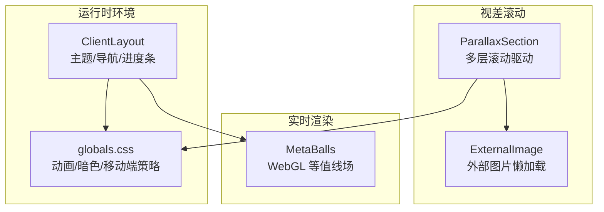
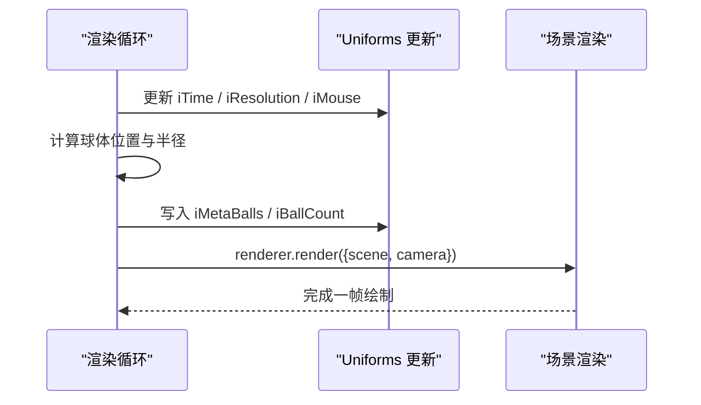
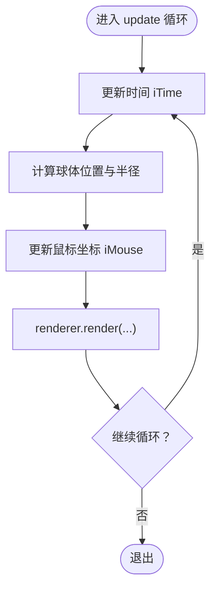
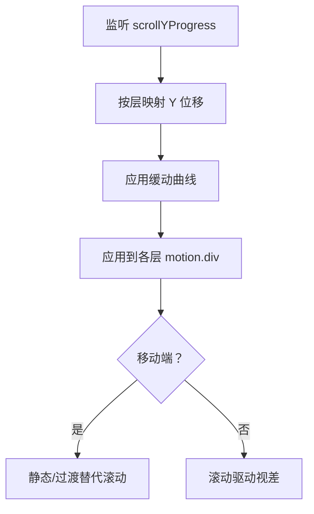
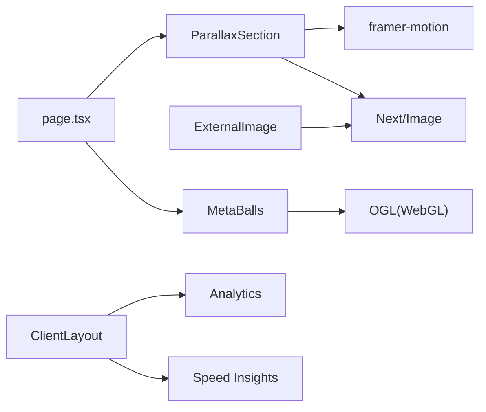

# 动态背景效果

<cite>
**本文引用的文件**
- [MetaBalls.tsx](file://blog-system2/frontend/src/components/reactbits/MetaBalls.tsx)
- [ParallaxSection.tsx](file://blog-system2/frontend/src/components/Home/ParallaxSkeleton/ParallaxSection.tsx)
- [ExternalImage.tsx](file://blog-system2/frontend/src/components/Home/ParallaxSkeleton/ExternalImage.tsx)
- [page.tsx](file://blog-system2/frontend/src/app/page.tsx)
- [globals.css](file://blog-system2/frontend/src/app/globals.css)
- [ClientLayout.tsx](file://blog-system2/frontend/src/components/ClientLayout.tsx)
- [layout.tsx](file://blog-system2/frontend/src/app/layout.tsx)
- [package.json](file://blog-system2/frontend/package.json)
</cite>

## 目录
1. [简介](#简介)
2. [项目结构](#项目结构)
3. [核心组件](#核心组件)
4. [架构总览](#架构总览)
5. [详细组件分析](#详细组件分析)
6. [依赖关系分析](#依赖关系分析)
7. [性能考量](#性能考量)
8. [故障排查指南](#故障排查指南)
9. [结论](#结论)
10. [附录](#附录)

## 简介
本技术文档围绕动态背景效果展开，重点涵盖以下方面：
- MetaBalls 组件的实现原理：等值线算法、颜色混合与实时渲染优化
- 视差滚动效果：滚动速度差异与元素层级管理
- 外部图片加载策略与懒加载实现
- 动态背景的性能优化：Canvas 渲染优化与内存管理
- 配置参数、自定义选项与扩展方法
- 移动端性能适配与电池续航优化策略

目标是帮助开发者创建流畅且美观的动态背景效果。

## 项目结构
该仓库前端采用 Next.js 15 + React 19 + TailwindCSS + framer-motion 的技术栈。动态背景相关的核心文件分布如下：
- MetaBalls：基于 WebGL 的 MetaBalls 实时渲染
- ParallaxSection：多图层视差滚动骨架
- ExternalImage：外部图片懒加载与响应式尺寸
- 页面与样式：主页集成视差背景，全局样式统一动画与性能策略
- 客户端布局：全局主题、导航与性能监控

**图表来源**
- [layout.tsx:28-47](file://blog-system2/frontend/src/app/layout.tsx#L28-L47)
- [page.tsx:498-505](file://blog-system2/frontend/src/app/page.tsx#L498-L505)
- [ClientLayout.tsx:28-62](file://blog-system2/frontend/src/components/ClientLayout.tsx#L28-L62)
- [MetaBalls.tsx:131-320](file://blog-system2/frontend/src/components/reactbits/MetaBalls.tsx#L131-L320)
- [ParallaxSection.tsx:9-197](file://blog-system2/frontend/src/components/Home/ParallaxSkeleton/ParallaxSection.tsx#L9-L197)
- [ExternalImage.tsx:3-16](file://blog-system2/frontend/src/components/Home/ParallaxSkeleton/ExternalImage.tsx#L3-L16)
- [globals.css:217-449](file://blog-system2/frontend/src/app/globals.css#L217-L449)

**章节来源**
- [layout.tsx:28-47](file://blog-system2/frontend/src/app/layout.tsx#L28-L47)
- [page.tsx:498-505](file://blog-system2/frontend/src/app/page.tsx#L498-L505)
- [ClientLayout.tsx:28-62](file://blog-system2/frontend/src/components/ClientLayout.tsx#L28-L62)
- [globals.css:217-449](file://blog-system2/frontend/src/app/globals.css#L217-L449)

## 核心组件
- MetaBalls：基于 OGL 的 WebGL 渲染，实现多球体等值线场与鼠标交互
- ParallaxSection：使用 framer-motion 的滚动驱动视差，分层控制 Y 方向位移
- ExternalImage：Next/Image 的外部资源懒加载与响应式尺寸
- 全局样式：统一动画、暗色主题切换、移动端性能优化策略

**章节来源**
- [MetaBalls.tsx:131-320](file://blog-system2/frontend/src/components/reactbits/MetaBalls.tsx#L131-L320)
- [ParallaxSection.tsx:9-197](file://blog-system2/frontend/src/components/Home/ParallaxSkeleton/ParallaxSection.tsx#L9-L197)
- [ExternalImage.tsx:3-16](file://blog-system2/frontend/src/components/Home/ParallaxSkeleton/ExternalImage.tsx#L3-L16)
- [globals.css:217-449](file://blog-system2/frontend/src/app/globals.css#L217-L449)

## 架构总览
动态背景由“视差滚动骨架 + MetaBalls 实时渲染”构成，配合全局样式与客户端布局进行性能与体验优化。

**图表来源**
- [ParallaxSection.tsx:9-197](file://blog-system2/frontend/src/components/Home/ParallaxSkeleton/ParallaxSection.tsx#L9-L197)
- [ExternalImage.tsx:3-16](file://blog-system2/frontend/src/components/Home/ParallaxSkeleton/ExternalImage.tsx#L3-L16)
- [MetaBalls.tsx:131-320](file://blog-system2/frontend/src/components/reactbits/MetaBalls.tsx#L131-L320)
- [ClientLayout.tsx:28-62](file://blog-system2/frontend/src/components/ClientLayout.tsx#L28-L62)
- [globals.css:217-449](file://blog-system2/frontend/src/app/globals.css#L217-L449)

## 详细组件分析

### MetaBalls 组件分析
- 实现原理
  - 等值线算法：通过多个“球体场函数”叠加形成等值面，片段着色器内对每个像素计算总场强，并以平滑阈值生成边界
  - 颜色混合：根据各球体对总场强的贡献权重，对背景色与鼠标跟随球的颜色进行加权混合
  - 实时渲染：每帧更新时间、球体位置与鼠标坐标，使用 requestAnimationFrame 驱动循环
- 关键点
  - WebGL 初始化与相机设置
  - 球体参数生成：哈希函数生成初相、角速度、半径等，保证随机但稳定
  - 鼠标交互：指针进入/离开状态与平滑插值，避免抖动
  - 性能优化：固定 DPR、按需清理事件与上下文释放

**图表来源**
- [MetaBalls.tsx:256-292](file://blog-system2/frontend/src/components/reactbits/MetaBalls.tsx#L256-L292)

**图表来源**
- [MetaBalls.tsx:256-292](file://blog-system2/frontend/src/components/reactbits/MetaBalls.tsx#L256-L292)

**章节来源**
- [MetaBalls.tsx:131-320](file://blog-system2/frontend/src/components/reactbits/MetaBalls.tsx#L131-L320)

### 视差滚动组件分析
- 实现机制
  - 使用 framer-motion 的 useScroll 与 useTransform，基于 scrollYProgress 控制各层位移
  - 滚动速度差异：不同层使用不同的映射区间与缓动曲线，形成前后景速度差异
  - 元素层级管理：通过 z-index 与绝对定位控制层叠顺序，文本层居中覆盖
- 移动端适配
  - 使用媒体查询检测移动端，直接禁用滚动驱动，改为静态或 CSS 过渡，降低 GPU/CPU 开销
  - 暗色主题下对中景与前景层添加滤镜与渐变遮罩，提升层次感同时保持性能

**图表来源**
- [ParallaxSection.tsx:33-56](file://blog-system2/frontend/src/components/Home/ParallaxSkeleton/ParallaxSection.tsx#L33-L56)

**章节来源**
- [ParallaxSection.tsx:9-197](file://blog-system2/frontend/src/components/Home/ParallaxSkeleton/ParallaxSection.tsx#L9-L197)

### 外部图片加载与懒加载
- 加载策略
  - 使用 Next/Image 的外部资源加载器，通过自定义 loader 直接使用传入 URL
  - 响应式尺寸：sizes 根据屏幕宽度选择合适尺寸，减少带宽占用
  - 懒加载：默认延迟加载，结合 IntersectionObserver 与占位图优化首屏
- 适用场景
  - 视差背景中的外链图片、头像、图标等资源

**章节来源**
- [ExternalImage.tsx:3-16](file://blog-system2/frontend/src/components/Home/ParallaxSkeleton/ExternalImage.tsx#L3-L16)

### 配置参数、自定义选项与扩展方法
- MetaBalls 参数
  - color：背景主色（十六进制）
  - speed：动画速度因子
  - enableMouseInteraction：是否启用鼠标交互
  - hoverSmoothness：鼠标跟随平滑度
  - animationSize：缩放系数，影响坐标系范围
  - ballCount：球体数量（上限 50）
  - clumpFactor：球群聚程度
  - cursorBallSize：鼠标跟随球半径
  - cursorBallColor：鼠标跟随球颜色
  - enableTransparency：是否启用透明背景
- 视差层参数
  - foregroundImage、midgroundImage、backgroundImage、backgroundImageDark：三层图片路径
  - 移动端自动降级，关闭滚动驱动
- 自定义扩展
  - 可在全局样式中增加新的动画与滤镜，配合暗色主题切换
  - 可在页面中组合多个背景层，如 MetaBalls 与视差背景叠加

**章节来源**
- [MetaBalls.tsx:12-23](file://blog-system2/frontend/src/components/reactbits/MetaBalls.tsx#L12-L23)
- [ParallaxSection.tsx:9-19](file://blog-system2/frontend/src/components/Home/ParallaxSkeleton/ParallaxSection.tsx#L9-L19)
- [page.tsx:498-505](file://blog-system2/frontend/src/app/page.tsx#L498-L505)

## 依赖关系分析
- 技术栈
  - 渲染：OGL（WebGL）、Next/Image（图片优化）
  - 动画：framer-motion（滚动驱动）、TailwindCSS（样式与过渡）
  - 性能监控：@vercel/analytics、@vercel/speed-insights
- 组件耦合
  - MetaBalls 与 ClientLayout 解耦，通过全局样式与主题提供一致的视觉与性能策略
  - ParallaxSection 与 ExternalImage 通过 Next/Image 统一图片加载策略
  - page.tsx 作为容器，组合视差背景与其它内容

**图表来源**
- [package.json:13-42](file://blog-system2/frontend/package.json#L13-L42)
- [MetaBalls.tsx:1-10](file://blog-system2/frontend/src/components/reactbits/MetaBalls.tsx#L1-L10)
- [ParallaxSection.tsx:3-7](file://blog-system2/frontend/src/components/Home/ParallaxSkeleton/ParallaxSection.tsx#L3-L7)
- [ExternalImage.tsx:1-1](file://blog-system2/frontend/src/components/Home/ParallaxSkeleton/ExternalImage.tsx#L1-L1)
- [ClientLayout.tsx:8-12](file://blog-system2/frontend/src/components/ClientLayout.tsx#L8-L12)
- [page.tsx:498-505](file://blog-system2/frontend/src/app/page.tsx#L498-L505)

**章节来源**
- [package.json:13-42](file://blog-system2/frontend/package.json#L13-L42)

## 性能考量
- Canvas 渲染优化
  - 固定 DPR：MetaBalls 中使用固定 DPR，避免高分屏带来的额外开销
  - 透明背景：可选透明通道，按需开启以平衡视觉与性能
  - 顶点/几何：使用三角形覆盖全屏，最小化几何复杂度
- 内存管理
  - 卸载时取消动画帧、移除事件监听、从容器移除 canvas、释放 WebGL 上下文
- 移动端适配
  - 滚动驱动降级：移动端禁用滚动驱动视差，改用 CSS 过渡
  - 动画降级：移动端禁用持续动画，减少 GPU/CPU 占用
  - 暗色主题滤镜：在移动端使用更轻量的滤镜与渐变遮罩
- 电池续航优化
  - 降低动画频率与复杂度
  - 避免不必要的合成层与过度重绘
  - 使用 will-change 与 transform3d 提升合成效率（谨慎使用）

**章节来源**
- [MetaBalls.tsx:149-156](file://blog-system2/frontend/src/components/reactbits/MetaBalls.tsx#L149-L156)
- [MetaBalls.tsx:294-302](file://blog-system2/frontend/src/components/reactbits/MetaBalls.tsx#L294-L302)
- [ParallaxSection.tsx:33-42](file://blog-system2/frontend/src/components/Home/ParallaxSkeleton/ParallaxSection.tsx#L33-L42)
- [globals.css:343-364](file://blog-system2/frontend/src/app/globals.css#L343-L364)
- [globals.css:607-681](file://blog-system2/frontend/src/app/globals.css#L607-L681)

## 故障排查指南
- MetaBalls 不显示或全黑
  - 检查 WebGL 支持与上下文创建
  - 确认颜色参数解析正确，透明度设置是否符合预期
  - 校验 iResolution 与 DPR 设置
- 视差滚动卡顿
  - 移动端确认已降级为静态或过渡
  - 检查是否有过多层或复杂滤镜
  - 关注 will-change 与 transform3d 的使用
- 图片加载失败
  - ExternalImage 使用自定义 loader，确保 URL 正确
  - 检查网络与跨域策略
- 性能问题
  - 关闭不必要的动画与滤镜
  - 在移动端禁用持续动画
  - 使用浏览器性能面板定位瓶颈

**章节来源**
- [MetaBalls.tsx:149-156](file://blog-system2/frontend/src/components/reactbits/MetaBalls.tsx#L149-L156)
- [ParallaxSection.tsx:33-42](file://blog-system2/frontend/src/components/Home/ParallaxSkeleton/ParallaxSection.tsx#L33-L42)
- [ExternalImage.tsx:3-16](file://blog-system2/frontend/src/components/Home/ParallaxSkeleton/ExternalImage.tsx#L3-L16)
- [globals.css:343-364](file://blog-system2/frontend/src/app/globals.css#L343-L364)

## 结论
通过 MetaBalls 的等值线场与颜色混合，以及 ParallaxSection 的滚动驱动视差，结合 ExternalImage 的懒加载与全局样式的性能策略，可以构建既美观又高效的动态背景。在移动端采取降级与优化策略，可显著提升用户体验与电池续航表现。

## 附录
- 快速集成步骤
  - 在页面中引入 ParallaxSection 并传入三张背景图
  - 在客户端布局中挂载 MetaBalls，按需开启鼠标交互
  - 使用 ExternalImage 加载外部图片资源
  - 在 globals.css 中根据需要调整动画与滤镜
- 推荐实践
  - 优先使用响应式尺寸与懒加载
  - 移动端禁用持续动画，使用 CSS 过渡
  - 合理设置 MetaBalls 的球体数量与透明度
  - 使用性能监控工具持续评估与优化