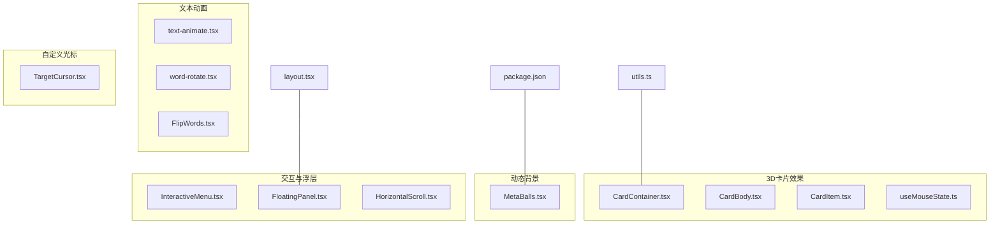
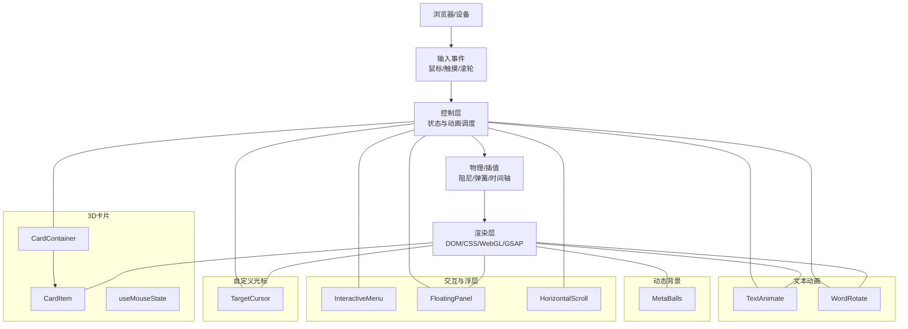
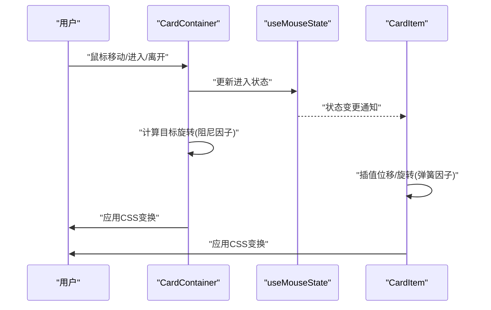
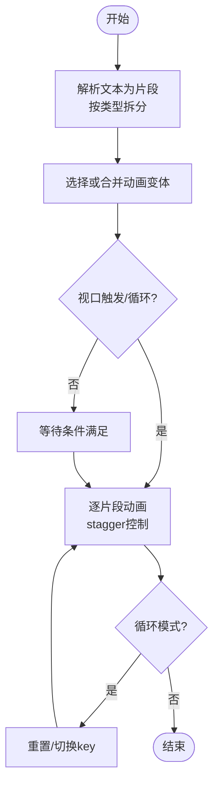
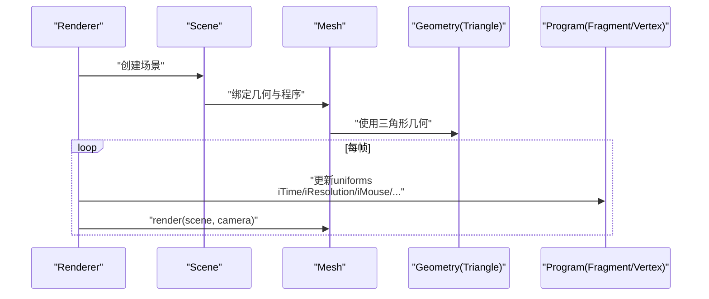
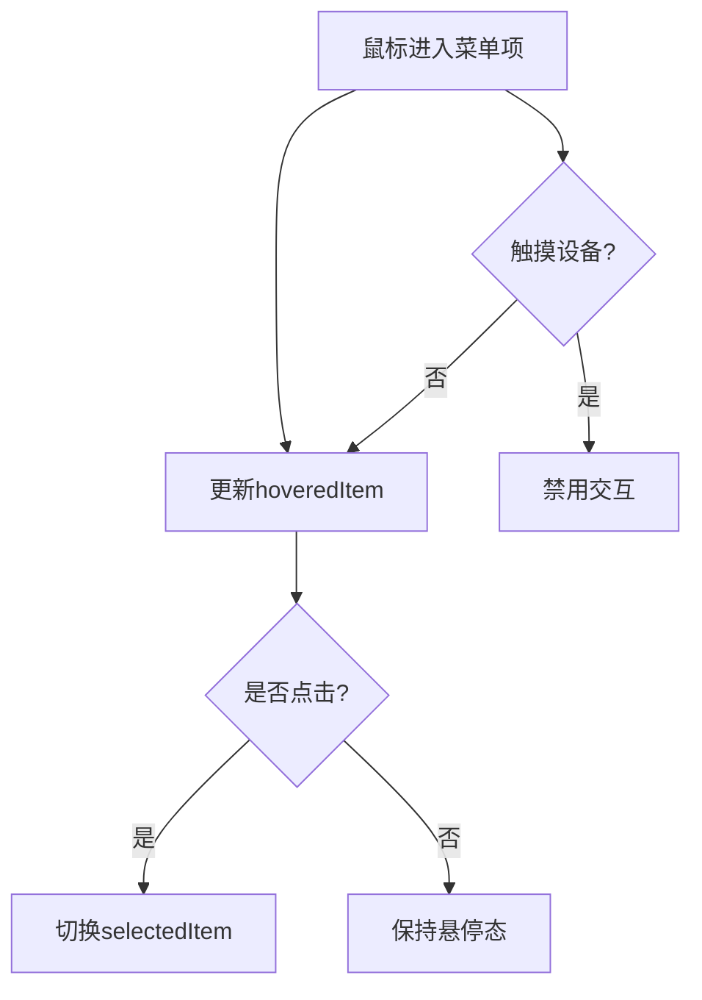
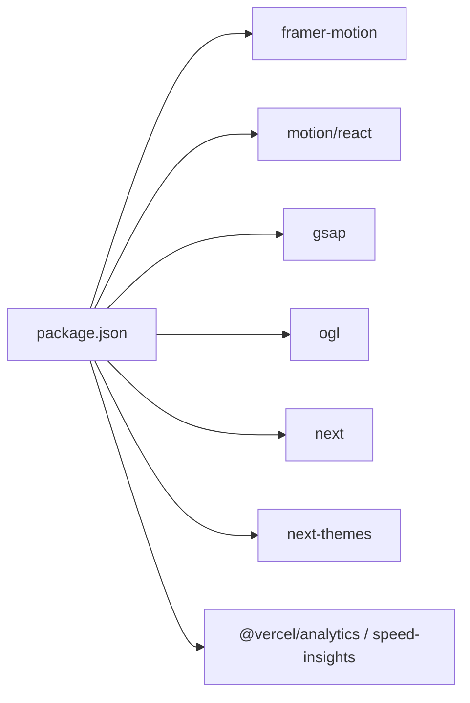

# 动画与交互效果

<cite>
**本文档引用的文件**
- [CardContainer.tsx](file://blog-system2/frontend/src/components/Home/3DCardEffect/CardContainer.tsx)
- [CardBody.tsx](file://blog-system2/frontend/src/components/Home/3DCardEffect/CardBody.tsx)
- [CardItem.tsx](file://blog-system2/frontend/src/components/Home/3DCardEffect/CardItem.tsx)
- [useMouseState.ts](file://blog-system2/frontend/src/components/Home/3DCardEffect/useMouseState.ts)
- [text-animate.tsx](file://blog-system2/frontend/src/components/magicui/text-animate.tsx)
- [word-rotate.tsx](file://blog-system2/frontend/src/components/magicui/word-rotate.tsx)
- [MetaBalls.tsx](file://blog-system2/frontend/src/components/reactbits/MetaBalls.tsx)
- [InteractiveMenu.tsx](file://blog-system2/frontend/src/components/Home/InteractiveMenu.tsx)
- [FloatingPanel.tsx](file://blog-system2/frontend/src/components/Home/FloatingPanel.tsx)
- [FlipWords.tsx](file://blog-system2/frontend/src/components/Home/FlipWords.tsx)
- [HorizontalScroll.tsx](file://blog-system2/frontend/src/components/Home/HorizontalScroll/HorizontalScroll.tsx)
- [TargetCursor.tsx](file://blog-system2/frontend/src/components/reactbits/TargetCursor.tsx)
- [utils.ts](file://blog-system2/frontend/src/lib/utils.ts)
- [package.json](file://blog-system2/frontend/package.json)
- [layout.tsx](file://blog-system2/frontend/src/app/layout.tsx)
</cite>

## 目录
1. [简介](#简介)
2. [项目结构](#项目结构)
3. [核心组件](#核心组件)
4. [架构总览](#架构总览)
5. [详细组件分析](#详细组件分析)
6. [依赖关系分析](#依赖关系分析)
7. [性能考量](#性能考量)
8. [故障排查指南](#故障排查指南)
9. [结论](#结论)
10. [附录](#附录)

## 简介
本技术文档聚焦于该技术博客平台中的动画与交互系统，涵盖以下主题：
- 3D卡片效果的Three.js集成、鼠标跟踪与视觉变换算法
- 文本动画系统：逐字显示、渐变过渡与自定义动画序列
- 交互菜单设计模式与手势响应机制
- MetaBalls等动态背景效果的数学原理与渲染优化
- 动画性能监控与移动端适配策略
- 动画配置参数、自定义选项与扩展方法
- 动画调试技巧与性能分析工具使用指南

## 项目结构
动画与交互相关代码主要分布在以下模块：
- 3D卡片效果：Home/3DCardEffect
- 文本动画：magicui
- 动态背景：reactbits
- 交互菜单与浮层：Home
- 自定义光标：reactbits
- 工具函数：lib/utils
- 依赖管理：package.json
- 全局布局与视口：app/layout.tsx

图表来源
- [CardContainer.tsx:1-121](file://blog-system2/frontend/src/components/Home/3DCardEffect/CardContainer.tsx#L1-L121)
- [CardBody.tsx:1-30](file://blog-system2/frontend/src/components/Home/3DCardEffect/CardBody.tsx#L1-L30)
- [CardItem.tsx:1-136](file://blog-system2/frontend/src/components/Home/3DCardEffect/CardItem.tsx#L1-L136)
- [useMouseState.ts:1-11](file://blog-system2/frontend/src/components/Home/3DCardEffect/useMouseState.ts#L1-L11)
- [text-animate.tsx:1-474](file://blog-system2/frontend/src/components/magicui/text-animate.tsx#L1-L474)
- [word-rotate.tsx:1-52](file://blog-system2/frontend/src/components/magicui/word-rotate.tsx#L1-L52)
- [FlipWords.tsx:1-57](file://blog-system2/frontend/src/components/Home/FlipWords.tsx#L1-L57)
- [MetaBalls.tsx:1-320](file://blog-system2/frontend/src/components/reactbits/MetaBalls.tsx#L1-L320)
- [InteractiveMenu.tsx:1-72](file://blog-system2/frontend/src/components/Home/InteractiveMenu.tsx#L1-L72)
- [FloatingPanel.tsx:1-437](file://blog-system2/frontend/src/components/Home/FloatingPanel.tsx#L1-L437)
- [HorizontalScroll.tsx:1-386](file://blog-system2/frontend/src/components/Home/HorizontalScroll/HorizontalScroll.tsx#L1-L386)
- [TargetCursor.tsx:1-405](file://blog-system2/frontend/src/components/reactbits/TargetCursor.tsx#L1-L405)
- [utils.ts:1-7](file://blog-system2/frontend/src/lib/utils.ts#L1-L7)
- [package.json:1-72](file://blog-system2/frontend/package.json#L1-L72)
- [layout.tsx:1-48](file://blog-system2/frontend/src/app/layout.tsx#L1-L48)

章节来源
- [CardContainer.tsx:1-121](file://blog-system2/frontend/src/components/Home/3DCardEffect/CardContainer.tsx#L1-L121)
- [MetaBalls.tsx:1-320](file://blog-system2/frontend/src/components/reactbits/MetaBalls.tsx#L1-L320)
- [text-animate.tsx:1-474](file://blog-system2/frontend/src/components/magicui/text-animate.tsx#L1-L474)
- [FloatingPanel.tsx:1-437](file://blog-system2/frontend/src/components/Home/FloatingPanel.tsx#L1-L437)
- [InteractiveMenu.tsx:1-72](file://blog-system2/frontend/src/components/Home/InteractiveMenu.tsx#L1-L72)
- [HorizontalScroll.tsx:1-386](file://blog-system2/frontend/src/components/Home/HorizontalScroll/HorizontalScroll.tsx#L1-L386)
- [TargetCursor.tsx:1-405](file://blog-system2/frontend/src/components/reactbits/TargetCursor.tsx#L1-L405)
- [utils.ts:1-7](file://blog-system2/frontend/src/lib/utils.ts#L1-L7)
- [package.json:1-72](file://blog-system2/frontend/package.json#L1-L72)
- [layout.tsx:1-48](file://blog-system2/frontend/src/app/layout.tsx#L1-L48)

## 核心组件
- 3D卡片系统：通过鼠标输入驱动的物理阻尼旋转与弹簧插值，实现沉浸式卡片交互
- 文本动画系统：基于Framer Motion与motion/react的分词/逐字/逐行动画，支持循环与视口触发
- 动态背景：基于OGL/WebGL的MetaBalls，采用球体场与阈值融合生成流体状背景
- 交互菜单：响应式菜单，区分桌面与触摸设备行为，提供悬停/点击反馈
- 浮动面板：带电路/云彩/波形装饰的侧边浮层，结合动画与主题切换
- 水平滚动：高性能横向滚动组件，支持滚轮与自动滚动、边界检测与边框样式
- 自定义光标：GSAP驱动的磁吸光标，围绕目标元素动态生成四角矩形

章节来源
- [CardContainer.tsx:19-121](file://blog-system2/frontend/src/components/Home/3DCardEffect/CardContainer.tsx#L19-L121)
- [CardItem.tsx:34-136](file://blog-system2/frontend/src/components/Home/3DCardEffect/CardItem.tsx#L34-L136)
- [text-animate.tsx:308-474](file://blog-system2/frontend/src/components/magicui/text-animate.tsx#L308-L474)
- [MetaBalls.tsx:131-320](file://blog-system2/frontend/src/components/reactbits/MetaBalls.tsx#L131-L320)
- [InteractiveMenu.tsx:16-72](file://blog-system2/frontend/src/components/Home/InteractiveMenu.tsx#L16-L72)
- [FloatingPanel.tsx:25-437](file://blog-system2/frontend/src/components/Home/FloatingPanel.tsx#L25-L437)
- [HorizontalScroll.tsx:26-386](file://blog-system2/frontend/src/components/Home/HorizontalScroll/HorizontalScroll.tsx#L26-L386)
- [TargetCursor.tsx:11-405](file://blog-system2/frontend/src/components/reactbits/TargetCursor.tsx#L11-L405)

## 架构总览
整体架构由“输入感知 → 物理/插值 → 视觉输出”构成，部分组件引入WebGL或GSAP进行高性能渲染。

图表来源
- [CardContainer.tsx:19-121](file://blog-system2/frontend/src/components/Home/3DCardEffect/CardContainer.tsx#L19-L121)
- [CardItem.tsx:34-136](file://blog-system2/frontend/src/components/Home/3DCardEffect/CardItem.tsx#L34-L136)
- [text-animate.tsx:308-474](file://blog-system2/frontend/src/components/magicui/text-animate.tsx#L308-L474)
- [word-rotate.tsx:16-52](file://blog-system2/frontend/src/components/magicui/word-rotate.tsx#L16-L52)
- [MetaBalls.tsx:131-320](file://blog-system2/frontend/src/components/reactbits/MetaBalls.tsx#L131-L320)
- [InteractiveMenu.tsx:16-72](file://blog-system2/frontend/src/components/Home/InteractiveMenu.tsx#L16-L72)
- [FloatingPanel.tsx:25-437](file://blog-system2/frontend/src/components/Home/FloatingPanel.tsx#L25-L437)
- [HorizontalScroll.tsx:26-386](file://blog-system2/frontend/src/components/Home/HorizontalScroll/HorizontalScroll.tsx#L26-L386)
- [TargetCursor.tsx:11-405](file://blog-system2/frontend/src/components/reactbits/TargetCursor.tsx#L11-L405)

## 详细组件分析

### 3D卡片效果（Three.js风格的CSS/JS实现）
- 设计要点
  - 使用上下文传递鼠标进入状态，子元素根据状态插值位移与旋转
  - 卡片容器通过阻尼算法平滑旋转，避免抖动
  - 子项使用弹簧插值，实现“磁吸”式位移
- 数学与算法
  - 阻尼：当前值 += (目标值 − 当前值) × 因子，停止条件为误差小于阈值
  - 弹簧：同上，但因子更大，带来弹性反馈
  - 视觉变换：组合平移与旋转矩阵，preserve-3d保持立体
- 性能优化
  - requestAnimationFrame驱动，避免高频重排
  - will-change与transform-style减少合成层压力
  - 触摸设备检测，禁用高成本动画

图表来源
- [CardContainer.tsx:35-121](file://blog-system2/frontend/src/components/Home/3DCardEffect/CardContainer.tsx#L35-L121)
- [CardItem.tsx:67-136](file://blog-system2/frontend/src/components/Home/3DCardEffect/CardItem.tsx#L67-L136)
- [useMouseState.ts:3-11](file://blog-system2/frontend/src/components/Home/3DCardEffect/useMouseState.ts#L3-L11)

章节来源
- [CardContainer.tsx:19-121](file://blog-system2/frontend/src/components/Home/3DCardEffect/CardContainer.tsx#L19-L121)
- [CardBody.tsx:12-30](file://blog-system2/frontend/src/components/Home/3DCardEffect/CardBody.tsx#L12-L30)
- [CardItem.tsx:34-136](file://blog-system2/frontend/src/components/Home/3DCardEffect/CardItem.tsx#L34-L136)
- [useMouseState.ts:1-11](file://blog-system2/frontend/src/components/Home/3DCardEffect/useMouseState.ts#L1-L11)

### 文本动画系统（逐字/逐词/逐行与循环）
- 设计要点
  - 支持按“文本/单词/字符/行”拆分，配合stagger控制节奏
  - 预设多种动画变体（fadeIn、blurIn、slideUp、scaleUp等）
  - 支持视口触发、单次/循环播放、循环间隔
- 数据流与处理逻辑
  - 字符串内容按分隔规则切分为片段
  - 通过motion组件的variants与staggerChildren实现有序动画
  - 循环逻辑通过key与状态切换驱动重新渲染
- 性能与可用性
  - 使用AnimatePresence与popLayout避免布局抖动
  - viewport.once减少重复触发
  - duration/delay按片段数量动态分配

图表来源
- [text-animate.tsx:366-474](file://blog-system2/frontend/src/components/magicui/text-animate.tsx#L366-L474)

章节来源
- [text-animate.tsx:20-474](file://blog-system2/frontend/src/components/magicui/text-animate.tsx#L20-L474)
- [word-rotate.tsx:9-52](file://blog-system2/frontend/src/components/magicui/word-rotate.tsx#L9-L52)
- [FlipWords.tsx:7-57](file://blog-system2/frontend/src/components/Home/FlipWords.tsx#L7-L57)

### 动态背景：MetaBalls（数学原理与渲染优化）
- 数学原理
  - 每个MetaBall以点源形式贡献密度值，遵循反比平方定律
  - 像素处的总密度为各球密度之和；通过阈值平滑函数生成前景色
  - 鼠标位置可附加一个可交互的“光标球”
- 渲染管线
  - WebGL/OGL：顶点着色器绘制单位平面三角形；片元着色器计算密度与混合
  - uniform传入分辨率、时间、鼠标、颜色、球数、半径、透明度等
  - 通过requestAnimationFrame驱动更新
- 优化策略
  - 固定DPR与alpha配置，减少合成开销
  - resize事件中仅更新canvas尺寸与uniform，避免重建
  - 指针事件仅在启用交互时注册
  - 球体参数使用确定性哈希生成，保证一致性

图表来源
- [MetaBalls.tsx:145-320](file://blog-system2/frontend/src/components/reactbits/MetaBalls.tsx#L145-L320)

章节来源
- [MetaBalls.tsx:12-320](file://blog-system2/frontend/src/components/reactbits/MetaBalls.tsx#L12-L320)

### 交互菜单与浮层（设计模式与手势响应）
- 交互菜单
  - 区分桌面与触摸设备，桌面使用悬停/点击，触摸禁用交互
  - 通过状态机管理悬停项与选中项，提供视觉层次
- 浮动面板
  - 使用AnimatePresence与spring动画，结合背景装饰（云、电路、波形）
  - 内嵌搜索入口与主题切换，响应遮罩点击关闭
- 手势与可访问性
  - 使用pointer事件与passive监听，避免阻塞主线程
  - 提供无障碍类名与过渡动画，提升体验

图表来源
- [InteractiveMenu.tsx:16-72](file://blog-system2/frontend/src/components/Home/InteractiveMenu.tsx#L16-L72)
- [FloatingPanel.tsx:25-437](file://blog-system2/frontend/src/components/Home/FloatingPanel.tsx#L25-L437)

章节来源
- [InteractiveMenu.tsx:1-72](file://blog-system2/frontend/src/components/Home/InteractiveMenu.tsx#L1-L72)
- [FloatingPanel.tsx:1-437](file://blog-system2/frontend/src/components/Home/FloatingPanel.tsx#L1-L437)

### 水平滚动组件（性能与边界控制）
- 关键特性
  - 自动滚动与滚轮滚动双模式，支持暂停与恢复
  - 边界检测与重置按钮，防止无效滚动
  - 响应式边框宽度与全宽边框模式
- 实现要点
  - requestAnimationFrame驱动平滑滚动
  - ResizeObserver监听容器尺寸变化
  - 非被动滚轮事件以阻止默认滚动

章节来源
- [HorizontalScroll.tsx:1-386](file://blog-system2/frontend/src/components/Home/HorizontalScroll/HorizontalScroll.tsx#L1-L386)

### 自定义光标（GSAP磁吸与四角矩形）
- 行为描述
  - 鼠标移动时跟随，进入目标元素后生成四角矩形包围目标
  - 支持旋转动画与磁吸回归，离开目标后恢复旋转
  - 触摸设备自动禁用
- 技术细节
  - GSAP timeline管理旋转与过渡
  - 通过elementFromPoint与closest定位目标
  - 事件清理与will-change优化

章节来源
- [TargetCursor.tsx:1-405](file://blog-system2/frontend/src/components/reactbits/TargetCursor.tsx#L1-L405)

## 依赖关系分析
- 动画与渲染
  - Framer Motion与motion/react：文本与面板动画
  - GSAP：自定义光标与复杂时间线
  - OGL：MetaBalls WebGL渲染
- 工具与样式
  - clsx/tailwind-merge：类名合并与冲突修复
  - next-themes：主题切换
- 性能与分析
  - @vercel/analytics/speed-insights：性能监控

图表来源
- [package.json:13-72](file://blog-system2/frontend/package.json#L13-L72)

章节来源
- [package.json:1-72](file://blog-system2/frontend/package.json#L1-L72)

## 性能考量
- 帧率与合成
  - 优先使用transform/opacity，避免触发布局与重绘
  - 使用will-change与transform-style减少合成层压力
- 动画调度
  - requestAnimationFrame集中调度，避免多处定时器
  - 控制stagger与循环频率，降低CPU/GPU占用
- 资源与渲染
  - MetaBalls固定DPR与alpha，减少合成开销
  - 水平滚动组件使用非被动滚轮，避免主线程阻塞
- 移动端适配
  - 触摸设备检测，禁用高成本动画
  - 浮动面板与菜单在移动端简化交互
  - 视口配置限制缩放，稳定布局

## 故障排查指南
- 动画卡顿
  - 检查是否存在过多同步布局查询
  - 确认未在动画期间频繁读写样式
  - 减少stagger粒度或降低循环频率
- WebGL异常
  - 确认容器尺寸更新后正确调用renderer.setSize
  - 检查上下文丢失与清理逻辑
- 光标吸附失效
  - 确认目标元素存在且匹配选择器
  - 检查事件监听是否被提前移除
- 文本动画未触发
  - 确认viewport配置与once设置
  - 检查循环参数与key变化

章节来源
- [MetaBalls.tsx:294-320](file://blog-system2/frontend/src/components/reactbits/MetaBalls.tsx#L294-L320)
- [TargetCursor.tsx:346-359](file://blog-system2/frontend/src/components/reactbits/TargetCursor.tsx#L346-L359)
- [text-animate.tsx:324-364](file://blog-system2/frontend/src/components/magicui/text-animate.tsx#L324-L364)

## 结论
该系统通过“输入感知 + 物理/插值 + 视觉输出”的清晰分层，实现了从文本到背景的多层次动画体验。3D卡片与MetaBalls展示了高性能的前端渲染能力，文本动画与交互菜单体现了良好的可定制性与可维护性。建议在扩展新功能时遵循现有模式：明确输入、约束动画、最小化重排、统一清理与资源回收。

## 附录
- 配置参数与扩展方法
  - 3D卡片：旋转因子、阻尼因子、透视距离、过渡时长
  - 文本动画：拆分类型、动画变体、延迟/时长、循环次数/间隔
  - MetaBalls：颜色、速度、球数、团簇因子、透明度、光标球大小
  - 交互菜单：是否触摸禁用、点击切换、悬停样式
  - 水平滚动：自动速度、滚轮灵敏度、暂停策略、边框样式
  - 自定义光标：目标选择器、旋转周期、隐藏默认光标
- 调试与分析
  - 使用浏览器性能面板观察帧率与合成层
  - 在移动端开启飞行模式测试触摸路径
  - 通过console日志与事件清理确认生命周期