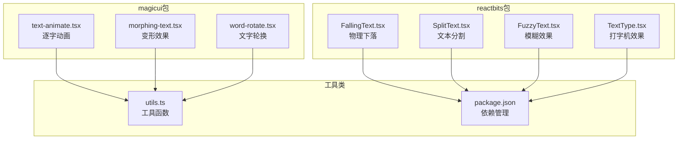
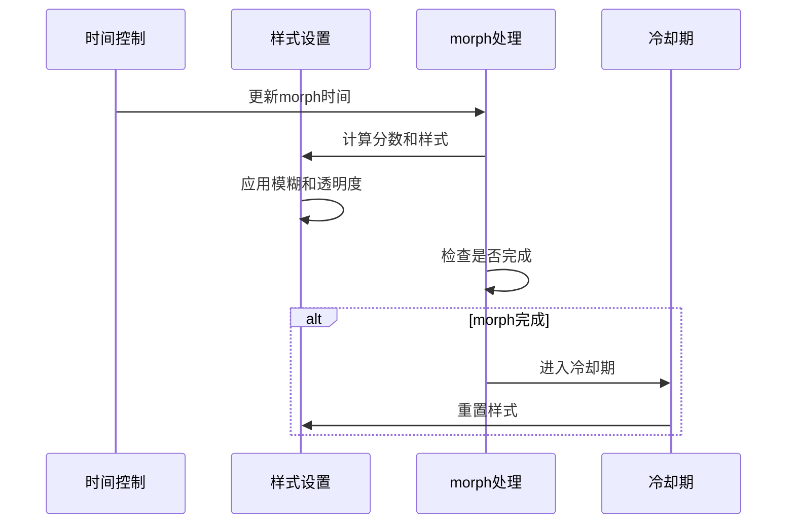
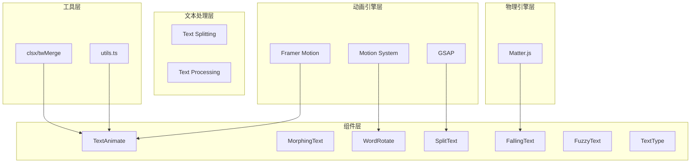
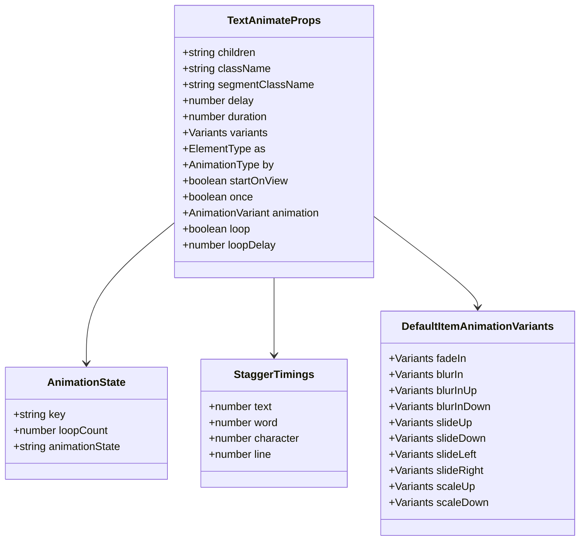
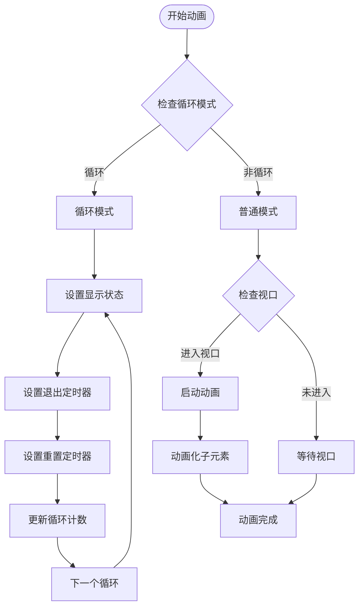
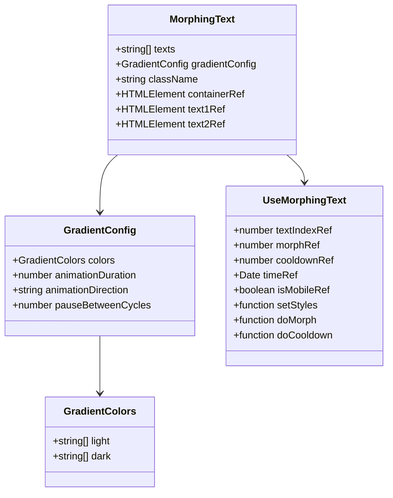
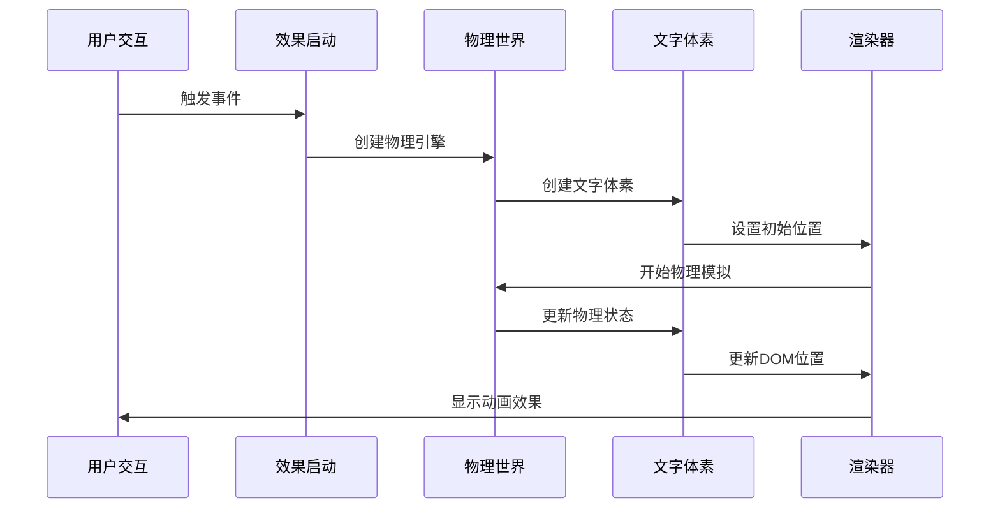
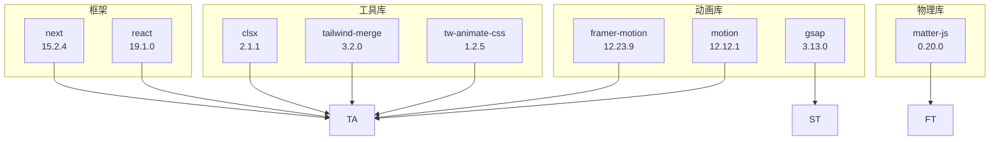
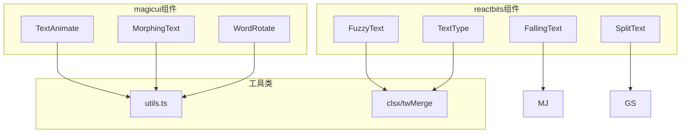

# 文本动画系统

<cite>
**本文档引用的文件**
- [text-animate.tsx](file://blog-system2/frontend/src/components/magicui/text-animate.tsx)
- [morphing-text.tsx](file://blog-system2/frontend/src/components/magicui/morphing-text.tsx)
- [word-rotate.tsx](file://blog-system2/frontend/src/components/magicui/word-rotate.tsx)
- [FallingText.tsx](file://blog-system2/frontend/src/components/reactbits/FallingText.tsx)
- [SplitText.tsx](file://blog-system2/frontend/src/components/reactbits/SplitText.tsx)
- [FuzzyText.tsx](file://blog-system2/frontend/src/components/reactbits/FuzzyText.tsx)
- [TextType.tsx](file://blog-system2/frontend/src/components/reactbits/TextType.tsx)
- [FlipWords.tsx](file://blog-system2/frontend/src/components/Home/FlipWords.tsx)
- [utils.ts](file://blog-system2/frontend/src/lib/utils.ts)
- [page.tsx](file://blog-system2/frontend/src/app/page.tsx)
- [package.json](file://blog-system2/frontend/package.json)
</cite>

## 目录
1. [简介](#简介)
2. [项目结构](#项目结构)
3. [核心组件](#核心组件)
4. [架构概览](#架构概览)
5. [详细组件分析](#详细组件分析)
6. [依赖关系分析](#依赖关系分析)
7. [性能考虑](#性能考虑)
8. [故障排除指南](#故障排除指南)
9. [结论](#结论)
10. [附录](#附录)

## 简介

本文档深入解析了该项目中的文本动画系统，涵盖了magicui包中的高级文本动画组件和reactbits包中的动态文本效果。系统实现了多种文本动画技术，包括逐字动画、变形效果、文字轮换、物理模拟和文本分割算法。

该系统基于现代前端动画库构建，支持响应式设计、性能优化和跨浏览器兼容性。开发者可以灵活运用各种文本动画效果并进行个性化定制。

## 项目结构

文本动画系统主要分布在两个核心目录中：

**图表来源**
- [text-animate.tsx:1-474](file://blog-system2/frontend/src/components/magicui/text-animate.tsx#L1-L474)
- [morphing-text.tsx:1-347](file://blog-system2/frontend/src/components/magicui/morphing-text.tsx#L1-L347)
- [word-rotate.tsx:1-52](file://blog-system2/frontend/src/components/magicui/word-rotate.tsx#L1-L52)
- [FallingText.tsx:1-251](file://blog-system2/frontend/src/components/reactbits/FallingText.tsx#L1-L251)
- [SplitText.tsx:1-181](file://blog-system2/frontend/src/components/reactbits/SplitText.tsx#L1-L181)
- [FuzzyText.tsx:1-227](file://blog-system2/frontend/src/components/reactbits/FuzzyText.tsx#L1-L227)
- [TextType.tsx:1-72](file://blog-system2/frontend/src/components/reactbits/TextType.tsx#L1-L72)

**章节来源**
- [text-animate.tsx:1-474](file://blog-system2/frontend/src/components/magicui/text-animate.tsx#L1-L474)
- [morphing-text.tsx:1-347](file://blog-system2/frontend/src/components/magicui/morphing-text.tsx#L1-L347)
- [word-rotate.tsx:1-52](file://blog-system2/frontend/src/components/magicui/word-rotate.tsx#L1-L52)
- [FallingText.tsx:1-251](file://blog-system2/frontend/src/components/reactbits/FallingText.tsx#L1-L251)
- [SplitText.tsx:1-181](file://blog-system2/frontend/src/components/reactbits/SplitText.tsx#L1-L181)
- [FuzzyText.tsx:1-227](file://blog-system2/frontend/src/components/reactbits/FuzzyText.tsx#L1-L227)
- [TextType.tsx:1-72](file://blog-system2/frontend/src/components/reactbits/TextType.tsx#L1-L72)

## 核心组件

### TextAnimate - 逐字动画组件

TextAnimate是magicui包中最复杂的文本动画组件，提供了多种动画模式和分割策略：

**核心特性：**
- 支持文本、单词、字符和行级别的分割
- 内置8种预设动画效果
- 循环播放和一次性播放模式
- 视口检测触发
- 自定义动画变体

**动画类型：**
- `fadeIn`: 淡入效果
- `blurIn`: 模糊淡入
- `blurInUp/Down`: 模糊上下滑入
- `slideUp/Down/Left/Right`: 各方向滑入
- `scaleUp/Down`: 缩放效果

**章节来源**
- [text-animate.tsx:20-73](file://blog-system2/frontend/src/components/magicui/text-animate.tsx#L20-L73)
- [text-animate.tsx:110-306](file://blog-system2/frontend/src/components/magicui/text-animate.tsx#L110-L306)

### MorphingText - 变形文本组件

MorphingText实现了高级的文本变形效果，具有独特的渐变色彩和过渡动画：

**核心技术：**
- 双层文本叠加技术
- 基于时间的morph算法
- 移动端和桌面端差异化处理
- SVG滤镜和CSS渐变结合

**动画流程：**

**图表来源**
- [morphing-text.tsx:89-143](file://blog-system2/frontend/src/components/magicui/morphing-text.tsx#L89-L143)

**章节来源**
- [morphing-text.tsx:31-146](file://blog-system2/frontend/src/components/magicui/morphing-text.tsx#L31-L146)

### WordRotate - 文字轮换组件

WordRotate提供了简单而高效的文本轮换功能：

**实现特点：**
- 基于React状态管理
- Framer Motion动画库
- AnimatePresence组件处理
- 等待模式布局切换

**章节来源**
- [word-rotate.tsx:9-36](file://blog-system2/frontend/src/components/magicui/word-rotate.tsx#L9-L36)

## 架构概览

整个文本动画系统采用模块化架构设计，各组件相互独立又可组合使用：

**图表来源**
- [package.json:24-42](file://blog-system2/frontend/package.json#L24-L42)
- [utils.ts:1-7](file://blog-system2/frontend/src/lib/utils.ts#L1-L7)

## 详细组件分析

### TextAnimate 组件深度解析

#### 数据结构分析

TextAnimate使用了复杂的数据结构来管理动画状态：

**图表来源**
- [text-animate.tsx:20-73](file://blog-system2/frontend/src/components/magicui/text-animate.tsx#L20-L73)
- [text-animate.tsx:75-306](file://blog-system2/frontend/src/components/magicui/text-animate.tsx#L75-L306)

#### 文本分割算法

TextAnimate实现了多种文本分割策略：

**分割类型对比：**
| 分割类型 | 分割规则 | 性能影响 | 适用场景 |
|---------|---------|---------|---------|
| text | 整体文本 | 低 | 简单文本展示 |
| word | 按空格分割 | 中等 | 普通段落文本 |
| character | 单字符分割 | 高 | 字符级动画 |
| line | 按换行符分割 | 中等 | 多行文本 |

**章节来源**
- [text-animate.tsx:369-387](file://blog-system2/frontend/src/components/magicui/text-animate.tsx#L369-L387)

#### 动画队列管理

TextAnimate使用了精巧的动画队列管理系统：

**图表来源**
- [text-animate.tsx:331-364](file://blog-system2/frontend/src/components/magicui/text-animate.tsx#L331-L364)

**章节来源**
- [text-animate.tsx:331-473](file://blog-system2/frontend/src/components/magicui/text-animate.tsx#L331-L473)

### MorphingText 组件深度解析

#### 双层文本架构

MorphingText采用了创新的双层文本架构：

**图表来源**
- [morphing-text.tsx:148-146](file://blog-system2/frontend/src/components/magicui/morphing-text.tsx#L148-L146)

#### 移动端适配策略

MorphingText针对移动端进行了特殊优化：

**移动端处理机制：**
- 使用顺序淡入淡出避免同时可见
- 实现渐变模糊脉冲效果
- 优化性能参数
- 简化动画复杂度

**章节来源**
- [morphing-text.tsx:46-87](file://blog-system2/frontend/src/components/magicui/morphing-text.tsx#L46-L87)

### FallingText 组件深度解析

#### 物理引擎集成

FallingText集成了Matter.js物理引擎，实现了真实的物理效果：

**图表来源**
- [FallingText.tsx:72-221](file://blog-system2/frontend/src/components/reactbits/FallingText.tsx#L72-L221)

**章节来源**
- [FallingText.tsx:16-221](file://blog-system2/frontend/src/components/reactbits/FallingText.tsx#L16-L221)

### SplitText 组件深度解析

#### 文本分割算法

SplitText使用GSAP的SplitText插件实现了高效的文本分割：

**分割类型：**
- `chars`: 字符级分割
- `words`: 单词级分割  
- `lines`: 行级分割
- `words, chars`: 组合分割

**移动端优化：**
- 自动降级为单词分割
- 调整stagger延迟
- 缩短动画持续时间
- 禁用will-change属性

**章节来源**
- [SplitText.tsx:9-40](file://blog-system2/frontend/src/components/reactbits/SplitText.tsx#L9-L40)

## 依赖关系分析

### 核心依赖库

系统使用了多个专业的动画和物理库：

**图表来源**
- [package.json:13-42](file://blog-system2/frontend/package.json#L13-L42)

### 组件间依赖关系

**图表来源**
- [utils.ts:1-7](file://blog-system2/frontend/src/lib/utils.ts#L1-L7)
- [package.json:29](file://blog-system2/frontend/package.json#L29)

**章节来源**
- [package.json:13-72](file://blog-system2/frontend/package.json#L13-L72)

## 性能考虑

### 移动端性能优化

系统针对移动端进行了全面的性能优化：

**优化策略：**
- 禁用持续动画：在移动端禁用旋转、脉冲等持续动画
- 减少GPU层数：移动端禁用will-change属性
- 降低动画复杂度：简化动画效果
- 字体加载优化：等待字体加载完成后再执行动画

**章节来源**
- [page.tsx:343-364](file://blog-system2/frontend/src/app/page.tsx#L343-L364)

### 动画性能监控

**性能指标：**
- requestAnimationFrame使用
- 内存泄漏防护
- 事件监听器清理
- 定时器管理

**章节来源**
- [FallingText.tsx:205-214](file://blog-system2/frontend/src/components/reactbits/FallingText.tsx#L205-L214)
- [FuzzyText.tsx:196-210](file://blog-system2/frontend/src/components/reactbits/FuzzyText.tsx#L196-L210)

### 资源管理

**资源优化：**
- 动画帧清理
- DOM节点复用
- CSS类名合并
- 事件委托

**章节来源**
- [utils.ts:4-6](file://blog-system2/frontend/src/lib/utils.ts#L4-L6)

## 故障排除指南

### 常见问题及解决方案

#### 动画不触发

**可能原因：**
- 视口检测未生效
- 样式冲突
- JavaScript错误

**解决步骤：**
1. 检查`startOnView`属性
2. 验证CSS样式
3. 查看浏览器控制台错误

#### 性能问题

**症状：** 页面卡顿或动画不流畅

**解决方案：**
1. 检查移动端优化设置
2. 减少动画复杂度
3. 优化DOM结构

#### 移动端兼容性

**问题：** 移动端显示异常

**解决方法：**
1. 检查媒体查询
2. 验证触摸事件处理
3. 测试不同设备

**章节来源**
- [morphing-text.tsx:304-321](file://blog-system2/frontend/src/components/magicui/morphing-text.tsx#L304-L321)
- [SplitText.tsx:48-54](file://blog-system2/frontend/src/components/reactbits/SplitText.tsx#L48-L54)

### 调试技巧

**开发调试：**
- 使用浏览器开发者工具
- 检查动画帧率
- 监控内存使用
- 验证事件绑定

**生产环境调试：**
- 启用动画日志
- 监控性能指标
- 收集用户反馈
- 实施降级方案

## 结论

该文本动画系统展现了现代前端动画技术的最高水平，通过精心设计的架构和优化策略，实现了丰富的文本动画效果。系统的主要优势包括：

1. **模块化设计**：各组件职责明确，易于维护和扩展
2. **性能优化**：针对不同平台进行了专门优化
3. **用户体验**：提供了流畅且美观的动画效果
4. **可定制性**：支持丰富的配置选项和自定义扩展

开发者可以基于现有组件快速实现各种文本动画效果，并根据具体需求进行个性化定制。

## 附录

### 配置选项参考

#### TextAnimate 配置

| 属性 | 类型 | 默认值 | 描述 |
|------|------|--------|------|
| delay | number | 0 | 动画延迟时间 |
| duration | number | 0.3 | 动画持续时间 |
| by | string | "word" | 文本分割方式 |
| animation | string | "fadeIn" | 动画预设 |
| loop | boolean \| number | false | 循环播放 |
| startOnView | boolean | true | 视口检测触发 |
| once | boolean | false | 仅播放一次 |

#### MorphingText 配置

| 属性 | 类型 | 默认值 | 描述 |
|------|------|--------|------|
| texts | string[] | 必需 | 文本数组 |
| gradientConfig.colors.light | string[] | 默认渐变色 | 浅色主题渐变 |
| gradientConfig.colors.dark | string[] | 默认渐变色 | 深色主题渐变 |
| gradientConfig.animationDuration | number | 4 | 渐变动画时长 |
| gradientConfig.animationDirection | string | "horizontal" | 渐变方向 |

#### SplitText 配置

| 属性 | 类型 | 默认值 | 描述 |
|------|------|--------|------|
| delay | number | 100 | 字符间隔延迟 |
| duration | number | 0.6 | 动画持续时间 |
| ease | string | "power3.out" | 缓动函数 |
| splitType | string | "chars" | 分割类型 |
| from | object | {opacity: 0, y: 40} | 起始状态 |
| to | object | {opacity: 1, y: 0} | 结束状态 |

### 最佳实践

1. **性能优先**：在移动端简化动画效果
2. **渐进增强**：为不支持的浏览器提供降级方案
3. **语义化**：使用适当的HTML语义标签
4. **可访问性**：考虑用户的动效偏好设置
5. **测试覆盖**：在多设备和浏览器上测试