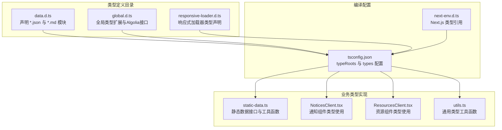
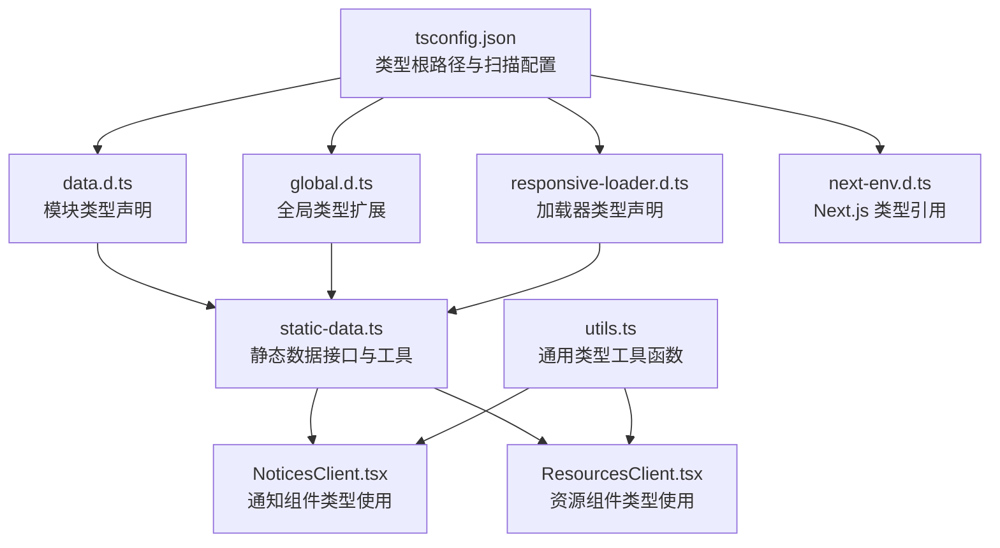
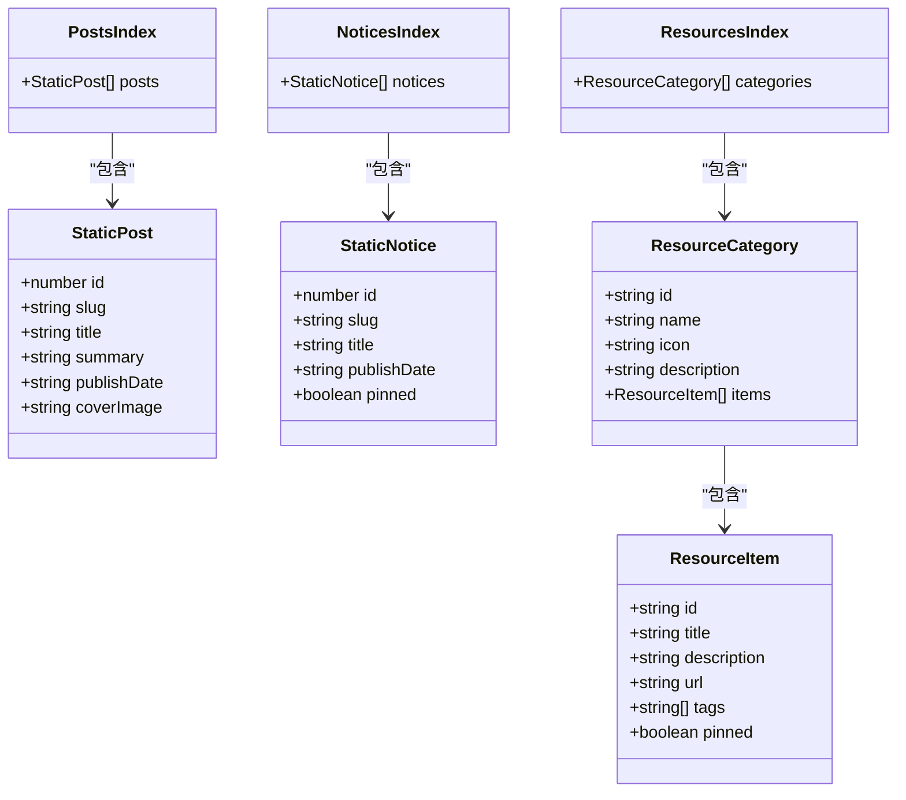
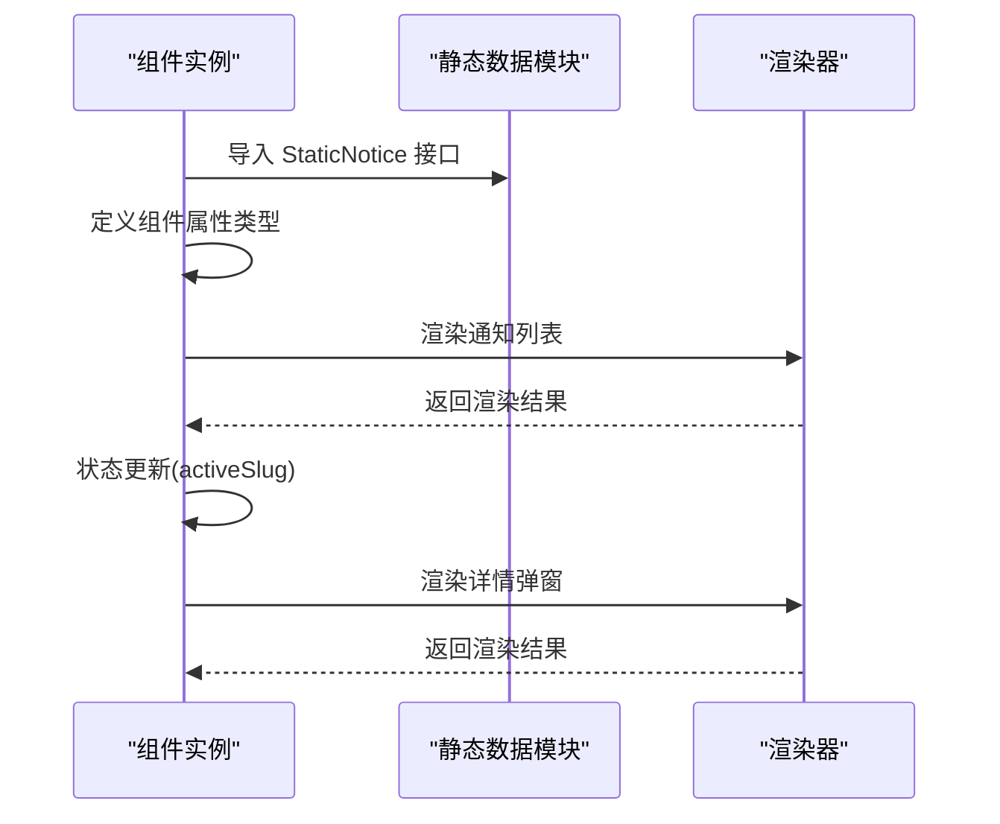
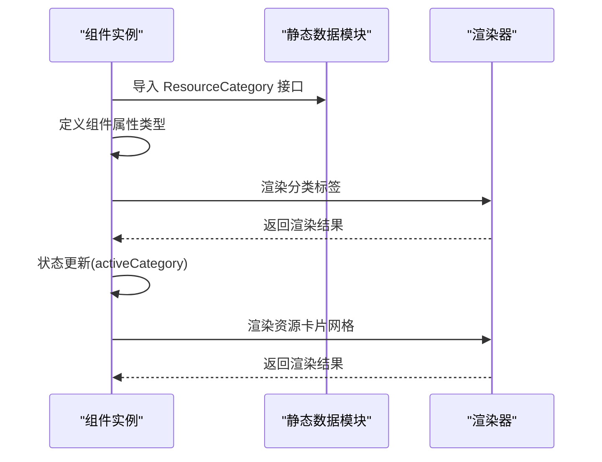
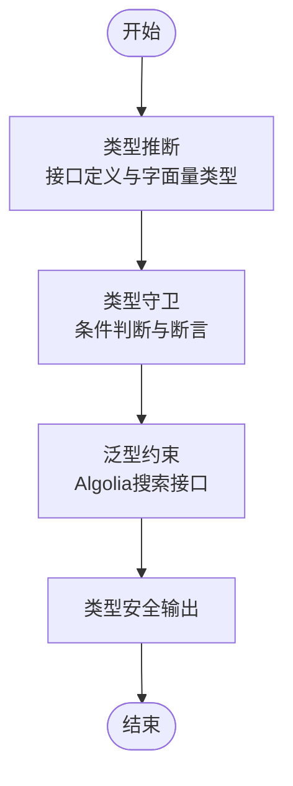
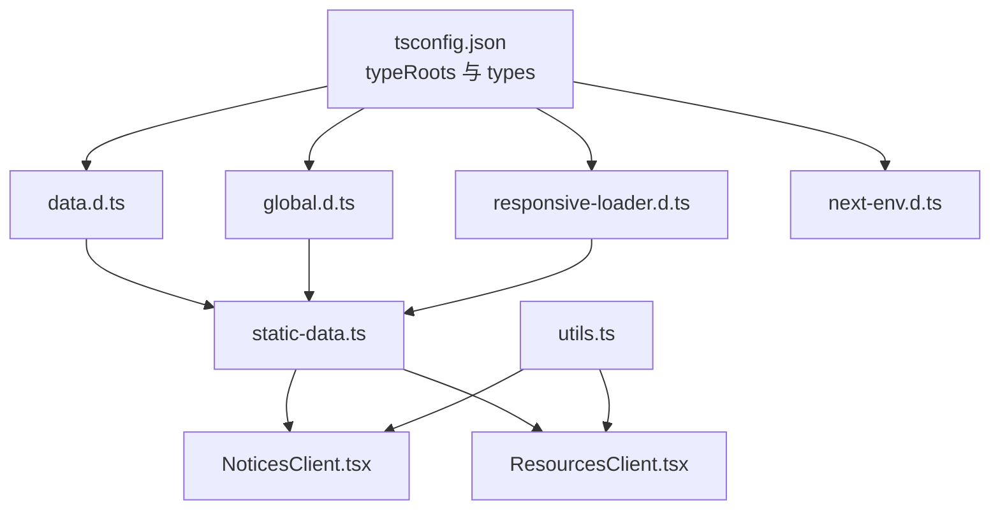

# TypeScript类型定义管理

<cite>
**本文档引用的文件**
- [data.d.ts](file://blog-system2/frontend/src/types/data.d.ts)
- [global.d.ts](file://blog-system2/frontend/src/types/global.d.ts)
- [responsive-loader.d.ts](file://blog-system2/frontend/src/types/responsive-loader.d.ts)
- [next-env.d.ts](file://blog-system2/frontend/next-env.d.ts)
- [tsconfig.json](file://blog-system2/frontend/tsconfig.json)
- [static-data.ts](file://blog-system2/frontend/src/lib/static-data.ts)
- [NoticesClient.tsx](file://blog-system2/frontend/src/components/notices/NoticesClient.tsx)
- [ResourcesClient.tsx](file://blog-system2/frontend/src/components/resources/ResourcesClient.tsx)
- [utils.ts](file://blog-system2/frontend/src/lib/utils.ts)
</cite>

## 目录
1. [简介](#简介)
2. [项目结构](#项目结构)
3. [核心组件](#核心组件)
4. [架构概览](#架构概览)
5. [详细组件分析](#详细组件分析)
6. [依赖分析](#依赖分析)
7. [性能考虑](#性能考虑)
8. [故障排除指南](#故障排除指南)
9. [结论](#结论)

## 简介

本文件为技术博客平台的TypeScript类型定义管理文档，系统性地介绍了项目中的类型定义文件结构、组织方式以及最佳实践。文档重点涵盖以下方面：

- 类型定义文件的组织结构与命名规范
- 核心数据类型的定义与使用场景（文章、通知、资源等）
- 全局类型与模块类型的作用与边界
- 响应式加载器类型定义与第三方库类型声明
- 类型推断与类型守卫的使用指南
- 泛型类型的使用模式与约束条件
- 类型兼容性与向后兼容性的考虑

通过本指南，开发者可以更好地理解项目的类型体系，确保在扩展功能时保持类型安全与一致性。

## 项目结构

项目采用基于功能域的类型组织方式，主要类型定义位于 `src/types` 目录下，配合编译配置文件 `tsconfig.json` 实现类型根路径扫描与模块解析策略。核心类型文件包括：

- 数据模块类型：用于声明JSON与Markdown资源模块的类型
- 全局类型：扩展浏览器事件接口与Algolia搜索客户端类型
- 响应式加载器类型：声明Webpack响应式图片加载器及其适配器类型

**图表来源**
- [tsconfig.json:24-28](file://blog-system2/frontend/tsconfig.json#L24-L28)
- [data.d.ts:1-10](file://blog-system2/frontend/src/types/data.d.ts#L1-L10)
- [global.d.ts:14-37](file://blog-system2/frontend/src/types/global.d.ts#L14-L37)
- [responsive-loader.d.ts:1-24](file://blog-system2/frontend/src/types/responsive-loader.d.ts#L1-L24)

**章节来源**
- [tsconfig.json:1-42](file://blog-system2/frontend/tsconfig.json#L1-L42)
- [next-env.d.ts:1-6](file://blog-system2/frontend/next-env.d.ts#L1-L6)

## 核心组件

本节深入分析类型定义的核心组件，包括数据模块类型、全局类型扩展与响应式加载器类型声明。

### 数据模块类型定义

项目通过模块声明为JSON与Markdown资源提供类型支持，确保在导入静态资源时具备完整的类型信息。

- JSON模块声明：允许导入JSON文件并将其类型推断为未知类型，便于后续运行时解析与类型断言
- Markdown模块声明：将MD文件导入为字符串类型，便于渲染组件直接处理

这些声明位于独立的 `.d.ts` 文件中，避免污染业务逻辑代码，同时确保编辑器与TypeScript编译器能够正确识别资源类型。

**章节来源**
- [data.d.ts:1-10](file://blog-system2/frontend/src/types/data.d.ts#L1-L10)

### 全局类型扩展

全局类型文件扩展了浏览器事件接口与窗口对象，以支持特定设备方向事件与Algolia搜索客户端的类型签名。

- 设备方向事件扩展：为 `DeviceOrientationEvent` 接口添加只读属性，确保在使用陀螺仪/加速计数据时具备类型安全
- Algolia接口定义：定义搜索索引与客户端的泛型接口，支持类型化的搜索结果与对象获取
- 窗口对象扩展：在全局范围内声明Algolia相关属性，便于在应用任意位置访问搜索客户端

这些全局声明通过 `declare global` 包裹，确保类型在全局范围内可用，同时通过导出空对象使文件被视为模块，避免意外污染全局作用域。

**章节来源**
- [global.d.ts:3-9](file://blog-system2/frontend/src/types/global.d.ts#L3-L9)
- [global.d.ts:14-37](file://blog-system2/frontend/src/types/global.d.ts#L14-L37)
- [global.d.ts:42-51](file://blog-system2/frontend/src/types/global.d.ts#L42-L51)

### 响应式加载器类型声明

响应式加载器类型声明为Webpack的图片处理加载器提供类型支持，包括默认加载器与Sharp适配器。

- 默认加载器：声明加载器定义函数类型，确保在构建过程中正确处理图片资源
- Sharp适配器：定义适配器函数签名，支持质量、格式等选项的类型检查与智能提示

该声明文件与第三方库集成，确保在使用响应式图片时具备完整的类型安全保障。

**章节来源**
- [responsive-loader.d.ts:1-24](file://blog-system2/frontend/src/types/responsive-loader.d.ts#L1-L24)

## 架构概览

类型系统在项目中的整体架构如下：编译配置文件指定类型根路径与类型扫描范围；类型声明文件提供模块与全局类型扩展；业务组件通过导入类型接口与工具函数实现类型安全的数据处理与渲染。

**图表来源**
- [tsconfig.json:24-28](file://blog-system2/frontend/tsconfig.json#L24-L28)
- [data.d.ts:1-10](file://blog-system2/frontend/src/types/data.d.ts#L1-L10)
- [global.d.ts:14-37](file://blog-system2/frontend/src/types/global.d.ts#L14-L37)
- [responsive-loader.d.ts:1-24](file://blog-system2/frontend/src/types/responsive-loader.d.ts#L1-L24)
- [static-data.ts:4-30](file://blog-system2/frontend/src/lib/static-data.ts#L4-L30)
- [NoticesClient.tsx:7](file://blog-system2/frontend/src/components/notices/NoticesClient.tsx#L7)
- [ResourcesClient.tsx:14](file://blog-system2/frontend/src/components/resources/ResourcesClient.tsx#L14)

## 详细组件分析

### 静态数据类型与工具函数

静态数据模块定义了文章、通知与资源的核心数据接口，并提供了相应的工具函数用于数据获取与处理。

- 文章接口：定义文章的基本字段，包括标识、URL、标题、摘要、发布日期与封面图
- 通知接口：定义通知的基本字段，包括标识、URL、标题、发布日期与置顶状态
- 资源接口：定义资源分类与资源项的结构，支持标签与置顶功能
- 工具函数：提供分页、排序、过滤与相关推荐等功能，返回类型安全的结果

**图表来源**
- [static-data.ts:4-15](file://blog-system2/frontend/src/lib/static-data.ts#L4-L15)
- [static-data.ts:138-144](file://blog-system2/frontend/src/lib/static-data.ts#L138-L144)
- [static-data.ts:187-206](file://blog-system2/frontend/src/lib/static-data.ts#L187-L206)

**章节来源**
- [static-data.ts:4-30](file://blog-system2/frontend/src/lib/static-data.ts#L4-L30)
- [static-data.ts:136-214](file://blog-system2/frontend/src/lib/static-data.ts#L136-L214)

### 通知组件类型使用

通知组件通过导入静态数据接口，确保在渲染通知列表与详情弹窗时具备完整的类型信息。

- 组件属性：接收通知数组与内容映射，使用类型注解保证传入参数的正确性
- 状态管理：使用React状态钩子管理当前激活的通知，结合类型守卫确保状态转换的安全性
- 渲染逻辑：根据通知的置顶状态与发布时间进行排序与展示，类型系统确保字段访问的安全性

**图表来源**
- [NoticesClient.tsx:10-18](file://blog-system2/frontend/src/components/notices/NoticesClient.tsx#L10-L18)
- [static-data.ts:138-144](file://blog-system2/frontend/src/lib/static-data.ts#L138-L144)

**章节来源**
- [NoticesClient.tsx:1-398](file://blog-system2/frontend/src/components/notices/NoticesClient.tsx#L1-L398)

### 资源组件类型使用

资源组件通过导入资源分类接口，确保在渲染资源导航时具备完整的类型信息。

- 组件属性：接收资源分类数组，使用类型注解保证传入参数的正确性
- 状态管理：使用React状态钩子管理当前激活的分类，结合类型守卫确保状态转换的安全性
- 渲染逻辑：根据分类图标映射与资源项属性进行渲染，类型系统确保字段访问的安全性

**图表来源**
- [ResourcesClient.tsx:16-18](file://blog-system2/frontend/src/components/resources/ResourcesClient.tsx#L16-L18)
- [static-data.ts:196-206](file://blog-system2/frontend/src/lib/static-data.ts#L196-L206)

**章节来源**
- [ResourcesClient.tsx:1-312](file://blog-system2/frontend/src/components/resources/ResourcesClient.tsx#L1-L312)

### 类型推断与类型守卫

项目广泛使用TypeScript的类型推断与类型守卫机制，确保在复杂数据处理流程中的类型安全。

- 类型推断：通过接口定义与字面量类型，编译器自动推断变量类型，减少显式类型注解
- 类型守卫：在运行时通过条件判断与类型断言，确保分支逻辑中的类型一致性
- 泛型约束：在Algolia搜索接口中使用泛型参数，限定返回结果的类型范围，提高类型安全性

**图表来源**
- [global.d.ts:18-24](file://blog-system2/frontend/src/types/global.d.ts#L18-L24)
- [static-data.ts:45-73](file://blog-system2/frontend/src/lib/static-data.ts#L45-L73)

**章节来源**
- [global.d.ts:18-24](file://blog-system2/frontend/src/types/global.d.ts#L18-L24)
- [static-data.ts:45-73](file://blog-system2/frontend/src/lib/static-data.ts#L45-L73)

## 依赖分析

类型系统的依赖关系主要体现在编译配置与模块声明之间，以及业务组件与类型定义之间的耦合。

**图表来源**
- [tsconfig.json:24-28](file://blog-system2/frontend/tsconfig.json#L24-L28)
- [data.d.ts:1-10](file://blog-system2/frontend/src/types/data.d.ts#L1-L10)
- [global.d.ts:14-37](file://blog-system2/frontend/src/types/global.d.ts#L14-L37)
- [responsive-loader.d.ts:1-24](file://blog-system2/frontend/src/types/responsive-loader.d.ts#L1-L24)
- [static-data.ts:4-30](file://blog-system2/frontend/src/lib/static-data.ts#L4-L30)

**章节来源**
- [tsconfig.json:24-28](file://blog-system2/frontend/tsconfig.json#L24-L28)

## 性能考虑

- 类型根路径优化：通过 `typeRoots` 明确类型文件扫描范围，避免不必要的类型扫描开销
- 编译选项：启用严格模式与隔离模块，确保类型检查的准确性与构建性能的平衡
- 模块声明：将资源模块声明与第三方库声明分离，减少类型合并带来的复杂度

## 故障排除指南

- 类型未生效：检查 `tsconfig.json` 中的 `typeRoots` 与 `types` 配置是否包含自定义类型目录
- 全局类型冲突：确认全局声明文件中使用 `declare global` 包裹，并导出空对象以避免污染全局作用域
- 第三方库类型缺失：为第三方库添加对应的类型声明文件，确保在使用时具备完整的类型信息

**章节来源**
- [tsconfig.json:24-28](file://blog-system2/frontend/tsconfig.json#L24-L28)
- [global.d.ts:14-16](file://blog-system2/frontend/src/types/global.d.ts#L14-L16)

## 结论

本项目通过清晰的类型定义文件组织、严格的编译配置与广泛的类型使用实践，构建了一个类型安全且易于维护的技术博客平台。建议在后续开发中继续遵循本文档的最佳实践，确保新增功能与现有类型体系保持一致，从而提升整体代码质量与开发效率。