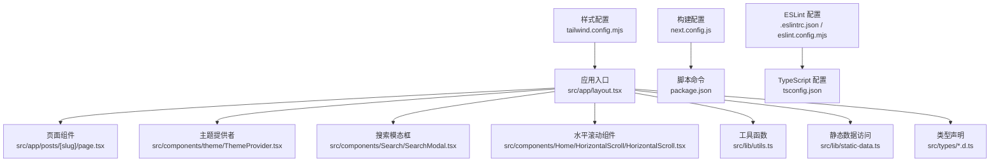
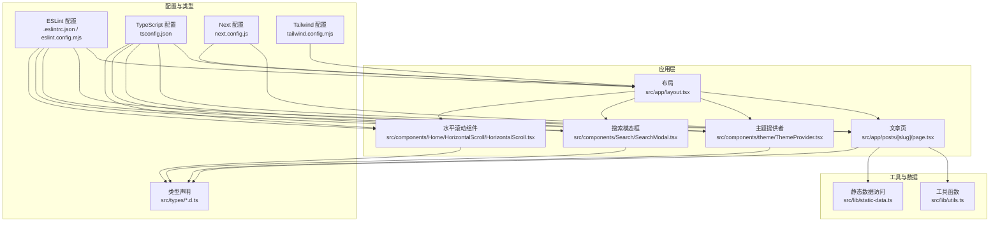
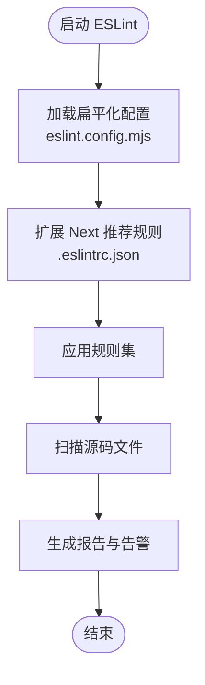
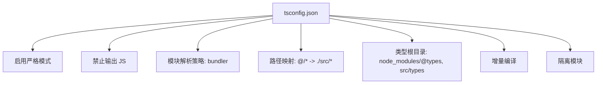
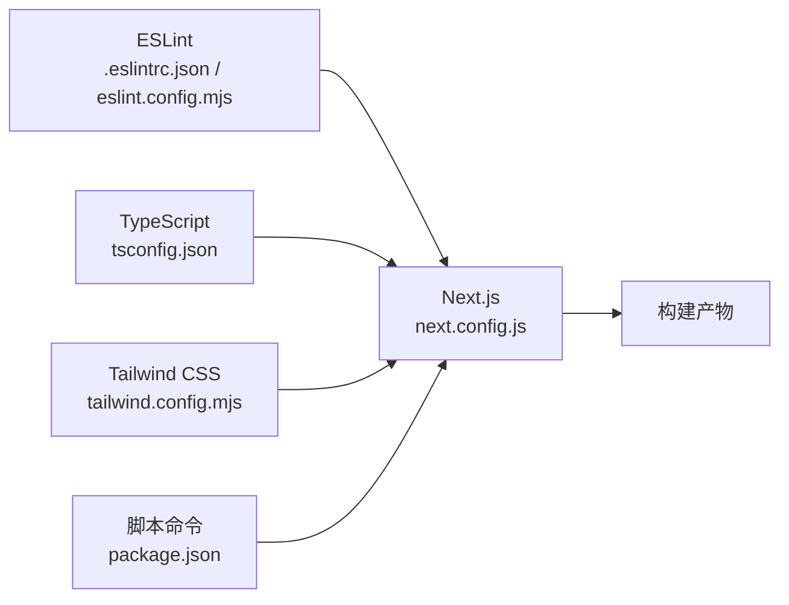

# 代码规范与标准

<cite>
**本文引用的文件**
- [.eslintrc.json](file://blog-system2/frontend/.eslintrc.json)
- [eslint.config.mjs](file://blog-system2/frontend/eslint.config.mjs)
- [tsconfig.json](file://blog-system2/frontend/tsconfig.json)
- [package.json](file://blog-system2/frontend/package.json)
- [next.config.js](file://blog-system2/frontend/next.config.js)
- [tailwind.config.mjs](file://blog-system2/frontend/tailwind.config.mjs)
- [src/types/data.d.ts](file://blog-system2/frontend/src/types/data.d.ts)
- [src/types/global.d.ts](file://blog-system2/frontend/src/types/global.d.ts)
- [src/lib/utils.ts](file://blog-system2/frontend/src/lib/utils.ts)
- [src/lib/static-data.ts](file://blog-system2/frontend/src/lib/static-data.ts)
- [src/app/layout.tsx](file://blog-system2/frontend/src/app/layout.tsx)
- [src/app/posts/[slug]/page.tsx](file://blog-system2/frontend/src/app/posts/[slug]/page.tsx)
- [src/components/Home/HorizontalScroll/HorizontalScroll.tsx](file://blog-system2/frontend/src/components/Home/HorizontalScroll/HorizontalScroll.tsx)
- [src/components/Search/SearchModal.tsx](file://blog-system2/frontend/src/components/Search/SearchModal.tsx)
- [src/components/theme/ThemeProvider.tsx](file://blog-system2/frontend/src/components/theme/ThemeProvider.tsx)
</cite>

## 目录
1. [引言](#引言)
2. [项目结构](#项目结构)
3. [核心组件](#核心组件)
4. [架构总览](#架构总览)
5. [详细组件分析](#详细组件分析)
6. [依赖关系分析](#依赖关系分析)
7. [性能考量](#性能考量)
8. [故障排查指南](#故障排查指南)
9. [结论](#结论)
10. [附录](#附录)

## 引言
本文件面向技术博客平台的开发与维护团队，系统化梳理并制定代码规范与标准，覆盖以下方面：
- ESLint 配置与规则使用，特别是 Next.js 核心网络健康检查相关规则
- TypeScript 配置选项与编译设置
- 代码风格指南（变量命名、函数定义、接口设计等）
- 文件组织原则与模块导入规范
- 代码审查清单与质量检查标准
- 具体示例展示正确与错误的编码方式
- 开发环境配置以满足代码规范要求

## 项目结构
前端采用 Next.js 应用程序，遵循 App Router 结构，类型系统通过 tsconfig 与自定义类型声明完善，样式由 Tailwind CSS 提供，构建与脚本在 package.json 中统一管理。

图表来源
- [src/app/layout.tsx:1-48](file://blog-system2/frontend/src/app/layout.tsx#L1-L48)
- [src/app/posts/[slug]/page.tsx](file://blog-system2/frontend/src/app/posts/[slug]/page.tsx#L1-L304)
- [src/components/theme/ThemeProvider.tsx:1-161](file://blog-system2/frontend/src/components/theme/ThemeProvider.tsx#L1-L161)
- [src/components/Search/SearchModal.tsx:1-935](file://blog-system2/frontend/src/components/Search/SearchModal.tsx#L1-L935)
- [src/components/Home/HorizontalScroll/HorizontalScroll.tsx:1-386](file://blog-system2/frontend/src/components/Home/HorizontalScroll/HorizontalScroll.tsx#L1-L386)
- [src/lib/utils.ts:1-7](file://blog-system2/frontend/src/lib/utils.ts#L1-L7)
- [src/lib/static-data.ts:1-214](file://blog-system2/frontend/src/lib/static-data.ts#L1-L214)
- [src/types/data.d.ts:1-10](file://blog-system2/frontend/src/types/data.d.ts#L1-L10)
- [src/types/global.d.ts:1-52](file://blog-system2/frontend/src/types/global.d.ts#L1-L52)
- [next.config.js:1-48](file://blog-system2/frontend/next.config.js#L1-L48)
- [package.json:1-72](file://blog-system2/frontend/package.json#L1-L72)
- [eslint.config.mjs:1-17](file://blog-system2/frontend/eslint.config.mjs#L1-L17)
- [.eslintrc.json:1-12](file://blog-system2/frontend/.eslintrc.json#L1-L12)
- [tsconfig.json:1-42](file://blog-system2/frontend/tsconfig.json#L1-L42)
- [tailwind.config.mjs:1-18](file://blog-system2/frontend/tailwind.config.mjs#L1-L18)

章节来源
- [package.json:1-72](file://blog-system2/frontend/package.json#L1-L72)
- [next.config.js:1-48](file://blog-system2/frontend/next.config.js#L1-L48)
- [tsconfig.json:1-42](file://blog-system2/frontend/tsconfig.json#L1-L42)
- [tailwind.config.mjs:1-18](file://blog-system2/frontend/tailwind.config.mjs#L1-L18)

## 核心组件
- ESLint 配置
  - 采用扁平化配置与扩展 Next.js 推荐规则，确保与 Next.js 版本兼容
  - 保留对特定规则的显式开关或警告级别，如对图片元素替代方案、Hooks 依赖完整性、未使用变量等的约束
- TypeScript 配置
  - 启用严格模式、增量编译、隔离模块，路径映射至 src，类型根目录包含自定义声明
  - 禁止输出 JS，使用 bundler 解析策略，支持 JSX preserve
- 构建与脚本
  - 通过 next build 与自定义脚本完成静态导出与路径修正
  - ESLint 忽略构建阶段，TS 构建错误可忽略（生产环境仍建议修复）

章节来源
- [eslint.config.mjs:12-17](file://blog-system2/frontend/eslint.config.mjs#L12-L17)
- [.eslintrc.json:1-12](file://blog-system2/frontend/.eslintrc.json#L1-L12)
- [tsconfig.json:2-29](file://blog-system2/frontend/tsconfig.json#L2-L29)
- [next.config.js:12-18](file://blog-system2/frontend/next.config.js#L12-L18)
- [package.json:5-12](file://blog-system2/frontend/package.json#L5-L12)

## 架构总览
下图展示从页面到组件、工具函数与类型声明的整体交互关系，并标注关键配置对行为的影响。

图表来源
- [src/app/layout.tsx:1-48](file://blog-system2/frontend/src/app/layout.tsx#L1-L48)
- [src/app/posts/[slug]/page.tsx](file://blog-system2/frontend/src/app/posts/[slug]/page.tsx#L1-L304)
- [src/components/theme/ThemeProvider.tsx:1-161](file://blog-system2/frontend/src/components/theme/ThemeProvider.tsx#L1-L161)
- [src/components/Search/SearchModal.tsx:1-935](file://blog-system2/frontend/src/components/Search/SearchModal.tsx#L1-L935)
- [src/components/Home/HorizontalScroll/HorizontalScroll.tsx:1-386](file://blog-system2/frontend/src/components/Home/HorizontalScroll/HorizontalScroll.tsx#L1-L386)
- [src/lib/utils.ts:1-7](file://blog-system2/frontend/src/lib/utils.ts#L1-L7)
- [src/lib/static-data.ts:1-214](file://blog-system2/frontend/src/lib/static-data.ts#L1-L214)
- [src/types/data.d.ts:1-10](file://blog-system2/frontend/src/types/data.d.ts#L1-L10)
- [src/types/global.d.ts:1-52](file://blog-system2/frontend/src/types/global.d.ts#L1-L52)
- [eslint.config.mjs:1-17](file://blog-system2/frontend/eslint.config.mjs#L1-L17)
- [.eslintrc.json:1-12](file://blog-system2/frontend/.eslintrc.json#L1-L12)
- [tsconfig.json:1-42](file://blog-system2/frontend/tsconfig.json#L1-L42)
- [next.config.js:1-48](file://blog-system2/frontend/next.config.js#L1-L48)
- [tailwind.config.mjs:1-18](file://blog-system2/frontend/tailwind.config.mjs#L1-L18)

## 详细组件分析

### ESLint 配置与 Next.js 核心网络健康检查规则
- 配置采用扁平化与扩展 Next 推荐规则，确保与 Next.js 版本一致
- 关键规则说明
  - 对图片元素替代方案进行告警提示，鼓励使用 next/image
  - Hooks 依赖完整性告警，避免遗漏依赖导致渲染异常
  - 对未使用变量进行告警，保持代码整洁
  - 对 script 放置位置进行告警，确保符合文档外交互要求
- 忽略模式
  - 对特定第三方组件文件进行忽略，减少误报

图表来源
- [eslint.config.mjs:12-17](file://blog-system2/frontend/eslint.config.mjs#L12-L17)
- [.eslintrc.json:1-12](file://blog-system2/frontend/.eslintrc.json#L1-L12)

章节来源
- [eslint.config.mjs:12-17](file://blog-system2/frontend/eslint.config.mjs#L12-L17)
- [.eslintrc.json:1-12](file://blog-system2/frontend/.eslintrc.json#L1-L12)

### TypeScript 配置选项与编译设置
- 严格模式开启，提升类型安全
- 禁止输出 JS，使用 bundler 解析策略，支持 JSX preserve
- 路径映射与类型根目录配置，便于模块导入与自定义类型管理
- 增量编译与隔离模块，优化大型项目构建性能

图表来源
- [tsconfig.json:2-29](file://blog-system2/frontend/tsconfig.json#L2-L29)

章节来源
- [tsconfig.json:1-42](file://blog-system2/frontend/tsconfig.json#L1-L42)

### 代码风格指南
- 变量命名
  - 使用语义化英文命名，避免缩写；常量使用全大写加下划线；私有成员以下划线前缀
  - 示例参考：工具函数与状态变量命名清晰，避免魔法数字与字符串
- 函数定义
  - 优先使用箭头函数表达简洁逻辑；复杂逻辑拆分为多个小函数
  - 示例参考：组件内部的回调函数通过 useCallback 包裹，减少重渲染
- 接口设计
  - 明确字段含义与可选性；对外暴露的数据结构尽量稳定
  - 示例参考：静态数据接口、搜索结果接口、主题切换接口等
- 组件结构
  - 将副作用与状态分离；合理使用 useEffect 与依赖数组
  - 示例参考：主题提供者中的自动主题切换与事件监听
- 导入与模块
  - 使用路径别名 @/* 进行相对导入，避免深层 ../.. 导致维护困难
  - 示例参考：组件与工具函数的导入路径

章节来源
- [src/lib/utils.ts:1-7](file://blog-system2/frontend/src/lib/utils.ts#L1-L7)
- [src/components/theme/ThemeProvider.tsx:1-161](file://blog-system2/frontend/src/components/theme/ThemeProvider.tsx#L1-L161)
- [src/types/global.d.ts:1-52](file://blog-system2/frontend/src/types/global.d.ts#L1-L52)
- [tsconfig.json:21-23](file://blog-system2/frontend/tsconfig.json#L21-L23)

### 文件组织原则与模块导入规范
- 页面与路由
  - App Router 下，页面组件位于 src/app 下，按路径层级组织
  - 示例参考：文章详情页与布局文件
- 组件分层
  - UI 组件、业务组件、页面组件分层清晰，避免跨层耦合
  - 示例参考：搜索模态框、主题提供者、水平滚动组件
- 工具与类型
  - 工具函数集中于 src/lib，类型声明集中于 src/types
  - 示例参考：cn 合并类名、静态数据访问、全局类型声明
- 导入规范
  - 使用绝对路径别名 @/*，减少相对路径层级
  - 示例参考：组件内部对工具函数与类型声明的导入

章节来源
- [src/app/posts/[slug]/page.tsx:1-L304](file://blog-system2/frontend/src/app/posts/[slug]/page.tsx#L1-L304)
- [src/components/Search/SearchModal.tsx:1-935](file://blog-system2/frontend/src/components/Search/SearchModal.tsx#L1-L935)
- [src/components/Home/HorizontalScroll/HorizontalScroll.tsx:1-386](file://blog-system2/frontend/src/components/Home/HorizontalScroll/HorizontalScroll.tsx#L1-L386)
- [src/lib/static-data.ts:1-214](file://blog-system2/frontend/src/lib/static-data.ts#L1-L214)
- [src/types/data.d.ts:1-10](file://blog-system2/frontend/src/types/data.d.ts#L1-L10)
- [tsconfig.json:21-23](file://blog-system2/frontend/tsconfig.json#L21-L23)

### 代码审查清单与质量检查标准
- 代码质量
  - 无未使用的变量与导入
  - 无告警级别的 ESLint 规则被忽略（除非有明确理由）
  - TypeScript 严格模式下无隐式 any
- 性能
  - 避免不必要的全局样式与重复渲染
  - 使用 useCallback/useMemo 优化高开销计算
- 可维护性
  - 组件职责单一，状态与副作用分离
  - 接口与类型稳定，变更需同步更新消费方
- 可访问性与兼容性
  - 图片使用 next/image 替代 img
  - 主题切换与动画遵循用户偏好设置

章节来源
- [.eslintrc.json:1-12](file://blog-system2/frontend/.eslintrc.json#L1-L12)
- [tsconfig.json:7-7](file://blog-system2/frontend/tsconfig.json#L7-L7)

### 具体示例：正确与错误的编码方式
- 正确示例
  - 使用 next/image 替代原生 img 标签，提升性能与 SEO
  - 使用 useCallback 包裹回调，减少重渲染
  - 使用 cn 合并类名，避免字符串拼接
- 错误示例
  - 直接使用原生 img 标签
  - 回调未包裹 useCallback，导致频繁重渲染
  - 字符串拼接类名，难以维护

章节来源
- [src/components/Home/HorizontalScroll/HorizontalScroll.tsx:318-357](file://blog-system2/frontend/src/components/Home/HorizontalScroll/HorizontalScroll.tsx#L318-L357)
- [src/lib/utils.ts:4-6](file://blog-system2/frontend/src/lib/utils.ts#L4-L6)
- [src/components/Search/SearchModal.tsx:276-298](file://blog-system2/frontend/src/components/Search/SearchModal.tsx#L276-L298)

### 开发环境配置
- 安装依赖
  - 使用包管理器安装依赖，确保版本与 Next.js 一致
- 启动开发服务器
  - 使用 next dev 启动本地服务
- 运行 Lint
  - 使用 next lint 执行 ESLint 检查
- 构建与导出
  - 使用 next build 进行构建；静态导出时配合自定义脚本修正路径

章节来源
- [package.json:5-12](file://blog-system2/frontend/package.json#L5-L12)
- [next.config.js:6-18](file://blog-system2/frontend/next.config.js#L6-L18)

## 依赖关系分析
- ESLint 与 Next.js 版本匹配，确保规则与框架特性一致
- TypeScript 严格模式与 Next 静态生成流程协同工作
- Tailwind CSS 与内容扫描范围联动，控制样式体积
- 构建配置对图片域名与静态导出路径进行定制

图表来源
- [.eslintrc.json:1-12](file://blog-system2/frontend/.eslintrc.json#L1-L12)
- [eslint.config.mjs:1-17](file://blog-system2/frontend/eslint.config.mjs#L1-L17)
- [tsconfig.json:1-42](file://blog-system2/frontend/tsconfig.json#L1-L42)
- [tailwind.config.mjs:1-18](file://blog-system2/frontend/tailwind.config.mjs#L1-L18)
- [next.config.js:1-48](file://blog-system2/frontend/next.config.js#L1-L48)
- [package.json:1-72](file://blog-system2/frontend/package.json#L1-L72)

章节来源
- [package.json:1-72](file://blog-system2/frontend/package.json#L1-L72)
- [next.config.js:1-48](file://blog-system2/frontend/next.config.js#L1-L48)
- [tsconfig.json:1-42](file://blog-system2/frontend/tsconfig.json#L1-L42)
- [tailwind.config.mjs:1-18](file://blog-system2/frontend/tailwind.config.mjs#L1-L18)

## 性能考量
- 构建与打包
  - 启用增量编译与隔离模块，缩短二次构建时间
  - 使用 bundler 解析策略，适配现代打包器
- 运行时性能
  - 图片使用 next/image 并设置 sizes 与宽度高度，避免布局偏移
  - 使用 useCallback 与 useMemo 降低重渲染成本
- 样式与内容扫描
  - Tailwind 内容扫描范围精确，避免无关样式进入产物

章节来源
- [tsconfig.json:13-15](file://blog-system2/frontend/tsconfig.json#L13-L15)
- [src/components/Home/HorizontalScroll/HorizontalScroll.tsx:318-357](file://blog-system2/frontend/src/components/Home/HorizontalScroll/HorizontalScroll.tsx#L318-L357)
- [tailwind.config.mjs:5-9](file://blog-system2/frontend/tailwind.config.mjs#L5-L9)

## 故障排查指南
- ESLint 告警
  - 检查规则配置与扩展链路，确认是否误用忽略模式
  - 对图片元素告警，优先迁移到 next/image
- TypeScript 类型错误
  - 严格模式下避免 any；必要时使用明确类型或断言
  - 确认类型根目录与路径映射配置生效
- 构建失败
  - 检查 next.config.js 的静态导出与路径前缀配置
  - 若 TS 构建错误较多，可在开发阶段临时忽略，但需尽快修复

章节来源
- [.eslintrc.json:1-12](file://blog-system2/frontend/.eslintrc.json#L1-L12)
- [tsconfig.json:6-8](file://blog-system2/frontend/tsconfig.json#L6-L8)
- [next.config.js:12-18](file://blog-system2/frontend/next.config.js#L12-L18)

## 结论
本规范以 ESLint 与 TypeScript 配置为核心，结合 Next.js 架构特性与组件实践，形成一套可落地的代码规范与质量标准。建议在日常开发中：
- 严格遵循命名与接口设计规范
- 使用路径别名与类型声明，提升可维护性
- 通过 Lint 与 TS 严格模式保障质量
- 在构建与导出环节关注性能与兼容性

## 附录
- 关键配置文件路径
  - ESLint：[eslint.config.mjs:1-17](file://blog-system2/frontend/eslint.config.mjs#L1-L17)，[.eslintrc.json:1-12](file://blog-system2/frontend/.eslintrc.json#L1-L12)
  - TypeScript：[tsconfig.json:1-42](file://blog-system2/frontend/tsconfig.json#L1-L42)
  - Next.js：[next.config.js:1-48](file://blog-system2/frontend/next.config.js#L1-L48)
  - Tailwind：[tailwind.config.mjs:1-18](file://blog-system2/frontend/tailwind.config.mjs#L1-L18)
  - 脚本命令：[package.json:1-72](file://blog-system2/frontend/package.json#L1-L72)
- 类型与工具
  - 全局类型：[src/types/global.d.ts:1-52](file://blog-system2/frontend/src/types/global.d.ts#L1-L52)
  - 数据类型：[src/types/data.d.ts:1-10](file://blog-system2/frontend/src/types/data.d.ts#L1-L10)
  - 工具函数：[src/lib/utils.ts:1-7](file://blog-system2/frontend/src/lib/utils.ts#L1-L7)
  - 静态数据：[src/lib/static-data.ts:1-214](file://blog-system2/frontend/src/lib/static-data.ts#L1-L214)
- 组件示例
  - 布局与页面：[src/app/layout.tsx:1-48](file://blog-system2/frontend/src/app/layout.tsx#L1-L48)，[src/app/posts/[slug]/page.tsx](file://blog-system2/frontend/src/app/posts/[slug]/page.tsx#L1-L304)
  - 主题与搜索：[src/components/theme/ThemeProvider.tsx:1-161](file://blog-system2/frontend/src/components/theme/ThemeProvider.tsx#L1-L161)，[src/components/Search/SearchModal.tsx:1-935](file://blog-system2/frontend/src/components/Search/SearchModal.tsx#L1-L935)
  - 水平滚动：[src/components/Home/HorizontalScroll/HorizontalScroll.tsx:1-386](file://blog-system2/frontend/src/components/Home/HorizontalScroll/HorizontalScroll.tsx#L1-L386)