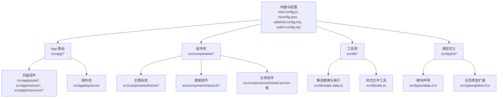
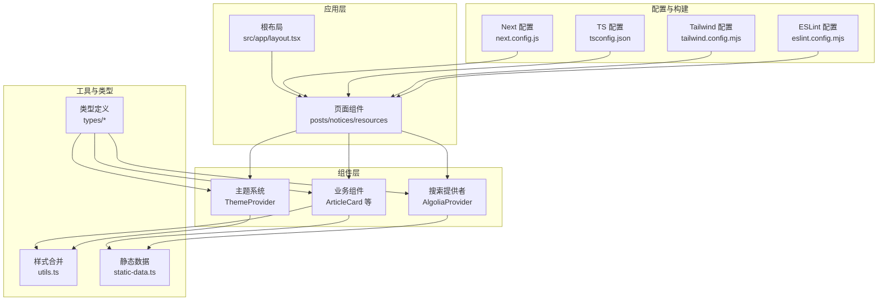
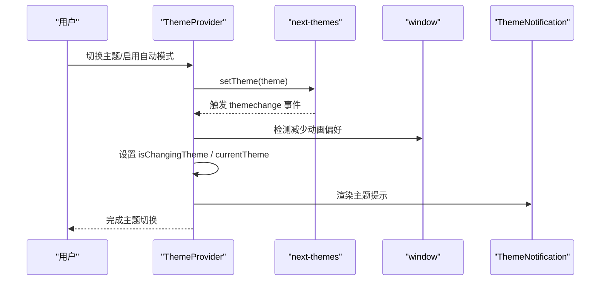
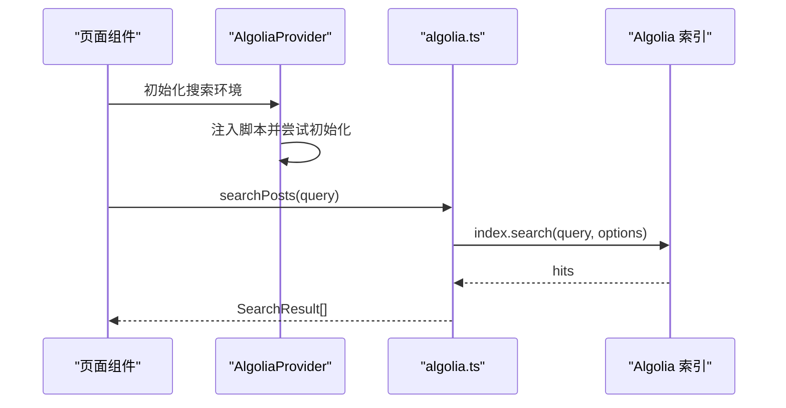
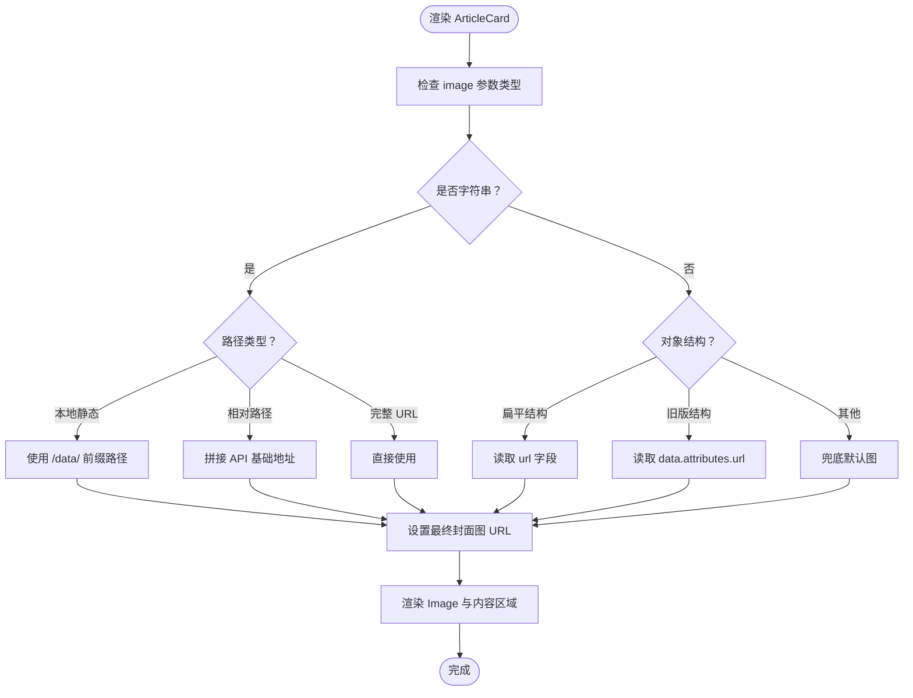
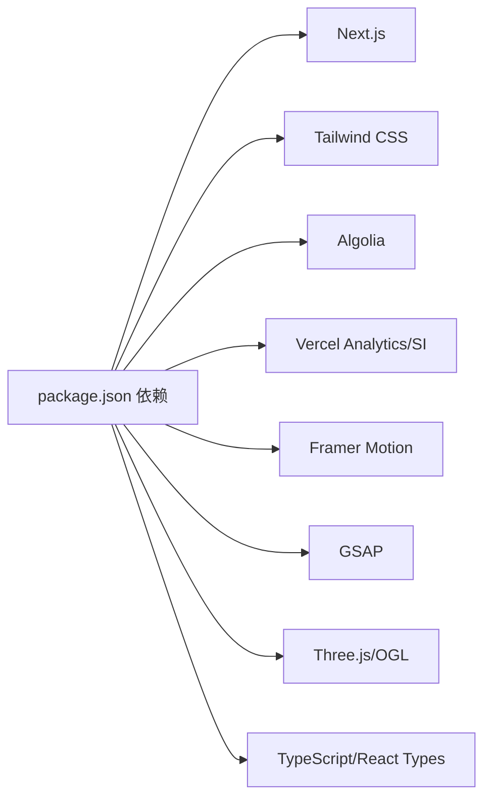

# 开发指南

<cite>
**本文引用的文件**
- [package.json](file://blog-system2/frontend/package.json)
- [tsconfig.json](file://blog-system2/frontend/tsconfig.json)
- [eslint.config.mjs](file://blog-system2/frontend/eslint.config.mjs)
- [tailwind.config.mjs](file://blog-system2/frontend/tailwind.config.mjs)
- [next.config.js](file://blog-system2/frontend/next.config.js)
- [src/types/data.d.ts](file://blog-system2/frontend/src/types/data.d.ts)
- [src/types/global.d.ts](file://blog-system2/frontend/src/types/global.d.ts)
- [src/lib/utils.ts](file://blog-system2/frontend/src/lib/utils.ts)
- [src/lib/static-data.ts](file://blog-system2/frontend/src/lib/static-data.ts)
- [src/app/layout.tsx](file://blog-system2/frontend/src/app/layout.tsx)
- [src/components/theme/ThemeProvider.tsx](file://blog-system2/frontend/src/components/theme/ThemeProvider.tsx)
- [src/components/Search/AlgoliaProvider.tsx](file://blog-system2/frontend/src/components/Search/AlgoliaProvider.tsx)
- [src/lib/algolia.ts](file://blog-system2/frontend/src/lib/algolia.ts)
- [src/components/ArticleCard.tsx](file://blog-system2/frontend/src/components/ArticleCard.tsx)
</cite>

## 目录
1. [简介](#简介)
2. [项目结构](#项目结构)
3. [核心组件](#核心组件)
4. [架构总览](#架构总览)
5. [详细组件分析](#详细组件分析)
6. [依赖分析](#依赖分析)
7. [性能考虑](#性能考虑)
8. [故障排查指南](#故障排查指南)
9. [结论](#结论)
10. [附录](#附录)

## 简介
本开发指南面向技术博客平台的前端团队，目标是统一开发规范、提升代码质量与协作效率。内容覆盖代码规范与开发标准（ESLint、TypeScript）、项目结构与命名约定、组件开发最佳实践（Props 设计、状态管理、生命周期）、样式系统与 Tailwind CSS 配置、TypeScript 类型定义策略、新功能开发流程与代码评审标准、调试与性能分析、重构与遗留代码处理、测试与质量保障等。

## 项目结构
- 前端采用 Next.js App Router 结构，根布局负责全局元数据、字体与客户端布局包裹；应用内按功能域划分页面与组件，如 posts、notices、resources、search、theme 等。
- 类型定义集中于 src/types，包含模块声明与全局类型扩展；工具函数位于 src/lib，组件位于 src/components。
- 样式系统通过 Tailwind CSS v4 与 Typography 插件集成，支持深色模式与内容扫描范围配置。
- TypeScript 严格模式开启，路径别名 @/* 指向 src，类型根目录包含 node_modules/@types 与 src/types。
- ESLint 使用 Flat Config 并继承 Next.js 推荐规则，结合 TypeScript 支持。

图表来源
- [src/app/layout.tsx:1-48](file://blog-system2/frontend/src/app/layout.tsx#L1-L48)
- [src/components/theme/ThemeProvider.tsx:1-161](file://blog-system2/frontend/src/components/theme/ThemeProvider.tsx#L1-L161)
- [src/components/Search/AlgoliaProvider.tsx:1-100](file://blog-system2/frontend/src/components/Search/AlgoliaProvider.tsx#L1-L100)
- [src/components/ArticleCard.tsx:1-198](file://blog-system2/frontend/src/components/ArticleCard.tsx#L1-L198)
- [src/lib/static-data.ts:1-214](file://blog-system2/frontend/src/lib/static-data.ts#L1-L214)
- [src/lib/utils.ts:1-7](file://blog-system2/frontend/src/lib/utils.ts#L1-L7)
- [src/types/data.d.ts:1-10](file://blog-system2/frontend/src/types/data.d.ts#L1-L10)
- [src/types/global.d.ts:1-52](file://blog-system2/frontend/src/types/global.d.ts#L1-L52)
- [next.config.js:1-48](file://blog-system2/frontend/next.config.js#L1-L48)
- [tsconfig.json:1-42](file://blog-system2/frontend/tsconfig.json#L1-L42)
- [tailwind.config.mjs:1-18](file://blog-system2/frontend/tailwind.config.mjs#L1-L18)
- [eslint.config.mjs:1-17](file://blog-system2/frontend/eslint.config.mjs#L1-L17)

章节来源
- [src/app/layout.tsx:1-48](file://blog-system2/frontend/src/app/layout.tsx#L1-L48)
- [next.config.js:1-48](file://blog-system2/frontend/next.config.js#L1-L48)
- [tsconfig.json:1-42](file://blog-system2/frontend/tsconfig.json#L1-L42)
- [tailwind.config.mjs:1-18](file://blog-system2/frontend/tailwind.config.mjs#L1-L18)
- [eslint.config.mjs:1-17](file://blog-system2/frontend/eslint.config.mjs#L1-L17)

## 核心组件
- 主题系统：基于 next-themes 的 ThemeProvider 实现自动/手动主题切换、减少动画偏好检测、主题变更过渡动画与持久化状态。
- 搜索系统：AlgoliaProvider 负责初始化 Algolia 客户端与索引，提供容错与回退机制；algolia.ts 封装搜索调用与结果映射。
- 文章卡片：ArticleCard 统一封面图处理逻辑，支持多形态图片结构与错误兜底。
- 静态数据：static-data.ts 提供文章、通知、资源的索引与查询接口，含分页与排序。
- 工具函数：utils.ts 提供 cn 合并类名，结合 clsx 与 tailwind-merge。

章节来源
- [src/components/theme/ThemeProvider.tsx:1-161](file://blog-system2/frontend/src/components/theme/ThemeProvider.tsx#L1-L161)
- [src/components/Search/AlgoliaProvider.tsx:1-100](file://blog-system2/frontend/src/components/Search/AlgoliaProvider.tsx#L1-L100)
- [src/lib/algolia.ts:1-46](file://blog-system2/frontend/src/lib/algolia.ts#L1-L46)
- [src/components/ArticleCard.tsx:1-198](file://blog-system2/frontend/src/components/ArticleCard.tsx#L1-L198)
- [src/lib/static-data.ts:1-214](file://blog-system2/frontend/src/lib/static-data.ts#L1-L214)
- [src/lib/utils.ts:1-7](file://blog-system2/frontend/src/lib/utils.ts#L1-L7)

## 架构总览
整体采用“页面路由 + 组件库 + 工具库 + 类型定义”的分层架构，主题与搜索作为横切关注点注入到应用层，静态数据与 Algolia 搜索共同支撑内容检索与展示。

图表来源
- [src/app/layout.tsx:1-48](file://blog-system2/frontend/src/app/layout.tsx#L1-L48)
- [src/components/theme/ThemeProvider.tsx:1-161](file://blog-system2/frontend/src/components/theme/ThemeProvider.tsx#L1-L161)
- [src/components/Search/AlgoliaProvider.tsx:1-100](file://blog-system2/frontend/src/components/Search/AlgoliaProvider.tsx#L1-L100)
- [src/components/ArticleCard.tsx:1-198](file://blog-system2/frontend/src/components/ArticleCard.tsx#L1-L198)
- [src/lib/utils.ts:1-7](file://blog-system2/frontend/src/lib/utils.ts#L1-L7)
- [src/lib/static-data.ts:1-214](file://blog-system2/frontend/src/lib/static-data.ts#L1-L214)
- [src/types/data.d.ts:1-10](file://blog-system2/frontend/src/types/data.d.ts#L1-L10)
- [src/types/global.d.ts:1-52](file://blog-system2/frontend/src/types/global.d.ts#L1-L52)
- [next.config.js:1-48](file://blog-system2/frontend/next.config.js#L1-L48)
- [tsconfig.json:1-42](file://blog-system2/frontend/tsconfig.json#L1-L42)
- [tailwind.config.mjs:1-18](file://blog-system2/frontend/tailwind.config.mjs#L1-L18)
- [eslint.config.mjs:1-17](file://blog-system2/frontend/eslint.config.mjs#L1-L17)

## 详细组件分析

### 主题系统组件分析
- 设计要点
  - 使用 next-themes 提供主题切换能力，并在客户端侧进行挂载判断避免水合不一致。
  - 自动模式根据时间段切换 light/dark，支持用户覆盖与减少动画偏好检测。
  - 通过自定义事件监听主题变化，实现过渡动画与状态持久化。
- 生命周期与状态
  - 挂载阶段设置 mounted 标记，首次渲染隐藏内容以避免闪烁。
  - 监听窗口减少动画偏好与主题变化事件，定时更新自动主题。
- 错误处理
  - 对主题切换过程中的异常进行捕获与降级处理，保证稳定性。

图表来源
- [src/components/theme/ThemeProvider.tsx:1-161](file://blog-system2/frontend/src/components/theme/ThemeProvider.tsx#L1-L161)

章节来源
- [src/components/theme/ThemeProvider.tsx:1-161](file://blog-system2/frontend/src/components/theme/ThemeProvider.tsx#L1-L161)

### 搜索系统组件分析
- 设计要点
  - AlgoliaProvider 在客户端注入脚本并初始化 Algolia 客户端与索引，提供回退初始化方案。
  - algolia.ts 封装搜索调用，限制返回条数与检索字段，统一错误处理。
- 数据流
  - 页面请求触发 searchPosts -> index.search -> hits 映射 -> 返回结果。
- 错误处理
  - 对空查询、索引未就绪、网络异常等情况进行保护，避免抛错影响页面。

图表来源
- [src/components/Search/AlgoliaProvider.tsx:1-100](file://blog-system2/frontend/src/components/Search/AlgoliaProvider.tsx#L1-L100)
- [src/lib/algolia.ts:1-46](file://blog-system2/frontend/src/lib/algolia.ts#L1-L46)

章节来源
- [src/components/Search/AlgoliaProvider.tsx:1-100](file://blog-system2/frontend/src/components/Search/AlgoliaProvider.tsx#L1-L100)
- [src/lib/algolia.ts:1-46](file://blog-system2/frontend/src/lib/algolia.ts#L1-L46)

### 文章卡片组件分析
- 设计要点
  - Props 设计清晰，支持标题、日期、封面图与跳转 slug；提供 noShadow 控制样式。
  - 封面图处理兼容字符串与多版本对象结构，支持本地静态资源与外部 API。
  - 使用 Next.js Image 进行懒加载与尺寸优化，提供错误兜底。
- 性能与可访问性
  - 图片懒加载与尺寸集合提升加载性能；SVG 图标与无障碍属性增强可访问性。
- 可维护性
  - 通过类型约束减少运行期错误；样式通过 Tailwind 与 cn 合并，便于主题适配。

图表来源
- [src/components/ArticleCard.tsx:1-198](file://blog-system2/frontend/src/components/ArticleCard.tsx#L1-L198)

章节来源
- [src/components/ArticleCard.tsx:1-198](file://blog-system2/frontend/src/components/ArticleCard.tsx#L1-L198)

### 静态数据与索引分析
- 设计要点
  - 提供文章、通知、资源三类索引与查询接口，支持分页、排序与过滤。
  - 文章索引按发布时间倒序，通知按置顶优先与时间倒序，资源按分类组织。
- 复杂度与性能
  - 读取 JSON 文件后在内存中进行排序与切片，时间复杂度 O(n log n) 排序 + O(k) 切片。
- 可维护性
  - 类型定义明确，字段约束强，便于上游组件消费。

章节来源
- [src/lib/static-data.ts:1-214](file://blog-system2/frontend/src/lib/static-data.ts#L1-L214)

### 样式系统与 Tailwind CSS
- 配置要点
  - content 扫描范围覆盖 pages、components、app；深色模式通过 class 策略；启用 Typography 插件。
  - utils.ts 中的 cn 函数结合 clsx 与 tailwind-merge，避免重复类名与冲突。
- 使用建议
  - 优先使用语义化类名与主题变量；通过组件 props 控制样式变体，避免硬编码颜色。

章节来源
- [tailwind.config.mjs:1-18](file://blog-system2/frontend/tailwind.config.mjs#L1-L18)
- [src/lib/utils.ts:1-7](file://blog-system2/frontend/src/lib/utils.ts#L1-L7)

### TypeScript 类型定义策略
- 模块声明
  - data.d.ts 声明 *.json 与 *.md 的模块默认导出类型，便于在组件中导入静态资源。
- 全局类型扩展
  - global.d.ts 扩展 DeviceOrientationEvent、Window 上的 Algolia 相关全局属性与 AlgoliaSearchResponse 接口，确保搜索相关代码类型安全。
- 类型根目录
  - tsconfig.json 包含 src/types，使自定义类型对编译器可见。

章节来源
- [src/types/data.d.ts:1-10](file://blog-system2/frontend/src/types/data.d.ts#L1-L10)
- [src/types/global.d.ts:1-52](file://blog-system2/frontend/src/types/global.d.ts#L1-L52)
- [tsconfig.json:1-42](file://blog-system2/frontend/tsconfig.json#L1-L42)

## 依赖分析
- 构建与运行
  - Next.js 15.2.4，支持静态导出与 GitHub Pages 前缀配置；忽略构建期 TS/ESLint 错误以提升 CI 流程稳定性。
- 样式与动画
  - Tailwind CSS v4、Typography 插件；Framer Motion 用于主题切换动画；GSAP、OGL、Three.js 用于高级动画与 3D。
- 搜索与分析
  - Algolia 客户端与搜索；Vercel Analytics/SI 用于性能与行为分析。
- 工具与类型
  - clsx、tailwind-merge、class-variance-authority；React、React DOM、Next Themes；TypeScript 5。

图表来源
- [package.json:1-72](file://blog-system2/frontend/package.json#L1-L72)

章节来源
- [package.json:1-72](file://blog-system2/frontend/package.json#L1-L72)
- [next.config.js:1-48](file://blog-system2/frontend/next.config.js#L1-L48)

## 性能考虑
- 图像优化
  - 使用 Next.js Image，配置设备像素比与格式；懒加载与尺寸集合减少带宽占用。
- 构建与导出
  - 静态导出与尾斜杠配置，减少运行时开销；忽略构建期 TS/ESLint 错误以加速 CI。
- 动画与交互
  - 减少动画偏好检测与过渡节流，避免不必要的重绘；主题切换动画仅在非减少动画模式下执行。
- 搜索性能
  - 限制 hitsPerPage，仅检索必要字段；对空查询与异常进行快速返回。

章节来源
- [next.config.js:1-48](file://blog-system2/frontend/next.config.js#L1-L48)
- [src/components/theme/ThemeProvider.tsx:1-161](file://blog-system2/frontend/src/components/theme/ThemeProvider.tsx#L1-L161)
- [src/lib/algolia.ts:1-46](file://blog-system2/frontend/src/lib/algolia.ts#L1-L46)

## 故障排查指南
- 主题切换异常
  - 检查是否在客户端环境使用 ThemeProvider；确认减少动画偏好与自动模式本地存储值。
- 搜索无结果或报错
  - 确认 AlgoliaProvider 是否正确注入脚本并初始化索引；检查环境变量与索引名称；查看网络面板与控制台错误。
- 图片加载失败
  - 检查封面图 URL 构造逻辑与兜底图片；确认域名白名单与图像尺寸配置。
- 类型错误
  - 确认 tsconfig 的 typeRoots 与 include；检查自定义类型文件是否被正确解析。

章节来源
- [src/components/theme/ThemeProvider.tsx:1-161](file://blog-system2/frontend/src/components/theme/ThemeProvider.tsx#L1-L161)
- [src/components/Search/AlgoliaProvider.tsx:1-100](file://blog-system2/frontend/src/components/Search/AlgoliaProvider.tsx#L1-L100)
- [src/lib/algolia.ts:1-46](file://blog-system2/frontend/src/lib/algolia.ts#L1-L46)
- [src/components/ArticleCard.tsx:1-198](file://blog-system2/frontend/src/components/ArticleCard.tsx#L1-L198)
- [tsconfig.json:1-42](file://blog-system2/frontend/tsconfig.json#L1-L42)

## 结论
本指南提供了从代码规范、项目结构、组件开发到样式系统、类型定义、调试与性能优化的完整实践框架。建议团队在日常开发中遵循以下原则：严格使用 TypeScript 与 ESLint；组件化与类型驱动；主题与搜索等横切能力集中管理；静态数据与搜索双通道支撑内容检索；持续优化图像与动画性能；建立完善的测试与质量保障流程。

## 附录

### 代码规范与开发标准
- ESLint
  - 使用 Flat Config 并继承 Next.js 推荐规则；结合 TypeScript 支持，确保最佳实践落地。
- TypeScript
  - 严格模式开启，noEmit 与 isolatedModules；路径别名 @/*；类型根目录包含自定义类型。
- 代码风格
  - 统一使用 TypeScript 与 JSX；组件 Props 明确类型与默认值；避免 any；优先使用语义化类名。

章节来源
- [eslint.config.mjs:1-17](file://blog-system2/frontend/eslint.config.mjs#L1-L17)
- [tsconfig.json:1-42](file://blog-system2/frontend/tsconfig.json#L1-L42)

### 新功能开发流程与代码评审标准
- 开发流程
  - 需求评审 → 设计组件与类型 → 编写组件与类型定义 → 实现样式与交互 → 集成搜索/静态数据 → 单元/集成测试 → 代码评审 → 合并与发布。
- 代码评审标准
  - 类型安全、可读性、可维护性、性能与可访问性；主题与搜索一致性；样式一致性与暗色模式适配。

### 调试工具与性能分析
- 调试
  - 使用浏览器开发者工具检查网络、样式与控制台错误；利用 Vercel Analytics/SI 观察性能指标。
- 性能分析
  - 关注首屏加载、图片懒加载与尺寸优化、主题切换动画成本、搜索请求耗时与命中率。

### 代码重构指南与遗留代码处理
- 重构原则
  - 保持接口稳定、逐步替换、充分测试；优先处理类型缺失与重复逻辑。
- 遗留代码
  - 识别多版本图片结构与历史搜索实现，统一到新的类型与接口；清理未使用的依赖与配置。

### 测试策略与质量保证
- 单元测试
  - 针对工具函数与纯函数（如 cn、静态数据查询）编写测试。
- 集成测试
  - 页面与组件快照、主题切换、搜索交互、图片加载等场景。
- 质量保障
  - ESLint 与 TypeScript 检查纳入 CI；构建阶段忽略错误以加速流水线，但要求 PR 必须通过检查。