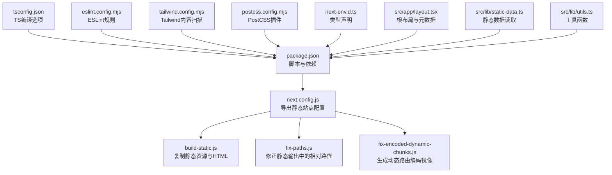
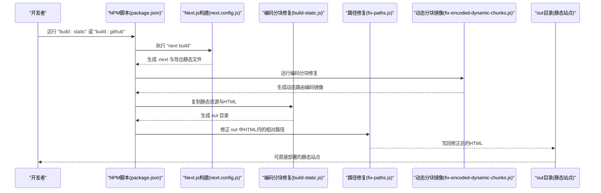
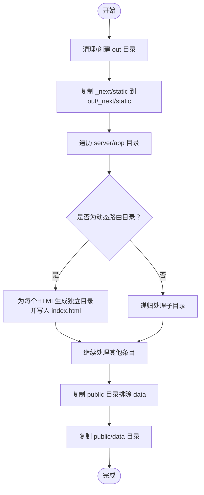
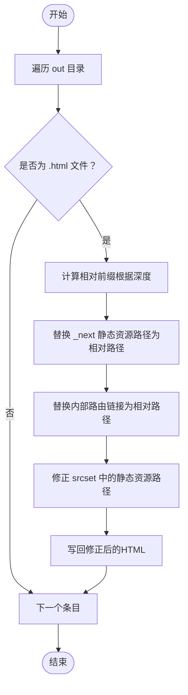
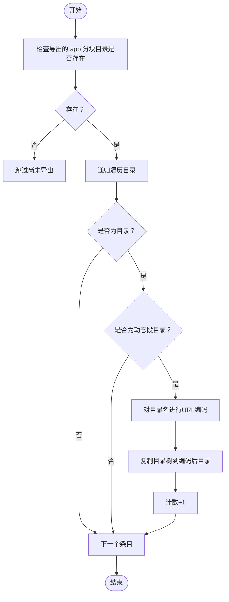
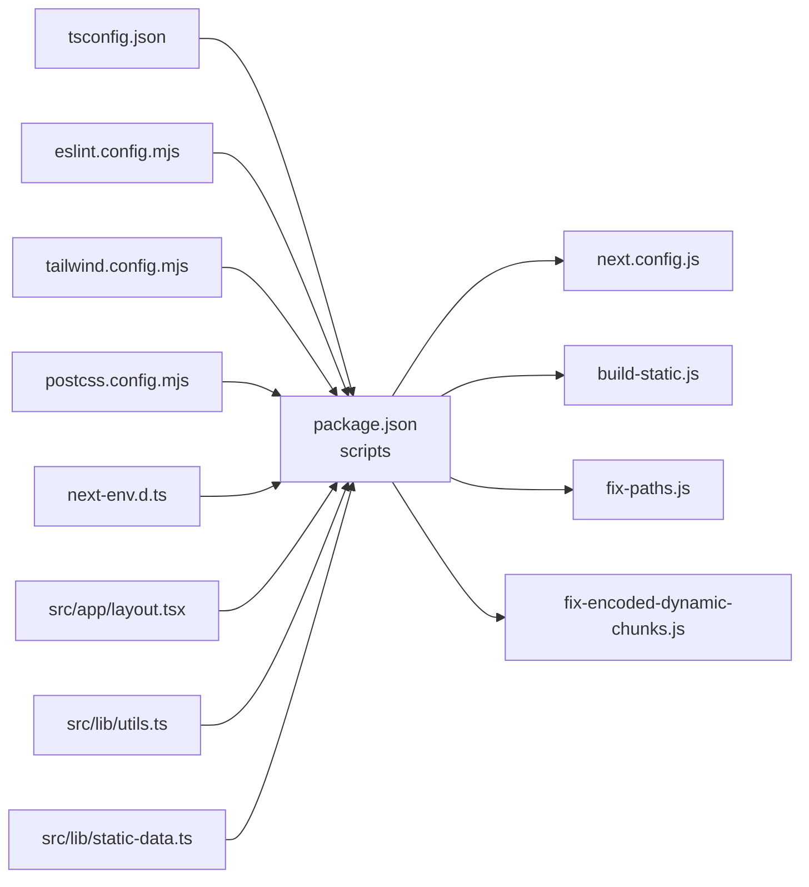

# 开发流程与工具链

<cite>
**本文引用的文件**
- [package.json](file://blog-system2/frontend/package.json)
- [next.config.js](file://blog-system2/frontend/next.config.js)
- [build-static.js](file://blog-system2/frontend/build-static.js)
- [fix-paths.js](file://blog-system2/frontend/fix-paths.js)
- [fix-encoded-dynamic-chunks.js](file://blog-system2/frontend/fix-encoded-dynamic-chunks.js)
- [tailwind.config.mjs](file://blog-system2/frontend/tailwind.config.mjs)
- [tsconfig.json](file://blog-system2/frontend/tsconfig.json)
- [eslint.config.mjs](file://blog-system2/frontend/eslint.config.mjs)
- [postcss.config.mjs](file://blog-system2/frontend/postcss.config.mjs)
- [next-env.d.ts](file://blog-system2/frontend/next-env.d.ts)
- [src/app/layout.tsx](file://blog-system2/frontend/src/app/layout.tsx)
- [src/lib/static-data.ts](file://blog-system2/frontend/src/lib/static-data.ts)
- [src/lib/utils.ts](file://blog-system2/frontend/src/lib/utils.ts)
</cite>

## 目录
1. [简介](#简介)
2. [项目结构](#项目结构)
3. [核心组件](#核心组件)
4. [架构总览](#架构总览)
5. [详细组件分析](#详细组件分析)
6. [依赖分析](#依赖分析)
7. [性能考虑](#性能考虑)
8. [故障排查指南](#故障排查指南)
9. [结论](#结论)
10. [附录](#附录)

## 简介
本文件面向技术博客平台的开发者与运维人员，系统化梳理前端工程的开发流程、工具链与自动化脚本，覆盖以下主题：
- 构建流程与自动化脚本使用
- 路径修复脚本与静态构建脚本的功能与用法
- 开发环境配置与本地调试技巧
- 代码热重载与实时预览配置
- 版本控制最佳实践与分支管理策略
- 持续集成与部署流程说明
- 性能分析与调试工具使用
- 开发工具链的配置与优化方法

## 项目结构
该前端项目基于 Next.js 15 应用，采用 App Router 结构，配合 Tailwind CSS 4、TypeScript 与 ESLint。核心目录与文件职责如下：
- 根配置：next.config.js、tsconfig.json、eslint.config.mjs、tailwind.config.mjs、postcss.config.mjs、next-env.d.ts
- 自动化脚本：build-static.js、fix-paths.js、fix-encoded-dynamic-chunks.js
- 包管理与脚本：package.json（含 dev/build/build:static/build:github 及 lint）
- 应用入口与布局：src/app/layout.tsx
- 静态数据读取：src/lib/static-data.ts
- 工具函数：src/lib/utils.ts

图表来源
- [package.json:1-72](file://blog-system2/frontend/package.json#L1-L72)
- [next.config.js:1-48](file://blog-system2/frontend/next.config.js#L1-L48)
- [build-static.js:1-141](file://blog-system2/frontend/build-static.js#L1-L141)
- [fix-paths.js:1-53](file://blog-system2/frontend/fix-paths.js#L1-L53)
- [fix-encoded-dynamic-chunks.js:1-73](file://blog-system2/frontend/fix-encoded-dynamic-chunks.js#L1-L73)
- [tsconfig.json:1-42](file://blog-system2/frontend/tsconfig.json#L1-L42)
- [eslint.config.mjs:1-17](file://blog-system2/frontend/eslint.config.mjs#L1-L17)
- [tailwind.config.mjs:1-18](file://blog-system2/frontend/tailwind.config.mjs#L1-L18)
- [postcss.config.mjs:1-6](file://blog-system2/frontend/postcss.config.mjs#L1-L6)
- [next-env.d.ts:1-6](file://blog-system2/frontend/next-env.d.ts#L1-L6)
- [src/app/layout.tsx:1-48](file://blog-system2/frontend/src/app/layout.tsx#L1-L48)
- [src/lib/static-data.ts:1-214](file://blog-system2/frontend/src/lib/static-data.ts#L1-L214)
- [src/lib/utils.ts:1-7](file://blog-system2/frontend/src/lib/utils.ts#L1-L7)

章节来源
- [package.json:1-72](file://blog-system2/frontend/package.json#L1-L72)
- [next.config.js:1-48](file://blog-system2/frontend/next.config.js#L1-L48)

## 核心组件
- 构建脚本与命令
  - 开发模式：通过 dev 命令启动 Next.js 开发服务器，支持热重载与实时预览。
  - 生产构建：通过 build 命令执行 Next.js 构建，并在完成后运行编码动态分块修复脚本。
  - 静态构建：在生产构建基础上，额外执行静态站点复制与路径修复脚本，生成可直接部署的 out 目录。
  - GitHub Pages 构建：通过环境变量启用 GitHub Pages 兼容的输出，包括 basePath 与 assetPrefix 的设置，并执行静态构建流程。
  - 代码检查：通过 lint 命令运行 ESLint。

- Next.js 导出配置
  - 输出模式：静态导出（export），便于托管到任意静态服务器或 GitHub Pages。
  - 路径前缀：根据环境变量动态设置 basePath 与 assetPrefix，适配子路径部署。
  - 图片优化：禁用默认图片优化以适配静态托管，允许指定域名白名单。
  - TypeScript/ESLint：构建时忽略错误以提升兼容性，同时保留开发期严格校验。

- 工具链配置
  - TypeScript：启用严格模式、增量编译、模块解析为 bundler，路径别名 @/* 指向 src。
  - ESLint：采用 Next.js 推荐规则集，统一团队风格。
  - Tailwind CSS：content 扫描范围覆盖 app、pages、components，启用暗色模式 class。
  - PostCSS：加载 Tailwind CSS 插件。

章节来源
- [package.json:5-12](file://blog-system2/frontend/package.json#L5-L12)
- [next.config.js:6-44](file://blog-system2/frontend/next.config.js#L6-L44)
- [tsconfig.json:21-28](file://blog-system2/frontend/tsconfig.json#L21-L28)
- [eslint.config.mjs:12-14](file://blog-system2/frontend/eslint.config.mjs#L12-L14)
- [tailwind.config.mjs:5-14](file://blog-system2/frontend/tailwind.config.mjs#L5-L14)
- [postcss.config.mjs:1-6](file://blog-system2/frontend/postcss.config.mjs#L1-L6)

## 架构总览
下图展示了从开发到静态部署的关键流程，以及三个核心自动化脚本的作用位置。

图表来源
- [package.json:7-9](file://blog-system2/frontend/package.json#L7-L9)
- [next.config.js:7-10](file://blog-system2/frontend/next.config.js#L7-L10)
- [build-static.js:33-87](file://blog-system2/frontend/build-static.js#L33-L87)
- [fix-paths.js:6-34](file://blog-system2/frontend/fix-paths.js#L6-L34)
- [fix-encoded-dynamic-chunks.js:39-73](file://blog-system2/frontend/fix-encoded-dynamic-chunks.js#L39-L73)

## 详细组件分析

### 组件A：静态站点构建流水线
- 功能概述
  - 在 Next.js 构建完成后，将必要的静态资源与 HTML 文件复制到 out 目录。
  - 处理动态路由占位符（如 [slug]）对应的导出结构，确保每个路由生成独立目录与 index.html。
  - 复制 public 目录下的非 data 子目录内容，以及 public/data 下的数据文件，保证页面渲染所需数据可用。

- 关键步骤
  - 清理/创建 out 目录
  - 复制 .next/static 到 out/_next/static
  - 遍历 server/app 目录，按路由层级生成 out 目录结构并复制 HTML
  - 复制 public 目录（跳过 data），再复制 public/data
  - 输出最终静态站点路径

图表来源
- [build-static.js:33-87](file://blog-system2/frontend/build-static.js#L33-L87)
- [build-static.js:89-138](file://blog-system2/frontend/build-static.js#L89-L138)

章节来源
- [build-static.js:1-141](file://blog-system2/frontend/build-static.js#L1-L141)

### 组件B：路径修复脚本
- 功能概述
  - 遍历 out 目录中的所有 HTML 文件，修正其中的静态资源路径与内部链接，使其在静态部署环境下正确解析。
  - 替换 _next 静态资源前缀，以及常见内部路由前缀，确保多级目录下的相对路径正确。

- 处理逻辑
  - 计算当前 HTML 相对于 out 的深度，生成相对前缀（./ 或 ../...）
  - 正则替换 href/src 中的绝对路径为相对路径
  - 处理 srcset 属性中的多尺寸资源路径
  - 递归遍历 out 目录，逐个修复

图表来源
- [fix-paths.js:6-34](file://blog-system2/frontend/fix-paths.js#L6-L34)
- [fix-paths.js:36-48](file://blog-system2/frontend/fix-paths.js#L36-L48)

章节来源
- [fix-paths.js:1-53](file://blog-system2/frontend/fix-paths.js#L1-L53)

### 组件C：动态分块编码镜像修复
- 功能概述
  - 在静态导出后，某些动态路由段（如 [slug]）可能未生成对应编码后的分块目录，导致访问异常。
  - 该脚本会扫描导出的 app 分块目录，为包含动态段的目录创建编码后的镜像目录，确保路径解析一致。

- 处理逻辑
  - 识别动态段目录（方括号包裹）
  - 对其进行 URL 编码，生成同名编码目录
  - 递归复制目录树，避免重复创建
  - 输出创建数量统计

图表来源
- [fix-encoded-dynamic-chunks.js:39-73](file://blog-system2/frontend/fix-encoded-dynamic-chunks.js#L39-L73)

章节来源
- [fix-encoded-dynamic-chunks.js:1-73](file://blog-system2/frontend/fix-encoded-dynamic-chunks.js#L1-L73)

### 组件D：Next.js 导出与路径前缀配置
- 输出模式与路径前缀
  - output: export 启用静态导出
  - basePath 与 assetPrefix 根据环境变量动态设置，适配 GitHub Pages 子路径部署
  - trailingSlash: true 保证链接末尾斜杠一致性

- 图片优化与缓存
  - images.unoptimized: true 禁用默认优化，适配静态托管
  - domains 白名单包含本地与 CDN 域名
  - 设备像素比与格式优化参数

- Webpack 插件
  - 忽略 moment.js 的 locale 模块，减少包体积

章节来源
- [next.config.js:3-10](file://blog-system2/frontend/next.config.js#L3-L10)
- [next.config.js:20-33](file://blog-system2/frontend/next.config.js#L20-L33)
- [next.config.js:35-44](file://blog-system2/frontend/next.config.js#L35-L44)

### 组件E：根布局与元数据
- 根布局负责：
  - 引入字体变量（Geist Sans/Mono）
  - 设置 viewport 与全局样式
  - 提供客户端布局包装器（ClientLayout）

章节来源
- [src/app/layout.tsx:1-48](file://blog-system2/frontend/src/app/layout.tsx#L1-L48)

### 组件F：静态数据读取与工具函数
- 静态数据读取
  - 从 public/data 下的 index.json 读取文章、通知与资源索引
  - 支持分页、排序、相关文章推荐等逻辑
- 工具函数
  - cn：结合 clsx 与 tailwind-merge 实现类名合并与冲突覆盖

章节来源
- [src/lib/static-data.ts:1-214](file://blog-system2/frontend/src/lib/static-data.ts#L1-L214)
- [src/lib/utils.ts:1-7](file://blog-system2/frontend/src/lib/utils.ts#L1-L7)

## 依赖分析
- 构建与运行时依赖
  - Next.js 15、React 19、TypeScript、Tailwind CSS 4、ESLint 9、@vercel/analytics/speed-insights
- 开发依赖
  - Tailwind PostCSS 插件、Framer Motion、响应式图片加载器、Sharp 图片处理、URL Loader、文件加载器等
- 脚本耦合关系
  - build:static 串联了静态复制与路径修复，确保 out 目录可直接部署
  - build:github 通过环境变量开启 GitHub Pages 兼容输出

图表来源
- [package.json:5-12](file://blog-system2/frontend/package.json#L5-L12)
- [next.config.js:1-48](file://blog-system2/frontend/next.config.js#L1-L48)
- [build-static.js:1-141](file://blog-system2/frontend/build-static.js#L1-L141)
- [fix-paths.js:1-53](file://blog-system2/frontend/fix-paths.js#L1-L53)
- [fix-encoded-dynamic-chunks.js:1-73](file://blog-system2/frontend/fix-encoded-dynamic-chunks.js#L1-L73)
- [tsconfig.json:1-42](file://blog-system2/frontend/tsconfig.json#L1-L42)
- [eslint.config.mjs:1-17](file://blog-system2/frontend/eslint.config.mjs#L1-L17)
- [tailwind.config.mjs:1-18](file://blog-system2/frontend/tailwind.config.mjs#L1-L18)
- [postcss.config.mjs:1-6](file://blog-system2/frontend/postcss.config.mjs#L1-L6)
- [next-env.d.ts:1-6](file://blog-system2/frontend/next-env.d.ts#L1-L6)
- [src/app/layout.tsx:1-48](file://blog-system2/frontend/src/app/layout.tsx#L1-L48)
- [src/lib/utils.ts:1-7](file://blog-system2/frontend/src/lib/utils.ts#L1-L7)
- [src/lib/static-data.ts:1-214](file://blog-system2/frontend/src/lib/static-data.ts#L1-L214)

章节来源
- [package.json:13-70](file://blog-system2/frontend/package.json#L13-L70)

## 性能考虑
- 图片优化与缓存
  - 禁用 Next.js 默认图片优化，改由 CDN 或静态托管提供，减少运行时开销
  - 配置设备像素比与格式，平衡质量与体积
- 代码分割与动态段
  - 动态路由导出会生成多层目录，建议保持 slug 合理命名，避免过深嵌套
  - 使用编码分块镜像修复脚本确保动态段路径解析稳定
- 构建体积
  - 忽略 moment.js 的 locale 模块，降低包体
  - 合理使用第三方库，必要时采用按需引入与 Tree Shaking
- 预渲染与静态导出
  - 使用静态导出减少首屏渲染时间，适合博客类内容更新频率较低的场景

## 故障排查指南
- 构建后路径错误
  - 症状：静态资源 404 或内部链接跳转失败
  - 处理：确认已执行路径修复脚本；检查 basePath 与 assetPrefix 是否正确设置
- 动态路由访问异常
  - 症状：访问 [slug] 页面返回 404
  - 处理：确认已执行编码分块镜像修复脚本；检查 out 目录中是否存在对应编码目录
- GitHub Pages 部署路径问题
  - 症状：页面正常但资源路径错误
  - 处理：使用 build:github 脚本，确保设置了正确的仓库名与子路径
- TypeScript/ESLint 报错
  - 症状：构建阶段 TS/ESLint 错误阻断
  - 处理：开发期严格检查，构建阶段忽略错误；修复类型与规则问题后再提交

章节来源
- [next.config.js:3-10](file://blog-system2/frontend/next.config.js#L3-L10)
- [fix-paths.js:6-34](file://blog-system2/frontend/fix-paths.js#L6-L34)
- [fix-encoded-dynamic-chunks.js:39-73](file://blog-system2/frontend/fix-encoded-dynamic-chunks.js#L39-L73)
- [package.json:7-9](file://blog-system2/frontend/package.json#L7-L9)

## 结论
本项目通过 Next.js 静态导出与三类自动化脚本，实现了从开发到静态部署的一体化流程。借助路径修复与动态分块镜像修复，确保在多级目录与动态路由场景下的稳定性；通过环境变量与配置项，灵活适配本地开发与 GitHub Pages 等多种部署形态。建议在团队协作中遵循统一的分支策略与提交规范，配合 CI/CD 流水线实现自动化测试与发布。

## 附录

### A. 开发环境配置与本地调试
- 启动开发服务器
  - 使用 dev 脚本启动热重载服务，支持实时预览与错误提示
- 本地数据与资源
  - 将文章、通知与资源索引放置于 public/data 下，确保静态读取逻辑可用
- 调试技巧
  - 使用浏览器开发者工具检查网络请求与静态资源路径
  - 在 Next.js 中启用严格模式与 TypeScript 类型检查，尽早发现潜在问题

章节来源
- [package.json:6](file://blog-system2/frontend/package.json#L6)
- [src/lib/static-data.ts:32-43](file://blog-system2/frontend/src/lib/static-data.ts#L32-L43)

### B. 代码热重载与实时预览
- Next.js 开发服务器默认启用热重载与实时刷新
- 修改布局、组件或样式后，浏览器自动更新
- 如需强制刷新，可在终端重启 dev 脚本

章节来源
- [package.json:6](file://blog-system2/frontend/package.json#L6)

### C. 版本控制最佳实践与分支管理策略
- 分支策略
  - 主分支：保护分支，仅接受经审查的合并请求
  - 功能分支：按功能或页面拆分，完成后合并至主分支
  - 发布分支：用于准备版本发布，修复紧急问题后合并回主分支
- 提交规范
  - 使用清晰的提交信息描述变更内容
  - 遵循 ESLint 规则，确保代码风格一致
- 数据与资源
  - 将公共数据与媒体资源纳入版本控制，便于静态导出与部署

### D. 持续集成与部署流程说明
- GitHub Pages 部署
  - 使用 build:github 脚本生成适配子路径的静态站点
  - 配置仓库 Pages 源指向发布分支或 out 目录
- 本地验证
  - 在本地运行静态构建脚本，检查 out 目录完整性与路径修复效果
- 自动化建议
  - 在 CI 中执行 lint、构建与静态导出，上传 out 目录作为工件

章节来源
- [package.json:9](file://blog-system2/frontend/package.json#L9)
- [next.config.js:3-10](file://blog-system2/frontend/next.config.js#L3-L10)

### E. 性能分析与调试工具使用
- 性能监控
  - 集成 Vercel Analytics 与 Speed Insights，监控页面性能与用户体验
- 构建分析
  - 使用 Next.js 内置报告与包大小分析工具，定位体积热点
- 调试建议
  - 在开发阶段启用严格类型与 ESLint 规则
  - 使用浏览器性能面板检查首屏渲染与资源加载

章节来源
- [package.json:19-20](file://blog-system2/frontend/package.json#L19-L20)
- [package.json:61](file://blog-system2/frontend/package.json#L61)

### F. 开发工具链配置与优化方法
- TypeScript
  - 严格模式与增量编译提升开发体验与构建效率
  - 路径别名与类型根目录提升可维护性
- ESLint
  - 采用 Next.js 推荐规则集，统一团队风格
- Tailwind CSS
  - 精准 content 扫描范围，避免无用样式进入产物
  - 启用暗色模式 class，满足不同主题需求
- PostCSS
  - 加载 Tailwind 插件，确保样式正确生成

章节来源
- [tsconfig.json:21-28](file://blog-system2/frontend/tsconfig.json#L21-L28)
- [eslint.config.mjs:12-14](file://blog-system2/frontend/eslint.config.mjs#L12-L14)
- [tailwind.config.mjs:5-14](file://blog-system2/frontend/tailwind.config.mjs#L5-L14)
- [postcss.config.mjs:1-6](file://blog-system2/frontend/postcss.config.mjs#L1-L6)