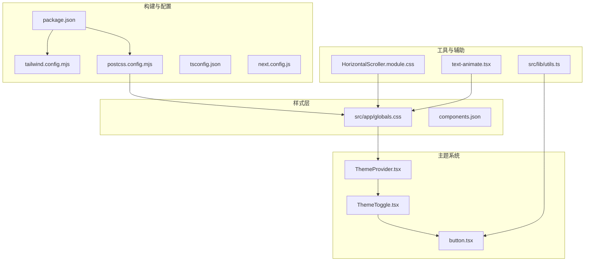
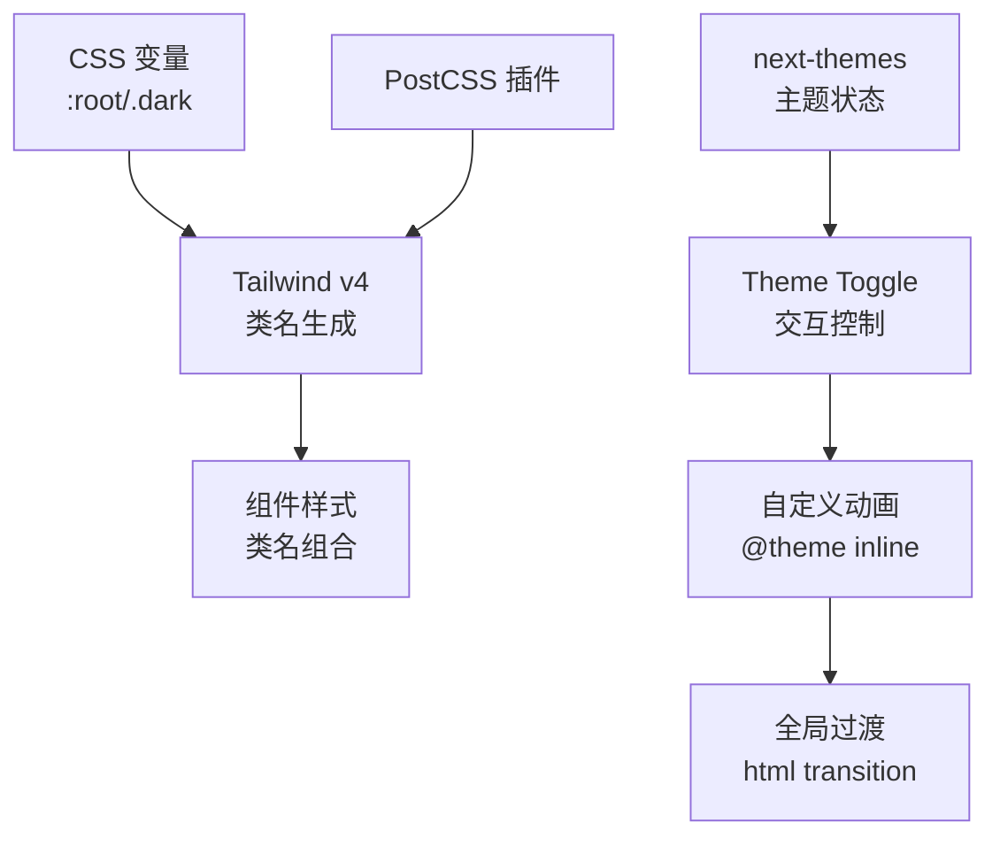
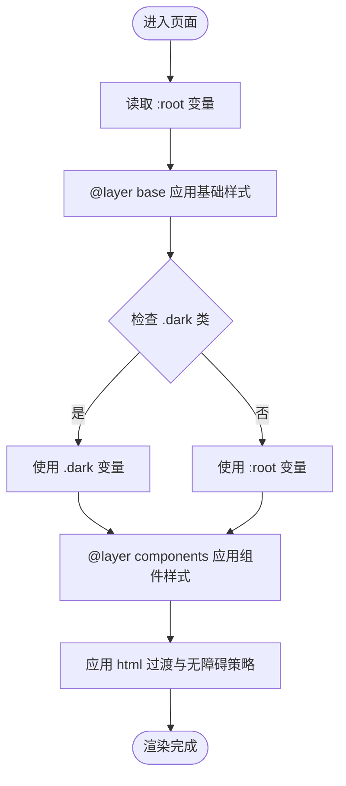
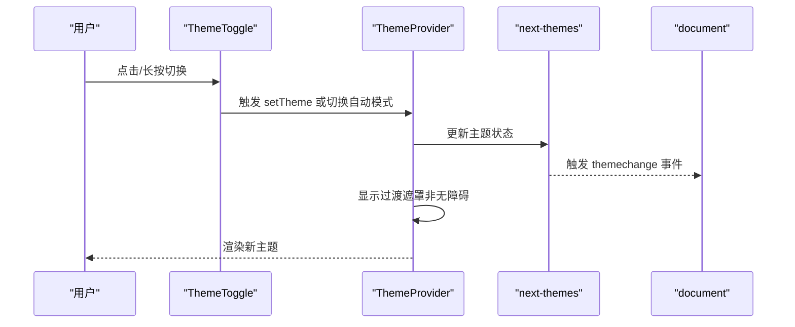
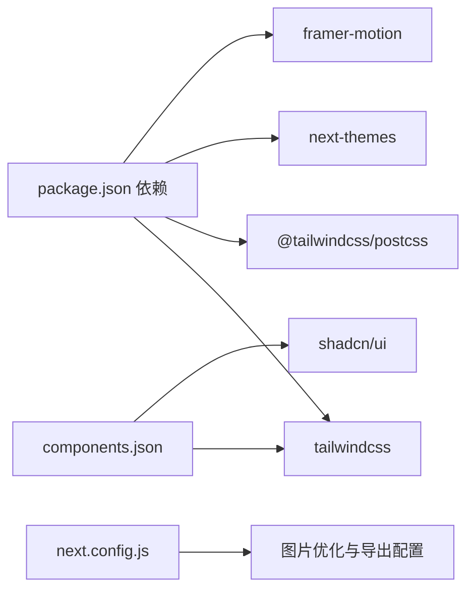

# 样式系统与主题配置

<cite>
**本文档引用的文件**
- [tailwind.config.mjs](file://blog-system2/frontend/tailwind.config.mjs)
- [postcss.config.mjs](file://blog-system2/frontend/postcss.config.mjs)
- [globals.css](file://blog-system2/frontend/src/app/globals.css)
- [components.json](file://blog-system2/frontend/components.json)
- [package.json](file://blog-system2/frontend/package.json)
- [ThemeProvider.tsx](file://blog-system2/frontend/src/components/theme/ThemeProvider.tsx)
- [ThemeToggle.tsx](file://blog-system2/frontend/src/components/theme/ThemeToggle.tsx)
- [button.tsx](file://blog-system2/frontend/src/components/theme/button.tsx)
- [utils.ts](file://blog-system2/frontend/src/lib/utils.ts)
- [tsconfig.json](file://blog-system2/frontend/tsconfig.json)
- [next.config.js](file://blog-system2/frontend/next.config.js)
- [HorizontalScroller.module.css](file://blog-system2/frontend/src/components/Home/HorizontalScroll/HorizontalScroller.module.css)
- [text-animate.tsx](file://blog-system2/frontend/src/components/magicui/text-animate.tsx)
</cite>

## 目录
1. [简介](#简介)
2. [项目结构](#项目结构)
3. [核心组件](#核心组件)
4. [架构总览](#架构总览)
5. [详细组件分析](#详细组件分析)
6. [依赖关系分析](#依赖关系分析)
7. [性能考虑](#性能考虑)
8. [故障排除指南](#故障排除指南)
9. [结论](#结论)
10. [附录](#附录)

## 简介
本文件面向技术博客平台的样式系统与主题配置，系统性阐述 Tailwind CSS v4 配置、自定义主题变量、响应式设计与移动端适配策略、颜色系统与字体系统、暗色/亮色主题切换机制、CSS 变量与使用规范、PostCSS 配置与预处理器设置，并提供样式编写示例与最佳实践，以及性能优化与浏览器兼容性建议。

## 项目结构
该前端采用 Next.js 应用程序路由（App Router），样式体系由 Tailwind CSS v4、PostCSS 插件、CSS 变量与自定义动画构成；主题切换通过 next-themes 实现，结合 Framer Motion 提供流畅的切换过渡与无障碍支持。

**图表来源**
- [tailwind.config.mjs:1-18](file://blog-system2/frontend/tailwind.config.mjs#L1-L18)
- [postcss.config.mjs:1-6](file://blog-system2/frontend/postcss.config.mjs#L1-L6)
- [globals.css:1-681](file://blog-system2/frontend/src/app/globals.css#L1-L681)
- [components.json:1-21](file://blog-system2/frontend/components.json#L1-L21)
- [package.json:1-72](file://blog-system2/frontend/package.json#L1-L72)
- [ThemeProvider.tsx:1-161](file://blog-system2/frontend/src/components/theme/ThemeProvider.tsx#L1-L161)
- [ThemeToggle.tsx:1-343](file://blog-system2/frontend/src/components/theme/ThemeToggle.tsx#L1-L343)
- [button.tsx:1-53](file://blog-system2/frontend/src/components/theme/button.tsx#L1-L53)
- [utils.ts:1-7](file://blog-system2/frontend/src/lib/utils.ts#L1-L7)
- [HorizontalScroller.module.css:1-36](file://blog-system2/frontend/src/components/Home/HorizontalScroll/HorizontalScroller.module.css#L1-L36)
- [text-animate.tsx:1-474](file://blog-system2/frontend/src/components/magicui/text-animate.tsx#L1-L474)

**章节来源**
- [tailwind.config.mjs:1-18](file://blog-system2/frontend/tailwind.config.mjs#L1-L18)
- [postcss.config.mjs:1-6](file://blog-system2/frontend/postcss.config.mjs#L1-L6)
- [globals.css:1-681](file://blog-system2/frontend/src/app/globals.css#L1-L681)
- [components.json:1-21](file://blog-system2/frontend/components.json#L1-L21)
- [package.json:1-72](file://blog-system2/frontend/package.json#L1-L72)

## 核心组件
- Tailwind CSS v4 配置：启用类名扫描范围、暗色模式策略为 class，加载 Typography 插件。
- PostCSS 配置：使用 @tailwindcss/postcss 插件，确保 Tailwind 指令正确解析。
- 全局样式：定义 CSS 变量、@theme inline 动画、根与 .dark 的颜色映射、基础层与组件层样式。
- 主题系统：ThemeProvider 封装 next-themes，提供自动/手动模式、无障碍与过渡动画；ThemeToggle 提供交互按钮与长按切换自动模式。
- 工具函数：cn 合并类名，统一 Tailwind 与 clsx 行为。
- 组件库配置：shadcn/ui 使用 CSS 变量、Tailwind 配置路径与别名。

**章节来源**
- [tailwind.config.mjs:1-18](file://blog-system2/frontend/tailwind.config.mjs#L1-L18)
- [postcss.config.mjs:1-6](file://blog-system2/frontend/postcss.config.mjs#L1-L6)
- [globals.css:1-681](file://blog-system2/frontend/src/app/globals.css#L1-L681)
- [ThemeProvider.tsx:1-161](file://blog-system2/frontend/src/components/theme/ThemeProvider.tsx#L1-L161)
- [ThemeToggle.tsx:1-343](file://blog-system2/frontend/src/components/theme/ThemeToggle.tsx#L1-L343)
- [button.tsx:1-53](file://blog-system2/frontend/src/components/theme/button.tsx#L1-L53)
- [utils.ts:1-7](file://blog-system2/frontend/src/lib/utils.ts#L1-L7)
- [components.json:1-21](file://blog-system2/frontend/components.json#L1-L21)

## 架构总览
样式系统围绕“变量驱动 + 类名驱动 + 主题切换”展开：CSS 变量承载颜色与半径等设计令牌；Tailwind 提供原子化样式；next-themes 管理主题状态与持久化；PostCSS 负责编译与指令注入。

**图表来源**
- [globals.css:6-184](file://blog-system2/frontend/src/app/globals.css#L6-L184)
- [tailwind.config.mjs:1-18](file://blog-system2/frontend/tailwind.config.mjs#L1-L18)
- [postcss.config.mjs:1-6](file://blog-system2/frontend/postcss.config.mjs#L1-L6)
- [ThemeProvider.tsx:40-63](file://blog-system2/frontend/src/components/theme/ThemeProvider.tsx#L40-L63)
- [ThemeToggle.tsx:10-90](file://blog-system2/frontend/src/components/theme/ThemeToggle.tsx#L10-L90)

## 详细组件分析

### Tailwind CSS v4 配置
- 内容扫描范围：覆盖 pages、components、app 目录，确保类名被正确提取。
- 暗色模式：class 策略，配合 .dark 选择器实现主题切换。
- 插件：加载 Typography 插件，增强文档类内容的排版表现。

**章节来源**
- [tailwind.config.mjs:4-14](file://blog-system2/frontend/tailwind.config.mjs#L4-L14)

### PostCSS 配置与预处理器
- 插件：使用 @tailwindcss/postcss，确保 @tailwind、@apply、@layer 等指令生效。
- 与 Tailwind v4 的集成：通过插件链路完成指令解析与输出。

**章节来源**
- [postcss.config.mjs:1-6](file://blog-system2/frontend/postcss.config.mjs#L1-L6)

### 全局样式与 CSS 变量系统
- 设计令牌：使用 oklch 颜色空间定义主色、前景、背景、卡片、弹出层、输入、边框、环形光晕等。
- 变量映射：:root 定义亮色变量，.dark 定义暗色变量；@theme inline 定义动画变量与关键帧。
- 基础层与组件层：@layer base 与 @layer components 管理基础样式与组件样式优先级。
- 过渡与无障碍：html 设置平滑过渡；媒体查询与 prefers-reduced-motion 降低动画。
- 移动端适配：媒体查询与触摸优化，如 -webkit-overflow-scrolling、禁用长按菜单等。

**图表来源**
- [globals.css:6-194](file://blog-system2/frontend/src/app/globals.css#L6-L194)
- [globals.css:202-387](file://blog-system2/frontend/src/app/globals.css#L202-L387)

**章节来源**
- [globals.css:6-194](file://blog-system2/frontend/src/app/globals.css#L6-L194)
- [globals.css:202-387](file://blog-system2/frontend/src/app/globals.css#L202-L387)

### 主题切换实现（ThemeProvider）
- 包装 next-themes：禁用系统主题，统一管理 light/dark。
- 首屏防抖：mounted 后再渲染，避免 SSR 与 CSR 不一致导致的闪烁。
- 自动模式：基于时间（6:00-18:00）自动切换，支持用户覆盖与持久化。
- 过渡遮罩：在主题切换时显示短暂遮罩，减少视觉突变。
- 无障碍：监听 prefers-reduced-motion，自动降低动画强度。

**图表来源**
- [ThemeProvider.tsx:40-161](file://blog-system2/frontend/src/components/theme/ThemeProvider.tsx#L40-L161)
- [ThemeToggle.tsx:10-158](file://blog-system2/frontend/src/components/theme/ThemeToggle.tsx#L10-L158)

**章节来源**
- [ThemeProvider.tsx:40-161](file://blog-system2/frontend/src/components/theme/ThemeProvider.tsx#L40-L161)
- [ThemeToggle.tsx:10-158](file://blog-system2/frontend/src/components/theme/ThemeToggle.tsx#L10-L158)

### 主题切换按钮（ThemeToggle）
- 自动/手动模式：通过本地存储标记，长按 800ms 切换自动模式。
- 动画反馈：根据主题显示日/夜场景，配合 Framer Motion 的缩放与透明度过渡。
- 无障碍：尊重系统偏好，减少动画或暂停动画。
- 事件分发：向全局发送 themechange 与 autoModeChange 事件，供其他模块订阅。

**章节来源**
- [ThemeToggle.tsx:10-343](file://blog-system2/frontend/src/components/theme/ThemeToggle.tsx#L10-L343)

### 按钮组件与类名合并（button.tsx 与 utils.ts）
- 按钮变体：通过 cva 定义默认/破坏性/轮廓/次要/幽灵/链接等变体与尺寸。
- 类名合并：cn 使用 clsx 与 tailwind-merge 合并类名，避免冲突。
- 与主题联动：按钮颜色继承自 CSS 变量，随主题自动切换。

**章节来源**
- [button.tsx:6-53](file://blog-system2/frontend/src/components/theme/button.tsx#L6-L53)
- [utils.ts:4-6](file://blog-system2/frontend/src/lib/utils.ts#L4-L6)

### 响应式设计与移动端适配
- 媒体查询：针对移动端进行前景层遮罩、文本尺寸与容器缩放优化。
- 触摸设备优化：禁用 hover 效果、隐藏装饰性动画、恢复系统光标。
- 减少运动：prefers-reduced-motion 下缩短动画时长或禁用动画。
- 滚动优化：-webkit-overflow-scrolling: touch 提升滚动体验。

**章节来源**
- [globals.css:225-242](file://blog-system2/frontend/src/app/globals.css#L225-L242)
- [globals.css:381-387](file://blog-system2/frontend/src/app/globals.css#L381-L387)
- [HorizontalScroller.module.css:31-35](file://blog-system2/frontend/src/components/Home/HorizontalScroll/HorizontalScroller.module.css#L31-L35)

### 动画与过渡系统
- CSS 变量动画：orbit、aurora、meteor、rippling、snow-shine、falling、scrollUp/Down 等。
- 关键帧：集中定义于 @theme inline 与全局样式中，便于复用与维护。
- 组件动画：TextAnimate 支持文本、单词、字符、行级别的多种入场/出场动画，可循环播放并受视口可见性控制。

**章节来源**
- [globals.css:46-114](file://blog-system2/frontend/src/app/globals.css#L46-L114)
- [globals.css:350-368](file://blog-system2/frontend/src/app/globals.css#L350-L368)
- [globals.css:407-448](file://blog-system2/frontend/src/app/globals.css#L407-L448)
- [text-animate.tsx:75-306](file://blog-system2/frontend/src/components/magicui/text-animate.tsx#L75-L306)

## 依赖关系分析
- 构建链路：package.json 中 tailwindcss、@tailwindcss/postcss、tw-animate-css 等依赖，与 tailwind.config.mjs、postcss.config.mjs 形成闭环。
- 组件库：shadcn/ui 通过 components.json 配置 Tailwind 路径、CSS 变量开关与别名。
- 主题依赖：next-themes 提供主题状态管理，与自定义组件协同工作。
- TypeScript：tsconfig.json 与 Next.js 配置影响资源加载与图片优化策略。

**图表来源**
- [package.json:13-42](file://blog-system2/frontend/package.json#L13-L42)
- [components.json:6-12](file://blog-system2/frontend/components.json#L6-L12)
- [next.config.js:20-33](file://blog-system2/frontend/next.config.js#L20-L33)

**章节来源**
- [package.json:13-42](file://blog-system2/frontend/package.json#L13-L42)
- [components.json:1-21](file://blog-system2/frontend/components.json#L1-L21)
- [next.config.js:1-48](file://blog-system2/frontend/next.config.js#L1-L48)

## 性能考虑
- 原子化样式：Tailwind 原子类减少重复样式，提升缓存命中率。
- CSS 变量：集中管理设计令牌，避免重复定义与重构成本。
- 动画优化：prefers-reduced-motion 降级、过渡时长合理设置、关键路径动画最小化。
- 图片与静态资源：Next.js 图片优化与导出配置，减少首屏阻塞。
- 代码分割：组件按需加载，避免一次性引入大量动画与资源。

[本节为通用指导，无需特定文件引用]

## 故障排除指南
- 主题切换无效果：确认 .dark 类是否正确挂载，检查 ThemeProvider 是否包裹应用根节点。
- 动画异常：检查 prefers-reduced-motion 条件下的降级逻辑，确认关键帧与变量是否正确注入。
- 类名冲突：使用 cn 合并类名，避免重复覆盖；必要时调整 @layer 顺序。
- 构建失败：确认 Tailwind 与 PostCSS 版本兼容，检查 tailwind.config.mjs 与 postcss.config.mjs 路径与语法。

**章节来源**
- [ThemeProvider.tsx:40-63](file://blog-system2/frontend/src/components/theme/ThemeProvider.tsx#L40-L63)
- [globals.css:381-387](file://blog-system2/frontend/src/app/globals.css#L381-L387)
- [utils.ts:4-6](file://blog-system2/frontend/src/lib/utils.ts#L4-L6)

## 结论
该样式系统以 CSS 变量为核心设计令牌，结合 Tailwind v4 的原子化能力与 next-themes 的主题管理，实现了可维护、可扩展且对无障碍友好的主题体系。通过 PostCSS 指令与 @theme inline 动画，进一步提升了样式的模块化与复用性。响应式与移动端适配策略完善，兼顾性能与体验。

[本节为总结性内容，无需特定文件引用]

## 附录

### 颜色系统与设计令牌
- 颜色命名：background、foreground、primary、secondary、muted、accent、destructive、border、input、ring、popover、card、chart-*、sidebar-* 等。
- 颜色空间：oklch，提供更均匀的感知一致性与更好的明度对比。
- 暗/亮模式：:root 与 .dark 分别定义变量值，实现无缝切换。

**章节来源**
- [globals.css:117-184](file://blog-system2/frontend/src/app/globals.css#L117-L184)

### 字体系统与排版
- 字体变量：--font-sans、--font-mono，通过 CSS 变量与 Tailwind 类名组合使用。
- 排版增强：Typography 插件提供文档类内容的排版优化。

**章节来源**
- [globals.css:9-10](file://blog-system2/frontend/src/app/globals.css#L9-L10)
- [tailwind.config.mjs:1-1](file://blog-system2/frontend/tailwind.config.mjs#L1-L1)

### 间距系统与圆角
- 间距：通过 Tailwind 间距类与 CSS 变量组合，保证一致性。
- 圆角：--radius-sm、--radius-md、--radius-lg、--radius-xl 与 Tailwind border-radius 类配合使用。

**章节来源**
- [globals.css:40-44](file://blog-system2/frontend/src/app/globals.css#L40-L44)

### 样式编写示例与最佳实践
- 使用 CSS 变量：优先通过 --color-* 与 --radius-* 使用设计令牌。
- 组合类名：使用 cn 合并多个类名，避免冲突。
- 动画渐进：为复杂动画提供无障碍降级，尊重用户偏好。
- 组件化：将动画与交互封装为可复用组件（如 TextAnimate）。

**章节来源**
- [utils.ts:4-6](file://blog-system2/frontend/src/lib/utils.ts#L4-L6)
- [text-animate.tsx:308-474](file://blog-system2/frontend/src/components/magicui/text-animate.tsx#L308-L474)

### 浏览器兼容性与构建配置
- 构建目标：ES2017，支持现代浏览器特性。
- 图片优化：Next.js 图片优化与 WebP 格式，提升加载性能。
- 导出与路径：GitHub Pages 环境下的 basePath 与 assetPrefix 配置。

**章节来源**
- [tsconfig.json:3-16](file://blog-system2/frontend/tsconfig.json#L3-L16)
- [next.config.js:3-11](file://blog-system2/frontend/next.config.js#L3-L11)
- [next.config.js:20-33](file://blog-system2/frontend/next.config.js#L20-L33)