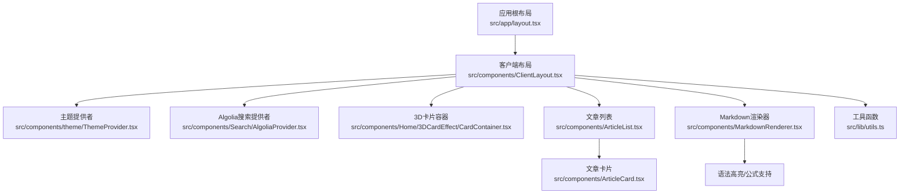
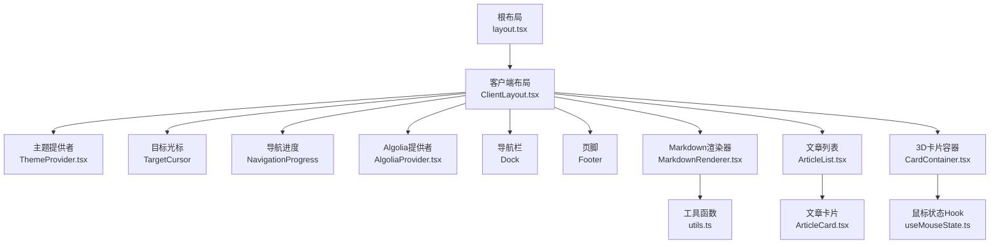
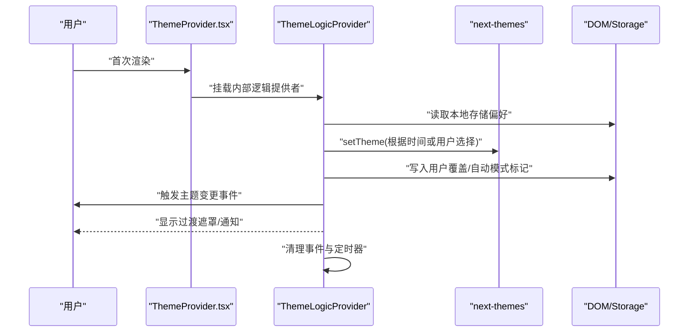
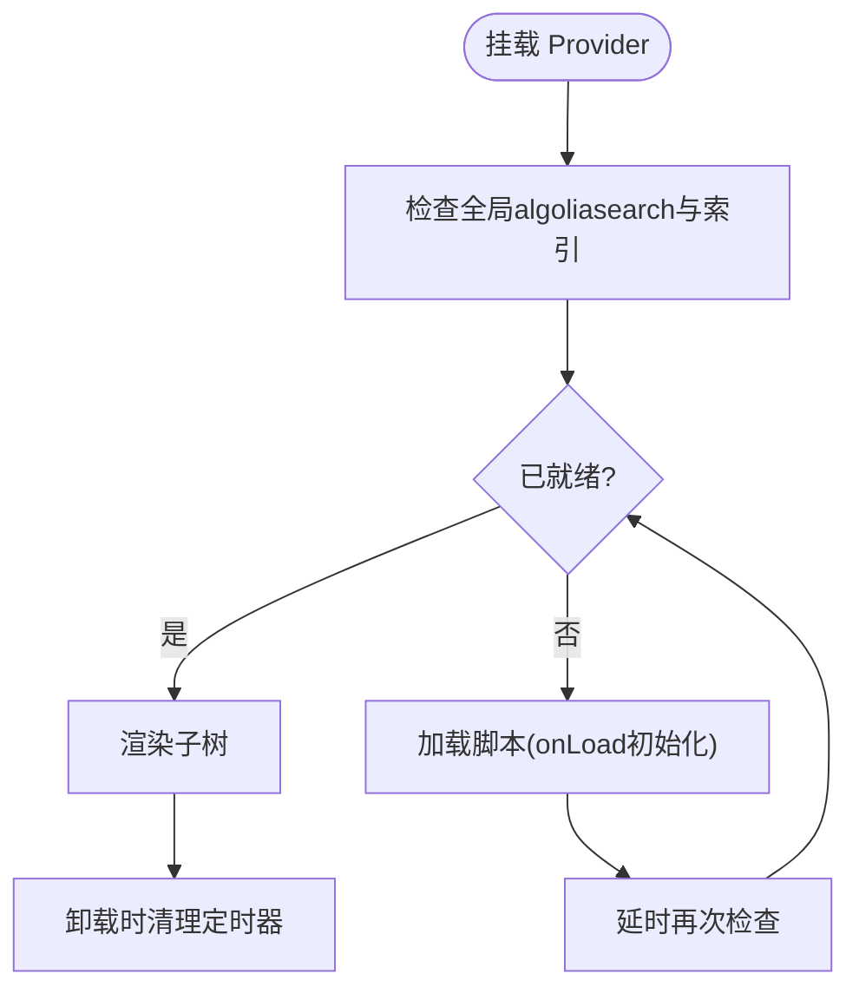
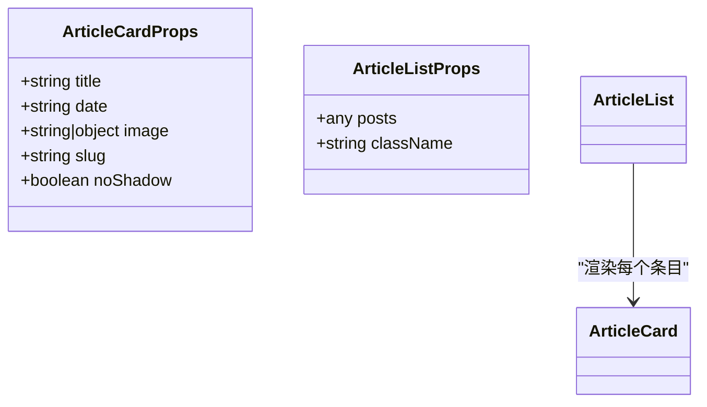
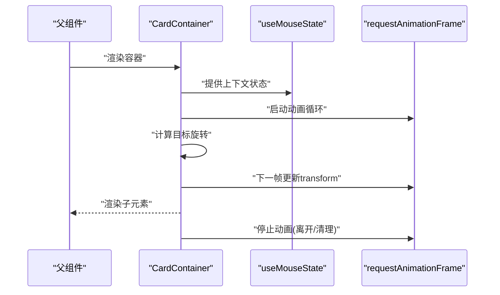
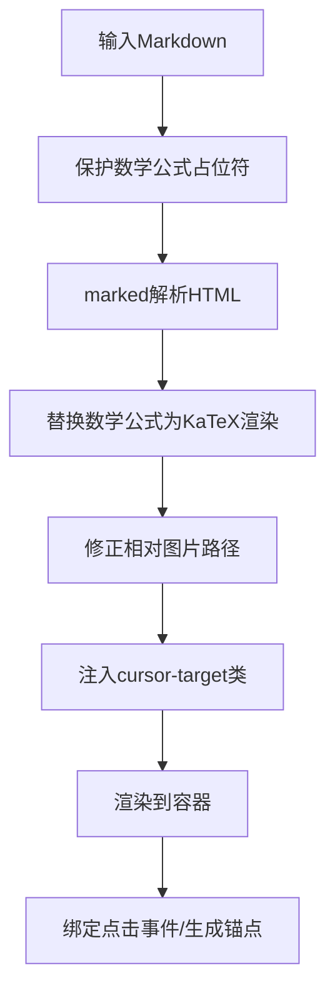
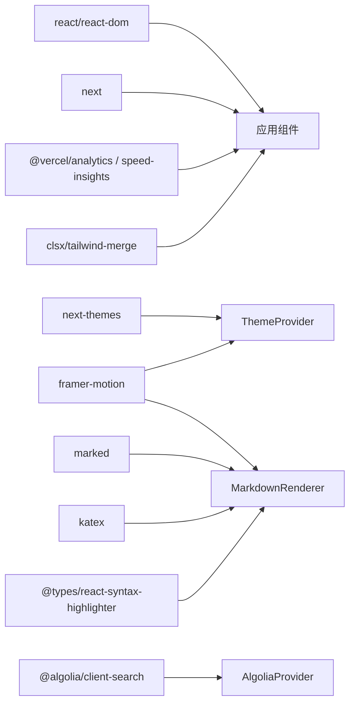

# 组件开发最佳实践

<cite>
**本文引用的文件**
- [src/app/layout.tsx](file://blog-system2/frontend/src/app/layout.tsx)
- [src/components/ClientLayout.tsx](file://blog-system2/frontend/src/components/ClientLayout.tsx)
- [src/components/theme/ThemeProvider.tsx](file://blog-system2/frontend/src/components/theme/ThemeProvider.tsx)
- [src/components/Search/AlgoliaProvider.tsx](file://blog-system2/frontend/src/components/Search/AlgoliaProvider.tsx)
- [src/components/ArticleCard.tsx](file://blog-system2/frontend/src/components/ArticleCard.tsx)
- [src/components/ArticleList.tsx](file://blog-system2/frontend/src/components/ArticleList.tsx)
- [src/components/Home/3DCardEffect/CardContainer.tsx](file://blog-system2/frontend/src/components/Home/3DCardEffect/CardContainer.tsx)
- [src/components/Home/3DCardEffect/CardBody.tsx](file://blog-system2/frontend/src/components/Home/3DCardEffect/CardBody.tsx)
- [src/components/Home/3DCardEffect/useMouseState.ts](file://blog-system2/frontend/src/components/Home/3DCardEffect/useMouseState.ts)
- [src/components/MarkdownRenderer.tsx](file://blog-system2/frontend/src/components/MarkdownRenderer.tsx)
- [src/lib/utils.ts](file://blog-system2/frontend/src/lib/utils.ts)
- [src/lib/static-data.ts](file://blog-system2/frontend/src/lib/static-data.ts)
- [src/lib/algolia.ts](file://blog-system2/frontend/src/lib/algolia.ts)
- [src/lib/algoliaClient.ts](file://blog-system2/frontend/src/lib/algoliaClient.ts)
- [src/lib/reading-time.ts](file://blog-system2/frontend/src/lib/reading-time.ts)
- [src/lib/utils.ts](file://blog-system2/frontend/src/lib/utils.ts)
- [package.json](file://blog-system2/frontend/package.json)
- [tsconfig.json](file://blog-system2/frontend/tsconfig.json)
</cite>

## 目录
1. [引言](#引言)
2. [项目结构](#项目结构)
3. [核心组件](#核心组件)
4. [架构总览](#架构总览)
5. [详细组件分析](#详细组件分析)
6. [依赖关系分析](#依赖关系分析)
7. [性能考量](#性能考量)
8. [故障排查指南](#故障排查指南)
9. [结论](#结论)
10. [附录](#附录)

## 引言
本文件面向技术博客平台的前端组件开发，系统总结React组件的设计原则、实现模式与最佳实践。围绕Props设计规范、状态管理策略、生命周期与副作用处理、组件组合与可复用性、测试与调试策略、性能优化与内存泄漏防护等方面进行深入剖析，并结合仓库中的实际组件给出可操作的指导与图示。

## 项目结构
该前端采用Next.js应用结构，根布局负责全局元数据与字体注入，客户端布局承载主题、搜索、导航进度等横切关注点；组件按功能域分层组织，如主题、搜索、首页特效、文章渲染等模块化清晰。

图表来源
- [src/app/layout.tsx:28-47](file://blog-system2/frontend/src/app/layout.tsx#L28-L47)
- [src/components/ClientLayout.tsx:16-62](file://blog-system2/frontend/src/components/ClientLayout.tsx#L16-L62)
- [src/components/theme/ThemeProvider.tsx:40-63](file://blog-system2/frontend/src/components/theme/ThemeProvider.tsx#L40-L63)
- [src/components/Search/AlgoliaProvider.tsx:22-99](file://blog-system2/frontend/src/components/Search/AlgoliaProvider.tsx#L22-L99)
- [src/components/ArticleList.tsx:28-71](file://blog-system2/frontend/src/components/ArticleList.tsx#L28-L71)
- [src/components/ArticleCard.tsx:29-197](file://blog-system2/frontend/src/components/ArticleCard.tsx#L29-L197)
- [src/components/MarkdownRenderer.tsx:422-717](file://blog-system2/frontend/src/components/MarkdownRenderer.tsx#L422-L717)
- [src/lib/utils.ts:4-6](file://blog-system2/frontend/src/lib/utils.ts#L4-L6)

章节来源
- [src/app/layout.tsx:28-47](file://blog-system2/frontend/src/app/layout.tsx#L28-L47)
- [src/components/ClientLayout.tsx:16-62](file://blog-system2/frontend/src/components/ClientLayout.tsx#L16-L62)

## 核心组件
- 主题系统：通过主题提供者封装主题切换、自动模式、减少动画偏好与持久化状态，配合过渡动画与通知组件，确保首屏与切换体验一致。
- 搜索集成：Algolia提供者负责脚本加载、索引初始化与容错检查，保证搜索能力在SSR/CSR环境稳定可用。
- 文章展示：文章卡片与列表组件解耦Props与渲染，支持多种图片结构与懒加载，具备错误回退与可选阴影控制。
- 3D交互：3D卡片容器与鼠标状态Hook协作，基于requestAnimationFrame实现顺滑旋转，适配触摸设备。
- Markdown渲染：内置marked解析、KaTeX数学公式渲染、代码高亮、图片灯箱、锚点生成与无障碍交互。

章节来源
- [src/components/theme/ThemeProvider.tsx:40-161](file://blog-system2/frontend/src/components/theme/ThemeProvider.tsx#L40-L161)
- [src/components/Search/AlgoliaProvider.tsx:22-100](file://blog-system2/frontend/src/components/Search/AlgoliaProvider.tsx#L22-L100)
- [src/components/ArticleCard.tsx:21-198](file://blog-system2/frontend/src/components/ArticleCard.tsx#L21-L198)
- [src/components/ArticleList.tsx:7-72](file://blog-system2/frontend/src/components/ArticleList.tsx#L7-L72)
- [src/components/Home/3DCardEffect/CardContainer.tsx:19-121](file://blog-system2/frontend/src/components/Home/3DCardEffect/CardContainer.tsx#L19-L121)
- [src/components/Home/3DCardEffect/useMouseState.ts:3-11](file://blog-system2/frontend/src/components/Home/3DCardEffect/useMouseState.ts#L3-L11)
- [src/components/MarkdownRenderer.tsx:422-718](file://blog-system2/frontend/src/components/MarkdownRenderer.tsx#L422-L718)

## 架构总览
下图展示了从根布局到客户端布局、再到各功能组件的调用链与依赖关系，体现“容器-展示”分层与跨域关注点的注入方式。

图表来源
- [src/app/layout.tsx:28-47](file://blog-system2/frontend/src/app/layout.tsx#L28-L47)
- [src/components/ClientLayout.tsx:16-62](file://blog-system2/frontend/src/components/ClientLayout.tsx#L16-L62)
- [src/components/theme/ThemeProvider.tsx:40-63](file://blog-system2/frontend/src/components/theme/ThemeProvider.tsx#L40-L63)
- [src/components/Search/AlgoliaProvider.tsx:22-99](file://blog-system2/frontend/src/components/Search/AlgoliaProvider.tsx#L22-L99)
- [src/components/ArticleList.tsx:28-71](file://blog-system2/frontend/src/components/ArticleList.tsx#L28-L71)
- [src/components/ArticleCard.tsx:29-197](file://blog-system2/frontend/src/components/ArticleCard.tsx#L29-L197)
- [src/components/MarkdownRenderer.tsx:422-717](file://blog-system2/frontend/src/components/MarkdownRenderer.tsx#L422-L717)
- [src/components/Home/3DCardEffect/CardContainer.tsx:19-121](file://blog-system2/frontend/src/components/Home/3DCardEffect/CardContainer.tsx#L19-L121)
- [src/components/Home/3DCardEffect/useMouseState.ts:3-11](file://blog-system2/frontend/src/components/Home/3DCardEffect/useMouseState.ts#L3-L11)
- [src/lib/utils.ts:4-6](file://blog-system2/frontend/src/lib/utils.ts#L4-L6)

## 详细组件分析

### 主题提供者（ThemeProvider）
- 设计要点
  - 双层Provider：外层next-themes负责主题切换与系统偏好；内层ThemeLogicProvider集中处理自动模式、用户覆盖、减少动画偏好与定时更新。
  - 首屏防闪烁：挂载标记与默认类名隐藏策略，确保服务端与客户端一致。
  - 动画与通知：基于Framer Motion的淡入遮罩与主题通知组件，提升切换体验。
- Props与默认值
  - 接收next-themes的全部配置项，通过扩展属性传入，保持兼容性。
- 生命周期与副作用
  - 初始化：检测减少动画偏好、用户覆盖、自动模式；按时间自动切换主题；每分钟轮询更新。
  - 清理：移除事件监听与定时器，防止内存泄漏。
- 可复用性
  - 将主题逻辑抽离为独立Hook与组件，便于在多页面共享。

图表来源
- [src/components/theme/ThemeProvider.tsx:40-161](file://blog-system2/frontend/src/components/theme/ThemeProvider.tsx#L40-L161)

章节来源
- [src/components/theme/ThemeProvider.tsx:40-161](file://blog-system2/frontend/src/components/theme/ThemeProvider.tsx#L40-L161)

### Algolia搜索提供者（AlgoliaProvider）
- 设计要点
  - 双重初始化：Next.js Script策略加载与后备脚本组件，确保脚本加载后立即初始化索引。
  - 健壮性：延迟检查与手动初始化，处理异步加载导致的全局未就绪问题。
  - 配置：集中管理AppId、ApiKey与IndexName，便于维护与切换。
- Props与默认值
  - 仅接收children，无其他显式默认值。
- 生命周期与副作用
  - 加载后初始化；清理定时器；避免重复初始化。
- 可复用性
  - 作为顶层Provider，向子树注入搜索客户端，统一搜索入口。

图表来源
- [src/components/Search/AlgoliaProvider.tsx:22-99](file://blog-system2/frontend/src/components/Search/AlgoliaProvider.tsx#L22-L99)

章节来源
- [src/components/Search/AlgoliaProvider.tsx:22-100](file://blog-system2/frontend/src/components/Search/AlgoliaProvider.tsx#L22-L100)

### 文章卡片与列表（ArticleCard / ArticleList）
- 设计要点
  - 图片处理：兼容字符串、扁平结构与嵌套结构，支持本地静态资源与外部API路径拼接，含错误回退。
  - Props设计：明确必需字段（标题、日期、slug）与可选字段（阴影控制），默认值安全。
  - 列表泛化：接受数组或带data字段的对象，统一映射为标准结构，支持空态提示。
- 状态与副作用
  - 卡片内部无复杂状态；列表侧进行数据预处理与格式化。
- 可复用性
  - 卡片组件职责单一，可在不同上下文中复用；列表组件负责聚合与网格布局。

图表来源
- [src/components/ArticleCard.tsx:21-35](file://blog-system2/frontend/src/components/ArticleCard.tsx#L21-L35)
- [src/components/ArticleList.tsx:7-31](file://blog-system2/frontend/src/components/ArticleList.tsx#L7-L31)

章节来源
- [src/components/ArticleCard.tsx:21-198](file://blog-system2/frontend/src/components/ArticleCard.tsx#L21-L198)
- [src/components/ArticleList.tsx:7-72](file://blog-system2/frontend/src/components/ArticleList.tsx#L7-L72)

### 3D卡片容器与鼠标状态（CardContainer / useMouseState）
- 设计要点
  - 上下文传递：MouseStateContext向下传递进入状态，供子组件共享。
  - 动画循环：基于requestAnimationFrame实现阻尼旋转，适配触摸设备特性。
  - 触摸适配：通过媒体查询识别触摸设备，禁用鼠标相关动画。
- 状态与副作用
  - useMouseState：简单状态钩子，保存进入状态。
  - CardContainer：启动/停止动画循环，清理帧动画。
- 可复用性
  - 容器组件可被任意3D子元素包裹，统一提供交互行为。

图表来源
- [src/components/Home/3DCardEffect/CardContainer.tsx:19-121](file://blog-system2/frontend/src/components/Home/3DCardEffect/CardContainer.tsx#L19-L121)
- [src/components/Home/3DCardEffect/useMouseState.ts:3-11](file://blog-system2/frontend/src/components/Home/3DCardEffect/useMouseState.ts#L3-L11)

章节来源
- [src/components/Home/3DCardEffect/CardContainer.tsx:19-121](file://blog-system2/frontend/src/components/Home/3DCardEffect/CardContainer.tsx#L19-L121)
- [src/components/Home/3DCardEffect/CardBody.tsx:12-30](file://blog-system2/frontend/src/components/Home/3DCardEffect/CardBody.tsx#L12-L30)
- [src/components/Home/3DCardEffect/useMouseState.ts:3-11](file://blog-system2/frontend/src/components/Home/3DCardEffect/useMouseState.ts#L3-L11)

### Markdown渲染器（MarkdownRenderer）
- 设计要点
  - 解析管线：marked + KaTeX数学公式保护替换 + 自定义代码块节点。
  - 交互增强：点击图片打开灯箱、生成标题锚点、为可交互元素添加类名。
  - 性能：使用useMemo缓存渲染结果，useCallback稳定回调，Portal减少层级。
- 状态与副作用
  - mounted标记、轻量状态（复制提示、折叠状态）、键盘事件与滚动锁定副作用。
- 可复用性
  - 作为纯展示组件，可被文章详情页、评论区等复用。

图表来源
- [src/components/MarkdownRenderer.tsx:465-546](file://blog-system2/frontend/src/components/MarkdownRenderer.tsx#L465-L546)
- [src/components/MarkdownRenderer.tsx:596-632](file://blog-system2/frontend/src/components/MarkdownRenderer.tsx#L596-L632)

章节来源
- [src/components/MarkdownRenderer.tsx:422-718](file://blog-system2/frontend/src/components/MarkdownRenderer.tsx#L422-L718)

## 依赖关系分析
- 运行时依赖
  - next、react、react-dom：框架与运行时。
  - next-themes：主题切换与系统偏好。
  - framer-motion：动画与过渡。
  - marked、katex、react-syntax-highlighter：Markdown与代码高亮。
  - @vercel/analytics、@vercel/speed-insights：性能与分析。
  - algoliasearch、@algolia/client-search：搜索客户端。
- TypeScript与工具
  - tsconfig启用严格模式与路径别名，类型根目录包含自定义声明。
  - clsx/tailwind-merge用于类名合并，提升样式可控性。

图表来源
- [package.json:13-42](file://blog-system2/frontend/package.json#L13-L42)
- [tsconfig.json:21-28](file://blog-system2/frontend/tsconfig.json#L21-L28)

章节来源
- [package.json:13-42](file://blog-system2/frontend/package.json#L13-L42)
- [tsconfig.json:21-28](file://blog-system2/frontend/tsconfig.json#L21-L28)

## 性能考量
- 渲染与动画
  - 使用useMemo缓存昂贵计算（如Markdown渲染），避免重复解析。
  - 使用useCallback稳定事件处理器，减少子组件重渲染。
  - Framer Motion的will-change与预设动画参数降低布局抖动。
- 资源加载
  - Next.js Script策略加载第三方脚本，必要时延迟初始化。
  - 图片懒加载与错误回退，减少失败重试成本。
- 交互与滚动
  - 打开灯箱时锁定滚动并计算滚动条宽度，避免布局跳变。
- 状态管理
  - 简单状态使用useState；跨组件共享使用Context；复杂状态可考虑轻量状态库（如zustand）替代useReducer以降低样板代码。

## 故障排查指南
- 主题切换异常
  - 检查是否正确包裹ThemeProvider；确认系统偏好与用户覆盖标记；观察过渡遮罩是否出现。
- 搜索不可用
  - 查看脚本加载是否完成；确认algoliasearch与索引对象存在；检查onLoad初始化分支。
- 图片加载失败
  - 确认URL前缀拼接逻辑；检查错误回退路径；查看控制台错误信息。
- 3D动画卡顿
  - 检查RAF循环是否被频繁启动；确认触摸设备判定；验证阻尼系数与透视距离。
- Markdown渲染问题
  - 检查占位符替换顺序；确认KaTeX渲染异常捕获；核对图片路径修正规则。

章节来源
- [src/components/theme/ThemeProvider.tsx:138-149](file://blog-system2/frontend/src/components/theme/ThemeProvider.tsx#L138-L149)
- [src/components/Search/AlgoliaProvider.tsx:29-70](file://blog-system2/frontend/src/components/Search/AlgoliaProvider.tsx#L29-L70)
- [src/components/ArticleCard.tsx:109-114](file://blog-system2/frontend/src/components/ArticleCard.tsx#L109-L114)
- [src/components/Home/3DCardEffect/CardContainer.tsx:47-76](file://blog-system2/frontend/src/components/Home/3DCardEffect/CardContainer.tsx#L47-L76)
- [src/components/MarkdownRenderer.tsx:494-514](file://blog-system2/frontend/src/components/MarkdownRenderer.tsx#L494-L514)

## 结论
本项目在组件层面体现了清晰的职责分离与良好的可复用性：主题、搜索、渲染、交互等横切关注点通过Provider与Hook抽象，既保证了功能完整性，也降低了耦合度。遵循本文Props设计、状态管理、生命周期与副作用处理、组合与复用、性能优化与故障排查建议，可进一步提升组件质量与开发效率。

## 附录
- 组件分类与职责
  - UI组件：ArticleCard、CardBody、MarkdownRenderer中部分子组件，专注视觉与交互。
  - 业务组件：ArticleList、AlgoliaProvider、ThemeProvider，封装业务规则与外部集成。
  - 容器组件：ClientLayout、CardContainer，协调多个子组件与副作用。
- 测试与调试建议
  - 为Props边界条件编写快照测试（如空数据、错误图片URL）。
  - 使用React DevTools Profiler定位重渲染热点。
  - 对副作用组件（如主题、搜索、Markdown）模拟事件与存储变化，验证清理逻辑。
- 最佳实践清单
  - 明确Props类型与默认值；为可选字段提供安全回退。
  - 将复杂状态下沉至Context或状态库，避免深层传递。
  - 在useEffect中成对注册/清理，防止内存泄漏。
  - 使用useMemo/useCallback缓存昂贵计算与回调。
  - 为交互元素提供无障碍属性与键盘支持。