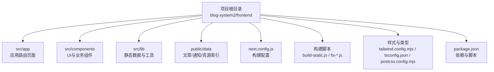
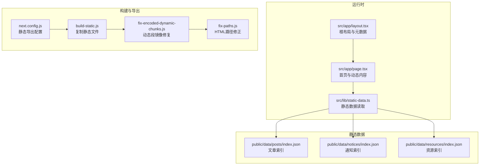
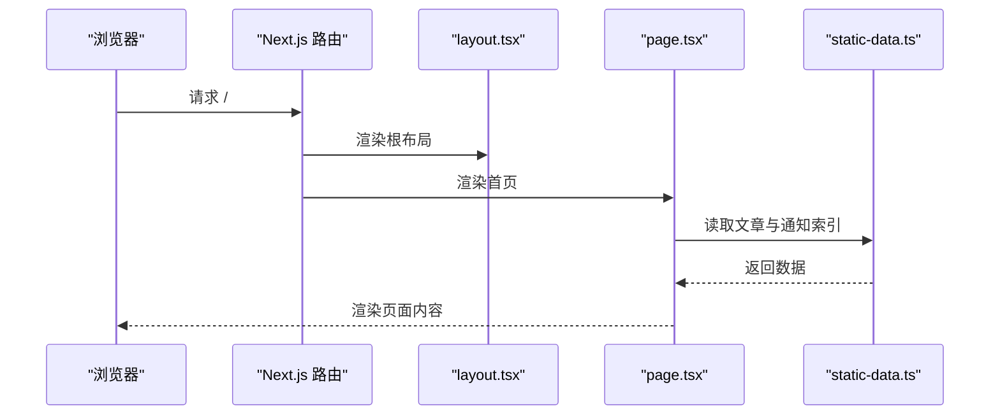
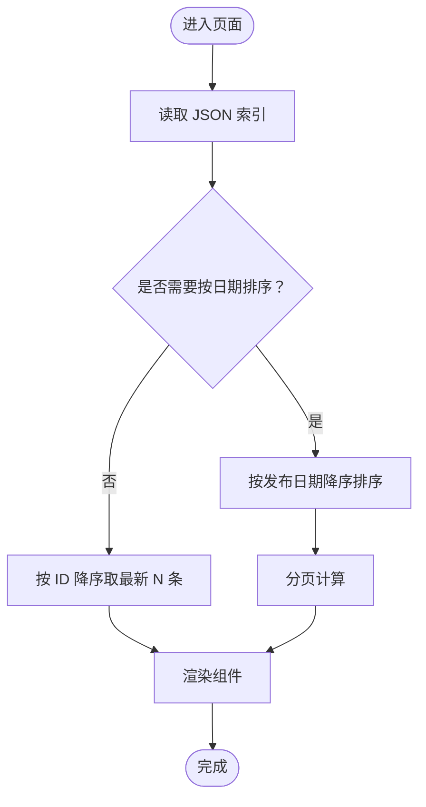
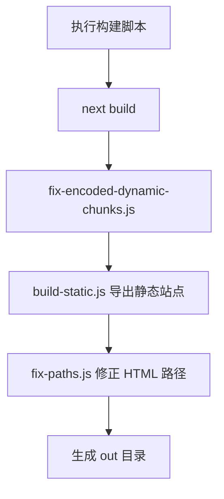
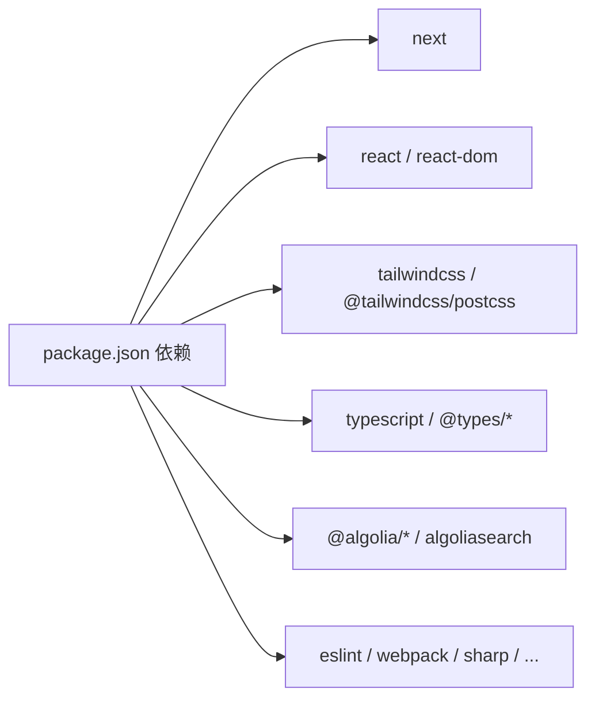

# 快速开始

<cite>
**本文引用的文件**
- [package.json](file://blog-system2/frontend/package.json)
- [next.config.js](file://blog-system2/frontend/next.config.js)
- [README.md](file://blog-system2/frontend/README.md)
- [.gitignore](file://blog-system2/frontend/.gitignore)
- [tailwind.config.mjs](file://blog-system2/frontend/tailwind.config.mjs)
- [tsconfig.json](file://blog-system2/frontend/tsconfig.json)
- [postcss.config.mjs](file://blog-system2/frontend/postcss.config.mjs)
- [build-static.js](file://blog-system2/frontend/build-static.js)
- [fix-encoded-dynamic-chunks.js](file://blog-system2/frontend/fix-encoded-dynamic-chunks.js)
- [fix-paths.js](file://blog-system2/frontend/fix-paths.js)
- [src/app/layout.tsx](file://blog-system2/frontend/src/app/layout.tsx)
- [src/app/page.tsx](file://blog-system2/frontend/src/app/page.tsx)
- [src/lib/static-data.ts](file://blog-system2/frontend/src/lib/static-data.ts)
- [public/data/posts/index.json](file://blog-system2/frontend/public/data/posts/index.json)
- [public/data/notices/index.json](file://blog-system2/frontend/public/data/notices/index.json)
- [public/data/resources/index.json](file://blog-system2/frontend/public/data/resources/index.json)
</cite>

## 目录
1. [简介](#简介)
2. [项目结构](#项目结构)
3. [核心组件](#核心组件)
4. [架构总览](#架构总览)
5. [详细组件分析](#详细组件分析)
6. [依赖分析](#依赖分析)
7. [性能考虑](#性能考虑)
8. [故障排除指南](#故障排除指南)
9. [结论](#结论)
10. [附录](#附录)

## 简介
本指南面向首次接触该技术博客平台的开发者，帮助你在最短时间内完成环境准备、项目克隆、依赖安装、本地开发与静态导出、以及基本功能验证。平台采用 Next.js 应用程序路由模式，结合 Tailwind CSS 与 TypeScript，支持静态站点导出与多页面内容管理（文章、通知、资源），并内置 Algolia 搜索集成。

## 项目结构
前端位于 blog-system2/frontend 目录，采用 Next.js 15 应用程序路由结构，核心目录与文件如下：
- src/app：页面与布局（根布局、首页、文章页、通知页、资源页等）
- src/components：可复用组件（主题切换、搜索、动画、导航等）
- src/lib：静态数据加载与工具函数
- public/data：文章、通知、资源的索引与内容数据
- 构建与导出：next.config.js、build-static.js、fix-encoded-dynamic-chunks.js、fix-paths.js
- 样式与类型：tailwind.config.mjs、postcss.config.mjs、tsconfig.json
- 包管理与脚本：package.json、.gitignore

图表来源
- [package.json:1-72](file://blog-system2/frontend/package.json#L1-L72)
- [next.config.js:1-48](file://blog-system2/frontend/next.config.js#L1-L48)
- [tailwind.config.mjs:1-18](file://blog-system2/frontend/tailwind.config.mjs#L1-L18)
- [tsconfig.json:1-42](file://blog-system2/frontend/tsconfig.json#L1-L42)
- [postcss.config.mjs:1-6](file://blog-system2/frontend/postcss.config.mjs#L1-L6)

章节来源
- [package.json:1-72](file://blog-system2/frontend/package.json#L1-L72)
- [next.config.js:1-48](file://blog-system2/frontend/next.config.js#L1-L48)
- [tailwind.config.mjs:1-18](file://blog-system2/frontend/tailwind.config.mjs#L1-L18)
- [tsconfig.json:1-42](file://blog-system2/frontend/tsconfig.json#L1-L42)
- [postcss.config.mjs:1-6](file://blog-system2/frontend/postcss.config.mjs#L1-L6)

## 核心组件
- 应用根布局与元数据：定义站点标题、视口、字体变量与全局样式注入
- 首页：聚合最新文章与通知，展示动态背景与交互元素
- 静态数据模块：从 public/data 下的 JSON 索引读取文章、通知、资源信息，提供分页与相关文章查询
- 构建与导出：输出静态站点，修复动态路由编码镜像与路径

章节来源
- [src/app/layout.tsx:1-48](file://blog-system2/frontend/src/app/layout.tsx#L1-L48)
- [src/app/page.tsx:1-800](file://blog-system2/frontend/src/app/page.tsx#L1-L800)
- [src/lib/static-data.ts:1-214](file://blog-system2/frontend/src/lib/static-data.ts#L1-L214)

## 架构总览
系统采用“静态数据 + 动态渲染”的组合方式：
- 首页与列表页通过服务端读取 public/data 下的 JSON 索引，实现内容驱动
- 文章详情页使用动态路由 [slug]，根据 slug 从索引中匹配对应文章
- 构建阶段输出静态 HTML，配合修复脚本保证路径正确性

图表来源
- [src/app/layout.tsx:1-48](file://blog-system2/frontend/src/app/layout.tsx#L1-L48)
- [src/app/page.tsx:1-800](file://blog-system2/frontend/src/app/page.tsx#L1-L800)
- [src/lib/static-data.ts:1-214](file://blog-system2/frontend/src/lib/static-data.ts#L1-L214)
- [public/data/posts/index.json:1-103](file://blog-system2/frontend/public/data/posts/index.json#L1-L103)
- [public/data/notices/index.json:1-41](file://blog-system2/frontend/public/data/notices/index.json#L1-L41)
- [public/data/resources/index.json:1-224](file://blog-system2/frontend/public/data/resources/index.json#L1-L224)
- [next.config.js:1-48](file://blog-system2/frontend/next.config.js#L1-L48)
- [build-static.js:1-141](file://blog-system2/frontend/build-static.js#L1-L141)
- [fix-encoded-dynamic-chunks.js:1-73](file://blog-system2/frontend/fix-encoded-dynamic-chunks.js#L1-L73)
- [fix-paths.js:1-53](file://blog-system2/frontend/fix-paths.js#L1-L53)

## 详细组件分析

### 首页与根布局
- 根布局负责设置站点元信息、字体变量、视口与全局样式注入
- 首页聚合最新文章与通知，使用静态数据模块读取 JSON 索引并渲染

图表来源
- [src/app/layout.tsx:1-48](file://blog-system2/frontend/src/app/layout.tsx#L1-L48)
- [src/app/page.tsx:1-800](file://blog-system2/frontend/src/app/page.tsx#L1-L800)
- [src/lib/static-data.ts:1-214](file://blog-system2/frontend/src/lib/static-data.ts#L1-L214)

章节来源
- [src/app/layout.tsx:1-48](file://blog-system2/frontend/src/app/layout.tsx#L1-L48)
- [src/app/page.tsx:1-800](file://blog-system2/frontend/src/app/page.tsx#L1-L800)
- [src/lib/static-data.ts:1-214](file://blog-system2/frontend/src/lib/static-data.ts#L1-L214)

### 静态数据加载与查询
- 文章索引：按发布日期降序排序，支持分页与按 ID 降序取最新若干条
- 通知索引：支持置顶优先与日期降序
- 资源索引：分类组织，支持标签与置顶

图表来源
- [src/lib/static-data.ts:1-214](file://blog-system2/frontend/src/lib/static-data.ts#L1-L214)
- [public/data/posts/index.json:1-103](file://blog-system2/frontend/public/data/posts/index.json#L1-L103)
- [public/data/notices/index.json:1-41](file://blog-system2/frontend/public/data/notices/index.json#L1-L41)
- [public/data/resources/index.json:1-224](file://blog-system2/frontend/public/data/resources/index.json#L1-L224)

章节来源
- [src/lib/static-data.ts:1-214](file://blog-system2/frontend/src/lib/static-data.ts#L1-L214)
- [public/data/posts/index.json:1-103](file://blog-system2/frontend/public/data/posts/index.json#L1-L103)
- [public/data/notices/index.json:1-41](file://blog-system2/frontend/public/data/notices/index.json#L1-L41)
- [public/data/resources/index.json:1-224](file://blog-system2/frontend/public/data/resources/index.json#L1-L224)

### 构建与静态导出流程
- next.config.js 启用静态导出、路径前缀与忽略 ESLint/TS 警告
- 构建脚本链：构建 -> 修复动态块 -> 静态导出 -> 路径修正
- 修复脚本确保动态路由段的编码镜像存在，HTML 内的静态资源路径正确

图表来源
- [next.config.js:1-48](file://blog-system2/frontend/next.config.js#L1-L48)
- [build-static.js:1-141](file://blog-system2/frontend/build-static.js#L1-L141)
- [fix-encoded-dynamic-chunks.js:1-73](file://blog-system2/frontend/fix-encoded-dynamic-chunks.js#L1-L73)
- [fix-paths.js:1-53](file://blog-system2/frontend/fix-paths.js#L1-L53)
- [package.json:1-72](file://blog-system2/frontend/package.json#L1-L72)

章节来源
- [next.config.js:1-48](file://blog-system2/frontend/next.config.js#L1-L48)
- [build-static.js:1-141](file://blog-system2/frontend/build-static.js#L1-L141)
- [fix-encoded-dynamic-chunks.js:1-73](file://blog-system2/frontend/fix-encoded-dynamic-chunks.js#L1-L73)
- [fix-paths.js:1-53](file://blog-system2/frontend/fix-paths.js#L1-L53)
- [package.json:1-72](file://blog-system2/frontend/package.json#L1-L72)

## 依赖分析
- 运行时依赖：Next.js、React、Tailwind CSS、Geist 字体、Algolia 搜索客户端、动画与图形库等
- 开发依赖：TypeScript、ESLint、Tailwind CSS 插件、Webpack 插件等
- 关键脚本：dev、build、build:static、build:github、start、lint

图表来源
- [package.json:1-72](file://blog-system2/frontend/package.json#L1-L72)

章节来源
- [package.json:1-72](file://blog-system2/frontend/package.json#L1-L72)

## 性能考虑
- 静态导出：启用静态输出与路径前缀，适合 GitHub Pages 或静态托管
- 图片优化：配置图片域名与格式，避免未优化图片带来的体积与加载问题
- 动态段修复：导出后自动创建动态路由段的编码镜像，避免链接失效
- 路径修正：统一修正 HTML 中的静态资源与内部链接路径，确保相对路径正确

章节来源
- [next.config.js:1-48](file://blog-system2/frontend/next.config.js#L1-L48)
- [fix-encoded-dynamic-chunks.js:1-73](file://blog-system2/frontend/fix-encoded-dynamic-chunks.js#L1-L73)
- [fix-paths.js:1-53](file://blog-system2/frontend/fix-paths.js#L1-L53)

## 故障排除指南
- 无法启动开发服务器
  - 确认 Node.js 版本满足项目需求（Next.js 15 需要较新的 LTS 版本）
  - 清理缓存后重装依赖：删除 node_modules/.cache 并重新安装
  - 检查 .gitignore 是否误排除了必要文件
- 构建失败或导出异常
  - 确保已执行构建脚本链：先构建，再修复动态块，再导出，最后修正路径
  - 检查 next.config.js 的静态导出与路径前缀配置
- 图片或资源 404
  - 确认 public/data 下的资源路径与实际文件一致
  - 检查 next.config.js 中 images.domains 与路径前缀
- Algolia 搜索不可用
  - 确认搜索客户端初始化与索引同步逻辑正常
  - 检查环境变量与网络访问权限

章节来源
- [.gitignore:1-42](file://blog-system2/frontend/.gitignore#L1-L42)
- [next.config.js:1-48](file://blog-system2/frontend/next.config.js#L1-L48)
- [build-static.js:1-141](file://blog-system2/frontend/build-static.js#L1-L141)
- [fix-paths.js:1-53](file://blog-system2/frontend/fix-paths.js#L1-L53)

## 结论
通过本指南，你可以在本地快速搭建并运行该技术博客平台，理解其静态数据驱动与静态导出机制，并掌握常见问题的排查方法。建议在本地验证首页、文章列表、通知与资源页面的基本功能后再进行二次开发。

## 附录

### 环境要求与安装步骤
- 环境要求
  - Node.js：满足 Next.js 15 的最低版本要求（建议使用长期支持版本）
  - 包管理器：支持 npm、yarn、pnpm 或 bun
- 克隆与安装
  - 克隆仓库后，在 blog-system2/frontend 目录下安装依赖
- 启动开发服务器
  - 使用任意包管理器提供的 dev 脚本启动本地开发服务器
  - 在浏览器打开 http://localhost:3000 查看首页
- 热重载
  - 修改 src/app 与 src/components 下的文件，页面将自动刷新
- 静态导出
  - 执行构建脚本链，生成 out 目录供静态托管
- 验证方法
  - 首页应显示最新文章与通知摘要
  - 点击“全部文章”、“最近通知”等入口，确认跳转与渲染正常
  - 文章详情页通过动态路由 [slug] 访问，需确保 public/data/posts/index.json 中存在对应条目

章节来源
- [README.md:1-37](file://blog-system2/frontend/README.md#L1-L37)
- [package.json:1-72](file://blog-system2/frontend/package.json#L1-L72)
- [src/app/page.tsx:1-800](file://blog-system2/frontend/src/app/page.tsx#L1-L800)
- [public/data/posts/index.json:1-103](file://blog-system2/frontend/public/data/posts/index.json#L1-L103)