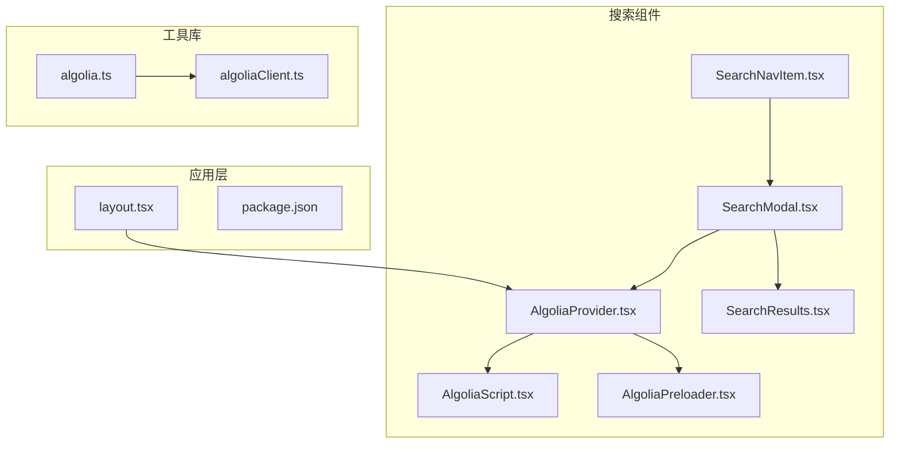
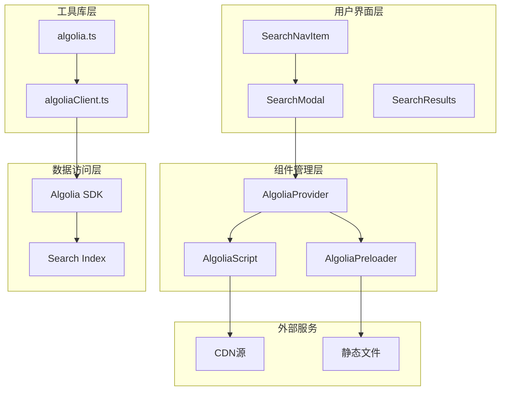
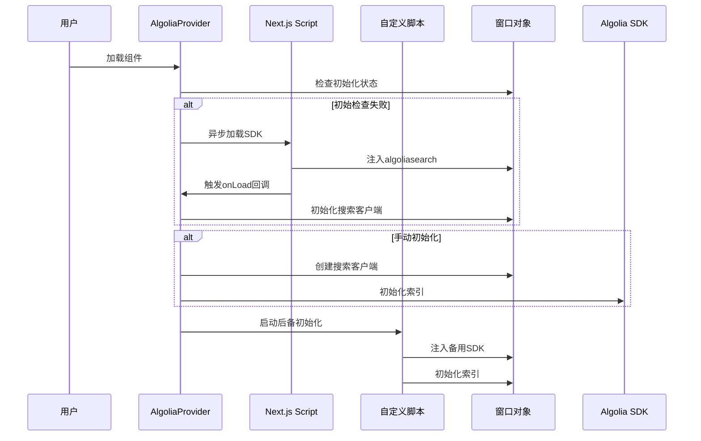
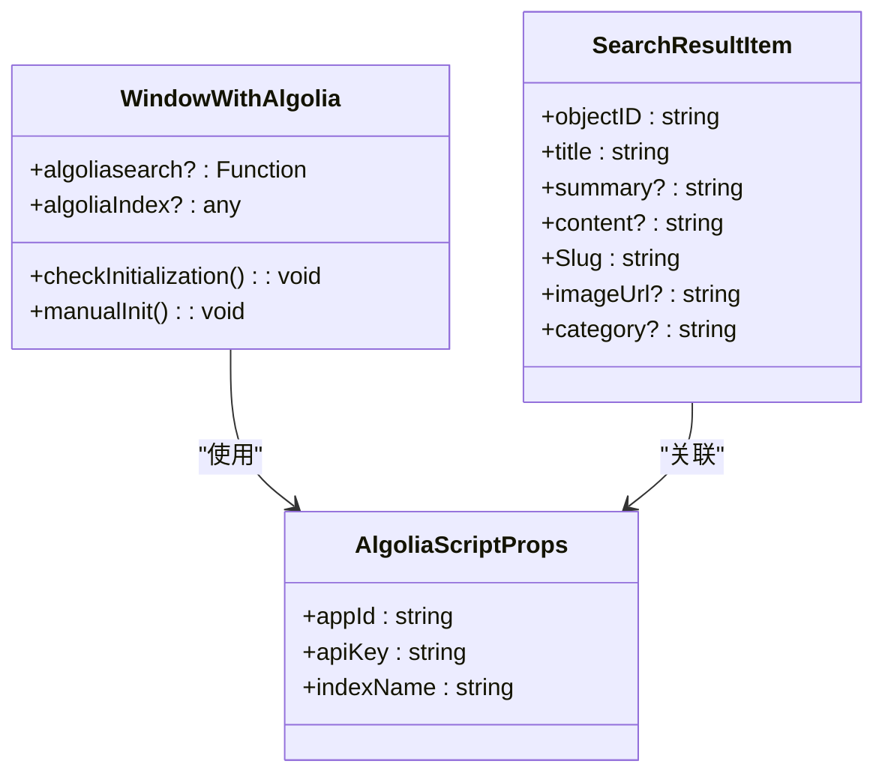
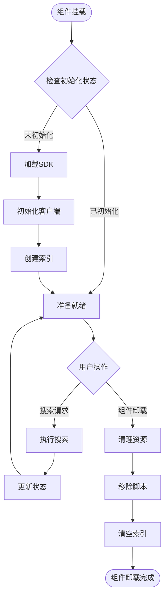
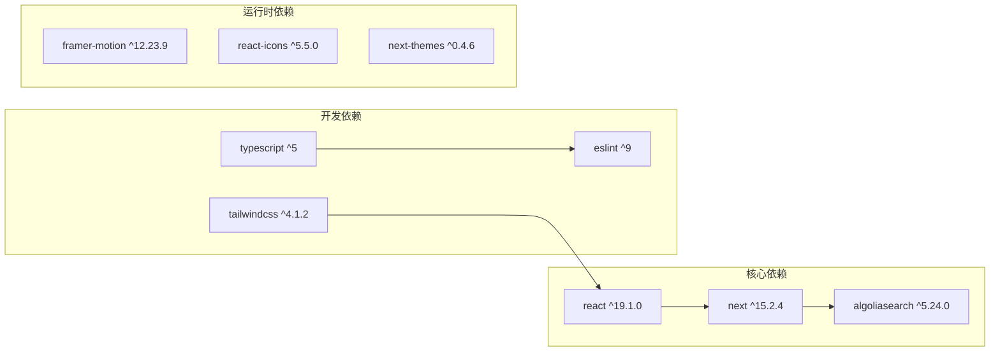
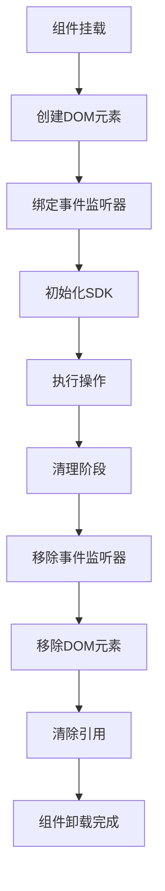
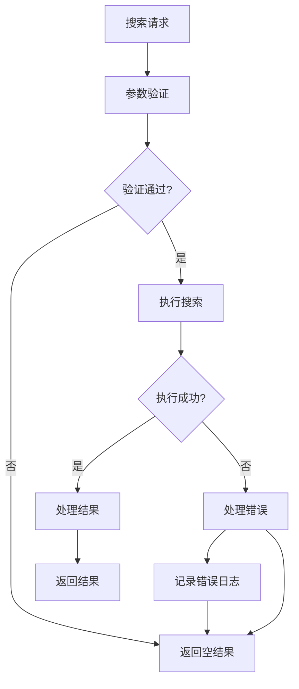

# Algolia搜索引擎集成

<cite>
**本文档引用的文件**
- [AlgoliaProvider.tsx](file://blog-system2/frontend/src/components/Search/AlgoliaProvider.tsx)
- [AlgoliaScript.tsx](file://blog-system2/frontend/src/components/Search/AlgoliaScript.tsx)
- [AlgoliaPreloader.tsx](file://blog-system2/frontend/src/components/Search/AlgoliaPreloader.tsx)
- [algolia.ts](file://blog-system2/frontend/src/lib/algolia.ts)
- [algoliaClient.ts](file://blog-system2/frontend/src/lib/algoliaClient.ts)
- [SearchModal.tsx](file://blog-system2/frontend/src/components/Search/SearchModal.tsx)
- [SearchResults.tsx](file://blog-system2/frontend/src/components/Search/SearchResults.tsx)
- [SearchNavItem.tsx](file://blog-system2/frontend/src/components/Home/SearchNavItem.tsx)
- [package.json](file://blog-system2/frontend/package.json)
- [layout.tsx](file://blog-system2/frontend/src/app/layout.tsx)
</cite>

## 目录
1. [简介](#简介)
2. [项目结构](#项目结构)
3. [核心组件](#核心组件)
4. [架构概览](#架构概览)
5. [详细组件分析](#详细组件分析)
6. [依赖关系分析](#依赖关系分析)
7. [性能考虑](#性能考虑)
8. [故障排除指南](#故障排除指南)
9. [结论](#结论)
10. [附录](#附录)

## 简介

本项目实现了完整的Algolia搜索引擎集成方案，提供了多种初始化策略和错误处理机制。该集成支持动态脚本加载、类型安全的窗口对象处理、双重初始化保障机制，以及完整的生命周期管理。

系统采用React客户端组件架构，通过Provider模式管理Algolia客户端实例，支持服务端渲染和客户端渲染的无缝切换。集成包含了本地搜索功能和Algolia云搜索功能的混合实现。

## 项目结构

项目采用按功能模块组织的结构，Algolia集成相关文件主要位于以下路径：

**图表来源**
- [AlgoliaProvider.tsx:1-100](file://blog-system2/frontend/src/components/Search/AlgoliaProvider.tsx#L1-L100)
- [algolia.ts:1-46](file://blog-system2/frontend/src/lib/algolia.ts#L1-L46)
- [layout.tsx:1-48](file://blog-system2/frontend/src/app/layout.tsx#L1-L48)

**章节来源**
- [AlgoliaProvider.tsx:1-100](file://blog-system2/frontend/src/components/Search/AlgoliaProvider.tsx#L1-L100)
- [AlgoliaScript.tsx:1-102](file://blog-system2/frontend/src/components/Search/AlgoliaScript.tsx#L1-L102)
- [algolia.ts:1-46](file://blog-system2/frontend/src/lib/algolia.ts#L1-L46)

## 核心组件

### AlgoliaProvider 组件

AlgoliaProvider是整个搜索系统的根组件，负责管理Algolia客户端的初始化和生命周期。

**关键特性：**
- 动态脚本加载机制
- 双重初始化保障（Next.js Script + 自定义脚本）
- 类型安全的窗口对象处理
- 错误恢复和重试机制

**初始化流程：**
1. 定义Algolia凭据（应用ID、API密钥、索引名称）
2. 使用Next.js Script组件异步加载Algolia SDK
3. 在onLoad回调中初始化搜索客户端
4. 提供后备初始化方法
5. 实时检查和修复初始化状态

**章节来源**
- [AlgoliaProvider.tsx:22-99](file://blog-system2/frontend/src/components/Search/AlgoliaProvider.tsx#L22-L99)

### AlgoliaScript 组件

自定义脚本加载器，提供额外的初始化保障。

**核心功能：**
- 内联脚本和外部CDN双重加载策略
- 动态创建和清理script元素
- 完整的错误处理和日志记录
- 支持静态文件镜像源

**章节来源**
- [AlgoliaScript.tsx:22-102](file://blog-system2/frontend/src/components/Search/AlgoliaScript.tsx#L22-L102)

### algolia 工具库

提供高级搜索功能封装，支持与Algolia云搜索的集成。

**主要功能：**
- 环境变量配置管理
- 客户端初始化封装
- 搜索结果处理
- 错误边界保护

**章节来源**
- [algolia.ts:1-46](file://blog-system2/frontend/src/lib/algolia.ts#L1-L46)

## 架构概览

系统采用分层架构设计，确保了良好的可维护性和扩展性：

**图表来源**
- [SearchNavItem.tsx:17-215](file://blog-system2/frontend/src/components/Home/SearchNavItem.tsx#L17-L215)
- [AlgoliaProvider.tsx:22-99](file://blog-system2/frontend/src/components/Search/AlgoliaProvider.tsx#L22-L99)
- [algolia.ts:1-46](file://blog-system2/frontend/src/lib/algolia.ts#L1-L46)

## 详细组件分析

### AlgoliaProvider 初始化流程

该组件实现了复杂的初始化策略，确保在各种环境下都能正确加载和初始化Algolia客户端。

**图表来源**
- [AlgoliaProvider.tsx:28-70](file://blog-system2/frontend/src/components/Search/AlgoliaProvider.tsx#L28-L70)
- [AlgoliaProvider.tsx:75-91](file://blog-system2/frontend/src/components/Search/AlgoliaProvider.tsx#L75-L91)

**初始化策略特点：**
- **双重保障机制**：Next.js Script + 自定义脚本加载
- **延迟检查**：初始检查 + 2秒延时检查
- **类型安全**：使用WindowWithAlgolia类型定义
- **错误恢复**：手动初始化作为后备方案

**章节来源**
- [AlgoliaProvider.tsx:22-99](file://blog-system2/frontend/src/components/Search/AlgoliaProvider.tsx#L22-L99)

### 类型安全的窗口对象处理

系统实现了严格的类型安全机制，确保对全局对象的访问安全可靠。

**图表来源**
- [AlgoliaProvider.tsx:11-20](file://blog-system2/frontend/src/components/Search/AlgoliaProvider.tsx#L11-L20)
- [AlgoliaScript.tsx:5-9](file://blog-system2/frontend/src/components/Search/AlgoliaScript.tsx#L5-L9)
- [SearchResults.tsx:7-15](file://blog-system2/frontend/src/components/Search/SearchResults.tsx#L7-L15)

**类型安全特性：**
- **严格类型定义**：WindowWithAlgolia接口
- **运行时检查**：类型守卫验证
- **可选属性**：使用?标记可选成员
- **联合类型**：支持多种初始化状态

**章节来源**
- [AlgoliaProvider.tsx:11-20](file://blog-system2/frontend/src/components/Search/AlgoliaProvider.tsx#L11-L20)
- [AlgoliaScript.tsx:11-20](file://blog-system2/frontend/src/components/Search/AlgoliaScript.tsx#L11-L20)

### 搜索客户端生命周期管理

系统实现了完整的客户端生命周期管理，包括初始化、使用和清理阶段。

**图表来源**
- [AlgoliaPreloader.tsx:20-99](file://blog-system2/frontend/src/components/Search/AlgoliaPreloader.tsx#L20-L99)
- [AlgoliaScript.tsx:89-98](file://blog-system2/frontend/src/components/Search/AlgoliaScript.tsx#L89-L98)

**生命周期管理特性：**
- **自动清理**：组件卸载时自动清理DOM元素
- **内存管理**：避免循环引用和内存泄漏
- **状态同步**：确保组件状态与SDK状态一致
- **错误隔离**：单个组件错误不影响整体系统

**章节来源**
- [AlgoliaPreloader.tsx:1-103](file://blog-system2/frontend/src/components/Search/AlgoliaPreloader.tsx#L1-L103)
- [AlgoliaScript.tsx:89-98](file://blog-system2/frontend/src/components/Search/AlgoliaScript.tsx#L89-L98)

## 依赖关系分析

系统依赖关系清晰，遵循单一职责原则：

**图表来源**
- [package.json:13-42](file://blog-system2/frontend/package.json#L13-L42)

**依赖管理策略：**
- **版本锁定**：使用精确版本号确保一致性
- **最小化依赖**：仅引入必要包
- **类型安全**：所有依赖都包含类型定义
- **性能优化**：选择轻量级替代方案

**章节来源**
- [package.json:13-72](file://blog-system2/frontend/package.json#L13-L72)

## 性能考虑

### 脚本加载优化

系统采用了多层优化策略来提升脚本加载性能：

1. **异步加载**：使用async属性避免阻塞页面渲染
2. **延迟初始化**：2秒延时检查避免过早初始化
3. **CDN镜像**：支持多个CDN源提高可用性
4. **缓存策略**：利用浏览器缓存减少重复加载

### 内存管理最佳实践

**内存管理策略：**
- **及时清理**：组件卸载时立即清理所有资源
- **事件解绑**：移除所有事件监听器防止内存泄漏
- **引用清除**：断开所有对象引用关系
- **垃圾回收**：确保JavaScript引擎能够正常回收内存

### 搜索性能优化

系统实现了多层次的搜索性能优化：

1. **本地搜索优先**：优先使用本地JSON数据进行快速响应
2. **分页处理**：限制每页结果显示数量
3. **防抖处理**：避免频繁搜索请求
4. **结果缓存**：缓存最近搜索结果

**章节来源**
- [SearchModal.tsx:300-428](file://blog-system2/frontend/src/components/Search/SearchModal.tsx#L300-L428)

## 故障排除指南

### 常见初始化问题

| 问题类型 | 症状 | 解决方案 |
|---------|------|----------|
| SDK加载失败 | 控制台显示"Algolia script loaded but algoliasearch not available" | 检查CDN连接和网络状态 |
| 初始化超时 | 组件长时间处于loading状态 | 检查应用ID和API密钥配置 |
| 内存泄漏 | 页面切换后内存持续增长 | 确认组件卸载时的清理逻辑 |
| 类型错误 | TypeScript编译错误 | 验证WindowWithAlgolia类型定义 |

### 调试技巧

1. **启用详细日志**：使用console.log输出初始化状态
2. **检查网络请求**：监控脚本加载和API调用
3. **验证环境变量**：确认NEXT_PUBLIC前缀的正确使用
4. **测试不同环境**：在开发、预览和生产环境分别测试

### 错误处理策略

系统实现了全面的错误处理机制：

**错误处理特性：**
- **静默降级**：搜索失败时返回空结果而非抛出异常
- **详细日志**：记录错误详情便于调试
- **用户友好**：向用户显示友好的错误信息
- **监控告警**：集成错误监控系统

**章节来源**
- [algolia.ts:41-45](file://blog-system2/frontend/src/lib/algolia.ts#L41-L45)
- [AlgoliaScript.tsx:47-52](file://blog-system2/frontend/src/components/Search/AlgoliaScript.tsx#L47-L52)

## 结论

本项目的Algolia搜索引擎集成为现代Web应用提供了完整、可靠的搜索解决方案。通过多重初始化保障、严格的类型安全、完善的生命周期管理和全面的错误处理机制，确保了在各种环境下的稳定运行。

**主要优势：**
- **高可用性**：双重初始化机制确保成功率
- **类型安全**：完整的TypeScript支持
- **性能优化**：多层优化策略提升用户体验
- **易于维护**：清晰的架构和文档

**建议改进方向：**
- 集成更详细的性能监控
- 添加搜索埋点和分析功能
- 实现更智能的缓存策略
- 增强错误恢复能力

## 附录

### 配置参数说明

| 参数名 | 类型 | 必需 | 描述 | 默认值 |
|--------|------|------|------|--------|
| appId | string | 是 | Algolia应用ID | "4KSBT528TD" |
| apiKey | string | 是 | Algolia API密钥 | "4c5827731a6ad8b7bc3063c61916c372" |
| indexName | string | 是 | 搜索索引名称 | "development_blog_posts" |
| strategy | string | 否 | 脚本加载策略 | "afterInteractive" |

### 最佳实践清单

1. **环境配置**
   - 使用NEXT_PUBLIC前缀配置公共环境变量
   - 在不同环境中使用不同的索引名称
   - 定期轮换API密钥

2. **性能优化**
   - 合理设置搜索参数和分页
   - 实现结果缓存机制
   - 优化脚本加载时机

3. **错误处理**
   - 实现全面的错误捕获和处理
   - 提供用户友好的错误反馈
   - 集成错误监控系统

4. **安全性**
   - 避免在客户端暴露敏感信息
   - 实施适当的请求频率限制
   - 使用HTTPS协议传输数据