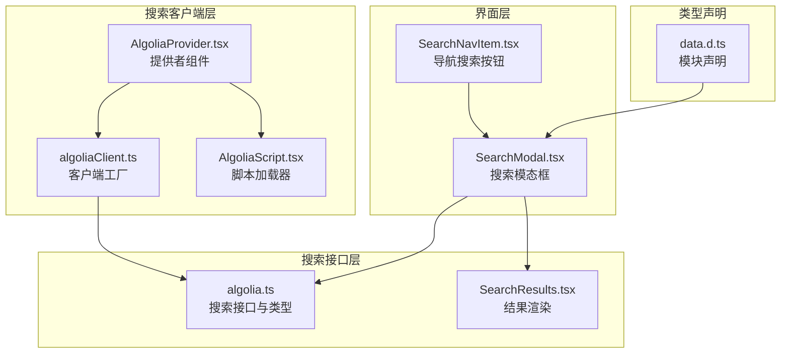
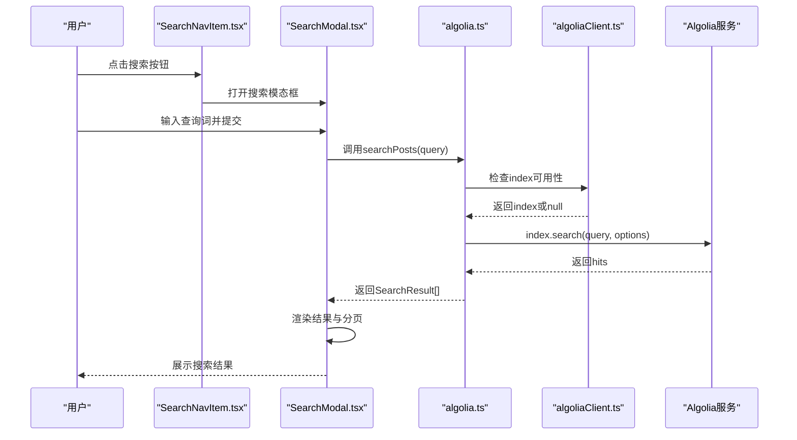
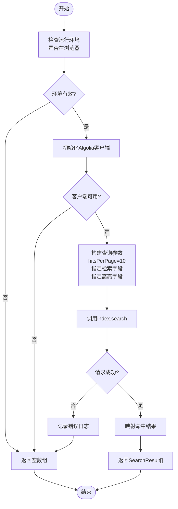
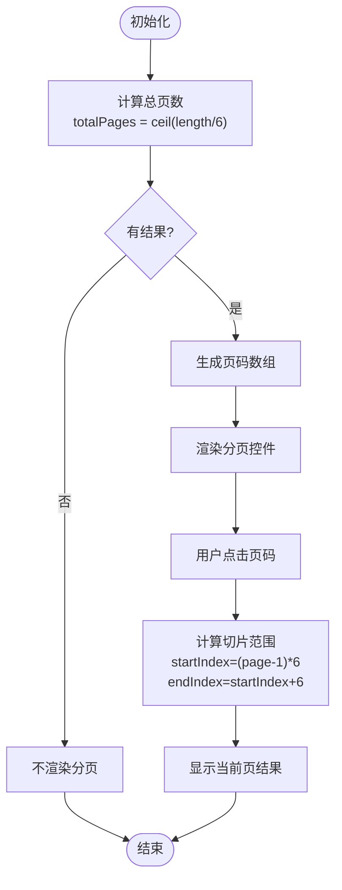
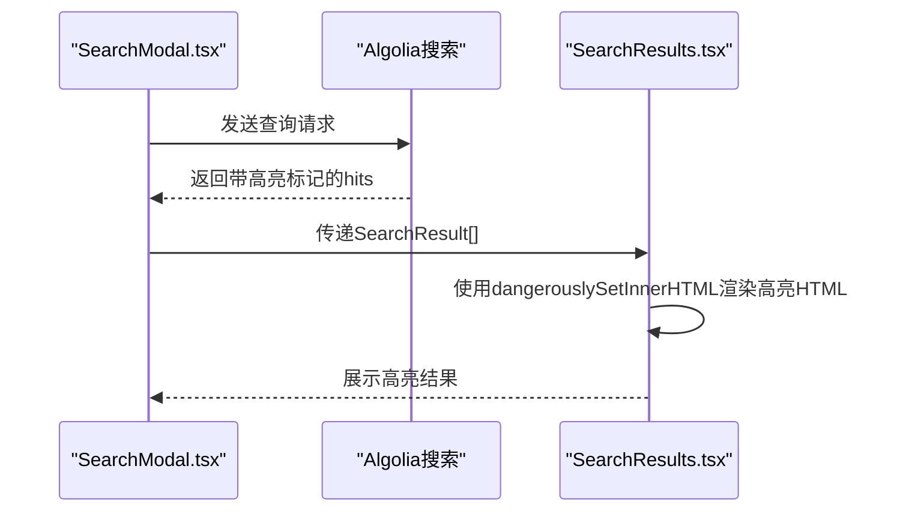
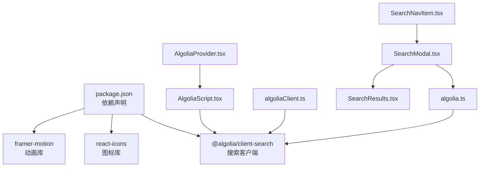

# 搜索API接口设计

<cite>
**本文档引用的文件**
- [algolia.ts](file://blog-system2/frontend/src/lib/algolia.ts)
- [algoliaClient.ts](file://blog-system2/frontend/src/lib/algoliaClient.ts)
- [AlgoliaProvider.tsx](file://blog-system2/frontend/src/components/Search/AlgoliaProvider.tsx)
- [AlgoliaScript.tsx](file://blog-system2/frontend/src/components/Search/AlgoliaScript.tsx)
- [SearchResults.tsx](file://blog-system2/frontend/src/components/Search/SearchResults.tsx)
- [SearchModal.tsx](file://blog-system2/frontend/src/components/Search/SearchModal.tsx)
- [SearchNavItem.tsx](file://blog-system2/frontend/src/components/Home/SearchNavItem.tsx)
- [package.json](file://blog-system2/frontend/package.json)
- [data.d.ts](file://blog-system2/frontend/src/types/data.d.ts)
</cite>

## 目录
1. [引言](#引言)
2. [项目结构](#项目结构)
3. [核心组件](#核心组件)
4. [架构概览](#架构概览)
5. [详细组件分析](#详细组件分析)
6. [依赖关系分析](#依赖关系分析)
7. [性能考虑](#性能考虑)
8. [故障排除指南](#故障排除指南)
9. [结论](#结论)
10. [附录](#附录)

## 引言

本文件为搜索API接口设计的全面技术文档，重点围绕Algolia搜索服务在前端应用中的集成与使用。文档详细说明了搜索接口规范、查询参数类型定义与验证规则、请求构建过程（查询字符串处理、过滤条件设置、结果排序配置）、响应数据结构设计（命中结果字段映射与元数据处理）、分页机制与缓存策略、高亮功能实现原理与配置方法，并提供调用示例与错误处理机制，最后给出性能优化建议与最佳实践。

## 项目结构

该搜索系统主要由以下模块组成：
- 搜索客户端封装：负责Algolia客户端初始化与索引访问
- 搜索接口实现：提供统一的搜索函数与结果类型定义
- 搜索界面组件：包括搜索模态框、结果展示、高亮显示等
- 提供者组件：确保Algolia脚本正确加载与初始化
- 数据类型声明：JSON与Markdown文件的模块声明



**图表来源**
- [algoliaClient.ts:15-32](file://blog-system2/frontend/src/lib/algoliaClient.ts#L15-L32)
- [AlgoliaProvider.tsx:22-98](file://blog-system2/frontend/src/components/Search/AlgoliaProvider.tsx#L22-L98)
- [AlgoliaScript.tsx:22-101](file://blog-system2/frontend/src/components/Search/AlgoliaScript.tsx#L22-L101)
- [algolia.ts:28-45](file://blog-system2/frontend/src/lib/algolia.ts#L28-L45)
- [SearchResults.tsx:24-95](file://blog-system2/frontend/src/components/Search/SearchResults.tsx#L24-L95)
- [SearchModal.tsx:22-935](file://blog-system2/frontend/src/components/Search/SearchModal.tsx#L22-L935)
- [SearchNavItem.tsx:17-215](file://blog-system2/frontend/src/components/Home/SearchNavItem.tsx#L17-L215)
- [data.d.ts:1-10](file://blog-system2/frontend/src/types/data.d.ts#L1-L10)

**章节来源**
- [algolia.ts:1-46](file://blog-system2/frontend/src/lib/algolia.ts#L1-L46)
- [algoliaClient.ts:1-33](file://blog-system2/frontend/src/lib/algoliaClient.ts#L1-L33)
- [AlgoliaProvider.tsx:1-100](file://blog-system2/frontend/src/components/Search/AlgoliaProvider.tsx#L1-L100)
- [AlgoliaScript.tsx:1-102](file://blog-system2/frontend/src/components/Search/AlgoliaScript.tsx#L1-L102)
- [SearchResults.tsx:1-96](file://blog-system2/frontend/src/components/Search/SearchResults.tsx#L1-L96)
- [SearchModal.tsx:1-935](file://blog-system2/frontend/src/components/Search/SearchModal.tsx#L1-L935)
- [SearchNavItem.tsx:1-215](file://blog-system2/frontend/src/components/Home/SearchNavItem.tsx#L1-L215)
- [data.d.ts:1-10](file://blog-system2/frontend/src/types/data.d.ts#L1-L10)

## 核心组件

### 搜索接口规范

搜索接口位于`algolia.ts`中，提供以下能力：
- 查询参数类型：`query: string`（必填）
- 返回值类型：`Promise<SearchResult[]>`
- 默认行为：当索引不可用或查询为空时返回空数组
- 错误处理：捕获异常并记录日志，返回空数组

查询参数验证规则：
- 空值检查：index存在性、query非空且去除空白字符后不为空
- 类型约束：query必须为字符串类型

搜索请求构建：
- 调用`index.search<SearchResult>(query, options)`
- 关键选项：
  - `hitsPerPage: 10`：每页返回10条结果
  - `attributesToRetrieve`: 指定返回字段列表
  - `attributesToHighlight`: 指定高亮字段列表

搜索响应数据结构：
- 字段映射：`objectID`、`title`、`content`、`summary`、`slug`、`imageUrl`
- 元数据处理：Algolia默认提供匹配度评分、高亮标记等（具体字段由Algolia返回）

**章节来源**
- [algolia.ts:18-26](file://blog-system2/frontend/src/lib/algolia.ts#L18-L26)
- [algolia.ts:28-45](file://blog-system2/frontend/src/lib/algolia.ts#L28-L45)

### 客户端初始化与封装

`algoliaClient.ts`提供客户端工厂函数：
- 接口定义：简化AlgoliaSearchIndex接口，包含search与getObject方法
- 工厂函数：`createAlgoliaClient(appId, apiKey, indexName)`返回包装对象
- 运行环境：仅在浏览器端可用，避免SSR问题
- 回退策略：当Algolia未加载或在服务器端运行时返回null并输出错误日志

**章节来源**
- [algoliaClient.ts:1-13](file://blog-system2/frontend/src/lib/algoliaClient.ts#L1-L13)
- [algoliaClient.ts:15-32](file://blog-system2/frontend/src/lib/algoliaClient.ts#L15-L32)

### 搜索界面组件

`SearchModal.tsx`是搜索的主要交互组件：
- 输入处理：支持回车触发搜索、点击按钮触发搜索
- 结果展示：使用`SearchResults.tsx`渲染命中项
- 分页机制：每页最多6条结果，动态计算总页数并支持页码切换
- 高亮功能：通过dangerouslySetInnerHTML将Algolia返回的高亮HTML插入DOM
- 错误处理：捕获异常并提示用户

**章节来源**
- [SearchModal.tsx:22-935](file://blog-system2/frontend/src/components/Search/SearchModal.tsx#L22-L935)
- [SearchResults.tsx:7-15](file://blog-system2/frontend/src/components/Search/SearchResults.tsx#L7-L15)

## 架构概览

搜索系统采用“客户端直连Algolia”的架构模式，通过提供者组件确保脚本正确加载，搜索接口负责业务逻辑，界面组件负责用户体验。



**图表来源**
- [SearchNavItem.tsx:17-215](file://blog-system2/frontend/src/components/Home/SearchNavItem.tsx#L17-L215)
- [SearchModal.tsx:22-935](file://blog-system2/frontend/src/components/Search/SearchModal.tsx#L22-L935)
- [algolia.ts:28-45](file://blog-system2/frontend/src/lib/algolia.ts#L28-L45)
- [algoliaClient.ts:15-32](file://blog-system2/frontend/src/lib/algoliaClient.ts#L15-L32)

## 详细组件分析

### 搜索接口类图

```mermaid
classDiagram
class AlgoliaClientWrapper {
+searchClient : any
+index : AlgoliaSearchIndex
}
class AlgoliaSearchIndex {
+search<T>(query, options) Promise<{hits : T[]}>
+getObject<T>(objectID) Promise<T>
}
class SearchResult {
+string objectID
+string title
+string content
+string summary
+string slug
+string imageUrl
}
class SearchResultsProps {
+SearchResultItem[] results
+boolean isLoading
+string searchQuery
+Function onResultClick
}
class SearchResultItem {
+string objectID
+string title
+string summary
+string content
+string Slug
+string imageUrl
+category : "post"|"notice"|"resource"|"about"
}
AlgoliaClientWrapper --> AlgoliaSearchIndex : "提供"
SearchResultItem --> SearchResult : "字段映射"
SearchResultsProps --> SearchResultItem : "渲染"
```

**图表来源**
- [algoliaClient.ts:10-13](file://blog-system2/frontend/src/lib/algoliaClient.ts#L10-L13)
- [algoliaClient.ts:2-8](file://blog-system2/frontend/src/lib/algoliaClient.ts#L2-L8)
- [algolia.ts:18-26](file://blog-system2/frontend/src/lib/algolia.ts#L18-L26)
- [SearchResults.tsx:7-15](file://blog-system2/frontend/src/components/Search/SearchResults.tsx#L7-L15)

### 搜索请求流程图



**图表来源**
- [algolia.ts:28-45](file://blog-system2/frontend/src/lib/algolia.ts#L28-L45)
- [algoliaClient.ts:15-32](file://blog-system2/frontend/src/lib/algoliaClient.ts#L15-L32)

### 搜索结果分页机制

分页在`SearchModal.tsx`中实现：
- 每页固定数量：`resultsPerPage = 6`
- 总页数计算：`Math.ceil(results.length / resultsPerPage)`
- 当前页结果：通过切片获取当前页数据
- 页码切换：根据目标页码重新计算起始与结束索引



**图表来源**
- [SearchModal.tsx:97-113](file://blog-system2/frontend/src/components/Search/SearchModal.tsx#L97-L113)
- [SearchModal.tsx:443-472](file://blog-system2/frontend/src/components/Search/SearchModal.tsx#L443-L472)

### 搜索高亮功能

高亮功能在多个层面实现：
- Algolia侧高亮：通过`attributesToHighlight`配置对标题与摘要进行高亮标记
- 前端渲染：使用`dangerouslySetInnerHTML`将Algolia返回的高亮HTML插入DOM
- 自定义高亮：在本地搜索中使用正则表达式对匹配文本添加`<mark>`标签



**图表来源**
- [algolia.ts:34-38](file://blog-system2/frontend/src/lib/algolia.ts#L34-L38)
- [SearchResults.tsx:75-83](file://blog-system2/frontend/src/components/Search/SearchResults.tsx#L75-L83)
- [SearchModal.tsx:315-319](file://blog-system2/frontend/src/components/Search/SearchModal.tsx#L315-L319)

### 缓存策略

当前实现未显式配置Algolia客户端缓存策略。建议：
- 启用Algolia内置缓存：利用`searchClient.cache`或`searchClient.queryParameters`进行缓存
- 前端缓存：对近期热门查询结果进行内存缓存
- CDN缓存：静态资源与索引数据通过CDN加速

**章节来源**
- [algolia.ts:33-44](file://blog-system2/frontend/src/lib/algolia.ts#L33-L44)

## 依赖关系分析

搜索系统的关键依赖如下：



**图表来源**
- [package.json:13-42](file://blog-system2/frontend/package.json#L13-L42)
- [algolia.ts:1-6](file://blog-system2/frontend/src/lib/algolia.ts#L1-L6)
- [algoliaClient.ts:1-8](file://blog-system2/frontend/src/lib/algoliaClient.ts#L1-L8)
- [AlgoliaProvider.tsx:4-5](file://blog-system2/frontend/src/components/Search/AlgoliaProvider.tsx#L4-L5)
- [AlgoliaScript.tsx:11-20](file://blog-system2/frontend/src/components/Search/AlgoliaScript.tsx#L11-L20)
- [SearchModal.tsx:3-8](file://blog-system2/frontend/src/components/Search/SearchModal.tsx#L3-L8)
- [SearchResults.tsx:1-6](file://blog-system2/frontend/src/components/Search/SearchResults.tsx#L1-L6)
- [SearchNavItem.tsx:1-7](file://blog-system2/frontend/src/components/Home/SearchNavItem.tsx#L1-L7)

**章节来源**
- [package.json:13-42](file://blog-system2/frontend/package.json#L13-L42)

## 性能考虑

- 客户端直连：减少中间层延迟，提升响应速度
- 按需检索：通过`attributesToRetrieve`限制返回字段，降低网络传输量
- 高亮控制：仅对必要字段启用高亮，避免过度渲染
- 分页加载：每页6条结果，减少单次渲染压力
- 动画优化：合理使用CSS动画与轻量级库，避免阻塞主线程
- 资源预加载：提前加载Algolia脚本，减少首次搜索等待时间

## 故障排除指南

常见问题与解决方案：
- Algolia脚本未加载：检查`AlgoliaProvider.tsx`与`AlgoliaScript.tsx`的加载逻辑，确认CDN可访问性
- SSR环境报错：确保客户端代码仅在浏览器端执行，避免在服务端调用window对象
- 查询无结果：检查索引名称与API密钥配置，确认索引中存在数据
- 高亮失效：确认`attributesToHighlight`配置正确，且结果字段包含高亮标记
- 分页异常：检查`resultsPerPage`与`totalPages`计算逻辑，确保页码边界处理正确

**章节来源**
- [AlgoliaProvider.tsx:28-70](file://blog-system2/frontend/src/components/Search/AlgoliaProvider.tsx#L28-L70)
- [AlgoliaScript.tsx:27-98](file://blog-system2/frontend/src/components/Search/AlgoliaScript.tsx#L27-L98)
- [algolia.ts:29-44](file://blog-system2/frontend/src/lib/algolia.ts#L29-L44)
- [SearchModal.tsx:97-113](file://blog-system2/frontend/src/components/Search/SearchModal.tsx#L97-L113)

## 结论

该搜索系统通过简洁的客户端封装与直观的界面组件，实现了高效的全文检索体验。通过合理的查询参数配置、高亮渲染与分页机制，既保证了用户体验，又兼顾了性能表现。建议在生产环境中进一步完善缓存策略与监控体系，持续优化搜索质量与响应速度。

## 附录

### API调用示例

- 基本搜索调用：`await searchPosts("关键词")`
- 返回结果类型：`SearchResult[]`
- 错误处理：捕获异常并记录日志，返回空数组

### 最佳实践

- 合理设置`hitsPerPage`，平衡加载速度与信息密度
- 仅对必要字段启用高亮，避免过度渲染
- 在SSR环境中谨慎使用浏览器API，确保兼容性
- 对频繁查询进行缓存，提升用户体验
- 监控搜索性能指标，持续优化查询策略