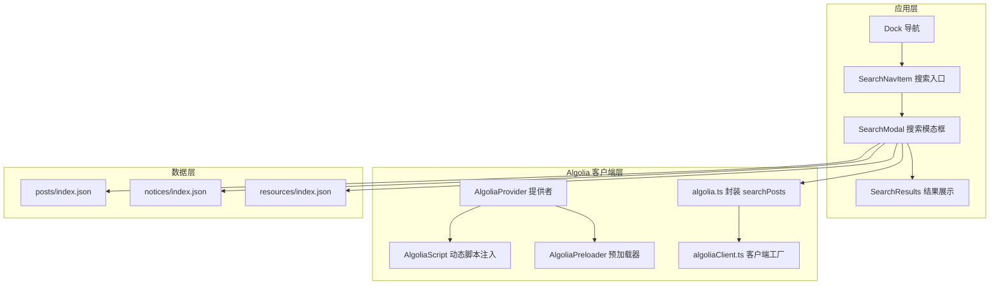
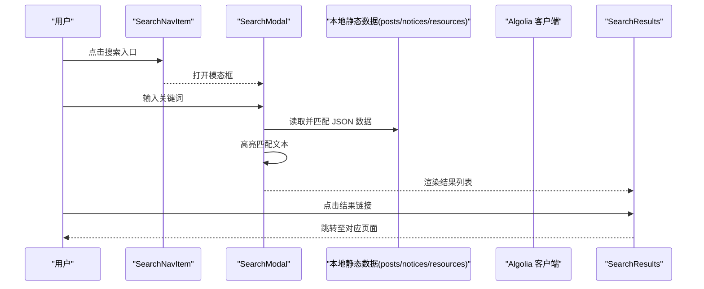
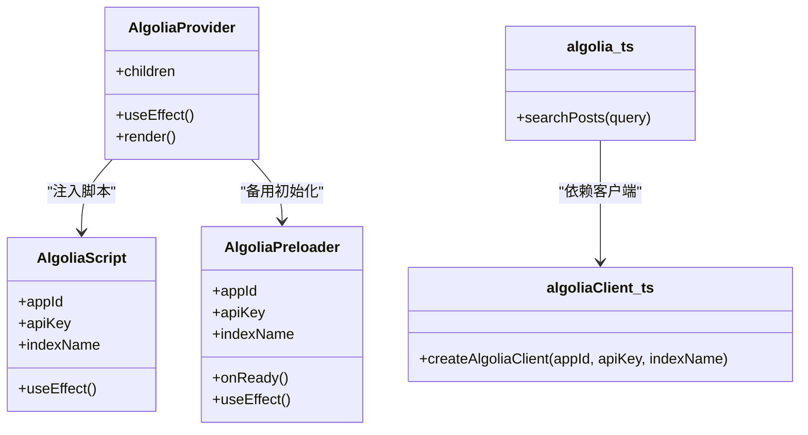
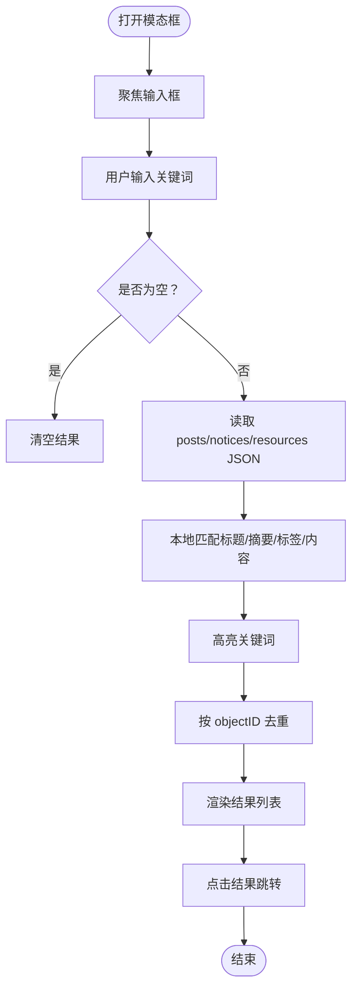
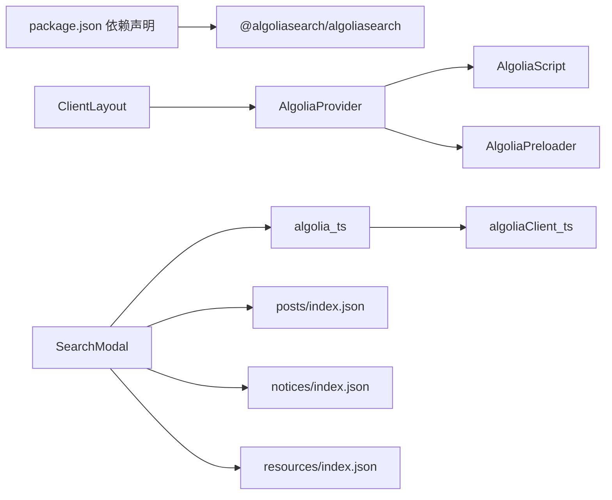

# 搜索功能实现

<cite>
**本文引用的文件**
- [algolia.ts](file://blog-system2/frontend/src/lib/algolia.ts)
- [algoliaClient.ts](file://blog-system2/frontend/src/lib/algoliaClient.ts)
- [AlgoliaProvider.tsx](file://blog-system2/frontend/src/components/Search/AlgoliaProvider.tsx)
- [AlgoliaScript.tsx](file://blog-system2/frontend/src/components/Search/AlgoliaScript.tsx)
- [AlgoliaPreloader.tsx](file://blog-system2/frontend/src/components/Search/AlgoliaPreloader.tsx)
- [SearchModal.tsx](file://blog-system2/frontend/src/components/Search/SearchModal.tsx)
- [SearchResults.tsx](file://blog-system2/frontend/src/components/Search/SearchResults.tsx)
- [SearchNavItem.tsx](file://blog-system2/frontend/src/components/Home/SearchNavItem.tsx)
- [ClientLayout.tsx](file://blog-system2/frontend/src/components/ClientLayout.tsx)
- [layout.tsx](file://blog-system2/frontend/src/app/layout.tsx)
- [index.json（文章）](file://blog-system2/frontend/public/data/posts/index.json)
- [index.json（通知）](file://blog-system2/frontend/public/data/notices/index.json)
- [index.json（资源）](file://blog-system2/frontend/public/data/resources/index.json)
- [package.json](file://blog-system2/frontend/package.json)
</cite>

## 目录
1. [简介](#简介)
2. [项目结构](#项目结构)
3. [核心组件](#核心组件)
4. [架构总览](#架构总览)
5. [详细组件分析](#详细组件分析)
6. [依赖关系分析](#依赖关系分析)
7. [性能考虑](#性能考虑)
8. [故障排查指南](#故障排查指南)
9. [结论](#结论)
10. [附录](#附录)

## 简介
本文件面向技术博客平台的搜索功能，系统性梳理了基于 Algolia 的搜索引擎集成方案与配置策略，覆盖以下主题：
- 搜索索引的创建、更新与维护流程
- 搜索查询处理机制（全文检索、过滤条件、结果排序）
- 搜索模态框组件设计（输入处理、实时预览、结果展示）
- 性能优化策略（缓存、防抖、懒加载）
- 搜索 API 使用示例与最佳实践
- 搜索结果高亮与 URL 参数同步机制
- 测试方法与调试技巧

## 项目结构
搜索功能由“前端组件 + Algolia 客户端 + 本地静态数据”三层构成：
- 组件层：搜索入口、模态框、结果列表、导航按钮
- 客户端层：Algolia Provider/Script/Preloader，封装 Algolia 客户端初始化与可用性检查
- 数据层：文章、通知、资源的静态 JSON 索引，供本地搜索使用

图表来源
- [ClientLayout.tsx:32-59](file://blog-system2/frontend/src/components/ClientLayout.tsx#L32-L59)
- [AlgoliaProvider.tsx:22-99](file://blog-system2/frontend/src/components/Search/AlgoliaProvider.tsx#L22-L99)
- [AlgoliaScript.tsx:22-98](file://blog-system2/frontend/src/components/Search/AlgoliaScript.tsx#L22-L98)
- [AlgoliaPreloader.tsx:12-99](file://blog-system2/frontend/src/components/Search/AlgoliaPreloader.tsx#L12-L99)
- [algolia.ts:28-45](file://blog-system2/frontend/src/lib/algolia.ts#L28-L45)
- [algoliaClient.ts:15-32](file://blog-system2/frontend/src/lib/algoliaClient.ts#L15-L32)
- [SearchModal.tsx:300-428](file://blog-system2/frontend/src/components/Search/SearchModal.tsx#L300-L428)
- [index.json（文章）:1-103](file://blog-system2/frontend/public/data/posts/index.json#L1-L103)
- [index.json（通知）:1-41](file://blog-system2/frontend/public/data/notices/index.json#L1-L41)
- [index.json（资源）:1-224](file://blog-system2/frontend/public/data/resources/index.json#L1-L224)

章节来源
- [ClientLayout.tsx:28-62](file://blog-system2/frontend/src/components/ClientLayout.tsx#L28-L62)
- [layout.tsx:28-47](file://blog-system2/frontend/src/app/layout.tsx#L28-L47)

## 核心组件
- AlgoliaProvider：在浏览器端注入 Algolia 客户端脚本，并进行初始化与可用性检查，确保全局可用
- AlgoliaScript：兜底脚本注入与初始化逻辑
- AlgoliaPreloader：预加载 Algolia 客户端并回调就绪状态
- algolia.ts：封装 searchPosts 查询，支持高亮字段与属性检索
- algoliaClient.ts：创建 Algolia 客户端与索引实例
- SearchModal：搜索模态框，负责输入、高亮、分页与结果渲染
- SearchResults：结果列表组件，支持加载态与空结果提示
- SearchNavItem：导航栏搜索入口，带动画与提示
- 静态数据：posts/notices/resources 的 index.json 作为本地搜索的数据源

章节来源
- [AlgoliaProvider.tsx:22-99](file://blog-system2/frontend/src/components/Search/AlgoliaProvider.tsx#L22-L99)
- [AlgoliaScript.tsx:22-98](file://blog-system2/frontend/src/components/Search/AlgoliaScript.tsx#L22-L98)
- [AlgoliaPreloader.tsx:12-99](file://blog-system2/frontend/src/components/Search/AlgoliaPreloader.tsx#L12-L99)
- [algolia.ts:28-45](file://blog-system2/frontend/src/lib/algolia.ts#L28-L45)
- [algoliaClient.ts:15-32](file://blog-system2/frontend/src/lib/algoliaClient.ts#L15-L32)
- [SearchModal.tsx:22-132](file://blog-system2/frontend/src/components/Search/SearchModal.tsx#L22-L132)
- [SearchResults.tsx:24-95](file://blog-system2/frontend/src/components/Search/SearchResults.tsx#L24-L95)
- [SearchNavItem.tsx:17-214](file://blog-system2/frontend/src/components/Home/SearchNavItem.tsx#L17-L214)
- [index.json（文章）:1-103](file://blog-system2/frontend/public/data/posts/index.json#L1-L103)
- [index.json（通知）:1-41](file://blog-system2/frontend/public/data/notices/index.json#L1-L41)
- [index.json（资源）:1-224](file://blog-system2/frontend/public/data/resources/index.json#L1-L224)

## 架构总览
搜索系统采用“本地静态数据 + Algolia 客户端”的混合策略：
- 对于需要 Algolia 全局能力的场景，使用 AlgoliaProvider/Script/Preloader 确保客户端可用
- 对于无需 Algolia 的通用搜索（文章、通知、资源），直接读取静态 JSON 并进行本地匹配与高亮
- 模态框负责统一的输入、高亮、分页与跳转

图表来源
- [SearchNavItem.tsx:126-214](file://blog-system2/frontend/src/components/Home/SearchNavItem.tsx#L126-L214)
- [SearchModal.tsx:300-428](file://blog-system2/frontend/src/components/Search/SearchModal.tsx#L300-L428)
- [SearchResults.tsx:24-95](file://blog-system2/frontend/src/components/Search/SearchResults.tsx#L24-L95)
- [index.json（文章）:1-103](file://blog-system2/frontend/public/data/posts/index.json#L1-L103)
- [index.json（通知）:1-41](file://blog-system2/frontend/public/data/notices/index.json#L1-L41)
- [index.json（资源）:1-224](file://blog-system2/frontend/public/data/resources/index.json#L1-L224)

## 详细组件分析

### Algolia 客户端与提供者
- AlgoliaProvider：通过 Next.js Script 在浏览器端动态加载 Algolia 客户端脚本，并在 onLoad 后初始化索引；同时提供兜底初始化逻辑与调试日志
- AlgoliaScript：在 DOM 中插入内联脚本或外链脚本，确保 algoliasearch 可用后立即 initIndex
- AlgoliaPreloader：预加载阶段检查可用性，失败时重试加载并回调 onReady
- algolia.ts：封装 searchPosts，设置 hitsPerPage、attributesToRetrieve、attributesToHighlight 等查询参数
- algoliaClient.ts：在浏览器端创建 searchClient 与 index 实例，返回包装对象

图表来源
- [AlgoliaProvider.tsx:22-99](file://blog-system2/frontend/src/components/Search/AlgoliaProvider.tsx#L22-L99)
- [AlgoliaScript.tsx:22-98](file://blog-system2/frontend/src/components/Search/AlgoliaScript.tsx#L22-L98)
- [AlgoliaPreloader.tsx:12-99](file://blog-system2/frontend/src/components/Search/AlgoliaPreloader.tsx#L12-L99)
- [algolia.ts:28-45](file://blog-system2/frontend/src/lib/algolia.ts#L28-L45)
- [algoliaClient.ts:15-32](file://blog-system2/frontend/src/lib/algoliaClient.ts#L15-L32)

章节来源
- [AlgoliaProvider.tsx:22-99](file://blog-system2/frontend/src/components/Search/AlgoliaProvider.tsx#L22-L99)
- [AlgoliaScript.tsx:22-98](file://blog-system2/frontend/src/components/Search/AlgoliaScript.tsx#L22-L98)
- [AlgoliaPreloader.tsx:12-99](file://blog-system2/frontend/src/components/Search/AlgoliaPreloader.tsx#L12-L99)
- [algolia.ts:28-45](file://blog-system2/frontend/src/lib/algolia.ts#L28-L45)
- [algoliaClient.ts:15-32](file://blog-system2/frontend/src/lib/algoliaClient.ts#L15-L32)

### 搜索模态框与结果展示
- SearchModal：负责输入焦点、点击外部关闭、Esc 关闭、占位符轮播、Canvas 动画（移动端跳过）、分页（每页最多 6 条）、高亮匹配文本、去重与错误兜底
- SearchResults：根据 isLoading、空结果渲染不同 UI；使用 Link 跳转至对应路径；支持 dangerouslySetInnerHTML 展示高亮 HTML

图表来源
- [SearchModal.tsx:115-132](file://blog-system2/frontend/src/components/Search/SearchModal.tsx#L115-L132)
- [SearchModal.tsx:300-428](file://blog-system2/frontend/src/components/Search/SearchModal.tsx#L300-L428)
- [SearchResults.tsx:24-95](file://blog-system2/frontend/src/components/Search/SearchResults.tsx#L24-L95)

章节来源
- [SearchModal.tsx:22-132](file://blog-system2/frontend/src/components/Search/SearchModal.tsx#L22-L132)
- [SearchModal.tsx:300-428](file://blog-system2/frontend/src/components/Search/SearchModal.tsx#L300-L428)
- [SearchResults.tsx:24-95](file://blog-system2/frontend/src/components/Search/SearchResults.tsx#L24-L95)

### 导航入口与高亮显示
- SearchNavItem：提供搜索入口按钮，支持悬停动画、触摸反馈、电路风格背景与 LED 动画；tooltip 通过 Portal 定位
- 高亮策略：SearchModal 内部对匹配到的标题/摘要使用 mark 标签进行高亮，SearchResults 通过 dangerouslySetInnerHTML 渲染高亮 HTML

章节来源
- [SearchNavItem.tsx:17-214](file://blog-system2/frontend/src/components/Home/SearchNavItem.tsx#L17-L214)
- [SearchModal.tsx:315-319](file://blog-system2/frontend/src/components/Search/SearchModal.tsx#L315-L319)
- [SearchResults.tsx:75-88](file://blog-system2/frontend/src/components/Search/SearchResults.tsx#L75-L88)

## 依赖关系分析
- 依赖管理：Algolia 客户端库通过 npm/yarn 安装，版本号在 package.json 中声明
- 运行时注入：通过 Next.js Script 与自定义脚本注入，确保在浏览器端可用
- 组件耦合：SearchModal 与静态数据强耦合；AlgoliaProvider 与 SearchModal 解耦，便于按需使用

图表来源
- [package.json:13-42](file://blog-system2/frontend/package.json#L13-L42)
- [ClientLayout.tsx:32-59](file://blog-system2/frontend/src/components/ClientLayout.tsx#L32-L59)
- [AlgoliaProvider.tsx:22-99](file://blog-system2/frontend/src/components/Search/AlgoliaProvider.tsx#L22-L99)
- [algolia.ts:28-45](file://blog-system2/frontend/src/lib/algolia.ts#L28-L45)
- [algoliaClient.ts:15-32](file://blog-system2/frontend/src/lib/algoliaClient.ts#L15-L32)
- [SearchModal.tsx:322-383](file://blog-system2/frontend/src/components/Search/SearchModal.tsx#L322-L383)

章节来源
- [package.json:13-42](file://blog-system2/frontend/package.json#L13-L42)
- [ClientLayout.tsx:28-62](file://blog-system2/frontend/src/components/ClientLayout.tsx#L28-L62)

## 性能考虑
- 缓存机制
  - 本地搜索：直接读取静态 JSON，避免网络请求；可在客户端侧引入内存缓存以减少重复读取
  - Algolia：利用客户端缓存与浏览器缓存，避免重复初始化
- 防抖处理
  - SearchModal 已具备输入状态控制与动画节流；可进一步在输入事件上增加防抖，降低频繁匹配成本
- 懒加载
  - 模态框打开时再触发搜索；结果分页（每页 6 条）减少一次性渲染压力
- 网络与脚本加载
  - 使用 Next.js Script 的 afterInteractive 策略，确保 DOM 就绪后再加载脚本
  - 提供 AlgoliaScript 与 AlgoliaPreloader 作为兜底，提升初始化成功率

章节来源
- [SearchModal.tsx:276-298](file://blog-system2/frontend/src/components/Search/SearchModal.tsx#L276-L298)
- [AlgoliaProvider.tsx:74-91](file://blog-system2/frontend/src/components/Search/AlgoliaProvider.tsx#L74-L91)
- [AlgoliaScript.tsx:55-87](file://blog-system2/frontend/src/components/Search/AlgoliaScript.tsx#L55-L87)
- [AlgoliaPreloader.tsx:26-87](file://blog-system2/frontend/src/components/Search/AlgoliaPreloader.tsx#L26-L87)

## 故障排查指南
- Algolia 客户端未加载
  - 检查 AlgoliaProvider 是否包裹应用根节点；确认 Next.js Script 加载成功
  - 查看浏览器控制台是否存在脚本加载错误或 algoliasearch 未定义
- 初始化失败
  - 使用 AlgoliaProvider 的兜底初始化逻辑；若仍失败，检查 appId/apiKey/indexName 是否正确
- 搜索结果为空
  - 确认静态 JSON 文件格式正确且可访问；检查关键词大小写与匹配逻辑
- 移动端体验问题
  - SearchModal 对移动端跳过 Canvas 动画；如仍有异常，检查触摸事件与样式适配

章节来源
- [AlgoliaProvider.tsx:28-70](file://blog-system2/frontend/src/components/Search/AlgoliaProvider.tsx#L28-L70)
- [AlgoliaScript.tsx:35-53](file://blog-system2/frontend/src/components/Search/AlgoliaScript.tsx#L35-L53)
- [AlgoliaPreloader.tsx:26-87](file://blog-system2/frontend/src/components/Search/AlgoliaPreloader.tsx#L26-L87)
- [SearchModal.tsx:39-40](file://blog-system2/frontend/src/components/Search/SearchModal.tsx#L39-L40)

## 结论
该搜索系统通过“本地静态数据 + Algolia 客户端”的组合，实现了高性能、可扩展的站内搜索体验。组件化设计使入口、模态框与结果展示职责清晰；Provider/Script/Preloader 确保 Algolia 客户端稳定可用；本地搜索策略降低了外部依赖风险。建议后续引入防抖、缓存与分页优化，持续提升用户体验。

## 附录

### 搜索索引创建、更新与维护流程
- 文章索引：由 posts/index.json 提供，包含 slug、title、summary、publishDate、coverImage 等字段
- 通知索引：由 notices/index.json 提供，包含 slug、title、publishDate、pinned 等字段
- 资源索引：由 resources/index.json 提供，包含 categories 与 items，items 含 id、title、description、tags、url 等字段
- 更新策略：修改对应 JSON 文件后，静态搜索即时生效；如需 Algolia 全局检索，需在 Algolia 控制台更新索引并同步 appId/apiKey/indexName

章节来源
- [index.json（文章）:1-103](file://blog-system2/frontend/public/data/posts/index.json#L1-L103)
- [index.json（通知）:1-41](file://blog-system2/frontend/public/data/notices/index.json#L1-L41)
- [index.json（资源）:1-224](file://blog-system2/frontend/public/data/resources/index.json#L1-L224)

### 搜索查询处理机制
- 全文检索：本地搜索对 title/summary/tags/description 进行包含匹配
- 过滤条件：按 category（post、notice、resource、about）区分结果类型
- 结果排序：当前按匹配顺序展示；可扩展为按相关度、时间等排序
- 高亮显示：对匹配关键词使用 mark 标签高亮，SearchResults 通过 dangerouslySetInnerHTML 渲染

章节来源
- [SearchModal.tsx:315-412](file://blog-system2/frontend/src/components/Search/SearchModal.tsx#L315-L412)
- [SearchResults.tsx:75-88](file://blog-system2/frontend/src/components/Search/SearchResults.tsx#L75-L88)

### 搜索 API 使用示例与最佳实践
- 使用 algolia.ts 的 searchPosts(query) 发起查询，设置 hitsPerPage、attributesToRetrieve、attributesToHighlight
- 最佳实践：限制返回字段、开启高亮、控制每页数量、在输入端做防抖、对移动端跳过复杂动画

章节来源
- [algolia.ts:28-45](file://blog-system2/frontend/src/lib/algolia.ts#L28-L45)

### URL 参数同步机制
- 当前实现通过 Link 组件直接跳转至对应路径（如 /posts/:slug），未见显式的 URL 查询参数同步逻辑
- 如需同步，可在打开模态框时读取 URL 查询参数填充输入框，并在搜索时更新 URL

章节来源
- [SearchResults.tsx:65-69](file://blog-system2/frontend/src/components/Search/SearchResults.tsx#L65-L69)