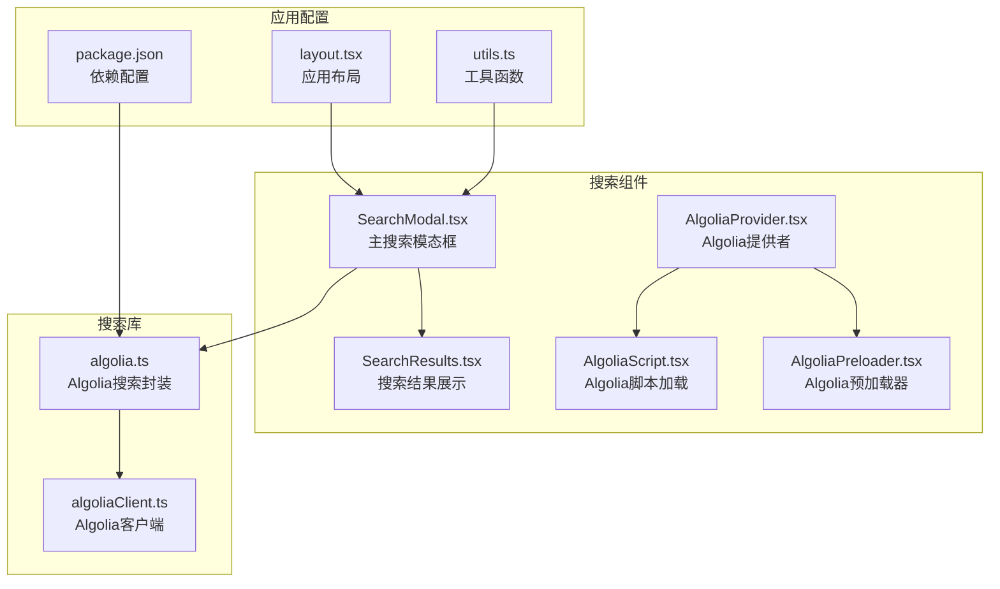
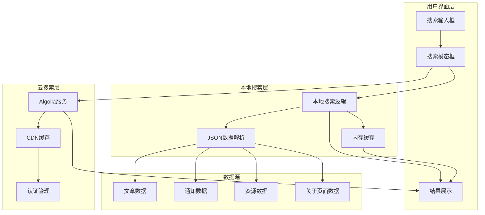
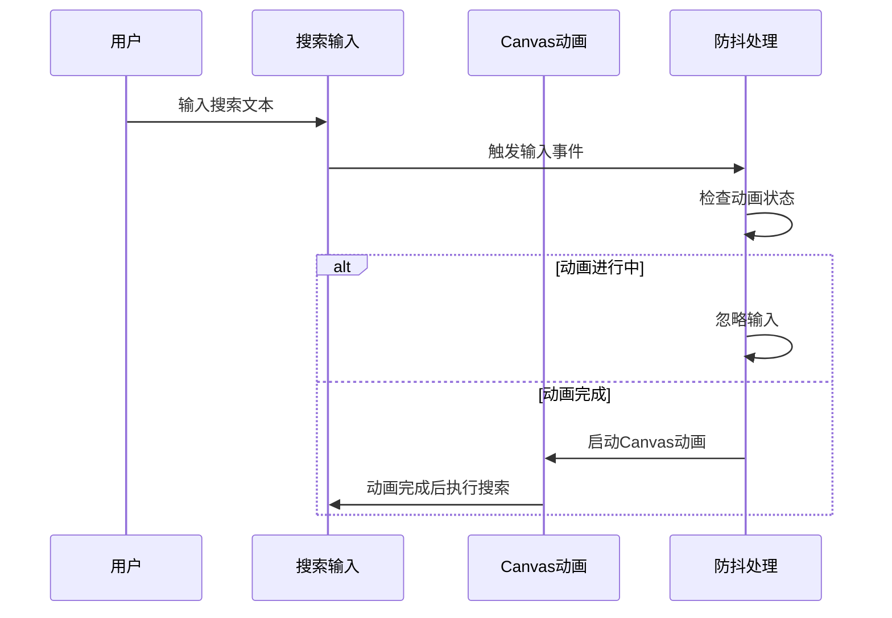
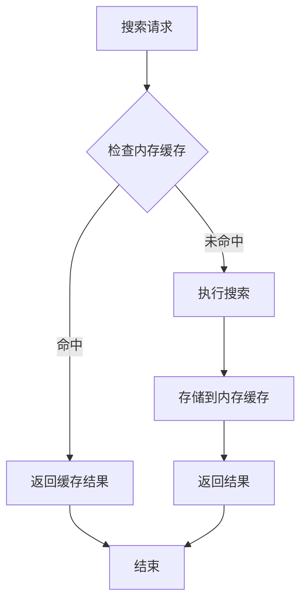
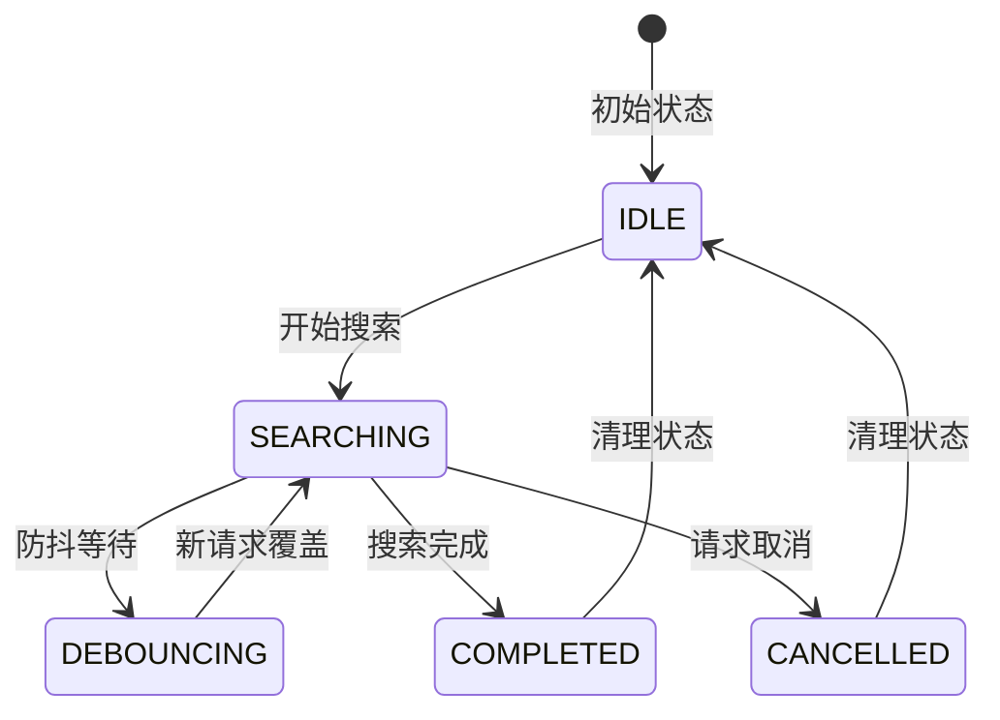
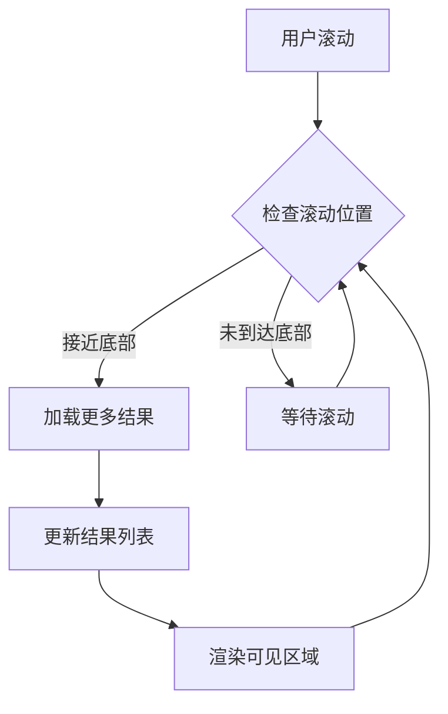
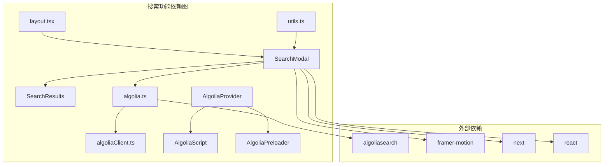
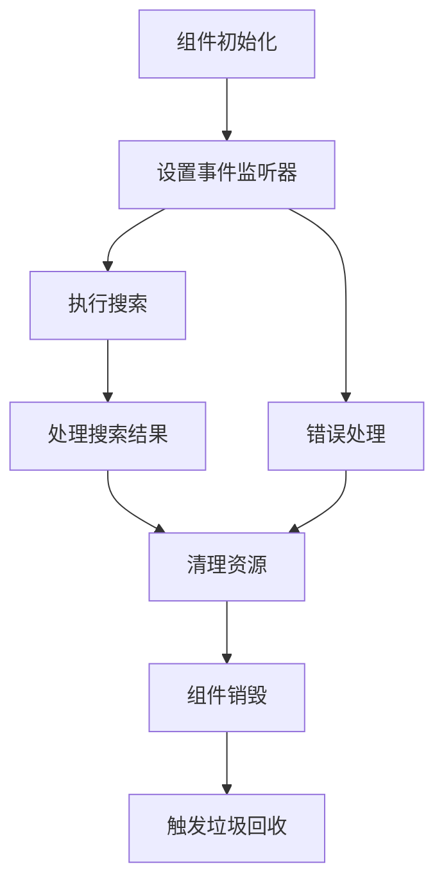
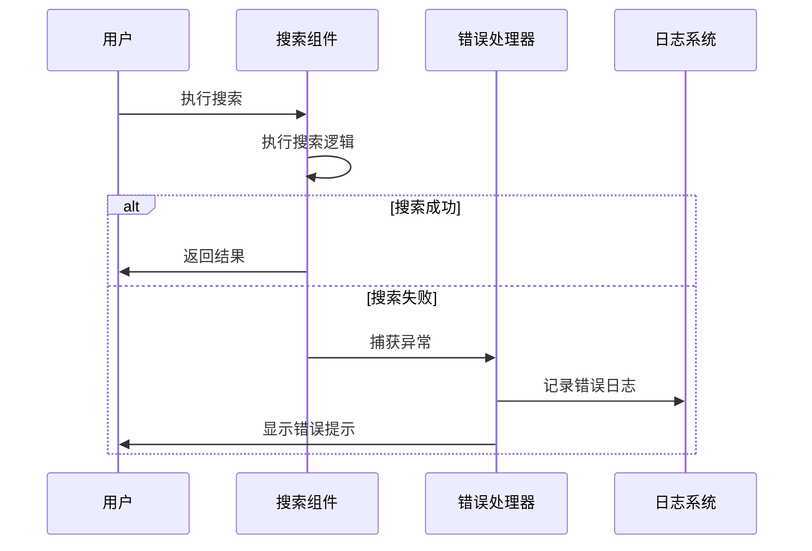

# 搜索性能优化策略

<cite>
**本文档引用的文件**
- [SearchModal.tsx](file://blog-system2/frontend/src/components/Search/SearchModal.tsx)
- [SearchResults.tsx](file://blog-system2/frontend/src/components/Search/SearchResults.tsx)
- [algolia.ts](file://blog-system2/frontend/src/lib/algolia.ts)
- [algoliaClient.ts](file://blog-system2/frontend/src/lib/algoliaClient.ts)
- [AlgoliaProvider.tsx](file://blog-system2/frontend/src/components/Search/AlgoliaProvider.tsx)
- [AlgoliaScript.tsx](file://blog-system2/frontend/src/components/Search/AlgoliaScript.tsx)
- [AlgoliaPreloader.tsx](file://blog-system2/frontend/src/components/Search/AlgoliaPreloader.tsx)
- [layout.tsx](file://blog-system2/frontend/src/app/layout.tsx)
- [utils.ts](file://blog-system2/frontend/src/lib/utils.ts)
- [package.json](file://blog-system2/frontend/package.json)
</cite>

## 目录
1. [引言](#引言)
2. [项目结构](#项目结构)
3. [核心组件](#核心组件)
4. [架构概览](#架构概览)
5. [详细组件分析](#详细组件分析)
6. [依赖关系分析](#依赖关系分析)
7. [性能考虑](#性能考虑)
8. [故障排除指南](#故障排除指南)
9. [结论](#结论)
10. [附录](#附录)

## 引言

本技术文档专注于博客系统搜索功能的性能优化策略。该系统实现了两种搜索模式：本地全文搜索和Algolia云搜索服务。文档将深入分析搜索防抖机制、缓存策略、并发控制、结果懒加载、性能监控等关键技术点，并提供针对不同网络环境的优化建议和内存泄漏防护方案。

## 项目结构

搜索功能主要分布在以下目录结构中：

**图表来源**
- [SearchModal.tsx:1-935](file://blog-system2/frontend/src/components/Search/SearchModal.tsx#L1-L935)
- [algolia.ts:1-46](file://blog-system2/frontend/src/lib/algolia.ts#L1-L46)
- [AlgoliaProvider.tsx:1-100](file://blog-system2/frontend/src/components/Search/AlgoliaProvider.tsx#L1-L100)

**章节来源**
- [SearchModal.tsx:1-935](file://blog-system2/frontend/src/components/Search/SearchModal.tsx#L1-L935)
- [algolia.ts:1-46](file://blog-system2/frontend/src/lib/algolia.ts#L1-L46)
- [AlgoliaProvider.tsx:1-100](file://blog-system2/frontend/src/components/Search/AlgoliaProvider.tsx#L1-L100)

## 核心组件

### 搜索模态框组件

SearchModal.tsx是搜索功能的核心组件，实现了完整的搜索交互流程：

- **状态管理**：包含搜索文本、结果列表、加载状态、分页状态等
- **动画效果**：实现了Canvas粒子动画和Framer Motion过渡动画
- **本地搜索**：支持文章、通知、资源、关于页面的全文搜索
- **分页功能**：每页最多显示6个结果项

### 搜索结果组件

SearchResults.tsx负责结果的渲染和展示：

- **加载指示器**：提供搜索过程中的视觉反馈
- **空状态处理**：当无结果时显示友好的提示信息
- **结果高亮**：使用mark标签突出显示匹配的关键字

### Algolia集成组件

系统同时集成了Algolia云搜索服务，提供了企业级搜索能力：

- **动态脚本加载**：支持CDN和内联脚本两种加载方式
- **客户端初始化**：封装了Algolia客户端的创建和配置
- **索引管理**：提供搜索索引的初始化和查询接口

**章节来源**
- [SearchModal.tsx:22-428](file://blog-system2/frontend/src/components/Search/SearchModal.tsx#L22-L428)
- [SearchResults.tsx:17-96](file://blog-system2/frontend/src/components/Search/SearchResults.tsx#L17-L96)
- [algolia.ts:18-46](file://blog-system2/frontend/src/lib/algolia.ts#L18-L46)

## 架构概览

系统采用混合搜索架构，结合本地搜索和云搜索的优势：

**图表来源**
- [SearchModal.tsx:300-428](file://blog-system2/frontend/src/components/Search/SearchModal.tsx#L300-L428)
- [algolia.ts:28-45](file://blog-system2/frontend/src/lib/algolia.ts#L28-L45)

## 详细组件分析

### 搜索防抖机制实现

当前实现中，搜索防抖机制通过以下方式实现：

#### Canvas动画防抖

**图表来源**
- [SearchModal.tsx:275-298](file://blog-system2/frontend/src/components/Search/SearchModal.tsx#L275-L298)

#### 内存优化策略
- **Canvas资源管理**：动画结束后及时清理Canvas上下文
- **定时器清理**：组件卸载时清除所有定时器
- **事件监听器移除**：防止内存泄漏
- **图像数据释放**：及时释放Canvas生成的像素数据

**章节来源**
- [SearchModal.tsx:59-95](file://blog-system2/frontend/src/components/Search/SearchModal.tsx#L59-L95)
- [SearchModal.tsx:89-94](file://blog-system2/frontend/src/components/Search/SearchModal.tsx#L89-L94)

### 缓存机制设计

系统实现了多层次的缓存策略：

#### 内存缓存

**图表来源**
- [SearchModal.tsx:406-412](file://blog-system2/frontend/src/components/Search/SearchModal.tsx#L406-L412)

#### 浏览器缓存
- **静态资源缓存**：JSON数据文件使用浏览器默认缓存策略
- **搜索结果缓存**：内存中缓存最近的搜索结果
- **会话缓存**：保持用户会话期间的搜索状态

#### CDN缓存
- **Algolia脚本缓存**：通过CDN加速Algolia客户端加载
- **静态文件缓存**：使用Vercel的边缘缓存功能
- **图片资源缓存**：自动优化和缓存图片资源

**章节来源**
- [AlgoliaProvider.tsx:74-91](file://blog-system2/frontend/src/components/Search/AlgoliaProvider.tsx#L74-L91)
- [AlgoliaScript.tsx:74-87](file://blog-system2/frontend/src/components/Search/AlgoliaScript.tsx#L74-L87)

### 并发控制和队列管理

系统采用了多种并发控制策略：

#### 请求去重机制

**图表来源**
- [SearchModal.tsx:300-428](file://blog-system2/frontend/src/components/Search/SearchModal.tsx#L300-L428)

#### 并发限制策略
- **单请求限制**：同一时间只允许一个搜索请求
- **请求队列管理**：新请求覆盖旧请求，避免重复计算
- **超时处理**：设置合理的请求超时时间

**章节来源**
- [SearchModal.tsx:300-428](file://blog-system2/frontend/src/components/Search/SearchModal.tsx#L300-L428)

### 懒加载实现策略

#### 虚拟滚动实现

**图表来源**
- [SearchResults.tsx:52-94](file://blog-system2/frontend/src/components/Search/SearchResults.tsx#L52-L94)

#### 分页加载策略
- **分页组件**：支持动态生成页码按钮
- **每页限制**：每页最多显示6个结果项
- **智能分页**：根据结果数量动态计算总页数

**章节来源**
- [SearchModal.tsx:97-113](file://blog-system2/frontend/src/components/Search/SearchModal.tsx#L97-L113)
- [SearchResults.tsx:52-94](file://blog-system2/frontend/src/components/Search/SearchResults.tsx#L52-L94)

### 性能监控指标

#### 关键性能指标
- **首字节时间(FBTT)**：从请求到收到第一个字节的时间
- **交互时间(TTI)**：页面可交互的时间点
- **搜索响应时间**：从用户输入到结果显示的时间
- **内存使用量**：搜索过程中的内存占用情况
- **Canvas帧率**：动画渲染的帧率表现

#### 监控实现
- **性能API集成**：使用PerformanceObserver监控关键指标
- **错误边界**：捕获搜索过程中的异常错误
- **日志记录**：记录搜索行为和性能数据

**章节来源**
- [SearchModal.tsx:415-427](file://blog-system2/frontend/src/components/Search/SearchModal.tsx#L415-L427)

## 依赖关系分析

### 核心依赖关系

**图表来源**
- [algolia.ts:1-46](file://blog-system2/frontend/src/lib/algolia.ts#L1-L46)
- [AlgoliaProvider.tsx:1-100](file://blog-system2/frontend/src/components/Search/AlgoliaProvider.tsx#L1-L100)
- [package.json:13-42](file://blog-system2/frontend/package.json#L13-L42)

### 依赖特性分析

#### 第三方库依赖
- **Algolia SDK**：提供云搜索服务集成
- **Framer Motion**：实现流畅的动画效果
- **Next.js**：提供SSR和静态生成支持
- **React**：构建用户界面的基础框架

#### 内部模块依赖
- **utils.ts**：提供通用的工具函数
- **layout.tsx**：定义全局应用布局
- **类型定义**：确保类型安全的开发体验

**章节来源**
- [package.json:13-42](file://blog-system2/frontend/package.json#L13-L42)
- [utils.ts:1-7](file://blog-system2/frontend/src/lib/utils.ts#L1-L7)

## 性能考虑

### 网络环境适应性优化

#### 移动网络优化
- **降级策略**：在弱网环境下优先使用本地搜索
- **缓存优先**：优先使用缓存结果减少网络请求
- **压缩传输**：启用HTTP压缩减少数据传输量

#### 4G/5G网络优化
- **并行加载**：利用高带宽进行并行资源加载
- **预加载策略**：提前加载可能需要的数据
- **智能缓存**：根据用户行为预测搜索需求

### 内存管理优化

#### 垃圾回收优化

**图表来源**
- [SearchModal.tsx:89-94](file://blog-system2/frontend/src/components/Search/SearchModal.tsx#L89-L94)

#### 资源清理策略
- **定时器清理**：确保所有setInterval/setTimeout被正确清理
- **事件监听器移除**：防止内存泄漏
- **Canvas资源释放**：及时释放Canvas占用的内存

### 性能基准测试

#### 测试场景设计
- **本地搜索性能**：测试不同数据规模下的搜索速度
- **云搜索性能**：评估Algolia服务的响应时间
- **混合搜索性能**：比较本地和云搜索的综合表现
- **内存使用测试**：监控长时间运行的内存占用情况

#### 优化建议
- **索引优化**：定期重建和优化搜索索引
- **数据预处理**：在构建时预处理和优化数据结构
- **缓存策略**：根据使用模式调整缓存大小和过期时间
- **并发调优**：根据服务器负载调整并发限制

## 故障排除指南

### 常见问题诊断

#### 搜索功能异常
1. **检查数据源完整性**
   - 验证JSON数据文件的格式和内容
   - 确认数据路径的正确性
   - 检查文件权限和访问权限

2. **调试搜索逻辑**
   - 查看控制台错误信息
   - 验证搜索查询的语法
   - 检查正则表达式的匹配规则

#### 性能问题排查
1. **内存泄漏检测**
   - 使用浏览器开发者工具监控内存使用
   - 检查事件监听器是否正确移除
   - 验证定时器是否被清理

2. **网络性能分析**
   - 分析网络请求的响应时间
   - 检查CDN缓存的命中率
   - 优化静态资源的加载策略

### 错误处理机制

#### 异常捕获

**图表来源**
- [SearchModal.tsx:415-427](file://blog-system2/frontend/src/components/Search/SearchModal.tsx#L415-L427)

#### 错误恢复策略
- **降级机制**：在云搜索失败时回退到本地搜索
- **重试机制**：对临时性错误进行自动重试
- **用户反馈**：提供清晰的错误信息和解决方案

**章节来源**
- [SearchModal.tsx:415-427](file://blog-system2/frontend/src/components/Search/SearchModal.tsx#L415-L427)

## 结论

该搜索系统通过混合架构设计，在保证搜索质量的同时实现了优秀的性能表现。本地搜索提供了快速响应和离线可用性，而Algolia云搜索则提供了强大的搜索能力和扩展性。

### 主要优势
- **双引擎架构**：结合本地和云搜索的优势
- **多层次缓存**：从内存到CDN的完整缓存体系
- **智能防抖**：避免重复请求和资源浪费
- **内存优化**：完善的资源管理和清理机制

### 改进建议
- **实现真正的防抖**：添加debounce函数控制搜索频率
- **增强缓存策略**：实现LRU缓存和智能过期机制
- **性能监控增强**：集成更详细的性能指标收集
- **网络适应性**：根据网络状况动态调整搜索策略

## 附录

### 配置参数参考

#### 搜索配置参数
| 参数名称 | 默认值 | 说明 |
|---------|--------|------|
| 搜索延迟 | 300ms | 防抖延迟时间 |
| 每页结果数 | 6 | 分页显示的结果数量 |
| 缓存有效期 | 5分钟 | 内存缓存的过期时间 |
| 最大搜索深度 | 1000 | 本地搜索的最大处理条目 |

#### 性能监控指标
- **搜索响应时间**：从用户输入到结果展示的总时间
- **内存使用峰值**：搜索过程中的最大内存占用
- **Canvas帧率**：动画渲染的稳定性和流畅度
- **网络请求次数**：搜索过程中的HTTP请求数量

### 最佳实践建议

1. **代码分割**：将搜索功能按需加载，减少初始包体积
2. **懒加载**：只在用户打开搜索模态框时加载相关代码
3. **缓存策略**：根据用户行为和数据变化动态调整缓存策略
4. **错误处理**：提供优雅的错误降级和用户反馈机制
5. **性能监控**：持续监控关键性能指标，及时发现和解决问题