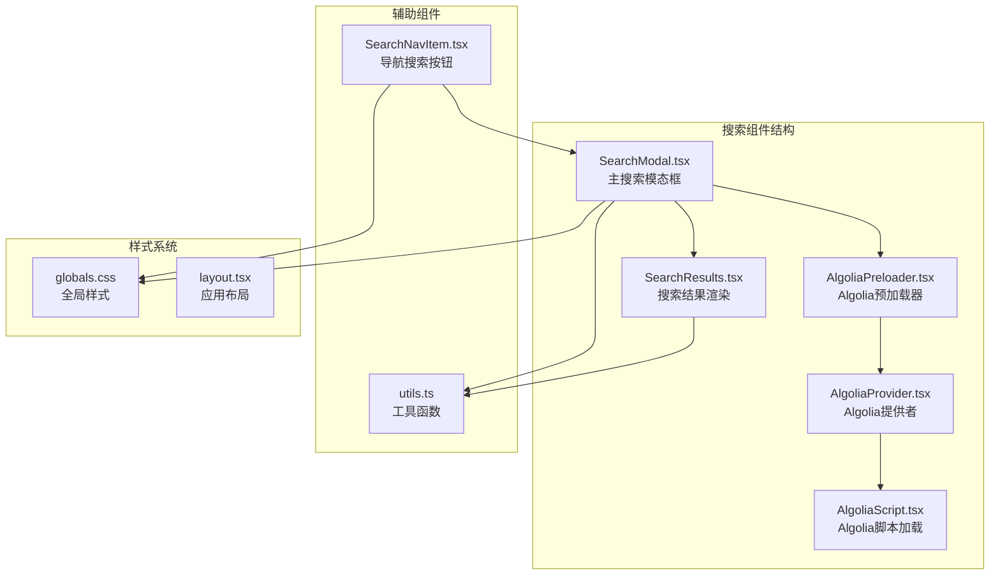
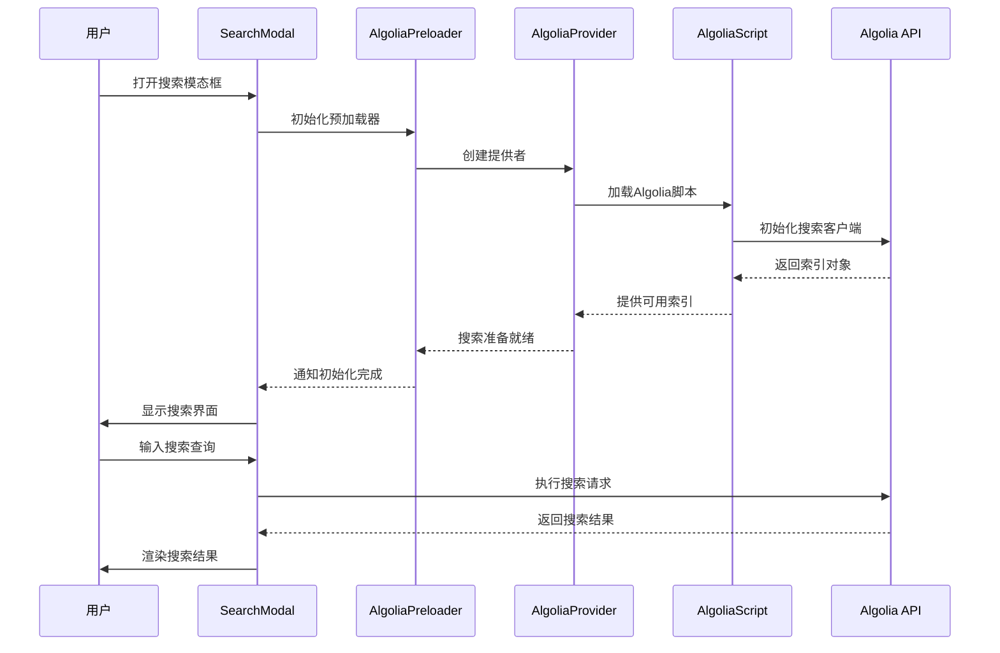
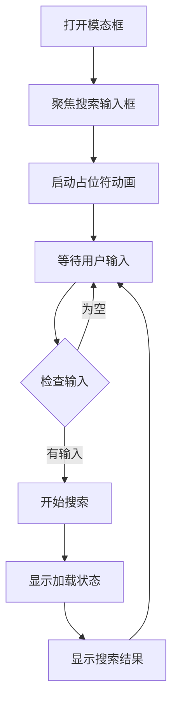
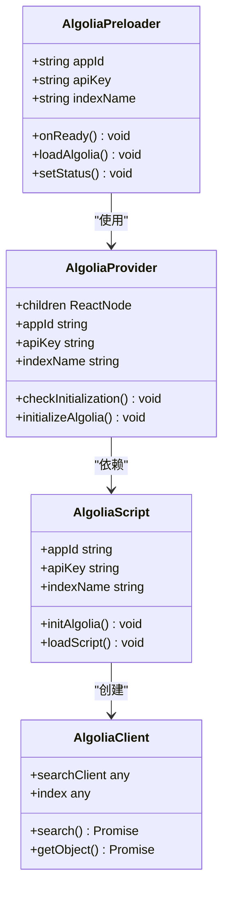
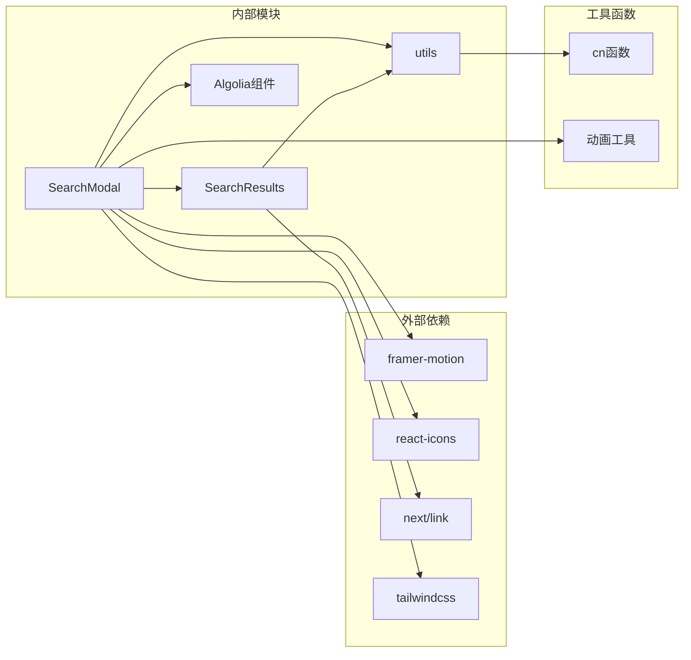

# 搜索用户界面组件

<cite>
**本文档引用的文件**
- [SearchModal.tsx](file://blog-system2/frontend/src/components/Search/SearchModal.tsx)
- [SearchResults.tsx](file://blog-system2/frontend/src/components/Search/SearchResults.tsx)
- [AlgoliaPreloader.tsx](file://blog-system2/frontend/src/components/Search/AlgoliaPreloader.tsx)
- [AlgoliaProvider.tsx](file://blog-system2/frontend/src/components/Search/AlgoliaProvider.tsx)
- [AlgoliaScript.tsx](file://blog-system2/frontend/src/components/Search/AlgoliaScript.tsx)
- [algolia.ts](file://blog-system2/frontend/src/lib/algolia.ts)
- [algoliaClient.ts](file://blog-system2/frontend/src/lib/algoliaClient.ts)
- [SearchNavItem.tsx](file://blog-system2/frontend/src/components/Home/SearchNavItem.tsx)
- [utils.ts](file://blog-system2/frontend/src/lib/utils.ts)
- [globals.css](file://blog-system2/frontend/src/app/globals.css)
- [layout.tsx](file://blog-system2/frontend/src/app/layout.tsx)
- [page.tsx](file://blog-system2/frontend/src/app/page.tsx)
</cite>

## 目录
1. [引言](#引言)
2. [项目结构](#项目结构)
3. [核心组件](#核心组件)
4. [架构概览](#架构概览)
5. [详细组件分析](#详细组件分析)
6. [依赖关系分析](#依赖关系分析)
7. [性能考虑](#性能考虑)
8. [故障排除指南](#故障排除指南)
9. [结论](#结论)

## 引言

本文档深入分析了MDG网站的搜索用户界面组件，重点解析SearchModal组件的设计架构和实现细节。该组件提供了完整的搜索体验，包括模态框显示控制、键盘事件处理、焦点管理、实时预览功能、搜索结果渲染机制等核心功能。

## 项目结构

搜索组件位于前端项目的组件目录中，采用模块化设计：

**图表来源**
- [SearchModal.tsx:1-935](file://blog-system2/frontend/src/components/Search/SearchModal.tsx#L1-L935)
- [SearchResults.tsx:1-96](file://blog-system2/frontend/src/components/Search/SearchResults.tsx#L1-L96)
- [AlgoliaPreloader.tsx:1-103](file://blog-system2/frontend/src/components/Search/AlgoliaPreloader.tsx#L1-L103)

**章节来源**
- [SearchModal.tsx:1-935](file://blog-system2/frontend/src/components/Search/SearchModal.tsx#L1-L935)
- [layout.tsx:1-48](file://blog-system2/frontend/src/app/layout.tsx#L1-L48)

## 核心组件

### SearchModal 主组件

SearchModal是整个搜索功能的核心组件，实现了以下关键功能：

#### 状态管理
- 搜索文本状态 (`searchText`)
- 搜索结果状态 (`searchResults`)
- 加载状态 (`isLoading`)
- 搜索历史状态 (`hasSearched`)
- 分页状态 (`currentPage`)

#### 动画系统
- 实时占位符轮播动画
- Canvas粒子动画效果
- Framer Motion过渡动画
- 响应式动画优化

#### 搜索逻辑
- 多数据源搜索（文章、通知、资源、关于页面）
- 实时预览功能
- 结果去重和分类
- 高亮匹配文本

**章节来源**
- [SearchModal.tsx:22-428](file://blog-system2/frontend/src/components/Search/SearchModal.tsx#L22-L428)

### SearchResults 结果组件

专门负责搜索结果的渲染，提供：

- 加载状态指示器
- 空结果处理
- 动画化结果列表
- 结果项链接导航

**章节来源**
- [SearchResults.tsx:17-96](file://blog-system2/frontend/src/components/Search/SearchResults.tsx#L17-L96)

## 架构概览

搜索系统的整体架构采用分层设计：

**图表来源**
- [AlgoliaPreloader.tsx:12-103](file://blog-system2/frontend/src/components/Search/AlgoliaPreloader.tsx#L12-L103)
- [AlgoliaProvider.tsx:22-99](file://blog-system2/frontend/src/components/Search/AlgoliaProvider.tsx#L22-L99)
- [AlgoliaScript.tsx:22-102](file://blog-system2/frontend/src/components/Search/AlgoliaScript.tsx#L22-L102)

## 详细组件分析

### 模态框显示控制

SearchModal实现了完整的模态框生命周期管理：

#### 打开和关闭机制
- 通过props接收`isOpen`和`onClose`参数
- 支持Esc键快速关闭
- 点击模态框外部区域自动关闭
- 点击遮罩层关闭功能

#### 动画系统
- Framer Motion提供平滑的进入/退出动画
- Spring动画类型确保自然的物理反馈
- 自定义过渡时间控制

**图表来源**
- [SearchModal.tsx:115-169](file://blog-system2/frontend/src/components/Search/SearchModal.tsx#L115-L169)

**章节来源**
- [SearchModal.tsx:115-169](file://blog-system2/frontend/src/components/Search/SearchModal.tsx#L115-L169)

### 键盘事件处理和焦点管理

组件实现了全面的键盘导航支持：

#### 事件监听
- Esc键监听器自动关闭模态框
- Enter键触发搜索执行
- 点击外部区域监听器
- 窗口可见性变化监听器

#### 焦点管理
- 模态框打开时自动聚焦搜索输入框
- 延迟100ms确保动画完成
- 搜索完成后保持焦点在输入框

**章节来源**
- [SearchModal.tsx:135-169](file://blog-system2/frontend/src/components/Search/SearchModal.tsx#L135-L169)

### 实时预览功能

SearchModal提供了强大的实时搜索能力：

#### 搜索范围
- 文章标题和摘要搜索
- 通知标题搜索
- 资源标题、描述和标签搜索
- 关于页面预定义内容搜索

#### 高亮显示
- 匹配文本自动高亮
- 使用mark标签进行语义标记
- 支持深色模式高亮样式

#### 防抖处理
- 搜索结果去重
- 避免重复内容显示
- 优化用户体验

**章节来源**
- [SearchModal.tsx:300-428](file://blog-system2/frontend/src/components/Search/SearchModal.tsx#L300-L428)

### 搜索结果渲染机制

SearchResults组件实现了高效的搜索结果展示：

#### 渲染策略
- 条件渲染加载状态
- 空结果优雅降级
- 动画化结果列表
- 悬停效果增强

#### 结果格式化
- 标题HTML内容渲染
- 摘要多行显示
- 分类标签标识
- 链接导航支持

**章节来源**
- [SearchResults.tsx:24-96](file://blog-system2/frontend/src/components/Search/SearchResults.tsx#L24-L96)

### Algolia集成架构

系统集成了Algolia搜索引擎服务：

#### 预加载器设计
- 动态脚本加载机制
- 客户端初始化验证
- 错误处理和重试机制
- 状态管理优化

#### 提供者模式
- Next.js Script组件集成
- 内联脚本加载备份
- 窗口对象类型安全
- 初始化延迟处理

**图表来源**
- [AlgoliaPreloader.tsx:12-103](file://blog-system2/frontend/src/components/Search/AlgoliaPreloader.tsx#L12-L103)
- [AlgoliaProvider.tsx:22-99](file://blog-system2/frontend/src/components/Search/AlgoliaProvider.tsx#L22-L99)
- [AlgoliaScript.tsx:22-102](file://blog-system2/frontend/src/components/Search/AlgoliaScript.tsx#L22-L102)

**章节来源**
- [algolia.ts:18-46](file://blog-system2/frontend/src/lib/algolia.ts#L18-L46)
- [algoliaClient.ts:15-33](file://blog-system2/frontend/src/lib/algoliaClient.ts#L15-L33)

### 导航集成

SearchNavItem组件提供了便捷的搜索入口：

#### 交互设计
- 悬停动画效果
- 触摸设备优化
- 工具提示系统
- 电路板装饰元素

#### 状态同步
- 搜索状态指示
- 动画参数响应
- 窗口尺寸适配
- 性能优化考虑

**章节来源**
- [SearchNavItem.tsx:17-215](file://blog-system2/frontend/src/components/Home/SearchNavItem.tsx#L17-L215)

## 依赖关系分析

搜索组件的依赖关系清晰且模块化：

**图表来源**
- [SearchModal.tsx:3-8](file://blog-system2/frontend/src/components/Search/SearchModal.tsx#L3-L8)
- [utils.ts:4-6](file://blog-system2/frontend/src/lib/utils.ts#L4-L6)

**章节来源**
- [SearchModal.tsx:1-13](file://blog-system2/frontend/src/components/Search/SearchModal.tsx#L1-L13)
- [utils.ts:1-7](file://blog-system2/frontend/src/lib/utils.ts#L1-L7)

## 性能考虑

### 动画优化
- Canvas粒子动画仅在桌面设备启用
- 移动端自动禁用复杂动画效果
- 请求动画帧优化渲染性能
- 动画状态及时清理

### 搜索性能
- 多数据源并行搜索
- 结果去重算法优化
- 防抖处理减少请求频率
- 分页加载提升大结果集性能

### 样式优化
- Tailwind CSS类名合并
- 条件样式应用
- 响应式设计减少重绘
- CSS变量统一主题管理

## 故障排除指南

### 常见问题诊断

#### Algolia初始化失败
- 检查网络连接和CDN访问
- 验证API密钥配置正确性
- 查看浏览器控制台错误信息
- 确认脚本加载顺序

#### 搜索结果异常
- 验证数据源JSON格式
- 检查跨域资源共享设置
- 确认搜索查询语法
- 排查编码字符问题

#### 动画性能问题
- 检查硬件加速状态
- 验证Canvas兼容性
- 调整动画复杂度
- 监控内存使用情况

**章节来源**
- [AlgoliaPreloader.tsx:20-99](file://blog-system2/frontend/src/components/Search/AlgoliaPreloader.tsx#L20-L99)
- [globals.css:610-681](file://blog-system2/frontend/src/app/globals.css#L610-L681)

## 结论

MDG网站的搜索用户界面组件展现了现代Web应用的最佳实践：

### 设计优势
- **模块化架构**：清晰的组件分离和职责划分
- **用户体验优先**：流畅的动画效果和直观的交互
- **性能优化**：合理的资源管理和渲染优化
- **可维护性**：良好的代码结构和类型安全

### 技术亮点
- 完整的键盘导航支持
- 响应式设计适配多设备
- 高效的搜索算法实现
- 稳健的错误处理机制

### 改进建议
- 可考虑添加搜索历史功能
- 增加搜索建议自动完成
- 优化移动端触摸交互
- 添加搜索统计分析

该搜索组件为MDG网站提供了强大而优雅的搜索体验，体现了现代前端开发的技术水准和用户体验设计理念。