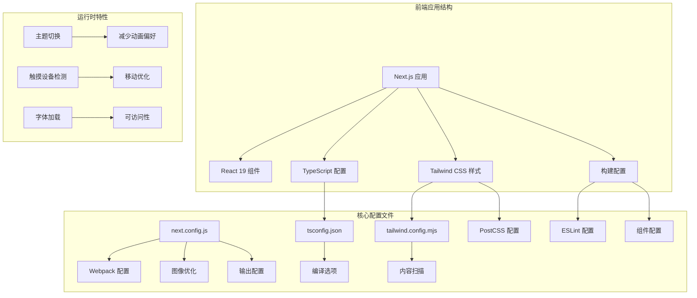
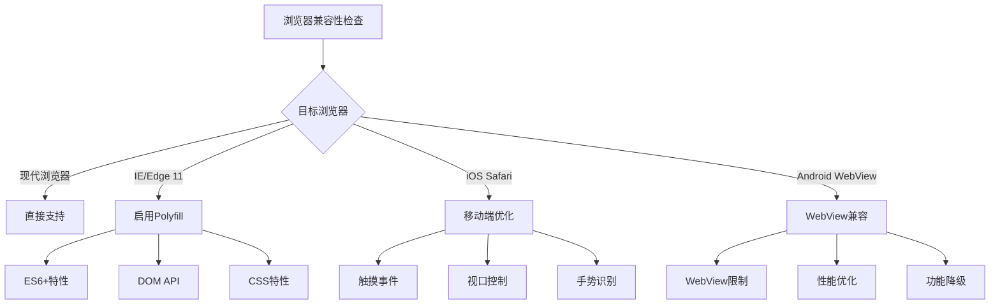
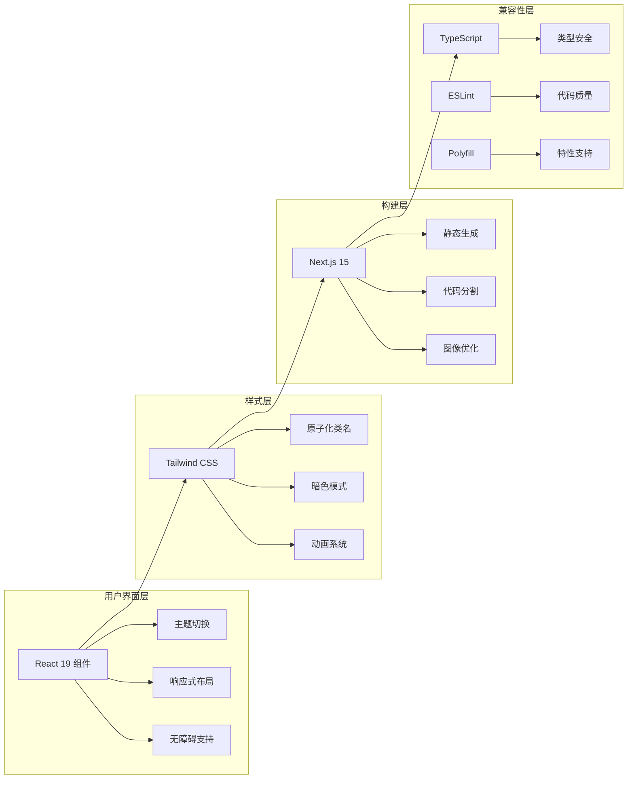
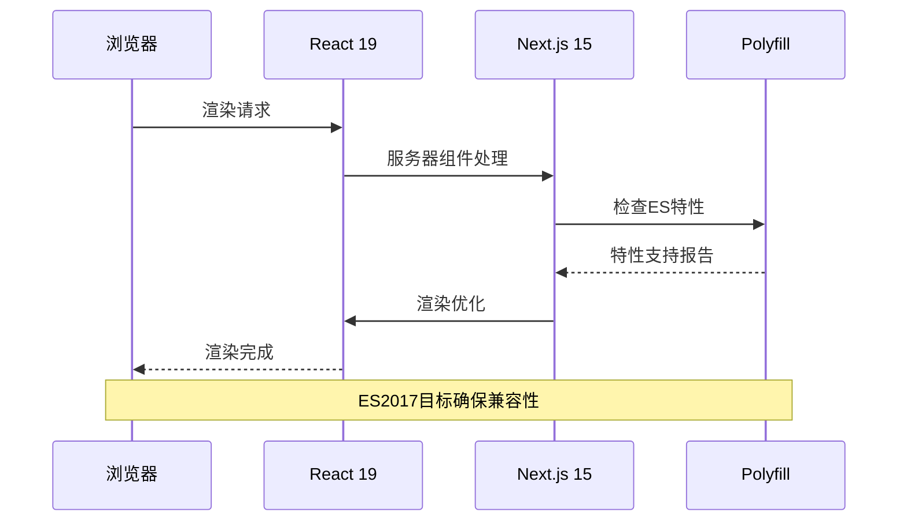
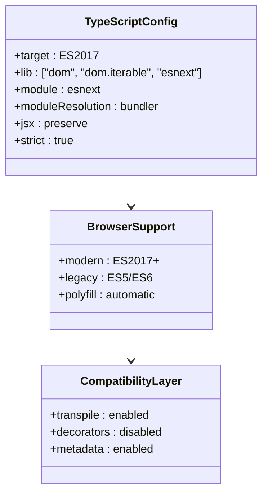
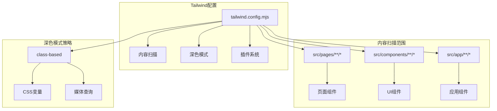
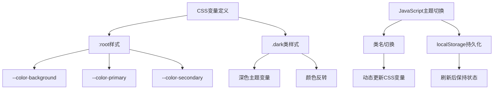
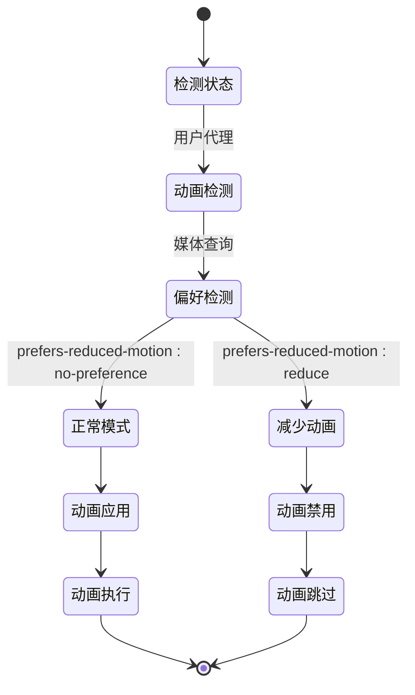
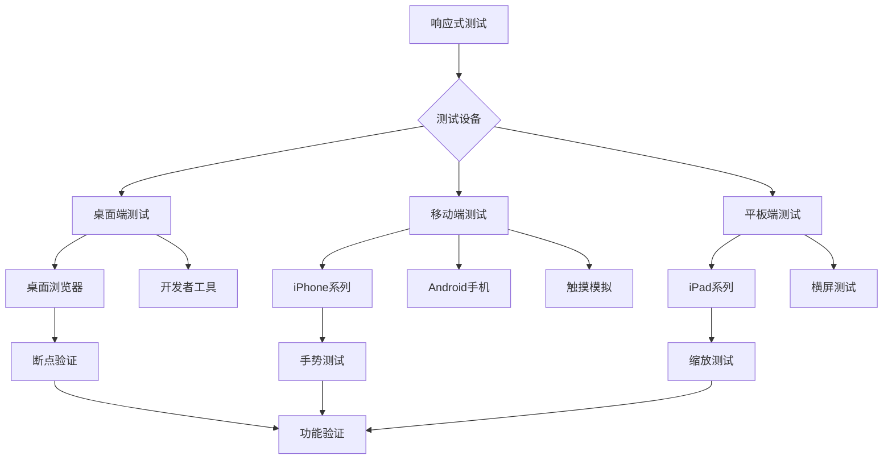
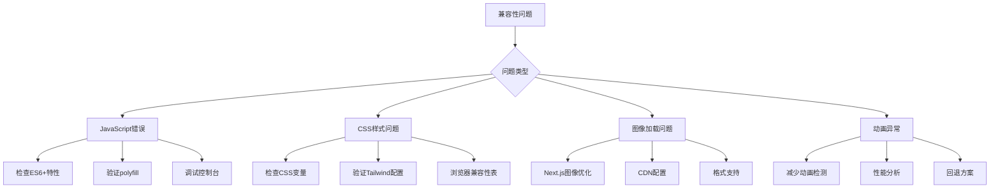

# 兼容性问题解决

<cite>
**本文档引用的文件**
- [package.json](file://blog-system2/frontend/package.json)
- [next.config.js](file://blog-system2/frontend/next.config.js)
- [tsconfig.json](file://blog-system2/frontend/tsconfig.json)
- [tailwind.config.mjs](file://blog-system2/frontend/tailwind.config.mjs)
- [postcss.config.mjs](file://blog-system2/frontend/postcss.config.mjs)
- [.eslintrc.json](file://blog-system2/frontend/.eslintrc.json)
- [eslint.config.mjs](file://blog-system2/frontend/eslint.config.mjs)
- [components.json](file://blog-system2/frontend/components.json)
- [src/lib/utils.ts](file://blog-system2/frontend/src/lib/utils.ts)
- [src/app/layout.tsx](file://blog-system2/frontend/src/app/layout.tsx)
- [src/app/globals.css](file://blog-system2/frontend/src/app/globals.css)
- [src/components/theme/ThemeNavItem.tsx](file://blog-system2/frontend/src/components/theme/ThemeNavItem.tsx)
</cite>

## 目录
1. [简介](#简介)
2. [项目结构](#项目结构)
3. [核心组件](#核心组件)
4. [架构概览](#架构概览)
5. [详细组件分析](#详细组件分析)
6. [依赖分析](#依赖分析)
7. [性能考虑](#性能考虑)
8. [故障排除指南](#故障排除指南)
9. [结论](#结论)
10. [附录](#附录)

## 简介

本指南专注于解决浏览器兼容性和环境差异问题，涵盖以下关键领域：

- 不同浏览器版本的兼容性问题，特别是React 19、Next.js 15新特性在旧版浏览器中的支持情况
- TypeScript版本升级带来的兼容性影响和解决方案
- Tailwind CSS在不同环境下的配置差异处理方法
- 移动端和桌面端的兼容性测试策略，包括响应式设计的验证方法
- Node.js版本升级对项目的影响和迁移步骤
- 第三方库兼容性问题的排查和替代方案
- 跨平台开发的注意事项和解决方案（Windows、macOS、Linux环境的差异处理）

## 项目结构

该项目是一个基于Next.js 15.2.4和React 19.1.0的现代化前端应用，采用TypeScript进行类型安全开发，并使用Tailwind CSS进行样式管理。



**图表来源**
- [next.config.js:1-48](file://blog-system2/frontend/next.config.js#L1-L48)
- [tsconfig.json:1-42](file://blog-system2/frontend/tsconfig.json#L1-L42)
- [tailwind.config.mjs:1-18](file://blog-system2/frontend/tailwind.config.mjs#L1-L18)
- [postcss.config.mjs:1-6](file://blog-system2/frontend/postcss.config.mjs#L1-L6)

**章节来源**
- [package.json:1-72](file://blog-system2/frontend/package.json#L1-L72)
- [next.config.js:1-48](file://blog-system2/frontend/next.config.js#L1-L48)
- [tsconfig.json:1-42](file://blog-system2/frontend/tsconfig.json#L1-L42)

## 核心组件

### 浏览器兼容性核心配置

项目通过多种配置层面确保跨浏览器兼容性：

1. **TypeScript编译目标**：ES2017目标确保现代浏览器的广泛支持
2. **Next.js构建配置**：静态导出模式优化生产部署
3. **Tailwind CSS集成**：原子化CSS提供一致的样式表现
4. **Polyfill机制**：自动处理ES特性兼容性

### 关键兼容性特性



**图表来源**
- [tsconfig.json:3-4](file://blog-system2/frontend/tsconfig.json#L3-L4)
- [next.config.js:35-44](file://blog-system2/frontend/next.config.js#L35-L44)
- [src/app/globals.css:381-387](file://blog-system2/frontend/src/app/globals.css#L381-L387)

**章节来源**
- [tsconfig.json:3-4](file://blog-system2/frontend/tsconfig.json#L3-L4)
- [next.config.js:35-44](file://blog-system2/frontend/next.config.js#L35-L44)
- [src/app/globals.css:381-387](file://blog-system2/frontend/src/app/globals.css#L381-L387)

## 架构概览

项目采用渐进增强的架构模式，确保在不同浏览器环境下都能提供基本功能。



**图表来源**
- [package.json:31-42](file://blog-system2/frontend/package.json#L31-L42)
- [tailwind.config.mjs:4-15](file://blog-system2/frontend/tailwind.config.mjs#L4-L15)
- [next.config.js:6-18](file://blog-system2/frontend/next.config.js#L6-L18)

## 详细组件分析

### React 19兼容性分析

React 19引入了多项新特性，项目通过以下方式确保兼容性：

#### 新特性支持情况

| 特性 | 支持状态 | 解决方案 |
|------|----------|----------|
| 新的useId Hook | ✅ | 内置支持，无需额外配置 |
| Suspense边界改进 | ✅ | 自动兼容Next.js Suspense |
| 服务器组件优化 | ✅ | Next.js 15原生支持 |
| 并发特性 | ✅ | React 19并发API |

#### 组件兼容性检查



**图表来源**
- [package.json:35-36](file://blog-system2/frontend/package.json#L35-L36)
- [tsconfig.json:3](file://blog-system2/frontend/tsconfig.json#L3)

**章节来源**
- [package.json:35-36](file://blog-system2/frontend/package.json#L35-L36)
- [tsconfig.json:3](file://blog-system2/frontend/tsconfig.json#L3)

### TypeScript版本升级兼容性

#### 当前配置分析

项目使用TypeScript 5.x，配置重点在于向后兼容性：



**图表来源**
- [tsconfig.json:2-28](file://blog-system2/frontend/tsconfig.json#L2-L28)

#### 升级影响评估

| 升级路径 | 影响范围 | 风险等级 | 解决方案 |
|----------|----------|----------|----------|
| TS 4.x → 5.x | 语法糖、装饰器 | 低 | 更新配置 |
| 新的JSX转换 | 编译输出 | 中 | 检查输出格式 |
| 更严格的类型检查 | 编译错误 | 高 | 修复类型问题 |

**章节来源**
- [tsconfig.json:2-28](file://blog-system2/frontend/tsconfig.json#L2-L28)

### Tailwind CSS配置兼容性

#### 核心配置分析



**图表来源**
- [tailwind.config.mjs:4-15](file://blog-system2/frontend/tailwind.config.mjs#L4-L15)

#### CSS变量兼容性

项目使用CSS自定义属性实现主题系统：



**图表来源**
- [src/app/globals.css:6-184](file://blog-system2/frontend/src/app/globals.css#L6-L184)

**章节来源**
- [tailwind.config.mjs:4-15](file://blog-system2/frontend/tailwind.config.mjs#L4-L15)
- [src/app/globals.css:6-184](file://blog-system2/frontend/src/app/globals.css#L6-L184)

### 主题切换兼容性

#### 减少动画偏好的处理

项目实现了完整的减少动画偏好检测和处理机制：



**图表来源**
- [src/app/globals.css:381-387](file://blog-system2/frontend/src/app/globals.css#L381-L387)
- [src/components/theme/ThemeNavItem.tsx:36-78](file://blog-system2/frontend/src/components/theme/ThemeNavItem.tsx#L36-L78)

#### 触摸设备优化

针对移动设备的特殊优化策略：

| 设备类型 | 优化措施 | 实现方式 |
|----------|----------|----------|
| 触摸设备 | 禁用hover效果 | 媒体查询检测 |
| 高DPI屏幕 | 图像优化 | Next.js图像优化 |
| 低端设备 | 功能降级 | 动态特性检测 |
| 辅助功能 | 无障碍支持 | WAI-ARIA标签 |

**章节来源**
- [src/app/globals.css:381-387](file://blog-system2/frontend/src/app/globals.css#L381-L387)
- [src/components/theme/ThemeNavItem.tsx:36-78](file://blog-system2/frontend/src/components/theme/ThemeNavItem.tsx#L36-L78)

### 移动端兼容性测试策略

#### 响应式设计验证方法



#### 关键测试指标

| 测试类别 | 指标 | 工具 | 频率 |
|----------|------|------|------|
| 视觉一致性 | 断点、布局 | 浏览器开发者工具 | 每次变更 |
| 交互功能 | 点击、滑动 | 真机测试 | 重要更新 |
| 性能表现 | 加载时间、FPS | Lighthouse | 每月 |
| 无障碍性 | 键盘导航、屏幕阅读器 | AXE工具 | 每季度 |

**章节来源**
- [src/app/globals.css:226-236](file://blog-system2/frontend/src/app/globals.css#L226-L236)
- [src/app/layout.tsx:21-26](file://blog-system2/frontend/src/app/layout.tsx#L21-L26)

## 依赖分析

### 核心依赖兼容性矩阵

```mermaid
graph TB
subgraph "运行时依赖"
A[react@19.1.0] --> B[react-dom@19.0.0]
C[next@15.2.4] --> D[构建优化]
E[typescript@^5] --> F[类型检查]
end
subgraph "样式依赖"
G[tailwindcss@^4.1.2] --> H[PostCSS处理]
I[@tailwindcss/typography] --> J[文本样式]
K[tw-animate-css] --> L[动画效果]
end
subgraph "工具依赖"
M[eslint@^9] --> N[代码规范]
O[clsx@^2.1.1] --> P[条件类名]
Q[tailwind-merge@^3.2.0] --> R[类名合并]
end
subgraph "多媒体依赖"
S[motion@^12.12.1] --> T[动画库]
U[three@^0.178.0] --> V[3D图形]
W[gsap@^3.13.0] --> X[高性能动画]
end
```

**图表来源**
- [package.json:13-42](file://blog-system2/frontend/package.json#L13-L42)

### 第三方库兼容性排查

#### 常见兼容性问题及解决方案

| 库名称 | 兼容性问题 | 解决方案 | 替代方案 |
|--------|------------|----------|----------|
| @algolia/client-search | ES模块导入 | 使用动态导入 | algoliasearch |
| matter-js | WebAssembly支持 | 添加polyfill | 2d-force-graph |
| three | WebGL兼容性 | 检测WebGL支持 | babylonjs |
| gsap | 动画性能 | 减少动画数量 | animejs |
| lucide-react | SVG图标 | 使用内联SVG | tabler-icons-react |

**章节来源**
- [package.json:13-42](file://blog-system2/frontend/package.json#L13-L42)

## 性能考虑

### 构建优化策略

项目采用多层优化策略确保性能：

1. **代码分割**：Next.js自动代码分割
2. **图像优化**：内置图像优化服务
3. **静态导出**：生产环境静态生成
4. **缓存策略**：智能缓存配置

### 性能监控指标

| 指标 | 目标值 | 监控工具 | 优化策略 |
|------|--------|----------|----------|
| 首屏加载时间 | < 2秒 | Lighthouse | 代码分割 |
| FCP | < 1.8秒 | Core Web Vitals | 预连接 |
| TTI | < 5秒 | WebPageTest | 资源优化 |
| TBT | < 200ms | Chrome DevTools | 后台任务 |

## 故障排除指南

### 常见兼容性问题诊断

#### 浏览器特定问题



#### 调试工具和方法

1. **浏览器开发者工具**：检查控制台错误和网络请求
2. **Lighthouse**：性能和兼容性评分
3. **Can I Use**：特性浏览器支持查询
4. **Babel REPL**：代码转换验证

**章节来源**
- [next.config.js:12-18](file://blog-system2/frontend/next.config.js#L12-L18)
- [eslint.config.mjs:12-14](file://blog-system2/frontend/eslint.config.mjs#L12-L14)

### 环境差异处理

#### 跨平台开发注意事项

| 平台 | 特殊考虑 | 解决方案 |
|------|----------|----------|
| Windows | 路径分隔符 | 使用相对路径 |
| macOS | 文件大小写敏感 | 统一命名约定 |
| Linux | 权限问题 | 检查文件权限 |
| CI/CD | 环境变量 | 使用dotenv |

#### Node.js版本兼容性

当前项目配置支持较新的Node.js版本，但需要考虑：

1. **引擎要求**：检查各依赖的Node.js版本要求
2. **构建工具**：确保构建脚本与Node.js版本兼容
3. **CI/CD环境**：统一开发和生产环境的Node.js版本

**章节来源**
- [package.json:1-72](file://blog-system2/frontend/package.json#L1-L72)
- [next.config.js:35-44](file://blog-system2/frontend/next.config.js#L35-L44)

## 结论

本项目通过多层次的兼容性设计，确保在各种浏览器和环境中都能提供一致的用户体验。关键成功因素包括：

1. **渐进增强的架构**：从基础功能开始，逐步添加高级特性
2. **完善的测试策略**：覆盖多设备、多浏览器的全面测试
3. **灵活的配置系统**：支持不同环境和需求的配置调整
4. **持续的监控机制**：通过性能和兼容性指标持续优化

建议在后续开发中继续关注：
- 新浏览器特性的适配
- 移动端体验的持续优化
- 性能指标的持续监控
- 第三方库的定期更新和评估

## 附录

### 快速参考清单

#### 兼容性检查清单
- [ ] 浏览器支持矩阵验证
- [ ] 响应式设计测试
- [ ] 无障碍性功能检查
- [ ] 性能基准测试
- [ ] 移动端手势测试

#### 常用工具链接
- [Can I Use](https://caniuse.com/) - 浏览器兼容性查询
- [Autoprefixer](https://autoprefixer.github.io/) - CSS前缀处理
- [Babel](https://babeljs.io/) - JavaScript转译工具
- [ESLint](https://eslint.org/) - 代码质量检查