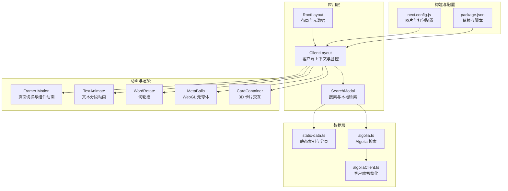
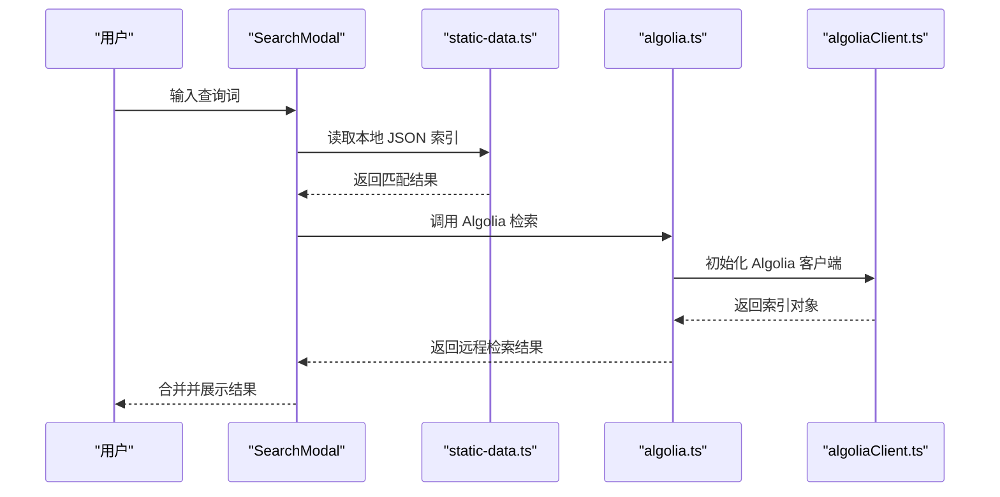
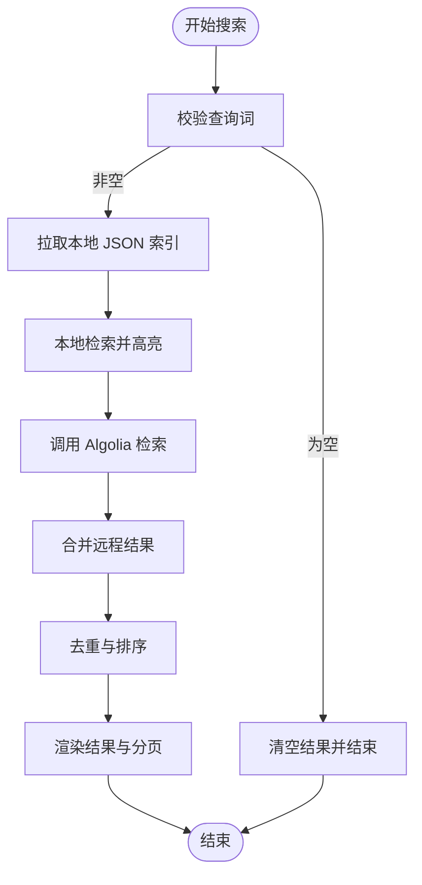
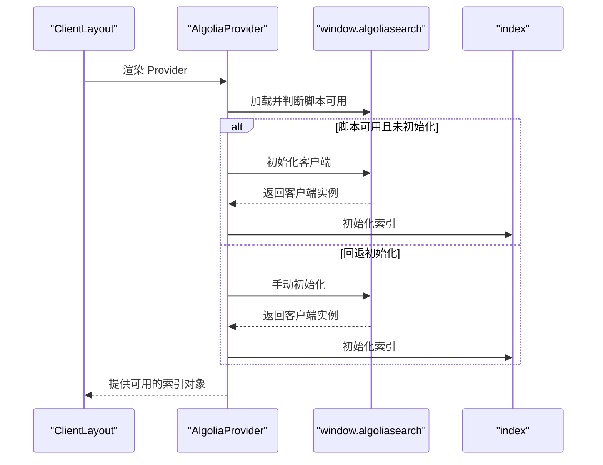
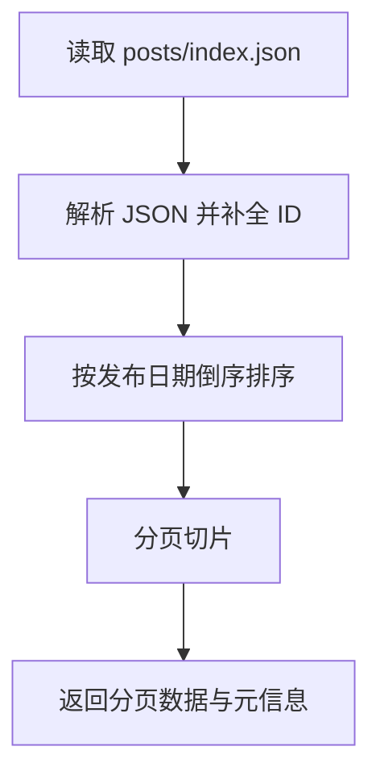
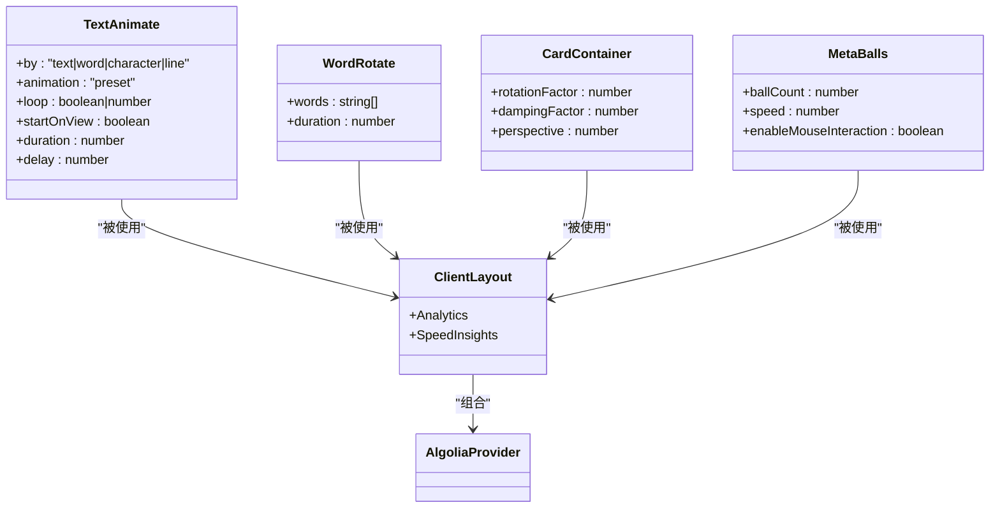
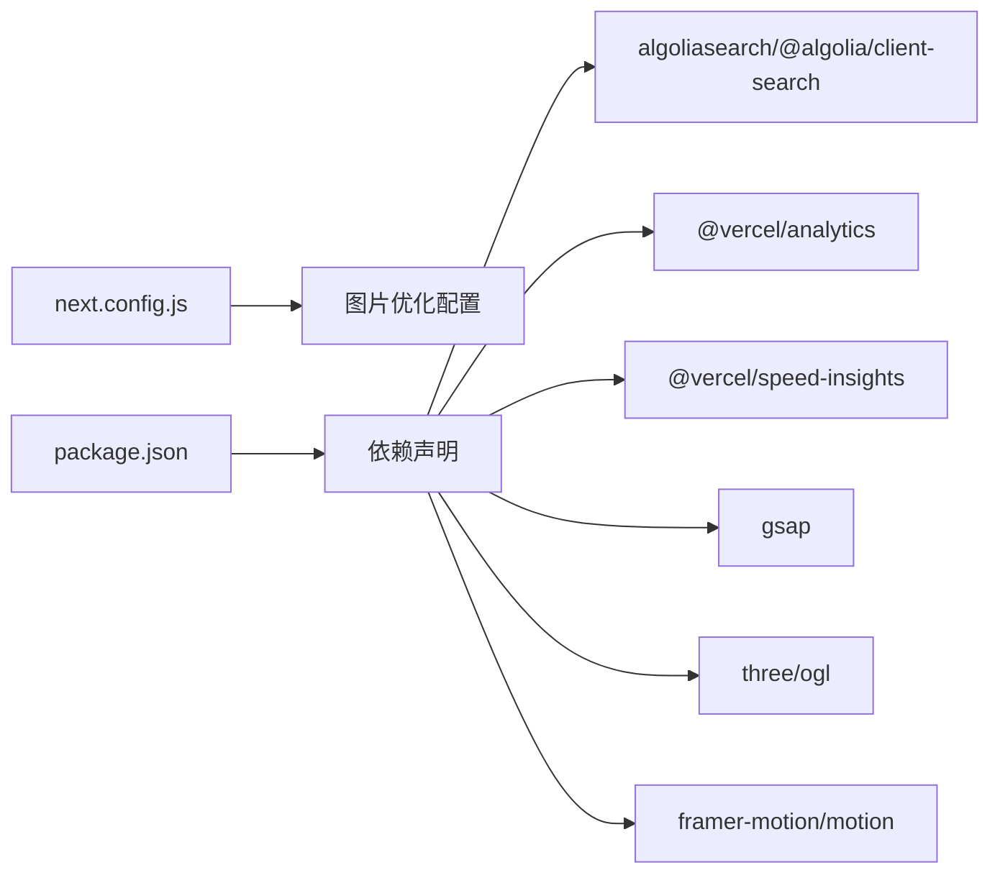

# 性能问题分析

<cite>
**本文引用的文件**   
- [next.config.js](file://blog-system2/frontend/next.config.js)
- [package.json](file://blog-system2/frontend/package.json)
- [IMAGE_OPTIMIZATION.md](file://blog-system2/frontend/IMAGE_OPTIMIZATION.md)
- [algolia.ts](file://blog-system2/frontend/src/lib/algolia.ts)
- [algoliaClient.ts](file://blog-system2/frontend/src/lib/algoliaClient.ts)
- [AlgoliaProvider.tsx](file://blog-system2/frontend/src/components/Search/AlgoliaProvider.tsx)
- [SearchModal.tsx](file://blog-system2/frontend/src/components/Search/SearchModal.tsx)
- [layout.tsx](file://blog-system2/frontend/src/app/layout.tsx)
- [ClientLayout.tsx](file://blog-system2/frontend/src/components/ClientLayout.tsx)
- [static-data.ts](file://blog-system2/frontend/src/lib/static-data.ts)
- [CardContainer.tsx](file://blog-system2/frontend/src/components/Home/3DCardEffect/CardContainer.tsx)
- [useMouseState.ts](file://blog-system2/frontend/src/components/Home/3DCardEffect/useMouseState.ts)
- [text-animate.tsx](file://blog-system2/frontend/src/components/magicui/text-animate.tsx)
- [word-rotate.tsx](file://blog-system2/frontend/src/components/magicui/word-rotate.tsx)
- [MetaBalls.tsx](file://blog-system2/frontend/src/components/reactbits/MetaBalls.tsx)
</cite>

## 目录
1. [引言](#引言)
2. [项目结构](#项目结构)
3. [核心组件](#核心组件)
4. [架构总览](#架构总览)
5. [详细组件分析](#详细组件分析)
6. [依赖分析](#依赖分析)
7. [性能考量](#性能考量)
8. [故障排查指南](#故障排查指南)
9. [结论](#结论)
10. [附录](#附录)

## 引言
本指南聚焦于该 Next.js 应用在性能方面的现状与优化路径，覆盖以下主题：
- 性能监控与指标采集（构建产物体积、页面加载时间、渲染性能）
- 静态数据加载优化（预取、缓存、懒加载）
- 图片优化与资源压缩最佳实践
- 动画性能优化（Framer Motion、GSAP、Three.js/OGL、自研 WebGL）
- 搜索功能性能瓶颈与优化（Algolia API 调用与本地缓存）
- 内存泄漏检测与修复方法
- 浏览器性能分析工具使用
- 生产环境性能监控配置与指标分析

## 项目结构
该项目采用 App Router 结构，前端位于 blog-system2/frontend，核心配置集中在 next.config.js 与 package.json 中；搜索模块通过 Algolia 提供服务端检索能力，并在客户端进行二次本地检索；动画与交互由多个第三方库与自研组件共同完成。

**图表来源**
- [layout.tsx:28-47](file://blog-system2/frontend/src/app/layout.tsx#L28-L47)
- [ClientLayout.tsx:16-62](file://blog-system2/frontend/src/components/ClientLayout.tsx#L16-L62)
- [SearchModal.tsx:1-120](file://blog-system2/frontend/src/components/Search/SearchModal.tsx#L1-L120)
- [static-data.ts:32-73](file://blog-system2/frontend/src/lib/static-data.ts#L32-L73)
- [algolia.ts:28-45](file://blog-system2/frontend/src/lib/algolia.ts#L28-L45)
- [algoliaClient.ts:15-32](file://blog-system2/frontend/src/lib/algoliaClient.ts#L15-L32)
- [next.config.js:6-44](file://blog-system2/frontend/next.config.js#L6-L44)
- [package.json:1-72](file://blog-system2/frontend/package.json#L1-L72)

**章节来源**
- [layout.tsx:28-47](file://blog-system2/frontend/src/app/layout.tsx#L28-L47)
- [ClientLayout.tsx:16-62](file://blog-system2/frontend/src/components/ClientLayout.tsx#L16-L62)
- [next.config.js:6-44](file://blog-system2/frontend/next.config.js#L6-L44)
- [package.json:1-72](file://blog-system2/frontend/package.json#L1-L72)

## 核心组件
- 构建与图片优化配置：next.config.js 中对图片格式、尺寸、缓存 TTL、Webpack 插件进行了裁剪与忽略国际化资源，减少包体与运行时开销。
- 搜索与本地检索：SearchModal 实现了多源检索（本地 JSON + Algolia），并在客户端提供本地高亮与分页。
- 静态数据访问：static-data.ts 提供文章、通知、资源的索引与分页查询，避免频繁网络请求。
- 动画与交互：ClientLayout 集成 Vercel Analytics 与 Speed Insights；TextAnimate、WordRotate、MetaBalls、CardContainer 等组件分别承担文本动画、词轮播、WebGL 元球体与 3D 卡片交互。
- 视口与字体：layout.tsx 设置固定缩放与设备宽度，减少移动端缩放导致的重排。

**章节来源**
- [next.config.js:20-44](file://blog-system2/frontend/next.config.js#L20-L44)
- [SearchModal.tsx:300-428](file://blog-system2/frontend/src/components/Search/SearchModal.tsx#L300-L428)
- [static-data.ts:32-134](file://blog-system2/frontend/src/lib/static-data.ts#L32-L134)
- [ClientLayout.tsx:8-14](file://blog-system2/frontend/src/components/ClientLayout.tsx#L8-L14)
- [text-animate.tsx:308-474](file://blog-system2/frontend/src/components/magicui/text-animate.tsx#L308-L474)
- [word-rotate.tsx:16-52](file://blog-system2/frontend/src/components/magicui/word-rotate.tsx#L16-L52)
- [MetaBalls.tsx:131-320](file://blog-system2/frontend/src/components/reactbits/MetaBalls.tsx#L131-L320)
- [CardContainer.tsx:19-121](file://blog-system2/frontend/src/components/Home/3DCardEffect/CardContainer.tsx#L19-L121)
- [layout.tsx:21-26](file://blog-system2/frontend/src/app/layout.tsx#L21-L26)

## 架构总览
应用采用“静态数据 + 搜索服务”的混合架构：首页与列表页优先使用静态 JSON 索引，提升首屏性能；搜索入口同时支持本地检索与 Algolia 远程检索，兼顾离线可用性与结果丰富度。

**图表来源**
- [SearchModal.tsx:300-428](file://blog-system2/frontend/src/components/Search/SearchModal.tsx#L300-L428)
- [static-data.ts:32-134](file://blog-system2/frontend/src/lib/static-data.ts#L32-L134)
- [algolia.ts:28-45](file://blog-system2/frontend/src/lib/algolia.ts#L28-L45)
- [algoliaClient.ts:15-32](file://blog-system2/frontend/src/lib/algoliaClient.ts#L15-L32)

## 详细组件分析

### 搜索与本地检索组件（SearchModal）
- 多源检索：先从本地 JSON 索引（文章、通知、资源）检索，再调用 Algolia 补充结果，最后去重合并。
- 本地高亮：对命中关键词进行高亮标记，提升可读性。
- 分页与状态管理：支持每页固定条目数，维护加载状态与分页状态。
- 动画与交互：输入框支持 Canvas 文字粒子动画，移动端自动跳过动画以保证性能。
- 错误兜底：捕获异常并返回错误提示，避免页面崩溃。

**图表来源**
- [SearchModal.tsx:300-428](file://blog-system2/frontend/src/components/Search/SearchModal.tsx#L300-L428)

**章节来源**
- [SearchModal.tsx:300-428](file://blog-system2/frontend/src/components/Search/SearchModal.tsx#L300-L428)

### Algolia 客户端与 Provider
- Provider：在客户端注入 Algolia 脚本，支持延迟初始化与手动回退，确保在脚本加载后正确初始化索引。
- 客户端封装：提供类型安全的 index 封装，避免服务端执行。
- 检索接口：限制返回字段与命中数量，降低网络与解析成本。

**图表来源**
- [AlgoliaProvider.tsx:22-99](file://blog-system2/frontend/src/components/Search/AlgoliaProvider.tsx#L22-L99)
- [algoliaClient.ts:15-32](file://blog-system2/frontend/src/lib/algoliaClient.ts#L15-L32)

**章节来源**
- [AlgoliaProvider.tsx:22-99](file://blog-system2/frontend/src/components/Search/AlgoliaProvider.tsx#L22-L99)
- [algoliaClient.ts:15-32](file://blog-system2/frontend/src/lib/algoliaClient.ts#L15-L32)
- [algolia.ts:28-45](file://blog-system2/frontend/src/lib/algolia.ts#L28-L45)

### 静态数据加载与分页
- 静态索引：通过读取 public/data 下的 JSON 文件构建索引，避免 SSR/CSR 的网络抖动。
- 分页与排序：按发布时间倒序分页，支持按 ID 倒序取最新若干条。
- 适用场景：首页“最近动态”、文章列表、通知列表等高频访问页面。

**图表来源**
- [static-data.ts:32-73](file://blog-system2/frontend/src/lib/static-data.ts#L32-L73)

**章节来源**
- [static-data.ts:32-134](file://blog-system2/frontend/src/lib/static-data.ts#L32-L134)

### 动画与渲染组件
- 文本动画（TextAnimate）：支持按字符/单词/行拆分，多种预设动画与循环控制，配合视口进入触发。
- 词轮播（WordRotate）：定时切换词语，使用 AnimatePresence 确保过渡流畅。
- 3D 卡片（CardContainer）：基于 requestAnimationFrame 的阻尼旋转，移动端自动降级。
- WebGL 元球体（MetaBalls）：自研 OGL 着色器，按需更新 Uniform，支持鼠标交互与平滑过渡。
- 页面切换（ClientLayout）：集成 Vercel Analytics 与 Speed Insights，记录性能指标。

**图表来源**
- [text-animate.tsx:308-474](file://blog-system2/frontend/src/components/magicui/text-animate.tsx#L308-L474)
- [word-rotate.tsx:16-52](file://blog-system2/frontend/src/components/magicui/word-rotate.tsx#L16-L52)
- [CardContainer.tsx:19-121](file://blog-system2/frontend/src/components/Home/3DCardEffect/CardContainer.tsx#L19-L121)
- [MetaBalls.tsx:131-320](file://blog-system2/frontend/src/components/reactbits/MetaBalls.tsx#L131-L320)
- [ClientLayout.tsx:16-62](file://blog-system2/frontend/src/components/ClientLayout.tsx#L16-L62)

**章节来源**
- [text-animate.tsx:308-474](file://blog-system2/frontend/src/components/magicui/text-animate.tsx#L308-L474)
- [word-rotate.tsx:16-52](file://blog-system2/frontend/src/components/magicui/word-rotate.tsx#L16-L52)
- [CardContainer.tsx:19-121](file://blog-system2/frontend/src/components/Home/3DCardEffect/CardContainer.tsx#L19-L121)
- [MetaBalls.tsx:131-320](file://blog-system2/frontend/src/components/reactbits/MetaBalls.tsx#L131-L320)
- [ClientLayout.tsx:8-14](file://blog-system2/frontend/src/components/ClientLayout.tsx#L8-L14)

## 依赖分析
- 图片优化：next.config.js 中启用 WebP 格式、设置设备像素比与图片尺寸数组，关闭 TypeScript/ESLint 校验以加速构建。
- 第三方库：包含 Algolia 客户端、GSAP、Three.js/OGL、Framer Motion、Vercel Analytics/SI 等，需关注其体积与按需引入策略。
- 构建脚本：提供静态导出与路径修复脚本，确保 GitHub Pages 环境下的资源路径正确。

**图表来源**
- [next.config.js:20-33](file://blog-system2/frontend/next.config.js#L20-L33)
- [package.json:13-42](file://blog-system2/frontend/package.json#L13-L42)

**章节来源**
- [next.config.js:20-33](file://blog-system2/frontend/next.config.js#L20-L33)
- [package.json:13-42](file://blog-system2/frontend/package.json#L13-L42)

## 性能考量

### 构建与 Bundle 体积
- 已做措施
  - 关闭 TypeScript/ESLint 校验以缩短构建时间。
  - 忽略 moment.js 的 locale 以减小包体。
  - 图片格式统一为 WebP，设置设备像素比与尺寸数组。
- 建议
  - 使用官方 Bundle 分析工具（如 next bundle analyzer）定位大体积依赖。
  - 对第三方库采用按需导入与动态导入，减少首屏依赖。
  - 在生产环境开启静态导出与路径修复，确保资源缓存命中。

**章节来源**
- [next.config.js:12-18](file://blog-system2/frontend/next.config.js#L12-L18)
- [next.config.js:35-44](file://blog-system2/frontend/next.config.js#L35-L44)
- [next.config.js:20-33](file://blog-system2/frontend/next.config.js#L20-L33)

### 页面加载时间与渲染性能
- 已做措施
  - 首屏使用静态 JSON 索引，减少网络请求。
  - 页面切换使用 Framer Motion，移动端自动降级。
  - 集成 Vercel Analytics 与 Speed Insights，采集性能指标。
- 建议
  - 使用浏览器内置性能面板（Performance/Network/Timeline）验证首屏与交互延迟。
  - 对长列表采用虚拟滚动或分页加载，减少一次性渲染压力。
  - 控制动画复杂度与帧率，避免过度合成。

**章节来源**
- [ClientLayout.tsx:8-14](file://blog-system2/frontend/src/components/ClientLayout.tsx#L8-L14)
- [SearchModal.tsx:300-428](file://blog-system2/frontend/src/components/Search/SearchModal.tsx#L300-L428)

### 图片优化与资源压缩
- 已做措施
  - next.config.js 中启用 WebP、设置设备像素比与尺寸数组。
  - 提供图片处理规范文档，指导批量转换与预览图生成。
- 建议
  - 在构建阶段使用响应式图片与合适的质量参数。
  - 对背景与占位图使用懒加载与低分辨率预览，提升感知速度。
  - 使用 CDN 缓存与合理的缓存头，结合最小化缓存 TTL。

**章节来源**
- [next.config.js:20-33](file://blog-system2/frontend/next.config.js#L20-L33)
- [IMAGE_OPTIMIZATION.md:1-28](file://blog-system2/frontend/IMAGE_OPTIMIZATION.md#L1-L28)

### 动画性能优化（Framer Motion、GSAP、Three.js/OGL、自研 WebGL）
- 文本动画（TextAnimate）
  - 控制拆分粒度（字符/单词/行），避免过多子元素。
  - 合理设置延迟与持续时间，避免同时触发动画。
  - 使用视口进入触发，仅在可见时播放。
- 词轮播（WordRotate）
  - 合理设置切换间隔，避免频繁重排。
- 3D 卡片（CardContainer）
  - 移动端检测自动降级，避免不必要的计算。
  - 阻尼系数与旋转因子需平衡流畅度与性能。
- WebGL 元球体（MetaBalls）
  - 控制球体数量与动画尺寸，避免高分辨率下大量片段着色。
  - 使用 requestAnimationFrame 与平滑插值，减少抖动。
- 建议
  - 使用浏览器帧率监控工具（如 DevTools FPS Meter）观察动画帧率。
  - 对复杂场景采用抽帧策略或降低细节。

**章节来源**
- [text-animate.tsx:308-474](file://blog-system2/frontend/src/components/magicui/text-animate.tsx#L308-L474)
- [word-rotate.tsx:16-52](file://blog-system2/frontend/src/components/magicui/word-rotate.tsx#L16-L52)
- [CardContainer.tsx:19-121](file://blog-system2/frontend/src/components/Home/3DCardEffect/CardContainer.tsx#L19-L121)
- [MetaBalls.tsx:131-320](file://blog-system2/frontend/src/components/reactbits/MetaBalls.tsx#L131-L320)

### 搜索功能性能瓶颈与优化
- 当前实现
  - 本地检索：读取 JSON 索引，支持标题/摘要/标签匹配与高亮。
  - 远程检索：调用 Algolia，限制返回字段与命中数量。
- 瓶颈与建议
  - 本地检索：对大型 JSON 的解析与遍历可能成为瓶颈，建议：
    - 对 JSON 建立轻量索引（如前缀树或倒排索引）。
    - 使用 Web Worker 或 Service Worker 进行后台检索。
  - 远程检索：合理设置 hitsPerPage 与 attributes，避免传输冗余数据。
  - 缓存策略：对热门查询结果进行本地缓存（localStorage/sessionStorage），设置 TTL。

**章节来源**
- [SearchModal.tsx:300-428](file://blog-system2/frontend/src/components/Search/SearchModal.tsx#L300-L428)
- [algolia.ts:28-45](file://blog-system2/frontend/src/lib/algolia.ts#L28-L45)

### 内存泄漏检测与修复
- 常见风险点
  - requestAnimationFrame 未清理：在组件卸载时取消动画帧。
  - 定时器与事件监听：确保在 useEffect cleanup 中移除。
  - WebGL 上下文：销毁渲染器与丢失上下文。
- 修复建议
  - 在组件卸载时统一清理 RAF、Interval、EventListener。
  - 对动态导入的模块与脚本，确保在卸载时释放引用。
  - 使用 React DevTools Profiler 与浏览器内存快照定位泄漏。

**章节来源**
- [CardContainer.tsx:39-45](file://blog-system2/frontend/src/components/Home/3DCardEffect/CardContainer.tsx#L39-L45)
- [MetaBalls.tsx:294-302](file://blog-system2/frontend/src/components/reactbits/MetaBalls.tsx#L294-L302)

### 浏览器性能分析工具使用
- Performance 面板：记录长任务、布局与绘制耗时，识别主线程阻塞。
- Network 面板：检查资源加载顺序、缓存命中与压缩效果。
- Memory 面板：监控堆增长与泄漏。
- Lighthouse：自动化评估性能、可访问性与最佳实践。
- Vercel 指标：通过 Analytics 与 Speed Insights 查看真实用户性能分布。

**章节来源**
- [ClientLayout.tsx:8-14](file://blog-system2/frontend/src/components/ClientLayout.tsx#L8-L14)

### 生产环境性能监控配置与指标分析
- 配置
  - 在客户端布局中引入 Analytics 与 Speed Insights，自动上报性能指标。
  - 通过 next.config.js 优化图片与打包，减少体积与加载时间。
- 指标建议
  - 首屏时间（FCP/LCP）、交互时间（INP）、页面稳定（CLS）。
  - 资源体积与缓存命中率、搜索平均响应时间与命中率。
  - 动画帧率与掉帧比例、内存峰值与 GC 次数。

**章节来源**
- [ClientLayout.tsx:8-14](file://blog-system2/frontend/src/components/ClientLayout.tsx#L8-L14)
- [next.config.js:20-33](file://blog-system2/frontend/next.config.js#L20-L33)

## 故障排查指南
- 搜索无结果或报错
  - 检查本地 JSON 是否存在且格式正确。
  - 确认 Algolia Provider 是否成功初始化，脚本加载是否完成。
  - 查看浏览器控制台是否有 Algolia 初始化失败日志。
- 动画卡顿或掉帧
  - 减少同时动画元素数量，降低动画复杂度。
  - 使用 requestAnimationFrame 替代 setTimeout/setInterval。
  - 在移动端禁用复杂动画或降低帧率。
- 图片加载慢
  - 确认图片已转换为 WebP，尺寸与 DPR 设置合理。
  - 检查 CDN 缓存与缓存头配置。
- 内存占用高
  - 检查 RAF、定时器、事件监听是否清理。
  - 对 WebGL 场景，确认渲染器与上下文释放。

**章节来源**
- [SearchModal.tsx:300-428](file://blog-system2/frontend/src/components/Search/SearchModal.tsx#L300-L428)
- [AlgoliaProvider.tsx:22-99](file://blog-system2/frontend/src/components/Search/AlgoliaProvider.tsx#L22-L99)
- [MetaBalls.tsx:294-302](file://blog-system2/frontend/src/components/reactbits/MetaBalls.tsx#L294-L302)
- [next.config.js:20-33](file://blog-system2/frontend/next.config.js#L20-L33)

## 结论
本项目在静态数据与图片优化方面已具备良好基础，搜索模块结合本地与远程检索提升了可用性与性能。后续可在 Bundle 分析、搜索索引优化、动画帧率控制与监控指标完善等方面进一步优化，以获得更佳的用户体验与可维护性。

## 附录
- 图片处理流程参考文档：[IMAGE_OPTIMIZATION.md:1-28](file://blog-system2/frontend/IMAGE_OPTIMIZATION.md#L1-L28)
- 构建与脚本说明：[package.json:5-11](file://blog-system2/frontend/package.json#L5-L11)
- 视口与字体配置：[layout.tsx:21-26](file://blog-system2/frontend/src/app/layout.tsx#L21-L26)