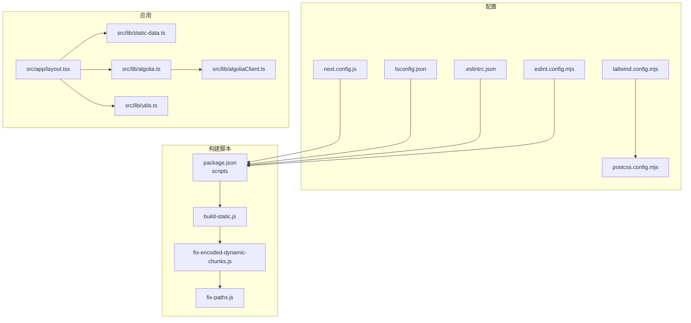
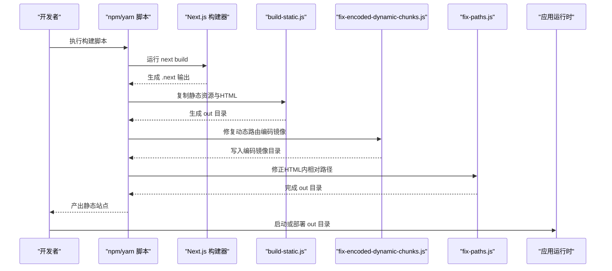
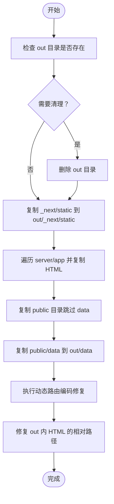
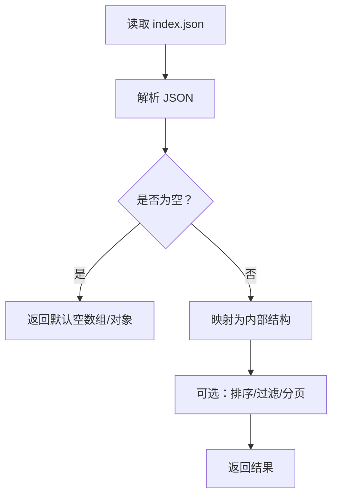
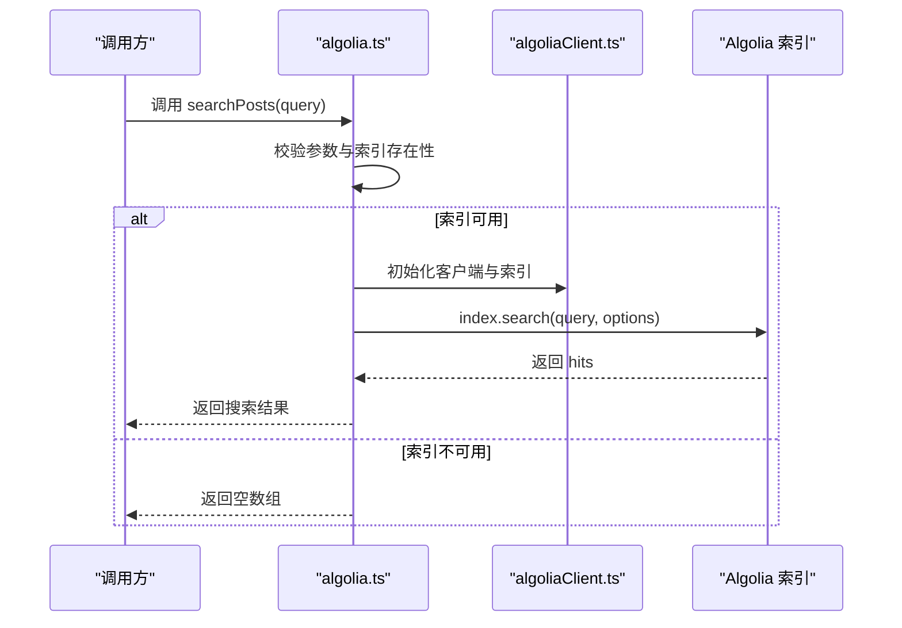
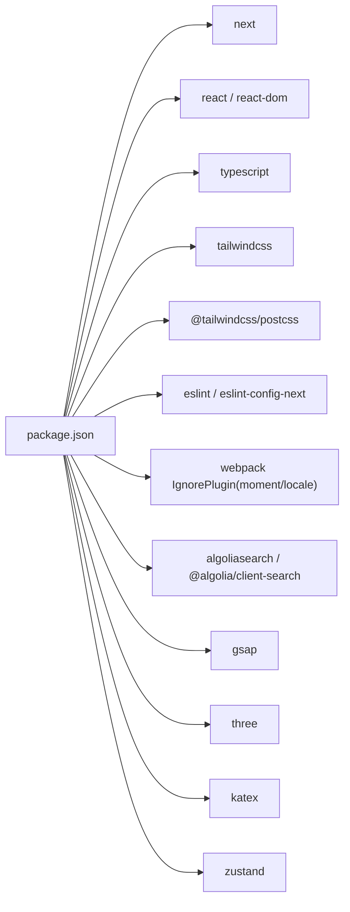

# 故障排除

<cite>
**本文引用的文件**
- [package.json](file://blog-system2/frontend/package.json)
- [next.config.js](file://blog-system2/frontend/next.config.js)
- [tsconfig.json](file://blog-system2/frontend/tsconfig.json)
- [tailwind.config.mjs](file://blog-system2/frontend/tailwind.config.mjs)
- [postcss.config.mjs](file://blog-system2/frontend/postcss.config.mjs)
- [.eslintrc.json](file://blog-system2/frontend/.eslintrc.json)
- [eslint.config.mjs](file://blog-system2/frontend/eslint.config.mjs)
- [build-static.js](file://blog-system2/frontend/build-static.js)
- [fix-encoded-dynamic-chunks.js](file://blog-system2/frontend/fix-encoded-dynamic-chunks.js)
- [fix-paths.js](file://blog-system2/frontend/fix-paths.js)
- [src/app/layout.tsx](file://blog-system2/frontend/src/app/layout.tsx)
- [src/lib/static-data.ts](file://blog-system2/frontend/src/lib/static-data.ts)
- [src/lib/algolia.ts](file://blog-system2/frontend/src/lib/algolia.ts)
- [src/lib/algoliaClient.ts](file://blog-system2/frontend/src/lib/algoliaClient.ts)
- [src/lib/utils.ts](file://blog-system2/frontend/src/lib/utils.ts)
</cite>

## 目录
1. [简介](#简介)
2. [项目结构](#项目结构)
3. [核心组件](#核心组件)
4. [架构总览](#架构总览)
5. [详细组件分析](#详细组件分析)
6. [依赖关系分析](#依赖关系分析)
7. [性能考量](#性能考量)
8. [故障排除指南](#故障排除指南)
9. [结论](#结论)
10. [附录](#附录)

## 简介
本指南面向开发者与运维人员，聚焦于技术博客平台在开发与生产环境中的常见问题与系统化排查路径。内容覆盖构建错误（依赖冲突、配置错误、编译失败）、性能问题（Bundle大小、渲染性能、内存泄漏）、浏览器兼容性、网络请求与第三方服务异常、开发/生产差异、日志与错误追踪、版本升级与迁移、以及紧急恢复与降级策略。文档以仓库现有配置与脚本为依据，结合代码级流程图与依赖图，帮助快速定位与解决问题。

## 项目结构
前端采用 Next.js 应用，使用 TypeScript、TailwindCSS 4 与 PostCSS 插件链，静态导出模式配合自定义构建脚本生成可部署产物。关键目录与文件职责概览：
- 配置层：next.config.js、tsconfig.json、tailwind.config.mjs、postcss.config.mjs、.eslintrc.json、eslint.config.mjs
- 构建与导出：package.json 中的 scripts 脚本，配合 build-static.js、fix-encoded-dynamic-chunks.js、fix-paths.js
- 应用层：src/app/layout.tsx 根布局；src/lib 下的数据与搜索逻辑
- 内容数据：public/data 下的 posts/notices/resources 索引与资源

图表来源
- [next.config.js:1-48](file://blog-system2/frontend/next.config.js#L1-L48)
- [tsconfig.json:1-42](file://blog-system2/frontend/tsconfig.json#L1-L42)
- [tailwind.config.mjs:1-18](file://blog-system2/frontend/tailwind.config.mjs#L1-L18)
- [postcss.config.mjs:1-6](file://blog-system2/frontend/postcss.config.mjs#L1-L6)
- [.eslintrc.json:1-12](file://blog-system2/frontend/.eslintrc.json#L1-L12)
- [eslint.config.mjs:1-17](file://blog-system2/frontend/eslint.config.mjs#L1-L17)
- [package.json:1-72](file://blog-system2/frontend/package.json#L1-L72)
- [build-static.js:1-141](file://blog-system2/frontend/build-static.js#L1-L141)
- [fix-encoded-dynamic-chunks.js:1-73](file://blog-system2/frontend/fix-encoded-dynamic-chunks.js#L1-L73)
- [fix-paths.js:1-53](file://blog-system2/frontend/fix-paths.js#L1-L53)
- [src/app/layout.tsx:1-48](file://blog-system2/frontend/src/app/layout.tsx#L1-L48)
- [src/lib/static-data.ts:1-214](file://blog-system2/frontend/src/lib/static-data.ts#L1-L214)
- [src/lib/algolia.ts:1-46](file://blog-system2/frontend/src/lib/algolia.ts#L1-L46)
- [src/lib/algoliaClient.ts:1-33](file://blog-system2/frontend/src/lib/algoliaClient.ts#L1-L33)
- [src/lib/utils.ts:1-7](file://blog-system2/frontend/src/lib/utils.ts#L1-L7)

章节来源
- [package.json:1-72](file://blog-system2/frontend/package.json#L1-L72)
- [next.config.js:1-48](file://blog-system2/frontend/next.config.js#L1-L48)
- [tsconfig.json:1-42](file://blog-system2/frontend/tsconfig.json#L1-L42)
- [tailwind.config.mjs:1-18](file://blog-system2/frontend/tailwind.config.mjs#L1-L18)
- [postcss.config.mjs:1-6](file://blog-system2/frontend/postcss.config.mjs#L1-L6)
- [.eslintrc.json:1-12](file://blog-system2/frontend/.eslintrc.json#L1-L12)
- [eslint.config.mjs:1-17](file://blog-system2/frontend/eslint.config.mjs#L1-L17)

## 核心组件
- 构建与导出流水线：通过 package.json 的 scripts 组合 next build 与自定义脚本，实现静态导出与路径修复。
- 静态数据读取：从 public/data 目录读取索引与内容，支持分页、排序与关联查询。
- 搜索能力：基于 Algolia 的客户端初始化与搜索封装，提供错误兜底返回空结果。
- 主题与样式：根布局设置 viewport、语言与字体变量，Tailwind 与 PostCSS 提供样式管线。
- 类名合并工具：cn 工具函数用于安全合并 Tailwind 类。

章节来源
- [package.json:5-11](file://blog-system2/frontend/package.json#L5-L11)
- [build-static.js:33-87](file://blog-system2/frontend/build-static.js#L33-L87)
- [fix-encoded-dynamic-chunks.js:39-73](file://blog-system2/frontend/fix-encoded-dynamic-chunks.js#L39-L73)
- [fix-paths.js:6-34](file://blog-system2/frontend/fix-paths.js#L6-L34)
- [src/lib/static-data.ts:32-73](file://blog-system2/frontend/src/lib/static-data.ts#L32-L73)
- [src/lib/algolia.ts:28-45](file://blog-system2/frontend/src/lib/algolia.ts#L28-L45)
- [src/app/layout.tsx:21-26](file://blog-system2/frontend/src/app/layout.tsx#L21-L26)
- [tailwind.config.mjs:4-15](file://blog-system2/frontend/tailwind.config.mjs#L4-L15)
- [postcss.config.mjs:1-6](file://blog-system2/frontend/postcss.config.mjs#L1-L6)
- [src/lib/utils.ts:4-6](file://blog-system2/frontend/src/lib/utils.ts#L4-L6)

## 架构总览
下图展示了从构建到运行的关键路径与交互：

图表来源
- [package.json:5-11](file://blog-system2/frontend/package.json#L5-L11)
- [build-static.js:33-87](file://blog-system2/frontend/build-static.js#L33-L87)
- [fix-encoded-dynamic-chunks.js:39-73](file://blog-system2/frontend/fix-encoded-dynamic-chunks.js#L39-L73)
- [fix-paths.js:36-52](file://blog-system2/frontend/fix-paths.js#L36-L52)

## 详细组件分析

### 构建与导出流水线
- 动态路由编码修复：扫描 out/_next/static/chunks/app 下的动态段目录，为其创建编码后的镜像目录，避免 GitHub Pages 等托管环境下路径解析问题。
- HTML 路径修复：遍历 out 目录，将绝对路径前缀替换为相对路径，保证多层级目录下的静态链接正确。
- 静态站点复制：将 .next/static、server/app 生成的 HTML、public 目录（除 data）复制到 out，形成可直接部署的静态站点。

图表来源
- [build-static.js:33-87](file://blog-system2/frontend/build-static.js#L33-L87)
- [fix-encoded-dynamic-chunks.js:39-73](file://blog-system2/frontend/fix-encoded-dynamic-chunks.js#L39-L73)
- [fix-paths.js:36-52](file://blog-system2/frontend/fix-paths.js#L36-L52)

章节来源
- [build-static.js:10-31](file://blog-system2/frontend/build-static.js#L10-L31)
- [build-static.js:89-138](file://blog-system2/frontend/build-static.js#L89-L138)
- [fix-encoded-dynamic-chunks.js:13-29](file://blog-system2/frontend/fix-encoded-dynamic-chunks.js#L13-L29)
- [fix-paths.js:6-34](file://blog-system2/frontend/fix-paths.js#L6-L34)

### 静态数据与内容索引
- 数据模型：文章、通知、资源等均通过 JSON 索引文件加载，提供分页、排序、过滤与关联查询能力。
- 关键流程：读取 index.json -> 解析 -> 转换为内部结构 -> 返回分页结果或单条记录。

图表来源
- [src/lib/static-data.ts:32-73](file://blog-system2/frontend/src/lib/static-data.ts#L32-L73)
- [src/lib/static-data.ts:150-173](file://blog-system2/frontend/src/lib/static-data.ts#L150-L173)
- [src/lib/static-data.ts:208-213](file://blog-system2/frontend/src/lib/static-data.ts#L208-L213)

章节来源
- [src/lib/static-data.ts:32-73](file://blog-system2/frontend/src/lib/static-data.ts#L32-L73)
- [src/lib/static-data.ts:85-89](file://blog-system2/frontend/src/lib/static-data.ts#L85-L89)
- [src/lib/static-data.ts:164-173](file://blog-system2/frontend/src/lib/static-data.ts#L164-L173)
- [src/lib/static-data.ts:208-213](file://blog-system2/frontend/src/lib/static-data.ts#L208-L213)

### 搜索模块（Algolia）
- 客户端初始化：仅在浏览器侧可用时初始化 Algolia 客户端与索引。
- 搜索调用：对索引进行搜索，限制返回字段与数量，并在异常时记录错误并返回空列表。

图表来源
- [src/lib/algolia.ts:28-45](file://blog-system2/frontend/src/lib/algolia.ts#L28-L45)
- [src/lib/algoliaClient.ts:15-32](file://blog-system2/frontend/src/lib/algoliaClient.ts#L15-L32)

章节来源
- [src/lib/algolia.ts:1-46](file://blog-system2/frontend/src/lib/algolia.ts#L1-L46)
- [src/lib/algoliaClient.ts:1-33](file://blog-system2/frontend/src/lib/algoliaClient.ts#L1-L33)

### 根布局与主题
- 视口与语言：设置设备宽度、初始缩放与禁止缩放，语言为 zh-CN。
- 字体变量：注入 Geist Sans/Mono 的 CSS 变量，便于全局使用。
- 客户端布局：包裹子组件，提供水合与客户端行为。

章节来源
- [src/app/layout.tsx:8-26](file://blog-system2/frontend/src/app/layout.tsx#L8-L26)
- [src/app/layout.tsx:28-47](file://blog-system2/frontend/src/app/layout.tsx#L28-L47)

### 样式与工具
- Tailwind 配置：content 覆盖 app/pages/components，启用深色模式类选择器。
- PostCSS 插件：使用 @tailwindcss/postcss 插件链。
- 类名合并：cn 函数用于合并与去重类名，避免重复与冲突。

章节来源
- [tailwind.config.mjs:4-15](file://blog-system2/frontend/tailwind.config.mjs#L4-L15)
- [postcss.config.mjs:1-6](file://blog-system2/frontend/postcss.config.mjs#L1-L6)
- [src/lib/utils.ts:4-6](file://blog-system2/frontend/src/lib/utils.ts#L4-L6)

## 依赖关系分析
- 构建期依赖：Next.js、TypeScript、TailwindCSS、PostCSS、ESLint、Webpack 插件（忽略 moment 本地化）。
- 运行期依赖：React 生态、GSAP、Three.js、KaTeX、Algolia 客户端、Zustand 状态管理等。
- 开发期工具：Framer Motion、sharp、responsive-loader、url-loader 等。

图表来源
- [package.json:13-42](file://blog-system2/frontend/package.json#L13-L42)
- [package.json:50-70](file://blog-system2/frontend/package.json#L50-L70)
- [next.config.js:35-44](file://blog-system2/frontend/next.config.js#L35-L44)

章节来源
- [package.json:13-70](file://blog-system2/frontend/package.json#L13-L70)
- [next.config.js:35-44](file://blog-system2/frontend/next.config.js#L35-L44)

## 性能考量
- Bundle 大小分析
  - 使用 Next.js 内置分析报告或打包可视化工具，识别大体积依赖（如 Three.js、GSAP、KaTeX）。
  - 对 Moment.js 本地化进行忽略，减少包体（已在 Webpack 配置中通过 IgnorePlugin 实现）。
- 渲染性能监控
  - 在页面组件中引入性能标记与测量，关注首屏、交互延迟与帧率波动。
  - 对动画与 3D 场景使用节流与懒加载，避免主线程阻塞。
- 内存泄漏检测
  - 使用浏览器性能面板与内存快照，排查未释放的事件监听器、定时器与闭包引用。
  - 对 Zustand 状态订阅与副作用进行生命周期管理，确保卸载时清理。
- 图片与资源优化
  - 使用响应式图片与合适的尺寸集合，结合 sharp 与 responsive-loader 生成多规格资源。
  - Tailwind 的 formats 与缓存策略提升图片加载效率。

章节来源
- [next.config.js:35-44](file://blog-system2/frontend/next.config.js#L35-L44)
- [tailwind.config.mjs:4-15](file://blog-system2/frontend/tailwind.config.mjs#L4-L15)
- [postcss.config.mjs:1-6](file://blog-system2/frontend/postcss.config.mjs#L1-L6)

## 故障排除指南

### 一、构建错误
- 依赖冲突
  - 症状：安装阶段报错或运行时报模块解析失败。
  - 排查：核对 package.json 中 Next 版本与 eslint-config-next 是否匹配；确认 Tailwind 与 PostCSS 版本兼容。
  - 处理：锁定版本或升级到兼容组合；清理 node_modules 与锁文件后重装。
- 配置错误
  - 症状：构建失败或导出产物路径异常。
  - 排查：检查 next.config.js 的 output/export、basePath、assetPrefix、images.unoptimized 与 domains 设置；确认 GITHUB_PAGES 与 REPO_NAME 环境变量。
  - 处理：根据部署目标调整 basePath/assetPrefix；确保 images.domains 包含 CDN 域名。
- 编译失败
  - 症状：TypeScript 报错或 ESLint 忽略构建错误导致产物不一致。
  - 排查：查看 tsconfig.json 的严格模式与 bundler 解析；检查 .eslintrc.json 与 eslint.config.mjs 的规则集。
  - 处理：修复类型错误；在开发阶段开启严格校验，生产构建前先 lint 且修复问题。

章节来源
- [package.json:13-42](file://blog-system2/frontend/package.json#L13-L42)
- [package.json:50-70](file://blog-system2/frontend/package.json#L50-L70)
- [next.config.js:6-18](file://blog-system2/frontend/next.config.js#L6-L18)
- [next.config.js:20-33](file://blog-system2/frontend/next.config.js#L20-L33)
- [tsconfig.json:2-28](file://blog-system2/frontend/tsconfig.json#L2-L28)
- [.eslintrc.json:1-12](file://blog-system2/frontend/.eslintrc.json#L1-L12)
- [eslint.config.mjs:12-16](file://blog-system2/frontend/eslint.config.mjs#L12-L16)

### 二、静态导出与路径问题
- 动态路由编码缺失
  - 症状：GitHub Pages 等托管环境下动态路由访问 404。
  - 排查：确认 out/_next/static/chunks/app 下是否存在动态段的编码镜像目录。
  - 处理：执行动态路由编码修复脚本，确保已创建编码镜像。
- HTML 路径错误
  - 症状：多层级目录下资源 404 或导航链接失效。
  - 排查：检查 out 目录内 HTML 文件中的绝对路径前缀。
  - 处理：执行路径修复脚本，将绝对路径替换为相对路径前缀。

章节来源
- [fix-encoded-dynamic-chunks.js:39-73](file://blog-system2/frontend/fix-encoded-dynamic-chunks.js#L39-L73)
- [fix-paths.js:6-34](file://blog-system2/frontend/fix-paths.js#L6-L34)

### 三、性能问题
- Bundle 过大
  - 症状：首屏加载慢、交互延迟高。
  - 排查：分析依赖体积，识别大库（Three.js、GSAP、KaTeX）。
  - 处理：拆分路由、按需加载、使用动态导入；移除未使用依赖。
- 渲染卡顿
  - 症状：滚动抖动、动画掉帧。
  - 排查：使用性能面板观察主线程占用。
  - 处理：降低动画复杂度、使用 requestAnimationFrame 节流、避免强制同步布局。
- 内存泄漏
  - 症状：长时间使用后内存持续增长。
  - 排查：捕获内存快照，定位未释放的监听器与定时器。
  - 处理：在组件卸载时清理订阅与定时器；避免闭包持有长生命周期对象。

章节来源
- [package.json:13-42](file://blog-system2/frontend/package.json#L13-L42)
- [next.config.js:35-44](file://blog-system2/frontend/next.config.js#L35-L44)

### 四、浏览器兼容性
- 症状：部分旧版浏览器样式异常或功能不可用。
- 排查：确认目标浏览器范围与 polyfill 需求；检查 CSS 新特性与 JS 语法支持。
- 处理：引入必要 polyfill；使用 Autoprefixer 与 Tailwind 的兼容性配置；在 CI 中添加跨浏览器测试。

章节来源
- [tailwind.config.mjs:4-15](file://blog-system2/frontend/tailwind.config.mjs#L4-L15)
- [postcss.config.mjs:1-6](file://blog-system2/frontend/postcss.config.mjs#L1-L6)

### 五、网络请求与第三方服务
- 症状：搜索无结果或报错、CDN 资源加载失败。
- 排查：检查 Algolia 凭据与索引名称是否正确；确认 CDN 域名是否在 images.domains 中。
- 处理：在运行时对 Algolia 初始化失败进行降级处理（返回空结果），同时记录错误；确保 CDN 域名白名单完整。

章节来源
- [src/lib/algolia.ts:28-45](file://blog-system2/frontend/src/lib/algolia.ts#L28-L45)
- [src/lib/algoliaClient.ts:15-32](file://blog-system2/frontend/src/lib/algoliaClient.ts#L15-L32)
- [next.config.js:22-28](file://blog-system2/frontend/next.config.js#L22-L28)

### 六、开发与生产差异
- 症状：本地正常但生产异常；TypeScript/ESLint 忽略构建错误。
- 排查：对比 next.config.js 中 typescript.ignoreBuildErrors 与 eslint.ignoreDuringBuilds。
- 处理：在开发阶段保持严格校验；生产构建前确保 lint 与类型检查通过。

章节来源
- [next.config.js:12-18](file://blog-system2/frontend/next.config.js#L12-L18)

### 七、日志分析与错误追踪
- 日志输出：搜索模块在异常时会打印错误日志，便于定位问题。
- 错误追踪：建议接入 Vercel Analytics/SI（已在依赖中）以收集前端性能与错误信息。
- 建议：在 CI 中增加构建与测试步骤，统一错误输出格式，便于检索。

章节来源
- [src/lib/algolia.ts:42-44](file://blog-system2/frontend/src/lib/algolia.ts#L42-L44)
- [package.json:19-20](file://blog-system2/frontend/package.json#L19-L20)

### 八、版本升级与迁移
- Next.js 升级
  - 步骤：更新 next 与 eslint-config-next；检查实验性功能与弃用 API；验证静态导出与路由行为。
  - 验证：运行 build 与静态导出脚本，确保产物结构与路径修复正常。
- TypeScript 升级
  - 步骤：更新 typescript 与 @types/*；修复严格模式下的类型错误；检查 bundler 解析与路径别名。
- TailwindCSS 升级
  - 步骤：更新 tailwindcss 与 @tailwindcss/postcss；检查 content 路径与插件配置；运行构建验证样式。

章节来源
- [package.json:31](file://blog-system2/frontend/package.json#L31)
- [package.json:60](file://blog-system2/frontend/package.json#L60)
- [package.json:67](file://blog-system2/frontend/package.json#L67)
- [tsconfig.json:2-28](file://blog-system2/frontend/tsconfig.json#L2-L28)
- [tailwind.config.mjs:1-18](file://blog-system2/frontend/tailwind.config.mjs#L1-L18)
- [postcss.config.mjs:1-6](file://blog-system2/frontend/postcss.config.mjs#L1-L6)

### 九、紧急恢复与降级策略
- 降级方案
  - 搜索降级：当 Algolia 不可用时，返回空结果并提示用户稍后再试。
  - 资源降级：回退至本地资源或备用 CDN；确保 images.domains 包含回退域名。
- 快速恢复
  - 回滚：使用上一个稳定构建产物；检查最近一次变更的依赖与配置。
  - 临时修复：禁用大体积功能（如 3D 场景、复杂动画）以保障核心内容可访问。

章节来源
- [src/lib/algolia.ts:28-45](file://blog-system2/frontend/src/lib/algolia.ts#L28-L45)
- [next.config.js:22-28](file://blog-system2/frontend/next.config.js#L22-L28)

## 结论
本指南基于仓库现有配置与脚本，提供了从构建到运行的全链路故障排除路径。通过规范的构建脚本、严格的配置与日志追踪，可有效降低生产风险并加速问题定位。建议在团队内建立标准化的 CI/CD 与发布流程，持续监控性能与错误指标，确保平台稳定可靠。

## 附录
- 常用命令参考
  - 开发：运行 dev 脚本启动本地服务
  - 构建：运行 build 脚本生成 .next 并修复产物
  - 静态导出：运行 build:static 脚本生成 out 目录
  - GitHub Pages：运行 build:github 脚本并指定仓库名
- 关键配置清单
  - next.config.js：output/export、basePath/assetPrefix、images/domains、webpack IgnorePlugin
  - tsconfig.json：moduleResolution/bundler、paths、types
  - tailwind.config.mjs：content、darkMode
  - eslint：.eslintrc.json 与 eslint.config.mjs

章节来源
- [package.json:5-11](file://blog-system2/frontend/package.json#L5-L11)
- [next.config.js:6-18](file://blog-system2/frontend/next.config.js#L6-L18)
- [next.config.js:20-33](file://blog-system2/frontend/next.config.js#L20-L33)
- [tsconfig.json:21-28](file://blog-system2/frontend/tsconfig.json#L21-L28)
- [tailwind.config.mjs:5-10](file://blog-system2/frontend/tailwind.config.mjs#L5-L10)
- [.eslintrc.json:1-12](file://blog-system2/frontend/.eslintrc.json#L1-L12)
- [eslint.config.mjs:12-16](file://blog-system2/frontend/eslint.config.mjs#L12-L16)