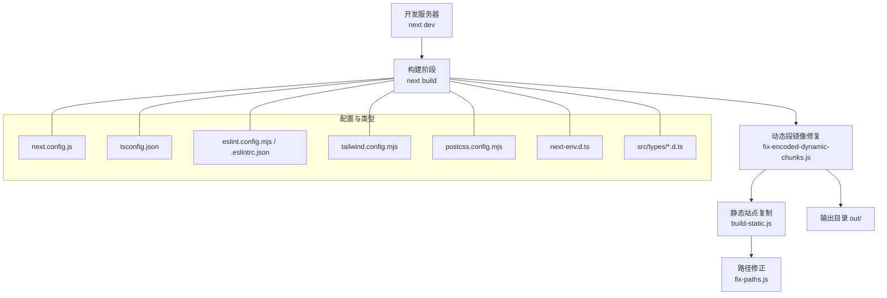
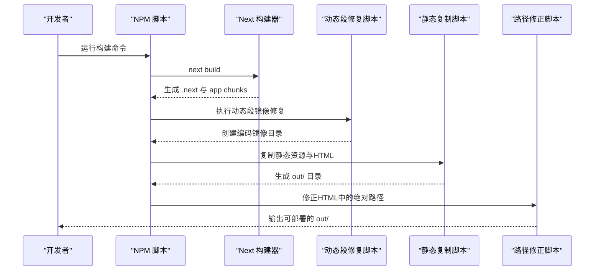
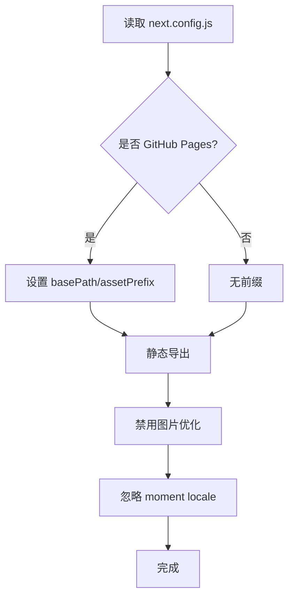
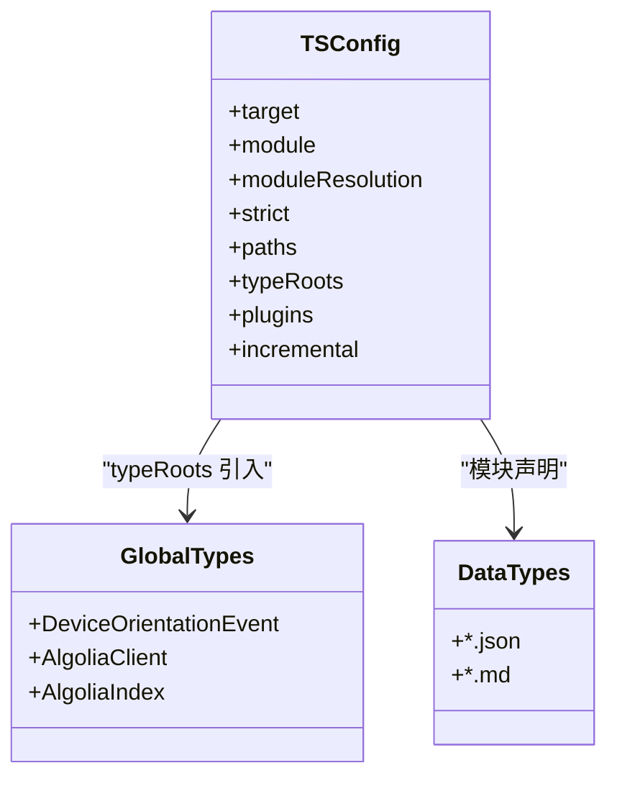
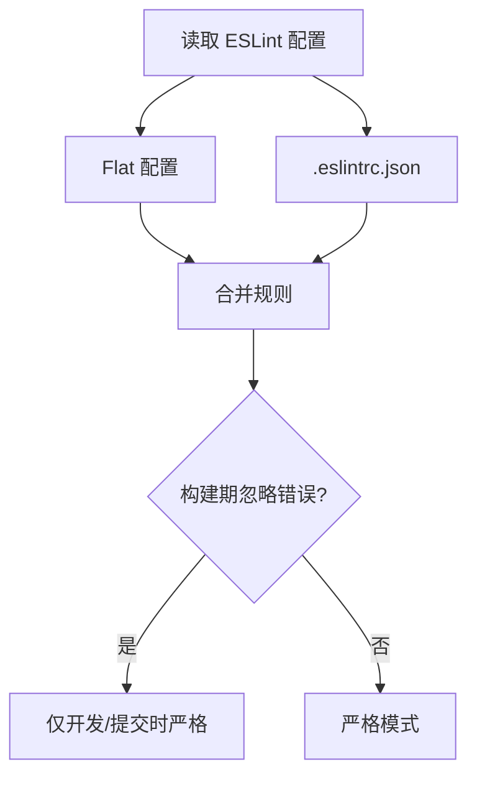
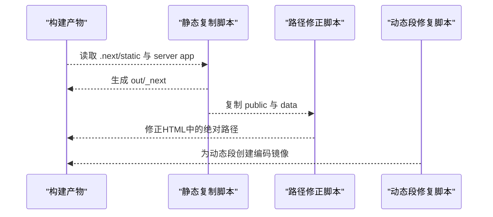
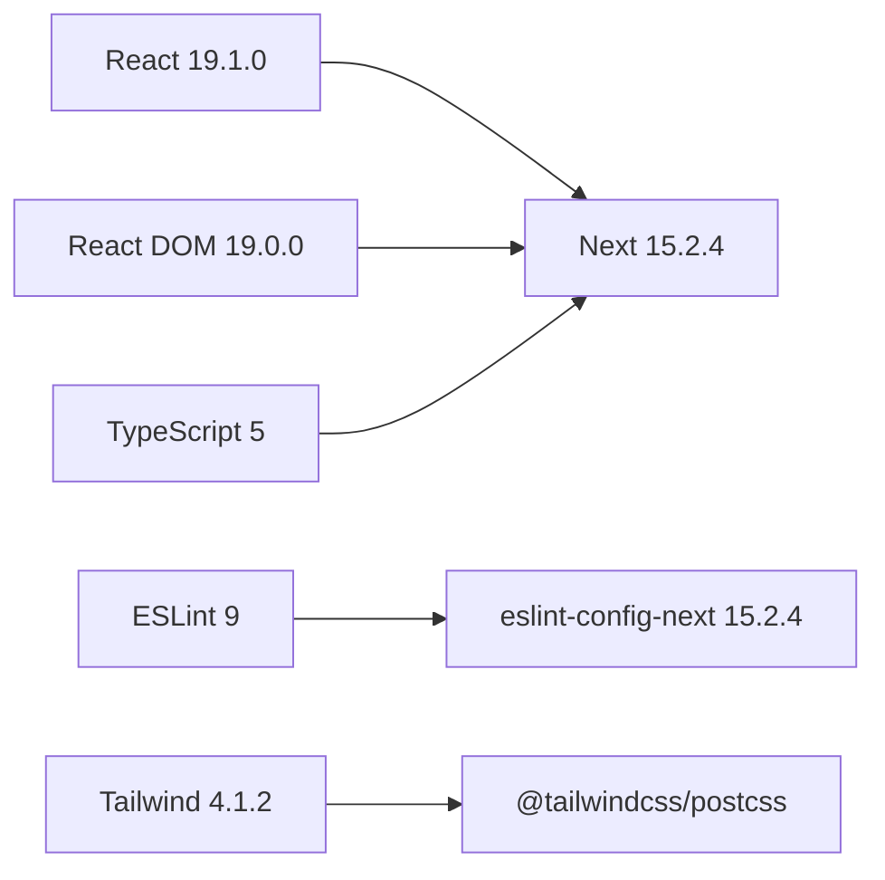

# 构建错误诊断

<cite>
**本文引用的文件**
- [package.json](file://blog-system2/frontend/package.json)
- [next.config.js](file://blog-system2/frontend/next.config.js)
- [tsconfig.json](file://blog-system2/frontend/tsconfig.json)
- [eslint.config.mjs](file://blog-system2/frontend/eslint.config.mjs)
- [.eslintrc.json](file://blog-system2/frontend/.eslintrc.json)
- [build-static.js](file://blog-system2/frontend/build-static.js)
- [fix-paths.js](file://blog-system2/frontend/fix-paths.js)
- [fix-encoded-dynamic-chunks.js](file://blog-system2/frontend/fix-encoded-dynamic-chunks.js)
- [tailwind.config.mjs](file://blog-system2/frontend/tailwind.config.mjs)
- [postcss.config.mjs](file://blog-system2/frontend/postcss.config.mjs)
- [next-env.d.ts](file://blog-system2/frontend/next-env.d.ts)
- [src/types/global.d.ts](file://blog-system2/frontend/src/types/global.d.ts)
- [src/types/data.d.ts](file://blog-system2/frontend/src/types/data.d.ts)
- [src/types/responsive-loader.d.ts](file://blog-system2/frontend/src/types/responsive-loader.d.ts)
</cite>

## 目录
1. [简介](#简介)
2. [项目结构](#项目结构)
3. [核心组件](#核心组件)
4. [架构总览](#架构总览)
5. [详细组件分析](#详细组件分析)
6. [依赖关系分析](#依赖关系分析)
7. [性能考量](#性能考量)
8. [故障排查指南](#故障排查指南)
9. [结论](#结论)
10. [附录](#附录)

## 简介
本指南聚焦于Next.js构建过程中的常见错误类型与系统化诊断修复流程，覆盖以下方面：
- TypeScript编译错误：严格模式、路径映射、类型声明与增量编译的常见陷阱
- Webpack打包错误：忽略插件、动态路由导出镜像、路径替换策略
- 依赖解析失败：包版本不一致、运行时缺失模块、图片优化与第三方库兼容
- 脚本命令执行顺序与失败原因：开发、构建、静态导出、GitHub Pages部署链路
- 配置检查清单：next.config.js、tsconfig.json、ESLint配置、Tailwind/PostCSS
- 依赖版本冲突与兼容性：React 19、Next.js 15、TypeScript 5、ESLint 9
- 静态导出相关错误：GitHub Pages部署失败、路径解析错误、动态段编码镜像
- 性能优化与内存不足：缓存、增量编译、资源裁剪与CI内存限制

## 项目结构
前端采用App Router结构，配合静态导出与自定义构建后处理脚本，形成“Next构建 → 动态段镜像修复 → 静态站点复制 → 路径修正”的流水线。

图表来源
- [next.config.js:1-48](file://blog-system2/frontend/next.config.js#L1-L48)
- [tsconfig.json:1-42](file://blog-system2/frontend/tsconfig.json#L1-L42)
- [eslint.config.mjs:1-17](file://blog-system2/frontend/eslint.config.mjs#L1-L17)
- [.eslintrc.json:1-12](file://blog-system2/frontend/.eslintrc.json#L1-L12)
- [tailwind.config.mjs:1-18](file://blog-system2/frontend/tailwind.config.mjs#L1-L18)
- [postcss.config.mjs:1-6](file://blog-system2/frontend/postcss.config.mjs#L1-L6)
- [next-env.d.ts:1-6](file://blog-system2/frontend/next-env.d.ts#L1-L6)
- [src/types/global.d.ts:1-52](file://blog-system2/frontend/src/types/global.d.ts#L1-L52)
- [src/types/data.d.ts:1-10](file://blog-system2/frontend/src/types/data.d.ts#L1-L10)
- [src/types/responsive-loader.d.ts:1-24](file://blog-system2/frontend/src/types/responsive-loader.d.ts#L1-L24)

章节来源
- [package.json:1-72](file://blog-system2/frontend/package.json#L1-L72)
- [next.config.js:1-48](file://blog-system2/frontend/next.config.js#L1-L48)
- [tsconfig.json:1-42](file://blog-system2/frontend/tsconfig.json#L1-L42)
- [eslint.config.mjs:1-17](file://blog-system2/frontend/eslint.config.mjs#L1-L17)
- [.eslintrc.json:1-12](file://blog-system2/frontend/.eslintrc.json#L1-L12)
- [tailwind.config.mjs:1-18](file://blog-system2/frontend/tailwind.config.mjs#L1-L18)
- [postcss.config.mjs:1-6](file://blog-system2/frontend/postcss.config.mjs#L1-L6)
- [next-env.d.ts:1-6](file://blog-system2/frontend/next-env.d.ts#L1-L6)
- [src/types/global.d.ts:1-52](file://blog-system2/frontend/src/types/global.d.ts#L1-L52)
- [src/types/data.d.ts:1-10](file://blog-system2/frontend/src/types/data.d.ts#L1-L10)
- [src/types/responsive-loader.d.ts:1-24](file://blog-system2/frontend/src/types/responsive-loader.d.ts#L1-L24)

## 核心组件
- 构建脚本与流水线
  - 开发：next dev
  - 构建：next build；随后执行动态段镜像修复脚本
  - 静态导出：在构建基础上追加静态站点复制与路径修正
  - GitHub Pages：通过环境变量开启静态导出与前缀设置
- 静态导出与路径修正
  - 输出模式为export，自动启用静态导出
  - 自动处理动态路由参数（[slug]）的编码镜像，避免运行时404
  - 对生成HTML中的/_next/与根路径进行相对化替换，适配子路径部署
- 配置与类型
  - Next.js配置：静态导出、路径前缀、图片优化、Webpack忽略插件
  - TypeScript：严格模式、路径别名、类型根目录、增量编译
  - ESLint：Flat配置与传统配置共存，忽略构建期错误以提升体验
  - Tailwind/PostCSS：内容扫描、暗色模式、插件启用

章节来源
- [package.json:5-12](file://blog-system2/frontend/package.json#L5-L12)
- [next.config.js:6-44](file://blog-system2/frontend/next.config.js#L6-L44)
- [tsconfig.json:20-28](file://blog-system2/frontend/tsconfig.json#L20-L28)
- [eslint.config.mjs:12-14](file://blog-system2/frontend/eslint.config.mjs#L12-L14)
- [.eslintrc.json:1-12](file://blog-system2/frontend/.eslintrc.json#L1-L12)
- [tailwind.config.mjs:4-15](file://blog-system2/frontend/tailwind.config.mjs#L4-L15)
- [postcss.config.mjs:1-6](file://blog-system2/frontend/postcss.config.mjs#L1-L6)

## 架构总览
下图展示从脚本到产物的端到端流程，以及关键配置对构建行为的影响。

图表来源
- [package.json:7-9](file://blog-system2/frontend/package.json#L7-L9)
- [fix-encoded-dynamic-chunks.js:39-73](file://blog-system2/frontend/fix-encoded-dynamic-chunks.js#L39-L73)
- [build-static.js:33-87](file://blog-system2/frontend/build-static.js#L33-L87)
- [fix-paths.js:6-34](file://blog-system2/frontend/fix-paths.js#L6-L34)

## 详细组件分析

### 组件A：脚本命令与执行顺序
- 命令概览
  - dev：本地开发
  - build：Next构建后执行动态段修复
  - build:static：构建 → 动态段修复 → 静态复制 → 路径修正 → 再次动态段修复
  - build:github：构建时设置GitHub Pages标志，随后静态复制与动态段修复
  - start：生产启动
  - lint：ESLint检查
- 常见失败原因
  - 环境变量未设置导致静态导出路径前缀异常
  - 脚本顺序错误导致out目录被提前清理或覆盖
  - 路径修正脚本未执行导致子路径部署时资源404
  - 动态段镜像缺失导致动态路由在静态导出后无法访问

```mermaid
flowchart TD
Start(["开始"]) --> Cmd{"选择命令"}
Cmd --> |dev| Dev["next dev"]
Cmd --> |build| B1["next build"] --> B2["动态段修复"]
Cmd --> |build:static| S1["next build"] --> S2["动态段修复"] --> S3["静态复制"] --> S4["路径修正"] --> S5["再次动态段修复"]
Cmd --> |build:github| G1["设置环境变量"] --> G2["next build"] --> G3["静态复制"] --> G4["动态段修复"]
B2 --> End(["结束"])
S2 --> End
S4 --> End
G4 --> End
Dev --> End
```

图表来源
- [package.json:5-12](file://blog-system2/frontend/package.json#L5-L12)
- [fix-encoded-dynamic-chunks.js:39-73](file://blog-system2/frontend/fix-encoded-dynamic-chunks.js#L39-L73)
- [build-static.js:33-87](file://blog-system2/frontend/build-static.js#L33-L87)
- [fix-paths.js:36-52](file://blog-system2/frontend/fix-paths.js#L36-L52)

章节来源
- [package.json:5-12](file://blog-system2/frontend/package.json#L5-L12)

### 组件B：Next配置与静态导出
- 关键点
  - output: export 启用静态导出
  - basePath/assetPrefix 在GitHub Pages场景下自动注入仓库名
  - trailingSlash: true 保证链接一致性
  - images.unoptimized: true 与静态导出配合，避免运行时图像重写
  - IgnorePlugin 忽略 moment 的 locale，减少体积
- 兼容性注意
  - React 19 + Next.js 15 需确保第三方库支持新的JSX运行时与模块解析
  - TypeScript 5 与Next内置类型需保持一致版本

图表来源
- [next.config.js:3-10](file://blog-system2/frontend/next.config.js#L3-L10)
- [next.config.js:20-33](file://blog-system2/frontend/next.config.js#L20-L33)
- [next.config.js:35-44](file://blog-system2/frontend/next.config.js#L35-L44)

章节来源
- [next.config.js:6-44](file://blog-system2/frontend/next.config.js#L6-L44)

### 组件C：TypeScript配置与类型声明
- 关键点
  - strict: true 提升类型安全
  - moduleResolution: bundler 与Next集成更佳
  - paths: "@/*" 映射至 src
  - typeRoots 包含自定义类型目录
  - isolatedModules 与incremental 保障增量编译
  - plugins: ["next"] 支持Next App Router类型
- 常见问题
  - 类型声明遗漏导致编译报错（如全局扩展、JSON/Markdown模块）
  - 路径别名未生效导致导入失败
  - 类型根目录未包含自定义声明导致IDE/TS服务找不到类型

图表来源
- [tsconfig.json:2-29](file://blog-system2/frontend/tsconfig.json#L2-L29)
- [src/types/global.d.ts:14-36](file://blog-system2/frontend/src/types/global.d.ts#L14-L36)
- [src/types/data.d.ts:1-9](file://blog-system2/frontend/src/types/data.d.ts#L1-L9)

章节来源
- [tsconfig.json:1-42](file://blog-system2/frontend/tsconfig.json#L1-L42)
- [next-env.d.ts:1-6](file://blog-system2/frontend/next-env.d.ts#L1-L6)
- [src/types/global.d.ts:1-52](file://blog-system2/frontend/src/types/global.d.ts#L1-L52)
- [src/types/data.d.ts:1-10](file://blog-system2/frontend/src/types/data.d.ts#L1-L10)
- [src/types/responsive-loader.d.ts:1-24](file://blog-system2/frontend/src/types/responsive-loader.d.ts#L1-L24)

### 组件D：ESLint配置与规则
- 配置方式
  - Flat配置与传统配置并存，优先级与合并策略需明确
  - 忽略构建期错误，仅在开发/提交时进行严格检查
- 常见规则
  - no-img-element、react-hooks/exhaustive-deps、unused-vars等
  - 自定义忽略模式（如特定组件）

图表来源
- [eslint.config.mjs:12-14](file://blog-system2/frontend/eslint.config.mjs#L12-L14)
- [.eslintrc.json:1-12](file://blog-system2/frontend/.eslintrc.json#L1-L12)

章节来源
- [eslint.config.mjs:1-17](file://blog-system2/frontend/eslint.config.mjs#L1-L17)
- [.eslintrc.json:1-12](file://blog-system2/frontend/.eslintrc.json#L1-L12)

### 组件E：静态导出与路径修正
- 流程
  - 复制 .next/static 与 server app目录到 out/_next
  - 复制 public 下非 data 目录内容
  - 将动态路由HTML重写为带 index.html 的目录结构
  - 修正HTML中的/_next/与根路径为相对路径，适配子路径部署
- 动态段镜像
  - 针对 [slug] 等动态段创建编码后的镜像目录，避免运行时解码失败

图表来源
- [build-static.js:33-87](file://blog-system2/frontend/build-static.js#L33-L87)
- [fix-paths.js:6-34](file://blog-system2/frontend/fix-paths.js#L6-L34)
- [fix-encoded-dynamic-chunks.js:39-73](file://blog-system2/frontend/fix-encoded-dynamic-chunks.js#L39-L73)

章节来源
- [build-static.js:1-141](file://blog-system2/frontend/build-static.js#L1-L141)
- [fix-paths.js:1-53](file://blog-system2/frontend/fix-paths.js#L1-L53)
- [fix-encoded-dynamic-chunks.js:1-73](file://blog-system2/frontend/fix-encoded-dynamic-chunks.js#L1-L73)

### 组件F：Tailwind/PostCSS配置
- 内容扫描范围覆盖 app、pages、components
- 启用暗色模式与Typography插件
- PostCSS加载Tailwind插件

章节来源
- [tailwind.config.mjs:4-15](file://blog-system2/frontend/tailwind.config.mjs#L4-L15)
- [postcss.config.mjs:1-6](file://blog-system2/frontend/postcss.config.mjs#L1-L6)

## 依赖关系分析
- 版本矩阵与兼容性
  - Next.js 15.2.4、React 19.1.0、React DOM 19.0.0、TypeScript 5
  - ESLint 9、eslint-config-next 15.2.4
  - Tailwind CSS 4.1.2、PostCSS插件
- 常见冲突点
  - React 19 与第三方库的JSX运行时差异
  - Next 15 与旧版Webpack插件/Loader的兼容
  - TypeScript 5 与类型声明的模块解析变化

图表来源
- [package.json:31-42](file://blog-system2/frontend/package.json#L31-L42)
- [package.json:60-61](file://blog-system2/frontend/package.json#L60-L61)

章节来源
- [package.json:13-70](file://blog-system2/frontend/package.json#L13-L70)

## 性能考量
- 编译与缓存
  - 启用增量编译与隔离模块，缩短二次构建时间
  - 严格模式提升早期错误发现，但可能增加编译时间
- 资源与体积
  - 图片优化在静态导出时禁用，减少运行时开销
  - 忽略moment/locale，降低包体
- CI/CD与内存
  - 在CI中合理设置Node内存上限，避免构建超时
  - 并行任务拆分，避免单点瓶颈

## 故障排查指南

### TypeScript编译错误
- 症状
  - 严格模式下属性未定义、函数返回值类型不匹配
  - 路径别名解析失败、类型声明未找到
- 排查步骤
  - 检查 tsconfig.json 的 paths 与 typeRoots 是否正确
  - 确认自定义类型声明文件已纳入 include 或显式引入
  - 若为增量构建问题，尝试清理 .next/types 或重启语言服务
- 修复建议
  - 补充缺失的类型声明（如全局事件、第三方模块）
  - 将路径别名统一为相对路径或调整 tsconfig 的 baseUrl/paths

章节来源
- [tsconfig.json:20-29](file://blog-system2/frontend/tsconfig.json#L20-L29)
- [src/types/global.d.ts:14-36](file://blog-system2/frontend/src/types/global.d.ts#L14-L36)
- [src/types/data.d.ts:1-9](file://blog-system2/frontend/src/types/data.d.ts#L1-L9)

### Webpack打包错误
- 症状
  - moment/locale 未找到、第三方库缺少运行时
  - 动态路由导出后页面404
- 排查步骤
  - 检查 next.config.js 中的 IgnorePlugin 是否正确忽略目标模块
  - 确认动态段修复脚本已执行且生成了编码镜像目录
- 修复建议
  - 为moment/locale添加IgnorePlugin或在业务代码中按需引入
  - 确保构建后流水线完整执行，避免遗漏动态段修复

章节来源
- [next.config.js:35-44](file://blog-system2/frontend/next.config.js#L35-L44)
- [fix-encoded-dynamic-chunks.js:39-73](file://blog-system2/frontend/fix-encoded-dynamic-chunks.js#L39-L73)

### 依赖解析失败
- 症状
  - import 报错、模块解析失败、类型提示丢失
- 排查步骤
  - 检查 package.json 依赖版本是否与Next/TS/ESLint版本兼容
  - 确认 node_modules 完整且未被CI缓存污染
- 修复建议
  - 使用锁定文件重新安装依赖
  - 升级到兼容版本组合（如Next 15 + React 19 + TS 5）

章节来源
- [package.json:13-70](file://blog-system2/frontend/package.json#L13-L70)

### 脚本命令执行顺序与失败原因
- 症状
  - 静态导出后资源404、路径前缀错误
  - out目录被意外清理或覆盖
- 排查步骤
  - 检查环境变量（REPO_NAME、GITHUB_PAGES）是否正确传递
  - 确认脚本顺序：先构建，再动态段修复，再静态复制，最后路径修正
- 修复建议
  - 在CI中显式设置环境变量
  - 将路径修正放在静态复制之后，确保out目录稳定

章节来源
- [package.json:7-9](file://blog-system2/frontend/package.json#L7-L9)
- [fix-paths.js:36-52](file://blog-system2/frontend/fix-paths.js#L36-L52)

### 静态导出相关错误
- GitHub Pages部署失败
  - basePath/assetPrefix 未设置或与仓库名不一致
  - 未执行静态复制与路径修正
- 路径解析错误
  - HTML中仍存在绝对路径前缀
  - 子路径部署时相对路径计算错误
- 动态段编码镜像缺失
  - [slug] 等动态路由导出后无法访问
- 修复建议
  - 设置 GITHUB_PAGES=true 与 REPO_NAME
  - 确保流水线包含静态复制与路径修正
  - 验证 out 目录结构与HTML中的路径

章节来源
- [next.config.js:3-10](file://blog-system2/frontend/next.config.js#L3-L10)
- [build-static.js:33-87](file://blog-system2/frontend/build-static.js#L33-L87)
- [fix-paths.js:6-34](file://blog-system2/frontend/fix-paths.js#L6-L34)
- [fix-encoded-dynamic-chunks.js:39-73](file://blog-system2/frontend/fix-encoded-dynamic-chunks.js#L39-L73)

### 构建性能问题与内存不足
- 建议
  - 启用增量编译与隔离模块
  - 清理不必要的图片与字体，或使用静态导出时禁用图片优化
  - 在CI中设置更高内存上限（如Node --max_old_space_size）
  - 分离大任务（如静态复制）为独立作业

## 结论
本指南提供了从配置、脚本到静态导出与路径修正的全链路诊断与修复方法。遵循本文的检查清单与流程，可显著降低Next.js构建与部署过程中的错误率，并提升整体稳定性与性能。

## 附录

### 构建配置检查清单
- Next.js
  - output: export 已启用
  - basePath/assetPrefix 与部署环境一致
  - images.unoptimized 与静态导出配合
  - IgnorePlugin 正确忽略第三方模块
- TypeScript
  - strict: true 与 paths/typeRoots 配置正确
  - plugins: ["next"] 已启用
  - include/exclude 覆盖所有源文件
- ESLint
  - Flat与传统配置合并策略清晰
  - 构建期忽略错误，开发期严格
- Tailwind/PostCSS
  - content 扫描范围覆盖 app/pages/components
  - 插件启用与版本匹配

章节来源
- [next.config.js:6-44](file://blog-system2/frontend/next.config.js#L6-L44)
- [tsconfig.json:20-29](file://blog-system2/frontend/tsconfig.json#L20-L29)
- [eslint.config.mjs:12-14](file://blog-system2/frontend/eslint.config.mjs#L12-L14)
- [.eslintrc.json:1-12](file://blog-system2/frontend/.eslintrc.json#L1-L12)
- [tailwind.config.mjs:4-15](file://blog-system2/frontend/tailwind.config.mjs#L4-L15)
- [postcss.config.mjs:1-6](file://blog-system2/frontend/postcss.config.mjs#L1-L6)