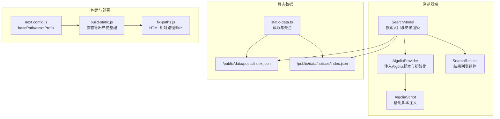
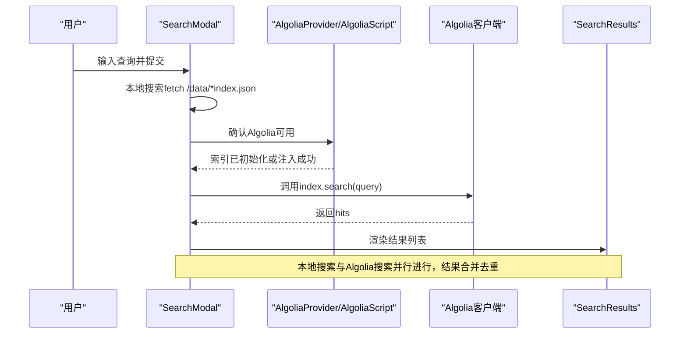
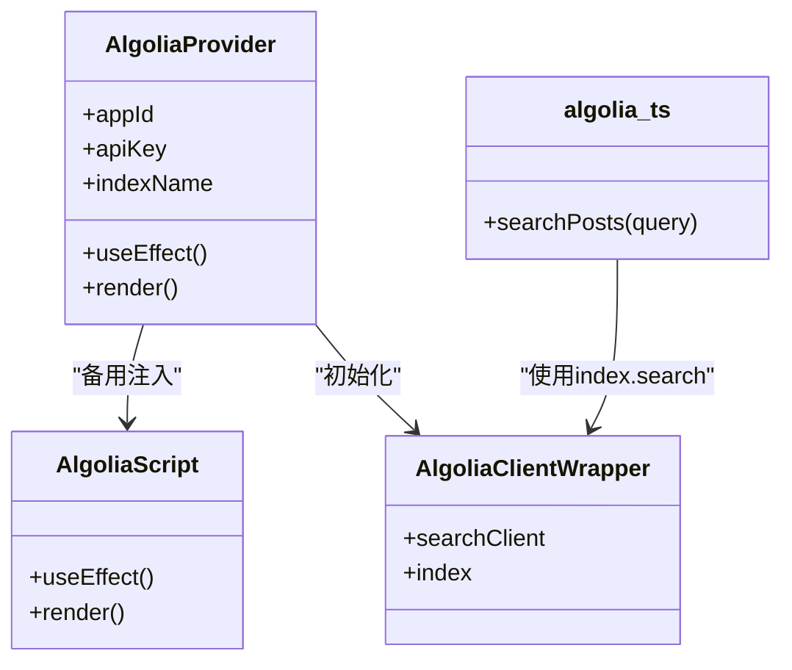
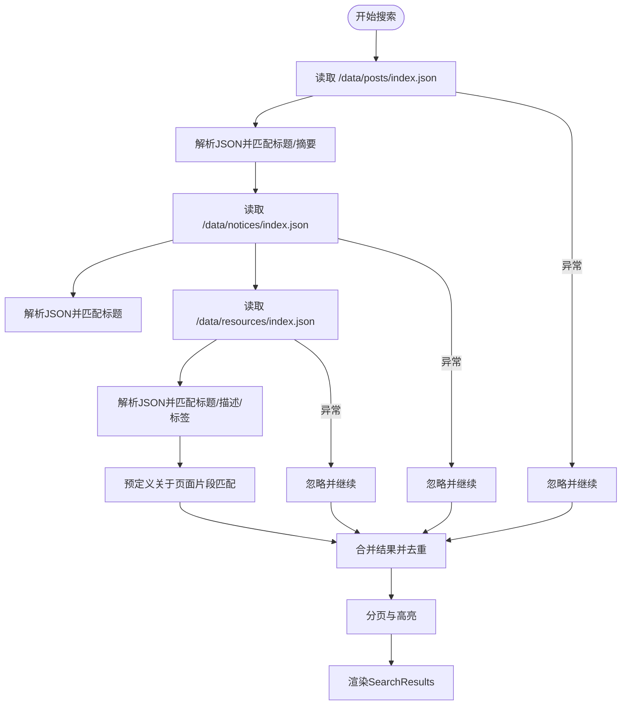
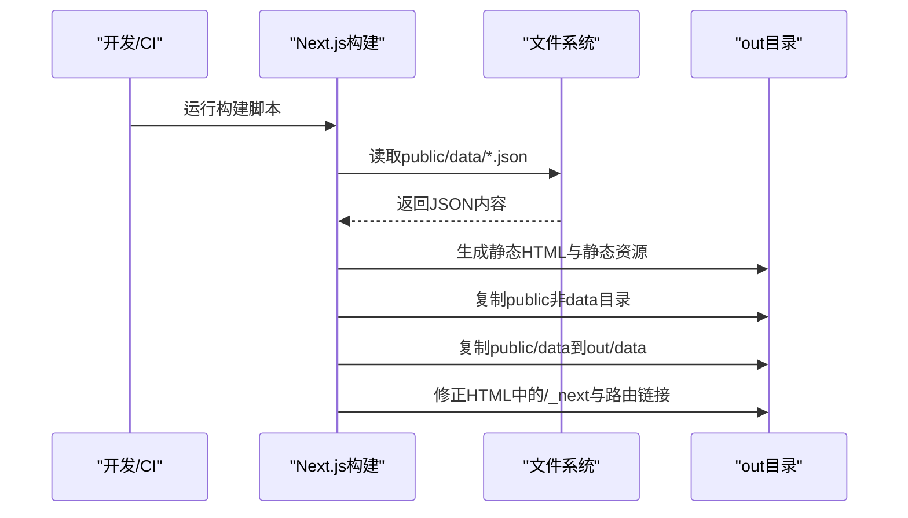
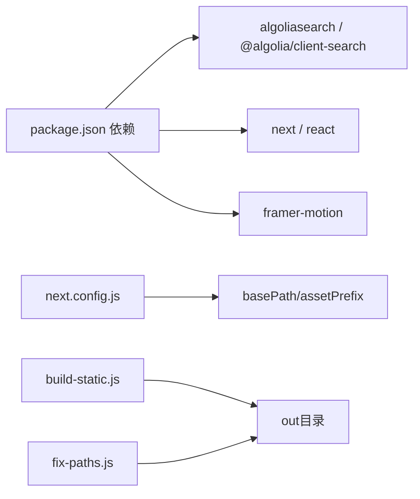

# 网络和API问题

<cite>
**本文引用的文件**
- [algolia.ts](file://blog-system2/frontend/src/lib/algolia.ts)
- [algoliaClient.ts](file://blog-system2/frontend/src/lib/algoliaClient.ts)
- [AlgoliaProvider.tsx](file://blog-system2/frontend/src/components/Search/AlgoliaProvider.tsx)
- [AlgoliaScript.tsx](file://blog-system2/frontend/src/components/Search/AlgoliaScript.tsx)
- [SearchModal.tsx](file://blog-system2/frontend/src/components/Search/SearchModal.tsx)
- [SearchResults.tsx](file://blog-system2/frontend/src/components/Search/SearchResults.tsx)
- [static-data.ts](file://blog-system2/frontend/src/lib/static-data.ts)
- [index.json（文章）](file://blog-system2/frontend/public/data/posts/index.json)
- [index.json（通知）](file://blog-system2/frontend/public/data/notices/index.json)
- [package.json](file://blog-system2/frontend/package.json)
- [next.config.js](file://blog-system2/frontend/next.config.js)
- [build-static.js](file://blog-system2/frontend/build-static.js)
- [fix-paths.js](file://blog-system2/frontend/fix-paths.js)
- [layout.tsx](file://blog-system2/frontend/src/app/layout.tsx)
- [global.d.ts](file://blog-system2/frontend/src/types/global.d.ts)
</cite>

## 目录
1. [简介](#简介)
2. [项目结构](#项目结构)
3. [核心组件](#核心组件)
4. [架构总览](#架构总览)
5. [详细组件分析](#详细组件分析)
6. [依赖关系分析](#依赖关系分析)
7. [性能考量](#性能考量)
8. [故障排查指南](#故障排查指南)
9. [结论](#结论)
10. [附录](#附录)

## 简介
本指南聚焦于该前端项目在“网络请求与API调用”方面的常见问题与解决方案，覆盖以下主题：
- Algolia搜索API的常见错误类型与定位方法（API密钥配置、索引权限、请求超时等）
- 静态数据加载失败的根因与修复（JSON格式、路径配置、CORS等）
- 浏览器端网络调试技巧（开发者工具、网络面板、请求拦截与响应监控）
- 第三方服务集成问题排查（GitHub Pages部署、CDN资源加载）
- API限流与配额处理策略、错误重试与降级机制
- 离线状态与缓存策略最佳实践

## 项目结构
该项目采用Next.js应用，前端静态资源位于public/data下，Algolia搜索通过客户端脚本注入与Provider封装，搜索逻辑在SearchModal中实现，静态数据通过static-data.ts统一读取。

图表来源
- [AlgoliaProvider.tsx:22-99](file://blog-system2/frontend/src/components/Search/AlgoliaProvider.tsx#L22-L99)
- [AlgoliaScript.tsx:22-98](file://blog-system2/frontend/src/components/Search/AlgoliaScript.tsx#L22-L98)
- [SearchModal.tsx:301-428](file://blog-system2/frontend/src/components/Search/SearchModal.tsx#L301-L428)
- [static-data.ts:32-43](file://blog-system2/frontend/src/lib/static-data.ts#L32-L43)
- [next.config.js:3-10](file://blog-system2/frontend/next.config.js#L3-L10)
- [build-static.js:33-87](file://blog-system2/frontend/build-static.js#L33-L87)
- [fix-paths.js:6-34](file://blog-system2/frontend/fix-paths.js#L6-L34)

章节来源
- [layout.tsx:28-47](file://blog-system2/frontend/src/app/layout.tsx#L28-L47)
- [next.config.js:3-10](file://blog-system2/frontend/next.config.js#L3-L10)

## 核心组件
- Algolia客户端封装与搜索函数
  - 客户端创建与索引初始化：[algoliaClient.ts:15-32](file://blog-system2/frontend/src/lib/algoliaClient.ts#L15-L32)
  - 搜索入口与错误兜底：[algolia.ts:28-45](file://blog-system2/frontend/src/lib/algolia.ts#L28-L45)
- 搜索UI与数据源
  - Provider与脚本注入：[AlgoliaProvider.tsx:22-99](file://blog-system2/frontend/src/components/Search/AlgoliaProvider.tsx#L22-L99)、[AlgoliaScript.tsx:22-98](file://blog-system2/frontend/src/components/Search/AlgoliaScript.tsx#L22-L98)
  - 本地搜索与结果分页：[SearchModal.tsx:301-428](file://blog-system2/frontend/src/components/Search/SearchModal.tsx#L301-L428)
  - 结果渲染组件：[SearchResults.tsx:24-95](file://blog-system2/frontend/src/components/Search/SearchResults.tsx#L24-L95)
- 静态数据加载
  - 文章与通知索引读取与排序：[static-data.ts:32-43](file://blog-system2/frontend/src/lib/static-data.ts#L32-L43)、[static-data.ts:150-161](file://blog-system2/frontend/src/lib/static-data.ts#L150-L161)
  - 资源分类读取：[static-data.ts:208-213](file://blog-system2/frontend/src/lib/static-data.ts#L208-L213)
  - JSON示例：[index.json（文章）:1-103](file://blog-system2/frontend/public/data/posts/index.json#L1-L103)、[index.json（通知）:1-41](file://blog-system2/frontend/public/data/notices/index.json#L1-L41)

章节来源
- [algolia.ts:1-46](file://blog-system2/frontend/src/lib/algolia.ts#L1-L46)
- [algoliaClient.ts:1-33](file://blog-system2/frontend/src/lib/algoliaClient.ts#L1-L33)
- [AlgoliaProvider.tsx:1-100](file://blog-system2/frontend/src/components/Search/AlgoliaProvider.tsx#L1-L100)
- [AlgoliaScript.tsx:1-102](file://blog-system2/frontend/src/components/Search/AlgoliaScript.tsx#L1-L102)
- [SearchModal.tsx:301-428](file://blog-system2/frontend/src/components/Search/SearchModal.tsx#L301-L428)
- [SearchResults.tsx:1-96](file://blog-system2/frontend/src/components/Search/SearchResults.tsx#L1-L96)
- [static-data.ts:1-214](file://blog-system2/frontend/src/lib/static-data.ts#L1-L214)
- [index.json（文章）:1-103](file://blog-system2/frontend/public/data/posts/index.json#L1-L103)
- [index.json（通知）:1-41](file://blog-system2/frontend/public/data/notices/index.json#L1-L41)

## 架构总览
搜索流程由Provider注入Algolia脚本，SearchModal负责发起本地与远程搜索，并将结果交给SearchResults渲染；静态数据通过fetch从public/data读取。

图表来源
- [AlgoliaProvider.tsx:22-99](file://blog-system2/frontend/src/components/Search/AlgoliaProvider.tsx#L22-L99)
- [AlgoliaScript.tsx:22-98](file://blog-system2/frontend/src/components/Search/AlgoliaScript.tsx#L22-L98)
- [SearchModal.tsx:301-428](file://blog-system2/frontend/src/components/Search/SearchModal.tsx#L301-L428)
- [SearchResults.tsx:24-95](file://blog-system2/frontend/src/components/Search/SearchResults.tsx#L24-L95)

## 详细组件分析

### 组件A：Algolia搜索客户端与Provider
- 设计要点
  - 客户端封装：在浏览器端动态创建Algolia客户端并初始化索引，避免SSR环境下的window不存在问题。
  - Provider与脚本注入：通过Next.js Script与备用脚本组件确保Algolia库加载与索引初始化。
  - 错误兜底：当Algolia不可用时返回空结果，保证UI稳定。
- 关键路径
  - 客户端创建与索引：[algoliaClient.ts:15-32](file://blog-system2/frontend/src/lib/algoliaClient.ts#L15-L32)
  - Provider注入与初始化检查：[AlgoliaProvider.tsx:22-99](file://blog-system2/frontend/src/components/Search/AlgoliaProvider.tsx#L22-L99)
  - 备用脚本注入与错误日志：[AlgoliaScript.tsx:22-98](file://blog-system2/frontend/src/components/Search/AlgoliaScript.tsx#L22-L98)
  - 搜索入口与异常捕获：[algolia.ts:28-45](file://blog-system2/frontend/src/lib/algolia.ts#L28-L45)

图表来源
- [algoliaClient.ts:1-33](file://blog-system2/frontend/src/lib/algoliaClient.ts#L1-L33)
- [AlgoliaProvider.tsx:1-100](file://blog-system2/frontend/src/components/Search/AlgoliaProvider.tsx#L1-L100)
- [AlgoliaScript.tsx:1-102](file://blog-system2/frontend/src/components/Search/AlgoliaScript.tsx#L1-L102)
- [algolia.ts:1-46](file://blog-system2/frontend/src/lib/algolia.ts#L1-L46)

章节来源
- [algoliaClient.ts:1-33](file://blog-system2/frontend/src/lib/algoliaClient.ts#L1-L33)
- [AlgoliaProvider.tsx:1-100](file://blog-system2/frontend/src/components/Search/AlgoliaProvider.tsx#L1-L100)
- [AlgoliaScript.tsx:1-102](file://blog-system2/frontend/src/components/Search/AlgoliaScript.tsx#L1-L102)
- [algolia.ts:1-46](file://blog-system2/frontend/src/lib/algolia.ts#L1-L46)

### 组件B：本地搜索与结果渲染
- 设计要点
  - 本地搜索：通过fetch读取public/data下的index.json，对文章、通知、资源进行关键词匹配与高亮。
  - 结果聚合：按objectID去重，支持分页与加载态显示。
  - 错误处理：任一数据源失败不影响其他数据源，最终失败时提示用户。
- 关键路径
  - 本地搜索与高亮：[SearchModal.tsx:301-428](file://blog-system2/frontend/src/components/Search/SearchModal.tsx#L301-L428)
  - 结果渲染组件：[SearchResults.tsx:24-95](file://blog-system2/frontend/src/components/Search/SearchResults.tsx#L24-L95)
  - 静态数据读取：[static-data.ts:32-43](file://blog-system2/frontend/src/lib/static-data.ts#L32-L43)

图表来源
- [SearchModal.tsx:301-428](file://blog-system2/frontend/src/components/Search/SearchModal.tsx#L301-L428)
- [SearchResults.tsx:24-95](file://blog-system2/frontend/src/components/Search/SearchResults.tsx#L24-L95)
- [static-data.ts:32-43](file://blog-system2/frontend/src/lib/static-data.ts#L32-L43)

章节来源
- [SearchModal.tsx:301-428](file://blog-system2/frontend/src/components/Search/SearchModal.tsx#L301-L428)
- [SearchResults.tsx:1-96](file://blog-system2/frontend/src/components/Search/SearchResults.tsx#L1-L96)
- [static-data.ts:1-214](file://blog-system2/frontend/src/lib/static-data.ts#L1-L214)

### 组件C：静态数据加载与路径配置
- 设计要点
  - 通过fs读取public/data下的JSON文件，解析为索引对象，供本地搜索与页面渲染使用。
  - next.config.js配置了basePath与assetPrefix，影响静态资源与HTML输出路径。
  - build-static.js与fix-paths.js负责静态导出后的文件复制与HTML路径修正。
- 关键路径
  - 文章索引读取：[static-data.ts:32-43](file://blog-system2/frontend/src/lib/static-data.ts#L32-L43)
  - 通知索引读取：[static-data.ts:150-161](file://blog-system2/frontend/src/lib/static-data.ts#L150-L161)
  - 资源索引读取：[static-data.ts:208-213](file://blog-system2/frontend/src/lib/static-data.ts#L208-L213)
  - 构建配置：[next.config.js:3-10](file://blog-system2/frontend/next.config.js#L3-L10)
  - 静态导出与路径修正：[build-static.js:33-87](file://blog-system2/frontend/build-static.js#L33-L87)、[fix-paths.js:6-34](file://blog-system2/frontend/fix-paths.js#L6-L34)

图表来源
- [static-data.ts:32-43](file://blog-system2/frontend/src/lib/static-data.ts#L32-L43)
- [next.config.js:3-10](file://blog-system2/frontend/next.config.js#L3-L10)
- [build-static.js:33-87](file://blog-system2/frontend/build-static.js#L33-L87)
- [fix-paths.js:6-34](file://blog-system2/frontend/fix-paths.js#L6-L34)

章节来源
- [static-data.ts:1-214](file://blog-system2/frontend/src/lib/static-data.ts#L1-L214)
- [next.config.js:1-47](file://blog-system2/frontend/next.config.js#L1-L47)
- [build-static.js:1-141](file://blog-system2/frontend/build-static.js#L1-L141)
- [fix-paths.js:1-53](file://blog-system2/frontend/fix-paths.js#L1-L53)

## 依赖关系分析
- 第三方库
  - Algolia SDK与客户端：algoliasearch、@algolia/client-search
  - 框架与动画：next、react、framer-motion
  - 工具与类型：@types/*、typescript
- 构建与部署
  - GitHub Pages支持：通过环境变量控制basePath与assetPrefix
  - 静态导出：输出目录out，路径修正脚本fix-paths.js

图表来源
- [package.json:13-42](file://blog-system2/frontend/package.json#L13-L42)
- [next.config.js:3-10](file://blog-system2/frontend/next.config.js#L3-L10)
- [build-static.js:33-87](file://blog-system2/frontend/build-static.js#L33-L87)
- [fix-paths.js:6-34](file://blog-system2/frontend/fix-paths.js#L6-L34)

章节来源
- [package.json:1-72](file://blog-system2/frontend/package.json#L1-L72)
- [next.config.js:1-47](file://blog-system2/frontend/next.config.js#L1-L47)

## 性能考量
- 搜索性能
  - 本地搜索：对JSON进行内存解析与字符串匹配，适合小中型数据集；建议控制每页结果数量与高亮范围。
  - Algolia搜索：利用云端索引与全文检索，适合大规模数据与复杂查询。
- 资源加载
  - 图片域名白名单与未优化图片设置，减少不必要的重绘与带宽消耗。
- 构建与导出
  - 静态导出后路径修正，避免/_next路径导致的二次请求与404风险。

## 故障排查指南

### 一、Algolia搜索API常见错误与处理
- API密钥配置错误
  - 现象：搜索无结果或报错，控制台出现Algolia初始化失败。
  - 排查要点：
    - 确认Provider与Script中appId、apiKey、indexName是否正确。
    - 检查Algolia库是否成功注入（window.algoliasearch是否存在）。
  - 修复建议：
    - 在Provider与Script中核对凭据；若使用NEXT_PUBLIC前缀，需在运行时替换为真实值。
    - 若Algolia未加载，检查CDN可访问性与跨域策略。
- 索引权限问题
  - 现象：index.search调用报权限错误或返回空结果。
  - 排查要点：
    - 确认apiKey具备search权限；检查索引名称与环境一致。
  - 修复建议：
    - 使用Search-only API Key；在Algolia后台确认索引可见性与权限。
- 请求超时与网络不稳定
  - 现象：搜索卡顿或超时。
  - 排查要点：
    - 检查网络面板，确认请求耗时与状态码。
  - 修复建议：
    - 增加重试与降级策略（见下节）。
- 服务器端渲染（SSR）问题
  - 现象：SSR环境下window不存在导致Algolia初始化失败。
  - 排查要点：
    - 确认algoliaClient.ts在浏览器端调用；Provider仅在客户端挂载。
  - 修复建议：
    - 保持客户端组件结构，避免在SSR阶段直接调用Algolia。

章节来源
- [algoliaClient.ts:15-32](file://blog-system2/frontend/src/lib/algoliaClient.ts#L15-L32)
- [AlgoliaProvider.tsx:22-99](file://blog-system2/frontend/src/components/Search/AlgoliaProvider.tsx#L22-L99)
- [AlgoliaScript.tsx:22-98](file://blog-system2/frontend/src/components/Search/AlgoliaScript.tsx#L22-L98)
- [algolia.ts:28-45](file://blog-system2/frontend/src/lib/algolia.ts#L28-L45)

### 二、静态数据加载失败
- JSON文件格式错误
  - 现象：解析失败、页面空白或报错。
  - 排查要点：
    - 使用在线JSON校验工具验证public/data/*.json格式。
  - 修复建议：
    - 修正字段缺失、拼写错误或非法字符。
- 路径配置问题
  - 现象：fetch /data/*index.json 404。
  - 排查要点：
    - 确认next.config.js的basePath/assetPrefix与部署路径一致。
    - 检查build-static.js是否将public/data复制到out/data。
  - 修复建议：
    - 在GitHub Pages场景下设置GITHUB_PAGES=true与REPO_NAME；确保静态导出产物包含data目录。
- CORS跨域限制
  - 现象：浏览器阻止跨域请求。
  - 排查要点：
    - 检查Network面板的CORS错误与预检请求。
  - 修复建议：
    - 将数据置于public目录并通过同源URL访问；避免跨域。

章节来源
- [static-data.ts:32-43](file://blog-system2/frontend/src/lib/static-data.ts#L32-L43)
- [index.json（文章）:1-103](file://blog-system2/frontend/public/data/posts/index.json#L1-L103)
- [index.json（通知）:1-41](file://blog-system2/frontend/public/data/notices/index.json#L1-L41)
- [next.config.js:3-10](file://blog-system2/frontend/next.config.js#L3-L10)
- [build-static.js:78-83](file://blog-system2/frontend/build-static.js#L78-L83)

### 三、浏览器端网络调试技巧
- 开发者工具
  - Network面板：观察请求URL、状态码、耗时、响应头（CORS、Content-Type）。
  - Console：查看Algolia初始化与错误日志。
  - Elements：检查HTML中/_next与路由链接是否被fix-paths.js修正。
- 请求拦截与响应监控
  - 使用Network面板的“Disable cache”与“Preserve log”选项，便于复现与对比。
  - 对fetch请求添加超时与重试逻辑（见下节）。

### 四、第三方服务集成问题
- GitHub Pages部署失败
  - 现象：页面空白、资源404。
  - 排查要点：
    - 确认环境变量GITHUB_PAGES=true与REPO_NAME设置正确。
    - 检查basePath与assetPrefix是否与仓库名一致。
  - 修复建议：
    - 在构建脚本中设置REPO_NAME；确保静态导出产物复制完整。
- CDN资源加载错误
  - 现象：Algolia脚本或图片无法加载。
  - 排查要点：
    - 检查CDN域名是否在images.domains中白名单。
  - 修复建议：
    - 将必要CDN域名加入domains；或改用同源资源。

章节来源
- [next.config.js:3-10](file://blog-system2/frontend/next.config.js#L3-L10)
- [build-static.js:33-87](file://blog-system2/frontend/build-static.js#L33-L87)
- [fix-paths.js:6-34](file://blog-system2/frontend/fix-paths.js#L6-L34)
- [AlgoliaScript.tsx:74-77](file://blog-system2/frontend/src/components/Search/AlgoliaScript.tsx#L74-L77)

### 五、API限流与配额、重试与降级
- 限流与配额
  - 建议：为Algolia搜索设置合理的并发与速率限制；对本地搜索设置最大匹配数与分页。
- 错误重试
  - 建议：在网络错误或超时时自动重试1-2次，并在UI显示“重试”按钮。
- 降级机制
  - 建议：Algolia失败时回退到本地搜索；本地搜索失败时返回空结果并提示用户稍后重试。

### 六、离线状态与缓存策略
- 缓存策略
  - 建议：对静态JSON与图片设置合理的Cache-Control；在客户端使用Memory缓存近期查询结果。
- 离线处理
  - 建议：检测navigator.onLine，离线时禁用Algolia搜索，仅使用本地搜索；提供“离线可用”的提示。

## 结论
本项目在搜索方面同时使用了Algolia与本地静态数据两种方案，既保证了高性能的全文检索，又确保了在CDN或网络异常时的可用性。通过Provider与脚本注入确保Algolia可用性，通过静态导出与路径修正保障部署一致性。建议在生产环境中进一步完善重试、降级与离线策略，并持续监控网络面板与错误日志以快速定位问题。

## 附录
- 相关类型声明
  - Algolia全局类型扩展：[global.d.ts:17-51](file://blog-system2/frontend/src/types/global.d.ts#L17-L51)