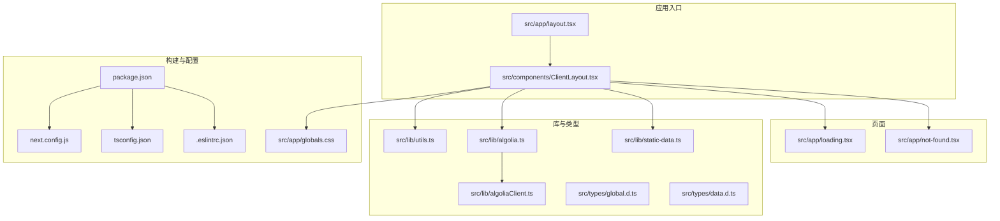
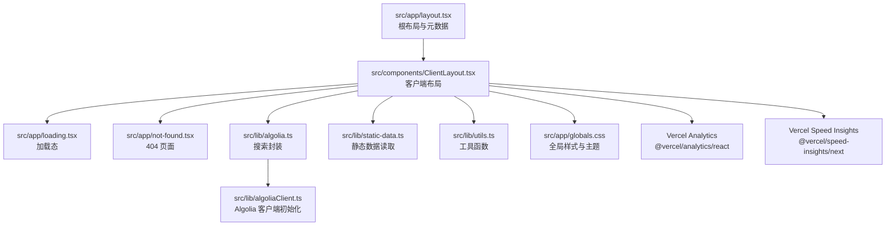
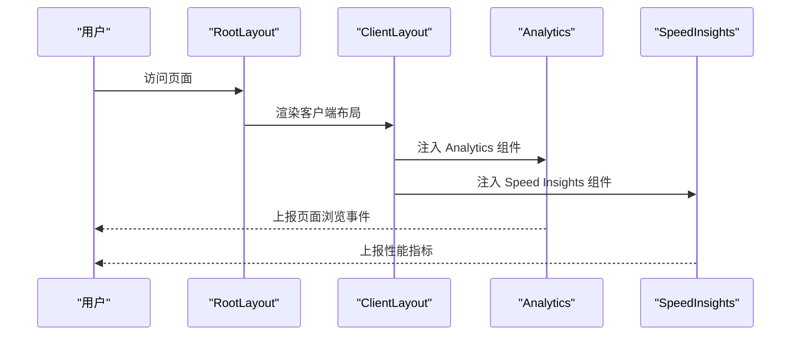
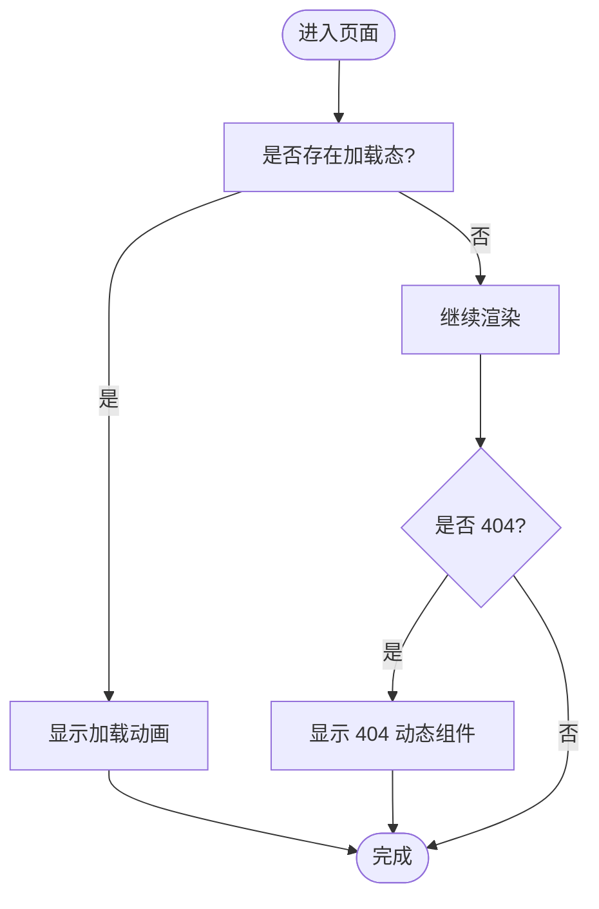
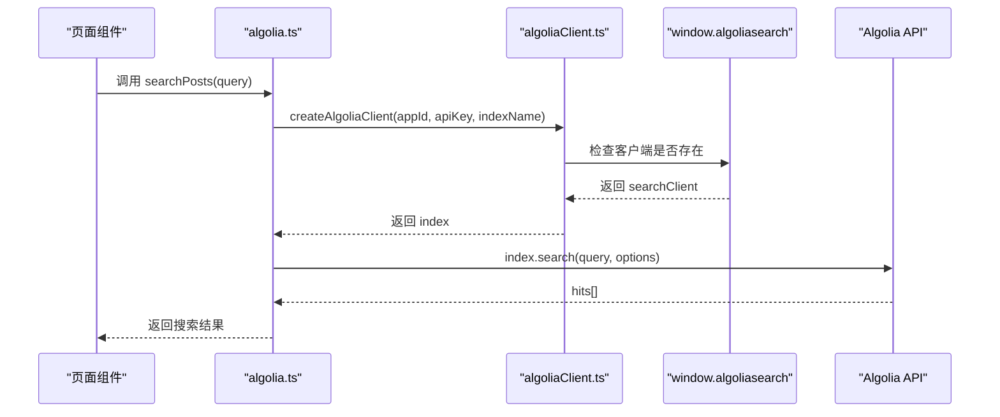
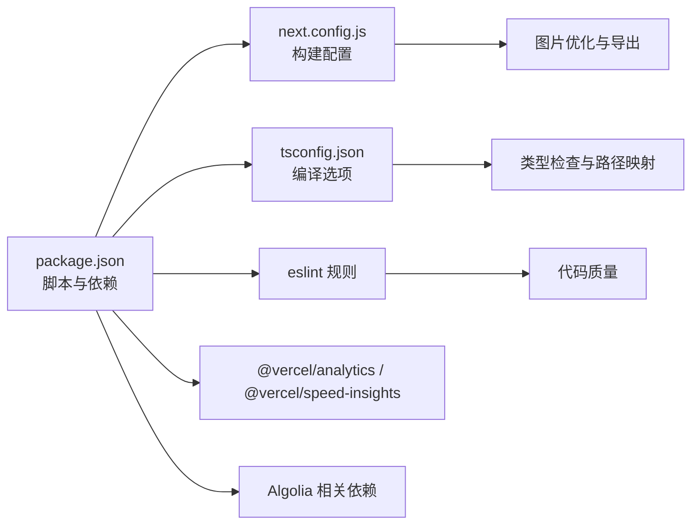

# 调试工具和技巧

<cite>
**本文引用的文件**
- [package.json](file://blog-system2/frontend/package.json)
- [next.config.js](file://blog-system2/frontend/next.config.js)
- [tsconfig.json](file://blog-system2/frontend/tsconfig.json)
- [.eslintrc.json](file://blog-system2/frontend/.eslintrc.json)
- [src/app/layout.tsx](file://blog-system2/frontend/src/app/layout.tsx)
- [src/app/loading.tsx](file://blog-system2/frontend/src/app/loading.tsx)
- [src/app/not-found.tsx](file://blog-system2/frontend/src/app/not-found.tsx)
- [src/components/ClientLayout.tsx](file://blog-system2/frontend/src/components/ClientLayout.tsx)
- [src/app/globals.css](file://blog-system2/frontend/src/app/globals.css)
- [src/types/global.d.ts](file://blog-system2/frontend/src/types/global.d.ts)
- [src/types/data.d.ts](file://blog-system2/frontend/src/types/data.d.ts)
- [src/lib/algolia.ts](file://blog-system2/frontend/src/lib/algolia.ts)
- [src/lib/algoliaClient.ts](file://blog-system2/frontend/src/lib/algoliaClient.ts)
- [src/lib/static-data.ts](file://blog-system2/frontend/src/lib/static-data.ts)
- [src/lib/utils.ts](file://blog-system2/frontend/src/lib/utils.ts)
</cite>

## 目录
1. [简介](#简介)
2. [项目结构](#项目结构)
3. [核心组件](#核心组件)
4. [架构总览](#架构总览)
5. [详细组件分析](#详细组件分析)
6. [依赖关系分析](#依赖关系分析)
7. [性能考量](#性能考量)
8. [故障排查指南](#故障排查指南)
9. [结论](#结论)
10. [附录](#附录)

## 简介
本指南面向使用 Next.js 的前端与全栈开发者，聚焦于开发工具链与调试技巧，涵盖以下主题：
- Next.js 开发服务器与内置错误处理（错误边界、404 页面）
- TypeScript 类型检查与 IDE 调试（断点、变量监视、调用栈）
- 浏览器开发者工具高级用法（性能、网络、内存）
- 日志与错误追踪最佳实践（结构化日志、错误上报、用户行为追踪）
- Vercel Analytics 与 Speed Insights 的性能监控与问题定位
- 单元与集成测试编写及自动化测试在故障排除中的应用
- 远程调试与生产环境问题排查

## 项目结构
该仓库为一个基于 Next.js 的前端博客系统，采用 App Router 结构，包含布局、页面、组件、类型与工具库等模块。关键特性包括：
- 使用 Vercel 提供的 Analytics 与 Speed Insights 进行前端性能与体验监控
- 自定义全局样式与主题切换
- Algolia 搜索能力与静态数据读取
- GitHub Pages 部署相关配置

图表来源
- [src/app/layout.tsx:1-48](file://blog-system2/frontend/src/app/layout.tsx#L1-L48)
- [src/components/ClientLayout.tsx:1-63](file://blog-system2/frontend/src/components/ClientLayout.tsx#L1-L63)
- [src/app/loading.tsx:1-32](file://blog-system2/frontend/src/app/loading.tsx#L1-L32)
- [src/app/not-found.tsx:1-20](file://blog-system2/frontend/src/app/not-found.tsx#L1-L20)
- [src/lib/algolia.ts:1-46](file://blog-system2/frontend/src/lib/algolia.ts#L1-L46)
- [src/lib/algoliaClient.ts:1-33](file://blog-system2/frontend/src/lib/algoliaClient.ts#L1-L33)
- [src/lib/static-data.ts:1-214](file://blog-system2/frontend/src/lib/static-data.ts#L1-L214)
- [src/lib/utils.ts:1-7](file://blog-system2/frontend/src/lib/utils.ts#L1-L7)
- [package.json:1-72](file://blog-system2/frontend/package.json#L1-L72)
- [next.config.js:1-48](file://blog-system2/frontend/next.config.js#L1-L48)
- [tsconfig.json:1-42](file://blog-system2/frontend/tsconfig.json#L1-L42)
- [.eslintrc.json:1-12](file://blog-system2/frontend/.eslintrc.json#L1-L12)
- [src/app/globals.css:1-681](file://blog-system2/frontend/src/app/globals.css#L1-L681)

章节来源
- [package.json:1-72](file://blog-system2/frontend/package.json#L1-L72)
- [next.config.js:1-48](file://blog-system2/frontend/next.config.js#L1-L48)
- [tsconfig.json:1-42](file://blog-system2/frontend/tsconfig.json#L1-L42)
- [.eslintrc.json:1-12](file://blog-system2/frontend/.eslintrc.json#L1-L12)
- [src/app/layout.tsx:1-48](file://blog-system2/frontend/src/app/layout.tsx#L1-L48)
- [src/components/ClientLayout.tsx:1-63](file://blog-system2/frontend/src/components/ClientLayout.tsx#L1-L63)
- [src/app/globals.css:1-681](file://blog-system2/frontend/src/app/globals.css#L1-L681)

## 核心组件
- 应用根布局与视口配置：定义站点元数据、视口参数，并通过客户端布局包裹子页面，启用主题切换、搜索、导航进度与动画。
- 加载与 404 页面：加载态提供视觉反馈；404 页面采用动态导入与客户端侧渲染，提升首屏性能与可访问性。
- 全局样式与主题：Tailwind 与自定义 CSS 变量，支持深浅主题切换与动画优化；针对减少运动偏好与移动端交互进行适配。
- 搜索与静态数据：封装 Algolia 客户端初始化与搜索逻辑；从 public/data 中读取静态索引，实现分页与关联文章查询。
- 工具函数：类名合并工具，简化样式组合。

章节来源
- [src/app/layout.tsx:1-48](file://blog-system2/frontend/src/app/layout.tsx#L1-L48)
- [src/app/loading.tsx:1-32](file://blog-system2/frontend/src/app/loading.tsx#L1-L32)
- [src/app/not-found.tsx:1-20](file://blog-system2/frontend/src/app/not-found.tsx#L1-L20)
- [src/components/ClientLayout.tsx:1-63](file://blog-system2/frontend/src/components/ClientLayout.tsx#L1-L63)
- [src/app/globals.css:1-681](file://blog-system2/frontend/src/app/globals.css#L1-L681)
- [src/lib/algolia.ts:1-46](file://blog-system2/frontend/src/lib/algolia.ts#L1-L46)
- [src/lib/algoliaClient.ts:1-33](file://blog-system2/frontend/src/lib/algoliaClient.ts#L1-L33)
- [src/lib/static-data.ts:1-214](file://blog-system2/frontend/src/lib/static-data.ts#L1-L214)
- [src/lib/utils.ts:1-7](file://blog-system2/frontend/src/lib/utils.ts#L1-L7)

## 架构总览
下图展示了客户端布局如何组织页面、动画、主题与监控组件，并说明搜索与静态数据的调用路径。

图表来源
- [src/app/layout.tsx:1-48](file://blog-system2/frontend/src/app/layout.tsx#L1-L48)
- [src/components/ClientLayout.tsx:1-63](file://blog-system2/frontend/src/components/ClientLayout.tsx#L1-L63)
- [src/app/loading.tsx:1-32](file://blog-system2/frontend/src/app/loading.tsx#L1-L32)
- [src/app/not-found.tsx:1-20](file://blog-system2/frontend/src/app/not-found.tsx#L1-L20)
- [src/lib/algolia.ts:1-46](file://blog-system2/frontend/src/lib/algolia.ts#L1-L46)
- [src/lib/algoliaClient.ts:1-33](file://blog-system2/frontend/src/lib/algoliaClient.ts#L1-L33)
- [src/lib/static-data.ts:1-214](file://blog-system2/frontend/src/lib/static-data.ts#L1-L214)
- [src/lib/utils.ts:1-7](file://blog-system2/frontend/src/lib/utils.ts#L1-L7)
- [src/app/globals.css:1-681](file://blog-system2/frontend/src/app/globals.css#L1-L681)

## 详细组件分析

### 客户端布局与监控集成
- 功能要点
  - 主题提供者：支持系统/默认主题切换与类名注入。
  - 导航进度与自定义光标：增强交互体验。
  - 搜索提供者：封装 Algolia 搜索上下文。
  - Vercel Analytics 与 Speed Insights：自动采集性能与体验指标。
- 调试建议
  - 在浏览器控制台中验证 Analytics 与 Speed Insights 是否注入脚本。
  - 使用性能面板观察路由切换动画与资源加载时间。
  - 切换深浅主题时，检查 CSS 变量是否正确更新。

图表来源
- [src/app/layout.tsx:1-48](file://blog-system2/frontend/src/app/layout.tsx#L1-L48)
- [src/components/ClientLayout.tsx:1-63](file://blog-system2/frontend/src/components/ClientLayout.tsx#L1-L63)

章节来源
- [src/components/ClientLayout.tsx:1-63](file://blog-system2/frontend/src/components/ClientLayout.tsx#L1-L63)

### 加载态与 404 页面
- 加载态
  - 使用客户端组件与动态导入的粒子/动画组件，提供过渡期间的视觉反馈。
- 404 页面
  - 采用动态导入与客户端渲染，避免服务端渲染开销；在 SSR 关闭场景下仍可工作。
- 调试建议
  - 在慢速网络或大体积资源加载时，观察加载态是否出现。
  - 通过路由错误触发 404，确认动态导入的加载占位与最终组件是否正确显示。

图表来源
- [src/app/loading.tsx:1-32](file://blog-system2/frontend/src/app/loading.tsx#L1-L32)
- [src/app/not-found.tsx:1-20](file://blog-system2/frontend/src/app/not-found.tsx#L1-L20)

章节来源
- [src/app/loading.tsx:1-32](file://blog-system2/frontend/src/app/loading.tsx#L1-L32)
- [src/app/not-found.tsx:1-20](file://blog-system2/frontend/src/app/not-found.tsx#L1-L20)

### 搜索与静态数据
- 搜索流程
  - 在浏览器端初始化 Algolia 客户端，通过封装的 index 执行搜索。
  - 对异常进行捕获并记录日志，保证 UI 不中断。
- 静态数据
  - 从 public/data 下读取 JSON 索引，实现文章列表、最新文章、关联文章与通知等查询。
  - 支持分页与排序，便于在页面中高效展示。
- 调试建议
  - 在浏览器控制台检查 Algolia 客户端是否可用与初始化是否成功。
  - 使用网络面板观察搜索请求与响应状态码、耗时。
  - 在本地修改 public/data 后，确认页面刷新是否反映最新数据。

图表来源
- [src/lib/algolia.ts:1-46](file://blog-system2/frontend/src/lib/algolia.ts#L1-L46)
- [src/lib/algoliaClient.ts:1-33](file://blog-system2/frontend/src/lib/algoliaClient.ts#L1-L33)

章节来源
- [src/lib/algolia.ts:1-46](file://blog-system2/frontend/src/lib/algolia.ts#L1-L46)
- [src/lib/algoliaClient.ts:1-33](file://blog-system2/frontend/src/lib/algoliaClient.ts#L1-L33)
- [src/lib/static-data.ts:1-214](file://blog-system2/frontend/src/lib/static-data.ts#L1-L214)

### 类型与全局声明
- 全局类型扩展
  - 扩展 DeviceOrientationEvent 与 Window 接口，确保第三方库类型安全。
- 数据模块声明
  - 为 .json 与 .md 文件提供模块声明，便于在 TS 中直接导入。
- 调试建议
  - 在 IDE 中利用类型提示快速定位属性与方法。
  - 当引入新第三方库时，优先在全局类型中补充声明，避免类型错误。

章节来源
- [src/types/global.d.ts:1-52](file://blog-system2/frontend/src/types/global.d.ts#L1-L52)
- [src/types/data.d.ts:1-10](file://blog-system2/frontend/src/types/data.d.ts#L1-L10)

## 依赖关系分析
- 构建与运行
  - Next.js 版本与脚本由 package.json 管理；next.config.js 控制输出格式、图片优化、Webpack 插件与忽略国际化资源。
  - TypeScript 严格模式开启，路径映射与类型根目录配置完善。
  - ESLint 规则遵循 Next.js Web Vitals，部分规则放宽以提升开发体验。
- 监控与性能
  - Vercel Analytics 与 Speed Insights 通过客户端组件注入，无需额外埋点即可采集数据。
- 搜索与数据
  - Algolia 客户端在浏览器端初始化，搜索封装统一处理异常与返回结构。
  - 静态数据通过 Node FS 读取 public/data 下的 JSON，适合小规模内容管理。

图表来源
- [package.json:1-72](file://blog-system2/frontend/package.json#L1-L72)
- [next.config.js:1-48](file://blog-system2/frontend/next.config.js#L1-L48)
- [tsconfig.json:1-42](file://blog-system2/frontend/tsconfig.json#L1-L42)
- [.eslintrc.json:1-12](file://blog-system2/frontend/.eslintrc.json#L1-L12)

章节来源
- [package.json:1-72](file://blog-system2/frontend/package.json#L1-L72)
- [next.config.js:1-48](file://blog-system2/frontend/next.config.js#L1-L48)
- [tsconfig.json:1-42](file://blog-system2/frontend/tsconfig.json#L1-L42)
- [.eslintrc.json:1-12](file://blog-system2/frontend/.eslintrc.json#L1-L12)

## 性能考量
- 构建与运行时优化
  - 输出为静态导出，结合 trailingSlash 与 basePath/assetPrefix 支持 GitHub Pages。
  - 忽略国际化资源以减小包体。
- 样式与动画
  - Tailwind 与 CSS 变量配合，减少重复样式；针对减少运动偏好的媒体查询降低动画开销。
- 搜索与数据
  - 搜索在客户端执行，注意请求频率与缓存策略；静态数据读取在服务端，需关注 I/O 性能与缓存命中。
- 监控
  - 使用 Speed Insights 自动采集性能指标，结合浏览器性能面板定位瓶颈。

章节来源
- [next.config.js:1-48](file://blog-system2/frontend/next.config.js#L1-L48)
- [src/app/globals.css:1-681](file://blog-system2/frontend/src/app/globals.css#L1-L681)

## 故障排查指南

### Next.js 开发服务器与内置错误处理
- 开发服务器
  - 使用脚本启动开发服务器，监听源码变更并热更新。
- 错误边界与 404
  - 404 页面采用动态导入与客户端渲染，避免 SSR 场景下的渲染失败导致整页崩溃。
- 调试步骤
  - 在路由错误或动态导入失败时，确认客户端渲染分支是否生效。
  - 检查控制台是否有未捕获异常，必要时在 404 组件中增加兜底 UI。

章节来源
- [package.json:5-11](file://blog-system2/frontend/package.json#L5-L11)
- [src/app/not-found.tsx:1-20](file://blog-system2/frontend/src/app/not-found.tsx#L1-L20)

### TypeScript 类型检查与 IDE 调试
- 类型配置
  - 严格模式、路径别名、类型根目录与插件配置完善，有助于早期发现类型错误。
- IDE 调试
  - 断点：在 .ts/.tsx 文件中设置断点，观察变量值与调用栈。
  - 变量监视：在 Watch 面板添加表达式，持续跟踪状态变化。
  - 调用栈：定位异步回调与事件处理器的调用链，识别深层异常来源。
- 调试建议
  - 当第三方库缺少类型时，在全局类型文件中补充声明，避免编译失败。

章节来源
- [tsconfig.json:1-42](file://blog-system2/frontend/tsconfig.json#L1-L42)
- [src/types/global.d.ts:1-52](file://blog-system2/frontend/src/types/global.d.ts#L1-L52)

### 浏览器开发者工具高级用法
- 性能面板
  - 分析首次内容绘制、最大内容绘制、累积布局偏移等指标，定位渲染瓶颈。
- 网络面板
  - 观察搜索请求与静态资源加载状态码、耗时与缓存命中情况。
- 内存分析
  - 使用快照对比，识别组件卸载后仍被引用的对象，避免内存泄漏。
- 调试建议
  - 在慢速 3G 环境模拟网络延迟，验证加载态与骨架屏效果。
  - 使用“保留日志”在页面刷新前后对比网络请求。

章节来源
- [src/lib/algolia.ts:28-46](file://blog-system2/frontend/src/lib/algolia.ts#L28-L46)

### 日志记录与错误追踪
- 结构化日志
  - 在关键流程（如搜索、数据读取）记录上下文信息（查询词、条目数量、耗时）。
- 错误上报
  - 使用 Vercel Analytics/Speed Insights 自动采集错误与性能数据；对业务异常可补充自定义事件。
- 用户行为追踪
  - 通过 Speed Insights 的交互事件与页面停留时长，评估用户体验。
- 调试建议
  - 在异常捕获处记录堆栈与上下文，便于回溯问题。

章节来源
- [src/lib/algolia.ts:42-45](file://blog-system2/frontend/src/lib/algolia.ts#L42-L45)
- [src/components/ClientLayout.tsx:8-59](file://blog-system2/frontend/src/components/ClientLayout.tsx#L8-L59)

### Vercel Analytics 与 Speed Insights
- 集成方式
  - 通过客户端组件自动注入，无需手动埋点。
- 使用技巧
  - 在仪表盘查看页面性能分布、错误率趋势与用户地域/设备画像。
  - 结合浏览器性能面板与网络面板，定位具体页面的性能问题。
- 调试建议
  - 在路由切换频繁的场景下，关注交互延迟与资源加载时间。

章节来源
- [src/components/ClientLayout.tsx:8-59](file://blog-system2/frontend/src/components/ClientLayout.tsx#L8-L59)

### 单元与集成测试
- 单元测试
  - 对纯函数（如计算阅读时长、类名合并）编写测试，覆盖边界条件与异常输入。
- 集成测试
  - 使用客户端渲染场景，验证动态导入组件、主题切换与导航进度的协同表现。
- 自动化测试在故障排除中的应用
  - 将常见交互流程纳入自动化测试，回归问题修复后快速验证。
- 调试建议
  - 在测试失败时，结合浏览器开发者工具与日志，定位组件渲染与状态更新问题。

章节来源
- [src/lib/utils.ts:1-7](file://blog-system2/frontend/src/lib/utils.ts#L1-L7)
- [src/lib/reading-time.ts:1-84](file://blog-system2/frontend/src/lib/reading-time.ts#L1-L84)

### 远程调试与生产环境问题排查
- 远程调试
  - 使用浏览器 DevTools 的“远程设备”功能，连接移动设备进行真机调试。
- 生产环境
  - 通过 Vercel 仪表盘与浏览器性能面板交叉验证问题。
  - 在静态导出场景下，检查资源路径与缓存策略，避免 404 与重定向问题。
- 调试建议
  - 在生产环境开启最小化日志，收集关键事件与错误堆栈，避免泄露敏感信息。

章节来源
- [next.config.js:6-18](file://blog-system2/frontend/next.config.js#L6-L18)
- [src/app/globals.css:380-400](file://blog-system2/frontend/src/app/globals.css#L380-L400)

## 结论
本指南围绕 Next.js 开发工具链与调试实践，结合项目现有配置与组件，提供了从开发到生产的完整调试路径。通过合理使用 TypeScript、浏览器开发者工具、Vercel 监控与自动化测试，可以显著提升问题定位效率与系统稳定性。

## 附录
- 常用命令
  - 启动开发服务器、构建、构建静态导出与 GitHub Pages 构建脚本见 package.json。
- 关键配置
  - Next.js 构建配置、TypeScript 编译选项、ESLint 规则与全局类型声明。

章节来源
- [package.json:5-11](file://blog-system2/frontend/package.json#L5-L11)
- [next.config.js:12-18](file://blog-system2/frontend/next.config.js#L12-L18)
- [tsconfig.json:16-28](file://blog-system2/frontend/tsconfig.json#L16-L28)
- [.eslintrc.json:1-12](file://blog-system2/frontend/.eslintrc.json#L1-L12)