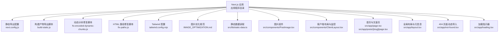
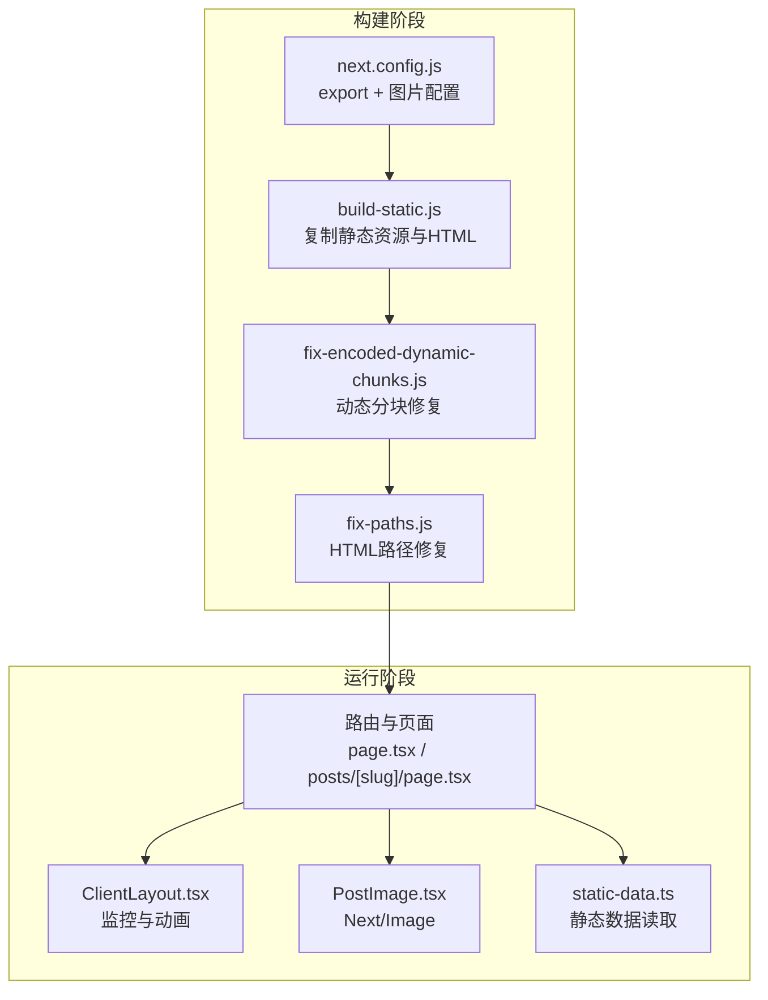
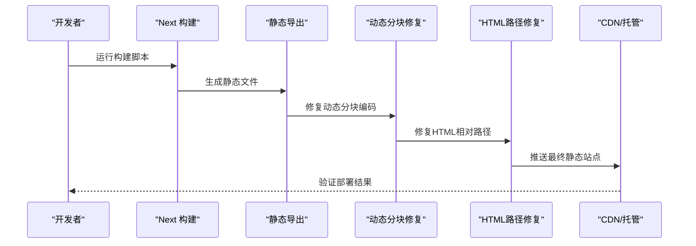
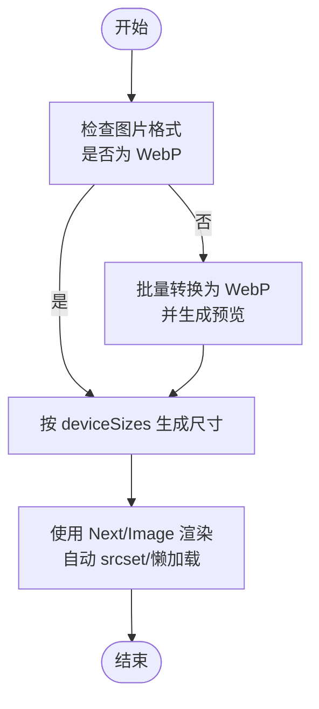
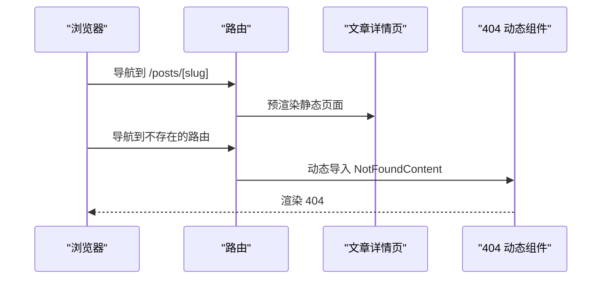
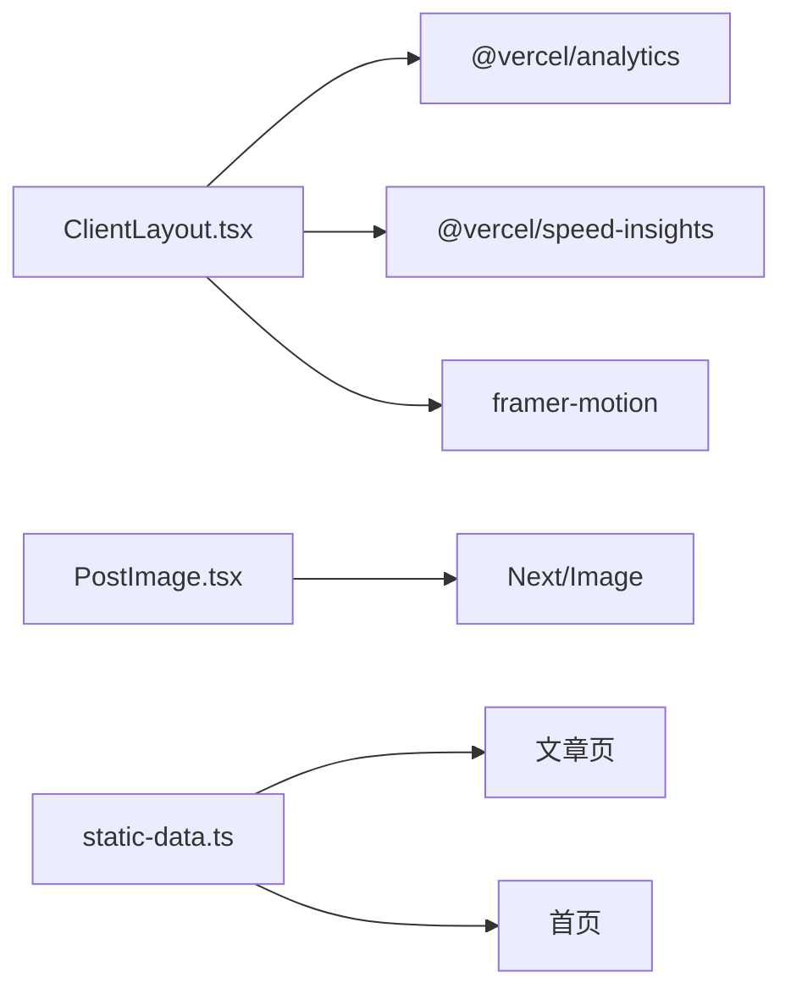

# 性能优化策略

<cite>
**本文引用的文件**
- [next.config.js](file://blog-system2/frontend/next.config.js)
- [package.json](file://blog-system2/frontend/package.json)
- [build-static.js](file://blog-system2/frontend/build-static.js)
- [IMAGE_OPTIMIZATION.md](file://blog-system2/frontend/IMAGE_OPTIMIZATION.md)
- [static-data.ts](file://blog-system2/frontend/src/lib/static-data.ts)
- [PostImage.tsx](file://blog-system2/frontend/src/components/PostImage.tsx)
- [layout.tsx](file://blog-system2/frontend/src/app/layout.tsx)
- [loading.tsx](file://blog-system2/frontend/src/app/loading.tsx)
- [not-found.tsx](file://blog-system2/frontend/src/app/not-found.tsx)
- [tailwind.config.mjs](file://blog-system2/frontend/tailwind.config.mjs)
- [ClientLayout.tsx](file://blog-system2/frontend/src/components/ClientLayout.tsx)
- [page.tsx](file://blog-system2/frontend/src/app/page.tsx)
- [posts/[slug]/page.tsx](file://blog-system2/frontend/src/app/posts/[slug]/page.tsx)
- [fix-encoded-dynamic-chunks.js](file://blog-system2/frontend/fix-encoded-dynamic-chunks.js)
- [fix-paths.js](file://blog-system2/frontend/fix-paths.js)
</cite>

## 目录
1. [引言](#引言)
2. [项目结构](#项目结构)
3. [核心组件](#核心组件)
4. [架构总览](#架构总览)
5. [详细组件分析](#详细组件分析)
6. [依赖关系分析](#依赖关系分析)
7. [性能考量](#性能考量)
8. [故障排查指南](#故障排查指南)
9. [结论](#结论)
10. [附录](#附录)

## 引言
本文件面向技术博客平台，系统化梳理并输出一套可落地的性能优化策略。重点覆盖以下方面：
- 静态站点生成（SSG）实现原理与优势：基于 Next.js 的 export 输出模式、预渲染与缓存策略
- 图片优化：WebP 支持、响应式图片与懒加载实践
- 代码分割与按需加载：动态导入与路由级代码分割
- Webpack 配置优化：Tree Shaking 与 Bundle 分析
- 浏览器缓存与 CDN 集成
- 关键渲染路径优化与首屏加载提升
- 性能监控与分析工具使用
- 移动端性能优化与 PWA 特性建议

## 项目结构
该前端采用 Next.js 应用程序目录结构，结合静态导出（export）模式，构建纯静态站点，便于部署到 GitHub Pages 或任意静态托管服务。关键目录与文件如下：
- 应用入口与布局：src/app/*
- 组件与通用逻辑：src/components/*
- 工具与数据：src/lib/*
- 构建与导出：next.config.js、build-static.js、fix-encoded-dynamic-chunks.js、fix-paths.js
- 样式与主题：tailwind.config.mjs、src/app/globals.css
- 图片处理规范：IMAGE_OPTIMIZATION.md
- 依赖与脚本：package.json

图表来源
- [next.config.js:1-48](file://blog-system2/frontend/next.config.js#L1-L48)
- [build-static.js:1-141](file://blog-system2/frontend/build-static.js#L1-L141)
- [fix-encoded-dynamic-chunks.js:1-73](file://blog-system2/frontend/fix-encoded-dynamic-chunks.js#L1-L73)
- [fix-paths.js:1-53](file://blog-system2/frontend/fix-paths.js#L1-L53)
- [tailwind.config.mjs:1-18](file://blog-system2/frontend/tailwind.config.mjs#L1-L18)
- [IMAGE_OPTIMIZATION.md:1-28](file://blog-system2/frontend/IMAGE_OPTIMIZATION.md#L1-L28)
- [static-data.ts:1-214](file://blog-system2/frontend/src/lib/static-data.ts#L1-L214)
- [PostImage.tsx:1-15](file://blog-system2/frontend/src/components/PostImage.tsx#L1-L15)
- [ClientLayout.tsx:1-63](file://blog-system2/frontend/src/components/ClientLayout.tsx#L1-L63)
- [page.tsx:1-800](file://blog-system2/frontend/src/app/page.tsx#L1-L800)
- [posts/[slug]/page.tsx:1-304](file://blog-system2/frontend/src/app/posts/[slug]/page.tsx#L1-L304)
- [layout.tsx:1-48](file://blog-system2/frontend/src/app/layout.tsx#L1-L48)
- [not-found.tsx:1-20](file://blog-system2/frontend/src/app/not-found.tsx#L1-L20)
- [loading.tsx:1-32](file://blog-system2/frontend/src/app/loading.tsx#L1-L32)

章节来源
- [next.config.js:1-48](file://blog-system2/frontend/next.config.js#L1-L48)
- [package.json:1-72](file://blog-system2/frontend/package.json#L1-L72)

## 核心组件
- 静态导出与预渲染
  - export 输出模式：通过配置输出纯静态文件，适合 GitHub Pages 等静态托管
  - 预渲染：首页与文章页强制静态生成，提升首屏性能
  - 动态分块修复：导出后对动态段进行编码镜像修复，确保链接正确
  - HTML 路径修复：统一相对路径前缀，避免多级目录下的资源路径错误
- 图片优化
  - WebP 格式：启用 WebP 作为默认格式，降低体积
  - 响应式尺寸：配置 deviceSizes 与 imageSizes，按设备生成合适尺寸
  - 图片组件：使用 Next/Image，自动处理占位、懒加载与 srcset
- 代码分割与按需加载
  - 路由级代码分割：文章详情页与 404 页使用动态导入，仅在需要时加载
  - 组件级分割：复杂动画与第三方库按需引入，减少初始包体
- 监控与分析
  - Vercel Analytics 与 Speed Insights：内置性能与行为分析
- 移动端优化
  - 视口与缩放：固定初始缩放，避免用户缩放干扰
  - 动效降级：移动端禁用持续动画，尊重“减少动效”偏好设置

章节来源
- [next.config.js:6-44](file://blog-system2/frontend/next.config.js#L6-L44)
- [build-static.js:33-87](file://blog-system2/frontend/build-static.js#L33-L87)
- [fix-encoded-dynamic-chunks.js:39-73](file://blog-system2/frontend/fix-encoded-dynamic-chunks.js#L39-L73)
- [fix-paths.js:6-34](file://blog-system2/frontend/fix-paths.js#L6-L34)
- [PostImage.tsx:1-15](file://blog-system2/frontend/src/components/PostImage.tsx#L1-L15)
- [ClientLayout.tsx:8-59](file://blog-system2/frontend/src/components/ClientLayout.tsx#L8-L59)
- [layout.tsx:21-26](file://blog-system2/frontend/src/app/layout.tsx#L21-L26)
- [page.tsx:343-374](file://blog-system2/frontend/src/app/page.tsx#L343-L374)
- [not-found.tsx:4-13](file://blog-system2/frontend/src/app/not-found.tsx#L4-L13)

## 架构总览
下图展示了从构建到运行的关键流程，以及性能优化点的分布。

图表来源
- [next.config.js:6-44](file://blog-system2/frontend/next.config.js#L6-L44)
- [build-static.js:33-87](file://blog-system2/frontend/build-static.js#L33-L87)
- [fix-encoded-dynamic-chunks.js:39-73](file://blog-system2/frontend/fix-encoded-dynamic-chunks.js#L39-L73)
- [fix-paths.js:36-52](file://blog-system2/frontend/fix-paths.js#L36-L52)
- [page.tsx:22-30](file://blog-system2/frontend/src/app/page.tsx#L22-L30)
- [posts/[slug]/page.tsx:66-89](file://blog-system2/frontend/src/app/posts/[slug]/page.tsx#L66-L89)
- [ClientLayout.tsx:16-61](file://blog-system2/frontend/src/components/ClientLayout.tsx#L16-L61)
- [PostImage.tsx:4-14](file://blog-system2/frontend/src/components/PostImage.tsx#L4-L14)
- [static-data.ts:32-73](file://blog-system2/frontend/src/lib/static-data.ts#L32-L73)

## 详细组件分析

### 静态站点生成（SSG）与预渲染
- 实现原理
  - export 输出：构建后生成纯静态文件，无需服务器运行时
  - 预渲染：首页与文章详情页强制静态生成，提升首屏速度
  - 动态分块修复：导出后对动态段进行编码镜像，保证链接可用
  - HTML 路径修复：统一相对路径，避免多级目录下的资源失效
- 性能优势
  - 无 SSR 开销，首屏更快；CDN 友好，缓存命中率高
  - 构建期优化：Webpack Tree Shaking、按需加载、图片压缩等
- 关键配置与脚本
  - export、basePath、assetPrefix：适配 GitHub Pages
  - 图片配置：domains、formats、deviceSizes、imageSizes、minimumCacheTTL
  - 构建脚本：build-static.js、fix-encoded-dynamic-chunks.js、fix-paths.js

图表来源
- [next.config.js:7-10](file://blog-system2/frontend/next.config.js#L7-L10)
- [next.config.js:20-33](file://blog-system2/frontend/next.config.js#L20-L33)
- [build-static.js:33-87](file://blog-system2/frontend/build-static.js#L33-L87)
- [fix-encoded-dynamic-chunks.js:39-73](file://blog-system2/frontend/fix-encoded-dynamic-chunks.js#L39-L73)
- [fix-paths.js:36-52](file://blog-system2/frontend/fix-paths.js#L36-L52)

章节来源
- [next.config.js:6-44](file://blog-system2/frontend/next.config.js#L6-L44)
- [build-static.js:33-87](file://blog-system2/frontend/build-static.js#L33-L87)
- [fix-encoded-dynamic-chunks.js:39-73](file://blog-system2/frontend/fix-encoded-dynamic-chunks.js#L39-L73)
- [fix-paths.js:6-34](file://blog-system2/frontend/fix-paths.js#L6-L34)

### 图片优化：WebP、响应式与懒加载
- WebP 支持
  - 启用 WebP 格式，降低体积
  - 配置 domains，允许外部 CDN 加速图片
- 响应式图片
  - deviceSizes 与 imageSizes：按设备生成合适尺寸
  - Next/Image 自动注入 srcset，按 DPR 选择最优尺寸
- 懒加载与占位
  - Next/Image 默认懒加载；通过占位与尺寸声明避免布局抖动
- 预处理规范
  - 提供批处理脚本，统一裁剪、压缩与生成预览图

图表来源
- [next.config.js:20-33](file://blog-system2/frontend/next.config.js#L20-L33)
- [PostImage.tsx:4-14](file://blog-system2/frontend/src/components/PostImage.tsx#L4-L14)
- [IMAGE_OPTIMIZATION.md:1-28](file://blog-system2/frontend/IMAGE_OPTIMIZATION.md#L1-L28)

章节来源
- [next.config.js:20-33](file://blog-system2/frontend/next.config.js#L20-L33)
- [PostImage.tsx:1-15](file://blog-system2/frontend/src/components/PostImage.tsx#L1-L15)
- [IMAGE_OPTIMIZATION.md:1-28](file://blog-system2/frontend/IMAGE_OPTIMIZATION.md#L1-L28)

### 代码分割与按需加载
- 路由级代码分割
  - 文章详情页：使用 generateStaticParams 与 generateMetadata，配合 force-static
  - 404 页：动态导入组件，仅在未找到时加载
- 组件级按需加载
  - 客户端布局中引入动画与第三方库，减少初始包体
- 动态导入示例
  - not-found.tsx 中对 NotFoundContent 使用动态导入，ssr=false 并提供 loading 占位

图表来源
- [posts/[slug]/page.tsx:32-37](file://blog-system2/frontend/src/app/posts/[slug]/page.tsx#L32-L37)
- [posts/[slug]/page.tsx:64](file://blog-system2/frontend/src/app/posts/[slug]/page.tsx#L64)
- [not-found.tsx:4-13](file://blog-system2/frontend/src/app/not-found.tsx#L4-L13)

章节来源
- [posts/[slug]/page.tsx:32-37](file://blog-system2/frontend/src/app/posts/[slug]/page.tsx#L32-L37)
- [posts/[slug]/page.tsx:64](file://blog-system2/frontend/src/app/posts/[slug]/page.tsx#L64)
- [not-found.tsx:4-13](file://blog-system2/frontend/src/app/not-found.tsx#L4-L13)

### Webpack 配置优化：Tree Shaking 与 Bundle 分析
- Tree Shaking
  - TypeScript 与 ESM：确保未使用的导出被移除
  - 忽略 moment 本地化：通过 IgnorePlugin 减少语言包体积
- Bundle 分析
  - 建议在开发或 CI 中开启分析，识别大体积依赖与重复模块
  - 结合动态导入与按需加载，进一步缩小首屏包体

章节来源
- [next.config.js:35-44](file://blog-system2/frontend/next.config.js#L35-L44)
- [package.json:13-11](file://blog-system2/frontend/package.json#L13-L11)

### 浏览器缓存策略与 CDN 集成
- 缓存策略
  - 静态资源：利用 export 生成的稳定哈希文件名，长期缓存
  - HTML：短缓存或不缓存，确保更新及时
  - 图片：设置 minimumCacheTTL，结合 CDN 缓存控制
- CDN 集成
  - 通过 assetPrefix 与 basePath，适配 GitHub Pages 子路径部署
  - 配置 domains，将图片托管至 CDN，加速全球访问

章节来源
- [next.config.js:7-10](file://blog-system2/frontend/next.config.js#L7-L10)
- [next.config.js:20-33](file://blog-system2/frontend/next.config.js#L20-L33)

### 关键渲染路径优化与首屏加载
- 首屏优化
  - 预渲染首页与文章页，减少 TTFB
  - 使用 loading.tsx 提供骨架屏或轻量动画，改善感知性能
  - 移动端禁用持续动画，尊重减少动效偏好
- 渲染路径
  - 全局布局与字体：在 layout.tsx 中声明 viewport 与字体变量
  - 客户端布局：在 ClientLayout.tsx 中引入动画与监控，避免阻塞首屏

章节来源
- [layout.tsx:21-26](file://blog-system2/frontend/src/app/layout.tsx#L21-L26)
- [page.tsx:343-374](file://blog-system2/frontend/src/app/page.tsx#L343-L374)
- [loading.tsx:1-32](file://blog-system2/frontend/src/app/loading.tsx#L1-L32)

### 性能监控与分析工具
- 内置监控
  - Vercel Analytics 与 Speed Insights：在 ClientLayout.tsx 中引入，自动收集性能与行为数据
- 建议扩展
  - 在 CI 中集成 Bundle 分析与 Lighthouse 报告
  - 使用 Web Vitals 监控真实用户性能指标

章节来源
- [ClientLayout.tsx:8-59](file://blog-system2/frontend/src/components/ClientLayout.tsx#L8-L59)

### 移动端性能优化与 PWA 特性
- 移动端优化
  - 固定 viewport，避免用户缩放影响布局
  - 移动端禁用持续动画，减少 GPU 压力
  - 尊重“减少动效”偏好设置
- PWA 建议
  - 添加 manifest 与 service worker，支持离线缓存与安装
  - 预缓存关键页面与资源，提升二次访问体验
  - 配置 Workbox 或使用框架内置 PWA 支持

章节来源
- [layout.tsx:21-26](file://blog-system2/frontend/src/app/layout.tsx#L21-L26)
- [page.tsx:343-374](file://blog-system2/frontend/src/app/page.tsx#L343-L374)

## 依赖关系分析
- 组件耦合
  - ClientLayout.tsx 作为客户端根容器，集中管理主题、动画、监控与导航进度
  - PostImage.tsx 与 Next/Image 紧密耦合，负责图片渲染与懒加载
  - 静态数据读取通过 static-data.ts，避免运行时请求
- 外部依赖
  - 图片 CDN：通过 domains 配置，支持跨域图片
  - 监控：@vercel/analytics 与 @vercel/speed-insights
  - 动画：framer-motion、gsap 等，按需加载

图表来源
- [ClientLayout.tsx:8-59](file://blog-system2/frontend/src/components/ClientLayout.tsx#L8-L59)
- [PostImage.tsx:4-14](file://blog-system2/frontend/src/components/PostImage.tsx#L4-L14)
- [static-data.ts:32-73](file://blog-system2/frontend/src/lib/static-data.ts#L32-L73)
- [page.tsx:22-30](file://blog-system2/frontend/src/app/page.tsx#L22-L30)
- [posts/[slug]/page.tsx:66-89](file://blog-system2/frontend/src/app/posts/[slug]/page.tsx#L66-L89)

章节来源
- [ClientLayout.tsx:8-59](file://blog-system2/frontend/src/components/ClientLayout.tsx#L8-L59)
- [PostImage.tsx:4-14](file://blog-system2/frontend/src/components/PostImage.tsx#L4-L14)
- [static-data.ts:32-73](file://blog-system2/frontend/src/lib/static-data.ts#L32-L73)

## 性能考量
- 构建期优化
  - export 输出 + 动态分块修复 + HTML 路径修复，确保静态站点稳定可用
  - WebP + 响应式尺寸 + 懒加载，显著降低图片带宽与渲染成本
- 运行期优化
  - 预渲染 + 骨架屏 + 移动端动效降级，提升感知性能
  - 监控埋点 + CDN 缓存，持续观测与优化
- 可扩展建议
  - 引入 Webpack Bundle Analyzer，定期分析包体构成
  - 对第三方库进行按需引入与版本升级，减少冗余依赖

## 故障排查指南
- 动态分块与路径问题
  - 症状：动态路由无法访问或资源 404
  - 处理：确认已执行动态分块修复与 HTML 路径修复脚本
- 静态导出后资源路径异常
  - 症状：/_next/ 资源路径错误
  - 处理：检查 basePath 与 assetPrefix 配置，确认 HTML 路径修复脚本执行
- 图片加载失败
  - 症状：跨域图片无法显示
  - 处理：确认 domains 配置是否包含对应域名，图片是否为 WebP

章节来源
- [fix-encoded-dynamic-chunks.js:39-73](file://blog-system2/frontend/fix-encoded-dynamic-chunks.js#L39-L73)
- [fix-paths.js:6-34](file://blog-system2/frontend/fix-paths.js#L6-L34)
- [next.config.js:20-33](file://blog-system2/frontend/next.config.js#L20-L33)

## 结论
本项目通过 export 静态导出、预渲染与完善的构建修复脚本，实现了高性能的静态博客平台。结合 WebP 图片、响应式尺寸与懒加载，以及按需加载与代码分割策略，显著提升了首屏性能与用户体验。建议在现有基础上引入 Bundle 分析与 PWA 能力，进一步完善性能闭环与离线体验。

## 附录
- 构建命令
  - 开发：yarn dev
  - 构建：yarn build
  - 静态导出：yarn build:static
  - GitHub Pages：yarn build:github
- 关键配置参考
  - export、basePath、assetPrefix、images、webpack 插件

章节来源
- [package.json:5-11](file://blog-system2/frontend/package.json#L5-L11)
- [next.config.js:6-44](file://blog-system2/frontend/next.config.js#L6-L44)