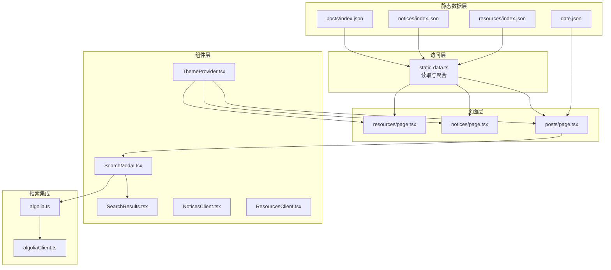
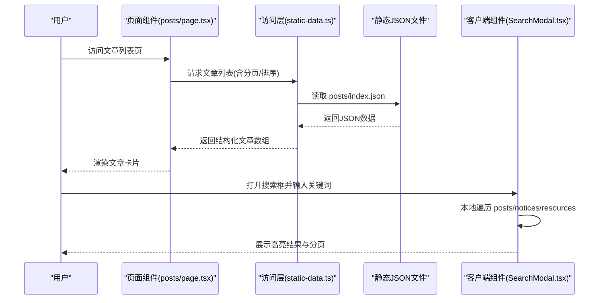
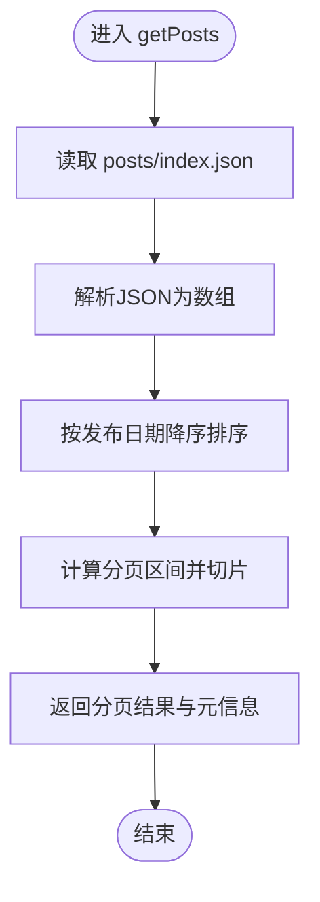
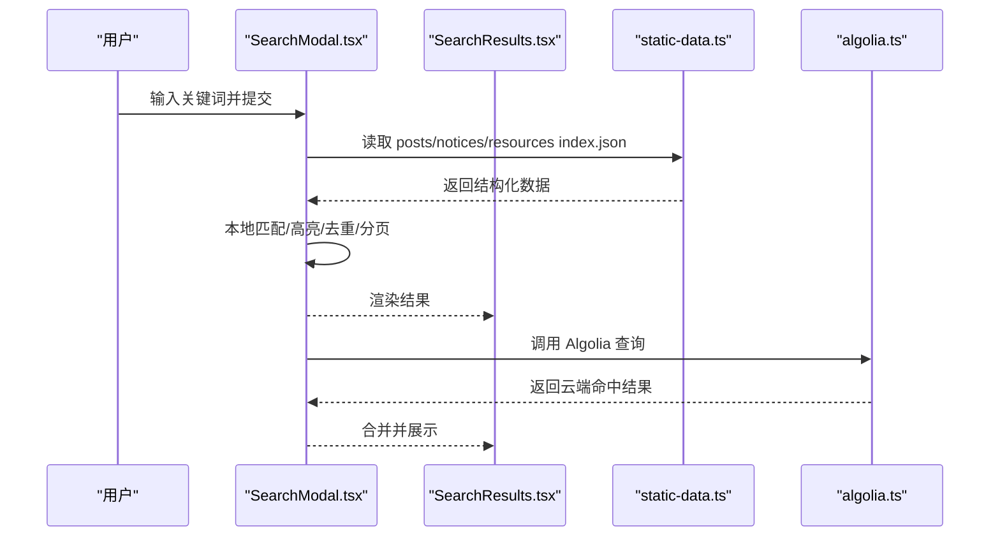
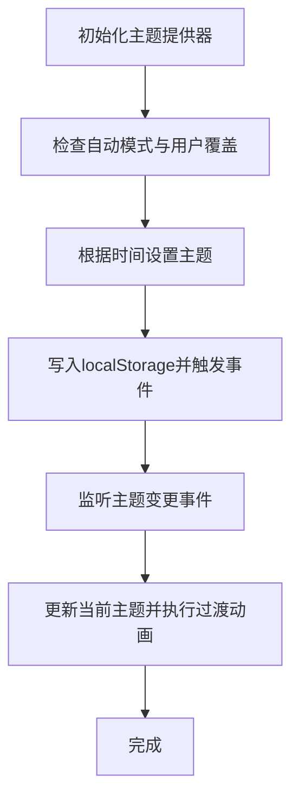
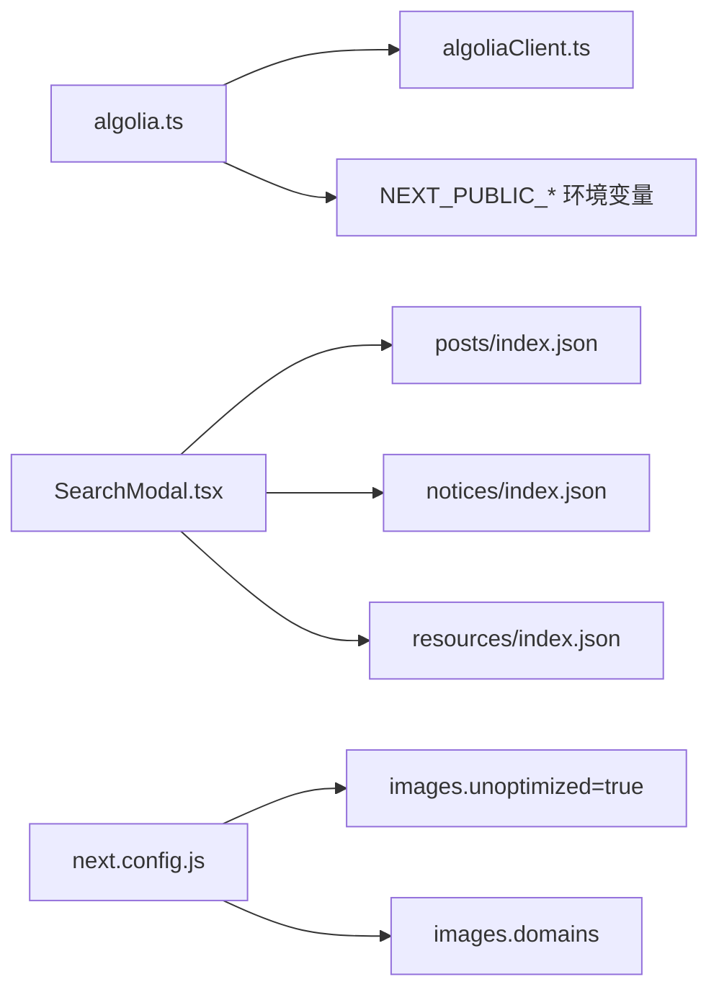

# 数据流管理

<cite>
**本文引用的文件**
- [static-data.ts](file://blog-system2/frontend/src/lib/static-data.ts)
- [algolia.ts](file://blog-system2/frontend/src/lib/algolia.ts)
- [algoliaClient.ts](file://blog-system2/frontend/src/lib/algoliaClient.ts)
- [date.json](file://blog-system2/frontend/public/data/date.json)
- [posts/index.json](file://blog-system2/frontend/public/data/posts/index.json)
- [notices/index.json](file://blog-system2/frontend/public/data/notices/index.json)
- [resources/index.json](file://blog-system2/frontend/public/data/resources/index.json)
- [SearchModal.tsx](file://blog-system2/frontend/src/components/Search/SearchModal.tsx)
- [SearchResults.tsx](file://blog-system2/frontend/src/components/Search/SearchResults.tsx)
- [ThemeProvider.tsx](file://blog-system2/frontend/src/components/theme/ThemeProvider.tsx)
- [posts/page.tsx](file://blog-system2/frontend/src/app/posts/page.tsx)
- [notices/page.tsx](file://blog-system2/frontend/src/app/notices/page.tsx)
- [resources/page.tsx](file://blog-system2/frontend/src/app/resources/page.tsx)
- [NoticesClient.tsx](file://blog-system2/frontend/src/components/notices/NoticesClient.tsx)
- [ResourcesClient.tsx](file://blog-system2/frontend/src/components/resources/ResourcesClient.tsx)
- [package.json](file://blog-system2/frontend/package.json)
- [next.config.js](file://blog-system2/frontend/next.config.js)
</cite>

## 目录
1. [引言](#引言)
2. [项目结构](#项目结构)
3. [核心组件](#核心组件)
4. [架构总览](#架构总览)
5. [详细组件分析](#详细组件分析)
6. [依赖关系分析](#依赖关系分析)
7. [性能考量](#性能考量)
8. [故障排查指南](#故障排查指南)
9. [结论](#结论)
10. [附录](#附录)

## 引言
本文件面向技术博客平台的数据流管理，聚焦静态数据处理机制、访问层实现、从静态文件到组件渲染的完整流程、Algolia 搜索集成、主题切换的数据持久化、数据验证与错误处理、版本与更新流程、性能优化技巧以及数据安全与隐私保护。文档旨在帮助开发者与运维人员全面理解数据从存储到呈现的全链路。

## 项目结构
前端采用 Next.js 15 的静态生成模式，数据以 JSON 文件形式存放于 public/data 下，页面通过服务端或客户端逻辑读取这些 JSON，并渲染为页面内容。搜索功能同时支持本地 JSON 全量检索与 Algolia 云检索两种路径。

**图表来源**
- [posts/index.json:1-103](file://blog-system2/frontend/public/data/posts/index.json#L1-L103)
- [notices/index.json:1-41](file://blog-system2/frontend/public/data/notices/index.json#L1-L41)
- [resources/index.json:1-224](file://blog-system2/frontend/public/data/resources/index.json#L1-L224)
- [static-data.ts:1-214](file://blog-system2/frontend/src/lib/static-data.ts#L1-L214)
- [posts/page.tsx:1-169](file://blog-system2/frontend/src/app/posts/page.tsx#L1-L169)
- [notices/page.tsx:1-35](file://blog-system2/frontend/src/app/notices/page.tsx#L1-L35)
- [resources/page.tsx:1-10](file://blog-system2/frontend/src/app/resources/page.tsx#L1-L10)
- [SearchModal.tsx:1-935](file://blog-system2/frontend/src/components/Search/SearchModal.tsx#L1-L935)
- [SearchResults.tsx:1-96](file://blog-system2/frontend/src/components/Search/SearchResults.tsx#L1-L96)
- [algolia.ts:1-46](file://blog-system2/frontend/src/lib/algolia.ts#L1-L46)
- [algoliaClient.ts:1-33](file://blog-system2/frontend/src/lib/algoliaClient.ts#L1-L33)
- [ThemeProvider.tsx:1-161](file://blog-system2/frontend/src/components/theme/ThemeProvider.tsx#L1-L161)

**章节来源**
- [posts/index.json:1-103](file://blog-system2/frontend/public/data/posts/index.json#L1-L103)
- [notices/index.json:1-41](file://blog-system2/frontend/public/data/notices/index.json#L1-L41)
- [resources/index.json:1-224](file://blog-system2/frontend/public/data/resources/index.json#L1-L224)
- [static-data.ts:1-214](file://blog-system2/frontend/src/lib/static-data.ts#L1-L214)
- [posts/page.tsx:1-169](file://blog-system2/frontend/src/app/posts/page.tsx#L1-L169)
- [notices/page.tsx:1-35](file://blog-system2/frontend/src/app/notices/page.tsx#L1-L35)
- [resources/page.tsx:1-10](file://blog-system2/frontend/src/app/resources/page.tsx#L1-L10)

## 核心组件
- 静态数据访问层：统一读取 posts/notices/resources 的 index.json，提供分页、排序、过滤、相关文章推荐等接口；同时提供媒体地址转换与 slug 列表导出。
- 页面渲染层：各页面路由在构建期或运行期调用访问层，将数据注入组件树。
- 搜索组件：提供本地 JSON 检索与 Algolia 检索双通道，支持高亮、分页与错误兜底。
- 主题提供器：负责主题状态持久化与自动切换，确保用户偏好在刷新后保持。

**章节来源**
- [static-data.ts:1-214](file://blog-system2/frontend/src/lib/static-data.ts#L1-L214)
- [posts/page.tsx:1-169](file://blog-system2/frontend/src/app/posts/page.tsx#L1-L169)
- [SearchModal.tsx:1-935](file://blog-system2/frontend/src/components/Search/SearchModal.tsx#L1-L935)
- [algolia.ts:1-46](file://blog-system2/frontend/src/lib/algolia.ts#L1-L46)
- [ThemeProvider.tsx:1-161](file://blog-system2/frontend/src/components/theme/ThemeProvider.tsx#L1-L161)

## 架构总览
数据从静态 JSON 文件出发，经由访问层进行解析与加工，再由页面层消费并渲染；搜索模块既可直接读取 JSON 进行本地检索，也可通过 Algolia 客户端发起云端查询；主题提供器通过本地存储持久化用户偏好并在页面间传递。

**图表来源**
- [posts/page.tsx:1-169](file://blog-system2/frontend/src/app/posts/page.tsx#L1-L169)
- [static-data.ts:1-214](file://blog-system2/frontend/src/lib/static-data.ts#L1-L214)
- [SearchModal.tsx:1-935](file://blog-system2/frontend/src/components/Search/SearchModal.tsx#L1-L935)
- [posts/index.json:1-103](file://blog-system2/frontend/public/data/posts/index.json#L1-L103)
- [notices/index.json:1-41](file://blog-system2/frontend/public/data/notices/index.json#L1-L41)
- [resources/index.json:1-224](file://blog-system2/frontend/public/data/resources/index.json#L1-L224)

## 详细组件分析

### 静态数据访问层（static-data.ts）
- 数据模型
  - 文章：包含 id、slug、title、summary、publishDate、coverImage 等字段；id 由 index.json 中顺序映射生成。
  - 通知：包含 id、slug、title、publishDate、pinned 等字段。
  - 资源：按分类组织，每类包含 icon、description、items 等。
- 核心能力
  - 读取与解析：统一从 public/data 下读取 index.json，解析为结构化对象。
  - 分页与排序：按 publishDate 降序返回文章列表；支持分页参数。
  - 相关文章：根据当前文章 slug 过滤后按日期降序返回若干条。
  - 媒体地址：提供媒体地址转换适配器。
  - slug 列表：导出所有文章/通知的 slug，供动态路由生成。
- 错误处理
  - 解析失败或文件缺失时返回空数组或 null，避免中断渲染。
- 性能与复杂度
  - 读取 JSON 为 O(n)；排序为 O(n log n)；分页切片为 O(k)（k 为页面大小）。

**图表来源**
- [static-data.ts:32-73](file://blog-system2/frontend/src/lib/static-data.ts#L32-L73)
- [posts/index.json:1-103](file://blog-system2/frontend/public/data/posts/index.json#L1-L103)

**章节来源**
- [static-data.ts:1-214](file://blog-system2/frontend/src/lib/static-data.ts#L1-L214)
- [posts/index.json:1-103](file://blog-system2/frontend/public/data/posts/index.json#L1-L103)
- [notices/index.json:1-41](file://blog-system2/frontend/public/data/notices/index.json#L1-L41)
- [resources/index.json:1-224](file://blog-system2/frontend/public/data/resources/index.json#L1-L224)

### 页面渲染（posts/page.tsx）
- 作用：在构建期强制静态生成，调用访问层获取文章列表，渲染为卡片网格。
- 特性：动画入场、空态处理、响应式布局。
- 数据来源：getPosts 返回的 data 数组。

**章节来源**
- [posts/page.tsx:1-169](file://blog-system2/frontend/src/app/posts/page.tsx#L1-L169)
- [static-data.ts:45-73](file://blog-system2/frontend/src/lib/static-data.ts#L45-L73)

### 通知页面（notices/page.tsx 与 NoticesClient.tsx）
- notices/page.tsx：在构建期读取 notices/index.json，并同步读取每个通知的 Markdown 内容，传入客户端组件。
- NoticesClient.tsx：负责弹窗详情、相对时间格式化、滚动锁定与无障碍处理。
- 数据来源：getNotices 返回的通知数组与 contents 映射。

**章节来源**
- [notices/page.tsx:1-35](file://blog-system2/frontend/src/app/notices/page.tsx#L1-L35)
- [NoticesClient.tsx:1-398](file://blog-system2/frontend/src/components/notices/NoticesClient.tsx#L1-L398)
- [static-data.ts:136-183](file://blog-system2/frontend/src/lib/static-data.ts#L136-L183)
- [notices/index.json:1-41](file://blog-system2/frontend/public/data/notices/index.json#L1-L41)

### 资源页面（resources/page.tsx 与 ResourcesClient.tsx）
- resources/page.tsx：读取资源分类数据，交由客户端组件渲染。
- ResourcesClient.tsx：支持分类切换、卡片高亮、下载链接识别、首屏自愈逻辑（生产环境）。
- 数据来源：getResources 返回的 categories。

**章节来源**
- [resources/page.tsx:1-10](file://blog-system2/frontend/src/app/resources/page.tsx#L1-L10)
- [ResourcesClient.tsx:1-312](file://blog-system2/frontend/src/components/resources/ResourcesClient.tsx#L1-L312)
- [static-data.ts:185-213](file://blog-system2/frontend/src/lib/static-data.ts#L185-L213)
- [resources/index.json:1-224](file://blog-system2/frontend/public/data/resources/index.json#L1-L224)

### 搜索功能（SearchModal.tsx 与 SearchResults.tsx）
- 本地搜索：在客户端读取 posts/notices/resources 的 index.json，进行字符串匹配与高亮，支持去重与分页。
- Algolia 搜索：在浏览器端初始化 Algolia 客户端，发起云端查询，返回命中项。
- 错误处理：本地搜索异常时回退为错误提示；Algolia 查询异常时记录日志并返回空结果。
- 高亮与分页：使用正则替换实现关键词高亮；分页按固定每页数量切片。

**图表来源**
- [SearchModal.tsx:300-428](file://blog-system2/frontend/src/components/Search/SearchModal.tsx#L300-L428)
- [SearchResults.tsx:1-96](file://blog-system2/frontend/src/components/Search/SearchResults.tsx#L1-L96)
- [static-data.ts:1-214](file://blog-system2/frontend/src/lib/static-data.ts#L1-L214)
- [algolia.ts:1-46](file://blog-system2/frontend/src/lib/algolia.ts#L1-L46)

**章节来源**
- [SearchModal.tsx:1-935](file://blog-system2/frontend/src/components/Search/SearchModal.tsx#L1-L935)
- [SearchResults.tsx:1-96](file://blog-system2/frontend/src/components/Search/SearchResults.tsx#L1-L96)
- [algolia.ts:1-46](file://blog-system2/frontend/src/lib/algolia.ts#L1-L46)
- [algoliaClient.ts:1-33](file://blog-system2/frontend/src/lib/algoliaClient.ts#L1-L33)

### 主题切换与持久化（ThemeProvider.tsx）
- 自动模式：根据本地时间在白天/夜间之间自动切换，并持久化到 localStorage。
- 用户覆盖：当用户手动切换主题时，标记 userThemeOverride，阻止自动覆盖。
- 动画过渡：在主题切换时提供淡入淡出动画，减少闪烁。
- 事件监听：订阅自定义主题变更事件，实时更新当前主题并持久化。

**图表来源**
- [ThemeProvider.tsx:65-149](file://blog-system2/frontend/src/components/theme/ThemeProvider.tsx#L65-L149)

**章节来源**
- [ThemeProvider.tsx:1-161](file://blog-system2/frontend/src/components/theme/ThemeProvider.tsx#L1-L161)

## 依赖关系分析
- 搜索依赖
  - 浏览器端 Algolia SDK 与 Algolia 客户端封装，用于云端检索。
  - 本地搜索依赖 public/data 下的 JSON 文件。
- 图像优化
  - Next.js 图像优化配置开启未优化模式并声明允许域名，结合 CDN 提升图片加载稳定性。
- 构建与导出
  - 输出模式为 export，支持 GitHub Pages 基础路径与资源前缀配置。

**图表来源**
- [algolia.ts:1-46](file://blog-system2/frontend/src/lib/algolia.ts#L1-L46)
- [algoliaClient.ts:1-33](file://blog-system2/frontend/src/lib/algoliaClient.ts#L1-L33)
- [SearchModal.tsx:322-383](file://blog-system2/frontend/src/components/Search/SearchModal.tsx#L322-L383)
- [next.config.js:20-33](file://blog-system2/frontend/next.config.js#L20-L33)

**章节来源**
- [algolia.ts:1-46](file://blog-system2/frontend/src/lib/algolia.ts#L1-L46)
- [algoliaClient.ts:1-33](file://blog-system2/frontend/src/lib/algoliaClient.ts#L1-L33)
- [SearchModal.tsx:1-935](file://blog-system2/frontend/src/components/Search/SearchModal.tsx#L1-L935)
- [next.config.js:1-48](file://blog-system2/frontend/next.config.js#L1-L48)

## 性能考量
- 静态生成与导出
  - 使用输出模式 export，页面在构建期生成静态 HTML，减少运行时开销。
- 图像优化
  - 开启 formats 与缓存 TTL，结合 CDN 与本地域名白名单，提升图片加载速度与稳定性。
- 搜索性能
  - 本地搜索：对小规模 JSON 进行内存匹配，适合中小体量数据；建议限制每页结果数并启用防抖。
  - Algolia：云端检索具备全文索引与高亮能力，适合大规模数据与复杂查询。
- 首屏与自愈
  - 资源页面在生产环境内置首屏自愈逻辑，若首屏元素不可见则自动刷新一次，缓解偶发白屏。
- 动画与渲染
  - 页面与组件使用轻量动画与骨架占位，避免长时间阻塞渲染。

**章节来源**
- [next.config.js:20-33](file://blog-system2/frontend/next.config.js#L20-L33)
- [ResourcesClient.tsx:48-92](file://blog-system2/frontend/src/components/resources/ResourcesClient.tsx#L48-L92)
- [SearchModal.tsx:300-428](file://blog-system2/frontend/src/components/Search/SearchModal.tsx#L300-L428)

## 故障排查指南
- 本地搜索无结果
  - 检查 public/data 下对应 index.json 是否存在且格式正确。
  - 确认客户端未抛出异常（本地搜索已包含 try/catch 与错误回退）。
- Algolia 搜索失败
  - 确认 NEXT_PUBLIC_* 环境变量是否正确注入；检查浏览器端 algoliasearch 是否可用。
  - 查看控制台错误日志，确认 index 初始化与查询参数是否正确。
- 主题切换不生效
  - 检查 localStorage 中 themeAutoMode 与 userThemeOverride 标记是否冲突。
  - 确认自定义主题变更事件是否被正确派发与监听。
- 图片加载失败
  - 确认域名是否在 images.domains 白名单中；检查 CDN 地址有效性。
- 页面空白或首屏异常
  - 生产环境可等待自愈逻辑触发；或手动刷新页面。

**章节来源**
- [SearchModal.tsx:414-428](file://blog-system2/frontend/src/components/Search/SearchModal.tsx#L414-L428)
- [algolia.ts:33-45](file://blog-system2/frontend/src/lib/algolia.ts#L33-L45)
- [ThemeProvider.tsx:103-149](file://blog-system2/frontend/src/components/theme/ThemeProvider.tsx#L103-L149)
- [next.config.js:20-33](file://blog-system2/frontend/next.config.js#L20-L33)

## 结论
本平台采用“静态 JSON + 访问层 + 页面渲染”的清晰分层架构，结合本地搜索与 Algolia 云检索，满足中小体量内容站点的高效展示与检索需求。主题提供器通过本地存储实现跨页面的状态持久化。整体设计强调可维护性与可扩展性，后续可在数据规模扩大时进一步引入 Algolia 索引构建与增量更新策略，以及更完善的缓存与版本管理机制。

## 附录

### 数据模型与字段说明
- 文章（posts/index.json）
  - 字段：slug、title、summary、publishDate、coverImage
  - 示例路径：[posts/index.json:1-103](file://blog-system2/frontend/public/data/posts/index.json#L1-L103)
- 通知（notices/index.json）
  - 字段：slug、title、publishDate、pinned
  - 示例路径：[notices/index.json:1-41](file://blog-system2/frontend/public/data/notices/index.json#L1-L41)
- 资源（resources/index.json）
  - 字段：categories[].id/name/icon/description/items[]
  - 示例路径：[resources/index.json:1-224](file://blog-system2/frontend/public/data/resources/index.json#L1-L224)
- 日程（date.json）
  - 字段：range/start、range/end、events[]
  - 示例路径：[date.json:1-284](file://blog-system2/frontend/public/data/date.json#L1-L284)

### 搜索与索引集成要点
- 本地搜索
  - 适用场景：小体量、无需全文检索、低延迟要求。
  - 关键实现：[SearchModal.tsx:300-428](file://blog-system2/frontend/src/components/Search/SearchModal.tsx#L300-L428)
- Algolia 集成
  - 客户端初始化：[algoliaClient.ts:15-32](file://blog-system2/frontend/src/lib/algoliaClient.ts#L15-L32)
  - 查询封装：[algolia.ts:28-45](file://blog-system2/frontend/src/lib/algolia.ts#L28-L45)
  - 依赖声明：[package.json:14-42](file://blog-system2/frontend/package.json#L14-L42)

### 主题持久化与切换
- 自动模式与用户覆盖：[ThemeProvider.tsx:74-149](file://blog-system2/frontend/src/components/theme/ThemeProvider.tsx#L74-L149)
- 动画过渡与事件监听：同上