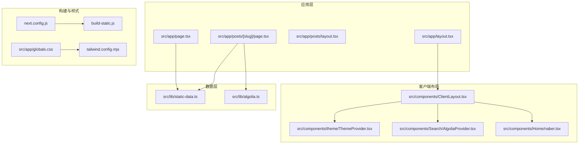
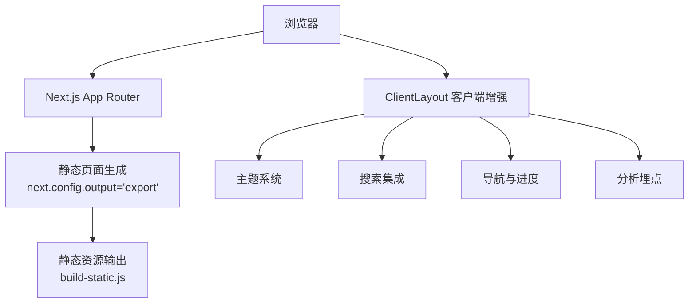
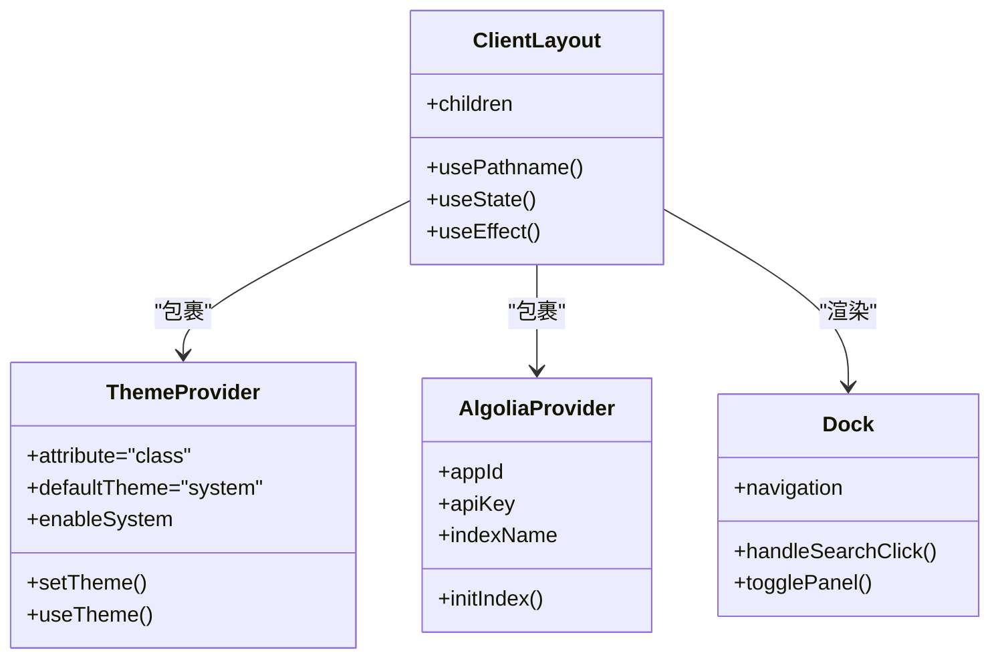
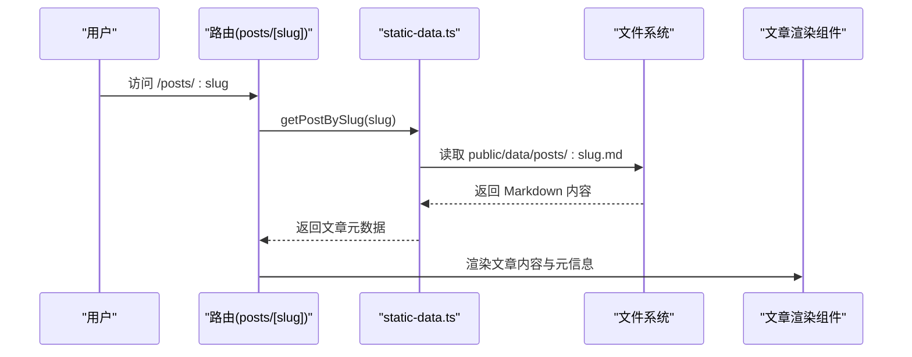
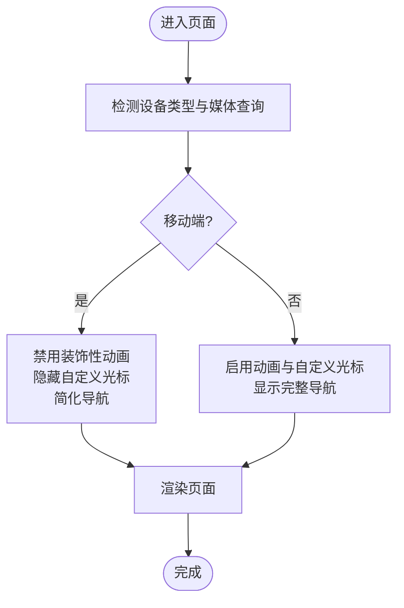
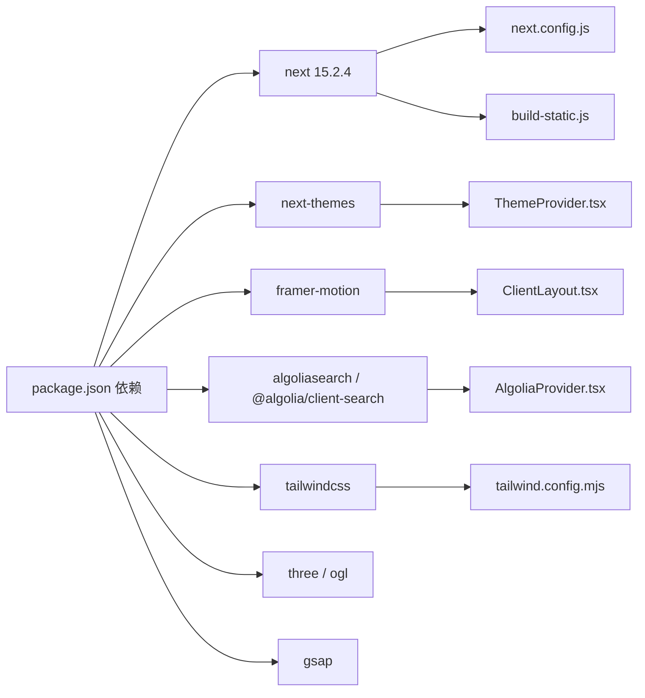

# 整体架构模式

<cite>
**本文档引用的文件**
- [package.json](file://blog-system2/frontend/package.json)
- [next.config.js](file://blog-system2/frontend/next.config.js)
- [src/app/layout.tsx](file://blog-system2/frontend/src/app/layout.tsx)
- [src/components/ClientLayout.tsx](file://blog-system2/frontend/src/components/ClientLayout.tsx)
- [src/lib/static-data.ts](file://blog-system2/frontend/src/lib/static-data.ts)
- [src/app/page.tsx](file://blog-system2/frontend/src/app/page.tsx)
- [src/app/posts/layout.tsx](file://blog-system2/frontend/src/app/posts/layout.tsx)
- [src/app/posts/[slug]/page.tsx](file://blog-system2/frontend/src/app/posts/[slug]/page.tsx)
- [src/components/theme/ThemeProvider.tsx](file://blog-system2/frontend/src/components/theme/ThemeProvider.tsx)
- [src/components/Search/AlgoliaProvider.tsx](file://blog-system2/frontend/src/components/Search/AlgoliaProvider.tsx)
- [src/lib/algolia.ts](file://blog-system2/frontend/src/lib/algolia.ts)
- [src/components/Home/naber.tsx](file://blog-system2/frontend/src/components/Home/naber.tsx)
- [src/app/globals.css](file://blog-system2/frontend/src/app/globals.css)
- [tailwind.config.mjs](file://blog-system2/frontend/tailwind.config.mjs)
- [build-static.js](file://blog-system2/frontend/build-static.js)
</cite>

## 目录
1. [引言](#引言)
2. [项目结构](#项目结构)
3. [核心组件](#核心组件)
4. [架构总览](#架构总览)
5. [详细组件分析](#详细组件分析)
6. [依赖关系分析](#依赖关系分析)
7. [性能考量](#性能考量)
8. [故障排查指南](#故障排查指南)
9. [结论](#结论)
10. [附录](#附录)

## 引言
本文件面向技术博客平台的整体架构模式，围绕基于 Next.js 15.2.4 的现代前端体系，系统阐述 App Router 路由、静态站点生成（SSG）实现原理与性能优化策略；深入解析客户端布局（ClientLayout）设计理念与职责划分（主题管理、搜索集成、导航系统、全局状态管理）；梳理组件层次结构（从根布局到功能组件）的设计原则；说明数据流管理模式（静态数据访问层与动态内容处理机制）；给出响应式与移动端适配策略；并提供系统边界、技术选型依据与架构演进规划。

## 项目结构
该前端采用 Next.js App Router 结构，核心目录组织如下：
- 应用入口与根布局：src/app 下的 layout.tsx、page.tsx 等
- 客户端布局与全局行为：src/components/ClientLayout.tsx
- 数据访问层：src/lib/static-data.ts（本地 JSON 索引 + 文件系统读取）
- 功能页面：posts/[slug]/page.tsx、posts/layout.tsx 等
- 主题与搜索：src/components/theme/ThemeProvider.tsx、src/components/Search/AlgoliaProvider.tsx
- 样式与响应式：src/app/globals.css、tailwind.config.mjs
- SSG 构建脚本：build-static.js

**图表来源**
- [src/app/layout.tsx:1-48](file://blog-system2/frontend/src/app/layout.tsx#L1-L48)
- [src/components/ClientLayout.tsx:1-63](file://blog-system2/frontend/src/components/ClientLayout.tsx#L1-L63)
- [src/lib/static-data.ts:1-214](file://blog-system2/frontend/src/lib/static-data.ts#L1-L214)
- [src/app/page.tsx:1-800](file://blog-system2/frontend/src/app/page.tsx#L1-L800)
- [src/app/posts/[slug]/page.tsx](file://blog-system2/frontend/src/app/posts/[slug]/page.tsx#L1-L304)
- [src/components/theme/ThemeProvider.tsx:1-161](file://blog-system2/frontend/src/components/theme/ThemeProvider.tsx#L1-L161)
- [src/components/Search/AlgoliaProvider.tsx:1-100](file://blog-system2/frontend/src/components/Search/AlgoliaProvider.tsx#L1-L100)
- [src/lib/algolia.ts:1-46](file://blog-system2/frontend/src/lib/algolia.ts#L1-L46)
- [next.config.js:1-48](file://blog-system2/frontend/next.config.js#L1-L48)
- [src/app/globals.css:1-681](file://blog-system2/frontend/src/app/globals.css#L1-L681)
- [tailwind.config.mjs:1-18](file://blog-system2/frontend/tailwind.config.mjs#L1-L18)
- [build-static.js:1-141](file://blog-system2/frontend/build-static.js#L1-L141)

**章节来源**
- [src/app/layout.tsx:1-48](file://blog-system2/frontend/src/app/layout.tsx#L1-L48)
- [next.config.js:1-48](file://blog-system2/frontend/next.config.js#L1-L48)

## 核心组件
- 根布局与元数据：负责注入字体、viewport、全局样式与 ClientLayout 包裹
- 客户端布局：统一承载主题、搜索、导航、光标特效、页面过渡与分析埋点
- 静态数据访问层：通过本地 JSON 索引与文件系统读取实现 SSG 场景下的数据获取
- 动态内容处理：文章详情页按 slug 读取 Markdown 内容并渲染
- 搜索集成：Algolia Provider 提供搜索客户端初始化与索引绑定
- 主题系统：支持自动/手动切换、时间感知切换、减少动效偏好与过渡动画

**章节来源**
- [src/components/ClientLayout.tsx:1-63](file://blog-system2/frontend/src/components/ClientLayout.tsx#L1-L63)
- [src/lib/static-data.ts:1-214](file://blog-system2/frontend/src/lib/static-data.ts#L1-L214)
- [src/app/posts/[slug]/page.tsx](file://blog-system2/frontend/src/app/posts/[slug]/page.tsx#L1-L304)
- [src/components/Search/AlgoliaProvider.tsx:1-100](file://blog-system2/frontend/src/components/Search/AlgoliaProvider.tsx#L1-L100)
- [src/components/theme/ThemeProvider.tsx:1-161](file://blog-system2/frontend/src/components/theme/ThemeProvider.tsx#L1-L161)

## 架构总览
系统采用“服务端渲染 + 客户端增强”的混合模式：
- App Router 路由：页面级路由与动态段（如 [slug]）
- SSG 实现：next.config.js 输出 export 模式，配合自定义构建脚本复制静态资源
- 客户端增强：ClientLayout 注入主题、搜索、导航、动画与分析
- 数据访问：静态数据通过本地 JSON 索引 + 文件系统读取，动态内容通过 Algolia 搜索

**图表来源**
- [next.config.js:6-11](file://blog-system2/frontend/next.config.js#L6-L11)
- [build-static.js:33-87](file://blog-system2/frontend/build-static.js#L33-L87)
- [src/components/ClientLayout.tsx:28-61](file://blog-system2/frontend/src/components/ClientLayout.tsx#L28-L61)

## 详细组件分析

### 客户端布局（ClientLayout）设计与职责
- 设计理念：以“最小 Hydration”为原则，在根布局注入 ClientLayout，集中处理主题、搜索、导航、动画与分析，确保首屏性能与一致性
- 职责划分：
  - 主题管理：ThemeProvider 提供主题切换、自动模式与减少动效偏好处理
  - 搜索集成：AlgoliaProvider 初始化搜索客户端并暴露索引
  - 导航系统：Dock 组件提供桌面/移动端导航、搜索触发与进度指示
  - 全局状态管理：使用 Framer Motion 实现页面过渡动画，TargetCursor 自定义光标，NavigationProgress 进度条
  - 分析埋点：Vercel Analytics 与 Speed Insights
- 响应式策略：根据设备媒体查询与 matchMedia 判断移动端，禁用部分动画与自定义光标，提升移动端体验

**图表来源**
- [src/components/ClientLayout.tsx:16-62](file://blog-system2/frontend/src/components/ClientLayout.tsx#L16-L62)
- [src/components/theme/ThemeProvider.tsx:40-63](file://blog-system2/frontend/src/components/theme/ThemeProvider.tsx#L40-L63)
- [src/components/Search/AlgoliaProvider.tsx:22-99](file://blog-system2/frontend/src/components/Search/AlgoliaProvider.tsx#L22-L99)
- [src/components/Home/naber.tsx:38-536](file://blog-system2/frontend/src/components/Home/naber.tsx#L38-L536)

**章节来源**
- [src/components/ClientLayout.tsx:1-63](file://blog-system2/frontend/src/components/ClientLayout.tsx#L1-L63)
- [src/components/theme/ThemeProvider.tsx:1-161](file://blog-system2/frontend/src/components/theme/ThemeProvider.tsx#L1-L161)
- [src/components/Search/AlgoliaProvider.tsx:1-100](file://blog-system2/frontend/src/components/Search/AlgoliaProvider.tsx#L1-L100)
- [src/components/Home/naber.tsx:1-818](file://blog-system2/frontend/src/components/Home/naber.tsx#L1-L818)

### 数据流管理模式
- 静态数据访问层（static-data.ts）：
  - 读取 public/data 下的 index.json，构建文章/通知/资源索引
  - 提供分页、排序、过滤、相关文章推荐等方法
  - 文章详情页通过 slug 从文件系统读取 Markdown 内容
- 动态内容处理（Algolia）：
  - AlgoliaProvider 在客户端初始化搜索客户端并绑定索引
  - algolia.ts 封装搜索调用，返回高亮字段与命中结果
- 数据流序列：

**图表来源**
- [src/app/posts/[slug]/page.tsx](file://blog-system2/frontend/src/app/posts/[slug]/page.tsx#L66-L90)
- [src/lib/static-data.ts:85-89](file://blog-system2/frontend/src/lib/static-data.ts#L85-L89)

**章节来源**
- [src/lib/static-data.ts:1-214](file://blog-system2/frontend/src/lib/static-data.ts#L1-L214)
- [src/app/posts/[slug]/page.tsx](file://blog-system2/frontend/src/app/posts/[slug]/page.tsx#L1-L304)
- [src/lib/algolia.ts:1-46](file://blog-system2/frontend/src/lib/algolia.ts#L1-L46)
- [src/components/Search/AlgoliaProvider.tsx:1-100](file://blog-system2/frontend/src/components/Search/AlgoliaProvider.tsx#L1-L100)

### 组件层次结构设计原则
- 根布局：注入字体、viewport、全局样式与 ClientLayout
- 页面布局：按功能域拆分（posts、notices、resources、about），每个域可拥有独立 layout
- 客户端增强：ClientLayout 作为全局容器，统一主题、搜索、导航与动画
- 功能组件：文章详情、列表、搜索模态框、主题切换、导航面板等模块化封装
- 设计原则：高内聚低耦合、职责单一、可复用性强、易于测试与维护

**章节来源**
- [src/app/layout.tsx:1-48](file://blog-system2/frontend/src/app/layout.tsx#L1-L48)
- [src/app/posts/layout.tsx:1-15](file://blog-system2/frontend/src/app/posts/layout.tsx#L1-L15)
- [src/components/ClientLayout.tsx:1-63](file://blog-system2/frontend/src/components/ClientLayout.tsx#L1-L63)

### 响应式设计与移动端适配
- Tailwind 配置：content 覆盖 app、components、pages，darkMode 为 class
- 全局样式：针对移动端禁用装饰性动画与自定义光标，简化交互
- 导航：桌面端显示完整导航与搜索/主题区域，移动端使用浮动面板与进度计数器
- 动画：根据 prefers-reduced-motion 与设备类型动态启用/禁用动画

**图表来源**
- [src/app/globals.css:608-681](file://blog-system2/frontend/src/app/globals.css#L608-L681)
- [src/components/ClientLayout.tsx:24-26](file://blog-system2/frontend/src/components/ClientLayout.tsx#L24-L26)
- [src/components/Home/naber.tsx:439-517](file://blog-system2/frontend/src/components/Home/naber.tsx#L439-L517)

**章节来源**
- [tailwind.config.mjs:1-18](file://blog-system2/frontend/tailwind.config.mjs#L1-L18)
- [src/app/globals.css:1-681](file://blog-system2/frontend/src/app/globals.css#L1-L681)
- [src/components/Home/naber.tsx:1-818](file://blog-system2/frontend/src/components/Home/naber.tsx#L1-L818)

## 依赖关系分析
- Next.js 15.2.4：App Router、SSG、Image 优化、Script 加载策略
- 主题：next-themes + Framer Motion 动画
- 搜索：Algolia 客户端与 Next.js Script
- 动画与图形：Framer Motion、Three.js/OGL、GSAP
- 样式：Tailwind CSS + 自定义动画类
- 构建：Webpack 忽略 moment 本地化，SSG 输出 export，自定义复制脚本

**图表来源**
- [package.json:13-42](file://blog-system2/frontend/package.json#L13-L42)
- [next.config.js:35-44](file://blog-system2/frontend/next.config.js#L35-L44)
- [src/components/theme/ThemeProvider.tsx:1-161](file://blog-system2/frontend/src/components/theme/ThemeProvider.tsx#L1-L161)
- [src/components/ClientLayout.tsx:1-63](file://blog-system2/frontend/src/components/ClientLayout.tsx#L1-L63)
- [src/components/Search/AlgoliaProvider.tsx:1-100](file://blog-system2/frontend/src/components/Search/AlgoliaProvider.tsx#L1-L100)
- [tailwind.config.mjs:1-18](file://blog-system2/frontend/tailwind.config.mjs#L1-L18)

**章节来源**
- [package.json:1-72](file://blog-system2/frontend/package.json#L1-L72)
- [next.config.js:1-48](file://blog-system2/frontend/next.config.js#L1-L48)

## 性能考量
- SSG 与静态输出：next.config.output='export'，构建后通过 build-static.js 复制静态资源，适合 GitHub Pages 等静态托管
- 图像优化：images.unoptimized=true 且配置 domains，结合 WebP 格式与 deviceSizes/imageSizes
- 动画与渲染：移动端禁用装饰性动画，减少 GPU 压力；Hydration 后再启用必要动画
- 资源加载：Algolia Script 使用 afterInteractive 策略，避免阻塞首屏
- 构建优化：Webpack 忽略 moment 本地化，减小包体积

**章节来源**
- [next.config.js:20-44](file://blog-system2/frontend/next.config.js#L20-L44)
- [build-static.js:1-141](file://blog-system2/frontend/build-static.js#L1-L141)
- [src/app/globals.css:380-387](file://blog-system2/frontend/src/app/globals.css#L380-L387)

## 故障排查指南
- Algolia 初始化失败：
  - 检查 AlgoliaProvider 是否正确加载脚本并在 onLoad 中初始化索引
  - 确认 appId、apiKey、indexName 配置
- 主题切换异常：
  - 确认 ThemeProvider 已包裹 ClientLayout
  - 检查用户偏好与自动模式本地存储状态
- SSG 输出缺失：
  - 确认 next.config.output='export'
  - 运行 build-static.js 并检查复制逻辑
- Markdown 内容为空：
  - 检查 public/data/posts 下是否存在对应 slug.md
  - 确认 getPostBySlug 与 getAllPostSlugs 的索引构建

**章节来源**
- [src/components/Search/AlgoliaProvider.tsx:22-99](file://blog-system2/frontend/src/components/Search/AlgoliaProvider.tsx#L22-L99)
- [src/components/theme/ThemeProvider.tsx:65-149](file://blog-system2/frontend/src/components/theme/ThemeProvider.tsx#L65-L149)
- [next.config.js:6-11](file://blog-system2/frontend/next.config.js#L6-L11)
- [build-static.js:33-87](file://blog-system2/frontend/build-static.js#L33-L87)
- [src/lib/static-data.ts:18-30](file://blog-system2/frontend/src/lib/static-data.ts#L18-L30)

## 结论
该技术博客平台以 Next.js 15.2.4 为基础，采用 App Router 与 SSG 输出，结合客户端增强（主题、搜索、导航、动画与分析），形成“静态优先、客户端增强”的现代前端架构。通过模块化的数据访问层与清晰的组件层次结构，系统在保证性能的同时提供了良好的可维护性与扩展性。响应式与移动端适配策略进一步提升了跨设备体验。未来可考虑引入增量静态再生（ISR）以平衡静态生成与实时内容需求。

## 附录
- 系统边界：
  - 前端：Next.js App Router、静态资源、客户端增强
  - 数据：public/data 下的 JSON 索引与 Markdown 文件
  - 搜索：Algolia 服务端索引与客户端检索
- 技术选型依据：
  - Next.js App Router：现代化路由与 SSR/SSG 能力
  - SSG：静态托管友好、SEO 友好、性能稳定
  - Tailwind：原子化样式与响应式能力
  - Framer Motion：流畅动画与过渡
  - Algolia：高性能搜索与可扩展性
- 架构演进规划：
  - 引入 ISR：对高频更新内容采用增量更新
  - 组件库化：将通用 UI 组件沉淀为可复用包
  - 测试体系：补充组件与数据层单元测试
  - 监控与可观测性：结合 Vercel Analytics/SI 深化性能监控