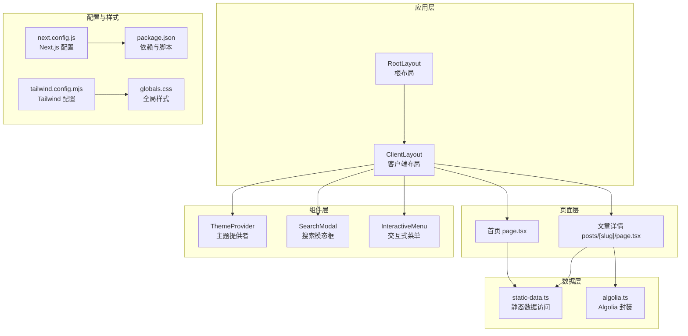
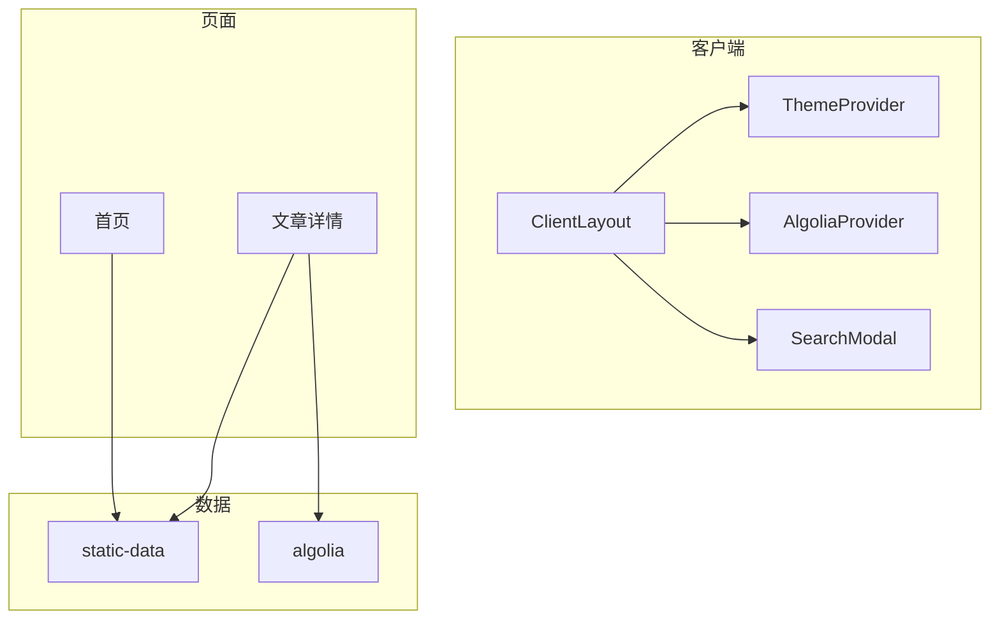
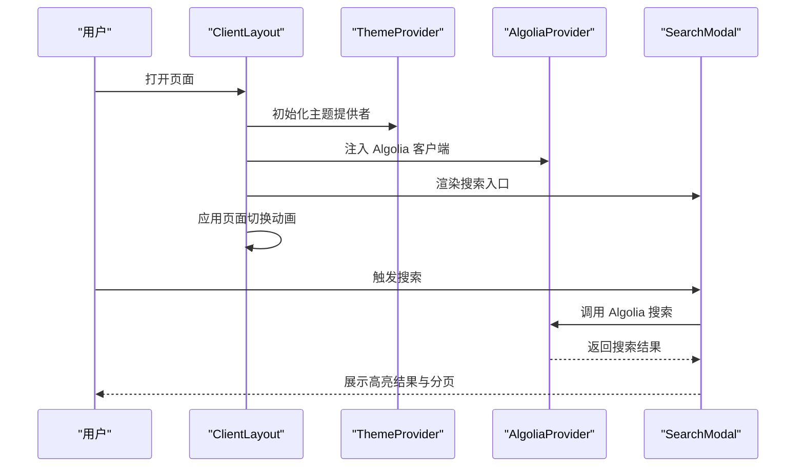
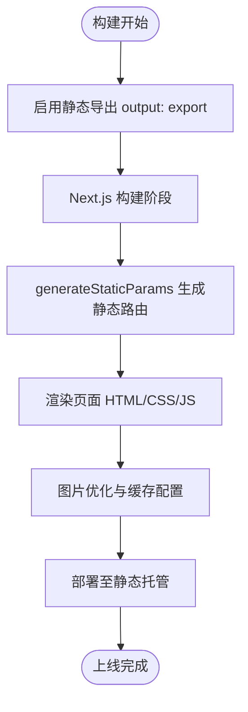
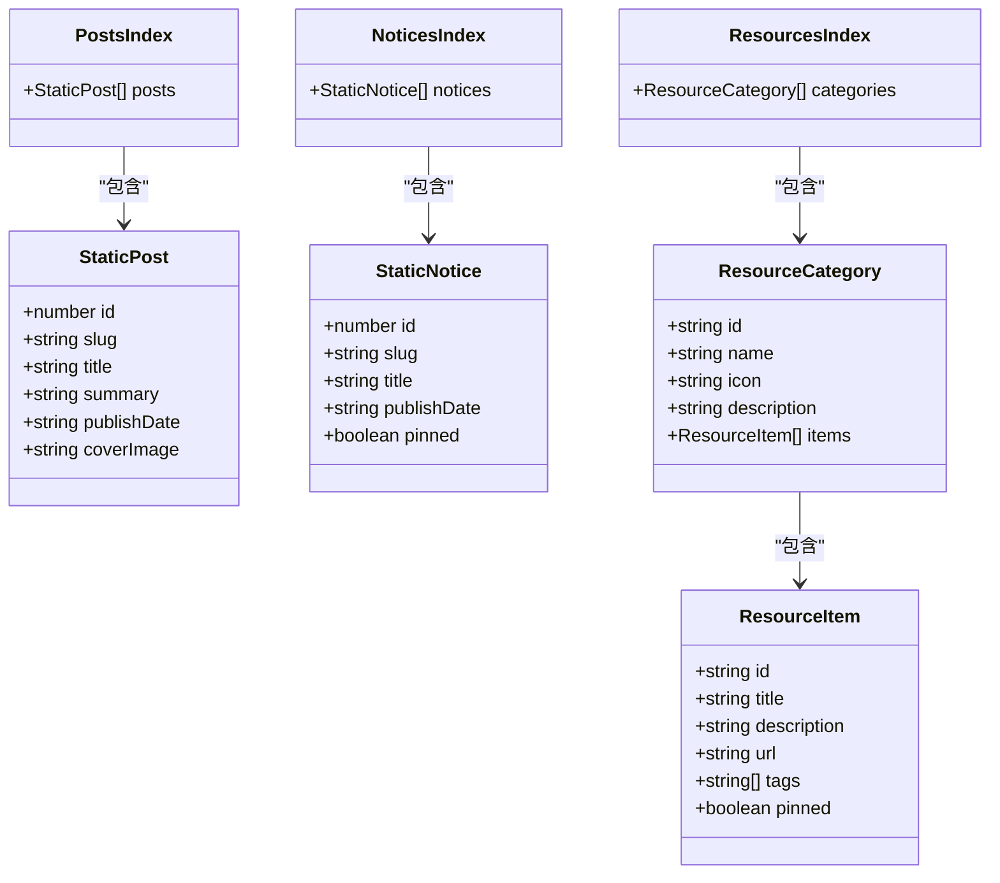
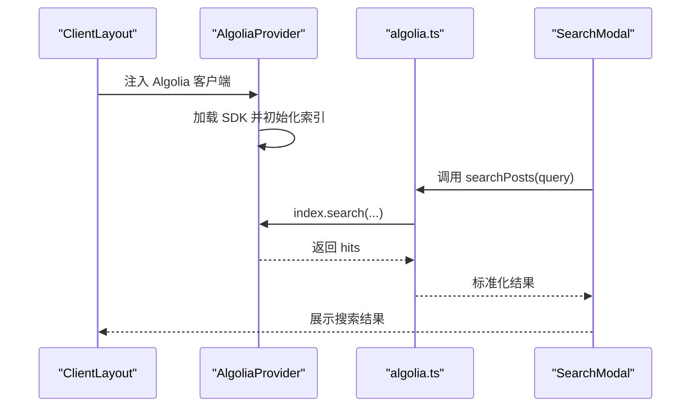
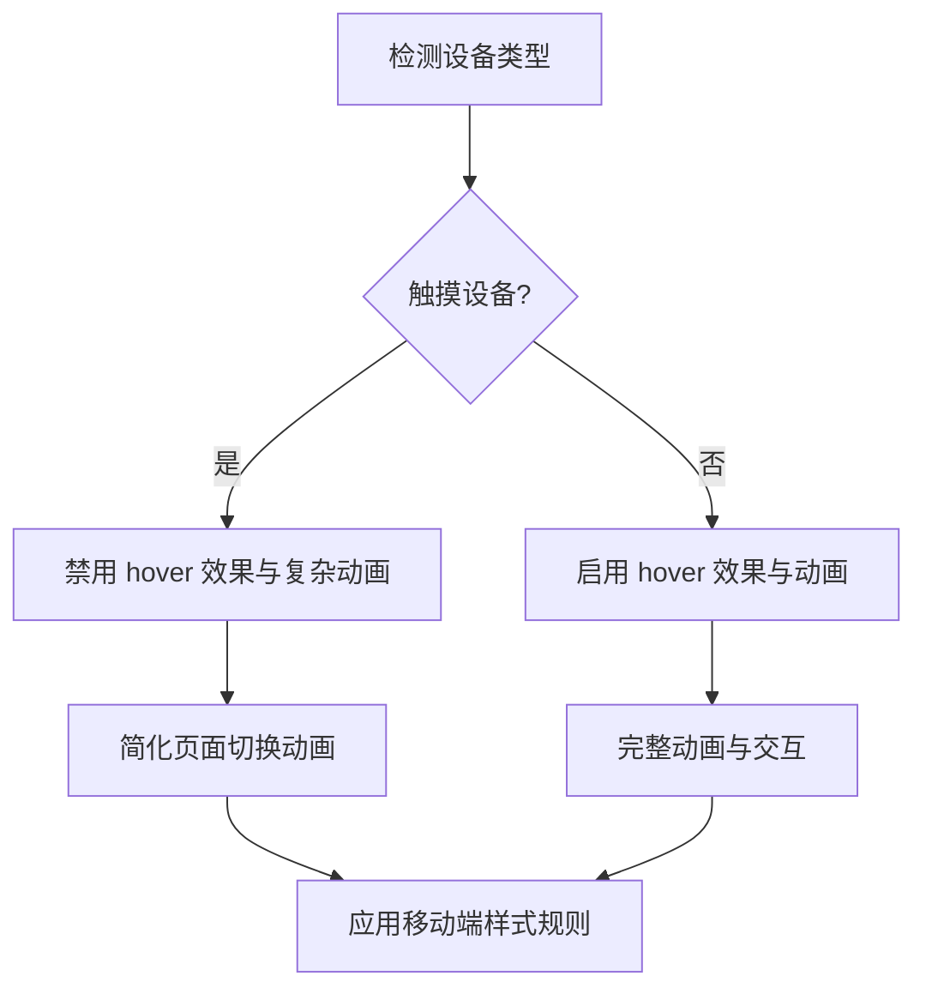
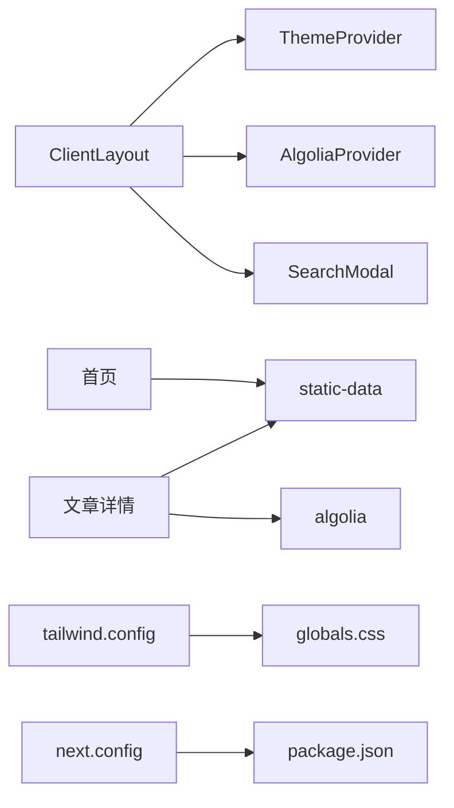

# 架构设计

<cite>
**本文引用的文件**
- [RootLayout](file://blog-system2/frontend/src/app/layout.tsx)
- [ClientLayout](file://blog-system2/frontend/src/components/ClientLayout.tsx)
- [静态数据访问层 static-data](file://blog-system2/frontend/src/lib/static-data.ts)
- [Algolia 搜索封装 algolia](file://blog-system2/frontend/src/lib/algolia.ts)
- [Algolia 提供者 AlgoliaProvider](file://blog-system2/frontend/src/components/Search/AlgoliaProvider.tsx)
- [Next.js 配置 next.config](file://blog-system2/frontend/next.config.js)
- [首页页面 page](file://blog-system2/frontend/src/app/page.tsx)
- [文章详情页 posts/[slug]/page](file://blog-system2/frontend/src/app/posts/[slug]/page.tsx)
- [主题提供者 ThemeProvider](file://blog-system2/frontend/src/components/theme/ThemeProvider.tsx)
- [搜索模态框 SearchModal](file://blog-system2/frontend/src/components/Search/SearchModal.tsx)
- [交互式菜单 InteractiveMenu](file://blog-system2/frontend/src/components/Home/InteractiveMenu.tsx)
- [工具函数 utils](file://blog-system2/frontend/src/lib/utils.ts)
- [Tailwind 配置 tailwind.config](file://blog-system2/frontend/tailwind.config.mjs)
- [全局样式 globals.css](file://blog-system2/frontend/src/app/globals.css)
- [包配置 package.json](file://blog-system2/frontend/package.json)
</cite>

## 目录
1. [引言](#引言)
2. [项目结构](#项目结构)
3. [核心组件](#核心组件)
4. [架构总览](#架构总览)
5. [详细组件分析](#详细组件分析)
6. [依赖关系分析](#依赖关系分析)
7. [性能考量](#性能考量)
8. [故障排查指南](#故障排查指南)
9. [结论](#结论)
10. [附录](#附录)

## 引言
本技术博客平台采用基于 Next.js App Router 的现代前端架构，结合组件化设计与数据流管理策略，构建了高性能、可扩展且具备良好用户体验的静态站点。系统通过静态站点生成（SSG）实现快速加载与稳定部署，并集成 Algolia 搜索服务与主题系统，支持深浅主题切换与自动模式。响应式设计覆盖桌面与移动端，确保在不同设备上的一致体验。

## 项目结构
项目采用按路由分层的目录组织方式，App Router 将页面、布局与元数据文件集中管理；组件层按功能域拆分，如主题、搜索、首页特效等；数据访问层统一处理静态数据与 Algolia 搜索；样式层使用 Tailwind CSS 与自定义动画变量，全局样式覆盖暗黑模式与移动端优化。

**图表来源**
- [RootLayout:28-47](file://blog-system2/frontend/src/app/layout.tsx#L28-L47)
- [ClientLayout:16-62](file://blog-system2/frontend/src/components/ClientLayout.tsx#L16-L62)
- [首页页面 page:22-800](file://blog-system2/frontend/src/app/page.tsx#L22-L800)
- [文章详情页 posts/[slug]/page](file://blog-system2/frontend/src/app/posts/[slug]/page.tsx#L66-L304)
- [静态数据访问层 static-data:32-90](file://blog-system2/frontend/src/lib/static-data.ts#L32-L90)
- [Algolia 搜索封装 algolia:28-46](file://blog-system2/frontend/src/lib/algolia.ts#L28-L46)
- [Next.js 配置 next.config:6-48](file://blog-system2/frontend/next.config.js#L6-L48)
- [Tailwind 配置 tailwind.config:4-18](file://blog-system2/frontend/tailwind.config.mjs#L4-L18)
- [全局样式 globals.css:1-681](file://blog-system2/frontend/src/app/globals.css#L1-L681)
- [包配置 package.json:1-72](file://blog-system2/frontend/package.json#L1-L72)

**章节来源**
- [RootLayout:1-48](file://blog-system2/frontend/src/app/layout.tsx#L1-L48)
- [ClientLayout:1-63](file://blog-system2/frontend/src/components/ClientLayout.tsx#L1-L63)
- [Next.js 配置 next.config:1-48](file://blog-system2/frontend/next.config.js#L1-L48)

## 核心组件
- 根布局与客户端布局
  - RootLayout 负责注入字体变量、viewport 设置与全局样式，包裹 ClientLayout。
  - ClientLayout 作为客户端根容器，负责主题提供、搜索提供者、导航进度条、全站分析与速度洞察、目标光标与页面切换动画。
- 数据访问层
  - static-data.ts 提供文章索引、最新文章、相关文章、通知与资源的静态数据读取与排序逻辑。
  - algolia.ts 封装 Algolia 客户端初始化与搜索调用，返回标准化结果。
- 搜索系统
  - AlgoliaProvider 注入 Algolia 客户端与索引，SearchModal 实现本地跨域搜索与结果高亮、分页与动画。
- 主题系统
  - ThemeProvider 支持时间驱动的自动主题切换、用户覆盖与无障碍“减少运动”偏好。
- 页面与组件
  - 首页 page.tsx 展示轮播、技术图标滚动、公告与文章列表等。
  - 文章详情页 posts/[slug]/page.tsx 渲染 Markdown 内容、目录、作者信息与相关文章。
  - 交互式菜单与目标光标增强移动端与桌面端交互体验。

**章节来源**
- [RootLayout:8-47](file://blog-system2/frontend/src/app/layout.tsx#L8-L47)
- [ClientLayout:28-62](file://blog-system2/frontend/src/components/ClientLayout.tsx#L28-L62)
- [静态数据访问层 static-data:32-214](file://blog-system2/frontend/src/lib/static-data.ts#L32-L214)
- [Algolia 搜索封装 algolia:1-46](file://blog-system2/frontend/src/lib/algolia.ts#L1-L46)
- [Algolia 提供者 AlgoliaProvider:22-99](file://blog-system2/frontend/src/components/Search/AlgoliaProvider.tsx#L22-L99)
- [主题提供者 ThemeProvider:40-161](file://blog-system2/frontend/src/components/theme/ThemeProvider.tsx#L40-L161)
- [首页页面 page:22-800](file://blog-system2/frontend/src/app/page.tsx#L22-L800)
- [文章详情页 posts/[slug]/page](file://blog-system2/frontend/src/app/posts/[slug]/page.tsx#L66-L304)
- [搜索模态框 SearchModal:22-935](file://blog-system2/frontend/src/components/Search/SearchModal.tsx#L22-L935)
- [交互式菜单 InteractiveMenu:16-72](file://blog-system2/frontend/src/components/Home/InteractiveMenu.tsx#L16-L72)

## 架构总览
系统采用“布局-页面-组件-数据”的分层架构，客户端布局统一承载主题、搜索与全局行为，页面层通过静态参数生成与异步数据读取完成内容渲染，数据层抽象静态与外部搜索能力，样式层通过 Tailwind 与自定义动画变量实现一致的视觉与交互体验。

**图表来源**
- [ClientLayout:28-62](file://blog-system2/frontend/src/components/ClientLayout.tsx#L28-L62)
- [首页页面 page:22-800](file://blog-system2/frontend/src/app/page.tsx#L22-L800)
- [文章详情页 posts/[slug]/page](file://blog-system2/frontend/src/app/posts/[slug]/page.tsx#L66-L304)
- [静态数据访问层 static-data:32-214](file://blog-system2/frontend/src/lib/static-data.ts#L32-L214)
- [Algolia 搜索封装 algolia:28-46](file://blog-system2/frontend/src/lib/algolia.ts#L28-L46)

## 详细组件分析

### 客户端布局 ClientLayout 设计
- 职责划分
  - 主题管理：ThemeProvider 提供深浅主题切换与自动模式。
  - 搜索集成：AlgoliaProvider 注入 Algolia 客户端，SearchModal 提供搜索入口与结果展示。
  - 导航与进度：NavigationProgress 提供页面切换进度反馈。
  - 动画与交互：Framer Motion 实现页面进入/退出动画；TargetCursor 自定义光标。
  - 全局分析：Vercel Analytics 与 Speed Insights。
- 移动端适配
  - 通过媒体查询识别触摸设备，禁用 hover 效果与复杂动画，恢复系统光标。
- 页面切换动画
  - 使用 AnimatePresence 与 motion.main 实现淡入淡出与模糊缩放过渡，移动端简化动画。

**图表来源**
- [ClientLayout:28-62](file://blog-system2/frontend/src/components/ClientLayout.tsx#L28-L62)
- [Algolia 提供者 AlgoliaProvider:22-99](file://blog-system2/frontend/src/components/Search/AlgoliaProvider.tsx#L22-L99)
- [搜索模态框 SearchModal:301-428](file://blog-system2/frontend/src/components/Search/SearchModal.tsx#L301-L428)

**章节来源**
- [ClientLayout:16-62](file://blog-system2/frontend/src/components/ClientLayout.tsx#L16-L62)
- [全局样式 globals.css:608-681](file://blog-system2/frontend/src/app/globals.css#L608-L681)

### 静态站点生成（SSG）与性能优势
- SSG 实现
  - next.config.js 启用 output: export，生成静态文件，适合 GitHub Pages 等静态托管。
  - 首页与文章详情页使用动态参数生成与异步数据读取，保证内容新鲜度与性能。
- 性能优势
  - 静态预渲染降低首屏延迟，减少服务器压力；图片优化与缓存策略提升加载速度。
  - 移动端禁用复杂动画与粒子效果，显著降低 GPU 占用与内存消耗。

**图表来源**
- [Next.js 配置 next.config:6-48](file://blog-system2/frontend/next.config.js#L6-L48)
- [首页页面 page:20-21](file://blog-system2/frontend/src/app/page.tsx#L20-L21)
- [文章详情页 posts/[slug]/page](file://blog-system2/frontend/src/app/posts/[slug]/page.tsx#L32-L37)

**章节来源**
- [Next.js 配置 next.config:1-48](file://blog-system2/frontend/next.config.js#L1-L48)
- [首页页面 page:20-21](file://blog-system2/frontend/src/app/page.tsx#L20-L21)
- [文章详情页 posts/[slug]/page](file://blog-system2/frontend/src/app/posts/[slug]/page.tsx#L32-L37)

### 数据访问层与静态数据处理
- 静态数据结构
  - 文章索引：包含 id、slug、title、summary、publishDate、coverImage。
  - 通知索引：包含 id、slug、title、publishDate、pinned。
  - 资源索引：分类与条目，支持标签与置顶。
- 查询与排序
  - getPosts 支持分页与按发布时间倒序。
  - getLatestPostsByIdDesc 按 id 倒序取最新若干篇。
  - getRelatedPosts 基于发布时间筛选相关文章。
  - getNotices 支持置顶优先与日期倒序。
- 资源读取
  - getResources 直接读取资源索引 JSON。

**图表来源**
- [静态数据访问层 static-data:4-214](file://blog-system2/frontend/src/lib/static-data.ts#L4-L214)

**章节来源**
- [静态数据访问层 static-data:32-214](file://blog-system2/frontend/src/lib/static-data.ts#L32-L214)

### Algolia 搜索集成方案
- 客户端注入
  - AlgoliaProvider 通过 Next.js Script 与备用脚本加载 Algolia SDK，并初始化索引。
  - 支持手动初始化与延迟检查，确保脚本加载完成后可用。
- 搜索封装
  - algolia.ts 读取环境变量（占位符），创建 Algolia 客户端并封装搜索方法，限制返回字段与高亮。
- 本地搜索（SearchModal）
  - 支持跨域读取 index.json，对文章、通知、资源与关于页面进行关键词匹配与去重。
  - 结果高亮、分页与动画效果，移动端跳过 Canvas 动画以优化性能。

**图表来源**
- [Algolia 提供者 AlgoliaProvider:22-99](file://blog-system2/frontend/src/components/Search/AlgoliaProvider.tsx#L22-L99)
- [Algolia 搜索封装 algolia:28-46](file://blog-system2/frontend/src/lib/algolia.ts#L28-L46)
- [搜索模态框 SearchModal:301-428](file://blog-system2/frontend/src/components/Search/SearchModal.tsx#L301-L428)

**章节来源**
- [Algolia 提供者 AlgoliaProvider:22-99](file://blog-system2/frontend/src/components/Search/AlgoliaProvider.tsx#L22-L99)
- [Algolia 搜索封装 algolia:1-46](file://blog-system2/frontend/src/lib/algolia.ts#L1-L46)
- [搜索模态框 SearchModal:301-428](file://blog-system2/frontend/src/components/Search/SearchModal.tsx#L301-L428)

### 响应式设计与移动端适配
- 设备检测
  - 通过媒体查询与 matchMedia 判断触摸设备，动态调整交互与动画。
- 样式优化
  - 移动端禁用持续动画与粒子效果，隐藏自定义光标与装饰元素，简化滚动与交互。
  - Tailwind 配置启用暗黑模式类选择器，全局样式覆盖移动端断点与过渡优化。
- 组件适配
  - InteractiveMenu 在触摸设备下禁用 hover 效果，保持简洁交互。
  - ClientLayout 对移动端页面切换动画进行简化，避免性能损耗。

**图表来源**
- [ClientLayout:24-26](file://blog-system2/frontend/src/components/ClientLayout.tsx#L24-L26)
- [全局样式 globals.css:608-681](file://blog-system2/frontend/src/app/globals.css#L608-L681)
- [交互式菜单 InteractiveMenu:21-23](file://blog-system2/frontend/src/components/Home/InteractiveMenu.tsx#L21-L23)

**章节来源**
- [ClientLayout:24-26](file://blog-system2/frontend/src/components/ClientLayout.tsx#L24-L26)
- [全局样式 globals.css:608-681](file://blog-system2/frontend/src/app/globals.css#L608-L681)
- [交互式菜单 InteractiveMenu:16-72](file://blog-system2/frontend/src/components/Home/InteractiveMenu.tsx#L16-L72)

## 依赖关系分析
- 组件耦合
  - ClientLayout 作为顶层容器，聚合主题、搜索与全局行为，与其他页面组件解耦。
  - 页面组件仅依赖数据访问层与通用组件，降低跨页面耦合。
- 外部依赖
  - Next.js App Router、Framer Motion、next-themes、Algolia SDK、Vercel Analytics/Speed Insights。
- 循环依赖
  - 未发现循环依赖迹象；数据层与组件层通过函数调用解耦。

**图表来源**
- [ClientLayout:28-62](file://blog-system2/frontend/src/components/ClientLayout.tsx#L28-L62)
- [首页页面 page:22-800](file://blog-system2/frontend/src/app/page.tsx#L22-L800)
- [文章详情页 posts/[slug]/page](file://blog-system2/frontend/src/app/posts/[slug]/page.tsx#L66-L304)
- [静态数据访问层 static-data:32-214](file://blog-system2/frontend/src/lib/static-data.ts#L32-L214)
- [Algolia 搜索封装 algolia:28-46](file://blog-system2/frontend/src/lib/algolia.ts#L28-L46)
- [Tailwind 配置 tailwind.config:4-18](file://blog-system2/frontend/tailwind.config.mjs#L4-L18)
- [全局样式 globals.css:1-681](file://blog-system2/frontend/src/app/globals.css#L1-L681)
- [Next.js 配置 next.config:6-48](file://blog-system2/frontend/next.config.js#L6-L48)
- [包配置 package.json:1-72](file://blog-system2/frontend/package.json#L1-L72)

**章节来源**
- [包配置 package.json:13-43](file://blog-system2/frontend/package.json#L13-L43)
- [Next.js 配置 next.config:1-48](file://blog-system2/frontend/next.config.js#L1-L48)

## 性能考量
- 静态导出与缓存
  - 使用 next.config.js 的 unoptimized 与 domains 配置优化图片加载；设置最小缓存 TTL。
- 动画与渲染
  - 移动端禁用复杂动画与粒子效果，减少 GPU 与内存占用；尊重“减少运动”偏好。
- 搜索性能
  - Algolia 客户端在浏览器端执行搜索，减少后端压力；SearchModal 本地跨域读取索引 JSON 作为补充。
- 构建与部署
  - 提供 build-static 与 build:github 脚本，适配静态托管与路径前缀。

**章节来源**
- [Next.js 配置 next.config:20-33](file://blog-system2/frontend/next.config.js#L20-L33)
- [全局样式 globals.css:367-374](file://blog-system2/frontend/src/app/globals.css#L367-L374)
- [搜索模态框 SearchModal:322-341](file://blog-system2/frontend/src/components/Search/SearchModal.tsx#L322-L341)
- [包配置 package.json:5-12](file://blog-system2/frontend/package.json#L5-L12)

## 故障排查指南
- Algolia 初始化失败
  - 检查 AlgoliaProvider 是否正确加载 SDK 与初始化索引；确认网络与域名白名单。
- 搜索无结果或报错
  - 确认 index.json 可跨域访问；检查 SearchModal 的 fetch 请求与错误处理。
- 主题切换异常
  - 检查 ThemeProvider 的事件监听与本地存储状态；确认“减少运动”偏好影响。
- 移动端交互问题
  - 确认触摸设备检测逻辑；检查移动端样式覆盖与动画禁用规则。

**章节来源**
- [Algolia 提供者 AlgoliaProvider:29-70](file://blog-system2/frontend/src/components/Search/AlgoliaProvider.tsx#L29-L70)
- [搜索模态框 SearchModal:415-428](file://blog-system2/frontend/src/components/Search/SearchModal.tsx#L415-L428)
- [主题提供者 ThemeProvider:103-149](file://blog-system2/frontend/src/components/theme/ThemeProvider.tsx#L103-L149)
- [全局样式 globals.css:608-681](file://blog-system2/frontend/src/app/globals.css#L608-L681)

## 结论
该技术博客平台通过 Next.js App Router 与组件化架构实现了清晰的职责分离与良好的可维护性；静态站点生成确保了出色的性能与稳定性；Algolia 搜索与主题系统提升了用户体验；响应式设计与移动端优化保障了多端一致性。建议持续关注静态数据更新流程与搜索索引维护，以保持内容的新鲜度与检索质量。

## 附录
- 关键配置与脚本
  - next.config.js：静态导出、图片优化、路径前缀与忽略构建错误。
  - package.json：依赖管理与构建脚本（build、build:static、build:github）。
- 工具函数
  - utils.ts：类名合并工具，配合 Tailwind 使用。

**章节来源**
- [Next.js 配置 next.config:1-48](file://blog-system2/frontend/next.config.js#L1-L48)
- [包配置 package.json:5-12](file://blog-system2/frontend/package.json#L5-L12)
- [工具函数 utils:1-7](file://blog-system2/frontend/src/lib/utils.ts#L1-L7)