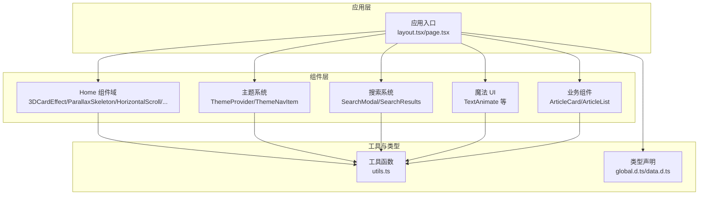
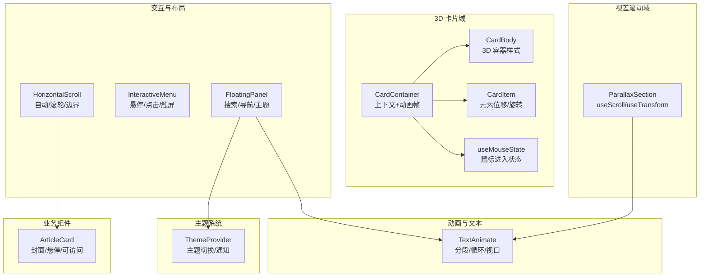
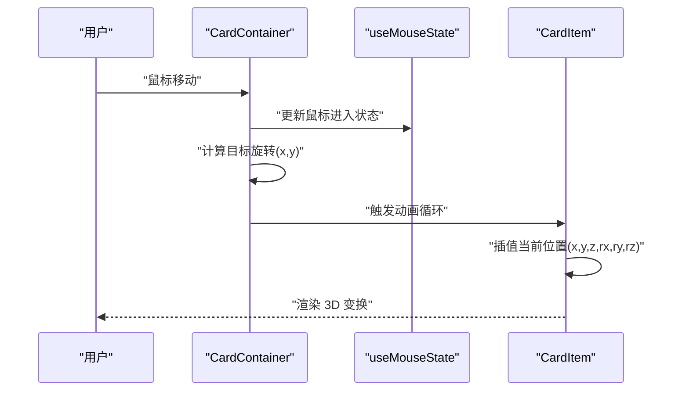
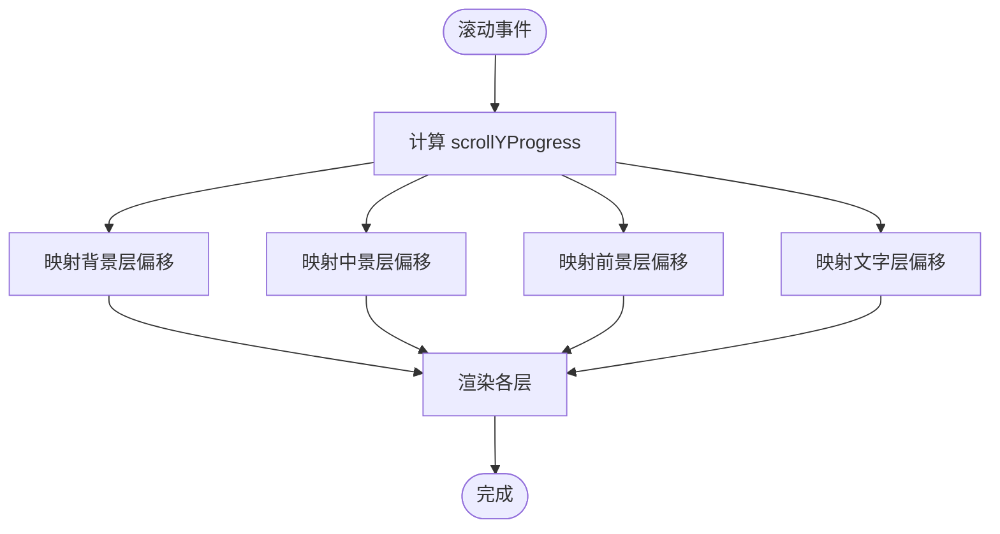
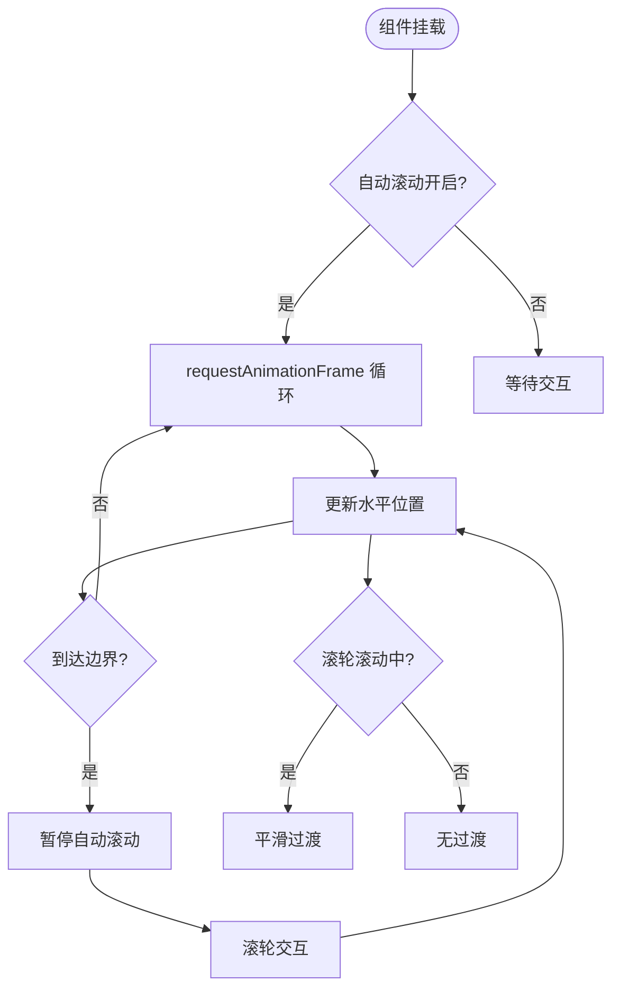
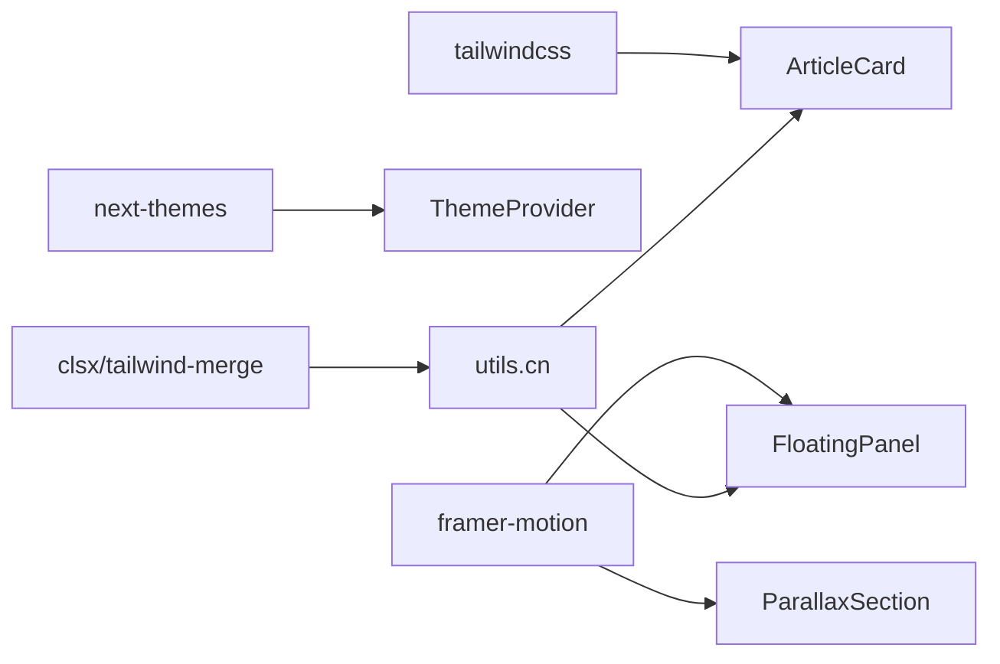

# 组件系统设计

<cite>
**本文档引用的文件**
- [CardContainer.tsx](file://blog-system2/frontend/src/components/Home/3DCardEffect/CardContainer.tsx)
- [CardBody.tsx](file://blog-system2/frontend/src/components/Home/3DCardEffect/CardBody.tsx)
- [CardItem.tsx](file://blog-system2/frontend/src/components/Home/3DCardEffect/CardItem.tsx)
- [useMouseState.ts](file://blog-system2/frontend/src/components/Home/3DCardEffect/useMouseState.ts)
- [ParallaxSection.tsx](file://blog-system2/frontend/src/components/Home/ParallaxSkeleton/ParallaxSection.tsx)
- [HorizontalScroll.tsx](file://blog-system2/frontend/src/components/Home/HorizontalScroll/HorizontalScroll.tsx)
- [HorizontalScroller.module.css](file://blog-system2/frontend/src/components/Home/HorizontalScroll/HorizontalScroller.module.css)
- [InteractiveMenu.tsx](file://blog-system2/frontend/src/components/Home/InteractiveMenu.tsx)
- [FloatingPanel.tsx](file://blog-system2/frontend/src/components/Home/FloatingPanel.tsx)
- [TextAnimate.tsx](file://blog-system2/frontend/src/components/magicui/text-animate.tsx)
- [ArticleCard.tsx](file://blog-system2/frontend/src/components/ArticleCard.tsx)
- [ThemeProvider.tsx](file://blog-system2/frontend/src/components/theme/ThemeProvider.tsx)
- [utils.ts](file://blog-system2/frontend/src/lib/utils.ts)
- [package.json](file://blog-system2/frontend/package.json)
- [tsconfig.json](file://blog-system2/frontend/tsconfig.json)
- [tailwind.config.mjs](file://blog-system2/frontend/tailwind.config.mjs)
</cite>

## 目录
1. [引言](#引言)
2. [项目结构](#项目结构)
3. [核心组件](#核心组件)
4. [架构总览](#架构总览)
5. [组件详细分析](#组件详细分析)
6. [依赖关系分析](#依赖关系分析)
7. [性能考量](#性能考量)
8. [故障排查指南](#故障排查指南)
9. [结论](#结论)
10. [附录](#附录)

## 引言
本设计文档面向技术博客平台的前端组件系统，围绕基于 React 的组件化架构进行系统化梳理。重点覆盖以下方面：
- 可复用组件的设计原则与命名规范
- 组件层次结构：从基础 UI 组件到业务功能组件的组织方式
- 特效组件实现原理：3D 卡片、视差滚动、交互菜单、文本动画、浮动面板等
- 组件间通信机制：props 传递、事件处理、状态共享
- 生命周期管理与性能优化策略
- 可扩展性与定制化能力
- 组件开发最佳实践与代码规范
- 组件测试策略与调试方法

## 项目结构
前端采用 Next.js 应用程序目录结构，组件按功能域分层组织：
- src/app：页面级路由与布局
- src/components：通用组件库，按功能域划分（Home、Search、theme、magicui、post、resources 等）
- src/lib：工具函数与第三方集成
- src/types：全局类型声明
- 样式与主题：Tailwind CSS、CSS Modules、主题提供者

图表来源
- [package.json:13-42](file://blog-system2/frontend/package.json#L13-L42)
- [tsconfig.json:21-28](file://blog-system2/frontend/tsconfig.json#L21-L28)
- [tailwind.config.mjs:4-15](file://blog-system2/frontend/tailwind.config.mjs#L4-L15)

章节来源
- [package.json:1-72](file://blog-system2/frontend/package.json#L1-L72)
- [tsconfig.json:1-42](file://blog-system2/frontend/tsconfig.json#L1-L42)
- [tailwind.config.mjs:1-18](file://blog-system2/frontend/tailwind.config.mjs#L1-L18)

## 核心组件
本节概述关键组件及其职责与协作关系。

- 3D 卡片系统：CardContainer、CardBody、CardItem 通过上下文与动画帧循环实现鼠标跟随的 3D 效果
- 视差滚动：ParallaxSection 基于 Framer Motion 的 useScroll/useTransform 实现多层视差
- 水平滚动：HorizontalScroll 支持自动滚动、滚轮控制、边界检测与响应式边框
- 交互菜单：InteractiveMenu 提供悬停/点击反馈与触屏适配
- 浮动面板：FloatingPanel 集成搜索、导航与主题切换，使用动画与背景装饰
- 文本动画：TextAnimate 提供多种分段动画与循环控制
- 文章卡片：ArticleCard 封装封面图处理、悬停效果与可访问性
- 主题系统：ThemeProvider 管理主题切换与通知

章节来源
- [CardContainer.tsx:19-121](file://blog-system2/frontend/src/components/Home/3DCardEffect/CardContainer.tsx#L19-L121)
- [CardBody.tsx:12-30](file://blog-system2/frontend/src/components/Home/3DCardEffect/CardBody.tsx#L12-L30)
- [CardItem.tsx:34-136](file://blog-system2/frontend/src/components/Home/3DCardEffect/CardItem.tsx#L34-L136)
- [ParallaxSection.tsx:9-197](file://blog-system2/frontend/src/components/Home/ParallaxSkeleton/ParallaxSection.tsx#L9-L197)
- [HorizontalScroll.tsx:26-386](file://blog-system2/frontend/src/components/Home/HorizontalScroll/HorizontalScroll.tsx#L26-L386)
- [InteractiveMenu.tsx:16-72](file://blog-system2/frontend/src/components/Home/InteractiveMenu.tsx#L16-L72)
- [FloatingPanel.tsx:25-437](file://blog-system2/frontend/src/components/Home/FloatingPanel.tsx#L25-L437)
- [TextAnimate.tsx:308-474](file://blog-system2/frontend/src/components/magicui/text-animate.tsx#L308-L474)
- [ArticleCard.tsx:29-198](file://blog-system2/frontend/src/components/ArticleCard.tsx#L29-L198)
- [ThemeProvider.tsx:40-161](file://blog-system2/frontend/src/components/theme/ThemeProvider.tsx#L40-L161)

## 架构总览
组件系统遵循“分层解耦、按域组织”的设计原则，通过上下文、状态钩子与第三方动画库实现复杂交互与视觉效果。

图表来源
- [CardContainer.tsx:6-121](file://blog-system2/frontend/src/components/Home/3DCardEffect/CardContainer.tsx#L6-L121)
- [CardItem.tsx:4-136](file://blog-system2/frontend/src/components/Home/3DCardEffect/CardItem.tsx#L4-L136)
- [ParallaxSection.tsx:34-56](file://blog-system2/frontend/src/components/Home/ParallaxSkeleton/ParallaxSection.tsx#L34-L56)
- [HorizontalScroll.tsx:40-202](file://blog-system2/frontend/src/components/Home/HorizontalScroll/HorizontalScroll.tsx#L40-L202)
- [InteractiveMenu.tsx:16-72](file://blog-system2/frontend/src/components/Home/InteractiveMenu.tsx#L16-L72)
- [FloatingPanel.tsx:25-437](file://blog-system2/frontend/src/components/Home/FloatingPanel.tsx#L25-L437)
- [TextAnimate.tsx:308-474](file://blog-system2/frontend/src/components/magicui/text-animate.tsx#L308-L474)
- [ArticleCard.tsx:29-198](file://blog-system2/frontend/src/components/ArticleCard.tsx#L29-L198)
- [ThemeProvider.tsx:40-161](file://blog-system2/frontend/src/components/theme/ThemeProvider.tsx#L40-L161)

## 组件详细分析

### 3D 卡片系统（CardContainer/ CardBody/ CardItem）
- 设计要点
  - 使用上下文传递鼠标状态，避免 props 下钻
  - 通过 requestAnimationFrame 实现平滑动画与阻尼效果
  - 支持触摸设备降级与边界收敛判断
- 数据流
  - CardContainer 计算目标旋转，CardItem 根据上下文插值渲染位移/旋转
- 性能
  - 使用 will-change 与 preserve-3d 优化硬件加速
  - 在边界附近收敛停止动画，减少无效计算

图表来源
- [CardContainer.tsx:35-99](file://blog-system2/frontend/src/components/Home/3DCardEffect/CardContainer.tsx#L35-L99)
- [CardItem.tsx:67-122](file://blog-system2/frontend/src/components/Home/3DCardEffect/CardItem.tsx#L67-L122)
- [useMouseState.ts:3-11](file://blog-system2/frontend/src/components/Home/3DCardEffect/useMouseState.ts#L3-L11)

章节来源
- [CardContainer.tsx:19-121](file://blog-system2/frontend/src/components/Home/3DCardEffect/CardContainer.tsx#L19-L121)
- [CardBody.tsx:12-30](file://blog-system2/frontend/src/components/Home/3DCardEffect/CardBody.tsx#L12-L30)
- [CardItem.tsx:34-136](file://blog-system2/frontend/src/components/Home/3DCardEffect/CardItem.tsx#L34-L136)
- [useMouseState.ts:1-11](file://blog-system2/frontend/src/components/Home/3DCardEffect/useMouseState.ts#L1-L11)

### 视差滚动（ParallaxSection）
- 设计要点
  - 使用 Framer Motion 的 useScroll/useTransform 驱动多层位移
  - 移动端禁用滚动驱动，降低性能消耗
  - 暗色主题下叠加滤镜与混合模式增强层次感
- 数据流
  - scrollYProgress 作为输入，映射到各层 y 偏移与缓动曲线

图表来源
- [ParallaxSection.tsx:34-56](file://blog-system2/frontend/src/components/Home/ParallaxSkeleton/ParallaxSection.tsx#L34-L56)

章节来源
- [ParallaxSection.tsx:9-197](file://blog-system2/frontend/src/components/Home/ParallaxSkeleton/ParallaxSection.tsx#L9-L197)

### 水平滚动（HorizontalScroll）
- 设计要点
  - 自动滚动使用 requestAnimationFrame 平滑推进
  - 滚轮事件非被动监听，支持平滑过渡与边界检测
  - 响应式边框宽度与全宽边框模式
- 数据流
  - 水平位置随时间或滚轮增量更新，边界触发暂停与重置

图表来源
- [HorizontalScroll.tsx:117-167](file://blog-system2/frontend/src/components/Home/HorizontalScroll/HorizontalScroll.tsx#L117-L167)
- [HorizontalScroll.tsx:204-272](file://blog-system2/frontend/src/components/Home/HorizontalScroll/HorizontalScroll.tsx#L204-L272)

章节来源
- [HorizontalScroll.tsx:26-386](file://blog-system2/frontend/src/components/Home/HorizontalScroll/HorizontalScroll.tsx#L26-L386)
- [HorizontalScroller.module.css](file://blog-system2/frontend/src/components/Home/HorizontalScroll/HorizontalScroller.module.css)

### 交互菜单（InteractiveMenu）
- 设计要点
  - 触屏检测与行为降级
  - 点击切换选中项，悬停切换高亮层级
  - 使用贝塞尔曲线与过渡时长统一动效节奏

章节来源
- [InteractiveMenu.tsx:16-72](file://blog-system2/frontend/src/components/Home/InteractiveMenu.tsx#L16-L72)

### 浮动面板（FloatingPanel）
- 设计要点
  - 使用 Framer Motion 的 AnimatePresence 与自定义动画
  - 集成搜索模态框、导航项与主题切换
  - 背景装饰（电路网格、云雾、波形）通过 SVG 与动画类实现
- 数据流
  - 打开/关闭状态由父组件传入，内部通过回调与事件处理联动

章节来源
- [FloatingPanel.tsx:25-437](file://blog-system2/frontend/src/components/Home/FloatingPanel.tsx#L25-L437)

### 文本动画（TextAnimate）
- 设计要点
  - 支持按字符/单词/行/整体分段，内置多种预设动画
  - 循环播放与视口触发，支持自定义变体与延迟
- 数据流
  - 根据 children 类型选择分段策略，生成子元素并应用变体

章节来源
- [TextAnimate.tsx:308-474](file://blog-system2/frontend/src/components/magicui/text-animate.tsx#L308-L474)

### 文章卡片（ArticleCard）
- 设计要点
  - 封面图 URL 处理兼容多种数据结构与外部 API
  - 悬停缩放、亮度与装饰元素联动
  - 可配置阴影与边框样式，支持无阴影模式

章节来源
- [ArticleCard.tsx:29-198](file://blog-system2/frontend/src/components/ArticleCard.tsx#L29-L198)

### 主题系统（ThemeProvider）
- 设计要点
  - 基于 next-themes 的主题提供者，支持自动/手动模式
  - 监听系统偏好与用户覆盖，动态派发动画遮罩与通知
- 数据流
  - 主题变更事件 -> 更新状态 -> 触发过渡动画 -> 显示通知

章节来源
- [ThemeProvider.tsx:40-161](file://blog-system2/frontend/src/components/theme/ThemeProvider.tsx#L40-L161)

## 依赖关系分析
- 第三方库
  - Framer Motion：动画与视口检测
  - next-themes：主题切换与持久化
  - Tailwind CSS：原子化样式与暗色模式
  - clsx/tailwind-merge：类名合并与冲突解决
- 工具函数
  - utils.cn：安全合并类名

图表来源
- [package.json:30-42](file://blog-system2/frontend/package.json#L30-L42)
- [utils.ts:4-7](file://blog-system2/frontend/src/lib/utils.ts#L4-L7)

章节来源
- [package.json:13-72](file://blog-system2/frontend/package.json#L13-L72)
- [utils.ts:1-7](file://blog-system2/frontend/src/lib/utils.ts#L1-L7)

## 性能考量
- 动画与渲染
  - 使用 requestAnimationFrame 与 will-change 提升流畅度
  - 视差滚动在移动端禁用滚动驱动，减少重排
  - 文本动画按需分段，避免一次性渲染大量 DOM
- 资源与懒加载
  - 图片懒加载与错误回退，优先使用 Next/Image
  - 滚动组件在挂载后才初始化尺寸与观察者
- 状态与副作用
  - 在清理函数中取消动画帧与事件监听
  - 使用 useCallback 缓存回调，减少重渲染

[本节为通用指导，无需列出具体文件来源]

## 故障排查指南
- 3D 卡片不响应
  - 检查上下文是否正确提供与消费
  - 确认触摸设备匹配逻辑与阻尼参数
- 视差滚动卡顿
  - 移动端确认滚动驱动被禁用
  - 检查 transform 与 will-change 属性
- 水平滚动边界异常
  - 校验容器与内容宽度计算
  - 确认滚轮事件非被动监听生效
- 主题切换闪烁
  - 确认 mounted 状态与初始主题设置
  - 检查动画遮罩时长与 reduced-motion 偏好

章节来源
- [CardContainer.tsx:35-45](file://blog-system2/frontend/src/components/Home/3DCardEffect/CardContainer.tsx#L35-L45)
- [ParallaxSection.tsx:24-30](file://blog-system2/frontend/src/components/Home/ParallaxSkeleton/ParallaxSection.tsx#L24-L30)
- [HorizontalScroll.tsx:258-272](file://blog-system2/frontend/src/components/Home/HorizontalScroll/HorizontalScroll.tsx#L258-L272)
- [ThemeProvider.tsx:47-56](file://blog-system2/frontend/src/components/theme/ThemeProvider.tsx#L47-L56)

## 结论
该组件系统通过清晰的功能域划分与第三方动画库的深度整合，实现了高性能、可定制且易扩展的前端体验。建议在后续迭代中：
- 补充单元测试与快照测试
- 对关键组件进行性能基准测试
- 增强无障碍访问（ARIA）与键盘导航
- 统一组件文档与 Storybook 示例

[本节为总结性内容，无需列出具体文件来源]

## 附录

### 组件开发最佳实践与代码规范
- 命名规范
  - 文件名采用帕斯卡命名（如 CardContainer.tsx）
  - 组件导出使用默认导出，常量与工具函数使用具名导出
- Props 设计
  - 必需属性显式标注，可选属性提供合理默认值
  - 使用 TypeScript 接口约束 props，避免 any
- 状态与副作用
  - 将副作用封装在 useEffect 中，确保清理函数完整
  - 使用 useCallback 缓存回调，避免子组件不必要重渲染
- 动画与性能
  - 优先使用 CSS/硬件加速属性（transform/will-change）
  - 在移动端禁用昂贵的滚动驱动动画
- 样式与主题
  - 使用 Tailwind 原子类，配合 cn 进行条件合并
  - 主题切换通过 Provider 统一管理

[本节为通用指导，无需列出具体文件来源]

### 组件测试策略与调试方法
- 单元测试
  - 使用 React Testing Library 测试组件渲染与交互
  - 对动画组件使用 act 包裹并模拟 requestAnimationFrame
- 集成测试
  - 页面级测试验证组件组合与路由行为
- 调试技巧
  - 使用浏览器开发者工具检查 transform 与动画帧
  - 在移动端与桌面端分别验证交互差异
  - 利用日志与断点定位状态更新链路

[本节为通用指导，无需列出具体文件来源]