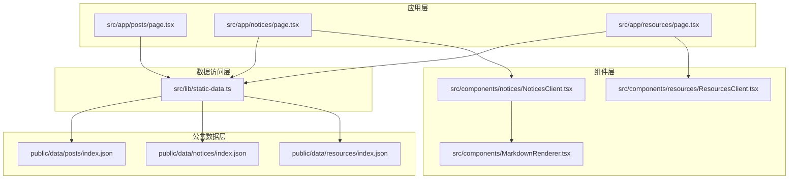
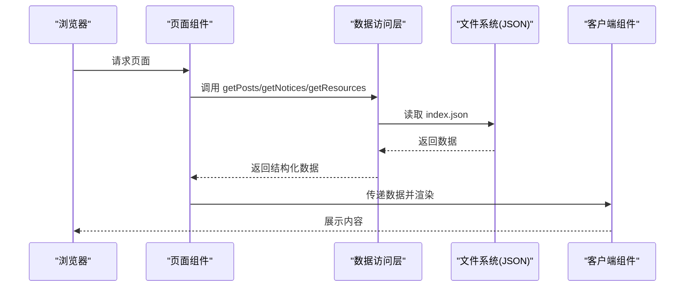
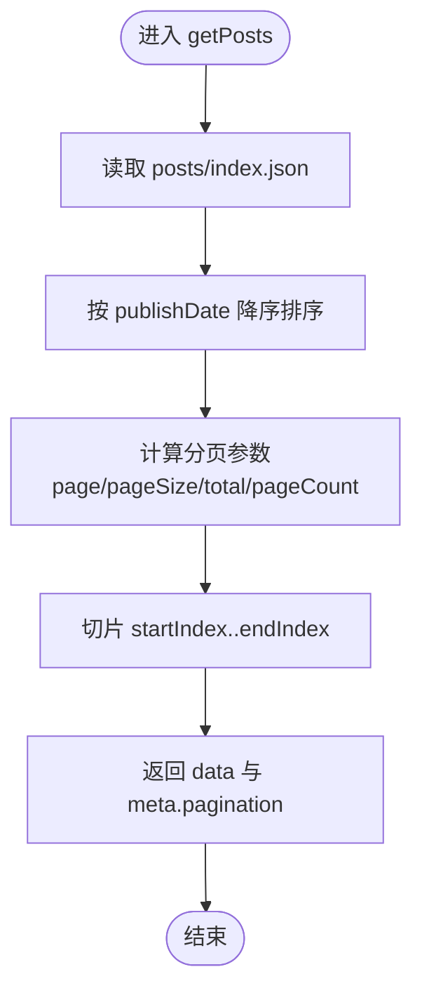
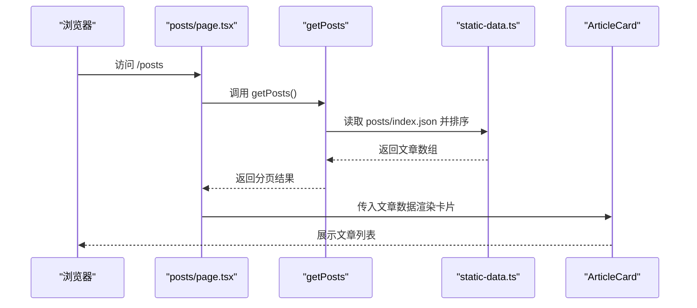
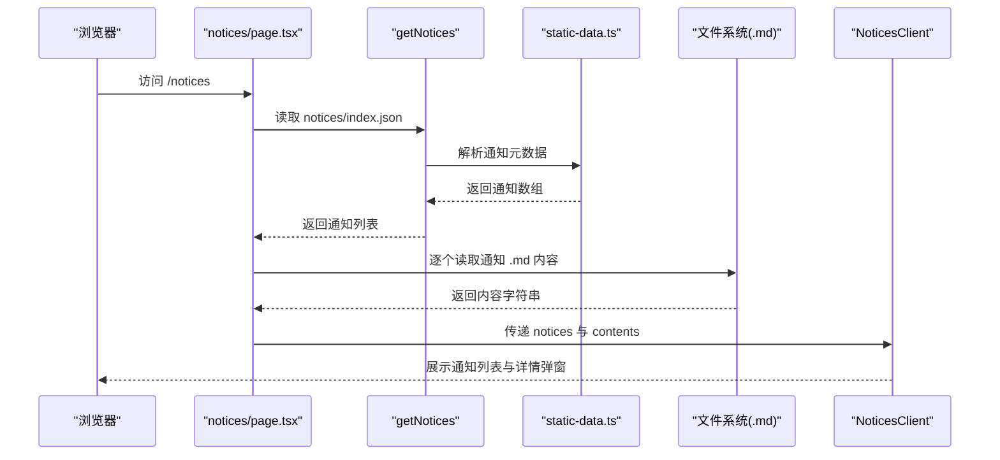
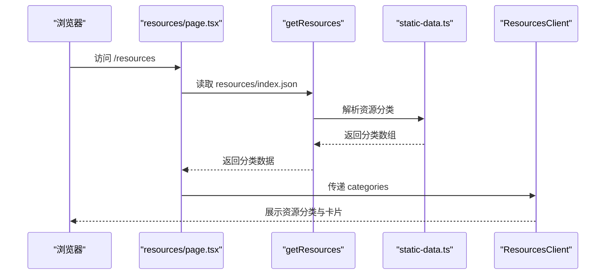
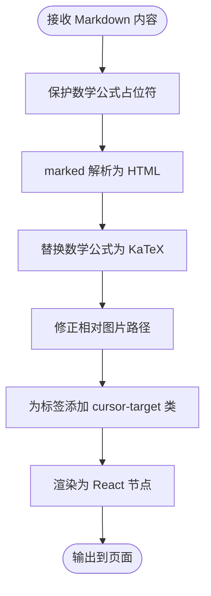
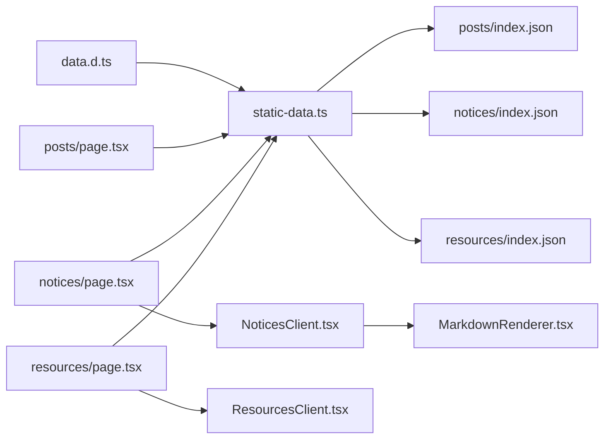

# 内容管理系统

<cite>
**本文档引用的文件**
- [static-data.ts](file://blog-system2/frontend/src/lib/static-data.ts)
- [data.d.ts](file://blog-system2/frontend/src/types/data.d.ts)
- [posts/index.json](file://blog-system2/frontend/public/data/posts/index.json)
- [notices/index.json](file://blog-system2/frontend/public/data/notices/index.json)
- [resources/index.json](file://blog-system2/frontend/public/data/resources/index.json)
- [posts/page.tsx](file://blog-system2/frontend/src/app/posts/page.tsx)
- [notices/page.tsx](file://blog-system2/frontend/src/app/notices/page.tsx)
- [resources/page.tsx](file://blog-system2/frontend/src/app/resources/page.tsx)
- [NoticesClient.tsx](file://blog-system2/frontend/src/components/notices/NoticesClient.tsx)
- [ResourcesClient.tsx](file://blog-system2/frontend/src/components/resources/ResourcesClient.tsx)
- [MarkdownRenderer.tsx](file://blog-system2/frontend/src/components/MarkdownRenderer.tsx)
- [welcome.md](file://blog-system2/frontend/public/data/notices/welcome.md)
- [winter_task.md](file://blog-system2/frontend/public/data/notices/winter_task.md)
- [README.md](file://blog-system2/frontend/public/data/posts/README.md)
</cite>

## 目录
1. [简介](#简介)
2. [项目结构](#项目结构)
3. [核心组件](#核心组件)
4. [架构总览](#架构总览)
5. [详细组件分析](#详细组件分析)
6. [依赖关系分析](#依赖关系分析)
7. [性能考虑](#性能考虑)
8. [故障排除指南](#故障排除指南)
9. [结论](#结论)
10. [附录](#附录)

## 简介
本项目是一个基于 Next.js 的内容管理系统，采用静态数据驱动的方式管理三类内容：文章（posts）、通知（notices）与资源（resources）。系统通过 JSON 索引文件组织数据，配合客户端渲染组件实现高效的内容展示与交互。核心数据访问层提供统一的 API，包括分页、排序与过滤能力；Markdown 渲染器负责将通知内容转换为富文本界面。

## 项目结构
前端采用按路由组织的目录结构，核心数据位于 public/data 下，类型声明与数据访问层位于 src/lib，页面组件位于 src/app，UI 组件位于 src/components。

**图表来源**
- [posts/page.tsx:12-169](file://blog-system2/frontend/src/app/posts/page.tsx#L12-L169)
- [notices/page.tsx:1-35](file://blog-system2/frontend/src/app/notices/page.tsx#L1-L35)
- [resources/page.tsx:1-10](file://blog-system2/frontend/src/app/resources/page.tsx#L1-L10)
- [static-data.ts:1-214](file://blog-system2/frontend/src/lib/static-data.ts#L1-L214)
- [NoticesClient.tsx:1-398](file://blog-system2/frontend/src/components/notices/NoticesClient.tsx#L1-L398)
- [ResourcesClient.tsx:1-312](file://blog-system2/frontend/src/components/resources/ResourcesClient.tsx#L1-L312)
- [MarkdownRenderer.tsx:1-718](file://blog-system2/frontend/src/components/MarkdownRenderer.tsx#L1-L718)

**章节来源**
- [posts/page.tsx:1-169](file://blog-system2/frontend/src/app/posts/page.tsx#L1-L169)
- [notices/page.tsx:1-35](file://blog-system2/frontend/src/app/notices/page.tsx#L1-L35)
- [resources/page.tsx:1-10](file://blog-system2/frontend/src/app/resources/page.tsx#L1-L10)
- [static-data.ts:1-214](file://blog-system2/frontend/src/lib/static-data.ts#L1-L214)

## 核心组件
- 数据访问层：提供 getPosts、getNotices、getResources 等 API，负责从 JSON 索引文件读取数据并进行排序、分页与过滤。
- 页面组件：各路由页面负责调用数据访问层并传递给对应客户端组件。
- 客户端组件：NoticesClient 与 ResourcesClient 负责 UI 展示与用户交互。
- Markdown 渲染器：将通知的 .md 内容渲染为富文本。

**章节来源**
- [static-data.ts:45-73](file://blog-system2/frontend/src/lib/static-data.ts#L45-L73)
- [static-data.ts:164-173](file://blog-system2/frontend/src/lib/static-data.ts#L164-L173)
- [static-data.ts:208-213](file://blog-system2/frontend/src/lib/static-data.ts#L208-L213)
- [posts/page.tsx:12-169](file://blog-system2/frontend/src/app/posts/page.tsx#L12-L169)
- [notices/page.tsx:29-34](file://blog-system2/frontend/src/app/notices/page.tsx#L29-L34)
- [resources/page.tsx:6-9](file://blog-system2/frontend/src/app/resources/page.tsx#L6-L9)
- [NoticesClient.tsx:1-398](file://blog-system2/frontend/src/components/notices/NoticesClient.tsx#L1-L398)
- [ResourcesClient.tsx:1-312](file://blog-system2/frontend/src/components/resources/ResourcesClient.tsx#L1-L312)
- [MarkdownRenderer.tsx:1-718](file://blog-system2/frontend/src/components/MarkdownRenderer.tsx#L1-L718)

## 架构总览
系统采用“静态数据 + 客户端渲染”的混合架构。页面在构建时或请求时调用数据访问层，数据访问层从 public/data 下的 JSON 索引文件读取数据，经过排序与分页处理后返回给页面组件，再由客户端组件进行渲染与交互。

**图表来源**
- [posts/page.tsx:12-169](file://blog-system2/frontend/src/app/posts/page.tsx#L12-L169)
- [notices/page.tsx:29-34](file://blog-system2/frontend/src/app/notices/page.tsx#L29-L34)
- [resources/page.tsx:6-9](file://blog-system2/frontend/src/app/resources/page.tsx#L6-L9)
- [static-data.ts:32-43](file://blog-system2/frontend/src/lib/static-data.ts#L32-L43)
- [static-data.ts:150-161](file://blog-system2/frontend/src/lib/static-data.ts#L150-L161)
- [static-data.ts:208-213](file://blog-system2/frontend/src/lib/static-data.ts#L208-L213)

## 详细组件分析

### 数据访问层（static-data.ts）
- 数据模型
  - StaticPost：文章实体，包含 id、slug、title、summary、publishDate、coverImage。
  - StaticNotice：通知实体，包含 id、slug、title、publishDate、pinned。
  - ResourceItem：资源项，包含 id、title、description、url、tags、pinned。
  - ResourceCategory：资源分类，包含 id、name、icon、description、items。
- 核心 API
  - getPosts(params)：读取 posts/index.json，按 publishDate 降序排序，支持分页（page、pageSize）。
  - getNotices()：读取 notices/index.json，按 pinned 优先、publishDate 降序排序。
  - getResources()：读取 resources/index.json，直接返回分类列表。
  - getPostBySlug(slug)、getNoticeBySlug(slug)：按 slug 查找单个条目。
  - getLatestPostsByIdDesc(count)：按 id 降序取前 N 篇文章（主页最近动态）。
  - getRelatedPosts(currentSlug, limit)：排除当前文章后按发布日期降序取相关文章。
  - getAllPostSlugs()、getAllNoticeSlugs()：获取所有文章/通知的 slug 列表。
- 数据文件组织
  - posts/index.json：包含文章元数据数组，用于生成 StaticPost 列表。
  - notices/index.json：包含通知元数据数组，用于生成 StaticNotice 列表。
  - resources/index.json：包含资源分类与资源项数组，用于生成 ResourceCategory 列表。
- 分页机制
  - getPosts 支持分页参数 pagination.page 与 pagination.pageSize，默认每页 25 条。
  - 计算 total、pageCount、startIndex、endIndex 并切片返回。
- 排序规则
  - 文章：publishDate 降序。
  - 通知：pinned 优先，其次 publishDate 降序。
- 过滤逻辑
  - getRelatedPosts 通过 slug 排除当前文章后进行排序与限制数量。
- 缓存策略
  - 当前实现每次读取文件系统，未内置内存缓存；可在业务层引入缓存以减少重复读取。

**图表来源**
- [static-data.ts:45-73](file://blog-system2/frontend/src/lib/static-data.ts#L45-L73)

**章节来源**
- [static-data.ts:4-15](file://blog-system2/frontend/src/lib/static-data.ts#L4-L15)
- [static-data.ts:138-148](file://blog-system2/frontend/src/lib/static-data.ts#L138-L148)
- [static-data.ts:187-206](file://blog-system2/frontend/src/lib/static-data.ts#L187-L206)
- [static-data.ts:45-73](file://blog-system2/frontend/src/lib/static-data.ts#L45-L73)
- [static-data.ts:164-173](file://blog-system2/frontend/src/lib/static-data.ts#L164-L173)
- [static-data.ts:208-213](file://blog-system2/frontend/src/lib/static-data.ts#L208-L213)
- [posts/index.json:1-103](file://blog-system2/frontend/public/data/posts/index.json#L1-L103)
- [notices/index.json:1-41](file://blog-system2/frontend/public/data/notices/index.json#L1-L41)
- [resources/index.json:1-224](file://blog-system2/frontend/public/data/resources/index.json#L1-L224)

### 页面组件与数据流

#### 文章页面（posts/page.tsx）
- 调用 getPosts 获取文章数据，渲染为卡片列表。
- 使用 ArticleCard 组件展示封面图、标题与发布日期。

**图表来源**
- [posts/page.tsx:12-169](file://blog-system2/frontend/src/app/posts/page.tsx#L12-L169)
- [static-data.ts:45-73](file://blog-system2/frontend/src/lib/static-data.ts#L45-L73)

**章节来源**
- [posts/page.tsx:1-169](file://blog-system2/frontend/src/app/posts/page.tsx#L1-L169)
- [static-data.ts:45-73](file://blog-system2/frontend/src/lib/static-data.ts#L45-L73)

#### 通知页面（notices/page.tsx）
- 调用 getNotices 获取通知列表，同时读取每个通知对应的 .md 文件内容。
- 将数据传递给 NoticesClient 进行渲染与交互。

**图表来源**
- [notices/page.tsx:9-27](file://blog-system2/frontend/src/app/notices/page.tsx#L9-L27)
- [static-data.ts:164-173](file://blog-system2/frontend/src/lib/static-data.ts#L164-L173)
- [NoticesClient.tsx:1-398](file://blog-system2/frontend/src/components/notices/NoticesClient.tsx#L1-L398)
- [welcome.md:1-5](file://blog-system2/frontend/public/data/notices/welcome.md#L1-L5)
- [winter_task.md:1-7](file://blog-system2/frontend/public/data/notices/winter_task.md#L1-L7)

**章节来源**
- [notices/page.tsx:1-35](file://blog-system2/frontend/src/app/notices/page.tsx#L1-L35)
- [static-data.ts:164-173](file://blog-system2/frontend/src/lib/static-data.ts#L164-L173)
- [NoticesClient.tsx:1-398](file://blog-system2/frontend/src/components/notices/NoticesClient.tsx#L1-L398)
- [welcome.md:1-5](file://blog-system2/frontend/public/data/notices/welcome.md#L1-L5)
- [winter_task.md:1-7](file://blog-system2/frontend/public/data/notices/winter_task.md#L1-L7)

#### 资源页面（resources/page.tsx）
- 调用 getResources 获取资源分类与资源项，传递给 ResourcesClient 渲染。

**图表来源**
- [resources/page.tsx:6-9](file://blog-system2/frontend/src/app/resources/page.tsx#L6-L9)
- [static-data.ts:208-213](file://blog-system2/frontend/src/lib/static-data.ts#L208-L213)
- [ResourcesClient.tsx:1-312](file://blog-system2/frontend/src/components/resources/ResourcesClient.tsx#L1-L312)

**章节来源**
- [resources/page.tsx:1-10](file://blog-system2/frontend/src/app/resources/page.tsx#L1-L10)
- [static-data.ts:208-213](file://blog-system2/frontend/src/lib/static-data.ts#L208-L213)
- [ResourcesClient.tsx:1-312](file://blog-system2/frontend/src/components/resources/ResourcesClient.tsx#L1-L312)

### Markdown 渲染器（MarkdownRenderer.tsx）
- 功能概述
  - 使用 marked 解析 Markdown，支持代码高亮与 KaTeX 数学公式渲染。
  - 提供图片灯箱、标题锚点、代码块折叠与复制等交互功能。
  - 处理相对路径图片（将 ./xxx 转换为 /data/posts/xxx）。
- 性能与可用性
  - 对长代码块提供折叠与懒加载；根据主题自动切换高亮样式。
  - 在客户端监听键盘事件与滚动条补偿，优化用户体验。

**图表来源**
- [MarkdownRenderer.tsx:465-546](file://blog-system2/frontend/src/components/MarkdownRenderer.tsx#L465-L546)

**章节来源**
- [MarkdownRenderer.tsx:1-718](file://blog-system2/frontend/src/components/MarkdownRenderer.tsx#L1-L718)
- [README.md:1-209](file://blog-system2/frontend/public/data/posts/README.md#L1-L209)

## 依赖关系分析
- 类型声明：通过 data.d.ts 声明 .json 与 .md 的模块类型，确保 TypeScript 正确识别导入。
- 组件耦合：页面组件仅依赖数据访问层，客户端组件依赖页面组件传递的数据，保持低耦合。
- 外部依赖：marked、KaTeX、react-syntax-highlighter 等用于渲染与高亮。

**图表来源**
- [data.d.ts:1-10](file://blog-system2/frontend/src/types/data.d.ts#L1-L10)
- [static-data.ts:1-214](file://blog-system2/frontend/src/lib/static-data.ts#L1-L214)
- [posts/page.tsx:1-169](file://blog-system2/frontend/src/app/posts/page.tsx#L1-L169)
- [notices/page.tsx:1-35](file://blog-system2/frontend/src/app/notices/page.tsx#L1-L35)
- [resources/page.tsx:1-10](file://blog-system2/frontend/src/app/resources/page.tsx#L1-L10)
- [NoticesClient.tsx:1-398](file://blog-system2/frontend/src/components/notices/NoticesClient.tsx#L1-L398)
- [ResourcesClient.tsx:1-312](file://blog-system2/frontend/src/components/resources/ResourcesClient.tsx#L1-L312)
- [MarkdownRenderer.tsx:1-718](file://blog-system2/frontend/src/components/MarkdownRenderer.tsx#L1-L718)

**章节来源**
- [data.d.ts:1-10](file://blog-system2/frontend/src/types/data.d.ts#L1-L10)
- [static-data.ts:1-214](file://blog-system2/frontend/src/lib/static-data.ts#L1-L214)

## 性能考虑
- 数据读取：当前实现每次请求都会读取 JSON 文件，建议在服务端或构建期缓存，减少 IO 开销。
- 渲染优化：MarkdownRenderer 对长代码块提供折叠与懒加载，避免一次性渲染大量 DOM。
- 图片处理：相对路径图片在渲染时统一修正，减少跨域与路径错误带来的二次请求。
- 首屏体验：ResourcesClient 在生产环境提供自愈刷新机制，提升首屏可见性。

[本节为通用性能建议，无需特定文件来源]

## 故障排除指南
- 通知内容为空
  - 检查 notices/index.json 中的 slug 是否与 .md 文件名一致（不含 .md 扩展名）。
  - 确认 notices/page.tsx 中的文件读取路径与 public/data/notices 目录结构匹配。
- 文章封面图显示异常
  - 确认 posts/index.json 中的 coverImage 路径正确，必要时使用绝对路径。
- 资源卡片点击无效
  - 检查 resources/index.json 中的 url 字段是否为有效链接。
- 数学公式或代码高亮不生效
  - 确认 MarkdownRenderer 的 KaTeX 与语法高亮库加载正常。
- 分页数据不正确
  - 检查 getPosts 的分页参数与 posts/index.json 数据量是否匹配。

**章节来源**
- [notices/page.tsx:9-27](file://blog-system2/frontend/src/app/notices/page.tsx#L9-L27)
- [posts/index.json:1-103](file://blog-system2/frontend/public/data/posts/index.json#L1-L103)
- [resources/index.json:1-224](file://blog-system2/frontend/public/data/resources/index.json#L1-L224)
- [MarkdownRenderer.tsx:487-514](file://blog-system2/frontend/src/components/MarkdownRenderer.tsx#L487-L514)
- [static-data.ts:45-73](file://blog-system2/frontend/src/lib/static-data.ts#L45-L73)

## 结论
该内容管理系统通过简洁的 JSON 索引文件与统一的数据访问层，实现了文章、通知与资源的静态数据管理与渲染。页面组件与客户端组件职责清晰，Markdown 渲染器提供了良好的可读性与交互体验。建议在生产环境中引入缓存与预渲染策略，进一步提升性能与 SEO。

[本节为总结性内容，无需特定文件来源]

## 附录

### 数据模型定义
- StaticPost
  - 字段：id、slug、title、summary、publishDate、coverImage
  - 来源：posts/index.json
- StaticNotice
  - 字段：id、slug、title、publishDate、pinned
  - 来源：notices/index.json
- ResourceItem
  - 字段：id、title、description、url、tags、pinned
  - 来源：resources/index.json
- ResourceCategory
  - 字段：id、name、icon、description、items
  - 来源：resources/index.json

**章节来源**
- [static-data.ts:4-15](file://blog-system2/frontend/src/lib/static-data.ts#L4-L15)
- [static-data.ts:138-148](file://blog-system2/frontend/src/lib/static-data.ts#L138-L148)
- [static-data.ts:187-206](file://blog-system2/frontend/src/lib/static-data.ts#L187-L206)
- [posts/index.json:1-103](file://blog-system2/frontend/public/data/posts/index.json#L1-L103)
- [notices/index.json:1-41](file://blog-system2/frontend/public/data/notices/index.json#L1-L41)
- [resources/index.json:1-224](file://blog-system2/frontend/public/data/resources/index.json#L1-L224)

### API 规范
- getPosts(params)
  - 输入：pagination.page、pagination.pageSize、filters（预留）
  - 输出：data（文章数组）、meta.pagination（page、pageSize、pageCount、total）
- getNotices()
  - 输出：按 pinned 优先、publishDate 降序排列的通知数组
- getResources()
  - 输出：资源分类数组

**章节来源**
- [static-data.ts:45-73](file://blog-system2/frontend/src/lib/static-data.ts#L45-L73)
- [static-data.ts:164-173](file://blog-system2/frontend/src/lib/static-data.ts#L164-L173)
- [static-data.ts:208-213](file://blog-system2/frontend/src/lib/static-data.ts#L208-L213)