# 文章管理系统

<cite>
**本文档引用的文件**
- [static-data.ts](file://blog-system2/frontend/src/lib/static-data.ts)
- [data.d.ts](file://blog-system2/frontend/src/types/data.d.ts)
- [posts/page.tsx](file://blog-system2/frontend/src/app/posts/page.tsx)
- [posts/[slug]/page.tsx](file://blog-system2/frontend/src/app/posts/[slug]/page.tsx)
- [ArticleCard.tsx](file://blog-system2/frontend/src/components/ArticleCard.tsx)
- [RelatedPosts.tsx](file://blog-system2/frontend/src/components/post/RelatedPosts.tsx)
- [posts/index.json](file://blog-system2/frontend/public/data/posts/index.json)
- [notices/index.json](file://blog-system2/frontend/public/data/notices/index.json)
- [date.json](file://blog-system2/frontend/public/data/date.json)
- [package.json](file://blog-system2/frontend/package.json)
- [layout.tsx](file://blog-system2/frontend/src/app/layout.tsx)
</cite>

## 目录
1. [简介](#简介)
2. [项目结构](#项目结构)
3. [核心组件](#核心组件)
4. [架构概览](#架构概览)
5. [详细组件分析](#详细组件分析)
6. [依赖关系分析](#依赖关系分析)
7. [性能考虑](#性能考虑)
8. [故障排除指南](#故障排除指南)
9. [结论](#结论)
10. [附录](#附录)

## 简介

这是一个基于Next.js构建的静态文章管理系统，专门用于管理论文复现组的分享会文章。系统采用静态生成策略，通过JSON配置文件存储文章元数据，实现了高效的文章展示、分页导航和相关文章推荐功能。

系统的核心特点：
- 基于静态文件的轻量级架构
- 支持文章分页和排序
- 提供相关文章推荐算法
- 完整的TypeScript类型安全
- 响应式设计和现代化UI

## 项目结构

项目采用标准的Next.js应用结构，主要目录组织如下：

```mermaid
graph TB
subgraph "前端应用"
Frontend[blog-system2/frontend]
Src[src/]
Public[public/]
Types[types/]
Lib[lib/]
App[app/]
Components[components/]
end
subgraph "源代码"
Src --> Lib
Src --> App
Src --> Components
Src --> Types
end
subgraph "公共资源"
Public --> Data[data/]
Data --> Posts[posts/]
Data --> Notices[notices/]
Data --> Resources[resources/]
Data --> Date[date.json]
end
subgraph "应用页面"
App --> PostsPage[posts/page.tsx]
App --> ArticlePage[posts/[slug]/page.tsx]
App --> About[about/]
App --> Notices[notices/]
App --> Resources[resources/]
end
subgraph "核心库"
Lib --> StaticData[static-data.ts]
Lib --> Utils[utils.ts]
Lib --> Algolia[algolia.ts]
end
subgraph "组件"
Components --> ArticleCard[ArticleCard.tsx]
Components --> RelatedPosts[RelatedPosts.tsx]
Components --> PostImage[PostImage.tsx]
Components --> Footer[Footer.tsx]
end
```

**图表来源**
- [static-data.ts:1-214](file://blog-system2/frontend/src/lib/static-data.ts#L1-L214)
- [posts/page.tsx:1-169](file://blog-system2/frontend/src/app/posts/page.tsx#L1-L169)
- [posts/[slug]/page.tsx](file://blog-system2/frontend/src/app/posts/[slug]/page.tsx#L1-L304)

**章节来源**
- [package.json:1-72](file://blog-system2/frontend/package.json#L1-L72)
- [layout.tsx:1-48](file://blog-system2/frontend/src/app/layout.tsx#L1-L48)

## 核心组件

### StaticPost接口数据结构设计

StaticPost接口是整个系统的核心数据模型，定义了文章的基本属性和约束条件：

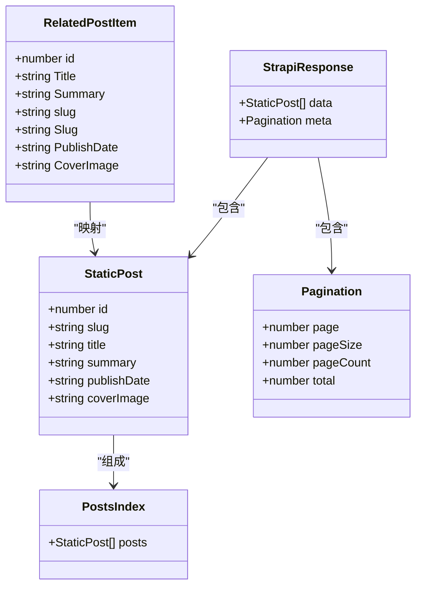

**图表来源**
- [static-data.ts:4-11](file://blog-system2/frontend/src/lib/static-data.ts#L4-L11)
- [static-data.ts:13-15](file://blog-system2/frontend/src/lib/static-data.ts#L13-L15)
- [static-data.ts:20-30](file://blog-system2/frontend/src/lib/static-data.ts#L20-L30)
- [static-data.ts:91-99](file://blog-system2/frontend/src/lib/static-data.ts#L91-L99)

#### 字段详细说明

| 字段名 | 类型 | 必填 | 约束条件 | 描述 |
|--------|------|------|----------|------|
| id | number | 是 | 自动分配，从1开始递增 | 文章唯一标识符，用于主页展示 |
| slug | string | 是 | 唯一，URL友好 | 文章URL路径，用于路由导航 |
| title | string | 是 | 非空 | 文章标题，支持中文 |
| summary | string | 否 | 可为空 | 文章摘要，用于列表展示 |
| publishDate | string | 是 | ISO 8601格式 | 发布日期，YYYY-MM-DD格式 |
| coverImage | string | 是 | 有效URL或本地路径 | 文章封面图片URL |

#### 数据约束验证

系统在运行时对数据进行严格验证：

1. **类型检查**：所有字段都经过TypeScript编译时类型检查
2. **格式验证**：publishDate必须符合ISO 8601格式
3. **唯一性保证**：slug字段在系统内保持唯一性
4. **空值处理**：对可选字段提供默认值处理

**章节来源**
- [static-data.ts:4-11](file://blog-system2/frontend/src/lib/static-data.ts#L4-L11)
- [static-data.ts:32-43](file://blog-system2/frontend/src/lib/static-data.ts#L32-L43)
- [posts/index.json:1-103](file://blog-system2/frontend/public/data/posts/index.json#L1-L103)

## 架构概览

系统采用分层架构设计，清晰分离数据访问层、业务逻辑层和表现层：

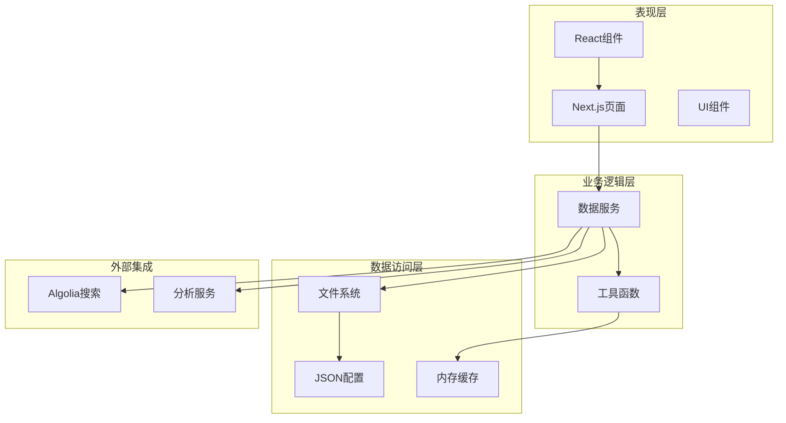

**图表来源**
- [static-data.ts:45-73](file://blog-system2/frontend/src/lib/static-data.ts#L45-L73)
- [posts/page.tsx:1-169](file://blog-system2/frontend/src/app/posts/page.tsx#L1-L169)
- [ArticleCard.tsx:1-198](file://blog-system2/frontend/src/components/ArticleCard.tsx#L1-L198)

### 数据流处理

系统的数据流遵循以下模式：

1. **静态生成阶段**：构建时从JSON文件读取数据
2. **运行时处理**：在服务器端进行数据转换和排序
3. **客户端渲染**：在浏览器中进行交互式渲染

**章节来源**
- [posts/page.tsx:10-169](file://blog-system2/frontend/src/app/posts/page.tsx#L10-L169)
- [posts/[slug]/page.tsx](file://blog-system2/frontend/src/app/posts/[slug]/page.tsx#L66-L304)

## 详细组件分析

### getPosts函数分页机制

getPosts函数实现了完整的分页功能，支持自定义页面大小和页码：

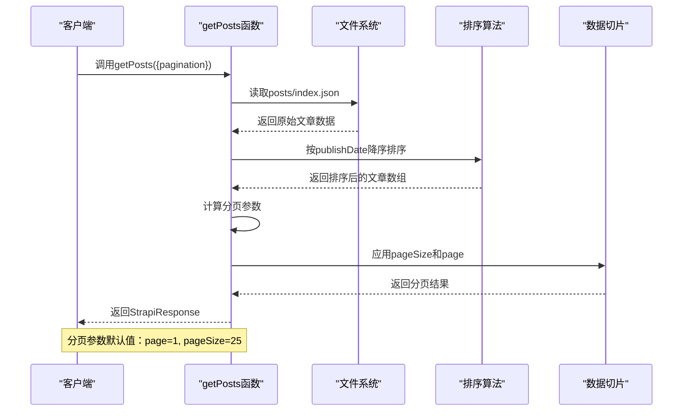

**图表来源**
- [static-data.ts:45-73](file://blog-system2/frontend/src/lib/static-data.ts#L45-L73)

#### 分页参数处理

分页机制的关键实现细节：

1. **默认参数**：当未提供pagination参数时，使用默认值
2. **页码计算**：page参数控制当前页，从1开始计数
3. **页面大小**：pageSize控制每页显示的文章数量
4. **总数统计**：计算总文章数和总页数

#### 数据切片逻辑

分页算法的核心逻辑：

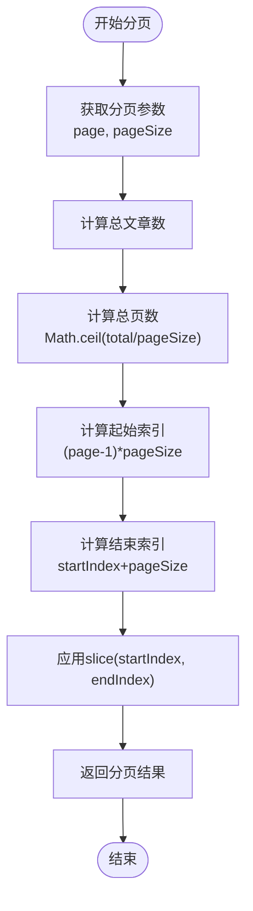

**图表来源**
- [static-data.ts:54-60](file://blog-system2/frontend/src/lib/static-data.ts#L54-L60)

**章节来源**
- [static-data.ts:45-73](file://blog-system2/frontend/src/lib/static-data.ts#L45-L73)

### 文章排序规则实现

系统实现了多种排序策略，满足不同的展示需求：

#### 主要排序算法

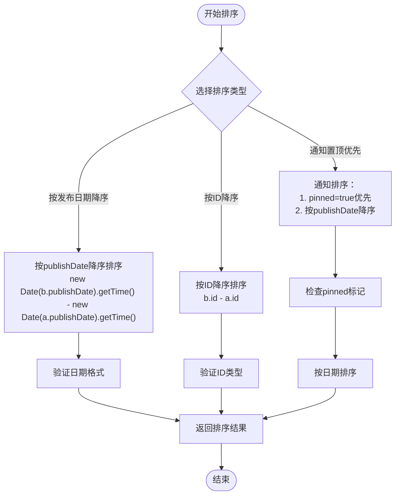

**图表来源**
- [static-data.ts:50-52](file://blog-system2/frontend/src/lib/static-data.ts#L50-L52)
- [static-data.ts:79-83](file://blog-system2/frontend/src/lib/static-data.ts#L79-L83)
- [static-data.ts:164-173](file://blog-system2/frontend/src/lib/static-data.ts#L164-L173)

#### 排序算法复杂度分析

- **时间复杂度**：O(n log n)，其中n为文章数量
- **空间复杂度**：O(n)，需要额外数组存储排序结果
- **稳定性**：JavaScript内置sort是稳定的，保证相同日期的文章顺序一致

**章节来源**
- [static-data.ts:50-52](file://blog-system2/frontend/src/lib/static-data.ts#L50-L52)
- [static-data.ts:79-83](file://blog-system2/frontend/src/lib/static-data.ts#L79-L83)
- [static-data.ts:164-173](file://blog-system2/frontend/src/lib/static-data.ts#L164-L173)

### getLatestPostsByIdDesc函数

该函数专门用于主页"最近动态"展示，实现了基于ID的降序排序：

#### 特殊需求分析

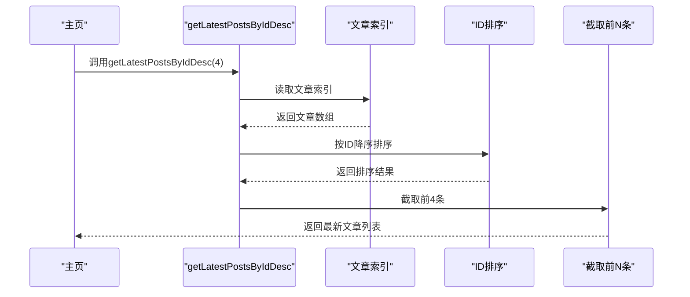

**图表来源**
- [static-data.ts:79-83](file://blog-system2/frontend/src/lib/static-data.ts#L79-L83)

#### 设计考量

1. **ID排序优势**：ID与文章创建顺序相关，能准确反映最新文章
2. **性能优化**：相比日期排序，ID比较更简单高效
3. **一致性**：确保主页展示的稳定性和可预测性

**章节来源**
- [static-data.ts:79-83](file://blog-system2/frontend/src/lib/static-data.ts#L79-L83)

### getRelatedPosts函数推荐算法

推荐算法基于发布时间的相关性，实现智能文章推荐：

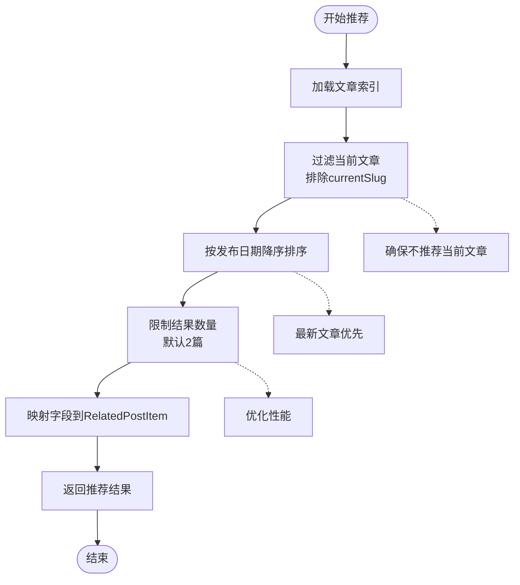

**图表来源**
- [static-data.ts:101-122](file://blog-system2/frontend/src/lib/static-data.ts#L101-L122)

#### 推荐算法特点

1. **相关性排序**：基于发布时间的倒序排列，最新文章优先
2. **去重机制**：自动排除当前正在查看的文章
3. **性能优化**：只对候选文章进行排序，避免全量排序
4. **字段映射**：将内部数据结构映射到组件期望的格式

**章节来源**
- [static-data.ts:101-122](file://blog-system2/frontend/src/lib/static-data.ts#L101-L122)

### 页面渲染组件

#### 文章列表页面

文章列表页面实现了完整的分页展示功能：

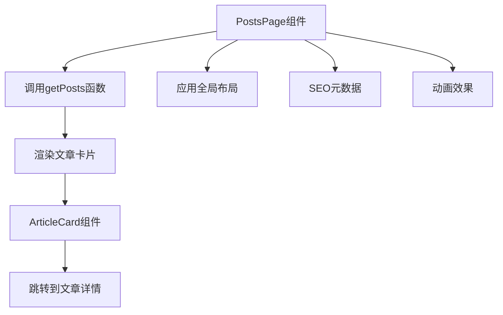

**图表来源**
- [posts/page.tsx:12-169](file://blog-system2/frontend/src/app/posts/page.tsx#L12-L169)
- [ArticleCard.tsx:29-198](file://blog-system2/frontend/src/components/ArticleCard.tsx#L29-L198)

#### 文章详情页面

文章详情页面提供了完整的阅读体验：

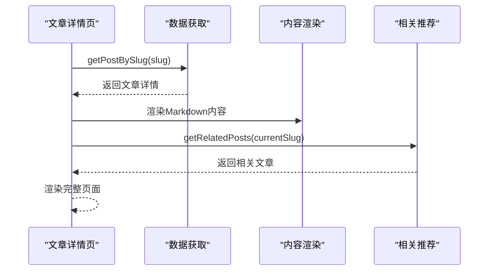

**图表来源**
- [posts/[slug]/page.tsx](file://blog-system2/frontend/src/app/posts/[slug]/page.tsx#L66-L304)

**章节来源**
- [posts/page.tsx:12-169](file://blog-system2/frontend/src/app/posts/page.tsx#L12-L169)
- [posts/[slug]/page.tsx](file://blog-system2/frontend/src/app/posts/[slug]/page.tsx#L66-L304)

## 依赖关系分析

系统依赖关系清晰，模块间耦合度低：

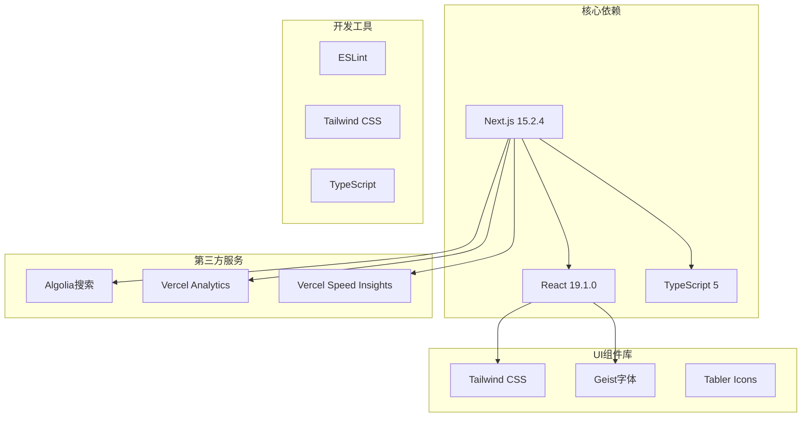

**图表来源**
- [package.json:13-43](file://blog-system2/frontend/package.json#L13-L43)

### 关键依赖说明

| 依赖项 | 版本 | 用途 | 重要性 |
|--------|------|------|--------|
| next | 15.2.4 | 核心框架 | 核心 |
| react | ^19.1.0 | UI渲染 | 核心 |
| typescript | ^5 | 类型安全 | 核心 |
| tailwindcss | ^4.1.2 | 样式框架 | 重要 |
| algoliasearch | ^5.24.0 | 搜索服务 | 重要 |
| @vercel/analytics | ^1.5.0 | 性能分析 | 重要 |

**章节来源**
- [package.json:13-72](file://blog-system2/frontend/package.json#L13-L72)

## 性能考虑

### 静态生成优化

系统采用静态生成策略，在构建时完成大部分数据处理：

1. **预渲染**：文章列表在构建时生成静态HTML
2. **缓存策略**：JSON文件缓存在内存中，避免重复读取
3. **懒加载**：图片使用懒加载，提升首屏性能
4. **代码分割**：按需加载组件，减少初始包大小

### 内存优化

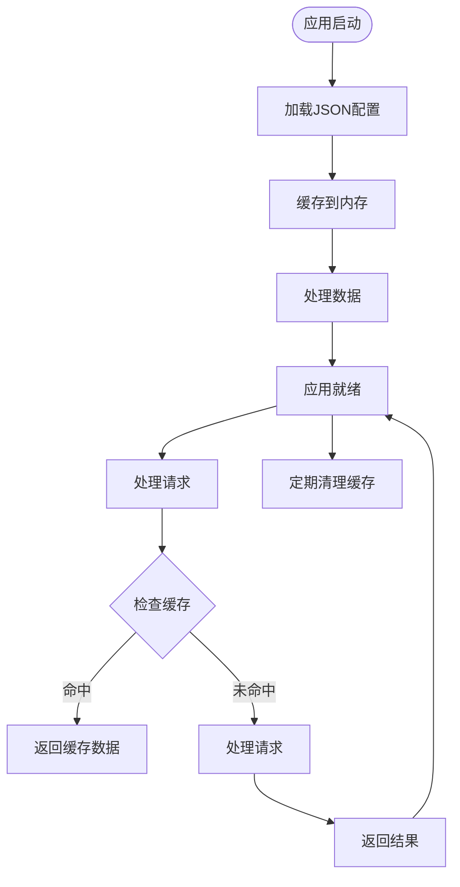

### 性能监控

系统集成了性能监控工具：

- **Vercel Analytics**：跟踪用户行为和页面性能
- **Speed Insights**：分析页面加载速度和用户体验
- **构建优化**：使用优化的构建脚本减少包大小

## 故障排除指南

### 常见问题及解决方案

#### 数据加载问题

**问题**：文章列表为空或显示异常
**原因**：
1. JSON文件格式错误
2. 字段缺失或格式不正确
3. 文件路径配置错误

**解决方案**：
1. 验证JSON文件语法
2. 检查必需字段是否存在
3. 确认文件路径正确

#### 排序异常

**问题**：文章排序不符合预期
**原因**：
1. publishDate格式不正确
2. 数据类型转换错误
3. 排序算法实现问题

**解决方案**：
1. 确保publishDate为ISO 8601格式
2. 检查日期解析逻辑
3. 验证排序比较函数

#### 性能问题

**问题**：页面加载缓慢
**原因**：
1. JSON文件过大
2. 图片资源未优化
3. 组件渲染开销大

**解决方案**：
1. 优化JSON文件结构
2. 压缩图片资源
3. 实施组件懒加载

**章节来源**
- [static-data.ts:32-43](file://blog-system2/frontend/src/lib/static-data.ts#L32-L43)
- [posts/index.json:1-103](file://blog-system2/frontend/public/data/posts/index.json#L1-L103)

## 结论

文章管理系统展现了现代静态站点生成的最佳实践。通过精心设计的数据结构、高效的分页算法和智能的推荐系统，系统实现了高性能、可维护和可扩展的文章管理功能。

### 主要优势

1. **性能优异**：静态生成确保快速加载和良好的SEO表现
2. **类型安全**：完整的TypeScript支持提供编译时错误检查
3. **易于维护**：清晰的模块分离和简洁的API设计
4. **扩展性强**：灵活的架构支持未来功能扩展

### 技术亮点

- 基于JSON的轻量级数据存储方案
- 智能的分页和排序算法
- 高效的相关文章推荐系统
- 完善的错误处理和性能优化

该系统为类似的知识管理平台提供了优秀的参考实现，展示了如何在保持简单性的同时实现复杂的功能需求。

## 附录

### API使用示例

#### 基础使用

```typescript
// 获取所有文章（带分页）
const postsData = await getPosts({
  pagination: { page: 1, pageSize: 10 }
});

// 获取最新文章（ID降序）
const latestPosts = getLatestPostsByIdDesc(4);

// 根据slug获取单篇文章
const post = await getPostBySlug('article-slug');

// 获取相关文章
const relatedPosts = await getRelatedPosts('current-article-slug', 3);
```

#### 错误处理最佳实践

```typescript
try {
  const posts = await getPosts();
  // 处理正常情况
} catch (error) {
  // 错误处理逻辑
  console.error('获取文章失败:', error);
  // 显示友好的错误界面
}
```

#### 性能优化建议

1. **合理设置pageSize**：平衡页面加载速度和用户体验
2. **实施缓存策略**：利用浏览器缓存和CDN加速
3. **优化图片资源**：使用适当的图片格式和尺寸
4. **监控性能指标**：定期检查页面加载时间和用户体验指标