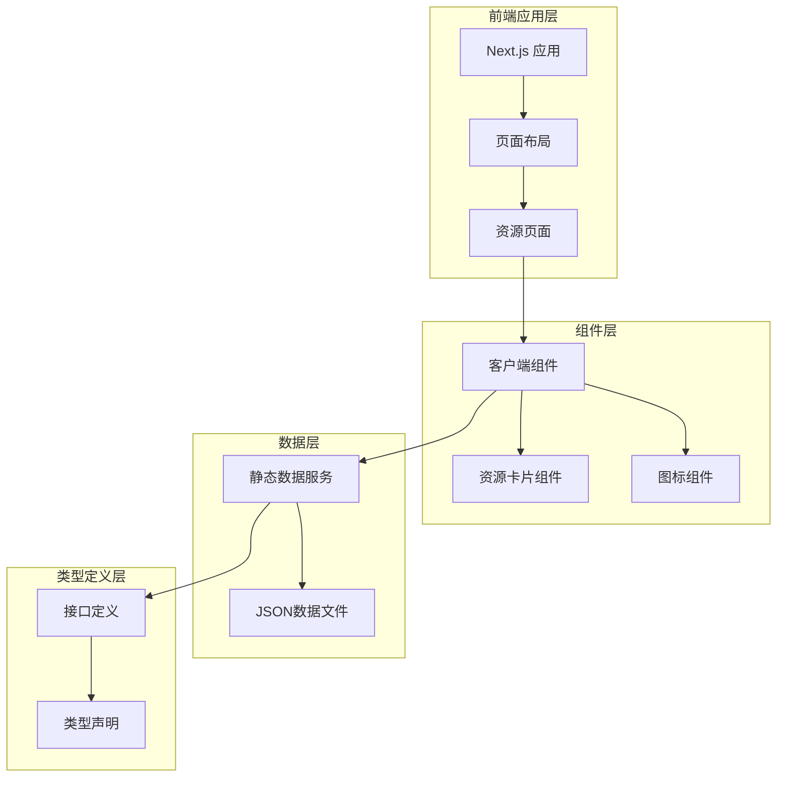
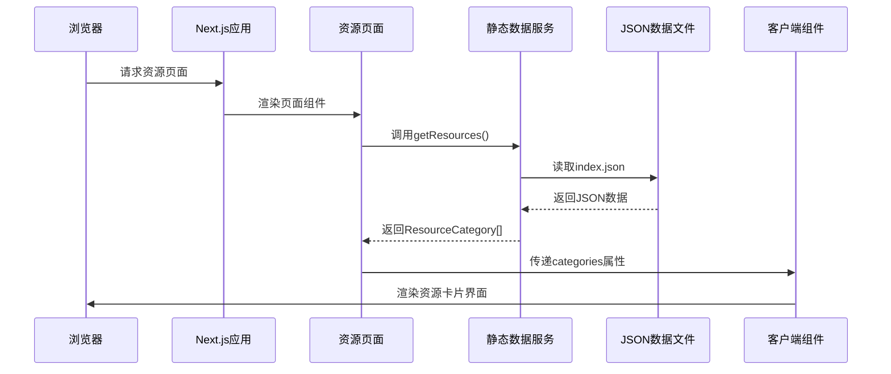
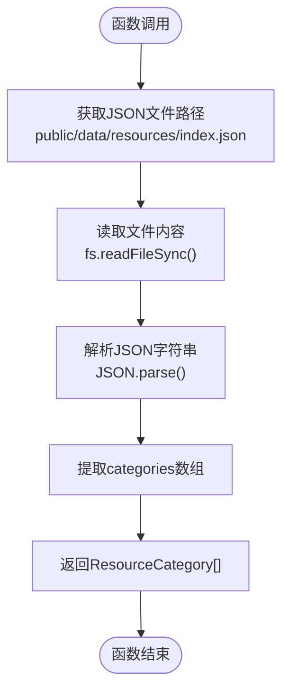
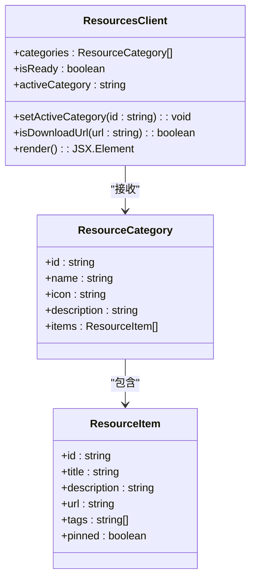
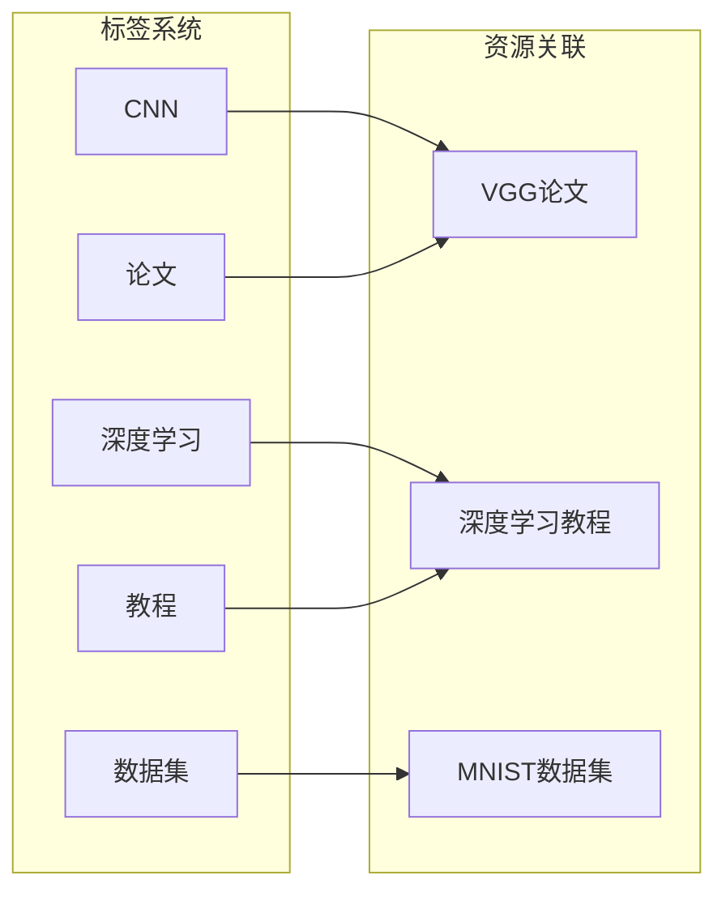
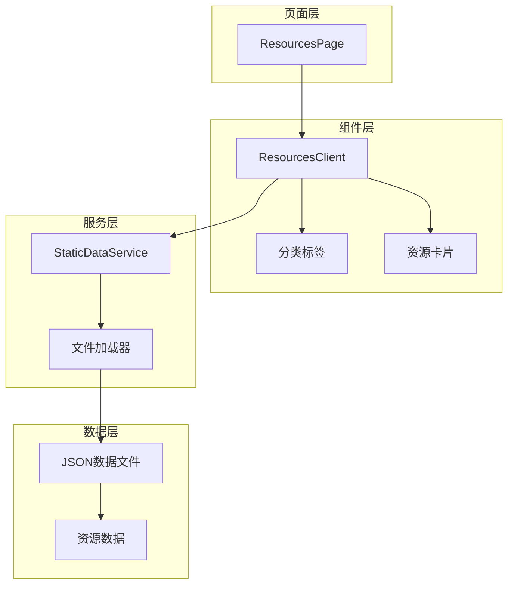
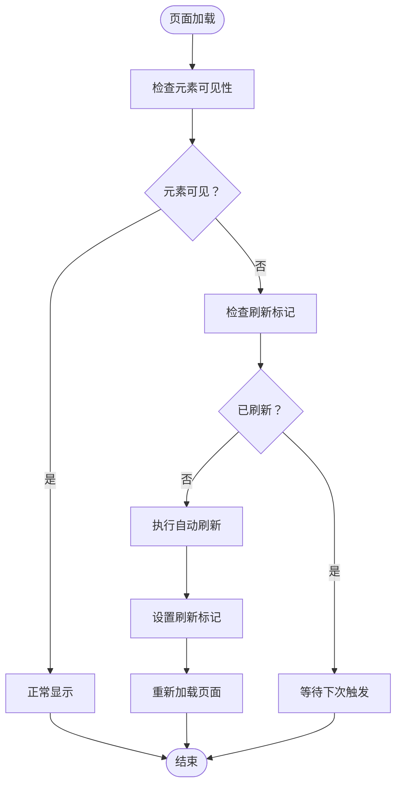

# 资源库管理系统

<cite>
**本文档引用的文件**
- [index.json](file://blog-system2/frontend/public/data/resources/index.json)
- [static-data.ts](file://blog-system2/frontend/src/lib/static-data.ts)
- [ResourcesClient.tsx](file://blog-system2/frontend/src/components/resources/ResourcesClient.tsx)
- [page.tsx](file://blog-system2/frontend/src/app/resources/page.tsx)
- [layout.tsx](file://blog-system2/frontend/src/app/resources/layout.tsx)
- [data.d.ts](file://blog-system2/frontend/src/types/data.d.ts)
- [global.d.ts](file://blog-system2/frontend/src/types/global.d.ts)
</cite>

## 目录
1. [简介](#简介)
2. [项目结构](#项目结构)
3. [核心组件](#核心组件)
4. [架构概览](#架构概览)
5. [详细组件分析](#详细组件分析)
6. [依赖关系分析](#依赖关系分析)
7. [性能考虑](#性能考虑)
8. [故障排除指南](#故障排除指南)
9. [结论](#结论)

## 简介

资源库管理系统是一个基于Next.js构建的学习资源导航平台，专门用于管理和展示各类学习资源。该系统采用静态数据驱动的方式，通过JSON文件存储资源数据，实现了资源分类、标签管理、置顶功能等核心特性。系统支持多种资源类型，包括论文与代码、博客与指南、推荐书籍、重要网址和其他辅助资料。

## 项目结构

资源库管理系统采用模块化架构，主要由以下层次组成：

**图表来源**
- [page.tsx:1-10](file://blog-system2/frontend/src/app/resources/page.tsx#L1-L10)
- [ResourcesClient.tsx:1-312](file://blog-system2/frontend/src/components/resources/ResourcesClient.tsx#L1-L312)
- [static-data.ts:185-214](file://blog-system2/frontend/src/lib/static-data.ts#L185-L214)

**章节来源**
- [page.tsx:1-10](file://blog-system2/frontend/src/app/resources/page.tsx#L1-L10)
- [layout.tsx:1-15](file://blog-system2/frontend/src/app/resources/layout.tsx#L1-L15)

## 核心组件

### 数据结构设计

系统的核心数据结构基于TypeScript接口定义，确保类型安全和开发体验。

#### ResourceItem 接口
ResourceItem代表单个资源条目，包含以下基本属性：

| 字段名 | 类型 | 必填 | 描述 | 示例值 |
|--------|------|------|------|--------|
| id | string | 是 | 资源唯一标识符 | "paper-1" |
| title | string | 是 | 资源标题 | "VGG 论文" |
| description | string | 是 | 资源描述信息 | "Very Deep Convolutional Networks..." |
| url | string | 是 | 资源链接地址 | "https://arxiv.org/abs/1409.1556" |
| tags | string[] | 否 | 标签数组，用于分类标记 | ["CNN", "论文"] |
| pinned | boolean | 否 | 是否置顶显示 | true |

#### ResourceCategory 接口
ResourceCategory代表资源分类，包含分类元数据和资源列表：

| 字段名 | 类型 | 必填 | 描述 | 示例值 |
|--------|------|------|------|--------|
| id | string | 是 | 分类唯一标识符 | "papers" |
| name | string | 是 | 分类名称 | "论文与代码" |
| icon | string | 是 | 分类图标标识 | "book" |
| description | string | 是 | 分类描述信息 | "精选深度学习与计算机视觉领域..." |
| items | ResourceItem[] | 是 | 该分类下的资源列表 | [ResourceItem] |

**章节来源**
- [static-data.ts:187-202](file://blog-system2/frontend/src/lib/static-data.ts#L187-L202)

## 架构概览

系统采用分层架构设计，实现了清晰的关注点分离：

**图表来源**
- [page.tsx:6-9](file://blog-system2/frontend/src/app/resources/page.tsx#L6-L9)
- [static-data.ts:208-213](file://blog-system2/frontend/src/lib/static-data.ts#L208-L213)
- [ResourcesClient.tsx:34-36](file://blog-system2/frontend/src/components/resources/ResourcesClient.tsx#L34-L36)

## 详细组件分析

### 资源数据加载机制

#### getResources 函数
getResources函数是资源加载的核心，负责从JSON文件中读取和解析资源数据：

**图表来源**
- [static-data.ts:208-213](file://blog-system2/frontend/src/lib/static-data.ts#L208-L213)

#### 数据验证和错误处理
系统在数据加载过程中实现了基本的错误处理机制：

1. **文件存在性检查**：通过文件路径拼接确保JSON文件存在
2. **JSON解析异常**：使用try-catch捕获JSON解析错误
3. **数据结构验证**：检查必需字段的存在性和类型正确性

**章节来源**
- [static-data.ts:208-213](file://blog-system2/frontend/src/lib/static-data.ts#L208-L213)

### 资源展示组件

#### ResourcesClient 组件
ResourcesClient是客户端渲染的核心组件，负责资源的可视化展示：

**图表来源**
- [ResourcesClient.tsx:16-18](file://blog-system2/frontend/src/components/resources/ResourcesClient.tsx#L16-L18)
- [static-data.ts:196-202](file://blog-system2/frontend/src/lib/static-data.ts#L196-L202)
- [static-data.ts:187-194](file://blog-system2/frontend/src/lib/static-data.ts#L187-L194)

#### 分类切换机制
组件实现了动态分类切换功能：

1. **状态管理**：使用useState管理当前激活的分类
2. **图标映射**：通过iconMap将字符串图标映射到React组件
3. **动画效果**：使用Framer Motion实现平滑的切换动画

**章节来源**
- [ResourcesClient.tsx:34-92](file://blog-system2/frontend/src/components/resources/ResourcesClient.tsx#L34-L92)

### 标签系统设计

#### 标签数据结构
标签系统采用简单的字符串数组设计：

**图表来源**
- [index.json:14](file://blog-system2/frontend/public/data/resources/index.json#L14)
- [index.json:64](file://blog-system2/frontend/public/data/resources/index.json#L64)

#### 标签渲染逻辑
标签在UI中的渲染遵循以下规则：
- 标签数量可变，支持空标签数组
- 每个标签显示为圆角矩形徽章
- 标签颜色随悬停状态变化
- 标签间距通过CSS Grid控制

**章节来源**
- [ResourcesClient.tsx:238-249](file://blog-system2/frontend/src/components/resources/ResourcesClient.tsx#L238-L249)

### 置顶功能实现

#### pinned 字段设计
置顶功能通过ResourceItem接口的pinned字段实现：

| 字段 | 类型 | 作用 | 默认值 |
|------|------|------|--------|
| pinned | boolean | 控制资源是否置顶显示 | undefined |
| 显示位置 | - | 在资源标题前显示星形图标 | - |

#### 置顶资源的视觉表现
置顶资源通过特殊图标和样式突出显示：
- 星形黄色图标（FiStar）
- 加粗字体样式
- 特殊的背景色变化

**章节来源**
- [index.json:101](file://blog-system2/frontend/public/data/resources/index.json#L101)
- [ResourcesClient.tsx:224-226](file://blog-system2/frontend/src/components/resources/ResourcesClient.tsx#L224-L226)

## 依赖关系分析

### 组件间依赖关系

**图表来源**
- [page.tsx:1-10](file://blog-system2/frontend/src/app/resources/page.tsx#L1-L10)
- [ResourcesClient.tsx:1-312](file://blog-system2/frontend/src/components/resources/ResourcesClient.tsx#L1-L312)
- [static-data.ts:208-213](file://blog-system2/frontend/src/lib/static-data.ts#L208-L213)

### 外部依赖

系统依赖的关键外部库：

| 依赖包 | 版本 | 用途 | 说明 |
|--------|------|------|------|
| react-icons | ^4.12.0 | 图标组件 | 提供FiBook、FiGlobe等图标 |
| framer-motion | ^11.0.0 | 动画库 | 实现页面过渡和交互动画 |
| next | ^14.0.0 | 框架 | Next.js应用框架 |
| react | ^18.0.0 | 核心库 | React组件库 |

**章节来源**
- [ResourcesClient.tsx:5-13](file://blog-system2/frontend/src/components/resources/ResourcesClient.tsx#L5-L13)

## 性能考虑

### 静态数据加载优化

1. **文件缓存**：使用Node.js的fs模块进行文件读取，避免重复I/O操作
2. **内存缓存**：JSON数据解析后直接返回，减少重复解析开销
3. **懒加载**：资源卡片按需渲染，避免一次性渲染大量DOM元素

### 前端性能优化

1. **CSS动画**：使用硬件加速的CSS变换实现流畅动画
2. **事件防抖**：分类切换使用防抖机制减少重绘次数
3. **条件渲染**：空状态和加载状态使用条件渲染避免不必要的计算

### 自愈机制

系统实现了智能的页面自愈机制：

**图表来源**
- [ResourcesClient.tsx:48-92](file://blog-system2/frontend/src/components/resources/ResourcesClient.tsx#L48-L92)

## 故障排除指南

### 常见问题及解决方案

#### 资源无法加载
**症状**：页面显示"暂无资源"或空白状态
**可能原因**：
1. JSON文件路径错误
2. JSON格式不正确
3. 文件权限问题

**解决步骤**：
1. 检查JSON文件是否存在且可访问
2. 验证JSON格式的正确性
3. 确认文件编码为UTF-8

#### 分类切换失效
**症状**：点击分类标签无响应
**可能原因**：
1. React状态管理问题
2. 事件绑定错误
3. CSS样式冲突

**解决步骤**：
1. 检查console是否有JavaScript错误
2. 验证onClick事件绑定
3. 确认CSS类名正确应用

#### 图标显示异常
**症状**：分类图标不显示或显示错误
**可能原因**：
1. iconMap映射表缺少对应图标
2. 图标组件导入错误
3. CSS样式覆盖

**解决步骤**：
1. 检查iconMap中是否存在对应键值
2. 验证图标组件的正确导入
3. 检查CSS样式的优先级

**章节来源**
- [ResourcesClient.tsx:22-27](file://blog-system2/frontend/src/components/resources/ResourcesClient.tsx#L22-L27)
- [ResourcesClient.tsx:144-174](file://blog-system2/frontend/src/components/resources/ResourcesClient.tsx#L144-L174)

## 结论

资源库管理系统通过精心设计的数据结构和组件架构，成功实现了学习资源的有效管理和展示。系统的主要优势包括：

1. **清晰的数据模型**：ResourceItem和ResourceCategory接口提供了明确的数据规范
2. **灵活的扩展性**：支持新的资源类型和分类的轻松添加
3. **优秀的用户体验**：流畅的动画效果和直观的交互设计
4. **可靠的性能表现**：静态数据加载和优化的渲染策略

该系统为类似的学习资源管理平台提供了良好的参考模板，其模块化的架构设计使得功能扩展和维护变得相对简单。