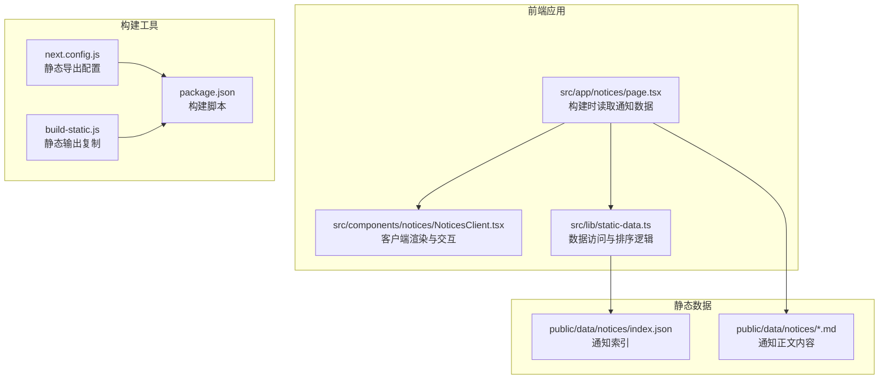
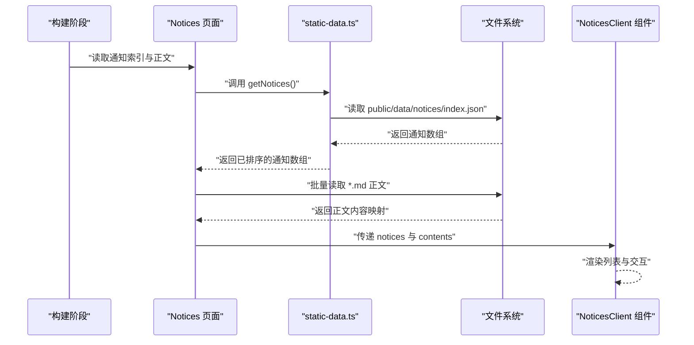
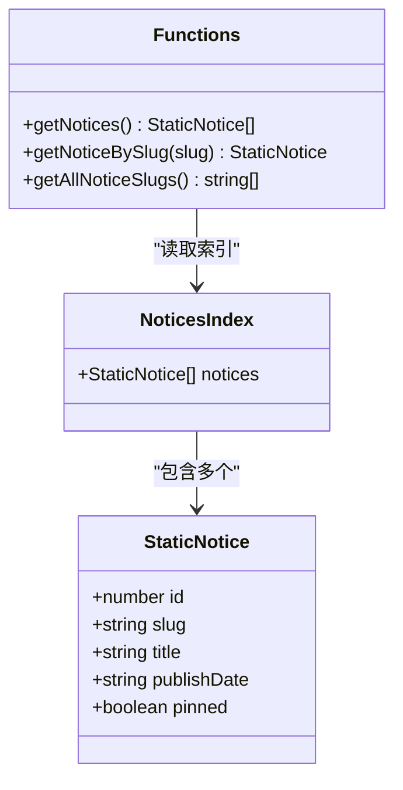
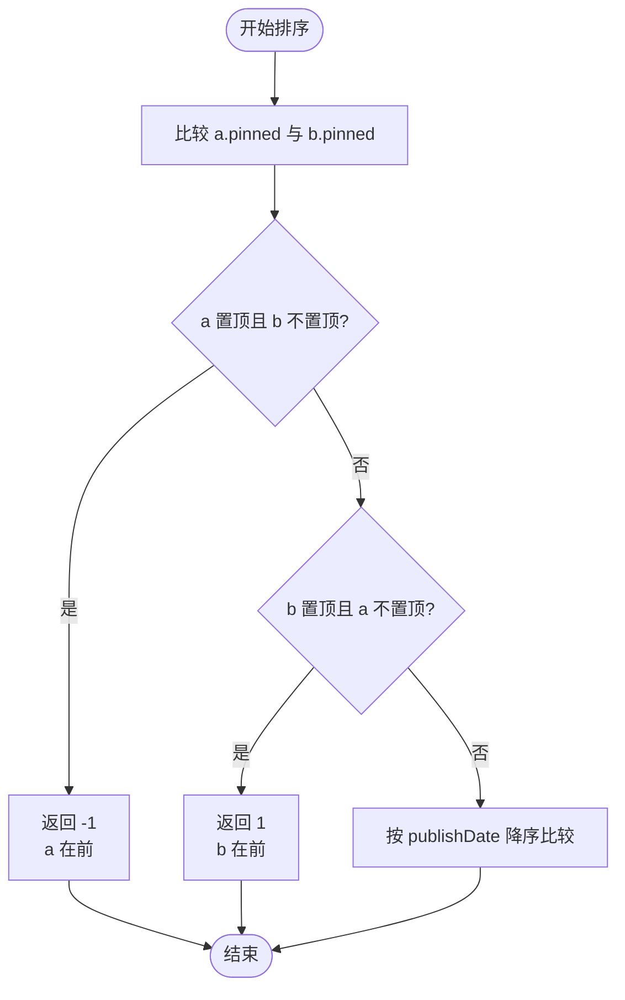
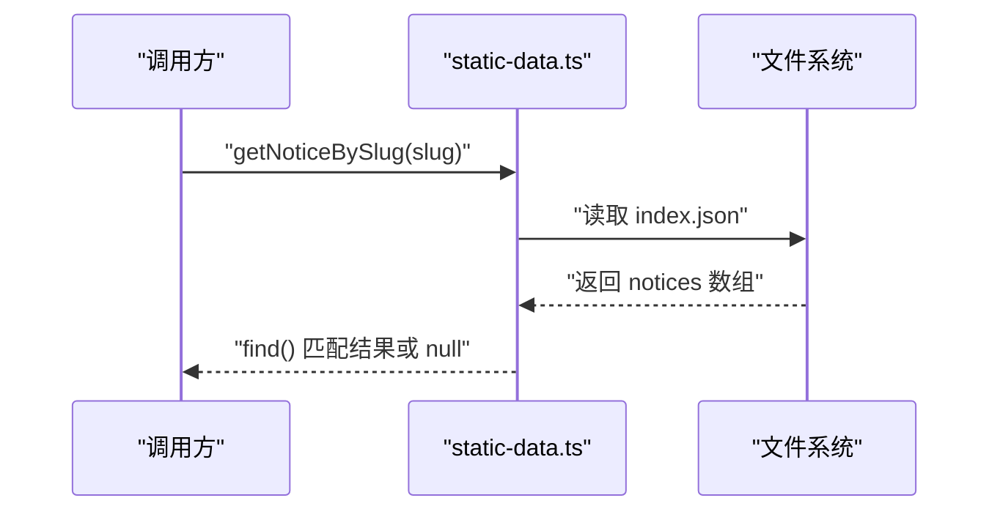
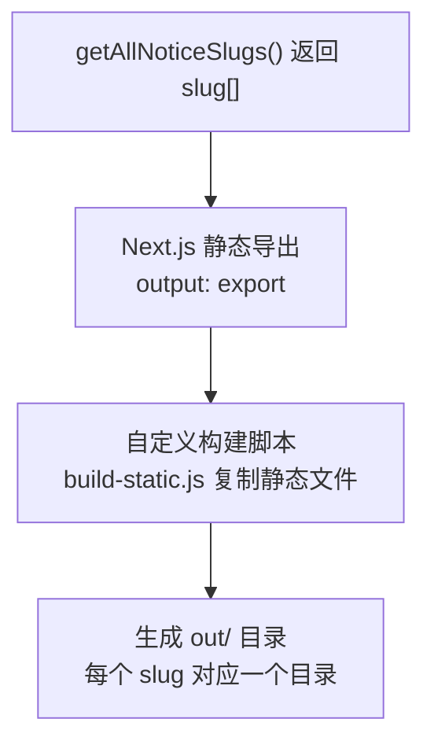
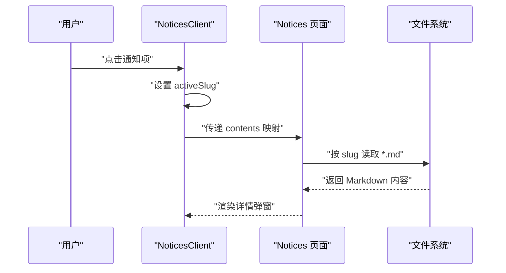
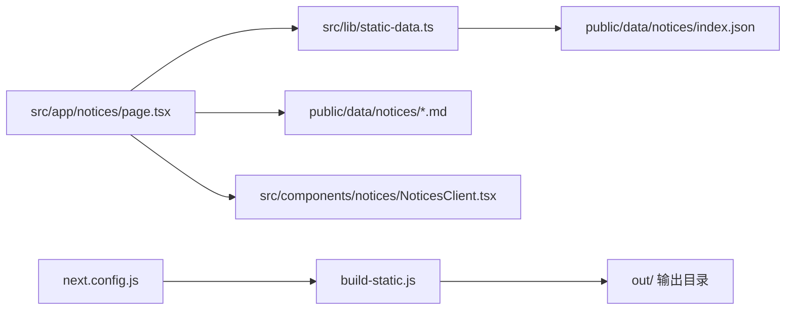

# 通知公告系统

<cite>
**本文档引用的文件**
- [public/data/notices/index.json](file://blog-system2/frontend/public/data/notices/index.json)
- [public/data/notices/welcome.md](file://blog-system2/frontend/public/data/notices/welcome.md)
- [public/data/notices/daibu.md](file://blog-system2/frontend/public/data/notices/daibu.md)
- [src/lib/static-data.ts](file://blog-system2/frontend/src/lib/static-data.ts)
- [src/app/notices/page.tsx](file://blog-system2/frontend/src/app/notices/page.tsx)
- [src/components/notices/NoticesClient.tsx](file://blog-system2/frontend/src/components/notices/NoticesClient.tsx)
- [build-static.js](file://blog-system2/frontend/build-static.js)
- [next.config.js](file://blog-system2/frontend/next.config.js)
- [package.json](file://blog-system2/frontend/package.json)
</cite>

## 目录
1. [简介](#简介)
2. [项目结构](#项目结构)
3. [核心组件](#核心组件)
4. [架构概览](#架构概览)
5. [详细组件分析](#详细组件分析)
6. [依赖关系分析](#依赖关系分析)
7. [性能考量](#性能考量)
8. [故障排除指南](#故障排除指南)
9. [结论](#结论)
10. [附录](#附录)

## 简介
本文件面向通知公告系统的开发者与维护者，系统性阐述 StaticNotice 接口的数据结构设计、置顶机制实现、复合排序算法、单条通知查询与静态路由生成策略，并提供内容组织、SEO 优化与用户体验的最佳实践建议。

## 项目结构
通知公告系统采用 Next.js 静态站点生成（SSG）模式，数据通过本地 JSON 文件与 Markdown 文件进行管理，页面在构建时生成静态 HTML，运行时通过客户端组件实现交互体验。

**图表来源**
- [src/app/notices/page.tsx:1-35](file://blog-system2/frontend/src/app/notices/page.tsx#L1-L35)
- [src/components/notices/NoticesClient.tsx:1-398](file://blog-system2/frontend/src/components/notices/NoticesClient.tsx#L1-L398)
- [src/lib/static-data.ts:138-183](file://blog-system2/frontend/src/lib/static-data.ts#L138-L183)
- [next.config.js:1-48](file://blog-system2/frontend/next.config.js#L1-L48)
- [build-static.js:1-141](file://blog-system2/frontend/build-static.js#L1-L141)
- [package.json:1-72](file://blog-system2/frontend/package.json#L1-L72)

**章节来源**
- [src/app/notices/page.tsx:1-35](file://blog-system2/frontend/src/app/notices/page.tsx#L1-L35)
- [src/lib/static-data.ts:138-183](file://blog-system2/frontend/src/lib/static-data.ts#L138-L183)
- [next.config.js:1-48](file://blog-system2/frontend/next.config.js#L1-L48)
- [build-static.js:1-141](file://blog-system2/frontend/build-static.js#L1-L141)
- [package.json:1-72](file://blog-system2/frontend/package.json#L1-L72)

## 核心组件
本节聚焦 StaticNotice 接口及其相关数据访问函数，解释字段含义与使用方式。

- 字段定义与职责
  - id：通知的唯一递增标识符，用于稳定排序与 DOM 渲染键值
  - slug：通知的 URL 友好标识，用于生成静态路由与单页查询
  - title：通知标题，用于列表与详情展示
  - publishDate：发布日期，字符串格式，用于降序排序
  - pinned：布尔值，标记是否置顶，影响排序优先级

- 数据访问函数
  - getNotices：返回按置顶优先、日期降序排列的通知数组
  - getNoticeBySlug：根据 slug 查询单条通知
  - getAllNoticeSlugs：返回所有通知的 slug 列表，供静态路由生成使用

**章节来源**
- [src/lib/static-data.ts:138-183](file://blog-system2/frontend/src/lib/static-data.ts#L138-L183)
- [public/data/notices/index.json:1-41](file://blog-system2/frontend/public/data/notices/index.json#L1-L41)

## 架构概览
通知公告系统采用“构建时数据加载 + 客户端交互”的架构。页面在构建阶段读取 JSON 索引与 Markdown 正文，生成静态 HTML；运行时客户端组件负责交互式弹窗、动画与响应式布局。

**图表来源**
- [src/app/notices/page.tsx:8-27](file://blog-system2/frontend/src/app/notices/page.tsx#L8-L27)
- [src/lib/static-data.ts:150-178](file://blog-system2/frontend/src/lib/static-data.ts#L150-L178)

**章节来源**
- [src/app/notices/page.tsx:1-35](file://blog-system2/frontend/src/app/notices/page.tsx#L1-L35)
- [src/lib/static-data.ts:150-178](file://blog-system2/frontend/src/lib/static-data.ts#L150-L178)

## 详细组件分析

### StaticNotice 接口与数据模型
StaticNotice 接口定义了通知的核心字段，配合 notices 索引文件实现结构化存储与查询。

**图表来源**
- [src/lib/static-data.ts:138-183](file://blog-system2/frontend/src/lib/static-data.ts#L138-L183)

**章节来源**
- [src/lib/static-data.ts:138-183](file://blog-system2/frontend/src/lib/static-data.ts#L138-L183)
- [public/data/notices/index.json:1-41](file://blog-system2/frontend/public/data/notices/index.json#L1-L41)

### 置顶机制与复合排序算法
getNotices 函数实现了“置顶优先、日期降序”的复合排序。排序逻辑分为两步：
1) 置顶优先：若 a.pinned 为真而 b.pinned 为假，则 a 排在 b 前面；反之亦然
2) 日期降序：当两者置顶状态相同时，按 publishDate 的降序排列

**图表来源**
- [src/lib/static-data.ts:163-173](file://blog-system2/frontend/src/lib/static-data.ts#L163-L173)

**章节来源**
- [src/lib/static-data.ts:163-173](file://blog-system2/frontend/src/lib/static-data.ts#L163-L173)

### 单条通知查询实现
getNoticeBySlug 通过读取 notices 索引，使用字符串匹配查找对应 slug 的通知项。该方法时间复杂度为 O(n)，适用于中等规模数据集。

**图表来源**
- [src/lib/static-data.ts:175-178](file://blog-system2/frontend/src/lib/static-data.ts#L175-L178)

**章节来源**
- [src/lib/static-data.ts:175-178](file://blog-system2/frontend/src/lib/static-data.ts#L175-L178)

### 静态路由生成与页面构建
getAllNoticeSlugs 返回所有通知的 slug，结合 Next.js 的静态导出配置与自定义构建脚本，生成每个通知的独立静态页面。

**图表来源**
- [src/lib/static-data.ts:180-183](file://blog-system2/frontend/src/lib/static-data.ts#L180-L183)
- [next.config.js:6-11](file://blog-system2/frontend/next.config.js#L6-L11)
- [build-static.js:33-87](file://blog-system2/frontend/build-static.js#L33-L87)

**章节来源**
- [src/lib/static-data.ts:180-183](file://blog-system2/frontend/src/lib/static-data.ts#L180-L183)
- [next.config.js:6-11](file://blog-system2/frontend/next.config.js#L6-L11)
- [build-static.js:33-87](file://blog-system2/frontend/build-static.js#L33-L87)

### 客户端渲染与交互
NoticesClient 组件负责：
- 渲染通知列表，支持置顶徽标与相对时间显示
- 点击展开详情弹窗，异步加载对应 Markdown 内容
- 键盘事件处理（ESC 关闭）、滚动条补偿与动画效果

**图表来源**
- [src/components/notices/NoticesClient.tsx:15-398](file://blog-system2/frontend/src/components/notices/NoticesClient.tsx#L15-L398)
- [src/app/notices/page.tsx:8-27](file://blog-system2/frontend/src/app/notices/page.tsx#L8-L27)

**章节来源**
- [src/components/notices/NoticesClient.tsx:15-398](file://blog-system2/frontend/src/components/notices/NoticesClient.tsx#L15-L398)
- [src/app/notices/page.tsx:8-27](file://blog-system2/frontend/src/app/notices/page.tsx#L8-L27)

## 依赖关系分析
通知系统的关键依赖关系如下：
- 页面层依赖数据访问层，数据访问层依赖文件系统
- 构建配置与自定义脚本共同决定静态输出结构
- 客户端组件依赖页面提供的数据与 Markdown 渲染器

**图表来源**
- [src/app/notices/page.tsx:1-35](file://blog-system2/frontend/src/app/notices/page.tsx#L1-L35)
- [src/lib/static-data.ts:138-183](file://blog-system2/frontend/src/lib/static-data.ts#L138-L183)
- [next.config.js:1-48](file://blog-system2/frontend/next.config.js#L1-L48)
- [build-static.js:1-141](file://blog-system2/frontend/build-static.js#L1-L141)

**章节来源**
- [src/app/notices/page.tsx:1-35](file://blog-system2/frontend/src/app/notices/page.tsx#L1-L35)
- [src/lib/static-data.ts:138-183](file://blog-system2/frontend/src/lib/static-data.ts#L138-L183)
- [next.config.js:1-48](file://blog-system2/frontend/next.config.js#L1-L48)
- [build-static.js:1-141](file://blog-system2/frontend/build-static.js#L1-L141)

## 性能考量
- 排序复杂度：getNotices 使用数组 sort，时间复杂度 O(n log n)，空间复杂度 O(n)（浅拷贝）
- 查询复杂度：getNoticeBySlug 使用 find，时间复杂度 O(n)，适合中小规模数据
- 构建期优化：在构建阶段完成数据读取与 Markdown 解析，运行时仅做渲染与交互
- 静态导出：通过 output: export 与自定义脚本确保每个通知页面独立生成，利于 CDN 缓存与 SEO

[本节为通用性能讨论，无需特定文件来源]

## 故障排除指南
- 通知未显示或顺序异常
  - 检查 notices 索引文件中的 pinned 与 publishDate 字段是否正确
  - 确认 getNotices 排序逻辑未被覆盖或修改
- 详情页空白
  - 确认对应 slug 的 Markdown 文件存在且命名规范一致
  - 检查页面构建时是否成功读取 Markdown 内容
- 静态路由缺失
  - 确认 getAllNoticeSlugs 返回的 slug 列表包含目标通知
  - 检查构建脚本是否执行成功，输出目录是否存在对应路径

**章节来源**
- [src/lib/static-data.ts:163-178](file://blog-system2/frontend/src/lib/static-data.ts#L163-L178)
- [src/app/notices/page.tsx:8-27](file://blog-system2/frontend/src/app/notices/page.tsx#L8-L27)
- [build-static.js:33-87](file://blog-system2/frontend/build-static.js#L33-L87)

## 结论
通知公告系统通过清晰的数据模型、稳定的排序策略与静态生成架构，实现了高效的内容管理与良好的用户体验。建议在扩展功能时保持数据结构一致性，并持续关注构建性能与 SEO 优化。

[本节为总结性内容，无需特定文件来源]

## 附录

### 数据字段说明与最佳实践
- id：自动生成，避免手动修改，确保渲染稳定性
- slug：全站唯一，建议使用语义化英文或拼音，便于 SEO 与可读性
- title：简洁明确，包含关键信息；长度适中，避免过长截断
- publishDate：统一使用 ISO 8601 字符串格式，便于排序与解析
- pinned：谨慎使用，仅对重要通知启用，避免信息过载

### SEO 优化建议
- 使用语义化的 slug 提升搜索引擎可读性
- 在 Markdown 正文中合理使用标题层级与关键词
- 配合页面元数据与结构化数据（如需要）增强 SEO 表现

### 用户体验建议
- 置顶通知应显著区分于普通通知（颜色、图标、动画）
- 相对时间显示有助于用户感知时效性
- 弹窗详情页应提供便捷关闭方式与无障碍支持

**章节来源**
- [public/data/notices/index.json:1-41](file://blog-system2/frontend/public/data/notices/index.json#L1-L41)
- [public/data/notices/welcome.md:1-5](file://blog-system2/frontend/public/data/notices/welcome.md#L1-L5)
- [public/data/notices/daibu.md:1-21](file://blog-system2/frontend/public/data/notices/daibu.md#L1-L21)