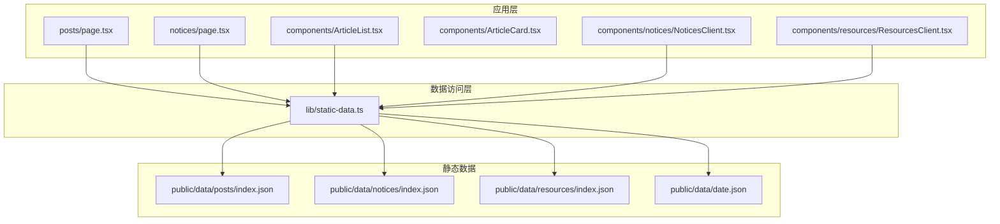
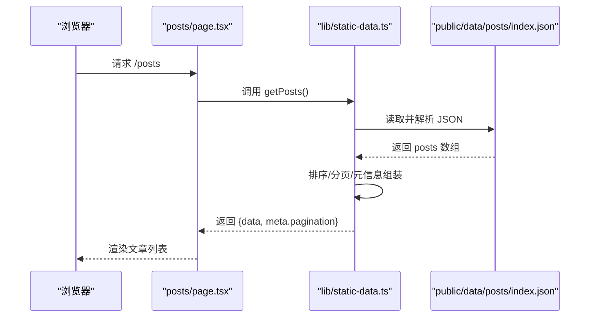
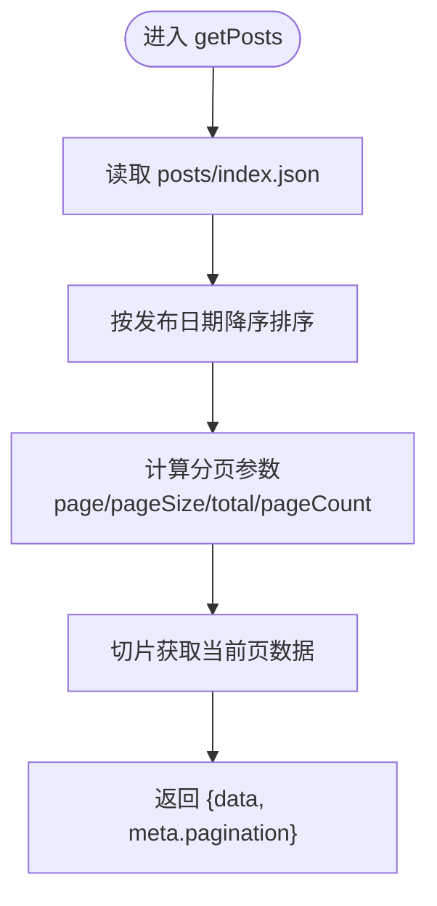
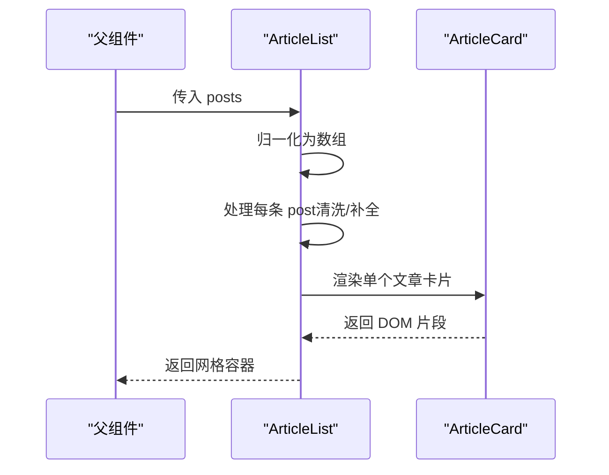
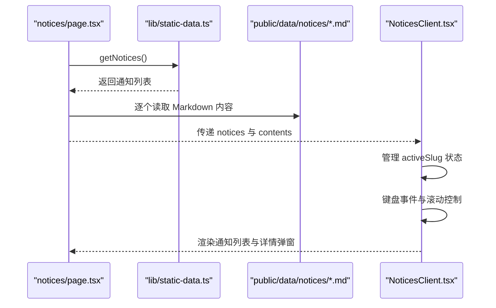
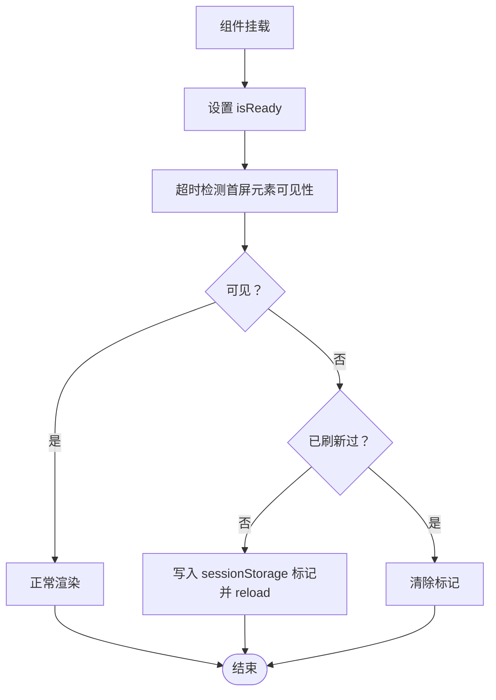
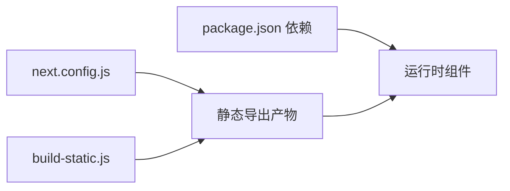

# 数据处理机制

<cite>
**本文引用的文件**   
- [static-data.ts](file://blog-system2/frontend/src/lib/static-data.ts)
- [ArticleList.tsx](file://blog-system2/frontend/src/components/ArticleList.tsx)
- [ArticleCard.tsx](file://blog-system2/frontend/src/components/ArticleCard.tsx)
- [posts/page.tsx](file://blog-system2/frontend/src/app/posts/page.tsx)
- [notices/page.tsx](file://blog-system2/frontend/src/app/notices/page.tsx)
- [notices/NoticesClient.tsx](file://blog-system2/frontend/src/components/notices/NoticesClient.tsx)
- [resources/ResourcesClient.tsx](file://blog-system2/frontend/src/components/resources/ResourcesClient.tsx)
- [index.json（文章索引）](file://blog-system2/frontend/public/data/posts/index.json)
- [index.json（通知索引）](file://blog-system2/frontend/public/data/notices/index.json)
- [date.json](file://blog-system2/frontend/public/data/date.json)
- [data.d.ts](file://blog-system2/frontend/src/types/data.d.ts)
- [next.config.js](file://blog-system2/frontend/next.config.js)
- [build-static.js](file://blog-system2/frontend/build-static.js)
- [package.json](file://blog-system2/frontend/package.json)
</cite>

## 目录
1. [简介](#简介)
2. [项目结构](#项目结构)
3. [核心组件](#核心组件)
4. [架构总览](#架构总览)
5. [详细组件分析](#详细组件分析)
6. [依赖关系分析](#依赖关系分析)
7. [性能考量](#性能考量)
8. [故障排查指南](#故障排查指南)
9. [结论](#结论)
10. [附录](#附录)

## 简介
本文件系统性梳理该博客系统的数据处理机制，重点覆盖静态数据访问层的设计与实现、文章列表组件的数据处理流程（分页、排序、过滤）、客户端数据组件的状态管理与UI更新、数据预加载与性能优化策略、数据验证与错误处理、数据同步与版本管理、迁移策略、最佳实践与调试技巧，并提供扩展开发指导。

## 项目结构
前端采用 Next.js 应用程序，数据主要来源于 public/data 下的 JSON 文件与静态 Markdown 文件。数据访问层通过 lib/static-data.ts 提供统一接口；页面组件负责调用数据接口并渲染；客户端组件负责状态管理与交互。

**图表来源**
- [posts/page.tsx:12-16](file://blog-system2/frontend/src/app/posts/page.tsx#L12-L16)
- [notices/page.tsx:1-35](file://blog-system2/frontend/src/app/notices/page.tsx#L1-L35)
- [static-data.ts:32-43](file://blog-system2/frontend/src/lib/static-data.ts#L32-L43)
- [index.json（文章索引）:1-103](file://blog-system2/frontend/public/data/posts/index.json#L1-L103)
- [index.json（通知索引）:1-41](file://blog-system2/frontend/public/data/notices/index.json#L1-L41)

**章节来源**
- [posts/page.tsx:12-16](file://blog-system2/frontend/src/app/posts/page.tsx#L12-L16)
- [notices/page.tsx:1-35](file://blog-system2/frontend/src/app/notices/page.tsx#L1-L35)
- [static-data.ts:32-43](file://blog-system2/frontend/src/lib/static-data.ts#L32-L43)
- [index.json（文章索引）:1-103](file://blog-system2/frontend/public/data/posts/index.json#L1-L103)
- [index.json（通知索引）:1-41](file://blog-system2/frontend/public/data/notices/index.json#L1-L41)

## 核心组件
- 静态数据访问层：提供文章、通知、资源等数据的读取与加工接口，支持排序、分页、过滤与ID映射。
- 文章列表组件：负责接收数据、进行必要的字段清洗与URL补全、渲染卡片网格。
- 客户端组件：负责状态管理（如通知详情弹窗）、动画与交互、资源导航的自愈刷新。
- 构建与静态导出：通过 next.config.js 与 build-static.js 实现静态站点生成与数据目录复制。

**章节来源**
- [static-data.ts:45-73](file://blog-system2/frontend/src/lib/static-data.ts#L45-L73)
- [ArticleList.tsx:28-71](file://blog-system2/frontend/src/components/ArticleList.tsx#L28-L71)
- [ResourcesClient.tsx:34-92](file://blog-system2/frontend/src/components/resources/ResourcesClient.tsx#L34-L92)
- [next.config.js:6-44](file://blog-system2/frontend/next.config.js#L6-L44)
- [build-static.js:33-87](file://blog-system2/frontend/build-static.js#L33-L87)

## 架构总览
系统采用“静态数据 + 客户端渲染”的混合模式：
- 构建期：读取 public/data 下的 JSON 与 Markdown，生成静态 HTML。
- 运行期：客户端组件根据路由与状态进行交互，必要时从静态数据源拉取内容。

**图表来源**
- [posts/page.tsx:12-16](file://blog-system2/frontend/src/app/posts/page.tsx#L12-L16)
- [static-data.ts:45-73](file://blog-system2/frontend/src/lib/static-data.ts#L45-L73)
- [index.json（文章索引）:1-103](file://blog-system2/frontend/public/data/posts/index.json#L1-L103)

## 详细组件分析

### 静态数据访问层（lib/static-data.ts）
职责与特性：
- 文章索引读取与ID映射：从 posts/index.json 读取，为每条记录分配连续ID。
- 文章获取与分页：支持分页参数，返回带分页元信息的响应对象。
- 排序规则：按发布日期降序排列。
- 相关文章：排除当前文章后按发布时间降序取前N条。
- 通知获取：按置顶优先、日期降序排列。
- 资源获取：直接读取 resources/index.json。
- 工具函数：媒体URL处理、获取全部slug等。

**图表来源**
- [static-data.ts:45-73](file://blog-system2/frontend/src/lib/static-data.ts#L45-L73)

**章节来源**
- [static-data.ts:32-43](file://blog-system2/frontend/src/lib/static-data.ts#L32-L43)
- [static-data.ts:45-73](file://blog-system2/frontend/src/lib/static-data.ts#L45-L73)
- [static-data.ts:79-83](file://blog-system2/frontend/src/lib/static-data.ts#L79-L83)
- [static-data.ts:85-89](file://blog-system2/frontend/src/lib/static-data.ts#L85-L89)
- [static-data.ts:101-122](file://blog-system2/frontend/src/lib/static-data.ts#L101-L122)
- [static-data.ts:164-173](file://blog-system2/frontend/src/lib/static-data.ts#L164-L173)
- [static-data.ts:208-213](file://blog-system2/frontend/src/lib/static-data.ts#L208-L213)

### 文章列表组件（components/ArticleList.tsx）
职责与特性：
- 输入兼容：支持数组或带有 data 字段的对象。
- 数据清洗：补全缺失字段、标准化日期、拼接封面图URL。
- 渲染：根据数据长度决定空态或网格布局，逐项渲染卡片。
- 卡片链接：跳转至对应文章路由。

**图表来源**
- [ArticleList.tsx:28-71](file://blog-system2/frontend/src/components/ArticleList.tsx#L28-L71)
- [ArticleCard.tsx:29-198](file://blog-system2/frontend/src/components/ArticleCard.tsx#L29-L198)

**章节来源**
- [ArticleList.tsx:12-26](file://blog-system2/frontend/src/components/ArticleList.tsx#L12-L26)
- [ArticleList.tsx:28-71](file://blog-system2/frontend/src/components/ArticleList.tsx#L28-L71)
- [ArticleCard.tsx:37-84](file://blog-system2/frontend/src/components/ArticleCard.tsx#L37-L84)

### 通知页面与客户端组件（app/notices/page.tsx 与 components/notices/NoticesClient.tsx）
职责与特性：
- 服务端读取：在构建时读取通知索引与各通知 Markdown 内容。
- 客户端交互：维护活动通知的打开/关闭状态，ESC 关闭、遮罩点击关闭、滚动锁定与补偿。
- 日期格式化：相对时间显示。
- 弹窗细节：使用动画库实现进入/退出动画与背景模糊。

**图表来源**
- [notices/page.tsx:9-34](file://blog-system2/frontend/src/app/notices/page.tsx#L9-L34)
- [static-data.ts:150-161](file://blog-system2/frontend/src/lib/static-data.ts#L150-L161)
- [static-data.ts:175-178](file://blog-system2/frontend/src/lib/static-data.ts#L175-L178)
- [notices/NoticesClient.tsx:15-51](file://blog-system2/frontend/src/components/notices/NoticesClient.tsx#L15-L51)
- [notices/NoticesClient.tsx:53-65](file://blog-system2/frontend/src/components/notices/NoticesClient.tsx#L53-L65)

**章节来源**
- [notices/page.tsx:9-34](file://blog-system2/frontend/src/app/notices/page.tsx#L9-L34)
- [static-data.ts:150-161](file://blog-system2/frontend/src/lib/static-data.ts#L150-L161)
- [static-data.ts:175-178](file://blog-system2/frontend/src/lib/static-data.ts#L175-L178)
- [notices/NoticesClient.tsx:15-51](file://blog-system2/frontend/src/components/notices/NoticesClient.tsx#L15-L51)
- [notices/NoticesClient.tsx:53-65](file://blog-system2/frontend/src/components/notices/NoticesClient.tsx#L53-L65)

### 资源导航客户端组件（components/resources/ResourcesClient.tsx）
职责与特性：
- 分类切换：使用动画库实现标签切换与描述过渡。
- 自愈刷新：生产环境检测首屏元素是否可见，若异常自动刷新一次。
- 下载识别：根据URL后缀判断是否为可下载资源，选择不同图标。

**图表来源**
- [ResourcesClient.tsx:44-92](file://blog-system2/frontend/src/components/resources/ResourcesClient.tsx#L44-L92)

**章节来源**
- [ResourcesClient.tsx:34-92](file://blog-system2/frontend/src/components/resources/ResourcesClient.tsx#L34-L92)

### 静态数据与类型声明
- JSON/Markdown 模块声明：允许在 TypeScript 中导入 JSON 与 Markdown 文件。
- 数据文件位置：文章、通知、资源、日历等数据均位于 public/data 下。

**章节来源**
- [data.d.ts:1-10](file://blog-system2/frontend/src/types/data.d.ts#L1-L10)
- [index.json（文章索引）:1-103](file://blog-system2/frontend/public/data/posts/index.json#L1-L103)
- [index.json（通知索引）:1-41](file://blog-system2/frontend/public/data/notices/index.json#L1-L41)
- [date.json:1-284](file://blog-system2/frontend/public/data/date.json#L1-L284)

## 依赖关系分析
- 构建配置：next.config.js 控制输出为静态、路径前缀、图片域名与格式、忽略某些国际化模块。
- 构建脚本：build-static.js 将 .next 产物与 public/data 复制到 out 目录，形成可独立托管的静态站点。
- 依赖包：包含搜索、动画、主题、图标等依赖，支撑搜索、动画与UI组件。

**图表来源**
- [next.config.js:6-44](file://blog-system2/frontend/next.config.js#L6-L44)
- [build-static.js:33-87](file://blog-system2/frontend/build-static.js#L33-L87)
- [package.json:13-72](file://blog-system2/frontend/package.json#L13-L72)

**章节来源**
- [next.config.js:6-44](file://blog-system2/frontend/next.config.js#L6-L44)
- [build-static.js:33-87](file://blog-system2/frontend/build-static.js#L33-L87)
- [package.json:13-72](file://blog-system2/frontend/package.json#L13-L72)

## 性能考量
- 图片优化：Next.js 图像优化开启，指定域名与格式，提高缓存与加载效率。
- 静态导出：输出为静态HTML，减少服务器压力，利于CDN分发。
- 客户端自愈：资源页在生产环境检测首屏元素可见性，异常时自动刷新一次，提升稳定性。
- 懒加载与回退：文章卡片图片懒加载并在加载失败时回退到默认图。

**章节来源**
- [next.config.js:20-33](file://blog-system2/frontend/next.config.js#L20-L33)
- [ResourcesClient.tsx:48-92](file://blog-system2/frontend/src/components/resources/ResourcesClient.tsx#L48-L92)
- [ArticleCard.tsx:106-118](file://blog-system2/frontend/src/components/ArticleCard.tsx#L106-L118)

## 故障排查指南
- 数据为空或渲染异常
  - 检查 public/data 下对应 JSON 是否存在且格式正确。
  - 确认 getPosts/getNotices 等函数是否被正确调用。
- 图片加载失败
  - 查看 ArticleCard 的图片回退逻辑与控制台错误。
  - 确认图片URL是否符合预期（本地/外部API）。
- 通知详情无法打开
  - 检查 notices 页面是否正确读取 Markdown 内容。
  - 确认 NoticesClient 的状态管理与键盘事件绑定。
- 首屏空白或白屏
  - 生产环境资源页具备自愈刷新机制，观察是否自动恢复。
  - 检查 build-static.js 是否正确复制 public/data。

**章节来源**
- [ArticleCard.tsx:72-84](file://blog-system2/frontend/src/components/ArticleCard.tsx#L72-L84)
- [notices/page.tsx:9-27](file://blog-system2/frontend/src/app/notices/page.tsx#L9-L27)
- [notices/NoticesClient.tsx:31-51](file://blog-system2/frontend/src/components/notices/NoticesClient.tsx#L31-L51)
- [ResourcesClient.tsx:48-92](file://blog-system2/frontend/src/components/resources/ResourcesClient.tsx#L48-L92)
- [build-static.js:78-83](file://blog-system2/frontend/build-static.js#L78-L83)

## 结论
该系统通过“静态数据 + 客户端渲染”的方式实现了高效、可维护的数据处理链路。静态数据访问层提供了统一的读取、排序、分页与过滤能力；页面与客户端组件分别承担服务端渲染与交互状态管理；构建与静态导出确保了部署的灵活性与性能。配合图片优化、自愈刷新与错误回退机制，整体具备良好的可用性与扩展性。

## 附录

### 数据处理最佳实践
- 数据结构一致性：确保 JSON 字段与类型声明一致，避免运行时类型错误。
- 分页与排序：在数据访问层集中处理，避免在组件中重复计算。
- 缓存策略：利用静态导出与CDN缓存，减少重复请求。
- 错误与回退：为图片与网络请求提供明确的回退与错误提示。
- 可观测性：在关键路径保留日志开关，便于定位问题。

### 扩展开发指导
- 新增数据源
  - 在 public/data 下新增 JSON/Markdown 文件。
  - 在 lib/static-data.ts 中添加对应的读取与加工函数。
  - 在页面或客户端组件中调用新函数并渲染。
- 过滤与排序
  - 在 getPosts 中扩展 filters 参数，结合 params.filters 实现多维过滤。
- 版本与迁移
  - 对 JSON 结构变更时，保留向后兼容逻辑或提供迁移脚本。
  - 使用版本号字段标识数据结构版本，便于升级与回滚。
- 搜索与聚合
  - 可参考搜索组件对静态数据的聚合方式，扩展更多数据源的检索入口。