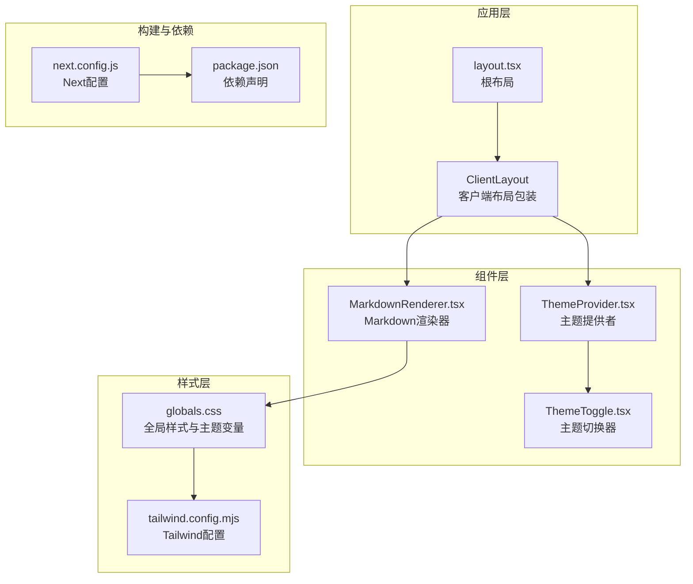
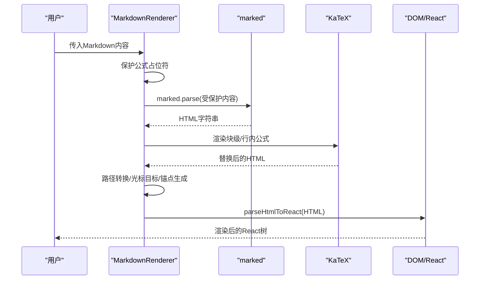
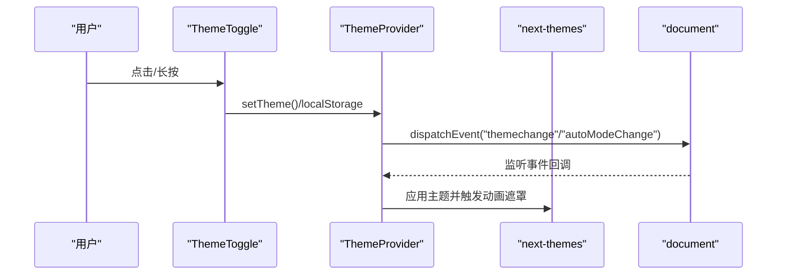
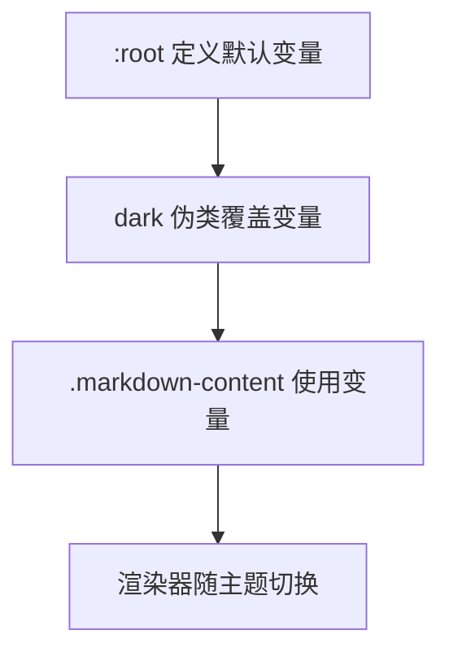
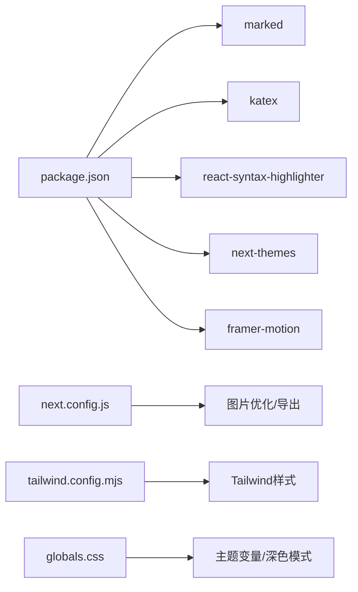

# Markdown渲染引擎

<cite>
**本文引用的文件**
- [MarkdownRenderer.tsx](file://blog-system2/frontend/src/components/MarkdownRenderer.tsx)
- [ThemeProvider.tsx](file://blog-system2/frontend/src/components/theme/ThemeProvider.tsx)
- [ThemeToggle.tsx](file://blog-system2/frontend/src/components/theme/ThemeToggle.tsx)
- [layout.tsx](file://blog-system2/frontend/src/app/layout.tsx)
- [globals.css](file://blog-system2/frontend/src/app/globals.css)
- [tailwind.config.mjs](file://blog-system2/frontend/tailwind.config.mjs)
- [next.config.js](file://blog-system2/frontend/next.config.js)
- [package.json](file://blog-system2/frontend/package.json)
- [12th_meeting_NLP.md](file://blog-system2/frontend/public/data/posts/12th_meeting_NLP.md)
- [README.md](file://blog-system2/frontend/public/data/posts/README.md)
</cite>

## 目录
1. [简介](#简介)
2. [项目结构](#项目结构)
3. [核心组件](#核心组件)
4. [架构总览](#架构总览)
5. [详细组件分析](#详细组件分析)
6. [依赖关系分析](#依赖关系分析)
7. [性能考量](#性能考量)
8. [故障排查指南](#故障排查指南)
9. [结论](#结论)
10. [附录](#附录)

## 简介
本项目提供一个现代化的Markdown渲染引擎，基于marked.js进行解析，结合KaTeX实现数学公式渲染，使用react-syntax-highlighter进行代码高亮，并通过自定义渲染器与主题系统实现深色/浅色模式下的样式切换与一致性体验。渲染器支持：
- 语法解析与自定义渲染器钩子
- 代码块高亮与折叠/展开交互
- 数学公式（行内/块级）渲染
- 图片路径转换与灯箱预览
- 锚点链接生成与光标目标标记
- 主题适配与颜色变量管理

## 项目结构
前端采用Next.js应用结构，Markdown渲染器位于组件层，主题系统位于主题组件层，样式与主题变量集中在全局样式文件中。



图表来源
- [layout.tsx:28-47](file://blog-system2/frontend/src/app/layout.tsx#L28-L47)
- [MarkdownRenderer.tsx:1-718](file://blog-system2/frontend/src/components/MarkdownRenderer.tsx#L1-L718)
- [ThemeProvider.tsx:40-63](file://blog-system2/frontend/src/components/theme/ThemeProvider.tsx#L40-L63)
- [ThemeToggle.tsx:10-343](file://blog-system2/frontend/src/components/theme/ThemeToggle.tsx#L10-L343)
- [globals.css:1-681](file://blog-system2/frontend/src/app/globals.css#L1-L681)
- [tailwind.config.mjs:1-18](file://blog-system2/frontend/tailwind.config.mjs#L1-L18)
- [next.config.js:1-48](file://blog-system2/frontend/next.config.js#L1-L48)
- [package.json:1-72](file://blog-system2/frontend/package.json#L1-L72)

章节来源
- [layout.tsx:28-47](file://blog-system2/frontend/src/app/layout.tsx#L28-L47)
- [globals.css:1-681](file://blog-system2/frontend/src/app/globals.css#L1-L681)
- [tailwind.config.mjs:1-18](file://blog-system2/frontend/tailwind.config.mjs#L1-L18)
- [next.config.js:1-48](file://blog-system2/frontend/next.config.js#L1-L48)
- [package.json:1-72](file://blog-system2/frontend/package.json#L1-L72)

## 核心组件
- MarkdownRenderer：负责marked解析、KaTeX公式替换、图片路径转换、锚点生成、代码块自定义渲染与React节点解析。
- ThemeProvider/ThemeToggle：提供深色/浅色主题切换、自动模式、减少动画偏好检测与主题事件派发。
- 全局样式与主题变量：通过CSS自定义属性与Tailwind dark模式实现主题切换与组件样式。

章节来源
- [MarkdownRenderer.tsx:12-718](file://blog-system2/frontend/src/components/MarkdownRenderer.tsx#L12-L718)
- [ThemeProvider.tsx:40-161](file://blog-system2/frontend/src/components/theme/ThemeProvider.tsx#L40-L161)
- [ThemeToggle.tsx:10-343](file://blog-system2/frontend/src/components/theme/ThemeToggle.tsx#L10-L343)
- [globals.css:117-184](file://blog-system2/frontend/src/app/globals.css#L117-L184)

## 架构总览
渲染引擎采用“解析-保护-渲染-替换-增强”的流程：
- marked解析：启用breaks与gfm，自定义renderer将代码块转换为自定义元素占位符。
- 公式保护与替换：先将行内/块级公式保护为占位符，再用KaTeX渲染并回填。
- 资源路径转换：将相对路径转换为服务端可用路径。
- DOM增强：为图片、链接、引用等元素添加光标目标类，生成标题锚点ID。
- React解析：将包含占位符的HTML解析为React节点树，插入自定义代码块组件。



图表来源
- [MarkdownRenderer.tsx:465-594](file://blog-system2/frontend/src/components/MarkdownRenderer.tsx#L465-L594)
- [MarkdownRenderer.tsx:596-632](file://blog-system2/frontend/src/components/MarkdownRenderer.tsx#L596-L632)

## 详细组件分析

### MarkdownRenderer组件
- marked集成与自定义渲染器
  - 使用自定义renderer将代码块转换为带data属性的占位符，便于后续React解析与高亮。
  - 通过marked.use注册自定义renderer，确保解析阶段即产出可识别的占位符。
- 公式渲染（KaTeX）
  - 保护块级公式（$$...$$）与行内公式（$...$），分别存入数组并替换为占位符。
  - 使用katex.renderToString渲染，displayMode区分块级/行内，throwOnError=false保证健壮性。
  - 回填时捕获异常，降级为预格式化或代码标签，避免渲染中断。
- 图片路径转换
  - 当提供slug时，将相对路径转换为服务端路径。
- 锚点与光标目标
  - 为图片、链接、引用等元素确保包含cursor-target类，避免重新渲染后丢失。
  - 遍历标题生成唯一id，避免重复，支持目录导航。
- 代码块组件
  - CodeBlock组件支持复制、折叠/展开、深色/浅色主题切换、行数统计与语法高亮。
  - 通过MutationObserver监听<html>类变化，实时切换oneDark/oneLight主题。
- React解析与Portal灯箱
  - parseHtmlToReact遍历HTML，遇到占位符替换为CodeBlock组件，其余作为dangerouslySetInnerHTML插入。
  - 使用createPortal将图片灯箱渲染到body，配合Framer Motion实现平滑入场/出场。

```mermaid
classDiagram
class MarkdownRenderer {
+renderedContent : string
+openLightbox(src)
+closeLightbox()
+parseHtmlToReact(html)
}
class CodeBlock {
+language : string
+children : string
+handleCopy()
+setCollapsed()
}
class Renderer {
+code({text, lang})
}
MarkdownRenderer --> Renderer : "注册自定义渲染器"
MarkdownRenderer --> CodeBlock : "解析后渲染"
```

图表来源
- [MarkdownRenderer.tsx:413-420](file://blog-system2/frontend/src/components/MarkdownRenderer.tsx#L413-L420)
- [MarkdownRenderer.tsx:342-411](file://blog-system2/frontend/src/components/MarkdownRenderer.tsx#L342-L411)
- [MarkdownRenderer.tsx:596-632](file://blog-system2/frontend/src/components/MarkdownRenderer.tsx#L596-L632)

章节来源
- [MarkdownRenderer.tsx:12-718](file://blog-system2/frontend/src/components/MarkdownRenderer.tsx#L12-L718)

### 主题系统（ThemeProvider/ThemeToggle）
- ThemeProvider
  - 基于next-themes提供主题上下文，默认禁用系统主题跟随。
  - 包装ThemeLogicProvider，处理自动模式、用户覆盖、减少动画偏好与主题切换动画遮罩。
  - 监听自定义事件themechange/autoModeChange，驱动主题切换与持久化。
- ThemeToggle
  - 支持点击切换与长按800ms进入自动模式。
  - 自动模式下根据时间段（6:00-18:00）自动切换light/dark。
  - 通过自定义事件通知全局主题变化，触发页面过渡动画遮罩。



图表来源
- [ThemeProvider.tsx:65-149](file://blog-system2/frontend/src/components/theme/ThemeProvider.tsx#L65-L149)
- [ThemeToggle.tsx:54-90](file://blog-system2/frontend/src/components/theme/ThemeToggle.tsx#L54-L90)
- [ThemeToggle.tsx:124-158](file://blog-system2/frontend/src/components/theme/ThemeToggle.tsx#L124-L158)

章节来源
- [ThemeProvider.tsx:40-161](file://blog-system2/frontend/src/components/theme/ThemeProvider.tsx#L40-L161)
- [ThemeToggle.tsx:10-343](file://blog-system2/frontend/src/components/theme/ThemeToggle.tsx#L10-L343)

### 样式与主题变量
- CSS自定义属性
  - 在:root与.dark中定义主题变量，如--text-primary、--primary-color等，供渲染器样式使用。
- Tailwind dark模式
  - darkMode: "class"，通过<html>的class切换实现深色/浅色模式。
- 渲染器样式
  - .markdown-content定义标题、段落、列表、代码块、引用、表格、链接、图片等样式。
  - 通过var(--*)变量实现主题切换，确保一致性与可维护性。



图表来源
- [globals.css:117-184](file://blog-system2/frontend/src/app/globals.css#L117-L184)
- [MarkdownRenderer.tsx:18-52](file://blog-system2/frontend/src/components/MarkdownRenderer.tsx#L18-L52)

章节来源
- [globals.css:1-681](file://blog-system2/frontend/src/app/globals.css#L1-L681)
- [tailwind.config.mjs:1-18](file://blog-system2/frontend/tailwind.config.mjs#L1-L18)
- [MarkdownRenderer.tsx:18-335](file://blog-system2/frontend/src/components/MarkdownRenderer.tsx#L18-L335)

## 依赖关系分析
- 核心依赖
  - marked：Markdown解析与自定义渲染器钩子。
  - katex：LaTeX数学公式渲染，需引入katex.min.css。
  - react-syntax-highlighter：代码高亮，oneDark/oneLight主题。
  - next-themes：主题提供与切换。
  - framer-motion：动画与Portal灯箱。
- 构建与运行
  - next.config.js：静态导出、GitHub Pages适配、图片优化与Webpack插件忽略moment locale。
  - tailwind.config.mjs：Tailwind内容扫描与插件启用。
  - package.json：依赖版本与脚本。



图表来源
- [package.json:13-42](file://blog-system2/frontend/package.json#L13-L42)
- [next.config.js:1-48](file://blog-system2/frontend/next.config.js#L1-L48)
- [tailwind.config.mjs:1-18](file://blog-system2/frontend/tailwind.config.mjs#L1-L18)
- [globals.css:1-681](file://blog-system2/frontend/src/app/globals.css#L1-L681)

章节来源
- [package.json:1-72](file://blog-system2/frontend/package.json#L1-L72)
- [next.config.js:1-48](file://blog-system2/frontend/next.config.js#L1-L48)
- [tailwind.config.mjs:1-18](file://blog-system2/frontend/tailwind.config.mjs#L1-L18)
- [globals.css:1-681](file://blog-system2/frontend/src/app/globals.css#L1-L681)

## 性能考量
- 解析与替换
  - 使用受保护占位符避免公式渲染与marked解析冲突，降低二次解析成本。
  - useMemo缓存渲染结果，避免重复解析与替换。
- DOM操作
  - 仅在挂载后绑定事件，清理事件监听，避免内存泄漏。
  - 通过MutationObserver监听<html>类变化，避免频繁重渲染。
- 动画与渲染
  - 使用Framer Motion进行轻量动画，减少不必要的重排。
  - Portal将灯箱渲染到body，避免层级与溢出问题。
- 代码块
  - 超过阈值自动折叠，减少初始渲染体积。
  - 语法高亮按需渲染，避免全量高亮。
- 图片
  - 点击放大使用Portal与受控状态，避免阻塞主线程。
  - 图片hover缩放与阴影通过CSS变量与过渡实现，减少JavaScript开销。

章节来源
- [MarkdownRenderer.tsx:465-594](file://blog-system2/frontend/src/components/MarkdownRenderer.tsx#L465-L594)
- [MarkdownRenderer.tsx:342-411](file://blog-system2/frontend/src/components/MarkdownRenderer.tsx#L342-L411)

## 故障排查指南
- 数学公式不显示
  - 检查公式语法：行内使用$...$，块级使用$$...$$。
  - 确认katex.min.css已引入，渲染异常会降级为预格式化或代码标签。
  - 查看浏览器控制台是否有KaTeX渲染错误。
- 代码高亮不生效
  - 确保代码块包含语言标识（如```python）。
  - 检查oneDark/oneLight主题是否正确加载。
- 图片路径错误
  - 使用相对路径时提供slug，渲染器会自动转换为服务端路径。
  - 确认图片资源存在于public/data/posts目录。
- 锚点无效
  - 标题会自动生成唯一id，避免重复；若自定义id冲突，请检查重复。
- 主题切换异常
  - 检查<html>的class是否正确切换（dark/light）。
  - 确认next-themes配置与Tailwind darkMode一致。
- 动画卡顿
  - 若用户启用了“减少动画”，组件会自动降级为无动画。
  - 检查浏览器性能面板，确认是否存在过度重绘。

章节来源
- [MarkdownRenderer.tsx:465-514](file://blog-system2/frontend/src/components/MarkdownRenderer.tsx#L465-L514)
- [MarkdownRenderer.tsx:516-544](file://blog-system2/frontend/src/components/MarkdownRenderer.tsx#L516-L544)
- [ThemeProvider.tsx:87-149](file://blog-system2/frontend/src/components/theme/ThemeProvider.tsx#L87-L149)
- [globals.css:380-387](file://blog-system2/frontend/src/app/globals.css#L380-L387)

## 结论
本渲染引擎通过marked自定义渲染器、KaTeX公式保护与替换、react-syntax-highlighter高亮、以及主题系统与样式变量，实现了高性能、可扩展、主题一致的Markdown渲染体验。通过占位符解析、事件清理、Portal灯箱与动画优化，兼顾了用户体验与性能表现。建议在生产环境中：
- 为长文档启用代码块折叠与懒加载
- 使用缓存策略减少重复解析
- 为图片与公式提供CDN与预加载
- 保持主题变量与Tailwind配置一致性

## 附录

### 使用示例与扩展方法
- 基本使用
  - 将Markdown内容传入MarkdownRenderer组件，可选className与slug。
  - slug用于图片路径转换，确保相对路径正确解析。
- 自定义渲染器扩展
  - 通过marked.use注册自定义renderer，将特定语法转换为占位符或自定义组件。
  - 在parseHtmlToReact中解析占位符并渲染对应React组件。
- 数学公式
  - 行内公式：$...$
  - 块级公式：$$...$$
  - 渲染失败时自动降级，不影响整体渲染。
- 主题适配
  - 通过next-themes与Tailwind darkMode实现深色/浅色切换。
  - 主题变量集中于:root与.dark，确保组件样式一致。
- 图片与锚点
  - 点击图片进入灯箱预览，ESC关闭并恢复滚动。
  - 自动生成标题锚点ID，避免重复。

章节来源
- [MarkdownRenderer.tsx:422-718](file://blog-system2/frontend/src/components/MarkdownRenderer.tsx#L422-L718)
- [12th_meeting_NLP.md:1-645](file://blog-system2/frontend/public/data/posts/12th_meeting_NLP.md#L1-L645)
- [README.md:1-209](file://blog-system2/frontend/public/data/posts/README.md#L1-L209)