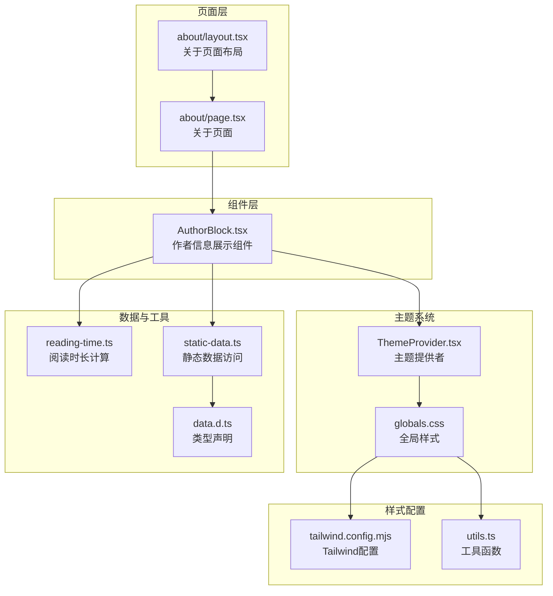
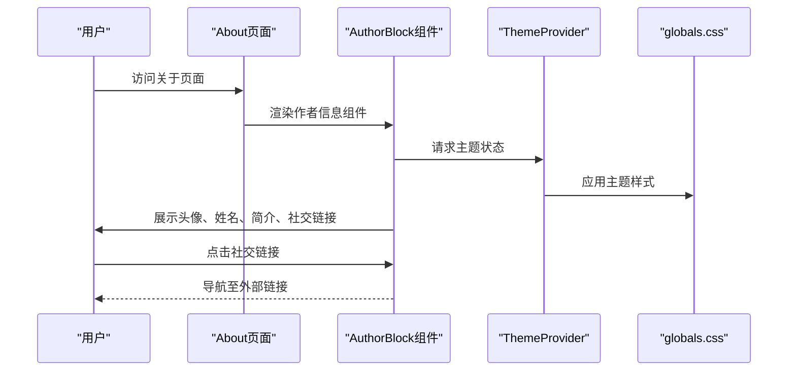
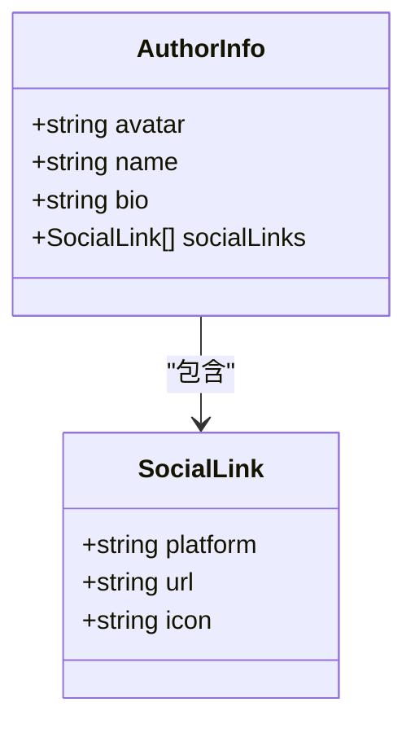
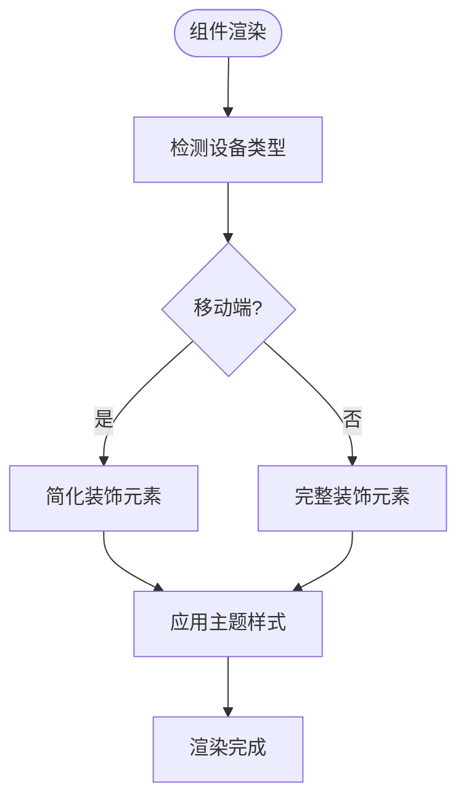
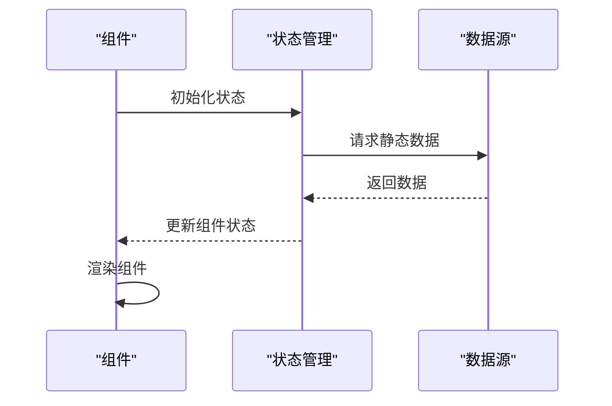
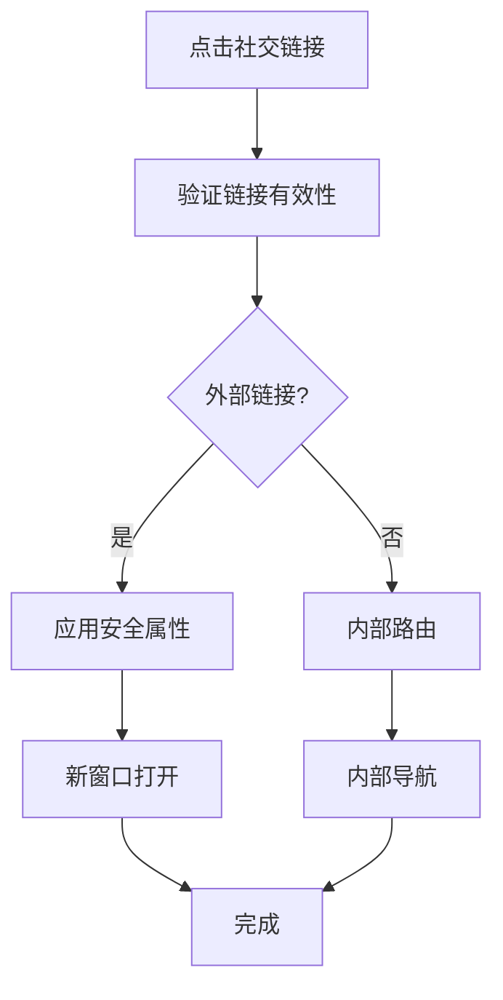
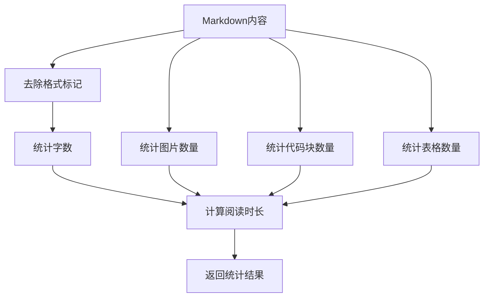
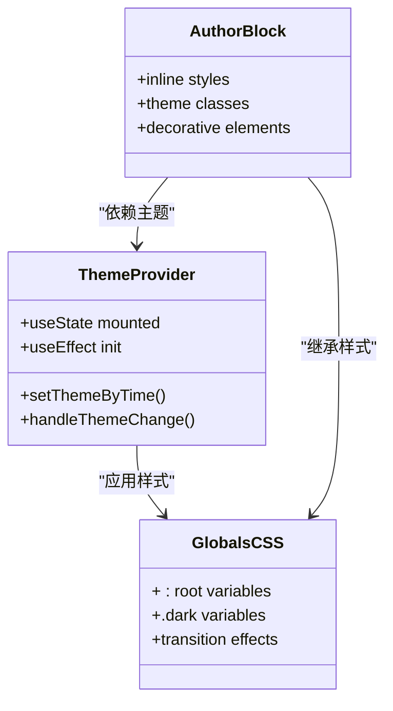
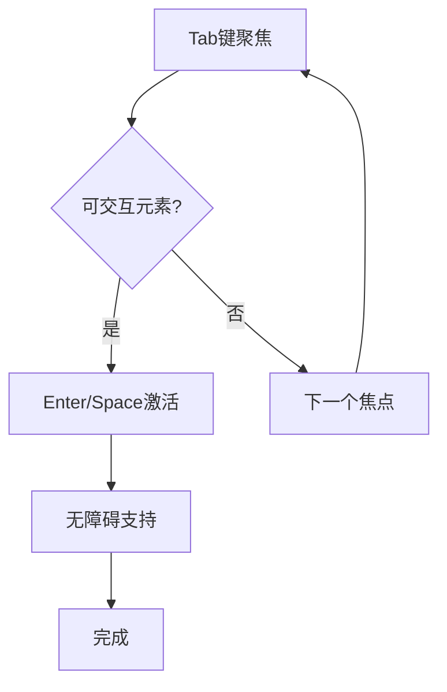
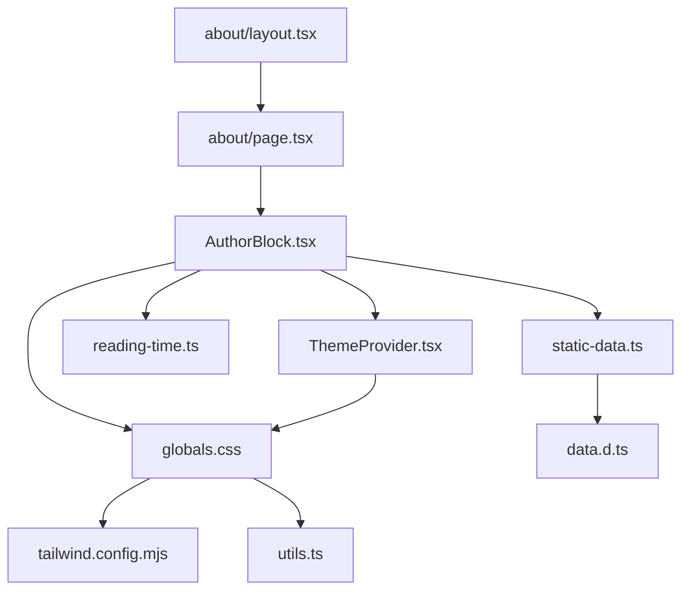

# 作者信息展示

<cite>
**本文档引用的文件**
- [AuthorBlock.tsx](file://blog-system2/frontend/src/components/post/AuthorBlock.tsx)
- [page.tsx](file://blog-system2/frontend/src/app/about/page.tsx)
- [layout.tsx](file://blog-system2/frontend/src/app/about/layout.tsx)
- [ThemeProvider.tsx](file://blog-system2/frontend/src/components/theme/ThemeProvider.tsx)
- [globals.css](file://blog-system2/frontend/src/app/globals.css)
- [reading-time.ts](file://blog-system2/frontend/src/lib/reading-time.ts)
- [static-data.ts](file://blog-system2/frontend/src/lib/static-data.ts)
- [data.d.ts](file://blog-system2/frontend/src/types/data.d.ts)
- [tailwind.config.mjs](file://blog-system2/frontend/tailwind.config.mjs)
- [utils.ts](file://blog-system2/frontend/src/lib/utils.ts)
</cite>

## 目录
1. [简介](#简介)
2. [项目结构](#项目结构)
3. [核心组件](#核心组件)
4. [架构概览](#架构概览)
5. [详细组件分析](#详细组件分析)
6. [依赖关系分析](#依赖关系分析)
7. [性能考量](#性能考量)
8. [故障排除指南](#故障排除指南)
9. [结论](#结论)
10. [附录](#附录)

## 简介
本文档详细介绍作者信息展示组件的设计与实现，涵盖数据结构、布局设计、响应式适配、数据绑定与更新机制、社交链接处理与安全性、统计信息计算与展示、自定义样式与主题集成，以及无障碍访问与键盘导航支持。该组件采用现代化前端技术栈，结合主题系统与响应式设计，为用户提供一致且美观的作者信息展示体验。

## 项目结构
作者信息展示功能主要由以下文件构成：
- 组件文件：负责渲染作者信息与社交链接
- 页面文件：承载作者信息展示的页面布局与装饰
- 主题系统：提供深浅色主题切换与动画效果
- 数据工具：提供阅读时长计算与静态数据访问
- 样式文件：定义全局样式与响应式断点

**图表来源**
- [AuthorBlock.tsx:1-128](file://blog-system2/frontend/src/components/post/AuthorBlock.tsx#L1-L128)
- [page.tsx:1-1215](file://blog-system2/frontend/src/app/about/page.tsx#L1-L1215)
- [layout.tsx:1-15](file://blog-system2/frontend/src/app/about/layout.tsx#L1-L15)
- [ThemeProvider.tsx:1-161](file://blog-system2/frontend/src/components/theme/ThemeProvider.tsx#L1-L161)
- [globals.css:1-681](file://blog-system2/frontend/src/app/globals.css#L1-L681)
- [reading-time.ts:1-83](file://blog-system2/frontend/src/lib/reading-time.ts#L1-L83)
- [static-data.ts:1-214](file://blog-system2/frontend/src/lib/static-data.ts#L1-L214)
- [data.d.ts:1-10](file://blog-system2/frontend/src/types/data.d.ts#L1-L10)
- [tailwind.config.mjs:1-18](file://blog-system2/frontend/tailwind.config.mjs#L1-L18)
- [utils.ts:1-7](file://blog-system2/frontend/src/lib/utils.ts#L1-L7)

**章节来源**
- [AuthorBlock.tsx:1-128](file://blog-system2/frontend/src/components/post/AuthorBlock.tsx#L1-L128)
- [page.tsx:1-1215](file://blog-system2/frontend/src/app/about/page.tsx#L1-L1215)
- [layout.tsx:1-15](file://blog-system2/frontend/src/app/about/layout.tsx#L1-L15)

## 核心组件
作者信息展示组件位于文章页面中，负责呈现作者头像、姓名、简介以及社交链接。组件采用 Next.js 的客户端渲染模式，使用 Tailwind CSS 进行样式控制，并通过内联样式实现主题适配。

组件的核心特性包括：
- 头像展示：圆形头像背景装饰，状态表情标识
- 个人信息：姓名与简介文本
- 社交链接：GitHub 与 Bilibili 链接，带悬停提示
- 装饰元素：渐变背景、动画装饰点、边框光晕效果
- 主题适配：深浅色主题下的颜色变化

**章节来源**
- [AuthorBlock.tsx:7-128](file://blog-system2/frontend/src/components/post/AuthorBlock.tsx#L7-L128)

## 架构概览
作者信息展示组件的架构围绕以下关键点构建：
- 组件职责分离：AuthorBlock 专注于展示，页面负责布局与装饰
- 主题系统集成：通过 ThemeProvider 实现主题切换与动画
- 数据工具支持：reading-time 提供阅读时长计算，static-data 提供静态数据访问
- 响应式设计：利用 Tailwind 断点与媒体查询实现多端适配

**图表来源**
- [page.tsx:1-1215](file://blog-system2/frontend/src/app/about/page.tsx#L1-L1215)
- [AuthorBlock.tsx:1-128](file://blog-system2/frontend/src/components/post/AuthorBlock.tsx#L1-L128)
- [ThemeProvider.tsx:1-161](file://blog-system2/frontend/src/components/theme/ThemeProvider.tsx#L1-L161)
- [globals.css:1-681](file://blog-system2/frontend/src/app/globals.css#L1-L681)

## 详细组件分析

### 作者信息数据结构与字段定义
作者信息展示组件的数据结构相对简单，主要包含以下字段：
- 头像：通过 Next.js Image 组件加载，支持响应式尺寸
- 姓名：字符串类型，用于显示作者名称
- 简介：字符串类型，用于显示作者简介
- 社交链接：数组类型，包含多个社交平台链接对象

**图表来源**
- [AuthorBlock.tsx:50-101](file://blog-system2/frontend/src/components/post/AuthorBlock.tsx#L50-L101)

**章节来源**
- [AuthorBlock.tsx:50-101](file://blog-system2/frontend/src/components/post/AuthorBlock.tsx#L50-L101)

### 布局设计与响应式适配策略
组件采用卡片式布局，结合多种装饰元素提升视觉效果：
- 头像区域：圆形头像背景，带装饰性圆形元素
- 信息区域：姓名与简介文本，居中对齐
- 社交链接：右侧排列，支持悬停缩放效果
- 装饰元素：渐变背景、动画装饰点、边框光晕

响应式适配策略：
- 移动端：简化装饰元素，隐藏重度动画效果
- 桌面端：完整展示装饰元素与动画效果
- 主题适配：深浅色主题下颜色方案自动调整

**图表来源**
- [AuthorBlock.tsx:38-125](file://blog-system2/frontend/src/components/post/AuthorBlock.tsx#L38-L125)
- [globals.css:608-681](file://blog-system2/frontend/src/app/globals.css#L608-L681)

**章节来源**
- [AuthorBlock.tsx:38-125](file://blog-system2/frontend/src/components/post/AuthorBlock.tsx#L38-L125)
- [globals.css:608-681](file://blog-system2/frontend/src/app/globals.css#L608-L681)

### 数据绑定与更新机制
组件采用客户端渲染模式，通过 useState 和 useEffect 管理状态：
- 头像：直接从 CDN 加载固定图片
- 姓名与简介：硬编码在组件中
- 社交链接：硬编码在组件中

异步数据加载与缓存策略：
- 当前实现为静态数据，无异步加载
- 如需扩展，可引入 API 调用与缓存机制

**图表来源**
- [AuthorBlock.tsx:7-128](file://blog-system2/frontend/src/components/post/AuthorBlock.tsx#L7-L128)

**章节来源**
- [AuthorBlock.tsx:7-128](file://blog-system2/frontend/src/components/post/AuthorBlock.tsx#L7-L128)

### 社交链接处理逻辑与外部链接安全性
社交链接处理逻辑：
- GitHub 链接：指向个人 GitHub 主页
- Bilibili 链接：指向个人空间主页
- 悬停效果：卡片缩放与阴影变化
- 提示信息：悬停时显示平台名称

外部链接安全性考虑：
- 使用 rel="noopener noreferrer" 属性
- 设置 target="_blank" 开启新窗口
- aria-label 提供无障碍访问支持

**图表来源**
- [AuthorBlock.tsx:77-101](file://blog-system2/frontend/src/components/post/AuthorBlock.tsx#L77-L101)

**章节来源**
- [AuthorBlock.tsx:77-101](file://blog-system2/frontend/src/components/post/AuthorBlock.tsx#L77-L101)

### 作者统计信息计算与展示
项目提供了阅读时长计算工具，可用于作者统计信息的展示：
- 阅读时长：基于字数与复杂度计算
- 图片数量：统计 Markdown 中的图片数量
- 代码块数量：统计代码块数量
- 表格数量：统计表格数量

统计信息展示位置：
- 文章详情页展示字数与阅读时长
- 作者信息组件可扩展展示文章数量等指标

**图表来源**
- [reading-time.ts:54-83](file://blog-system2/frontend/src/lib/reading-time.ts#L54-L83)

**章节来源**
- [reading-time.ts:1-83](file://blog-system2/frontend/src/lib/reading-time.ts#L1-L83)

### 自定义样式与主题集成方法
主题系统集成：
- ThemeProvider 提供主题切换与动画效果
- globals.css 定义深浅色主题变量
- 组件内联样式支持主题适配

自定义样式方法：
- 修改主题颜色变量
- 调整组件内联样式
- 使用 Tailwind 类名覆盖默认样式

**图表来源**
- [ThemeProvider.tsx:40-161](file://blog-system2/frontend/src/components/theme/ThemeProvider.tsx#L40-L161)
- [globals.css:117-184](file://blog-system2/frontend/src/app/globals.css#L117-L184)
- [AuthorBlock.tsx:11-27](file://blog-system2/frontend/src/components/post/AuthorBlock.tsx#L11-L27)

**章节来源**
- [ThemeProvider.tsx:40-161](file://blog-system2/frontend/src/components/theme/ThemeProvider.tsx#L40-L161)
- [globals.css:117-184](file://blog-system2/frontend/src/app/globals.css#L117-L184)
- [AuthorBlock.tsx:11-27](file://blog-system2/frontend/src/components/post/AuthorBlock.tsx#L11-L27)

### 无障碍访问与键盘导航支持
无障碍访问实现：
- aria-label 为社交链接提供可读名称
- 键盘导航支持：Tab 键遍历交互元素
- 屏幕阅读器友好：语义化标签与描述

键盘导航支持：
- Tab 键：焦点在可交互元素间移动
- Enter/Space：激活按钮与链接
- Esc 键：关闭模态框（如适用）

**图表来源**
- [AuthorBlock.tsx:81-93](file://blog-system2/frontend/src/components/post/AuthorBlock.tsx#L81-L93)

**章节来源**
- [AuthorBlock.tsx:81-93](file://blog-system2/frontend/src/components/post/AuthorBlock.tsx#L81-L93)

## 依赖关系分析
组件间的依赖关系如下：

**图表来源**
- [AuthorBlock.tsx:1-128](file://blog-system2/frontend/src/components/post/AuthorBlock.tsx#L1-L128)
- [page.tsx:1-1215](file://blog-system2/frontend/src/app/about/page.tsx#L1-L1215)
- [layout.tsx:1-15](file://blog-system2/frontend/src/app/about/layout.tsx#L1-L15)
- [ThemeProvider.tsx:1-161](file://blog-system2/frontend/src/components/theme/ThemeProvider.tsx#L1-L161)
- [globals.css:1-681](file://blog-system2/frontend/src/app/globals.css#L1-L681)
- [reading-time.ts:1-83](file://blog-system2/frontend/src/lib/reading-time.ts#L1-L83)
- [static-data.ts:1-214](file://blog-system2/frontend/src/lib/static-data.ts#L1-L214)
- [data.d.ts:1-10](file://blog-system2/frontend/src/types/data.d.ts#L1-L10)
- [tailwind.config.mjs:1-18](file://blog-system2/frontend/tailwind.config.mjs#L1-L18)
- [utils.ts:1-7](file://blog-system2/frontend/src/lib/utils.ts#L1-L7)

**章节来源**
- [AuthorBlock.tsx:1-128](file://blog-system2/frontend/src/components/post/AuthorBlock.tsx#L1-L128)
- [page.tsx:1-1215](file://blog-system2/frontend/src/app/about/page.tsx#L1-L1215)
- [layout.tsx:1-15](file://blog-system2/frontend/src/app/about/layout.tsx#L1-L15)

## 性能考量
- 图片优化：使用 Next.js Image 组件进行响应式图片加载
- 动画性能：移动端自动禁用重度动画效果
- 主题切换：平滑的颜色过渡动画
- 代码分割：按需加载组件与样式

## 故障排除指南
常见问题与解决方案：
- 图片加载失败：检查 CDN 地址与网络连接
- 主题切换异常：确认 ThemeProvider 配置与本地存储
- 响应式布局问题：检查 Tailwind 断点与媒体查询
- 无障碍访问问题：验证 aria-label 与键盘导航

**章节来源**
- [AuthorBlock.tsx:50-57](file://blog-system2/frontend/src/components/post/AuthorBlock.tsx#L50-L57)
- [ThemeProvider.tsx:87-149](file://blog-system2/frontend/src/components/theme/ThemeProvider.tsx#L87-L149)
- [globals.css:608-681](file://blog-system2/frontend/src/app/globals.css#L608-L681)

## 结论
作者信息展示组件通过精心设计的布局与响应式适配，结合主题系统与无障碍访问支持，为用户提供了优质的作者信息展示体验。组件结构清晰、易于扩展，可通过引入异步数据加载与缓存机制进一步提升性能与用户体验。

## 附录
- 类型定义：参考 data.d.ts 中的模块声明
- 工具函数：参考 utils.ts 中的类名合并工具
- 样式配置：参考 tailwind.config.mjs 中的 Tailwind 配置