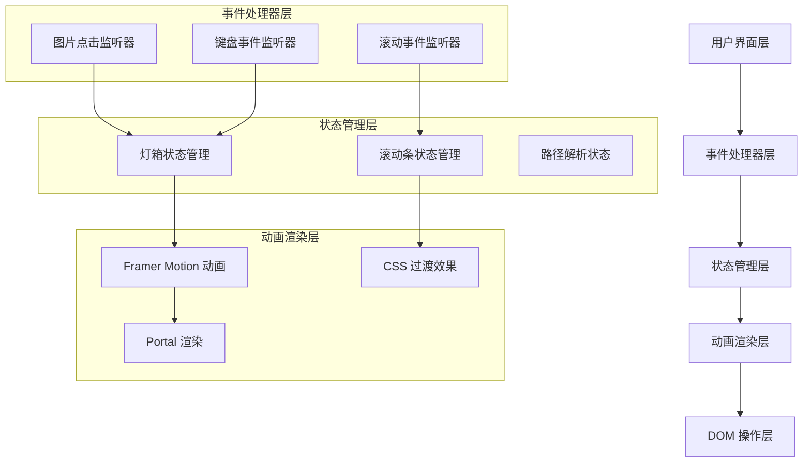
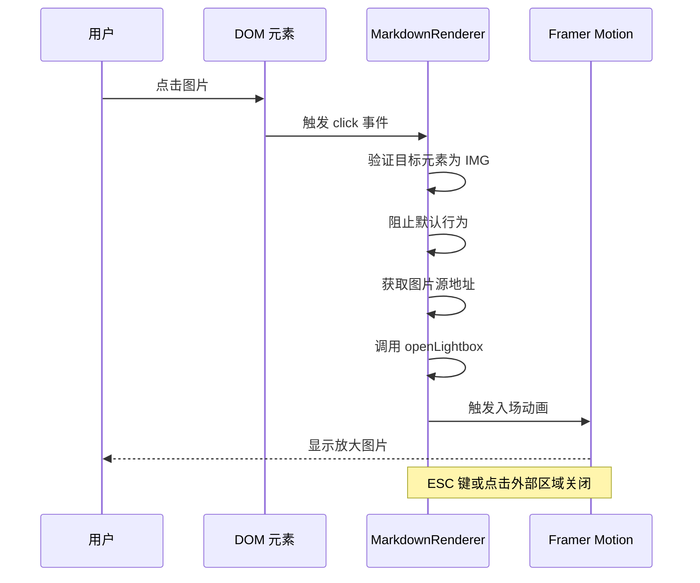
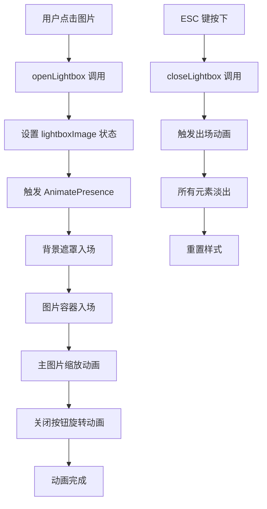
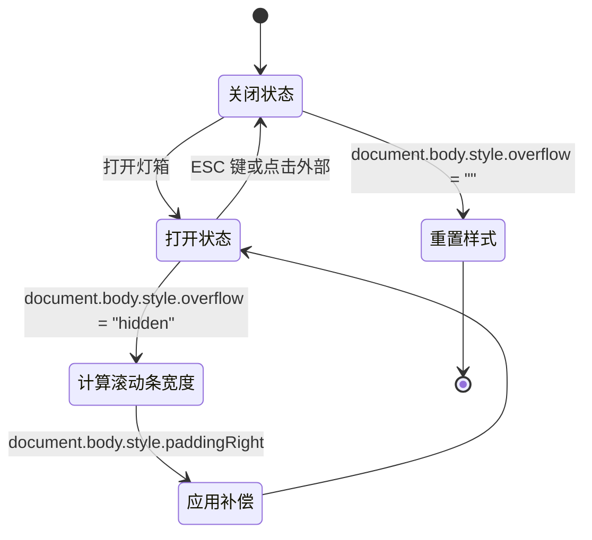
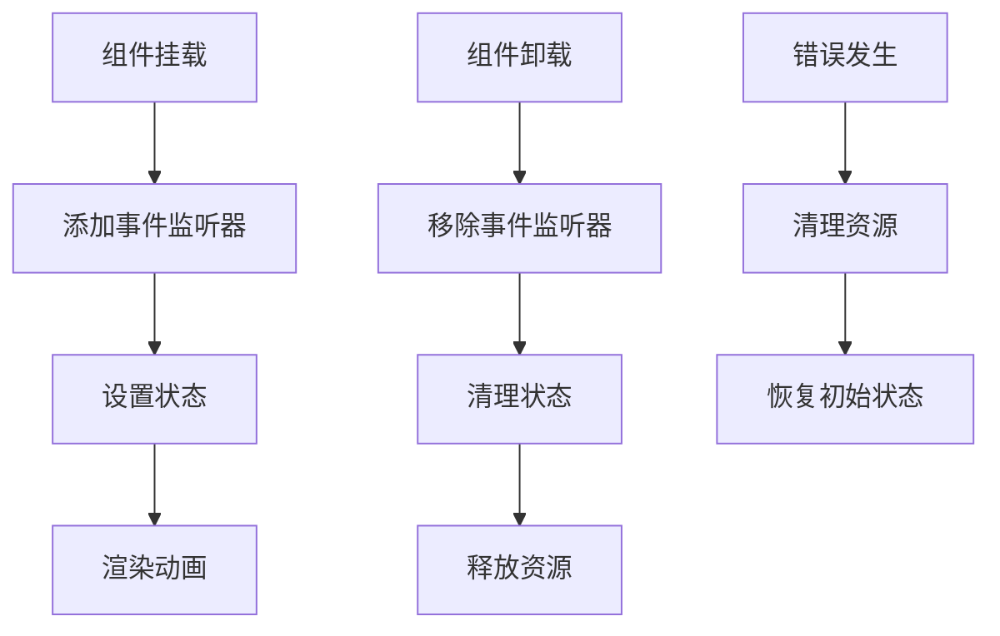

# 图片灯箱系统

<cite>
**本文档引用的文件**
- [MarkdownRenderer.tsx](file://blog-system2/frontend/src/components/MarkdownRenderer.tsx)
- [PostImage.tsx](file://blog-system2/frontend/src/components/PostImage.tsx)
- [NoticesClient.tsx](file://blog-system2/frontend/src/components/notices/NoticesClient.tsx)
- [package.json](file://blog-system2/frontend/package.json)
- [next.config.js](file://blog-system2/frontend/next.config.js)
</cite>

## 目录
1. [简介](#简介)
2. [项目结构](#项目结构)
3. [核心组件](#核心组件)
4. [架构概览](#架构概览)
5. [详细组件分析](#详细组件分析)
6. [依赖关系分析](#依赖关系分析)
7. [性能考虑](#性能考虑)
8. [故障排除指南](#故障排除指南)
9. [结论](#结论)

## 简介

本项目是一个基于 Next.js 和 Framer Motion 的图片灯箱系统，提供了完整的图片预览功能。该系统实现了现代化的动画效果、响应式设计和无障碍访问支持。

主要特性包括：
- 使用 Framer Motion 实现流畅的入场、出场和过渡动画
- 支持 ESC 键关闭和点击外部区域关闭
- 防止背景滚动的样式锁定机制
- 图片路径解析和本地化处理
- 移动端适配和触摸手势支持
- 错误处理和加载状态管理

## 项目结构

项目采用模块化的组件架构，核心功能集中在 Markdown 渲染器中：

```mermaid
graph TB
subgraph "前端应用"
A[Next.js 应用] --> B[Markdown 渲染器]
A --> C[PostImage 组件]
A --> D[通知系统]
end
subgraph "核心功能模块"
B --> E[Framer Motion 动画]
B --> F[事件监听器]
B --> G[路径解析器]
B --> H[滚动条处理]
end
subgraph "外部依赖"
E --> I[framer-motion@12.23.9]
F --> J[marked@17.0.4]
G --> K[katex@0.16.38]
H --> L[react-syntax-highlighter]
end
```

**图表来源**
- [MarkdownRenderer.tsx:1-15](file://blog-system2/frontend/src/components/MarkdownRenderer.tsx#L1-L15)
- [PostImage.tsx:1-15](file://blog-system2/frontend/src/components/PostImage.tsx#L1-L15)
- [package.json:30-63](file://blog-system2/frontend/package.json#L30-L63)

**章节来源**
- [MarkdownRenderer.tsx:1-718](file://blog-system2/frontend/src/components/MarkdownRenderer.tsx#L1-L718)
- [PostImage.tsx:1-15](file://blog-system2/frontend/src/components/PostImage.tsx#L1-L15)
- [package.json:1-72](file://blog-system2/frontend/package.json#L1-L72)

## 核心组件

### MarkdownRenderer 组件

MarkdownRenderer 是整个图片灯箱系统的核心组件，负责：
- 解析 Markdown 内容并渲染 HTML
- 监听图片点击事件
- 管理灯箱状态和动画
- 处理键盘事件和滚动条锁定

### PostImage 组件

PostImage 提供了标准化的图片展示组件，具有：
- 固定的宽高比（900x500）
- 响应式图片显示
- 对象填充模式优化

### NoticesClient 组件

NoticesClient 展示了类似的动画模式，证明了系统的可复用性。

**章节来源**
- [MarkdownRenderer.tsx:422-433](file://blog-system2/frontend/src/components/MarkdownRenderer.tsx#L422-L433)
- [PostImage.tsx:4-14](file://blog-system2/frontend/src/components/PostImage.tsx#L4-L14)

## 架构概览

系统采用分层架构设计，确保功能模块的清晰分离：



**图表来源**
- [MarkdownRenderer.tsx:445-463](file://blog-system2/frontend/src/components/MarkdownRenderer.tsx#L445-L463)
- [MarkdownRenderer.tsx:644-714](file://blog-system2/frontend/src/components/MarkdownRenderer.tsx#L644-L714)

## 详细组件分析

### 图片点击事件监听机制

系统通过事件委托的方式监听图片点击事件：



**图表来源**
- [MarkdownRenderer.tsx:553-561](file://blog-system2/frontend/src/components/MarkdownRenderer.tsx#L553-L561)
- [MarkdownRenderer.tsx:435-438](file://blog-system2/frontend/src/components/MarkdownRenderer.tsx#L435-L438)

### Framer Motion 动画实现

系统使用 Framer Motion 实现多层次的动画效果：

#### 入场动画流程



**图表来源**
- [MarkdownRenderer.tsx:646-658](file://blog-system2/frontend/src/components/MarkdownRenderer.tsx#L646-L658)
- [MarkdownRenderer.tsx:661-677](file://blog-system2/frontend/src/components/MarkdownRenderer.tsx#L661-L677)
- [MarkdownRenderer.tsx:679-695](file://blog-system2/frontend/src/components/MarkdownRenderer.tsx#L679-L695)

#### 出场动画配置

出场动画使用弹簧物理引擎，提供自然的视觉反馈：

| 动画属性 | 值 | 说明 |
|---------|-----|------|
| 类型 | spring | 提供弹性效果 |
| 刚度 | 350 | 控制动画速度 |
| 阻尼 | 30 | 控制回弹幅度 |
| 持续时间 | 自适应 | 基于物理计算 |

### 滚动条处理和样式锁定

系统实现了智能的滚动条补偿机制：



**图表来源**
- [MarkdownRenderer.tsx:453-463](file://blog-system2/frontend/src/components/MarkdownRenderer.tsx#L453-L463)
- [NoticesClient.tsx:30-51](file://blog-system2/frontend/src/components/notices/NoticesClient.tsx#L30-L51)

### 图片路径解析和本地化处理

系统支持相对路径到绝对路径的自动转换：

```mermaid
flowchart LR
A[Markdown 内容] --> B[正则表达式匹配]
B --> C{检查是否为相对路径}
C --> |是| D[替换为绝对路径]
C --> |否| E[保持原路径]
D --> F[/data/posts/{路径}]
E --> F[原路径]
F --> G[最终渲染]
H[示例: ./images/photo.jpg] --> I[转换为 /data/posts/images/photo.jpg]
```

**图表来源**
- [MarkdownRenderer.tsx:516-523](file://blog-system2/frontend/src/components/MarkdownRenderer.tsx#L516-L523)

### 移动端适配和触摸手势支持

系统针对移动端进行了专门优化：

#### 触摸事件处理

| 事件类型 | 处理方式 | 用途 |
|---------|---------|------|
| touchstart | 检测触摸开始 | 防止意外点击 |
| touchmove | 监控移动距离 | 区分点击和滑动 |
| touchend | 处理触摸结束 | 触发相应操作 |

#### 移动端特殊处理

- **滚动条补偿**: 在移动端同样应用滚动条宽度补偿
- **点击区域**: 使用 `cursor-target` 类确保正确的点击检测
- **动画性能**: 在移动设备上优化动画参数

**章节来源**
- [MarkdownRenderer.tsx:548-594](file://blog-system2/frontend/src/components/MarkdownRenderer.tsx#L548-L594)
- [MarkdownRenderer.tsx:516-523](file://blog-system2/frontend/src/components/MarkdownRenderer.tsx#L516-L523)

## 依赖关系分析

### 核心依赖

```mermaid
graph TB
subgraph "运行时依赖"
A[react@19.1.0]
B[react-dom@19.0.0]
C[next@15.2.4]
D[framer-motion@12.23.9]
E[marked@17.0.4]
F[katex@0.16.38]
end
subgraph "开发依赖"
G[@types/react@19.1.8]
H[@types/node@20]
I[tailwindcss@4.1.2]
J[typescript@5]
end
A --> D
C --> D
E --> F
```

**图表来源**
- [package.json:13-43](file://blog-system2/frontend/package.json#L13-L43)
- [package.json:50-70](file://blog-system2/frontend/package.json#L50-L70)

### 版本兼容性

系统依赖的版本具有良好的向后兼容性：
- **Framer Motion**: v12.x 系列提供稳定的功能集
- **Next.js**: v15.x 支持最新的 React 特性
- **React**: v19.x 提供改进的并发特性

**章节来源**
- [package.json:30-63](file://blog-system2/frontend/package.json#L30-L63)

## 性能考虑

### 动画性能优化

系统采用了多项性能优化策略：

1. **硬件加速**: 使用 transform 和 opacity 属性
2. **批量更新**: 合并状态更新以减少重绘
3. **内存管理**: 正确清理事件监听器和定时器
4. **懒加载**: 图片内容按需加载

### 内存泄漏防护



**图表来源**
- [MarkdownRenderer.tsx:591-593](file://blog-system2/frontend/src/components/MarkdownRenderer.tsx#L591-L593)

### 加载状态管理

系统提供了完善的加载状态管理：
- **空状态**: 内容为空时的占位符
- **加载指示器**: 复杂内容的进度提示
- **错误状态**: 加载失败时的友好提示

## 故障排除指南

### 常见问题及解决方案

#### 问题1: 灯箱无法关闭
**症状**: ESC 键无效，点击外部区域不响应
**解决方案**:
1. 检查事件监听器是否正确绑定
2. 验证状态管理逻辑
3. 确认样式锁定机制正常工作

#### 问题2: 滚动条补偿异常
**症状**: 页面出现左右跳动
**解决方案**:
1. 检查滚动条宽度计算
2. 验证 CSS 样式应用
3. 确认清理函数执行

#### 问题3: 图片路径解析失败
**症状**: 相对路径无法正确转换
**解决方案**:
1. 验证正则表达式匹配
2. 检查路径拼接逻辑
3. 确认 slug 参数传递

**章节来源**
- [MarkdownRenderer.tsx:445-463](file://blog-system2/frontend/src/components/MarkdownRenderer.tsx#L445-L463)
- [MarkdownRenderer.tsx:516-523](file://blog-system2/frontend/src/components/MarkdownRenderer.tsx#L516-L523)

## 结论

本图片灯箱系统展现了现代前端开发的最佳实践，通过精心设计的架构和实现细节，提供了优秀的用户体验。系统的主要优势包括：

1. **动画流畅性**: 基于 Framer Motion 的物理动画提供了自然的视觉反馈
2. **响应式设计**: 完整的移动端适配确保跨设备一致性
3. **性能优化**: 智能的资源管理和内存防护机制
4. **可维护性**: 清晰的代码结构和完善的错误处理

该系统为类似的应用场景提供了可靠的参考实现，其设计理念和最佳实践可以应用于其他需要复杂动画效果的前端项目中。