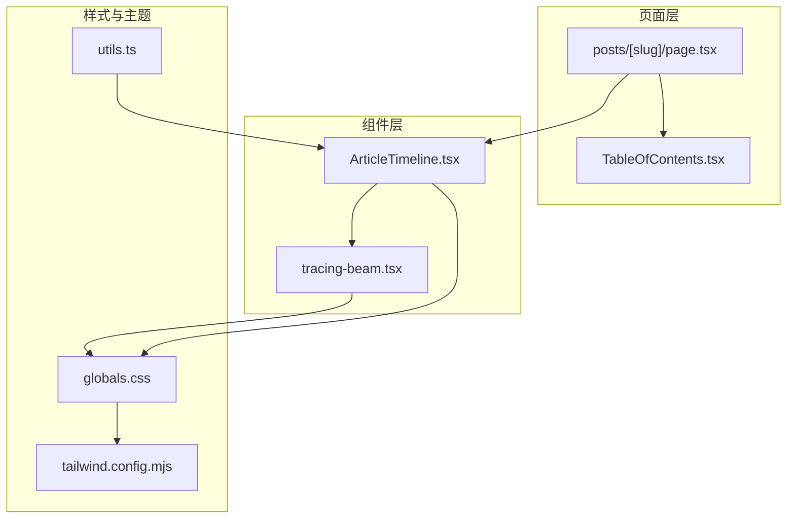
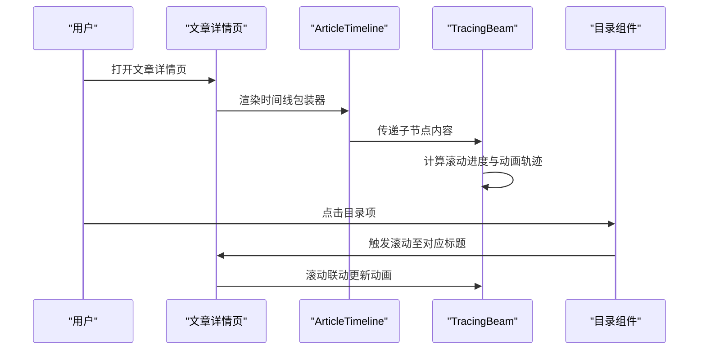
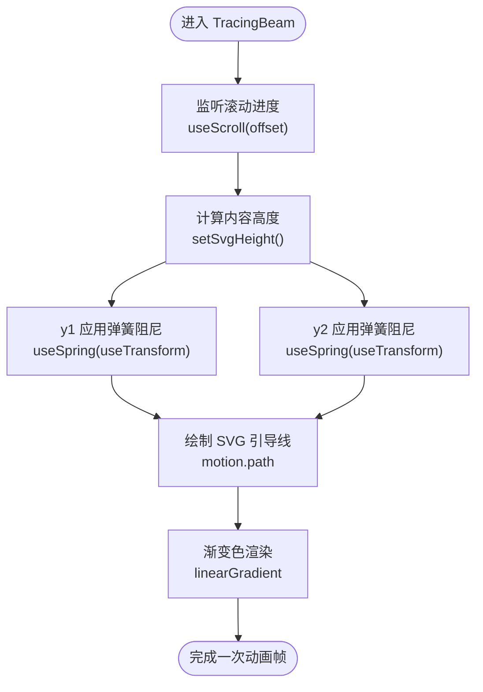
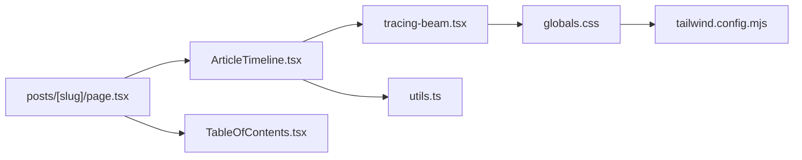

# 文章时间线组件

<cite>
**本文档引用的文件**
- [ArticleTimeline.tsx](file://blog-system2/frontend/src/components/post/ArticleTimeline.tsx)
- [tracing-beam.tsx](file://blog-system2/frontend/src/components/AceternityUI/tracing-beam.tsx)
- [globals.css](file://blog-system2/frontend/src/app/globals.css)
- [tailwind.config.mjs](file://blog-system2/frontend/tailwind.config.mjs)
- [utils.ts](file://blog-system2/frontend/src/lib/utils.ts)
- [page.tsx](file://blog-system2/frontend/src/app/posts/[slug]/page.tsx)
- [TableOfContents.tsx](file://blog-system2/frontend/src/components/post/TableOfContents.tsx)
- [NavigationProgress.tsx](file://blog-system2/frontend/src/components/NavigationProgress.tsx)
- [Footer.tsx](file://blog-system2/frontend/src/components/Footer/Footer.tsx)
- [data.d.ts](file://blog-system2/frontend/src/types/data.d.ts)
</cite>

## 目录
1. [简介](#简介)
2. [项目结构](#项目结构)
3. [核心组件](#核心组件)
4. [架构总览](#架构总览)
5. [详细组件分析](#详细组件分析)
6. [依赖关系分析](#依赖关系分析)
7. [性能考量](#性能考量)
8. [故障排查指南](#故障排查指南)
9. [结论](#结论)
10. [附录](#附录)

## 简介
本文档围绕“文章时间线组件”进行技术实现说明，重点涵盖：
- 时间轴布局算法与节点排列逻辑（时间顺序处理与重叠检测思路）
- 组件状态管理（当前选中项、悬停状态、动画状态）
- 响应式设计（不同屏幕尺寸下的布局调整与交互适配）
- 时间戳格式化与本地化支持（多语言日期显示）
- 与主页面的交互机制（滚动同步与锚点跳转）
- 自定义样式与主题适配方法
- 性能优化策略与大数据量处理方案

## 项目结构
文章时间线组件位于前端组件目录中，采用“包装器 + 可复用动画管线”的结构：
- ArticleTimeline.tsx：对外暴露的组件包装器，负责将内容包裹在追踪动画管线中
- tracing-beam.tsx：核心动画与滚动联动逻辑，提供时间轴引导线与进度动画
- 页面集成：在文章详情页中通过 ArticleTimeline 包裹正文内容，配合目录组件实现滚动同步

**图表来源**
- [ArticleTimeline.tsx:1-17](file://blog-system2/frontend/src/components/post/ArticleTimeline.tsx#L1-L17)
- [tracing-beam.tsx:1-121](file://blog-system2/frontend/src/components/AceternityUI/tracing-beam.tsx#L1-L121)
- [page.tsx:295-295](file://blog-system2/frontend/src/app/posts/[slug]/page.tsx#L295-L295)
- [TableOfContents.tsx:173-207](file://blog-system2/frontend/src/components/post/TableOfContents.tsx#L173-L207)
- [globals.css:1-681](file://blog-system2/frontend/src/app/globals.css#L1-L681)
- [tailwind.config.mjs:1-18](file://blog-system2/frontend/tailwind.config.mjs#L1-L18)
- [utils.ts:1-7](file://blog-system2/frontend/src/lib/utils.ts#L1-L7)

**章节来源**
- [ArticleTimeline.tsx:1-17](file://blog-system2/frontend/src/components/post/ArticleTimeline.tsx#L1-L17)
- [tracing-beam.tsx:1-121](file://blog-system2/frontend/src/components/AceternityUI/tracing-beam.tsx#L1-L121)
- [page.tsx:295-295](file://blog-system2/frontend/src/app/posts/[slug]/page.tsx#L295-L295)

## 核心组件
- ArticleTimeline.tsx：轻量包装器，将子节点内容置于追踪动画管线中，提供统一的布局容器与样式基底
- TracingBeam.tsx：核心动画组件，基于滚动进度驱动时间轴引导线与光点动画，支持弹簧阻尼与渐变色过渡

关键特性：
- 使用滚动进度映射生成动画轨迹，确保内容与引导线同步
- 内置弹簧阻尼参数，提升动画顺滑度与可预测性
- 支持深浅色主题下的视觉一致性

**章节来源**
- [ArticleTimeline.tsx:1-17](file://blog-system2/frontend/src/components/post/ArticleTimeline.tsx#L1-L17)
- [tracing-beam.tsx:1-121](file://blog-system2/frontend/src/components/AceternityUI/tracing-beam.tsx#L1-L121)

## 架构总览
文章时间线组件与页面导航、目录组件形成协同关系：
- 文章详情页通过 ArticleTimeline 包裹正文
- TableOfContents 负责标题识别与滚动同步
- NavigationProgress 提供导航过程中的即时反馈
- Footer 提供页面级滚动控制能力

**图表来源**
- [page.tsx:295-295](file://blog-system2/frontend/src/app/posts/[slug]/page.tsx#L295-L295)
- [ArticleTimeline.tsx:1-17](file://blog-system2/frontend/src/components/post/ArticleTimeline.tsx#L1-L17)
- [tracing-beam.tsx:1-121](file://blog-system2/frontend/src/components/AceternityUI/tracing-beam.tsx#L1-L121)
- [TableOfContents.tsx:173-207](file://blog-system2/frontend/src/components/post/TableOfContents.tsx#L173-L207)

## 详细组件分析

### ArticleTimeline 组件
职责与行为：
- 作为时间线的容器，将子节点内容包裹在追踪动画管线中
- 提供相对定位与抗锯齿基础样式，保证内容清晰度
- 通过 className 透传给 TracingBeam，便于主题与布局定制

实现要点：
- 使用客户端渲染标记，确保滚动与动画在浏览器端生效
- 将子节点直接传递给 TracingBeam，保持内容结构的完整性

**章节来源**
- [ArticleTimeline.tsx:1-17](file://blog-system2/frontend/src/components/post/ArticleTimeline.tsx#L1-L17)

### TracingBeam 动画管线
核心算法与逻辑：
- 滚动进度监听：基于 useScroll 监听目标区域滚动进度，offset 参数定义起止偏移
- 动态高度计算：根据内容区高度动态设置 SVG 高度，确保引导线贯穿全文
- 弹簧阻尼动画：对 y1/y2 进行 spring 变换，使引导线末端随滚动平滑移动
- 渐变色过渡：通过 motion-linearGradient 实现引导线颜色渐变，增强视觉层次

**图表来源**
- [tracing-beam.tsx:14-41](file://blog-system2/frontend/src/components/AceternityUI/tracing-beam.tsx#L14-L41)
- [tracing-beam.tsx:74-114](file://blog-system2/frontend/src/components/AceternityUI/tracing-beam.tsx#L74-L114)

**章节来源**
- [tracing-beam.tsx:1-121](file://blog-system2/frontend/src/components/AceternityUI/tracing-beam.tsx#L1-L121)

### 目录与滚动同步
- 目录组件通过滚动监听与标题锚点建立联动，使用 requestAnimationFrame 控制节流
- 当活动标题变化时，自动展开/收起父级目录项，提升可读性
- 与文章时间线的滚动进度相辅相成，共同提供流畅的阅读体验

**章节来源**
- [TableOfContents.tsx:173-207](file://blog-system2/frontend/src/components/post/TableOfContents.tsx#L173-L207)

### 主页面交互机制
- 导航进度条：在用户点击内部链接时立即显示进度条，避免页面“卡住”的感知
- 顶部回弹：通过 scrollTo 结合延迟与行为参数，确保回到顶部并带有弹性效果
- 与时间线联动：滚动同步与动画进度共同作用，提升整体交互一致性

**章节来源**
- [NavigationProgress.tsx:1-80](file://blog-system2/frontend/src/components/NavigationProgress.tsx#L1-L80)
- [Footer.tsx:144-169](file://blog-system2/frontend/src/components/Footer/Footer.tsx#L144-L169)

## 依赖关系分析
- 组件耦合
  - ArticleTimeline 仅依赖 TracingBeam，耦合度低，职责单一
  - TracingBeam 依赖 motion/react 的 useScroll/useSpring/useTransform，形成强绑定
- 外部依赖
  - Tailwind CSS 与自定义动画变量提供样式与主题支持
  - utils.ts 的 cn 工具函数用于类名合并与冲突修复
- 类型与资源
  - data.d.ts 提供 JSON/MD 文件模块声明，便于静态数据导入

**图表来源**
- [ArticleTimeline.tsx:1-17](file://blog-system2/frontend/src/components/post/ArticleTimeline.tsx#L1-L17)
- [tracing-beam.tsx:1-121](file://blog-system2/frontend/src/components/AceternityUI/tracing-beam.tsx#L1-L121)
- [utils.ts:1-7](file://blog-system2/frontend/src/lib/utils.ts#L1-L7)
- [globals.css:1-681](file://blog-system2/frontend/src/app/globals.css#L1-L681)
- [tailwind.config.mjs:1-18](file://blog-system2/frontend/tailwind.config.mjs#L1-L18)
- [page.tsx:295-295](file://blog-system2/frontend/src/app/posts/[slug]/page.tsx#L295-L295)
- [TableOfContents.tsx:173-207](file://blog-system2/frontend/src/components/post/TableOfContents.tsx#L173-L207)

**章节来源**
- [ArticleTimeline.tsx:1-17](file://blog-system2/frontend/src/components/post/ArticleTimeline.tsx#L1-L17)
- [tracing-beam.tsx:1-121](file://blog-system2/frontend/src/components/AceternityUI/tracing-beam.tsx#L1-L121)
- [utils.ts:1-7](file://blog-system2/frontend/src/lib/utils.ts#L1-L7)
- [globals.css:1-681](file://blog-system2/frontend/src/app/globals.css#L1-L681)
- [tailwind.config.mjs:1-18](file://blog-system2/frontend/tailwind.config.mjs#L1-L18)
- [page.tsx:295-295](file://blog-system2/frontend/src/app/posts/[slug]/page.tsx#L295-L295)
- [TableOfContents.tsx:173-207](file://blog-system2/frontend/src/components/post/TableOfContents.tsx#L173-L207)

## 性能考量
- 动画性能
  - 使用 useSpring 与 useTransform 降低主线程压力，提高滚动流畅度
  - 通过 requestAnimationFrame 控制目录滚动同步，避免频繁重排
- 样式与主题
  - Tailwind 变体与 CSS 变量减少重复样式定义，提升构建与运行效率
  - 深色/浅色主题切换采用 CSS 变量与过渡动画，避免强制布局
- 大数据量处理
  - 目录组件使用节流与缓存活动标题，减少高频滚动带来的计算开销
  - TracingBeam 动画高度动态计算，避免固定高度导致的多余绘制

**章节来源**
- [tracing-beam.tsx:28-41](file://blog-system2/frontend/src/components/AceternityUI/tracing-beam.tsx#L28-L41)
- [TableOfContents.tsx:173-207](file://blog-system2/frontend/src/components/post/TableOfContents.tsx#L173-L207)
- [globals.css:380-387](file://blog-system2/frontend/src/app/globals.css#L380-L387)

## 故障排查指南
- 动画不生效
  - 确认组件为客户端渲染（use client），且滚动容器存在
  - 检查 useScroll 的 target 是否正确指向内容容器
- 引导线高度异常
  - 确保内容区高度在挂载后正确计算，避免初始高度为 0
  - 检查 CSS 中的 max-w-none 与 antialiased 是否影响测量
- 目录跳转不准确
  - 核对标题锚点与目录项的 id 对应关系
  - 检查滚动监听是否被其他滚动容器覆盖
- 主题切换闪烁
  - 确认 CSS 变量与过渡动画未被禁用（prefers-reduced-motion）

**章节来源**
- [tracing-beam.tsx:14-26](file://blog-system2/frontend/src/components/AceternityUI/tracing-beam.tsx#L14-L26)
- [TableOfContents.tsx:173-207](file://blog-system2/frontend/src/components/post/TableOfContents.tsx#L173-L207)
- [globals.css:380-387](file://blog-system2/frontend/src/app/globals.css#L380-L387)

## 结论
文章时间线组件通过“包装器 + 动画管线”的方式，实现了与内容紧密耦合的滚动联动效果。其核心在于：
- 基于滚动进度的动态动画轨迹
- 低耦合的组件结构与可扩展的样式体系
- 与目录组件的协同，提供良好的阅读与导航体验

在实际工程中，建议结合主题系统与响应式设计，进一步完善时间戳格式化与本地化支持，以满足国际化需求。

## 附录

### 时间戳格式化与本地化支持
- 建议在数据层或组件内使用 Intl.DateTimeFormat 进行本地化日期展示
- 可通过 props 接收 locale 与 timeZone，动态生成符合用户偏好的日期字符串
- 对于历史节点较多的场景，可采用分组显示（如“今年/去年/更早”）减少信息密度

[本节为通用实践建议，不直接分析具体源码文件]

### 响应式设计与交互适配
- 移动端优化：利用 prefers-reduced-motion 与媒体查询，减少装饰性动画
- 触摸设备：禁用 hover 触发的交互，避免误触与 stuck 状态
- 布局适配：在小屏下适当缩小引导线与间距，保证内容可读性

**章节来源**
- [globals.css:609-681](file://blog-system2/frontend/src/app/globals.css#L609-L681)

### 自定义样式与主题适配
- 使用 Tailwind 变量与 CSS 自定义属性，集中管理主题色彩与动画参数
- 通过 cn 工具函数合并类名，避免样式冲突
- 在组件层面提供 className 透传，便于上层定制

**章节来源**
- [globals.css:1-184](file://blog-system2/frontend/src/app/globals.css#L1-L184)
- [utils.ts:1-7](file://blog-system2/frontend/src/lib/utils.ts#L1-L7)

### 与主页面的交互机制
- 锚点跳转：目录组件与标题 id 对齐，结合滚动监听实现精准定位
- 滚动同步：文章时间线与目录联动，提供一致的滚动体验
- 导航反馈：在内部导航时显示进度条，减少感知延迟

**章节来源**
- [page.tsx:295-295](file://blog-system2/frontend/src/app/posts/[slug]/page.tsx#L295-L295)
- [TableOfContents.tsx:173-207](file://blog-system2/frontend/src/components/post/TableOfContents.tsx#L173-L207)
- [NavigationProgress.tsx:1-80](file://blog-system2/frontend/src/components/NavigationProgress.tsx#L1-L80)