# 文章渲染系统

<cite>
**本文档引用的文件**
- [MarkdownRenderer.tsx](file://blog-system2/frontend/src/components/MarkdownRenderer.tsx)
- [ArticleTimeline.tsx](file://blog-system2/frontend/src/components/post/ArticleTimeline.tsx)
- [AuthorBlock.tsx](file://blog-system2/frontend/src/components/post/AuthorBlock.tsx)
- [TableOfContents.tsx](file://blog-system2/frontend/src/components/post/TableOfContents.tsx)
- [page.tsx](file://blog-system2/frontend/src/app/posts/[slug]/page.tsx)
- [reading-time.ts](file://blog-system2/frontend/src/lib/reading-time.ts)
- [PostImage.tsx](file://blog-system2/frontend/src/components/PostImage.tsx)
- [static-data.ts](file://blog-system2/frontend/src/lib/static-data.ts)
- [package.json](file://blog-system2/frontend/package.json)
- [next.config.js](file://blog-system2/frontend/next.config.js)
- [README.md](file://blog-system2/frontend/public/data/posts/README.md)
- [index.json](file://blog-system2/frontend/public/data/posts/index.json)
- [12th_meeting_NLP.md](file://blog-system2/frontend/public/data/posts/12th_meeting_NLP.md)
- [MLP_detailed_explanation.md](file://blog-system2/frontend/public/data/posts/MLP_detailed_explanation.md)
</cite>

## 目录
1. [简介](#简介)
2. [项目结构](#项目结构)
3. [核心组件](#核心组件)
4. [架构总览](#架构总览)
5. [详细组件分析](#详细组件分析)
6. [依赖关系分析](#依赖关系分析)
7. [性能考虑](#性能考虑)
8. [故障排除指南](#故障排除指南)
9. [结论](#结论)
10. [附录](#附录)

## 简介
本项目是一个基于 Next.js 的静态博客渲染系统，专注于高质量的 Markdown 文档展示。系统实现了完整的 Markdown 解析、代码高亮、数学公式渲染、图片灯箱、目录生成与锚点导航、时间线布局、作者信息展示等功能。通过静态生成与 SEO 优化，为用户提供流畅的阅读体验。

## 项目结构
前端采用 App Router 结构，核心文件分布如下：
- 组件层：Markdown 渲染器、目录组件、时间线组件、作者信息块等
- 页面层：文章详情页、动态路由配置
- 工具层：阅读统计、静态数据管理
- 配置层：Next.js 配置、依赖管理

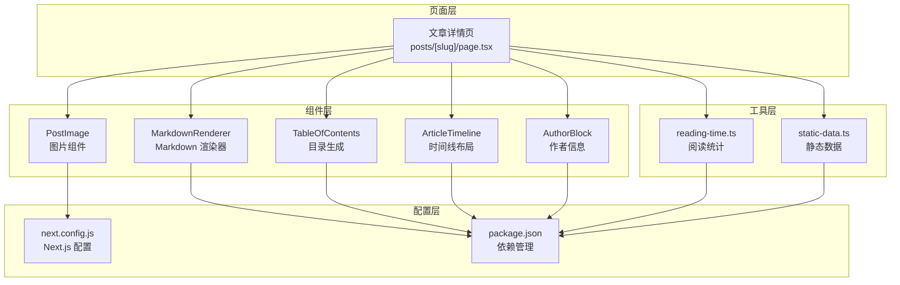

**图表来源**
- [page.tsx:66-303](file://blog-system2/frontend/src/app/posts/[slug]/page.tsx#L66-L303)
- [MarkdownRenderer.tsx:1-718](file://blog-system2/frontend/src/components/MarkdownRenderer.tsx#L1-L718)
- [TableOfContents.tsx:1-672](file://blog-system2/frontend/src/components/post/TableOfContents.tsx#L1-L672)
- [ArticleTimeline.tsx:1-18](file://blog-system2/frontend/src/components/post/ArticleTimeline.tsx#L1-L18)
- [AuthorBlock.tsx:1-128](file://blog-system2/frontend/src/components/post/AuthorBlock.tsx#L1-L128)
- [PostImage.tsx:1-15](file://blog-system2/frontend/src/components/PostImage.tsx#L1-L15)
- [reading-time.ts:1-84](file://blog-system2/frontend/src/lib/reading-time.ts#L1-L84)
- [static-data.ts:1-214](file://blog-system2/frontend/src/lib/static-data.ts#L1-L214)
- [next.config.js:1-48](file://blog-system2/frontend/next.config.js#L1-L48)
- [package.json:1-72](file://blog-system2/frontend/package.json#L1-L72)

**章节来源**
- [page.tsx:1-304](file://blog-system2/frontend/src/app/posts/[slug]/page.tsx#L1-L304)
- [package.json:1-72](file://blog-system2/frontend/package.json#L1-L72)
- [next.config.js:1-48](file://blog-system2/frontend/next.config.js#L1-L48)

## 核心组件
系统的核心组件包括：
- MarkdownRenderer：负责 Markdown 解析、代码高亮、数学公式渲染、图片灯箱
- TableOfContents：生成目录树、滚动联动、展开折叠控制
- ArticleTimeline：文章时间线布局组件
- AuthorBlock：作者信息展示组件
- PostImage：图片渲染组件

**章节来源**
- [MarkdownRenderer.tsx:1-718](file://blog-system2/frontend/src/components/MarkdownRenderer.tsx#L1-L718)
- [TableOfContents.tsx:1-672](file://blog-system2/frontend/src/components/post/TableOfContents.tsx#L1-L672)
- [ArticleTimeline.tsx:1-18](file://blog-system2/frontend/src/components/post/ArticleTimeline.tsx#L1-L18)
- [AuthorBlock.tsx:1-128](file://blog-system2/frontend/src/components/post/AuthorBlock.tsx#L1-L128)
- [PostImage.tsx:1-15](file://blog-system2/frontend/src/components/PostImage.tsx#L1-L15)

## 架构总览
系统采用静态生成 + 客户端增强的架构模式：

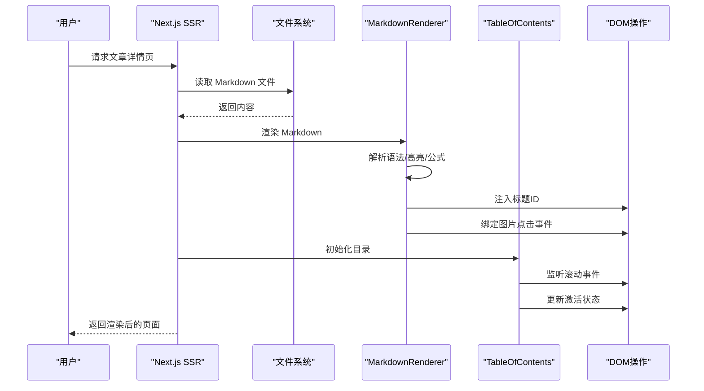

**图表来源**
- [page.tsx:18-30](file://blog-system2/frontend/src/app/posts/[slug]/page.tsx#L18-L30)
- [MarkdownRenderer.tsx:465-594](file://blog-system2/frontend/src/components/MarkdownRenderer.tsx#L465-L594)
- [TableOfContents.tsx:129-192](file://blog-system2/frontend/src/components/post/TableOfContents.tsx#L129-L192)

## 详细组件分析

### Markdown 渲染器实现原理
MarkdownRenderer 是系统的核心渲染组件，实现了完整的 Markdown 解析与增强功能。

#### 语法解析流程
渲染器采用 Marked.js 作为核心解析引擎，通过自定义渲染器扩展语法支持：

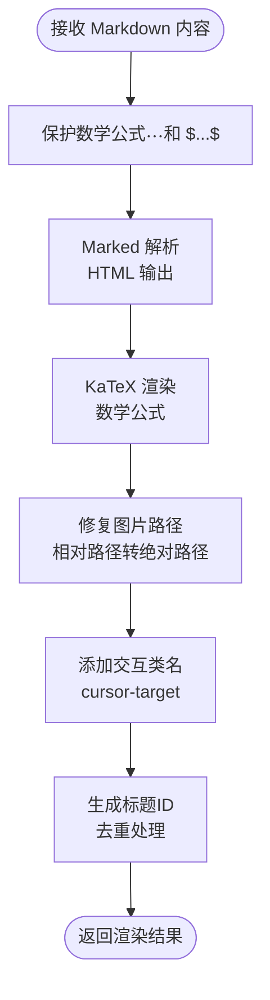

**图表来源**
- [MarkdownRenderer.tsx:465-546](file://blog-system2/frontend/src/components/MarkdownRenderer.tsx#L465-L546)

#### 代码高亮机制
系统使用 React Syntax Highlighter 实现代码块高亮，支持深浅主题切换：

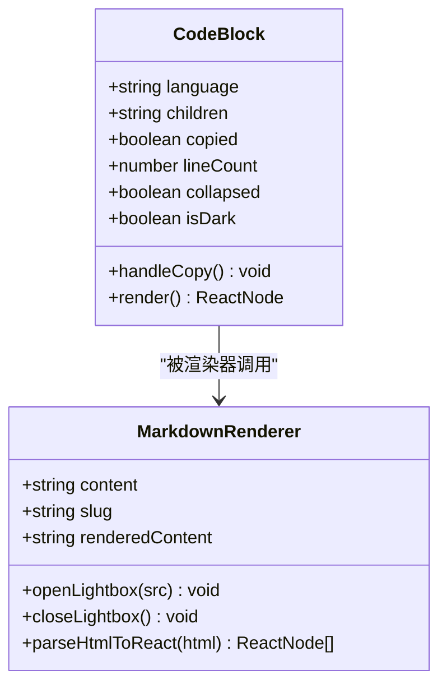

**图表来源**
- [MarkdownRenderer.tsx:337-411](file://blog-system2/frontend/src/components/MarkdownRenderer.tsx#L337-L411)
- [MarkdownRenderer.tsx:422-426](file://blog-system2/frontend/src/components/MarkdownRenderer.tsx#L422-L426)

#### 数学公式支持
系统通过 KaTeX 实现 LaTeX 数学公式的高性能渲染：

| 功能 | 实现方式 | 性能特点 |
|------|----------|----------|
| 行内公式 | `$...$` 语法 | 即时渲染，无闪烁 |
| 块级公式 | `$$...$$` 语法 | 展示模式，居中显示 |
| 错误处理 | try-catch 包装 | 优雅降级为纯文本 |
| 渲染优化 | 预保护占位符 | 避免重复解析 |

**章节来源**
- [MarkdownRenderer.tsx:465-514](file://blog-system2/frontend/src/components/MarkdownRenderer.tsx#L465-L514)

### 文章时间线组件
ArticleTimeline 提供文章内容的时间线布局效果，基于 TracingBeam 组件实现：

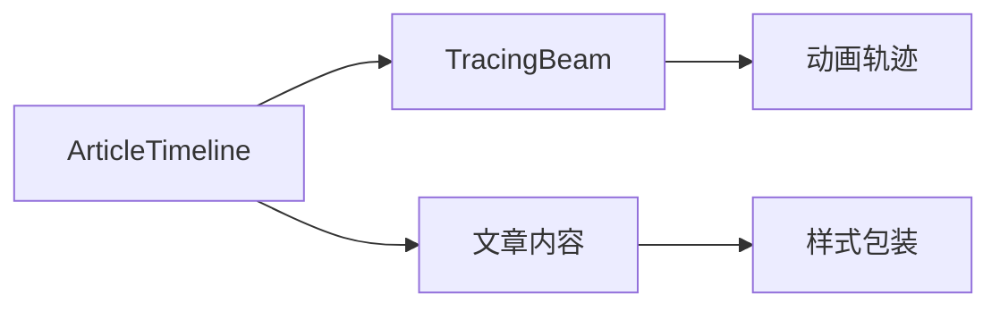

**图表来源**
- [ArticleTimeline.tsx:9-16](file://blog-system2/frontend/src/components/post/ArticleTimeline.tsx#L9-L16)

**章节来源**
- [ArticleTimeline.tsx:1-18](file://blog-system2/frontend/src/components/post/ArticleTimeline.tsx#L1-L18)

### 作者信息块
AuthorBlock 实现了精美的作者信息展示，包含头像、社交链接和装饰效果：

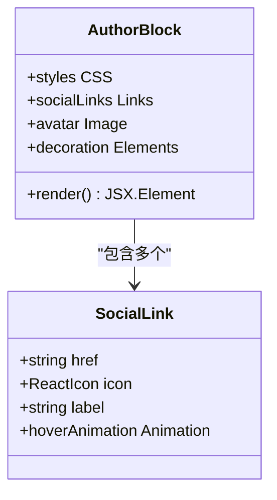

**图表来源**
- [AuthorBlock.tsx:7-127](file://blog-system2/frontend/src/components/post/AuthorBlock.tsx#L7-L127)

**章节来源**
- [AuthorBlock.tsx:1-128](file://blog-system2/frontend/src/components/post/AuthorBlock.tsx#L1-L128)

### 目录生成算法
TableOfContents 实现了完整的目录生成与交互功能：

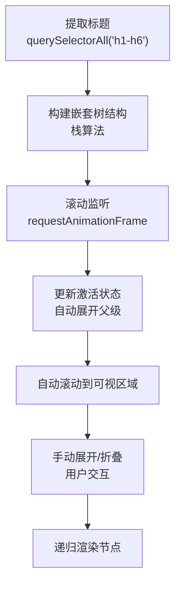

**图表来源**
- [TableOfContents.tsx:32-54](file://blog-system2/frontend/src/components/post/TableOfContents.tsx#L32-L54)
- [TableOfContents.tsx:147-192](file://blog-system2/frontend/src/components/post/TableOfContents.tsx#L147-L192)

#### 目录生成算法详解
目录组件采用栈算法构建嵌套树结构，支持多级标题的智能分组：

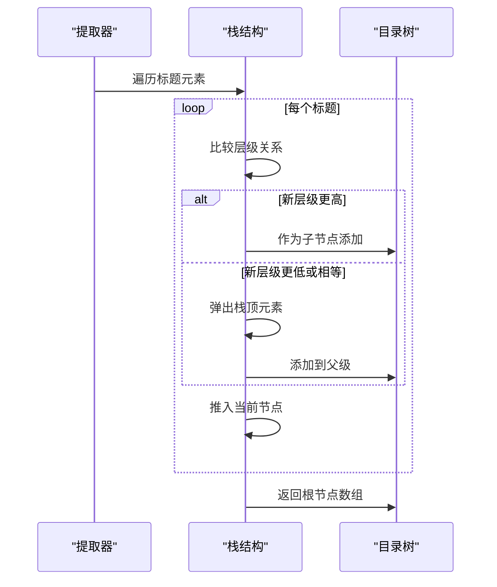

**图表来源**
- [TableOfContents.tsx:32-54](file://blog-system2/frontend/src/components/post/TableOfContents.tsx#L32-L54)

**章节来源**
- [TableOfContents.tsx:1-672](file://blog-system2/frontend/src/components/post/TableOfContents.tsx#L1-L672)

### 动态路由配置与 SEO 优化
文章详情页面采用 Next.js 的动态路由机制：

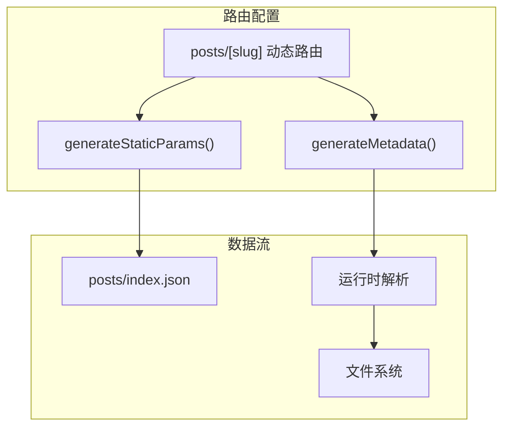

**图表来源**
- [page.tsx:32-62](file://blog-system2/frontend/src/app/posts/[slug]/page.tsx#L32-L62)

#### SEO 优化策略
系统实现了多层次的 SEO 优化：

| 优化维度 | 实现方式 | 效果 |
|----------|----------|------|
| 结构化数据 | OpenGraph 元数据 | 社交媒体友好分享 |
| 动态标题 | 动态生成页面标题 | 提升搜索引擎识别度 |
| 静态生成 | Next.js 静态导出 | 快速加载与缓存友好 |
| 图片优化 | Next/Image 组件 | 自动响应式与懒加载 |
| 性能监控 | Vercel Analytics | 用户行为追踪 |

**章节来源**
- [page.tsx:39-62](file://blog-system2/frontend/src/app/posts/[slug]/page.tsx#L39-L62)
- [next.config.js:20-33](file://blog-system2/frontend/next.config.js#L20-L33)

### 多媒体内容支持机制
系统提供了完善的多媒体内容处理方案：

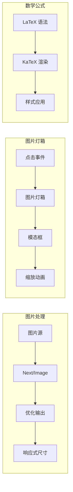

**图表来源**
- [PostImage.tsx:4-14](file://blog-system2/frontend/src/components/PostImage.tsx#L4-L14)
- [MarkdownRenderer.tsx:435-463](file://blog-system2/frontend/src/components/MarkdownRenderer.tsx#L435-L463)

**章节来源**
- [PostImage.tsx:1-15](file://blog-system2/frontend/src/components/PostImage.tsx#L1-L15)
- [MarkdownRenderer.tsx:253-267](file://blog-system2/frontend/src/components/MarkdownRenderer.tsx#L253-L267)
- [MarkdownRenderer.tsx:644-716](file://blog-system2/frontend/src/components/MarkdownRenderer.tsx#L644-L716)

## 依赖关系分析

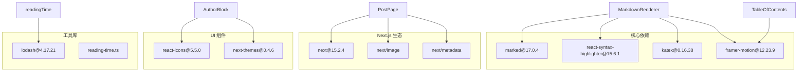

**图表来源**
- [package.json:13-42](file://blog-system2/frontend/package.json#L13-L42)
- [MarkdownRenderer.tsx:5-10](file://blog-system2/frontend/src/components/MarkdownRenderer.tsx#L5-L10)
- [TableOfContents.tsx:1-4](file://blog-system2/frontend/src/components/post/TableOfContents.tsx#L1-L4)

**章节来源**
- [package.json:1-72](file://blog-system2/frontend/package.json#L1-L72)

## 性能考虑
系统在多个层面实现了性能优化：

### 渲染性能优化
- **虚拟 DOM 优化**：使用 React.memo 化简渲染开销
- **懒加载策略**：图片组件自动懒加载
- **滚动节流**：目录组件使用 requestAnimationFrame 优化滚动性能
- **条件渲染**：仅在需要时渲染目录侧栏

### 加载性能优化
- **静态导出**：Next.js 静态生成减少服务器压力
- **图片优化**：自动响应式尺寸与 WebP 格式
- **代码分割**：按需加载组件模块
- **缓存策略**：配置合理的缓存头

### 内存管理
- **事件清理**：组件卸载时清理所有事件监听器
- **观察者断开**：MutationObserver 在卸载时断开
- **定时器清理**：确保所有定时器被正确清理

## 故障排除指南

### 常见问题诊断
1. **数学公式不显示**
   - 检查 KaTeX 库是否正确加载
   - 验证 LaTeX 语法格式
   - 查看浏览器控制台错误信息

2. **代码高亮失效**
   - 确认代码块包含语言标识
   - 检查 Prism 主题样式是否加载
   - 验证语法支持的语言列表

3. **目录不更新**
   - 确认标题元素正确生成
   - 检查滚动事件监听器
   - 验证 DOM 结构变化观察器

4. **图片显示异常**
   - 检查图片路径是否正确
   - 验证 Next/Image 配置
   - 确认域名白名单设置

### 调试工具
- **浏览器开发者工具**：检查网络请求与控制台错误
- **React DevTools**：分析组件渲染性能
- **Next.js 日志**：查看构建与运行时日志

**章节来源**
- [MarkdownRenderer.tsx:494-503](file://blog-system2/frontend/src/components/MarkdownRenderer.tsx#L494-L503)
- [TableOfContents.tsx:133-144](file://blog-system2/frontend/src/components/post/TableOfContents.tsx#L133-L144)

## 结论
本文章渲染系统通过精心设计的组件架构和优化策略，实现了高质量的 Markdown 文档展示。系统具备完整的语法解析、代码高亮、数学公式渲染、目录导航、图片处理等核心功能，同时在性能和用户体验方面进行了全面优化。通过静态生成与客户端增强相结合的方式，为用户提供了流畅、稳定的阅读体验。

## 附录

### 使用示例
系统提供了丰富的示例文档，涵盖各种 Markdown 语法的使用场景：

- **基础语法示例**：标题、列表、链接、图片等基本元素
- **代码块示例**：多语言语法高亮支持
- **数学公式示例**：LaTeX 公式渲染演示
- **表格示例**：GFM 表格语法支持

### 自定义扩展方法
1. **新增语法支持**
   - 修改 Marked 渲染器配置
   - 添加自定义 HTML 处理逻辑
   - 扩展 KaTeX 公式支持

2. **主题定制**
   - 修改 CSS 变量定义
   - 调整颜色方案与字体
   - 自定义动画效果

3. **功能扩展**
   - 添加新的目录样式
   - 扩展图片处理能力
   - 增强交互体验

**章节来源**
- [README.md:1-209](file://blog-system2/frontend/public/data/posts/README.md#L1-L209)
- [index.json:1-103](file://blog-system2/frontend/public/data/posts/index.json#L1-L103)
- [12th_meeting_NLP.md:1-200](file://blog-system2/frontend/public/data/posts/12th_meeting_NLP.md#L1-L200)
- [MLP_detailed_explanation.md:1-200](file://blog-system2/frontend/public/data/posts/MLP_detailed_explanation.md#L1-L200)