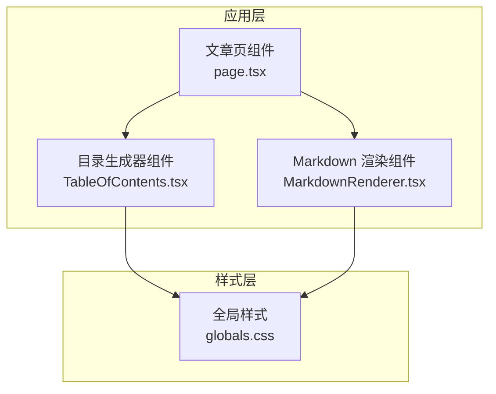
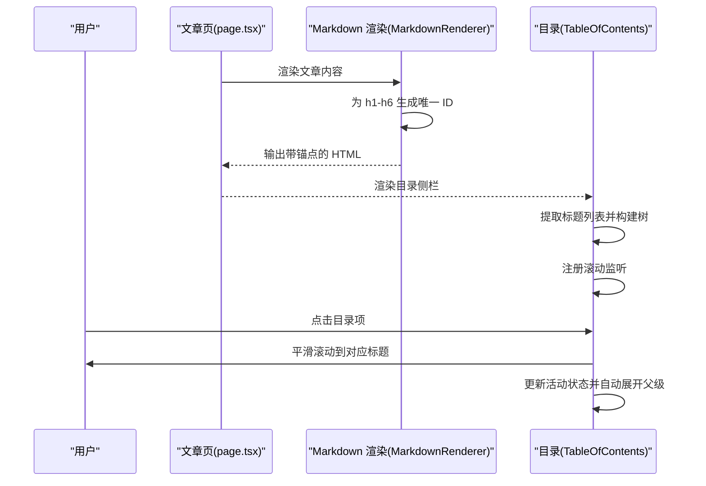
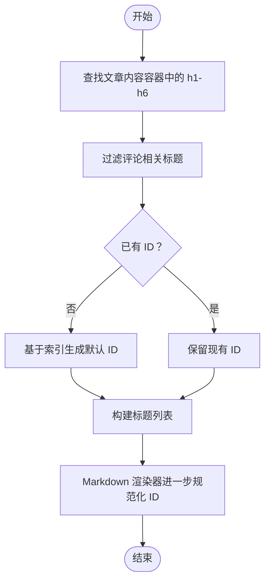
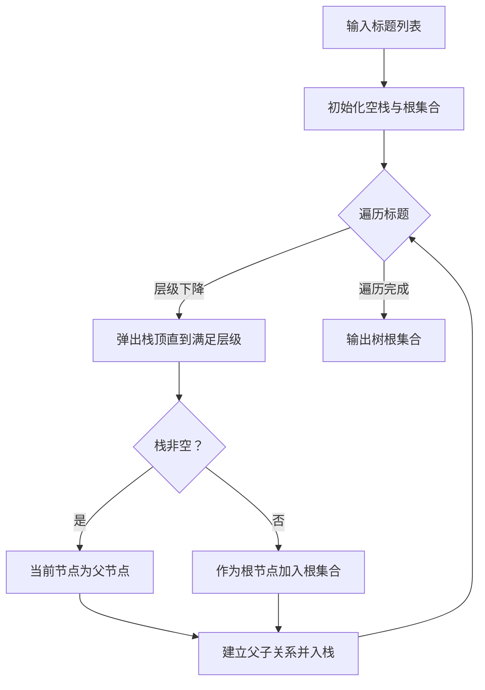
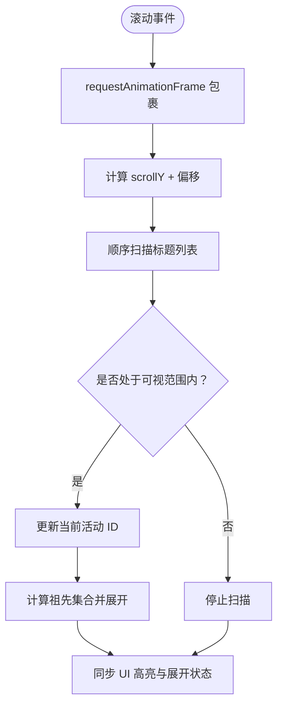
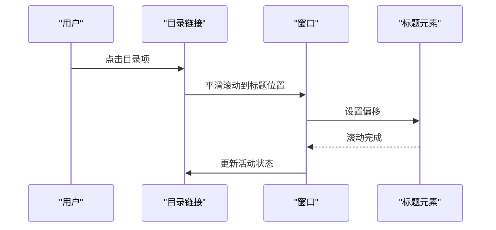
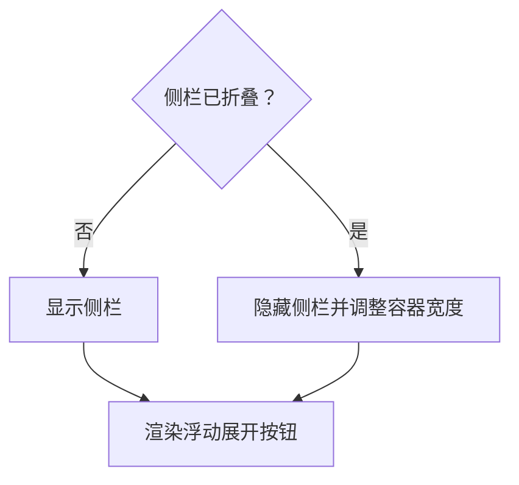
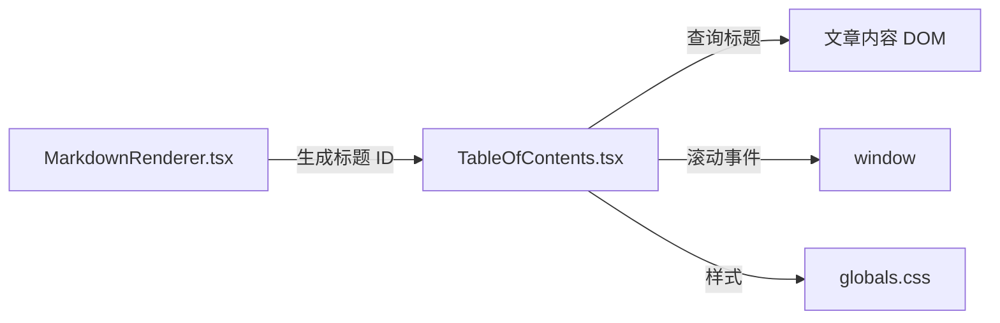

# 目录生成器

<cite>
**本文引用的文件**
- [TableOfContents.tsx](file://blog-system2/frontend/src/components/post/TableOfContents.tsx)
- [page.tsx](file://blog-system2/frontend/src/app/posts/[slug]/page.tsx)
- [MarkdownRenderer.tsx](file://blog-system2/frontend/src/components/MarkdownRenderer.tsx)
- [globals.css](file://blog-system2/frontend/src/app/globals.css)
</cite>

## 目录
1. [简介](#简介)
2. [项目结构](#项目结构)
3. [核心组件](#核心组件)
4. [架构总览](#架构总览)
5. [详细组件分析](#详细组件分析)
6. [依赖关系分析](#依赖关系分析)
7. [性能考量](#性能考量)
8. [故障排查指南](#故障排查指南)
9. [结论](#结论)
10. [附录](#附录)

## 简介
本技术文档围绕“目录生成器”的实现进行深入解析，涵盖标题层级识别与锚点生成、滚动监听与活动状态同步、目录项高亮与滚动定位、响应式布局与交互、样式定制与主题适配、与文章内容的同步与动态更新、目录树构建与渲染优化，以及性能监控与大数据量处理策略。目标是帮助开发者快速理解并扩展该目录生成器在 Next.js + React + TailwindCSS 生态中的实现方式。

## 项目结构
目录生成器位于前端组件层，与文章渲染组件协同工作：
- 文章页组件负责承载文章内容与目录侧栏，并通过容器类名与目录组件协作。
- 目录组件负责从文章内容中提取标题、构建嵌套树、维护活动状态、处理滚动与交互。
- Markdown 渲染组件负责为标题生成唯一锚点 ID，确保目录与正文锚点一致。
- 全局样式提供暗色模式与响应式断点，支撑目录侧栏的展示与隐藏。

**图表来源**
- [page.tsx:120-127](file://blog-system2/frontend/src/app/posts/[slug]/page.tsx#L120-L127)
- [MarkdownRenderer.tsx:570-589](file://blog-system2/frontend/src/components/MarkdownRenderer.tsx#L570-L589)
- [TableOfContents.tsx:56-85](file://blog-system2/frontend/src/components/post/TableOfContents.tsx#L56-L85)
- [globals.css:152-184](file://blog-system2/frontend/src/app/globals.css#L152-L184)

**章节来源**
- [page.tsx:120-127](file://blog-system2/frontend/src/app/posts/[slug]/page.tsx#L120-L127)
- [globals.css:152-184](file://blog-system2/frontend/src/app/globals.css#L152-L184)

## 核心组件
- 目录生成器（TableOfContents）：负责提取标题、构建树形结构、维护活动 ID、处理滚动监听与自动展开、提供滚动到标题与侧栏折叠/展开交互。
- Markdown 渲染器（MarkdownRenderer）：负责将 Markdown 解析为 HTML，并为 h1-h6 自动生成唯一锚点 ID，确保目录与正文锚点一致。
- 文章页（page.tsx）：提供文章容器与布局，承载目录侧栏并与目录组件通信。

**章节来源**
- [TableOfContents.tsx:20-356](file://blog-system2/frontend/src/components/post/TableOfContents.tsx#L20-L356)
- [MarkdownRenderer.tsx:570-589](file://blog-system2/frontend/src/components/MarkdownRenderer.tsx#L570-L589)
- [page.tsx:120-127](file://blog-system2/frontend/src/app/posts/[slug]/page.tsx#L120-L127)

## 架构总览
目录生成器与文章渲染的协作流程如下：

**图表来源**
- [page.tsx:298-299](file://blog-system2/frontend/src/app/posts/[slug]/page.tsx#L298-L299)
- [MarkdownRenderer.tsx:570-589](file://blog-system2/frontend/src/components/MarkdownRenderer.tsx#L570-L589)
- [TableOfContents.tsx:56-85](file://blog-system2/frontend/src/components/post/TableOfContents.tsx#L56-L85)
- [TableOfContents.tsx:147-192](file://blog-system2/frontend/src/components/post/TableOfContents.tsx#L147-L192)
- [TableOfContents.tsx:227-233](file://blog-system2/frontend/src/components/post/TableOfContents.tsx#L227-L233)

## 详细组件分析

### 标题层级识别与锚点生成
- 标题提取：目录组件从文章内容容器中选取 h1-h6，过滤特定评论区标题，构建标题数组并设置默认 ID。
- 锚点生成：若元素未包含 ID，则使用索引生成占位 ID；Markdown 渲染器会为每个标题生成唯一 ID，避免冲突。
- 层级映射：从标签名解析层级（如 h1 对应 level=1），用于后续树构建与样式分级。

**图表来源**
- [TableOfContents.tsx:56-85](file://blog-system2/frontend/src/components/post/TableOfContents.tsx#L56-L85)
- [MarkdownRenderer.tsx:570-589](file://blog-system2/frontend/src/components/MarkdownRenderer.tsx#L570-L589)

**章节来源**
- [TableOfContents.tsx:56-85](file://blog-system2/frontend/src/components/post/TableOfContents.tsx#L56-L85)
- [MarkdownRenderer.tsx:570-589](file://blog-system2/frontend/src/components/MarkdownRenderer.tsx#L570-L589)

### 目录树构建与渲染
- 栈式构建：使用单调栈根据层级关系将标题节点逐层压入，形成父子关系链，同时记录每个节点的父 ID 与子 ID 列表。
- 树渲染：递归渲染目录节点，支持展开/折叠与层级样式差异化。

**图表来源**
- [TableOfContents.tsx:33-54](file://blog-system2/frontend/src/components/post/TableOfContents.tsx#L33-L54)

**章节来源**
- [TableOfContents.tsx:33-54](file://blog-system2/frontend/src/components/post/TableOfContents.tsx#L33-L54)

### 滚动监听与活动状态同步
- 视口检测：在滚动事件中计算当前可视区域内的最高标题，结合底部阈值与顶部阈值，保证首尾标题的正确激活。
- 帧节流：使用 requestAnimationFrame 将滚动回调包裹，降低主线程压力。
- 活动状态：当活动 ID 变化时，自动展开其所有祖先节点，并在需要时展开当前节点自身。

**图表来源**
- [TableOfContents.tsx:147-192](file://blog-system2/frontend/src/components/post/TableOfContents.tsx#L147-L192)
- [TableOfContents.tsx:194-207](file://blog-system2/frontend/src/components/post/TableOfContents.tsx#L194-L207)

**章节来源**
- [TableOfContents.tsx:147-192](file://blog-system2/frontend/src/components/post/TableOfContents.tsx#L147-L192)
- [TableOfContents.tsx:194-207](file://blog-system2/frontend/src/components/post/TableOfContents.tsx#L194-L207)

### 目录项高亮与滚动定位
- 高亮逻辑：当前活动标题对应的链接添加 active 类，配合样式突出显示。
- 滚动定位：点击目录项时，平滑滚动至对应标题位置，并设置偏移量以避免固定头部遮挡。
- 自动滚动：当活动标题不在可视区域内时，自动将目录容器滚动至该条目居中附近，保持良好阅读体验。

**图表来源**
- [TableOfContents.tsx:227-233](file://blog-system2/frontend/src/components/post/TableOfContents.tsx#L227-L233)
- [TableOfContents.tsx:209-225](file://blog-system2/frontend/src/components/post/TableOfContents.tsx#L209-L225)

**章节来源**
- [TableOfContents.tsx:209-233](file://blog-system2/frontend/src/components/post/TableOfContents.tsx#L209-L233)

### 响应式目录与交互
- 侧栏折叠：提供折叠/展开按钮，折叠时移除最大宽度限制并隐藏侧栏，展开时恢复布局约束。
- 浮动展开按钮：侧栏折叠时通过 Portal 在 body 中渲染一个悬浮按钮，确保 fixed 定位不受祖先裁剪影响。
- 响应式断点：在小屏设备上隐藏目录侧栏，避免遮挡正文。

**图表来源**
- [TableOfContents.tsx:109-127](file://blog-system2/frontend/src/components/post/TableOfContents.tsx#L109-L127)
- [TableOfContents.tsx:295-307](file://blog-system2/frontend/src/components/post/TableOfContents.tsx#L295-L307)
- [TableOfContents.tsx:663-670](file://blog-system2/frontend/src/components/post/TableOfContents.tsx#L663-L670)

**章节来源**
- [TableOfContents.tsx:109-127](file://blog-system2/frontend/src/components/post/TableOfContents.tsx#L109-L127)
- [TableOfContents.tsx:295-307](file://blog-system2/frontend/src/components/post/TableOfContents.tsx#L295-L307)
- [TableOfContents.tsx:663-670](file://blog-system2/frontend/src/components/post/TableOfContents.tsx#L663-L670)

### 样式定制与主题适配
- 暗色模式：通过全局 CSS 的 .dark 选择器切换目录侧栏、标题、链接等元素的颜色与阴影。
- 主题变量：使用 CSS 变量统一管理颜色与阴影，便于主题切换与一致性。
- 响应式：在小屏断点下隐藏目录侧栏，保证移动端阅读体验。

**章节来源**
- [globals.css:152-184](file://blog-system2/frontend/src/app/globals.css#L152-L184)
- [TableOfContents.tsx:358-671](file://blog-system2/frontend/src/components/post/TableOfContents.tsx#L358-L671)

### 与文章内容的同步机制与动态更新
- 内容变更监听：使用 MutationObserver 监听文章容器的子树变化，延迟触发标题提取，确保目录随 Markdown 动态更新。
- 初始化时机：首次渲染后延时执行标题提取，避免 DOM 未完全渲染导致的查询失败。
- 标题去重：Markdown 渲染器对重复标题生成带计数的唯一 ID，避免锚点冲突。

**章节来源**
- [TableOfContents.tsx:129-145](file://blog-system2/frontend/src/components/post/TableOfContents.tsx#L129-L145)
- [MarkdownRenderer.tsx:570-589](file://blog-system2/frontend/src/components/MarkdownRenderer.tsx#L570-L589)

### 目录树结构的构建与渲染优化
- 树构建：单调栈法 O(n) 时间复杂度，空间 O(n)，适合大体量标题场景。
- 渲染优化：仅在活动状态变化时计算祖先集合；展开/折叠使用 CSS 过渡，减少强制布局。
- 滚动优化：滚动事件节流，避免高频重排；自动滚动采用相对定位与容器滚动，避免全屏重绘。

**章节来源**
- [TableOfContents.tsx:33-54](file://blog-system2/frontend/src/components/post/TableOfContents.tsx#L33-L54)
- [TableOfContents.tsx:178-192](file://blog-system2/frontend/src/components/post/TableOfContents.tsx#L178-L192)
- [TableOfContents.tsx:209-225](file://blog-system2/frontend/src/components/post/TableOfContents.tsx#L209-L225)

## 依赖关系分析
- 目录组件依赖文章容器 ID 与标题元素，依赖滚动事件与 DOM 查询。
- Markdown 渲染组件负责为标题生成唯一 ID，确保目录锚点与正文一致。
- 全局样式提供暗色模式与响应式断点，影响目录外观与可见性。

**图表来源**
- [MarkdownRenderer.tsx:570-589](file://blog-system2/frontend/src/components/MarkdownRenderer.tsx#L570-L589)
- [TableOfContents.tsx:56-85](file://blog-system2/frontend/src/components/post/TableOfContents.tsx#L56-L85)
- [TableOfContents.tsx:147-192](file://blog-system2/frontend/src/components/post/TableOfContents.tsx#L147-L192)
- [globals.css:152-184](file://blog-system2/frontend/src/app/globals.css#L152-L184)

**章节来源**
- [MarkdownRenderer.tsx:570-589](file://blog-system2/frontend/src/components/MarkdownRenderer.tsx#L570-L589)
- [TableOfContents.tsx:56-85](file://blog-system2/frontend/src/components/post/TableOfContents.tsx#L56-L85)
- [globals.css:152-184](file://blog-system2/frontend/src/app/globals.css#L152-L184)

## 性能考量
- 滚动节流：使用 requestAnimationFrame 包裹滚动处理，降低主线程占用。
- 变更监听：MutationObserver 仅在内容变化时触发标题提取，避免不必要的重算。
- 渲染最小化：仅在活动 ID 变化时计算祖先集合；展开/折叠使用 CSS 过渡。
- 大数据量：单调栈 O(n) 构建树；建议在超大文档中分段渲染或懒加载目录节点。
- 滚动定位：使用容器滚动与相对定位，避免全屏重绘；偏移量固定，减少计算开销。

[本节为通用性能指导，无需列出具体文件来源]

## 故障排查指南
- 目录不显示：检查文章容器是否存在且包含 h1-h6；确认目录组件挂载与 DOM 查询条件。
- 锚点无效：确认 Markdown 渲染器已为标题生成唯一 ID；检查 ID 是否与目录项 href 一致。
- 滚动不同步：确认滚动监听已注册且未被覆盖；检查偏移量设置是否合理。
- 折叠异常：检查侧栏折叠状态与容器宽度切换逻辑；确认 Portal 渲染的浮动按钮是否生效。
- 暗色模式异常：确认全局 CSS 的 .dark 选择器与主题切换逻辑；检查目录样式是否继承主题变量。

**章节来源**
- [TableOfContents.tsx:129-145](file://blog-system2/frontend/src/components/post/TableOfContents.tsx#L129-L145)
- [MarkdownRenderer.tsx:570-589](file://blog-system2/frontend/src/components/MarkdownRenderer.tsx#L570-L589)
- [TableOfContents.tsx:109-127](file://blog-system2/frontend/src/components/post/TableOfContents.tsx#L109-L127)
- [globals.css:152-184](file://blog-system2/frontend/src/app/globals.css#L152-L184)

## 结论
该目录生成器通过“标题提取—树构建—滚动监听—高亮与滚动定位—响应式交互”的完整链路，实现了与文章内容强同步、可扩展、可定制的目录系统。其核心优势在于：
- 与 Markdown 渲染器深度集成，确保锚点一致性；
- 使用单调栈与节流策略，兼顾性能与体验；
- 响应式设计与主题适配，覆盖多终端场景；
- 通过 MutationObserver 实现动态更新，适应异步内容加载。

[本节为总结性内容，无需列出具体文件来源]

## 附录
- 术语说明
  - 活动状态：当前可视区域中最接近顶部的标题对应的目录项高亮。
  - 自动展开：为保持导航连续性，目录自动展开当前活动标题及其所有祖先节点。
  - 手动展开：用户点击目录项时的显式展开行为，与自动展开互不影响。

[本节为补充说明，无需列出具体文件来源]