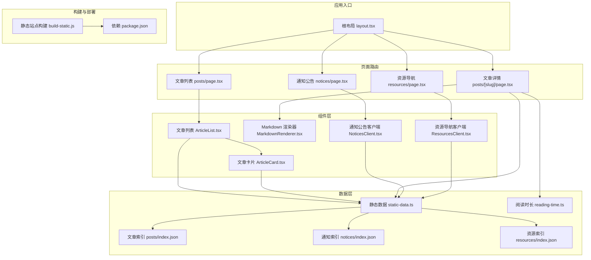
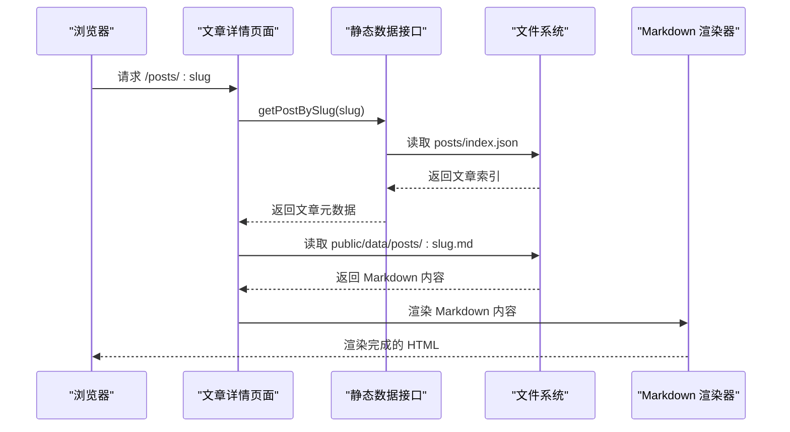
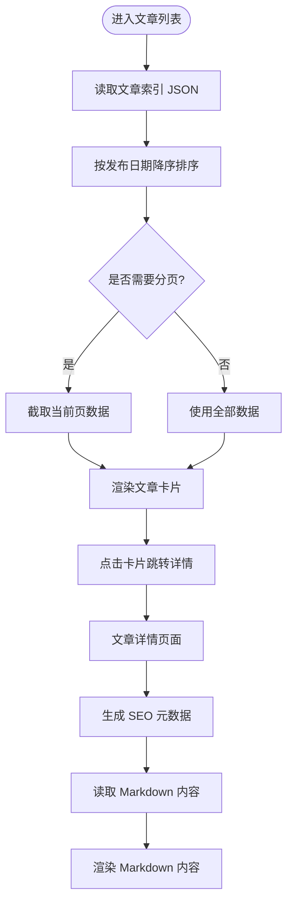
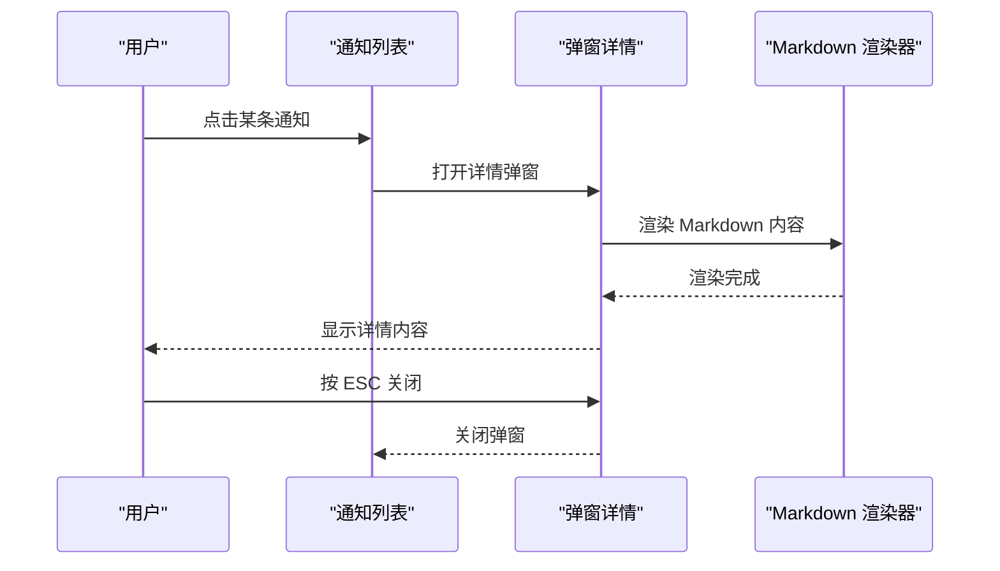
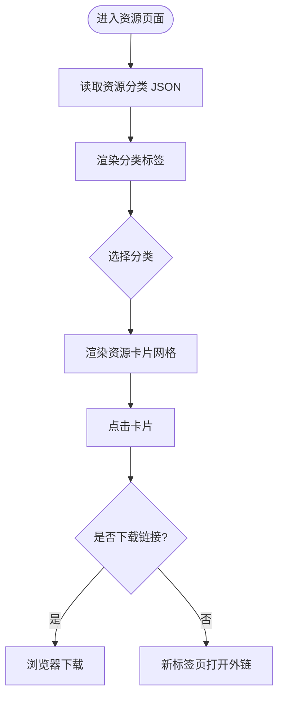
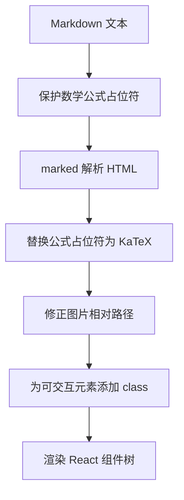
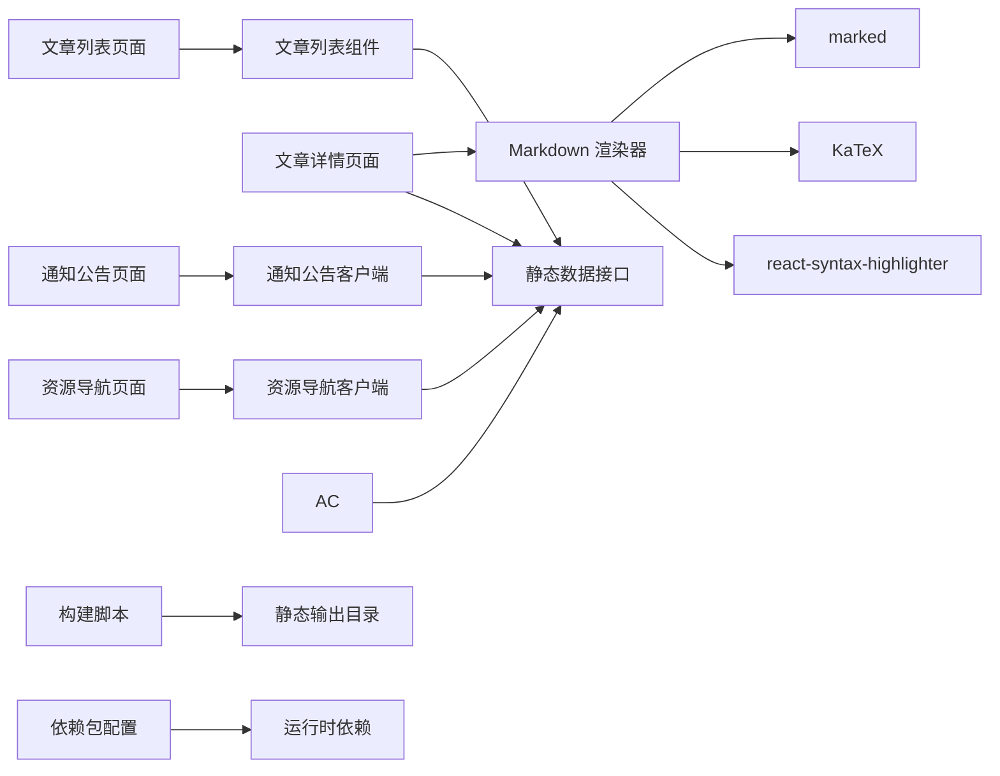

# 核心功能模块

<cite>
**本文引用的文件**
- [根布局 layout.tsx](file://blog-system2/frontend/src/app/layout.tsx)
- [静态数据处理 static-data.ts](file://blog-system2/frontend/src/lib/static-data.ts)
- [Markdown 渲染器 MarkdownRenderer.tsx](file://blog-system2/frontend/src/components/MarkdownRenderer.tsx)
- [文章列表 ArticleList.tsx](file://blog-system2/frontend/src/components/ArticleList.tsx)
- [文章卡片 ArticleCard.tsx](file://blog-system2/frontend/src/components/ArticleCard.tsx)
- [文章列表页面 posts/page.tsx](file://blog-system2/frontend/src/app/posts/page.tsx)
- [文章详情页面 posts/[slug]/page.tsx](file://blog-system2/frontend/src/app/posts/[slug]/page.tsx)
- [通知公告客户端 NoticesClient.tsx](file://blog-system2/frontend/src/components/notices/NoticesClient.tsx)
- [通知公告页面 notices/page.tsx](file://blog-system2/frontend/src/app/notices/page.tsx)
- [资源导航客户端 ResourcesClient.tsx](file://blog-system2/frontend/src/components/resources/ResourcesClient.tsx)
- [资源导航页面 resources/page.tsx](file://blog-system2/frontend/src/app/resources/page.tsx)
- [文章索引 posts/index.json](file://blog-system2/frontend/public/data/posts/index.json)
- [通知索引 notices/index.json](file://blog-system2/frontend/public/data/notices/index.json)
- [资源索引 resources/index.json](file://blog-system2/frontend/public/data/resources/index.json)
- [阅读时长计算 reading-time.ts](file://blog-system2/frontend/src/lib/reading-time.ts)
- [静态站点构建脚本 build-static.js](file://blog-system2/frontend/build-static.js)
- [依赖包配置 package.json](file://blog-system2/frontend/package.json)
</cite>

## 目录
1. [简介](#简介)
2. [项目结构](#项目结构)
3. [核心组件](#核心组件)
4. [架构总览](#架构总览)
5. [详细组件分析](#详细组件分析)
6. [依赖关系分析](#依赖关系分析)
7. [性能考量](#性能考量)
8. [故障排查指南](#故障排查指南)
9. [结论](#结论)
10. [附录](#附录)

## 简介
本文件面向技术博客平台的核心功能模块，系统性梳理内容管理系统的设计与实现，涵盖以下主题：
- 文章管理：静态索引驱动的分页、排序与筛选流程
- 通知公告：时间线展示与弹窗详情的交互设计
- 资源库：分类导航与下载链接识别的客户端行为
- 静态数据处理：从 JSON 文件到组件渲染的数据流
- Markdown 渲染：语法解析、代码高亮、数学公式与图片灯箱
- 文章列表组件：响应式布局与封面图处理
- 文章详情页面：动态路由、SEO 元数据与目录生成
- 静态站点构建：Next.js 产物复制与目录结构转换

## 项目结构
前端采用 Next.js App Router 架构，核心目录组织如下：
- src/app：页面级路由与元数据
- src/components：可复用 UI 组件
- src/lib：通用工具与静态数据接口
- public/data：静态数据与媒体资源
- 构建脚本：静态站点生成与产物复制

**图表来源**
- [根布局 layout.tsx:1-48](file://blog-system2/frontend/src/app/layout.tsx#L1-L48)
- [文章列表页面 posts/page.tsx:1-169](file://blog-system2/frontend/src/app/posts/page.tsx#L1-L169)
- [文章详情页面 posts/[slug]/page.tsx](file://blog-system2/frontend/src/app/posts/[slug]/page.tsx#L1-L304)
- [通知公告页面 notices/page.tsx:1-35](file://blog-system2/frontend/src/app/notices/page.tsx#L1-L35)
- [资源导航页面 resources/page.tsx:1-10](file://blog-system2/frontend/src/app/resources/page.tsx#L1-L10)
- [文章列表 ArticleList.tsx:1-72](file://blog-system2/frontend/src/components/ArticleList.tsx#L1-L72)
- [文章卡片 ArticleCard.tsx:1-198](file://blog-system2/frontend/src/components/ArticleCard.tsx#L1-L198)
- [Markdown 渲染器 MarkdownRenderer.tsx:1-718](file://blog-system2/frontend/src/components/MarkdownRenderer.tsx#L1-L718)
- [通知公告客户端 NoticesClient.tsx:1-398](file://blog-system2/frontend/src/components/notices/NoticesClient.tsx#L1-L398)
- [资源导航客户端 ResourcesClient.tsx:1-312](file://blog-system2/frontend/src/components/resources/ResourcesClient.tsx#L1-L312)
- [静态数据处理 static-data.ts:1-214](file://blog-system2/frontend/src/lib/static-data.ts#L1-L214)
- [文章索引 posts/index.json:1-103](file://blog-system2/frontend/public/data/posts/index.json#L1-L103)
- [通知索引 notices/index.json:1-41](file://blog-system2/frontend/public/data/notices/index.json#L1-L41)
- [资源索引 resources/index.json:1-224](file://blog-system2/frontend/public/data/resources/index.json#L1-L224)
- [阅读时长计算 reading-time.ts:1-84](file://blog-system2/frontend/src/lib/reading-time.ts#L1-L84)
- [静态站点构建脚本 build-static.js:1-141](file://blog-system2/frontend/build-static.js#L1-L141)
- [依赖包配置 package.json:1-72](file://blog-system2/frontend/package.json#L1-L72)

**章节来源**
- [根布局 layout.tsx:1-48](file://blog-system2/frontend/src/app/layout.tsx#L1-L48)
- [静态数据处理 static-data.ts:1-214](file://blog-system2/frontend/src/lib/static-data.ts#L1-L214)

## 核心组件
本节聚焦平台关键组件及其职责边界与协作方式。

- 静态数据接口（static-data.ts）
  - 提供文章、通知、资源三类静态数据的统一读取与处理能力
  - 支持分页、排序、相关文章检索、媒体地址规范化等
  - 通过 JSON 索引文件驱动，确保构建期可预测性与性能

- 文章列表组件（ArticleList.tsx）
  - 接收静态数据或 API 返回的列表，进行统一处理
  - 适配封面图 URL，支持本地与外部 API 的不同形态
  - 基于 CSS Grid 实现响应式卡片布局

- 文章卡片组件（ArticleCard.tsx）
  - 封面图懒加载与错误回退
  - 统一的点击跳转与悬停动画效果
  - 支持多种图片结构（字符串、扁平对象、多版本属性）

- Markdown 渲染器（MarkdownRenderer.tsx）
  - 基于 marked 进行解析，集成 KaTeX 数学公式渲染
  - 自定义代码块组件，支持复制、折叠、深浅色主题切换
  - 图片点击灯箱、锚点生成、相对路径修正等增强功能

- 通知公告客户端（NoticesClient.tsx）
  - 时间线式列表展示，支持置顶标记与相对时间显示
  - 弹窗详情，ESC 关闭与滚动条补偿
  - Markdown 内容渲染与动画过渡

- 资源导航客户端（ResourcesClient.tsx）
  - 分类标签切换与卡片网格展示
  - 下载链接识别与自愈刷新机制（生产环境）
  - 动画过渡与无障碍交互

**章节来源**
- [静态数据处理 static-data.ts:1-214](file://blog-system2/frontend/src/lib/static-data.ts#L1-L214)
- [文章列表 ArticleList.tsx:1-72](file://blog-system2/frontend/src/components/ArticleList.tsx#L1-L72)
- [文章卡片 ArticleCard.tsx:1-198](file://blog-system2/frontend/src/components/ArticleCard.tsx#L1-L198)
- [Markdown 渲染器 MarkdownRenderer.tsx:1-718](file://blog-system2/frontend/src/components/MarkdownRenderer.tsx#L1-L718)
- [通知公告客户端 NoticesClient.tsx:1-398](file://blog-system2/frontend/src/components/notices/NoticesClient.tsx#L1-L398)
- [资源导航客户端 ResourcesClient.tsx:1-312](file://blog-system2/frontend/src/components/resources/ResourcesClient.tsx#L1-L312)

## 架构总览
平台采用“静态数据 + 组件渲染”的轻量架构：
- 数据层：JSON 索引文件 + 服务端读取函数
- 页面层：Next.js App Router 页面，负责 SEO 元数据与静态生成
- 组件层：可复用 UI 组件，承担渲染与交互逻辑
- 构建层：静态站点生成脚本，将 Next.js 产物转换为纯静态目录

**图表来源**
- [文章详情页面 posts/[slug]/page.tsx](file://blog-system2/frontend/src/app/posts/[slug]/page.tsx#L1-L304)
- [静态数据处理 static-data.ts:85-89](file://blog-system2/frontend/src/lib/static-data.ts#L85-L89)
- [Markdown 渲染器 MarkdownRenderer.tsx:1-718](file://blog-system2/frontend/src/components/MarkdownRenderer.tsx#L1-L718)

## 详细组件分析

### 文章管理模块
- 数据来源与索引
  - 文章索引文件提供文章元数据（标题、摘要、发布日期、封面图等）
  - 静态数据接口读取并排序，支持分页与 ID 降序取最新
- 列表渲染
  - 文章列表组件统一处理数据，适配封面图 URL
  - 响应式网格布局，支持移动端到桌面端的多列展示
- 详情页面
  - 动态路由参数解析，生成静态参数列表
  - SEO 元数据动态生成，包含 Open Graph
  - 相关文章检索与展示，提升用户停留时长

**图表来源**
- [文章列表页面 posts/page.tsx:1-169](file://blog-system2/frontend/src/app/posts/page.tsx#L1-L169)
- [静态数据处理 static-data.ts:45-73](file://blog-system2/frontend/src/lib/static-data.ts#L45-L73)
- [文章卡片 ArticleCard.tsx:1-198](file://blog-system2/frontend/src/components/ArticleCard.tsx#L1-L198)
- [文章详情页面 posts/[slug]/page.tsx](file://blog-system2/frontend/src/app/posts/[slug]/page.tsx#L1-L304)

**章节来源**
- [文章索引 posts/index.json:1-103](file://blog-system2/frontend/public/data/posts/index.json#L1-L103)
- [文章列表页面 posts/page.tsx:1-169](file://blog-system2/frontend/src/app/posts/page.tsx#L1-L169)
- [静态数据处理 static-data.ts:45-83](file://blog-system2/frontend/src/lib/static-data.ts#L45-L83)
- [文章卡片 ArticleCard.tsx:1-198](file://blog-system2/frontend/src/components/ArticleCard.tsx#L1-L198)
- [文章详情页面 posts/[slug]/page.tsx](file://blog-system2/frontend/src/app/posts/[slug]/page.tsx#L1-L304)

### 通知公告模块
- 数据与展示
  - 通知索引文件包含标题、发布日期与置顶标记
  - 客户端按置顶优先、日期倒序排列，时间线可视化
- 交互设计
  - 点击进入弹窗详情，支持 ESC 关闭与滚动条补偿
  - Markdown 内容渲染，支持数学公式与代码高亮
- 性能与可用性
  - 生产环境自愈刷新，解决首屏白屏问题

**图表来源**
- [通知公告页面 notices/page.tsx:1-35](file://blog-system2/frontend/src/app/notices/page.tsx#L1-L35)
- [通知公告客户端 NoticesClient.tsx:1-398](file://blog-system2/frontend/src/components/notices/NoticesClient.tsx#L1-L398)
- [通知索引 notices/index.json:1-41](file://blog-system2/frontend/public/data/notices/index.json#L1-L41)
- [Markdown 渲染器 MarkdownRenderer.tsx:1-718](file://blog-system2/frontend/src/components/MarkdownRenderer.tsx#L1-L718)

**章节来源**
- [通知公告页面 notices/page.tsx:1-35](file://blog-system2/frontend/src/app/notices/page.tsx#L1-L35)
- [通知公告客户端 NoticesClient.tsx:1-398](file://blog-system2/frontend/src/components/notices/NoticesClient.tsx#L1-L398)
- [通知索引 notices/index.json:1-41](file://blog-system2/frontend/public/data/notices/index.json#L1-L41)

### 资源库模块
- 数据结构
  - 资源索引文件包含多个分类，每个分类下包含若干资源项（标题、描述、URL、标签、置顶标记）
- 客户端功能
  - 分类标签切换与描述动画过渡
  - 下载链接识别（根据扩展名判断），外链与下载图标区分
  - 生产环境自愈刷新，提升首屏稳定性

**图表来源**
- [资源导航页面 resources/page.tsx:1-10](file://blog-system2/frontend/src/app/resources/page.tsx#L1-L10)
- [资源导航客户端 ResourcesClient.tsx:1-312](file://blog-system2/frontend/src/components/resources/ResourcesClient.tsx#L1-L312)
- [资源索引 resources/index.json:1-224](file://blog-system2/frontend/public/data/resources/index.json#L1-L224)

**章节来源**
- [资源导航页面 resources/page.tsx:1-10](file://blog-system2/frontend/src/app/resources/page.tsx#L1-L10)
- [资源导航客户端 ResourcesClient.tsx:1-312](file://blog-system2/frontend/src/components/resources/ResourcesClient.tsx#L1-L312)
- [资源索引 resources/index.json:1-224](file://blog-system2/frontend/public/data/resources/index.json#L1-L224)

### Markdown 渲染系统
- 解析与高亮
  - 使用 marked 进行基础语法解析
  - 代码块使用 react-syntax-highlighter，支持深浅主题
- 数学公式
  - KaTeX 渲染块级与行内公式，异常保护与回退
- 增强功能
  - 图片点击灯箱、锚点生成、相对路径修正
  - 自定义代码块包装器，支持复制与折叠

**图表来源**
- [Markdown 渲染器 MarkdownRenderer.tsx:465-546](file://blog-system2/frontend/src/components/MarkdownRenderer.tsx#L465-L546)

**章节来源**
- [Markdown 渲染器 MarkdownRenderer.tsx:1-718](file://blog-system2/frontend/src/components/MarkdownRenderer.tsx#L1-L718)

### 文章列表组件
- 数据处理
  - 支持数组与带 data 字段的对象两种输入形态
  - 统一封面图 URL，处理本地与外部 API 的差异
- 布局与交互
  - 基于 CSS Grid 的响应式布局
  - 卡片悬停动画与阴影变化，提升交互反馈

**章节来源**
- [文章列表 ArticleList.tsx:1-72](file://blog-system2/frontend/src/components/ArticleList.tsx#L1-L72)
- [文章卡片 ArticleCard.tsx:1-198](file://blog-system2/frontend/src/components/ArticleCard.tsx#L1-L198)

### 文章详情页面与 SEO
- 动态路由与静态生成
  - 通过 generateStaticParams 生成所有文章的静态路由
  - 动态生成 SEO 元数据，包含 Open Graph
- 内容渲染
  - 读取 Markdown 文件内容，计算阅读统计
  - 渲染 Markdown 内容，展示相关文章

**章节来源**
- [文章详情页面 posts/[slug]/page.tsx](file://blog-system2/frontend/src/app/posts/[slug]/page.tsx#L32-L62)
- [阅读时长计算 reading-time.ts:1-84](file://blog-system2/frontend/src/lib/reading-time.ts#L1-L84)

## 依赖关系分析
- 组件依赖
  - 页面组件依赖静态数据接口与渲染组件
  - 渲染组件依赖第三方库（marked、KaTeX、react-syntax-highlighter）
- 构建依赖
  - 构建脚本依赖 Node.js 文件系统 API
  - 包管理器记录运行时与开发时依赖

**图表来源**
- [依赖包配置 package.json:1-72](file://blog-system2/frontend/package.json#L1-L72)
- [静态站点构建脚本 build-static.js:1-141](file://blog-system2/frontend/build-static.js#L1-L141)

**章节来源**
- [依赖包配置 package.json:1-72](file://blog-system2/frontend/package.json#L1-L72)

## 性能考量
- 静态数据与构建期生成
  - JSON 索引与静态 Markdown 文件减少运行时 IO
  - Next.js 静态生成与路由参数预渲染，降低首屏延迟
- 资源优化
  - Next.js Image 组件懒加载与尺寸优化
  - 代码高亮按需渲染，折叠超长代码块
- 交互优化
  - 动画过渡使用 CSS 与 Framer Motion，避免重排
  - 生产环境自愈刷新，提升首屏稳定性

## 故障排查指南
- 文章列表为空
  - 检查文章索引 JSON 是否存在且格式正确
  - 确认静态数据接口读取路径与权限
- 通知详情无法打开
  - 检查通知 Markdown 文件是否存在
  - 确认弹窗事件绑定与 ESC 键盘事件监听
- 资源下载无效
  - 检查资源 URL 扩展名是否匹配下载规则
  - 确认跨域与安全策略设置
- 构建产物缺失
  - 运行构建脚本，确认静态目录复制与路由转换逻辑
  - 检查输出目录权限与磁盘空间

**章节来源**
- [静态数据处理 static-data.ts:1-214](file://blog-system2/frontend/src/lib/static-data.ts#L1-L214)
- [通知公告客户端 NoticesClient.tsx:30-51](file://blog-system2/frontend/src/components/notices/NoticesClient.tsx#L30-L51)
- [资源导航客户端 ResourcesClient.tsx:29-32](file://blog-system2/frontend/src/components/resources/ResourcesClient.tsx#L29-L32)
- [静态站点构建脚本 build-static.js:33-87](file://blog-system2/frontend/build-static.js#L33-L87)

## 结论
该技术博客平台通过“静态数据 + 组件渲染”的架构实现了高性能、可维护的内容管理与展示系统。核心优势包括：
- 静态数据驱动，构建期可预测，运行时低开销
- 组件化设计，职责清晰，易于扩展与维护
- 丰富的渲染增强（数学公式、代码高亮、图片灯箱、SEO 元数据）
- 完善的交互与可用性（弹窗、自愈刷新、动画过渡）

建议后续方向：
- 引入缓存策略与增量更新机制
- 扩展搜索与标签体系
- 增加评论与互动功能

## 附录
- 使用模式与最佳实践
  - 在页面中调用静态数据接口获取数据，避免在客户端重复读取
  - 文章详情页面使用动态路由与 SEO 元数据生成，提升搜索引擎可见性
  - 资源导航页面通过分类标签与下载识别，优化用户体验
  - Markdown 渲染器作为通用组件，在多个页面复用，保持一致性