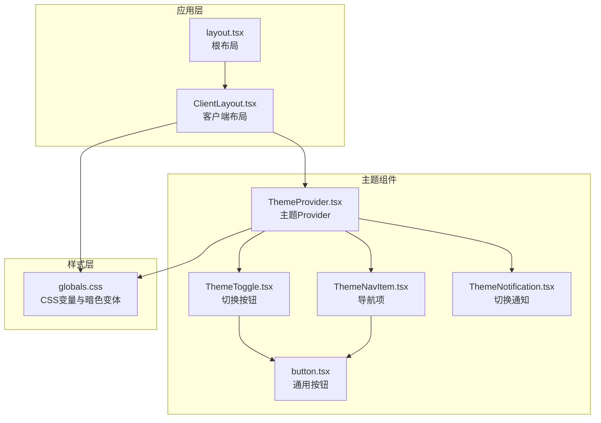
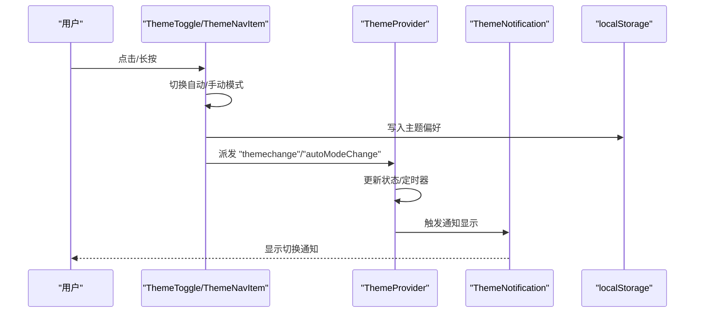
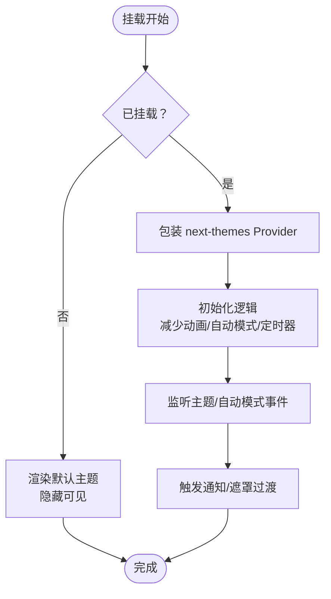
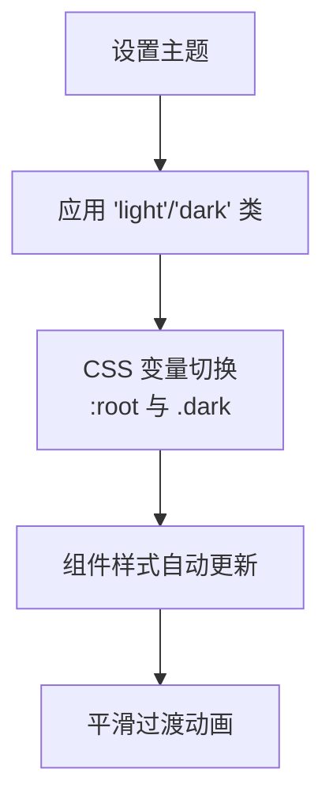
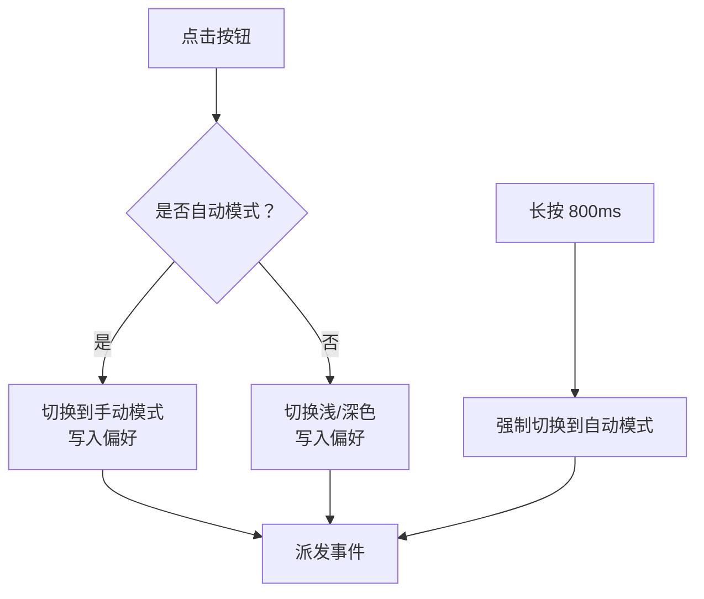
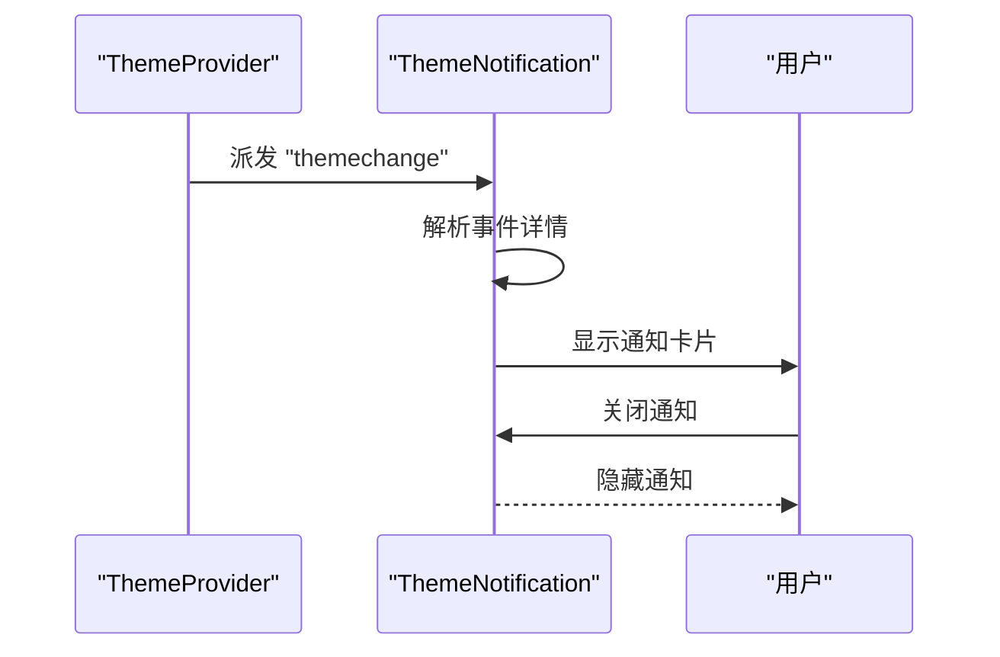
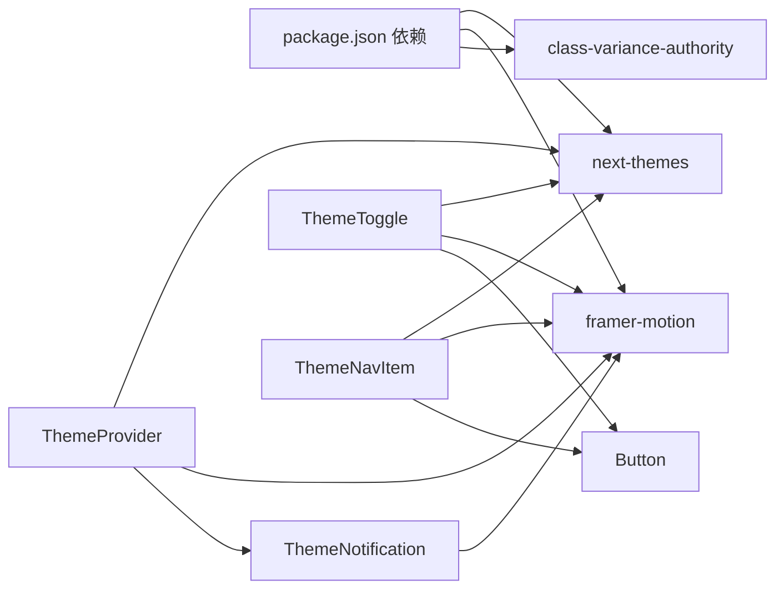

# 主题系统组件

<cite>
**本文引用的文件**
- [ThemeProvider.tsx](file://blog-system2/frontend/src/components/theme/ThemeProvider.tsx)
- [ThemeToggle.tsx](file://blog-system2/frontend/src/components/theme/ThemeToggle.tsx)
- [ThemeNavItem.tsx](file://blog-system2/frontend/src/components/theme/ThemeNavItem.tsx)
- [ThemeNotification.tsx](file://blog-system2/frontend/src/components/theme/ThemeNotification.tsx)
- [button.tsx](file://blog-system2/frontend/src/components/theme/button.tsx)
- [globals.css](file://blog-system2/frontend/src/app/globals.css)
- [ClientLayout.tsx](file://blog-system2/frontend/src/components/ClientLayout.tsx)
- [layout.tsx](file://blog-system2/frontend/src/app/layout.tsx)
- [package.json](file://blog-system2/frontend/package.json)
</cite>

## 目录
1. [简介](#简介)
2. [项目结构](#项目结构)
3. [核心组件](#核心组件)
4. [架构总览](#架构总览)
5. [详细组件分析](#详细组件分析)
6. [依赖关系分析](#依赖关系分析)
7. [性能考量](#性能考量)
8. [故障排查指南](#故障排查指南)
9. [结论](#结论)
10. [附录](#附录)

## 简介
本技术文档围绕技术博客平台的主题系统组件展开，系统采用 Provider 模式与上下文传递机制，结合 next-themes 提供的状态管理能力，实现了深色/浅色主题的无缝切换、自动模式（基于时间）与手动模式的灵活切换、以及持久化的用户偏好存储。主题切换通过 CSS 变量驱动，确保组件级样式适配与动画流畅体验；同时提供通知反馈与无障碍优化，兼顾性能与用户体验。

## 项目结构
主题系统位于前端源码的组件目录下，与全局样式、客户端布局紧密集成：
- 组件层：主题 Provider、切换按钮、导航项、通知等
- 样式层：全局 CSS 变量与暗色变体
- 应用层：根布局与客户端布局包裹 Provider

**图表来源**
- [layout.tsx:28-47](file://blog-system2/frontend/src/app/layout.tsx#L28-L47)
- [ClientLayout.tsx:29-60](file://blog-system2/frontend/src/components/ClientLayout.tsx#L29-L60)
- [ThemeProvider.tsx:40-63](file://blog-system2/frontend/src/components/theme/ThemeProvider.tsx#L40-L63)
- [ThemeToggle.tsx:10-343](file://blog-system2/frontend/src/components/theme/ThemeToggle.tsx#L10-L343)
- [ThemeNavItem.tsx:16-522](file://blog-system2/frontend/src/components/theme/ThemeNavItem.tsx#L16-L522)
- [ThemeNotification.tsx:12-343](file://blog-system2/frontend/src/components/theme/ThemeNotification.tsx#L12-L343)
- [button.tsx:35-53](file://blog-system2/frontend/src/components/theme/button.tsx#L35-L53)
- [globals.css:117-184](file://blog-system2/frontend/src/app/globals.css#L117-L184)

**章节来源**
- [layout.tsx:28-47](file://blog-system2/frontend/src/app/layout.tsx#L28-L47)
- [ClientLayout.tsx:29-60](file://blog-system2/frontend/src/components/ClientLayout.tsx#L29-L60)
- [globals.css:117-184](file://blog-system2/frontend/src/app/globals.css#L117-L184)

## 核心组件
- 主题 Provider（ThemeProvider）
  - 基于 next-themes 的 Provider 封装，负责主题状态初始化、自动模式定时更新、减少动画偏好检测、以及主题切换过程中的遮罩过渡与通知展示。
  - 关键职责：挂载态控制、自动模式按时间切换、事件监听与清理、过渡遮罩与通知联动。
- 主题切换按钮（ThemeToggle）
  - 支持点击切换与长按切换自动模式，内置减少动画偏好检测与视觉反馈，提供“日/夜”场景动画。
  - 关键职责：自动/手动模式切换、长按触发、事件派发、图标动画与指示器。
- 导航项主题切换（ThemeNavItem）
  - 导航栏中的主题入口，支持悬停提示、长按切换、触摸设备优化、SVG 装饰与动画。
  - 关键职责：自动/手动模式切换、提示工具、长按触发、动画与装饰。
- 主题通知（ThemeNotification）
  - 监听主题切换事件，展示简洁的通知卡片，支持自动模式与手动模式区分。
  - 关键职责：事件监听、消息生成、显示/隐藏控制、无障碍标签。
- 通用按钮（button.tsx）
  - 基于 class-variance-authority 的按钮变体，为主题组件提供统一的交互基元。
  - 关键职责：变体与尺寸、类名合并、forwardRef 暴露。

**章节来源**
- [ThemeProvider.tsx:40-161](file://blog-system2/frontend/src/components/theme/ThemeProvider.tsx#L40-L161)
- [ThemeToggle.tsx:10-343](file://blog-system2/frontend/src/components/theme/ThemeToggle.tsx#L10-L343)
- [ThemeNavItem.tsx:16-522](file://blog-system2/frontend/src/components/theme/ThemeNavItem.tsx#L16-L522)
- [ThemeNotification.tsx:12-343](file://blog-system2/frontend/src/components/theme/ThemeNotification.tsx#L12-L343)
- [button.tsx:35-53](file://blog-system2/frontend/src/components/theme/button.tsx#L35-L53)

## 架构总览
主题系统采用“Provider + 自定义 Hook + 事件总线”的架构：
- Provider 负责主题状态与副作用管理，封装 next-themes 的能力。
- 组件通过 useTheme 获取/设置主题，同时通过 localStorage 与自定义事件实现跨组件通信。
- 全局 CSS 通过 CSS 变量与暗色变体实现样式层的响应式切换。

**图表来源**
- [ThemeToggle.tsx:54-90](file://blog-system2/frontend/src/components/theme/ThemeToggle.tsx#L54-L90)
- [ThemeToggle.tsx:124-158](file://blog-system2/frontend/src/components/theme/ThemeToggle.tsx#L124-L158)
- [ThemeNavItem.tsx:84-120](file://blog-system2/frontend/src/components/theme/ThemeNavItem.tsx#L84-L120)
- [ThemeNavItem.tsx:122-158](file://blog-system2/frontend/src/components/theme/ThemeNavItem.tsx#L122-L158)
- [ThemeProvider.tsx:103-120](file://blog-system2/frontend/src/components/theme/ThemeProvider.tsx#L103-L120)
- [ThemeNotification.tsx:38-78](file://blog-system2/frontend/src/components/theme/ThemeNotification.tsx#L38-L78)

## 详细组件分析

### Provider 模式与上下文传递
- Provider 封装 next-themes，提供默认主题与系统主题支持，避免水合差异导致的闪烁。
- 在挂载前以隐藏方式渲染默认主题，挂载后交由 next-themes 管理。
- 通过自定义事件与 localStorage 实现跨组件主题状态同步与自动模式定时更新。

**图表来源**
- [ThemeProvider.tsx:40-63](file://blog-system2/frontend/src/components/theme/ThemeProvider.tsx#L40-L63)
- [ThemeProvider.tsx:65-161](file://blog-system2/frontend/src/components/theme/ThemeProvider.tsx#L65-L161)

**章节来源**
- [ThemeProvider.tsx:40-63](file://blog-system2/frontend/src/components/theme/ThemeProvider.tsx#L40-L63)
- [ThemeProvider.tsx:65-161](file://blog-system2/frontend/src/components/theme/ThemeProvider.tsx#L65-L161)

### 深色/浅色主题切换逻辑
- CSS 变量驱动：全局 CSS 定义了大量颜色变量，并在 :root 与 .dark 中分别给出浅色与深色映射。
- 组件级别适配：通过 CSS 暗色变体选择器与 Tailwind 类，组件可直接使用变量实现主题适配。
- 动画与过渡：全局 CSS 对 html/body 的颜色过渡进行统一控制，减少闪烁与提升体验。

**图表来源**
- [globals.css:117-184](file://blog-system2/frontend/src/app/globals.css#L117-L184)
- [globals.css:203-209](file://blog-system2/frontend/src/app/globals.css#L203-L209)

**章节来源**
- [globals.css:117-184](file://blog-system2/frontend/src/app/globals.css#L117-L184)
- [globals.css:203-209](file://blog-system2/frontend/src/app/globals.css#L203-L209)

### 自动模式与手动模式
- 自动模式：基于当前小时数判断昼夜，每分钟检查一次，必要时切换主题。
- 手动模式：用户点击按钮切换，标记用户覆盖，阻止自动模式干扰。
- 长按触发：长按 800ms 切换自动模式或在自动模式下切换到手动模式。

**图表来源**
- [ThemeToggle.tsx:54-90](file://blog-system2/frontend/src/components/theme/ThemeToggle.tsx#L54-L90)
- [ThemeToggle.tsx:124-158](file://blog-system2/frontend/src/components/theme/ThemeToggle.tsx#L124-L158)
- [ThemeNavItem.tsx:122-158](file://blog-system2/frontend/src/components/theme/ThemeNavItem.tsx#L122-L158)

**章节来源**
- [ThemeToggle.tsx:54-90](file://blog-system2/frontend/src/components/theme/ThemeToggle.tsx#L54-L90)
- [ThemeToggle.tsx:124-158](file://blog-system2/frontend/src/components/theme/ThemeToggle.tsx#L124-L158)
- [ThemeNavItem.tsx:122-158](file://blog-system2/frontend/src/components/theme/ThemeNavItem.tsx#L122-L158)

### 通知与无障碍
- 通知组件监听主题切换事件，根据自动/手动模式生成不同标题与描述，并在 3 秒后自动隐藏。
- 减少动画偏好检测：尊重系统偏好，降低不必要的动画。
- 无障碍标签：为按钮提供语义化标签，便于屏幕阅读器识别。

**图表来源**
- [ThemeNotification.tsx:38-78](file://blog-system2/frontend/src/components/theme/ThemeNotification.tsx#L38-L78)
- [ThemeNotification.tsx:134-342](file://blog-system2/frontend/src/components/theme/ThemeNotification.tsx#L134-L342)

**章节来源**
- [ThemeNotification.tsx:38-78](file://blog-system2/frontend/src/components/theme/ThemeNotification.tsx#L38-L78)
- [ThemeNotification.tsx:134-342](file://blog-system2/frontend/src/components/theme/ThemeNotification.tsx#L134-L342)

### 组件 API 文档

- ThemeProvider
  - 属性：继承自 next-themes 的 ThemeProviderProps，如 attribute、defaultTheme、enableSystem 等。
  - 行为：挂载态控制、自动模式定时器、事件监听与清理、过渡遮罩与通知联动。
  - 适用场景：应用根部包裹，确保全站主题一致性。
  - 参考路径：[ThemeProvider.tsx:40-63](file://blog-system2/frontend/src/components/theme/ThemeProvider.tsx#L40-L63)，[ThemeProvider.tsx:65-161](file://blog-system2/frontend/src/components/theme/ThemeProvider.tsx#L65-L161)

- ThemeToggle
  - 交互：点击切换浅/深色；长按切换自动模式；自动模式下点击进入手动模式。
  - 状态：自动模式指示器、减少动画偏好检测、图标动画与视觉反馈。
  - 事件：派发 "themechange" 与 "autoModeChange"。
  - 参考路径：[ThemeToggle.tsx:10-343](file://blog-system2/frontend/src/components/theme/ThemeToggle.tsx#L10-L343)

- ThemeNavItem
  - 交互：点击切换主题；长按切换自动模式；悬停提示；触摸设备优化。
  - 状态：自动模式指示器、动画与装饰（SVG、波形、LED）。
  - 事件：派发 "themechange" 与 "autoModeChange"。
  - 参考路径：[ThemeNavItem.tsx:16-522](file://blog-system2/frontend/src/components/theme/ThemeNavItem.tsx#L16-L522)

- ThemeNotification
  - 事件监听："themechange"、"autoModeChange"、"storage"。
  - 行为：根据事件详情生成标题/描述，显示 3 秒后隐藏。
  - 参考路径：[ThemeNotification.tsx:12-343](file://blog-system2/frontend/src/components/theme/ThemeNotification.tsx#L12-L343)

- Button
  - 变体：default、destructive、outline、secondary、ghost、link。
  - 尺寸：default、sm、lg、icon。
  - 参考路径：[button.tsx:35-53](file://blog-system2/frontend/src/components/theme/button.tsx#L35-L53)

**章节来源**
- [ThemeProvider.tsx:40-161](file://blog-system2/frontend/src/components/theme/ThemeProvider.tsx#L40-L161)
- [ThemeToggle.tsx:10-343](file://blog-system2/frontend/src/components/theme/ThemeToggle.tsx#L10-L343)
- [ThemeNavItem.tsx:16-522](file://blog-system2/frontend/src/components/theme/ThemeNavItem.tsx#L16-L522)
- [ThemeNotification.tsx:12-343](file://blog-system2/frontend/src/components/theme/ThemeNotification.tsx#L12-L343)
- [button.tsx:35-53](file://blog-system2/frontend/src/components/theme/button.tsx#L35-L53)

## 依赖关系分析
- 外部依赖
  - next-themes：提供主题状态管理与系统主题支持。
  - framer-motion：提供流畅的动画与过渡效果。
  - class-variance-authority：提供按钮变体与类名组合能力。
- 内部依赖
  - ThemeProvider 依赖 useTheme 与自定义通知组件。
  - ThemeToggle/ThemeNavItem 依赖 Button 组件与 useTheme。
  - ThemeNotification 依赖动画库与事件监听。

**图表来源**
- [package.json:13-42](file://blog-system2/frontend/package.json#L13-L42)
- [ThemeProvider.tsx:3](file://blog-system2/frontend/src/components/theme/ThemeProvider.tsx#L3)
- [ThemeToggle.tsx:4](file://blog-system2/frontend/src/components/theme/ThemeToggle.tsx#L4)
- [ThemeNavItem.tsx:4](file://blog-system2/frontend/src/components/theme/ThemeNavItem.tsx#L4)
- [button.tsx:3](file://blog-system2/frontend/src/components/theme/button.tsx#L3)

**章节来源**
- [package.json:13-42](file://blog-system2/frontend/package.json#L13-L42)

## 性能考量
- 水合优化：Provider 在挂载前以隐藏方式渲染默认主题，避免首屏闪烁。
- 减少动画：尊重系统“减少动画”偏好，降低动画持续时间与迭代次数。
- 事件节流：自动模式定时器每分钟检查一次，避免频繁重绘。
- 动画与过渡：全局 CSS 控制颜色过渡时长，减少复杂动画对性能的影响。
- 触摸设备优化：在触摸设备上禁用部分装饰性动画，降低渲染压力。

**章节来源**
- [ThemeProvider.tsx:47-56](file://blog-system2/frontend/src/components/theme/ThemeProvider.tsx#L47-L56)
- [globals.css:381-387](file://blog-system2/frontend/src/app/globals.css#L381-L387)
- [globals.css:608-681](file://blog-system2/frontend/src/app/globals.css#L608-L681)

## 故障排查指南
- 主题未生效
  - 检查根布局是否包裹 ThemeProvider，且 attribute 设为 "class"。
  - 确认 CSS 变量已在 :root 与 .dark 中正确映射。
  - 参考路径：[ClientLayout.tsx:29](file://blog-system2/frontend/src/components/ClientLayout.tsx#L29)，[globals.css:117-184](file://blog-system2/frontend/src/app/globals.css#L117-L184)
- 自动模式不工作
  - 确认 localStorage 中 "themeAutoMode" 与 "userThemeOverride" 的值符合预期。
  - 检查定时器是否被清理或阻塞。
  - 参考路径：[ThemeProvider.tsx:96-99](file://blog-system2/frontend/src/components/theme/ThemeProvider.tsx#L96-L99)，[ThemeToggle.tsx:54-90](file://blog-system2/frontend/src/components/theme/ThemeToggle.tsx#L54-L90)
- 通知不显示
  - 确认事件派发与监听是否正确，检查 "themechange" 事件细节。
  - 参考路径：[ThemeNotification.tsx:38-78](file://blog-system2/frontend/src/components/theme/ThemeNotification.tsx#L38-L78)
- 动画异常
  - 检查系统“减少动画”偏好是否开启，确认动画时长与缓动函数。
  - 参考路径：[globals.css:381-387](file://blog-system2/frontend/src/app/globals.css#L381-L387)

**章节来源**
- [ClientLayout.tsx:29](file://blog-system2/frontend/src/components/ClientLayout.tsx#L29)
- [globals.css:117-184](file://blog-system2/frontend/src/app/globals.css#L117-L184)
- [ThemeProvider.tsx:96-99](file://blog-system2/frontend/src/components/theme/ThemeProvider.tsx#L96-L99)
- [ThemeToggle.tsx:54-90](file://blog-system2/frontend/src/components/theme/ThemeToggle.tsx#L54-L90)
- [ThemeNotification.tsx:38-78](file://blog-system2/frontend/src/components/theme/ThemeNotification.tsx#L38-L78)
- [globals.css:381-387](file://blog-system2/frontend/src/app/globals.css#L381-L387)

## 结论
该主题系统通过 Provider 模式与 next-themes 的深度集成，实现了稳定、可扩展的主题切换机制。配合 CSS 变量与暗色变体，组件级样式适配自然流畅；自动模式与手动模式的双轨策略满足多样化需求；通知与无障碍优化提升了用户体验。整体架构清晰、耦合度低、易于扩展与维护。

## 附录
- 实际使用示例
  - 在根布局中包裹 ThemeProvider，并在需要的地方引入 ThemeToggle 或 ThemeNavItem。
  - 参考路径：[layout.tsx:28-47](file://blog-system2/frontend/src/app/layout.tsx#L28-L47)，[ClientLayout.tsx:29-60](file://blog-system2/frontend/src/components/ClientLayout.tsx#L29-L60)
- 主题定制方法
  - 修改 globals.css 中的 CSS 变量，即可实现品牌色与风格定制。
  - 参考路径：[globals.css:6-44](file://blog-system2/frontend/src/app/globals.css#L6-L44)，[globals.css:117-184](file://blog-system2/frontend/src/app/globals.css#L117-L184)
- 浏览器兼容性
  - 使用现代 CSS 变量与暗色变体，主流浏览器均能良好支持。
  - 参考路径：[globals.css:4](file://blog-system2/frontend/src/app/globals.css#L4)，[globals.css:117-184](file://blog-system2/frontend/src/app/globals.css#L117-L184)
- 性能优化建议
  - 保持动画简洁，避免在触摸设备上渲染复杂装饰。
  - 合理使用事件监听与定时器，及时清理避免内存泄漏。
  - 参考路径：[globals.css:608-681](file://blog-system2/frontend/src/app/globals.css#L608-L681)，[ThemeProvider.tsx:138-149](file://blog-system2/frontend/src/components/theme/ThemeProvider.tsx#L138-L149)