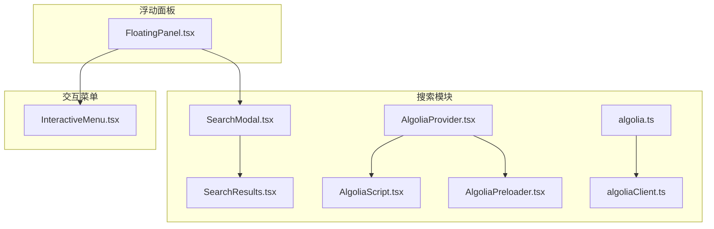
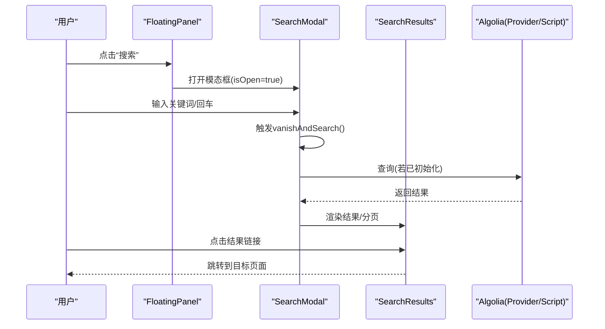
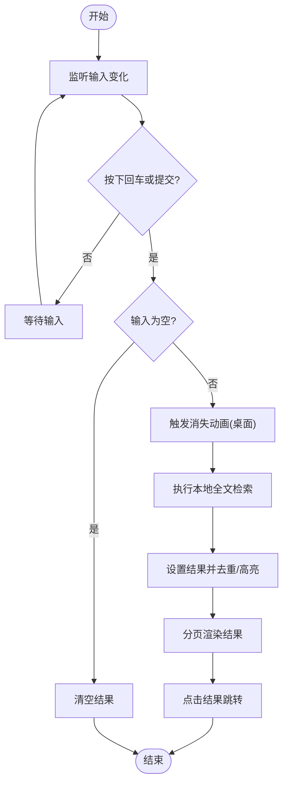
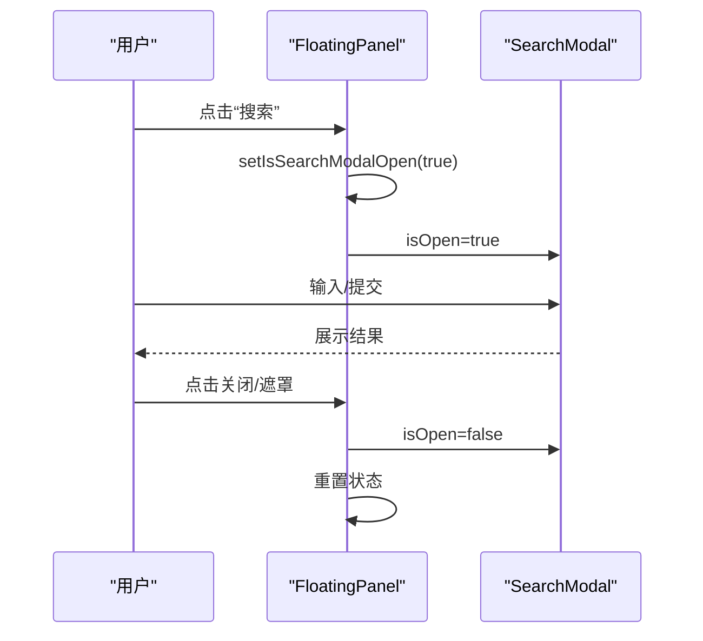
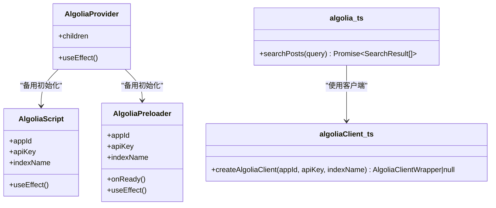
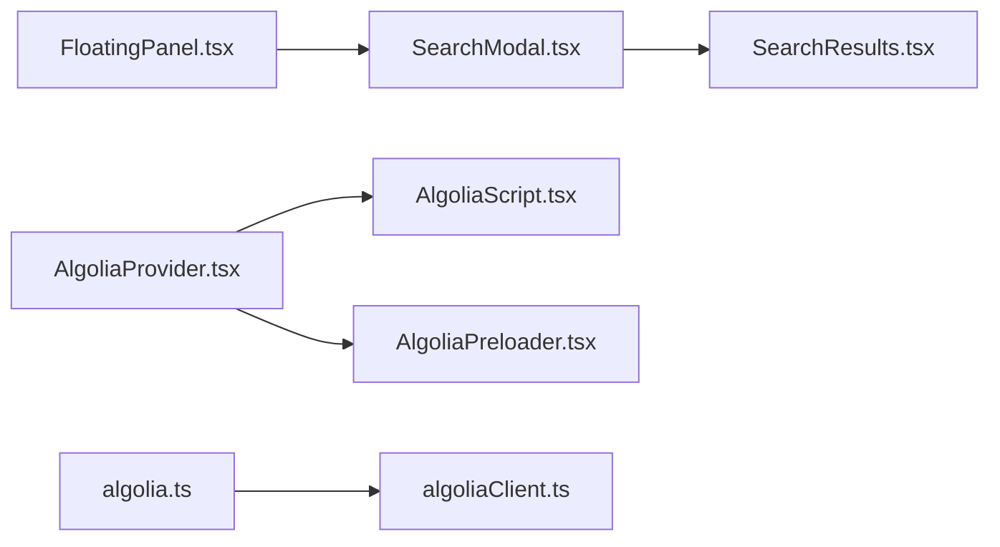

# 交互组件

<cite>
**本文引用的文件**
- [SearchModal.tsx](file://blog-system2/frontend/src/components/Search/SearchModal.tsx)
- [SearchResults.tsx](file://blog-system2/frontend/src/components/Search/SearchResults.tsx)
- [FloatingPanel.tsx](file://blog-system2/frontend/src/components/Home/FloatingPanel.tsx)
- [InteractiveMenu.tsx](file://blog-system2/frontend/src/components/Home/InteractiveMenu.tsx)
- [AlgoliaProvider.tsx](file://blog-system2/frontend/src/components/Search/AlgoliaProvider.tsx)
- [AlgoliaScript.tsx](file://blog-system2/frontend/src/components/Search/AlgoliaScript.tsx)
- [AlgoliaPreloader.tsx](file://blog-system2/frontend/src/components/Search/AlgoliaPreloader.tsx)
- [algolia.ts](file://blog-system2/frontend/src/lib/algolia.ts)
- [algoliaClient.ts](file://blog-system2/frontend/src/lib/algoliaClient.ts)
</cite>

## 目录
1. [引言](#引言)
2. [项目结构](#项目结构)
3. [核心组件](#核心组件)
4. [架构总览](#架构总览)
5. [详细组件分析](#详细组件分析)
6. [依赖分析](#依赖分析)
7. [性能考量](#性能考量)
8. [故障排查指南](#故障排查指南)
9. [结论](#结论)
10. [附录](#附录)

## 引言
本技术文档聚焦于技术博客平台中的交互组件，重点覆盖以下三个方面：
- 搜索模态框：包含本地全文检索、实时搜索与结果分页展示、输入动画与遮罩层等交互细节。
- 交互菜单：包含菜单状态管理、悬停/点击行为、触摸设备适配与视觉反馈。
- 浮动面板：包含位置计算、遮罩处理、动画效果与与搜索模态框的协作。

同时，文档提供组件API说明（事件、状态与配置）、使用示例、交互设计原则与可访问性建议，并解释组件间的数据流与协作关系，最后给出性能优化策略。

## 项目结构
围绕交互组件的关键目录与文件如下：
- 搜索相关：SearchModal、SearchResults、AlgoliaProvider、AlgoliaScript、AlgoliaPreloader、algolia.ts、algoliaClient.ts
- 交互菜单：InteractiveMenu
- 浮动面板：FloatingPanel（内部嵌入 SearchModal）

图表来源
- [SearchModal.tsx:1-935](file://blog-system2/frontend/src/components/Search/SearchModal.tsx#L1-L935)
- [SearchResults.tsx:1-96](file://blog-system2/frontend/src/components/Search/SearchResults.tsx#L1-L96)
- [FloatingPanel.tsx:1-437](file://blog-system2/frontend/src/components/Home/FloatingPanel.tsx#L1-L437)
- [InteractiveMenu.tsx:1-72](file://blog-system2/frontend/src/components/Home/InteractiveMenu.tsx#L1-L72)
- [AlgoliaProvider.tsx:1-100](file://blog-system2/frontend/src/components/Search/AlgoliaProvider.tsx#L1-L100)
- [AlgoliaScript.tsx:1-102](file://blog-system2/frontend/src/components/Search/AlgoliaScript.tsx#L1-L102)
- [AlgoliaPreloader.tsx:1-103](file://blog-system2/frontend/src/components/Search/AlgoliaPreloader.tsx#L1-L103)
- [algolia.ts:1-46](file://blog-system2/frontend/src/lib/algolia.ts#L1-L46)
- [algoliaClient.ts:1-33](file://blog-system2/frontend/src/lib/algoliaClient.ts#L1-L33)

章节来源
- [SearchModal.tsx:1-935](file://blog-system2/frontend/src/components/Search/SearchModal.tsx#L1-L935)
- [FloatingPanel.tsx:1-437](file://blog-system2/frontend/src/components/Home/FloatingPanel.tsx#L1-L437)
- [InteractiveMenu.tsx:1-72](file://blog-system2/frontend/src/components/Home/InteractiveMenu.tsx#L1-L72)
- [AlgoliaProvider.tsx:1-100](file://blog-system2/frontend/src/components/Search/AlgoliaProvider.tsx#L1-L100)
- [AlgoliaScript.tsx:1-102](file://blog-system2/frontend/src/components/Search/AlgoliaScript.tsx#L1-L102)
- [AlgoliaPreloader.tsx:1-103](file://blog-system2/frontend/src/components/Search/AlgoliaPreloader.tsx#L1-L103)
- [algolia.ts:1-46](file://blog-system2/frontend/src/lib/algolia.ts#L1-L46)
- [algoliaClient.ts:1-33](file://blog-system2/frontend/src/lib/algoliaClient.ts#L1-L33)

## 核心组件
- 搜索模态框（SearchModal）：负责输入、占位提示轮播、输入消失动画、本地全文检索、结果分页与高亮显示、Esc 关闭、点击外部关闭、键盘导航支持。
- 搜索结果（SearchResults）：负责加载态、空结果提示、结果列表渲染与链接跳转。
- 浮动面板（FloatingPanel）：负责面板打开/关闭动画、遮罩层、背景电路/云雾动画、搜索入口与导航项。
- 交互菜单（InteractiveMenu）：负责菜单项悬停/选中状态、触摸设备适配、点击切换选中项。
- Algolia 集成：提供 Provider、Script、Preloader 三种方式初始化 Algolia 客户端与索引；提供封装的 searchPosts 方法。

章节来源
- [SearchModal.tsx:10-132](file://blog-system2/frontend/src/components/Search/SearchModal.tsx#L10-L132)
- [SearchResults.tsx:17-96](file://blog-system2/frontend/src/components/Search/SearchResults.tsx#L17-L96)
- [FloatingPanel.tsx:19-60](file://blog-system2/frontend/src/components/Home/FloatingPanel.tsx#L19-L60)
- [InteractiveMenu.tsx:16-42](file://blog-system2/frontend/src/components/Home/InteractiveMenu.tsx#L16-L42)
- [algolia.ts:18-46](file://blog-system2/frontend/src/lib/algolia.ts#L18-L46)

## 架构总览
搜索模态框与浮动面板的关系：浮动面板作为容器承载搜索入口与导航，点击“搜索”后打开搜索模态框；搜索模态框负责实际的搜索逻辑与结果展示。Algolia 提供器通过多种方式确保客户端可用，再由封装方法进行查询。

图表来源
- [FloatingPanel.tsx:48-58](file://blog-system2/frontend/src/components/Home/FloatingPanel.tsx#L48-L58)
- [SearchModal.tsx:275-298](file://blog-system2/frontend/src/components/Search/SearchModal.tsx#L275-L298)
- [SearchResults.tsx:24-96](file://blog-system2/frontend/src/components/Search/SearchResults.tsx#L24-L96)
- [AlgoliaProvider.tsx:22-70](file://blog-system2/frontend/src/components/Search/AlgoliaProvider.tsx#L22-L70)

## 详细组件分析

### 搜索模态框（SearchModal）
- 功能要点
  - 输入焦点管理与 Esc 关闭
  - 占位提示轮播与可见性感知
  - 输入消失动画（Canvas + requestAnimationFrame）
  - 本地全文检索：文章、通知、资源、关于页面
  - 结果去重、高亮匹配文本、分页展示
  - 点击外部关闭、键盘导航支持
- 状态与事件
  - isOpen/onClose：控制模态框显隐
  - searchText：当前输入值
  - searchResults：搜索结果数组
  - isLoading/hasSearched：加载与是否已搜索
  - currentPage/resultsPerPage：分页控制
  - animating：动画执行中状态
- 数据流
  - 用户输入 -> vanishAndSearch -> handleSearch -> setSearchResults -> SearchResults 渲染
  - 点击外部/ESC -> onClose -> 重置状态
- 性能与体验
  - Canvas 动画在桌面端启用，移动端跳过以提升流畅度
  - 分页每页最多 6 条，避免长列表滚动卡顿
  - 高亮使用正则替换，注意大结果集时的渲染成本

图表来源
- [SearchModal.tsx:275-428](file://blog-system2/frontend/src/components/Search/SearchModal.tsx#L275-L428)

章节来源
- [SearchModal.tsx:10-132](file://blog-system2/frontend/src/components/Search/SearchModal.tsx#L10-L132)
- [SearchModal.tsx:134-169](file://blog-system2/frontend/src/components/Search/SearchModal.tsx#L134-L169)
- [SearchModal.tsx:171-228](file://blog-system2/frontend/src/components/Search/SearchModal.tsx#L171-L228)
- [SearchModal.tsx:300-428](file://blog-system2/frontend/src/components/Search/SearchModal.tsx#L300-L428)
- [SearchResults.tsx:17-96](file://blog-system2/frontend/src/components/Search/SearchResults.tsx#L17-L96)

### 搜索结果（SearchResults）
- 功能要点
  - 加载态指示器
  - 空结果提示
  - 结果列表渲染，逐条入场动画
  - 标题/摘要高亮显示
  - 链接跳转至对应页面
- API
  - props: results, isLoading, searchQuery, onResultClick
  - 渲染每个结果项的标题、摘要与路径

章节来源
- [SearchResults.tsx:17-96](file://blog-system2/frontend/src/components/Search/SearchResults.tsx#L17-L96)

### 浮动面板（FloatingPanel）
- 功能要点
  - 面板打开/关闭动画与遮罩层
  - 背景电路/云雾/波形动画
  - 搜索入口：点击打开 SearchModal
  - 导航项：图标 + 文案 + 波形装饰
  - 底部主题切换入口
- 协作关系
  - 内部持有 SearchModal 实例，通过 isOpen/onClose 控制显隐
  - 与 InteractiveMenu 的交互菜单在同一页面场景下协同工作（如右侧导航）

图表来源
- [FloatingPanel.tsx:48-58](file://blog-system2/frontend/src/components/Home/FloatingPanel.tsx#L48-L58)
- [FloatingPanel.tsx:426-432](file://blog-system2/frontend/src/components/Home/FloatingPanel.tsx#L426-L432)
- [SearchModal.tsx:124-132](file://blog-system2/frontend/src/components/Search/SearchModal.tsx#L124-L132)

章节来源
- [FloatingPanel.tsx:19-60](file://blog-system2/frontend/src/components/Home/FloatingPanel.tsx#L19-L60)
- [FloatingPanel.tsx:114-137](file://blog-system2/frontend/src/components/Home/FloatingPanel.tsx#L114-L137)
- [FloatingPanel.tsx:336-372](file://blog-system2/frontend/src/components/Home/FloatingPanel.tsx#L336-L372)
- [FloatingPanel.tsx:374-421](file://blog-system2/frontend/src/components/Home/FloatingPanel.tsx#L374-L421)

### 交互菜单（InteractiveMenu）
- 功能要点
  - 菜单项悬停/选中状态管理
  - 触摸设备检测与行为适配（禁用悬停）
  - 点击切换选中项
  - 字体大小与透明度随状态变化
- 设计原则
  - 桌面端：悬停高亮，点击确认选中
  - 移动端：禁用悬停，仅点击切换

章节来源
- [InteractiveMenu.tsx:16-42](file://blog-system2/frontend/src/components/Home/InteractiveMenu.tsx#L16-L42)
- [InteractiveMenu.tsx:21-23](file://blog-system2/frontend/src/components/Home/InteractiveMenu.tsx#L21-L23)

### Algolia 集成
- Provider/Script/Preloader 三种初始化方式
  - Provider：优先使用 Next.js Script 的 afterInteractive 策略加载库并在 onLoad 中初始化索引
  - Script：独立脚本注入，手动初始化
  - Preloader：预加载脚本并在 ready 后回调
- 封装方法
  - algolia.ts 提供 searchPosts 封装，调用 index.search 并返回标准化结果
  - algoliaClient.ts 提供 createAlgoliaClient 工厂，返回 { searchClient, index }

图表来源
- [AlgoliaProvider.tsx:22-70](file://blog-system2/frontend/src/components/Search/AlgoliaProvider.tsx#L22-L70)
- [AlgoliaScript.tsx:22-53](file://blog-system2/frontend/src/components/Search/AlgoliaScript.tsx#L22-L53)
- [AlgoliaPreloader.tsx:12-45](file://blog-system2/frontend/src/components/Search/AlgoliaPreloader.tsx#L12-L45)
- [algolia.ts:18-46](file://blog-system2/frontend/src/lib/algolia.ts#L18-L46)
- [algoliaClient.ts:15-32](file://blog-system2/frontend/src/lib/algoliaClient.ts#L15-L32)

章节来源
- [AlgoliaProvider.tsx:22-70](file://blog-system2/frontend/src/components/Search/AlgoliaProvider.tsx#L22-L70)
- [AlgoliaScript.tsx:27-53](file://blog-system2/frontend/src/components/Search/AlgoliaScript.tsx#L27-L53)
- [AlgoliaPreloader.tsx:20-45](file://blog-system2/frontend/src/components/Search/AlgoliaPreloader.tsx#L20-L45)
- [algolia.ts:18-46](file://blog-system2/frontend/src/lib/algolia.ts#L18-L46)
- [algoliaClient.ts:15-32](file://blog-system2/frontend/src/lib/algoliaClient.ts#L15-L32)

## 依赖分析
- 组件耦合
  - FloatingPanel 依赖 SearchModal 作为子组件，通过 isOpen/onClose 控制
  - SearchModal 依赖 SearchResults 进行结果渲染
  - AlgoliaProvider/Script/Preloader 为搜索能力提供基础设施
- 外部依赖
  - Framer Motion：用于面板与结果的动画
  - Next.js Script：动态加载 Algolia 客户端
  - React Icons：图标渲染
- 潜在循环依赖
  - 当前文件间无直接循环导入，但需注意 Provider/Script/Preloader 的初始化顺序与时机

图表来源
- [FloatingPanel.tsx:1-437](file://blog-system2/frontend/src/components/Home/FloatingPanel.tsx#L1-L437)
- [SearchModal.tsx:1-935](file://blog-system2/frontend/src/components/Search/SearchModal.tsx#L1-L935)
- [SearchResults.tsx:1-96](file://blog-system2/frontend/src/components/Search/SearchResults.tsx#L1-L96)
- [AlgoliaProvider.tsx:1-100](file://blog-system2/frontend/src/components/Search/AlgoliaProvider.tsx#L1-L100)
- [AlgoliaScript.tsx:1-102](file://blog-system2/frontend/src/components/Search/AlgoliaScript.tsx#L1-L102)
- [AlgoliaPreloader.tsx:1-103](file://blog-system2/frontend/src/components/Search/AlgoliaPreloader.tsx#L1-L103)
- [algolia.ts:1-46](file://blog-system2/frontend/src/lib/algolia.ts#L1-L46)
- [algoliaClient.ts:1-33](file://blog-system2/frontend/src/lib/algoliaClient.ts#L1-L33)

## 性能考量
- 搜索性能
  - 本地全文检索按 JSON 文件遍历，适合中等规模数据；大规模数据建议迁移至 Algolia 或服务端分页
  - 高亮使用正则替换，建议限制最大返回条数或延迟高亮
- 动画性能
  - Canvas 动画仅在桌面端启用，移动端跳过以减少 CPU/GPU 占用
  - Framer Motion 使用 GPU 加速的 transform/opacity，注意层级与合成层
- 渲染性能
  - SearchResults 使用逐条入场动画，建议在大数据量时关闭动画或采用虚拟滚动
  - 分页每页最多 6 条，降低长列表渲染压力
- 初始化性能
  - Provider 使用 afterInteractive 策略，避免阻塞首屏
  - Preloader 提供 ready 回调，便于懒加载其他功能

[本节为通用指导，不直接分析具体文件，故无章节来源]

## 故障排查指南
- 搜索无结果或报错
  - 检查数据文件路径与格式（posts/notices/resources/about），确认 index.json 存在且可访问
  - 确认 handleSearch 的 fetch 请求未被跨域或 CSP 阻断
- Algolia 未初始化
  - 检查 Provider/Script/Preloader 是否正确加载与初始化
  - 查看浏览器控制台是否存在脚本加载失败或初始化异常
- 动画异常
  - 桌面端 Canvas 动画依赖输入框样式，检查字体大小与字体族是否正确
  - 移动端动画被跳过属预期行为，确认 isTouchRef 判断逻辑
- 面板遮罩无效
  - 确认遮罩层 z-index 与面板一致，pointerDown 事件是否阻止冒泡

章节来源
- [SearchModal.tsx:300-428](file://blog-system2/frontend/src/components/Search/SearchModal.tsx#L300-L428)
- [AlgoliaProvider.tsx:28-70](file://blog-system2/frontend/src/components/Search/AlgoliaProvider.tsx#L28-L70)
- [AlgoliaScript.tsx:41-53](file://blog-system2/frontend/src/components/Search/AlgoliaScript.tsx#L41-L53)
- [AlgoliaPreloader.tsx:26-45](file://blog-system2/frontend/src/components/Search/AlgoliaPreloader.tsx#L26-L45)

## 结论
该交互组件体系以“浮动面板 + 搜索模态框”为核心，结合本地全文检索与 Algolia 初始化方案，提供了良好的用户体验与可扩展性。通过状态管理、动画与无障碍属性的合理运用，组件在桌面与移动设备上均具备稳定的交互表现。建议在数据规模扩大后，逐步迁移搜索能力至 Algolia 或服务端，以获得更优的性能与可维护性。

[本节为总结性内容，不直接分析具体文件，故无章节来源]

## 附录

### 组件 API 文档

- SearchModal
  - 属性
    - isOpen: boolean（控制模态框显隐）
    - onClose: () => void（关闭回调）
  - 状态
    - searchText: string（当前输入）
    - searchResults: SearchResultItem[]（搜索结果）
    - isLoading: boolean（加载中）
    - hasSearched: boolean（是否已搜索）
    - currentPage: number（当前页）
    - animating: boolean（动画中）
  - 事件
    - 提交表单（Enter 或点击搜索按钮）触发搜索
    - 点击外部/按 Esc 关闭
  - 自定义配置
    - resultsPerPage：每页结果数量（默认 6）
    - placeholders：占位提示数组

- SearchResults
  - 属性
    - results: SearchResultItem[]
    - isLoading: boolean
    - searchQuery: string
    - onResultClick: () => void
  - 行为
    - 加载态、空结果提示、逐条入场动画、链接跳转

- FloatingPanel
  - 属性
    - isOpen: boolean
    - onClose: () => void
    - navigation: NavigationItem[]（导航项数组）
  - 行为
    - 面板打开/关闭动画、遮罩层、背景动画、搜索入口、底部主题切换

- InteractiveMenu
  - 属性
    - 无（内部硬编码菜单项）
  - 状态
    - hoveredItem: number | null（悬停项）
    - selectedItem: number | null（选中项）
    - isTouch: boolean（触摸设备）
  - 行为
    - 桌面端悬停高亮，点击切换选中；移动端禁用悬停

- Algolia 相关
  - AlgoliaProvider
    - 作用：加载并初始化 Algolia 客户端与索引
  - AlgoliaScript
    - 作用：注入并初始化 Algolia 客户端
  - AlgoliaPreloader
    - 作用：预加载脚本并在 ready 后回调
  - algolia.ts
    - searchPosts(query): Promise<SearchResult[]>
  - algoliaClient.ts
    - createAlgoliaClient(appId, apiKey, indexName): AlgoliaClientWrapper | null

章节来源
- [SearchModal.tsx:10-132](file://blog-system2/frontend/src/components/Search/SearchModal.tsx#L10-L132)
- [SearchResults.tsx:17-96](file://blog-system2/frontend/src/components/Search/SearchResults.tsx#L17-L96)
- [FloatingPanel.tsx:19-60](file://blog-system2/frontend/src/components/Home/FloatingPanel.tsx#L19-L60)
- [InteractiveMenu.tsx:16-42](file://blog-system2/frontend/src/components/Home/InteractiveMenu.tsx#L16-L42)
- [algolia.ts:18-46](file://blog-system2/frontend/src/lib/algolia.ts#L18-L46)
- [algoliaClient.ts:15-32](file://blog-system2/frontend/src/lib/algoliaClient.ts#L15-L32)

### 实际使用示例
- 在页面中引入 FloatingPanel，并传入导航项数组，控制 isOpen/onClose
- 在需要的地方放置 SearchNavItem（位于 Home 目录下），点击后打开浮动面板
- 若需使用 Algolia 搜索，将 AlgoliaProvider 包裹在应用根节点，确保全局可用

章节来源
- [FloatingPanel.tsx:48-58](file://blog-system2/frontend/src/components/Home/FloatingPanel.tsx#L48-L58)
- [AlgoliaProvider.tsx:72-98](file://blog-system2/frontend/src/components/Search/AlgoliaProvider.tsx#L72-L98)

### 交互设计原则与可访问性
- 键盘可达性：支持 Esc 关闭、Tab 导航、Enter 提交
- 触摸友好：触摸设备禁用悬停，点击切换；按钮尺寸与间距符合移动端标准
- 语义化：使用 aria-label、语义化标签与角色
- 动效克制：在大数据量或低端设备上可选择关闭动画或减少入场延迟

[本节为通用指导，不直接分析具体文件，故无章节来源]