# 交互菜单

<cite>
**本文档引用的文件**
- [InteractiveMenu.tsx](file://blog-system2/frontend/src/components/Home/InteractiveMenu.tsx)
- [naver.tsx](file://blog-system2/frontend/src/components/Home/naver.tsx)
- [FloatingPanel.tsx](file://blog-system2/frontend/src/components/Home/FloatingPanel.tsx)
- [SearchNavItem.tsx](file://blog-system2/frontend/src/components/Home/SearchNavItem.tsx)
- [TooltipPortal.tsx](file://blog-system2/frontend/src/components/Home/TooltipPortal.tsx)
- [ClientLayout.tsx](file://blog-system2/frontend/src/components/ClientLayout.tsx)
- [globals.css](file://blog-system2/frontend/src/app/globals.css)
- [package.json](file://blog-system2/frontend/package.json)
</cite>

## 目录
1. [简介](#简介)
2. [项目结构](#项目结构)
3. [核心组件](#核心组件)
4. [架构概览](#架构概览)
5. [详细组件分析](#详细组件分析)
6. [依赖关系分析](#依赖关系分析)
7. [性能考虑](#性能考虑)
8. [故障排除指南](#故障排除指南)
9. [结论](#结论)

## 简介

交互菜单组件是 MDG 网站前端架构中的核心导航组件，提供了现代化的用户界面体验。该组件集成了多种交互模式，包括桌面端的鼠标悬停效果、移动端的触摸交互、流畅的动画过渡以及完整的无障碍访问支持。

该组件采用 React Hooks 和 Framer Motion 实现高性能的动画效果，结合 Tailwind CSS 提供的原子化样式系统，实现了跨平台的一致用户体验。组件支持深色模式自动切换、响应式布局适配，以及针对不同设备类型的优化交互行为。

## 项目结构

交互菜单组件位于前端项目的组件目录中，采用模块化设计，便于维护和扩展：

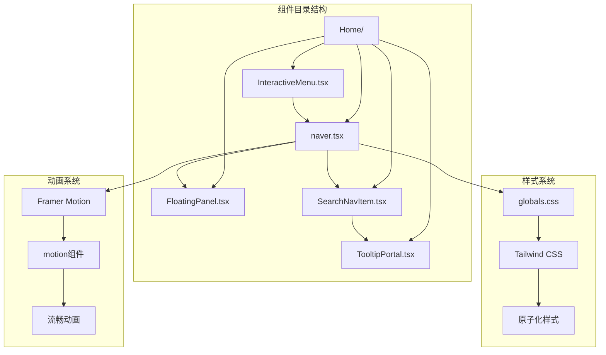

**图表来源**
- [InteractiveMenu.tsx:1-72](file://blog-system2/frontend/src/components/Home/InteractiveMenu.tsx#L1-L72)
- [naver.tsx:1-818](file://blog-system2/frontend/src/components/Home/naver.tsx#L1-L818)

**章节来源**
- [InteractiveMenu.tsx:1-72](file://blog-system2/frontend/src/components/Home/InteractiveMenu.tsx#L1-L72)
- [naver.tsx:1-818](file://blog-system2/frontend/src/components/Home/naver.tsx#L1-L818)

## 核心组件

### 主要组件概述

交互菜单系统由多个协同工作的组件构成，每个组件都有特定的功能职责：

| 组件名称 | 功能描述 | 主要特性 |
|---------|----------|----------|
| **InteractiveMenu** | 主要导航菜单组件 | 桌面端悬停效果、移动端触摸支持、动画过渡 |
| **Dock** | 整体导航容器 | 响应式布局、滚动检测、状态管理 |
| **FloatingPanel** | 移动端浮动面板 | 模态对话框、导航菜单、搜索功能 |
| **SearchNavItem** | 搜索导航项 | 悬停动画、触摸反馈、工具提示 |
| **TooltipPortal** | 工具提示组件 | DOM 传送门、定位系统、动画效果 |

### 组件关系图

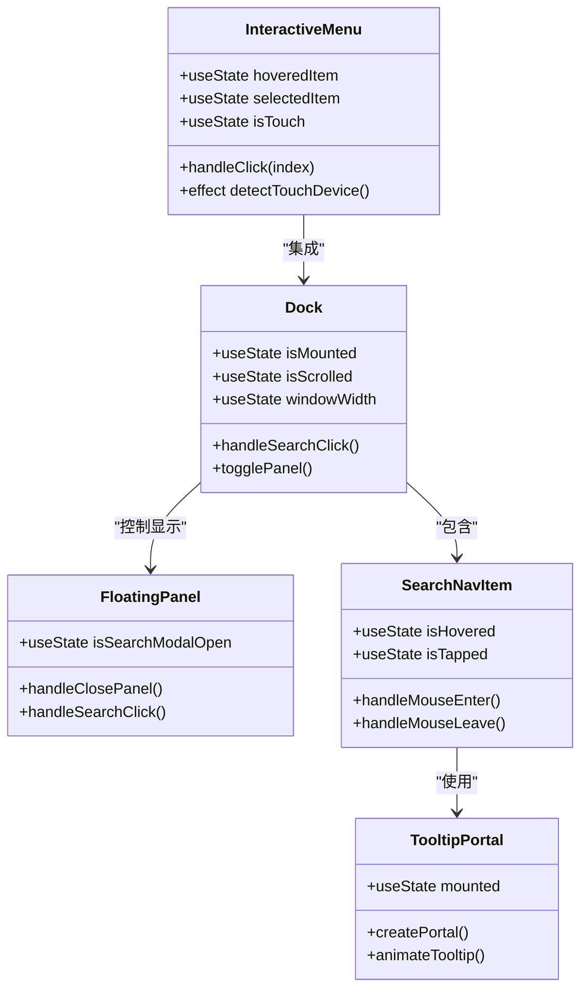

**图表来源**
- [InteractiveMenu.tsx:16-71](file://blog-system2/frontend/src/components/Home/InteractiveMenu.tsx#L16-L71)
- [naver.tsx:38-536](file://blog-system2/frontend/src/components/Home/naver.tsx#L38-L536)
- [FloatingPanel.tsx:25-437](file://blog-system2/frontend/src/components/Home/FloatingPanel.tsx#L25-L437)
- [SearchNavItem.tsx:17-215](file://blog-system2/frontend/src/components/Home/SearchNavItem.tsx#L17-L215)
- [TooltipPortal.tsx:13-56](file://blog-system2/frontend/src/components/Home/TooltipPortal.tsx#L13-L56)

**章节来源**
- [InteractiveMenu.tsx:16-71](file://blog-system2/frontend/src/components/Home/InteractiveMenu.tsx#L16-L71)
- [naver.tsx:38-536](file://blog-system2/frontend/src/components/Home/naver.tsx#L38-L536)

## 架构概览

### 整体架构设计

交互菜单系统采用分层架构设计，确保了组件间的松耦合和高内聚：

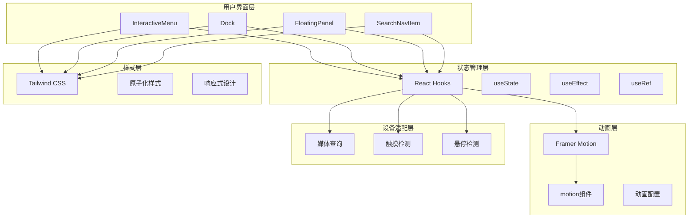

**图表来源**
- [InteractiveMenu.tsx:4-23](file://blog-system2/frontend/src/components/Home/InteractiveMenu.tsx#L4-L23)
- [naver.tsx:3-21](file://blog-system2/frontend/src/components/Home/naver.tsx#L3-L21)
- [globals.css:1-681](file://blog-system2/frontend/src/app/globals.css#L1-L681)

### 数据流架构

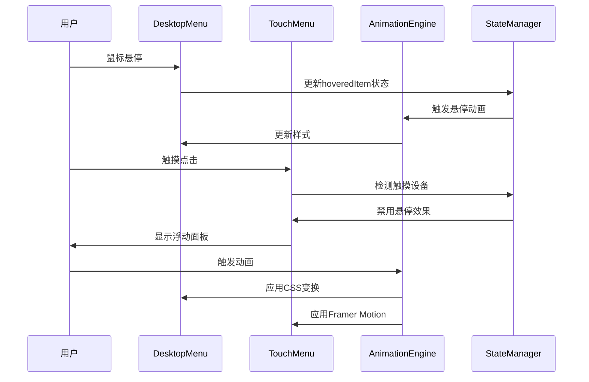

**图表来源**
- [InteractiveMenu.tsx:16-71](file://blog-system2/frontend/src/components/Home/InteractiveMenu.tsx#L16-L71)
- [naver.tsx:38-536](file://blog-system2/frontend/src/components/Home/naver.tsx#L38-L536)

## 详细组件分析

### InteractiveMenu 组件

InteractiveMenu 是桌面端的主要导航菜单组件，提供了丰富的交互效果和动画体验。

#### 核心状态管理

组件使用三个主要状态来管理菜单行为：

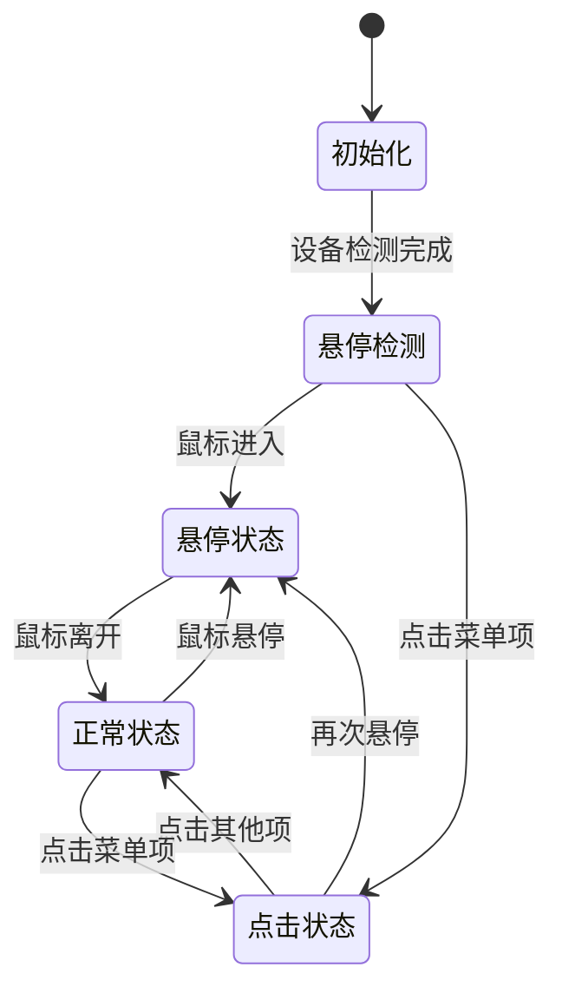

**图表来源**
- [InteractiveMenu.tsx:17-28](file://blog-system2/frontend/src/components/Home/InteractiveMenu.tsx#L17-L28)

#### 交互行为实现

组件实现了以下交互模式：

1. **悬停效果**：鼠标悬停时菜单项放大并改变透明度
2. **点击响应**：点击菜单项时显示选中标记
3. **模糊效果**：非活动菜单项显示模糊效果
4. **颜色变化**：选中状态显示特定颜色

#### 设备适配策略

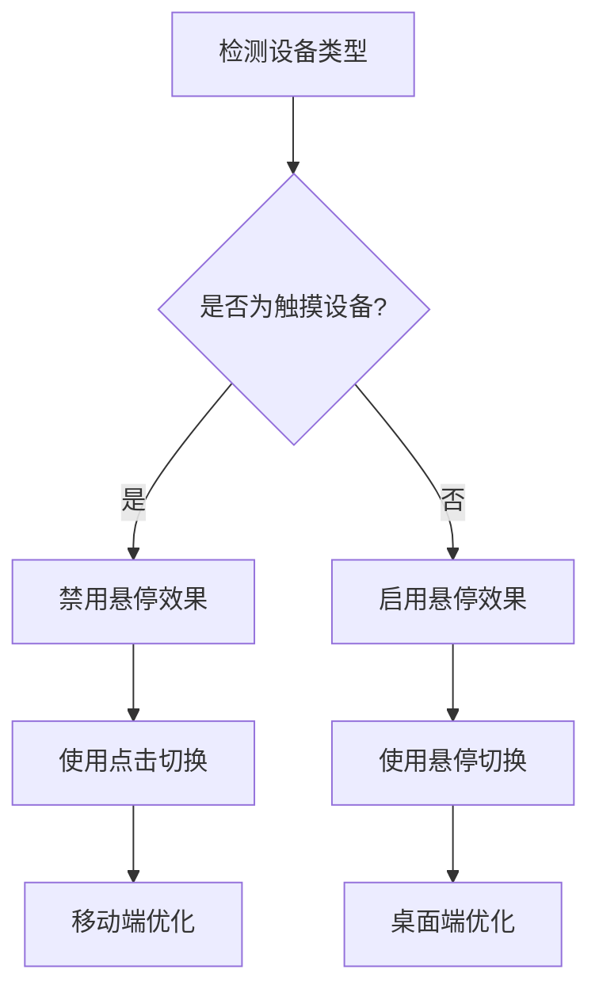

**图表来源**
- [InteractiveMenu.tsx:21-23](file://blog-system2/frontend/src/components/Home/InteractiveMenu.tsx#L21-L23)

**章节来源**
- [InteractiveMenu.tsx:16-71](file://blog-system2/frontend/src/components/Home/InteractiveMenu.tsx#L16-L71)

### Dock 组件

Dock 组件是整个导航系统的容器，负责协调各个子组件的工作。

#### 响应式布局实现

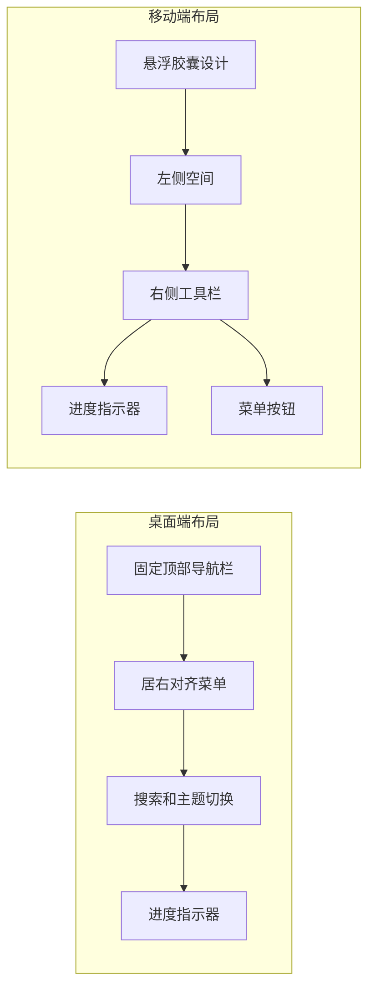

**图表来源**
- [naver.tsx:439-514](file://blog-system2/frontend/src/components/Home/naver.tsx#L439-L514)

#### 状态管理系统

Dock 组件管理着复杂的状态系统：

| 状态名称 | 类型 | 描述 | 触发条件 |
|---------|------|------|----------|
| isMounted | boolean | 组件挂载状态 | 客户端渲染完成 |
| isScrolled | boolean | 滚动状态 | 滚动超过阈值 |
| windowWidth | number | 窗口宽度 | 窗口尺寸变化 |
| isSearchModalOpen | boolean | 搜索模态框状态 | 搜索按钮点击 |
| isPanelOpen | boolean | 浮动面板状态 | 菜单按钮点击 |

**章节来源**
- [naver.tsx:38-121](file://blog-system2/frontend/src/components/Home/naver.tsx#L38-L121)

### FloatingPanel 组件

FloatingPanel 提供了移动端的完整导航解决方案。

#### 动画系统

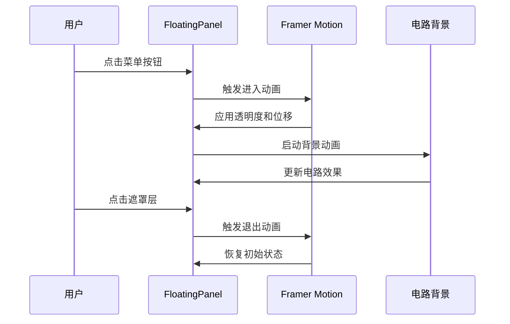

**图表来源**
- [FloatingPanel.tsx:129-136](file://blog-system2/frontend/src/components/Home/FloatingPanel.tsx#L129-L136)

#### 背景动画系统

FloatingPanel 使用复杂的 SVG 动画来创造科技感的视觉效果：

| 动画类型 | 元素 | 频率 | 颜色方案 |
|---------|------|------|----------|
| LED 闪烁 | 圆点 | 2s周期 | 多色渐变 |
| 数据流 | 路径 | 3-15s周期 | 透明度变化 |
| 电路脉冲 | 矩形 | 3s周期 | 脉冲效果 |
| 云彩漂浮 | 形状 | 5-7s周期 | 模糊效果 |

**章节来源**
- [FloatingPanel.tsx:139-319](file://blog-system2/frontend/src/components/Home/FloatingPanel.tsx#L139-L319)

### SearchNavItem 组件

SearchNavItem 提供了搜索功能的导航项，具有完整的交互反馈系统。

#### 交互反馈机制

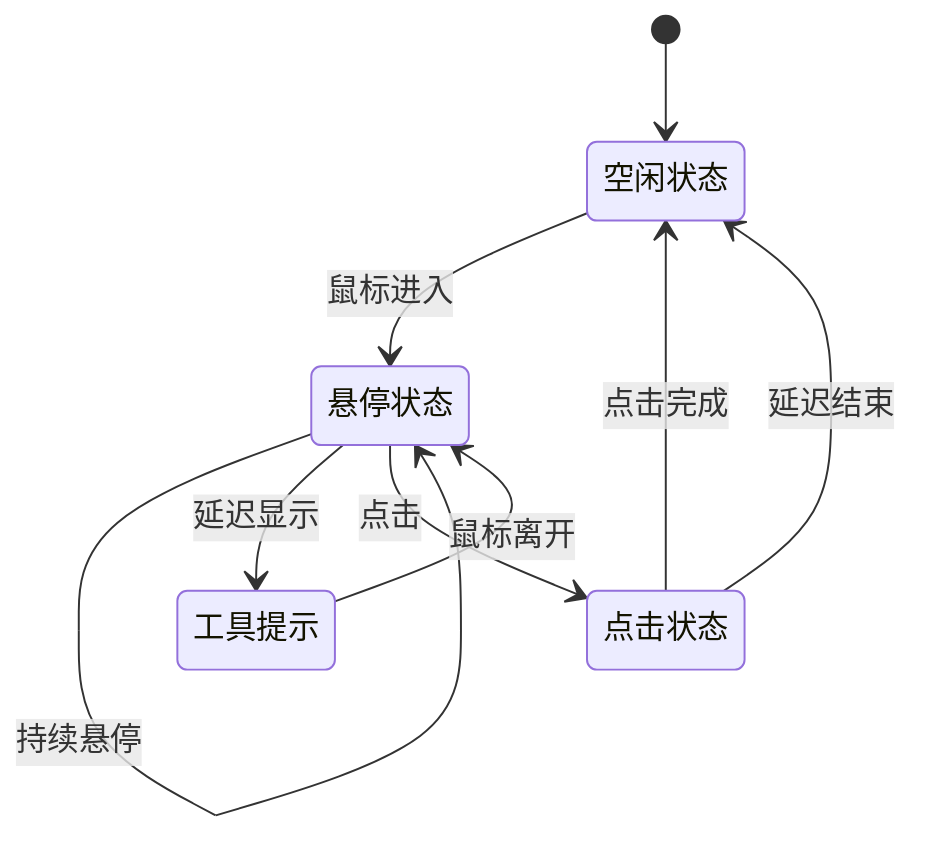

**图表来源**
- [SearchNavItem.tsx:42-71](file://blog-system2/frontend/src/components/Home/SearchNavItem.tsx#L42-L71)

#### 触摸优化

SearchNavItem 特别针对触摸设备进行了优化：

| 交互类型 | 桌面端 | 移动端 |
|---------|--------|--------|
| 悬停检测 | 使用 mouseenter | 使用 touchstart |
| 点击反馈 | 使用 click | 使用 touchstart/touchend |
| 工具提示 | 延迟显示 | 立即显示 |
| 动画效果 | 悬停动画 | 触摸反馈 |

**章节来源**
- [SearchNavItem.tsx:17-215](file://blog-system2/frontend/src/components/Home/SearchNavItem.tsx#L17-L215)

### TooltipPortal 组件

TooltipPortal 提供了工具提示的 DOM 传送门功能，确保工具提示能够正确显示在页面上。

#### DOM 传送门实现

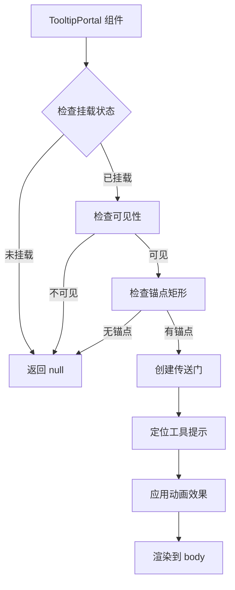

**图表来源**
- [TooltipPortal.tsx:27-55](file://blog-system2/frontend/src/components/Home/TooltipPortal.tsx#L27-L55)

**章节来源**
- [TooltipPortal.tsx:13-56](file://blog-system2/frontend/src/components/Home/TooltipPortal.tsx#L13-L56)

## 依赖关系分析

### 外部依赖

交互菜单组件依赖于多个现代 Web 技术栈：

```mermaid
graph TB
subgraph "核心框架"
A[Next.js 15.2.4]
B[React 19.1.0]
C[Framer Motion 12.23.9]
end
subgraph "样式系统"
D[Tailwind CSS 4.1.2]
E[tw-animate-css 1.2.5]
end
subgraph "图标系统"
F[react-icons 5.5.0]
G[@tabler/icons-react 3.34.0]
end
subgraph "工具库"
H[class-variance-authority 0.7.1]
I[lucide-react 0.487.0]
end
subgraph "分析服务"
J[@vercel/analytics 1.5.0]
K[@vercel/speed-insights 1.2.0]
end
A --> B
A --> C
A --> D
A --> E
A --> F
A --> G
A --> H
A --> I
A --> J
A --> K
```

**图表来源**
- [package.json:13-42](file://blog-system2/frontend/package.json#L13-L42)

### 内部依赖关系

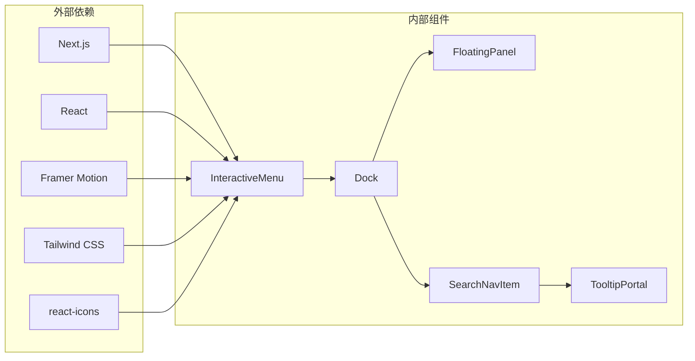

**图表来源**
- [InteractiveMenu.tsx:1-6](file://blog-system2/frontend/src/components/Home/InteractiveMenu.tsx#L1-L6)
- [naver.tsx:1-22](file://blog-system2/frontend/src/components/Home/naver.tsx#L1-L22)

**章节来源**
- [package.json:13-72](file://blog-system2/frontend/package.json#L13-L72)

## 性能考虑

### 动画性能优化

交互菜单系统采用了多种性能优化策略：

1. **硬件加速**：使用 CSS transform 和 opacity 属性进行动画，利用 GPU 加速
2. **节流控制**：使用 requestAnimationFrame 优化动画性能
3. **懒加载**：组件在客户端渲染时才初始化，减少首屏加载时间
4. **内存管理**：及时清理事件监听器和定时器

### 响应式性能

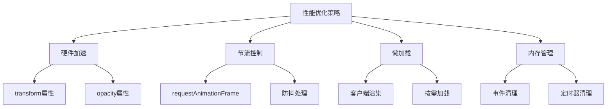

### 设备适配优化

系统针对不同设备类型进行了专门的性能优化：

| 设备类型 | 优化策略 | 性能影响 |
|---------|----------|----------|
| 桌面端 | 启用所有动画效果 | 较高 |
| 移动端 | 禁用悬停动画 | 中等 |
| 触摸设备 | 简化交互反馈 | 低 |
| 低性能设备 | 减少动画数量 | 最低 |

## 故障排除指南

### 常见问题及解决方案

#### 问题1：菜单项无法正常悬停

**症状**：鼠标悬停时菜单项没有反应

**原因分析**：
1. 触摸设备检测失败
2. CSS 样式冲突
3. JavaScript 错误

**解决方案**：
1. 检查设备检测逻辑
2. 验证 CSS 选择器
3. 查看浏览器控制台错误

#### 问题2：动画效果卡顿

**症状**：菜单动画出现卡顿或延迟

**原因分析**：
1. 动画性能不足
2. 页面重绘过多
3. 硬件加速未启用

**解决方案**：
1. 优化动画配置
2. 减少不必要的重绘
3. 确认 GPU 加速

#### 问题3：移动端触摸无响应

**症状**：触摸设备上菜单无响应

**原因分析**：
1. 触摸事件绑定错误
2. CSS pointer-events 设置
3. 触摸设备检测失败

**解决方案**：
1. 检查触摸事件处理器
2. 验证 CSS 指针事件
3. 重新检测设备类型

**章节来源**
- [InteractiveMenu.tsx:21-23](file://blog-system2/frontend/src/components/Home/InteractiveMenu.tsx#L21-L23)
- [SearchNavItem.tsx:133-138](file://blog-system2/frontend/src/components/Home/SearchNavItem.tsx#L133-L138)

### 调试工具和技巧

1. **浏览器开发者工具**：使用性能面板监控动画帧率
2. **React DevTools**：检查组件状态和 props
3. **网络面板**：监控资源加载情况
4. **控制台日志**：添加调试信息输出

## 结论

交互菜单组件展现了现代前端开发的最佳实践，通过精心设计的架构和实现，提供了优秀的用户体验。组件系统具有以下优势：

1. **模块化设计**：清晰的组件分离和职责划分
2. **响应式适配**：完善的多设备支持
3. **性能优化**：高效的动画和渲染机制
4. **可维护性**：良好的代码结构和文档

未来可以考虑的改进方向包括：
- 增加更多的键盘导航支持
- 扩展无障碍访问功能
- 优化移动端触摸体验
- 增强动画性能监控

这个组件系统为类似的应用程序提供了优秀的参考模板，展示了如何在现代 Web 开发中平衡功能、性能和用户体验。