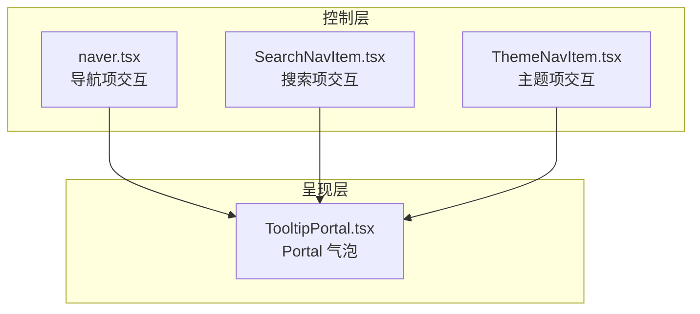
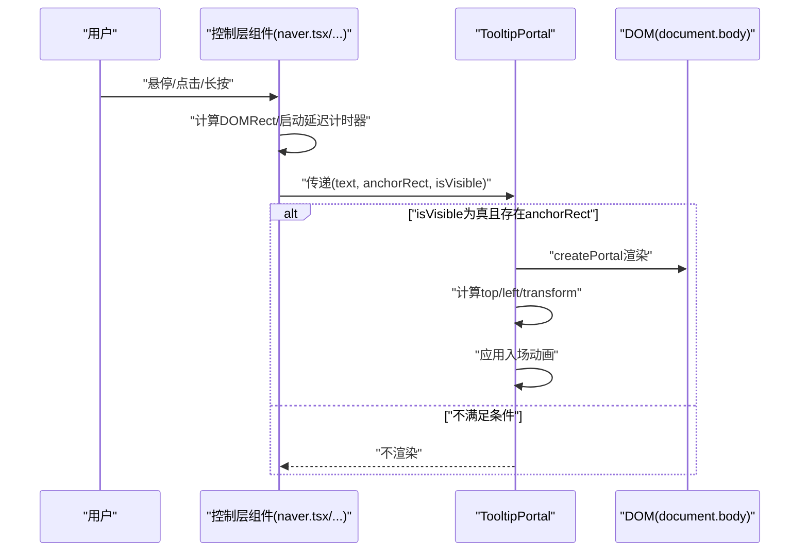
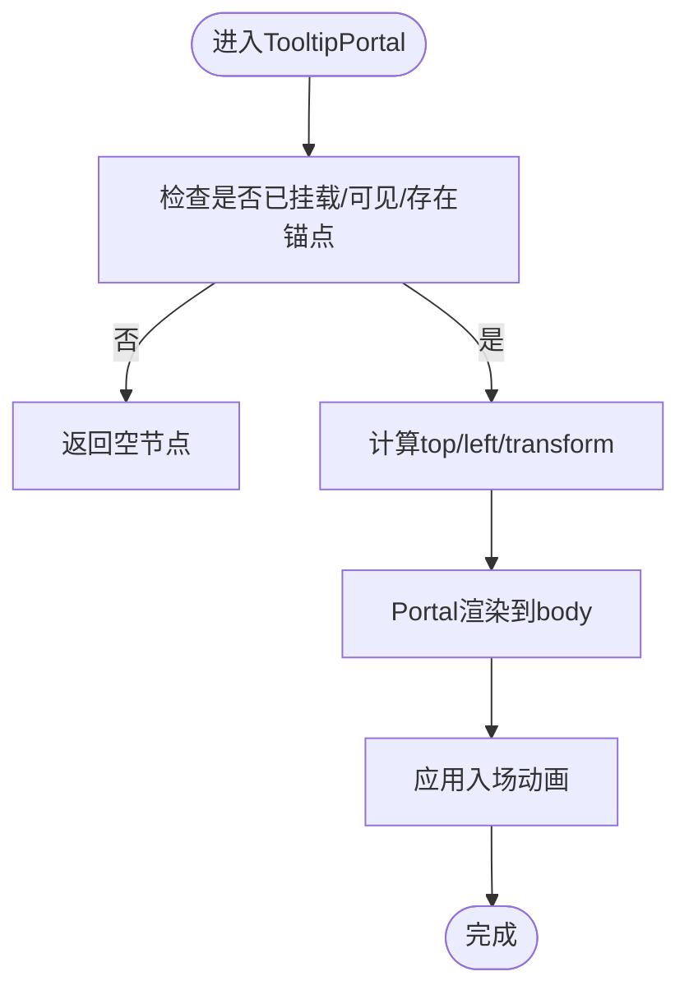
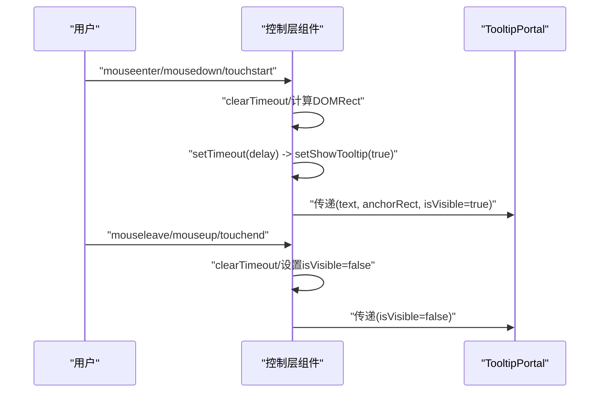
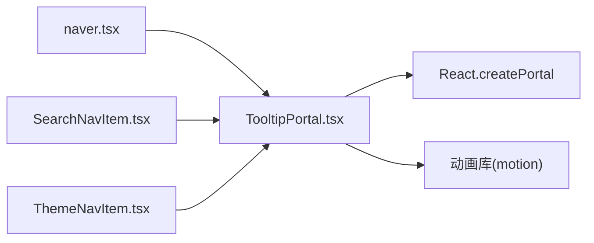

# 提示气泡

<cite>
**本文引用的文件**
- [TooltipPortal.tsx](file://blog-system2/frontend/src/components/Home/TooltipPortal.tsx)
- [naver.tsx](file://blog-system2/frontend/src/components/Home/naver.tsx)
- [SearchNavItem.tsx](file://blog-system2/frontend/src/components/Home/SearchNavItem.tsx)
- [ThemeNavItem.tsx](file://blog-system2/frontend/src/components/theme/ThemeNavItem.tsx)
- [page.tsx](file://blog-system2/frontend/src/app/page.tsx)
</cite>

## 目录
1. [简介](#简介)
2. [项目结构](#项目结构)
3. [核心组件](#核心组件)
4. [架构总览](#架构总览)
5. [详细组件分析](#详细组件分析)
6. [依赖关系分析](#依赖关系分析)
7. [性能考量](#性能考量)
8. [故障排查指南](#故障排查指南)
9. [结论](#结论)
10. [附录：API与使用示例](#附录api与使用示例)

## 简介
本技术文档围绕“提示气泡”组件展开，系统阐述其实现原理与工程实践，重点覆盖以下方面：
- Portal 渲染机制与 DOM 节点分离策略
- 事件冒泡与指针事件处理
- 定位策略（相对触发元素的位置计算、边界检测与自动调整方向）
- 显示/隐藏时机（延迟显示、悬停触发、点击触发等交互模式）
- 组件 API 文档（定位配置、触发方式、样式定制）
- 实际使用示例、可访问性支持与跨浏览器兼容性说明

## 项目结构
提示气泡在当前仓库中由两部分组成：
- 视觉呈现层：TooltipPortal.tsx，负责通过 Portal 将气泡渲染到 body 下，并使用动画库进行入场/出场过渡。
- 控制层：多个业务组件（如导航项、搜索项、主题切换项）负责管理显示状态、锚点矩形与事件监听。

图表来源
- [TooltipPortal.tsx:1-55](file://blog-system2/frontend/src/components/Home/TooltipPortal.tsx#L1-L55)
- [naver.tsx:546-643](file://blog-system2/frontend/src/components/Home/naver.tsx#L546-L643)
- [SearchNavItem.tsx:46-103](file://blog-system2/frontend/src/components/Home/SearchNavItem.tsx#L46-L103)
- [ThemeNavItem.tsx:175-282](file://blog-system2/frontend/src/components/theme/ThemeNavItem.tsx#L175-L282)

章节来源
- [TooltipPortal.tsx:1-55](file://blog-system2/frontend/src/components/Home/TooltipPortal.tsx#L1-L55)
- [naver.tsx:546-643](file://blog-system2/frontend/src/components/Home/naver.tsx#L546-L643)
- [SearchNavItem.tsx:46-103](file://blog-system2/frontend/src/components/Home/SearchNavItem.tsx#L46-L103)
- [ThemeNavItem.tsx:175-282](file://blog-system2/frontend/src/components/theme/ThemeNavItem.tsx#L175-L282)

## 核心组件
- TooltipPortal：接收文本、锚点矩形与可见性标志，通过 Portal 渲染至 body，计算绝对定位并应用动画过渡，同时禁用自身指针事件以避免遮挡触发元素的交互。
- 导航/搜索/主题项组件：负责管理 hover/click 状态、延迟计时器、滚动与窗口尺寸变化时的锚点更新，以及长按等交互。

章节来源
- [TooltipPortal.tsx:7-17](file://blog-system2/frontend/src/components/Home/TooltipPortal.tsx#L7-L17)
- [naver.tsx:546-643](file://blog-system2/frontend/src/components/Home/naver.tsx#L546-L643)
- [SearchNavItem.tsx:46-103](file://blog-system2/frontend/src/components/Home/SearchNavItem.tsx#L46-L103)
- [ThemeNavItem.tsx:175-282](file://blog-system2/frontend/src/components/theme/ThemeNavItem.tsx#L175-L282)

## 架构总览
提示气泡采用“控制层 + 呈现层”的分层设计：
- 控制层：各业务组件维护状态（是否悬停、是否显示、是否点击），计算并缓存 DOMRect 作为锚点，监听 scroll/resize 更新位置，使用 setTimeout 实现延迟显示。
- 呈现层：TooltipPortal 接收控制层传入的状态与锚点，使用 createPortal 渲染到 document.body，计算定位坐标并应用动画。

图表来源
- [TooltipPortal.tsx:13-55](file://blog-system2/frontend/src/components/Home/TooltipPortal.tsx#L13-L55)
- [naver.tsx:566-611](file://blog-system2/frontend/src/components/Home/naver.tsx#L566-L611)
- [SearchNavItem.tsx:46-88](file://blog-system2/frontend/src/components/Home/SearchNavItem.tsx#L46-L88)
- [ThemeNavItem.tsx:175-243](file://blog-system2/frontend/src/components/theme/ThemeNavItem.tsx#L175-L243)

## 详细组件分析

### TooltipPortal 组件
- 职责：基于传入的锚点矩形与可见性标志，计算绝对定位并渲染气泡；禁用自身指针事件，避免影响触发元素交互。
- 关键点：
  - 使用 Portal 将节点挂载到 document.body，确保层级与定位独立于父容器。
  - 通过 DOMRect.bottom + 滚动偏移 + 固定间距确定垂直位置，水平位置为锚点中心，再通过 transform: translateX(-50%) 居中。
  - 使用动画库进行入场/出场过渡，提升交互体验。
  - 禁用自身指针事件，保证触发元素仍可响应用户操作。

图表来源
- [TooltipPortal.tsx:18-55](file://blog-system2/frontend/src/components/Home/TooltipPortal.tsx#L18-L55)

章节来源
- [TooltipPortal.tsx:13-55](file://blog-system2/frontend/src/components/Home/TooltipPortal.tsx#L13-L55)

### 控制层组件（导航/搜索/主题项）
- 职责：管理交互状态、计算锚点、处理延迟显示与滚动/窗口尺寸变化。
- 共同模式：
  - 悬浮进入时获取 DOMRect 并启动延迟计时器，离开时清除计时器并隐藏气泡。
  - 监听 scroll 与 resize 事件，在气泡显示期间持续更新锚点矩形。
  - 部分组件支持长按触发（如主题项），并在清理阶段统一清理计时器。
- 差异点：
  - 导航项支持不同窗口宽度下的动画参数差异。
  - 主题项支持长按切换模式，长按计时器与延迟显示计时器分别管理。

图表来源
- [naver.tsx:566-611](file://blog-system2/frontend/src/components/Home/naver.tsx#L566-L611)
- [SearchNavItem.tsx:46-88](file://blog-system2/frontend/src/components/Home/SearchNavItem.tsx#L46-L88)
- [ThemeNavItem.tsx:175-243](file://blog-system2/frontend/src/components/theme/ThemeNavItem.tsx#L175-L243)

章节来源
- [naver.tsx:546-643](file://blog-system2/frontend/src/components/Home/naver.tsx#L546-L643)
- [SearchNavItem.tsx:46-103](file://blog-system2/frontend/src/components/Home/SearchNavItem.tsx#L46-L103)
- [ThemeNavItem.tsx:175-282](file://blog-system2/frontend/src/components/theme/ThemeNavItem.tsx#L175-L282)

### 辅助样式与原生提示（对比参考）
- 页面中存在基于伪元素的纯 CSS 提示样式，可用于对比理解不同实现方式的差异与适用场景。

章节来源
- [page.tsx:184-207](file://blog-system2/frontend/src/app/page.tsx#L184-L207)

## 依赖关系分析
- 控制层组件依赖 TooltipPortal 进行渲染与定位。
- TooltipPortal 依赖 React 的 Portal 与动画库进行渲染与过渡。
- 控制层组件依赖浏览器 DOM API（getBoundingClientRect、window.scrollX/Y、scroll/resize 事件）进行定位与更新。

图表来源
- [TooltipPortal.tsx:3-5](file://blog-system2/frontend/src/components/Home/TooltipPortal.tsx#L3-L5)
- [naver.tsx:546-643](file://blog-system2/frontend/src/components/Home/naver.tsx#L546-L643)
- [SearchNavItem.tsx:46-103](file://blog-system2/frontend/src/components/Home/SearchNavItem.tsx#L46-L103)
- [ThemeNavItem.tsx:175-282](file://blog-system2/frontend/src/components/theme/ThemeNavItem.tsx#L175-L282)

章节来源
- [TooltipPortal.tsx:3-5](file://blog-system2/frontend/src/components/Home/TooltipPortal.tsx#L3-L5)
- [naver.tsx:546-643](file://blog-system2/frontend/src/components/Home/naver.tsx#L546-L643)
- [SearchNavItem.tsx:46-103](file://blog-system2/frontend/src/components/Home/SearchNavItem.tsx#L46-L103)
- [ThemeNavItem.tsx:175-282](file://blog-system2/frontend/src/components/theme/ThemeNavItem.tsx#L175-L282)

## 性能考量
- 计时器管理：进入时启动延迟计时器，离开时及时清除，避免内存泄漏与不必要的渲染。
- 事件监听：仅在气泡显示期间监听 scroll/resize，减少不必要回调。
- Portal 渲染：将气泡挂载到 body，避免复杂层级导致的重绘/回流放大。
- 动画过渡：使用轻量级入场/出场动画，保持交互流畅。
- 锚点缓存：复用 DOMRect，避免频繁计算带来的性能开销。

章节来源
- [naver.tsx:566-611](file://blog-system2/frontend/src/components/Home/naver.tsx#L566-L611)
- [SearchNavItem.tsx:46-88](file://blog-system2/frontend/src/components/Home/SearchNavItem.tsx#L46-L88)
- [ThemeNavItem.tsx:175-243](file://blog-system2/frontend/src/components/theme/ThemeNavItem.tsx#L175-L243)
- [TooltipPortal.tsx:18-55](file://blog-system2/frontend/src/components/Home/TooltipPortal.tsx#L18-L55)

## 故障排查指南
- 气泡不显示
  - 检查 isVisible 是否为 true，锚点 anchorRect 是否存在。
  - 确认控制层组件是否正确传递 props。
- 位置异常
  - 确认 DOMRect 来源是否来自当前可见元素。
  - 检查滚动偏移与 transform 是否叠加正确。
- 交互被遮挡
  - 确认 TooltipPortal 已禁用自身指针事件。
- 滞留或闪烁
  - 检查离开时是否正确清除计时器与状态。
- 长按未生效
  - 确认长按计时器与延迟显示计时器未互相覆盖。

章节来源
- [TooltipPortal.tsx:27-55](file://blog-system2/frontend/src/components/Home/TooltipPortal.tsx#L27-L55)
- [naver.tsx:585-611](file://blog-system2/frontend/src/components/Home/naver.tsx#L585-L611)
- [SearchNavItem.tsx:62-88](file://blog-system2/frontend/src/components/Home/SearchNavItem.tsx#L62-L88)
- [ThemeNavItem.tsx:181-243](file://blog-system2/frontend/src/components/theme/ThemeNavItem.tsx#L181-L243)

## 结论
该提示气泡方案通过“控制层 + 呈现层”的清晰分工，结合 Portal 渲染与动画过渡，实现了稳定、可维护且高性能的交互体验。控制层负责状态与定位，呈现层专注视觉与交互，二者解耦良好，便于扩展与定制。

## 附录：API与使用示例

### 组件 API 文档
- TooltipPortal
  - 参数
    - text: 字符串，气泡显示的文本内容
    - anchorRect: DOMRect 或 null，触发元素的边界矩形
    - isVisible: 布尔值，是否显示气泡
  - 行为
    - 当 mounted 为真、isVisible 为真且 anchorRect 存在时，通过 Portal 渲染到 body
    - 计算绝对定位并应用入场动画，禁用自身指针事件
  - 参考路径
    - [TooltipPortal.tsx:7-17](file://blog-system2/frontend/src/components/Home/TooltipPortal.tsx#L7-L17)
    - [TooltipPortal.tsx:27-55](file://blog-system2/frontend/src/components/Home/TooltipPortal.tsx#L27-L55)

- 控制层组件（以导航项为例）
  - 关键状态
    - isHovered: 是否悬停
    - showTooltip: 是否显示气泡
    - anchorRect: DOMRect 或 null
  - 关键逻辑
    - 悬浮进入时获取 DOMRect 并启动延迟计时器
    - 离开时清除计时器并隐藏气泡
    - 监听 scroll/resize 在显示期间更新锚点
  - 参考路径
    - [naver.tsx:546-643](file://blog-system2/frontend/src/components/Home/naver.tsx#L546-L643)
    - [SearchNavItem.tsx:46-103](file://blog-system2/frontend/src/components/Home/SearchNavItem.tsx#L46-L103)
    - [ThemeNavItem.tsx:175-282](file://blog-system2/frontend/src/components/theme/ThemeNavItem.tsx#L175-L282)

### 定位策略
- 相对触发元素的定位
  - 垂直方向：锚点底部 + 窗口滚动 Y 偏移 + 固定间距
  - 水平方向：锚点左侧 + 宽度一半 + 窗口滚动 X 偏移
  - 居中：通过 transform: translateX(-50%) 实现
- 边界检测与自动调整
  - 当前实现未包含边界检测与方向翻转逻辑；若需适配窄屏或靠近边缘的场景，可在 anchorRect 计算后增加边界判断并动态调整 top/left 或翻转箭头方向

章节来源
- [TooltipPortal.tsx:30-50](file://blog-system2/frontend/src/components/Home/TooltipPortal.tsx#L30-L50)
- [naver.tsx:569-601](file://blog-system2/frontend/src/components/Home/naver.tsx#L569-L601)
- [SearchNavItem.tsx:47-78](file://blog-system2/frontend/src/components/Home/SearchNavItem.tsx#L47-L78)
- [ThemeNavItem.tsx:230-233](file://blog-system2/frontend/src/components/theme/ThemeNavItem.tsx#L230-L233)

### 显示/隐藏时机
- 延迟显示：进入时启动定时器，延时结束后显示
- 悬停触发：mouseenter 显示，mouseleave 隐藏
- 点击触发：可通过点击事件切换 showTooltip 状态
- 长按触发：在特定组件中支持长按计时器，达到阈值后执行切换动作

章节来源
- [naver.tsx:566-583](file://blog-system2/frontend/src/components/Home/naver.tsx#L566-L583)
- [SearchNavItem.tsx:46-71](file://blog-system2/frontend/src/components/Home/SearchNavItem.tsx#L46-L71)
- [ThemeNavItem.tsx:175-211](file://blog-system2/frontend/src/components/theme/ThemeNavItem.tsx#L175-L211)

### 样式定制
- 背景色与边框：通过类名控制浅色/深色主题
- 文字与内边距：控制字号、内边距与换行策略
- 箭头三角形：通过旋转与边框绘制，位于气泡顶部中央
- 可扩展建议：引入 CSS 变量或主题变量以统一风格

章节来源
- [TooltipPortal.tsx:47-50](file://blog-system2/frontend/src/components/Home/TooltipPortal.tsx#L47-L50)

### 实际使用示例
- 导航项提示
  - 在导航项组件中，进入时计算 DOMRect，启动延迟计时器，显示时将 text、anchorRect、isVisible 传给 TooltipPortal
  - 参考路径
    - [naver.tsx:566-611](file://blog-system2/frontend/src/components/Home/naver.tsx#L566-L611)
    - [TooltipPortal.tsx:13-55](file://blog-system2/frontend/src/components/Home/TooltipPortal.tsx#L13-L55)
- 搜索项提示
  - 同导航项模式，区别在于状态与动画参数
  - 参考路径
    - [SearchNavItem.tsx:46-103](file://blog-system2/frontend/src/components/Home/SearchNavItem.tsx#L46-L103)
- 主题项提示
  - 支持长按切换模式，长按计时器与延迟显示计时器分别管理
  - 参考路径
    - [ThemeNavItem.tsx:175-282](file://blog-system2/frontend/src/components/theme/ThemeNavItem.tsx#L175-L282)

### 可访问性支持
- 建议为触发元素添加 aria-describedby 指向气泡内容，或使用 role="tooltip" 与 aria-live 区分动态内容
- 对键盘用户，提供焦点状态与可预期的显示/隐藏行为
- 对触屏用户，提供长按与点击两种触发方式，避免误触

### 跨浏览器兼容性
- Portal 与 createPortal 在现代浏览器中广泛支持
- DOMRect、getBoundingClientRect、scrollX/Y 等 API 在主流浏览器中可用
- 动画库依赖现代浏览器的 CSS 动画能力，旧版浏览器需考虑降级方案