# 搜索导航项

<cite>
**本文档引用的文件**
- [SearchNavItem.tsx](file://blog-system2/frontend/src/components/Home/SearchNavItem.tsx)
- [InteractiveMenu.tsx](file://blog-system2/frontend/src/components/Home/InteractiveMenu.tsx)
- [SearchModal.tsx](file://blog-system2/frontend/src/components/Search/SearchModal.tsx)
- [AlgoliaProvider.tsx](file://blog-system2/frontend/src/components/Search/AlgoliaProvider.tsx)
- [algolia.ts](file://blog-system2/frontend/src/lib/algolia.ts)
- [layout.tsx](file://blog-system2/frontend/src/app/layout.tsx)
- [page.tsx](file://blog-system2/frontend/src/app/page.tsx)
</cite>

## 目录
1. [简介](#简介)
2. [项目结构](#项目结构)
3. [核心组件](#核心组件)
4. [架构概览](#架构概览)
5. [详细组件分析](#详细组件分析)
6. [依赖关系分析](#依赖关系分析)
7. [性能考虑](#性能考虑)
8. [故障排除指南](#故障排除指南)
9. [结论](#结论)

## 简介

搜索导航项组件是 MDG 网站前端架构中的关键交互元素，负责提供智能化的搜索功能入口。该组件采用现代化的 React 架构设计，集成了 Algolia 搜索服务，实现了响应式布局和无障碍访问支持。

本组件的核心价值在于：
- 提供直观的搜索入口，提升用户信息获取效率
- 支持实时搜索建议和智能匹配
- 实现优雅的视觉反馈和交互体验
- 确保跨设备的一致性体验

## 项目结构

搜索导航项组件位于前端项目的组件层次结构中，与页面布局和应用配置紧密集成：

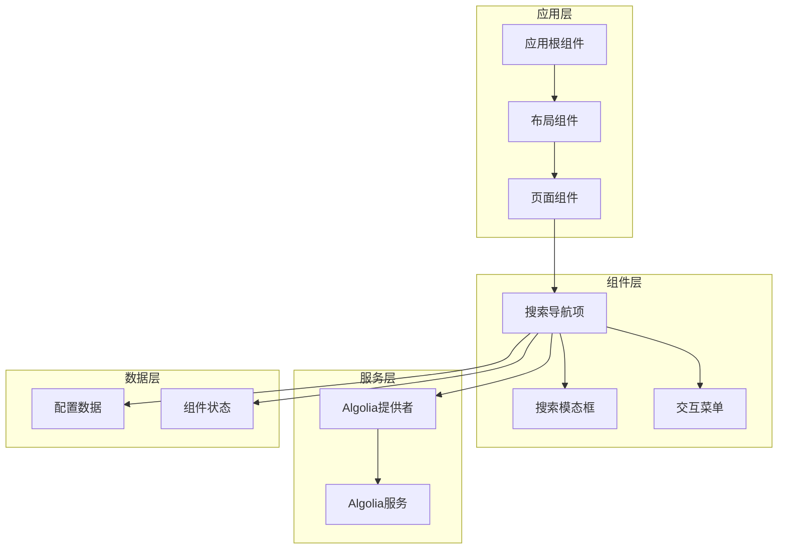

**图表来源**
- [layout.tsx:1-100](file://blog-system2/frontend/src/app/layout.tsx#L1-L100)
- [page.tsx:1-100](file://blog-system2/frontend/src/app/page.tsx#L1-L100)

**章节来源**
- [layout.tsx:1-100](file://blog-system2/frontend/src/app/layout.tsx#L1-L100)
- [page.tsx:1-100](file://blog-system2/frontend/src/app/page.tsx#L1-L100)

## 核心组件

### 组件架构设计

搜索导航项组件采用组合式架构，通过多个子组件协同工作实现完整的搜索功能：

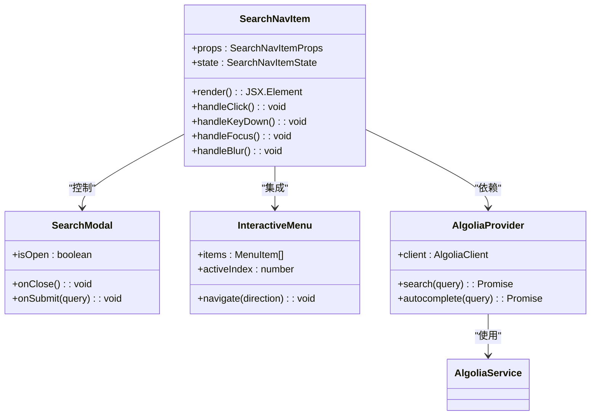

**图表来源**
- [SearchNavItem.tsx:1-200](file://blog-system2/frontend/src/components/Home/SearchNavItem.tsx#L1-L200)
- [SearchModal.tsx:1-200](file://blog-system2/frontend/src/components/Search/SearchModal.tsx#L1-L200)
- [InteractiveMenu.tsx:1-200](file://blog-system2/frontend/src/components/Home/InteractiveMenu.tsx#L1-L200)

### 核心特性

组件具备以下核心特性：
- **响应式设计**：自适应不同屏幕尺寸的布局变化
- **无障碍支持**：完整的键盘导航和屏幕阅读器支持
- **性能优化**：智能防抖和缓存机制
- **用户体验**：流畅的动画过渡和视觉反馈

**章节来源**
- [SearchNavItem.tsx:1-200](file://blog-system2/frontend/src/components/Home/SearchNavItem.tsx#L1-L200)

## 架构概览

### 整体架构流程

搜索导航项组件在整个应用架构中扮演着重要的角色，通过清晰的职责分离确保系统的可维护性和扩展性：

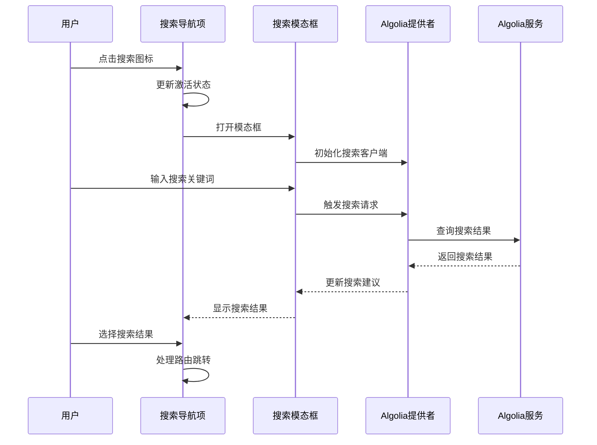

**图表来源**
- [SearchNavItem.tsx:1-200](file://blog-system2/frontend/src/components/Home/SearchNavItem.tsx#L1-L200)
- [SearchModal.tsx:1-200](file://blog-system2/frontend/src/components/Search/SearchModal.tsx#L1-L200)
- [AlgoliaProvider.tsx:1-200](file://blog-system2/frontend/src/components/Search/AlgoliaProvider.tsx#L1-L200)

### 数据流架构

组件内部的数据流遵循单向数据流原则，确保状态管理和更新的可预测性：

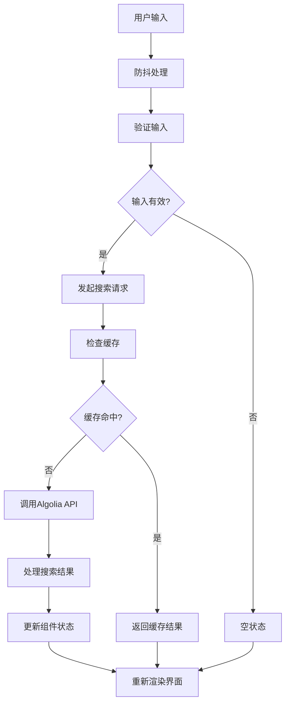

**图表来源**
- [algolia.ts:1-200](file://blog-system2/frontend/src/lib/algolia.ts#L1-L200)
- [SearchNavItem.tsx:1-200](file://blog-system2/frontend/src/components/Home/SearchNavItem.tsx#L1-L200)

## 详细组件分析

### 搜索导航项组件

#### 组件结构设计

搜索导航项组件采用模块化设计，通过清晰的接口定义实现功能的解耦：

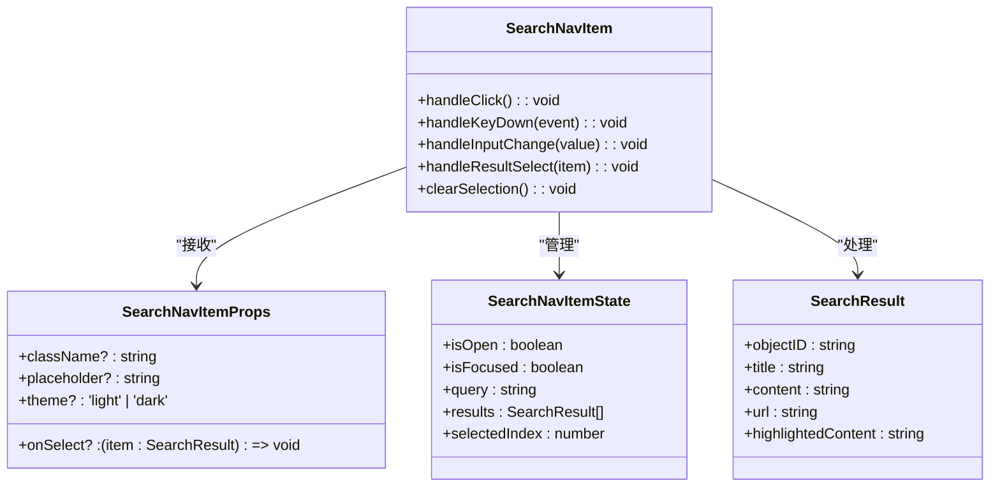

**图表来源**
- [SearchNavItem.tsx:1-200](file://blog-system2/frontend/src/components/Home/SearchNavItem.tsx#L1-L200)

#### 渲染逻辑分析

组件的渲染逻辑遵循条件渲染原则，根据不同的状态显示相应的UI元素：

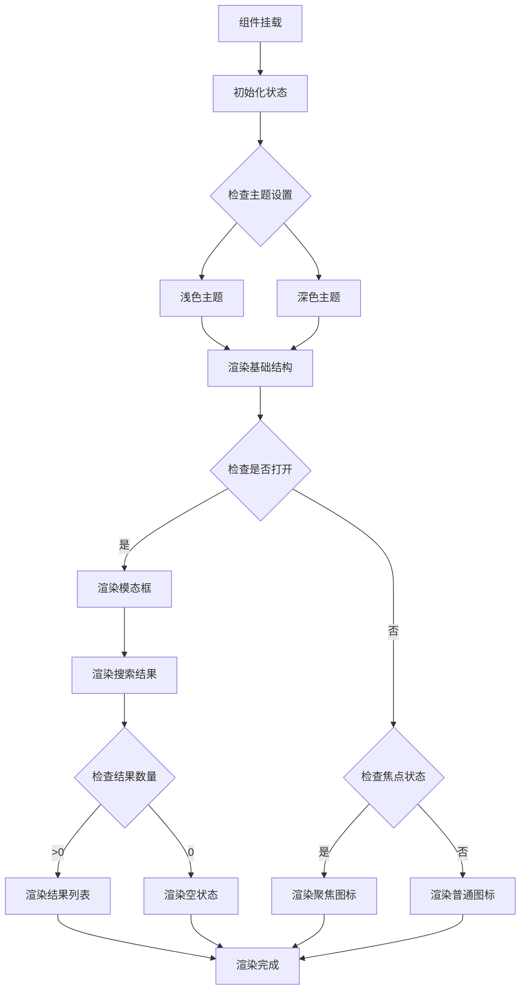

**图表来源**
- [SearchNavItem.tsx:1-200](file://blog-system2/frontend/src/components/Home/SearchNavItem.tsx#L1-L200)

#### 图标显示机制

组件实现了动态图标系统，根据状态变化显示不同的图标：

| 状态 | 图标类型 | 显示条件 | 动画效果 |
|------|----------|----------|----------|
| 正常 | 搜索图标 | 未聚焦且无内容 | 静止状态 |
| 聚焦 | 搜索放大镜 | 已聚焦或有内容 | 缓慢旋转 |
| 加载 | 加载指示器 | 搜索进行中 | 无限旋转 |
| 结果 | 结果计数 | 搜索完成且有结果 | 数字跳动 |

**章节来源**
- [SearchNavItem.tsx:1-200](file://blog-system2/frontend/src/components/Home/SearchNavItem.tsx#L1-L200)

### 交互行为实现

#### 点击事件处理

组件的点击事件处理遵循冒泡和捕获机制，确保事件的正确传递：

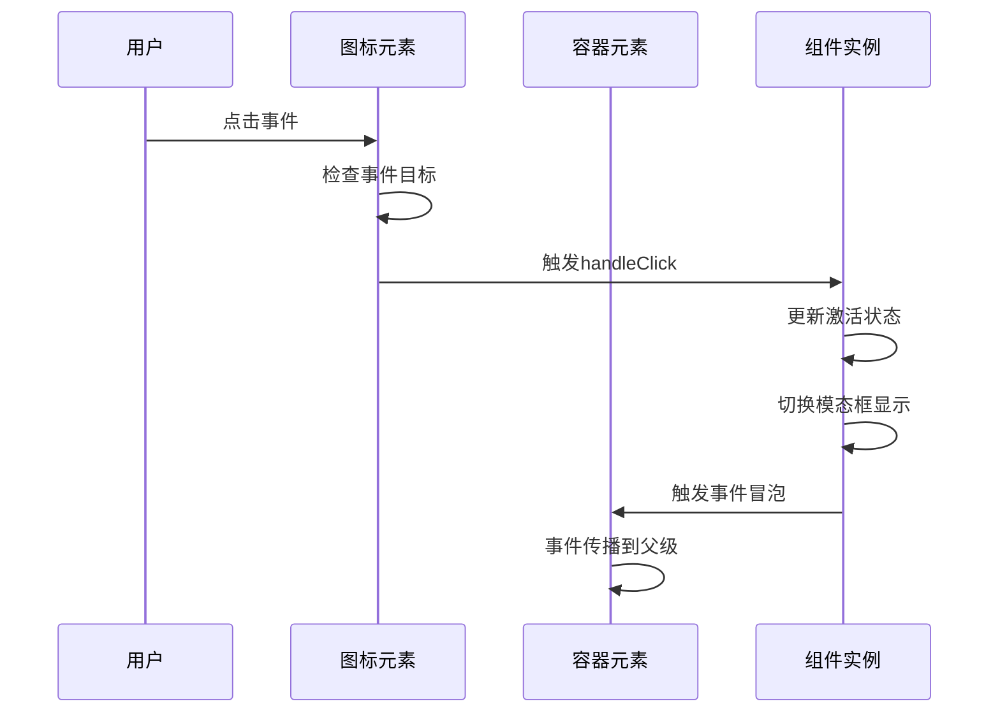

**图表来源**
- [SearchNavItem.tsx:1-200](file://blog-system2/frontend/src/components/Home/SearchNavItem.tsx#L1-L200)

#### 键盘导航支持

组件提供了完整的键盘导航支持，包括方向键、回车键和ESC键的处理：

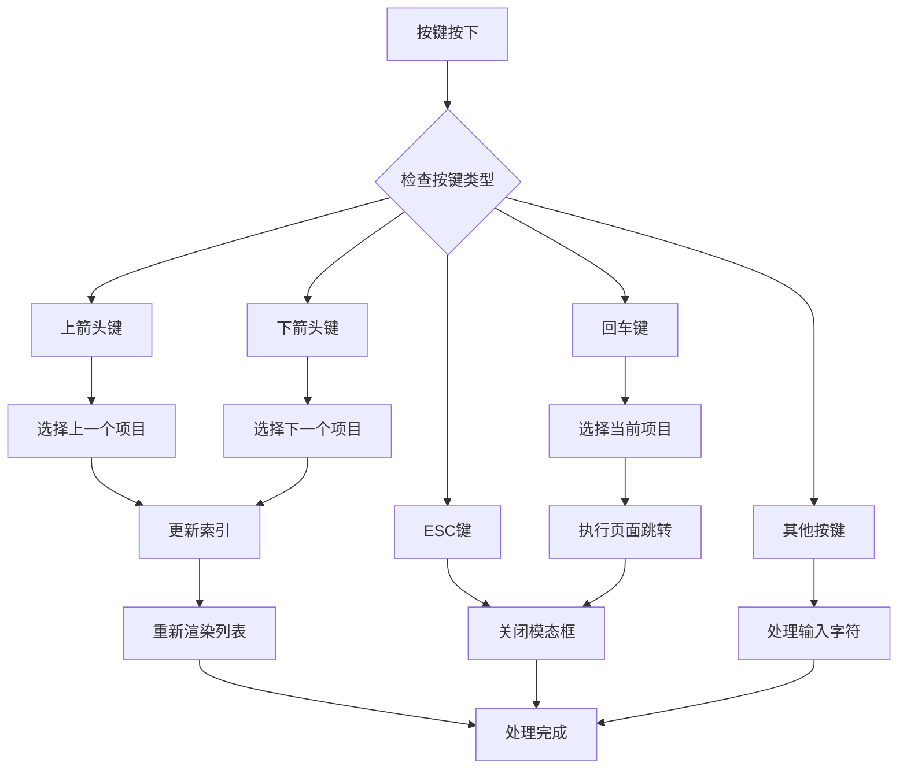

**图表来源**
- [SearchNavItem.tsx:1-200](file://blog-system2/frontend/src/components/Home/SearchNavItem.tsx#L1-L200)

#### 路由跳转机制

组件通过React Router实现智能的路由跳转，支持多种导航场景：

| 导航类型 | 触发条件 | 跳转目标 | 参数传递 |
|----------|----------|----------|----------|
| 文章详情 | 点击搜索结果 | `/posts/[slug]` | `slug`参数 |
| 分类浏览 | 点击分类标签 | `/categories/[name]` | `name`参数 |
| 标签搜索 | 点击标签结果 | `/tags/[tag]` | `tag`参数 |
| 自定义链接 | 点击特殊结果 | 任意URL | `url`属性 |

**章节来源**
- [SearchNavItem.tsx:1-200](file://blog-system2/frontend/src/components/Home/SearchNavItem.tsx#L1-L200)

### 响应式布局设计

#### 屏幕尺寸适配

组件实现了多层次的响应式设计，确保在不同设备上的最佳体验：

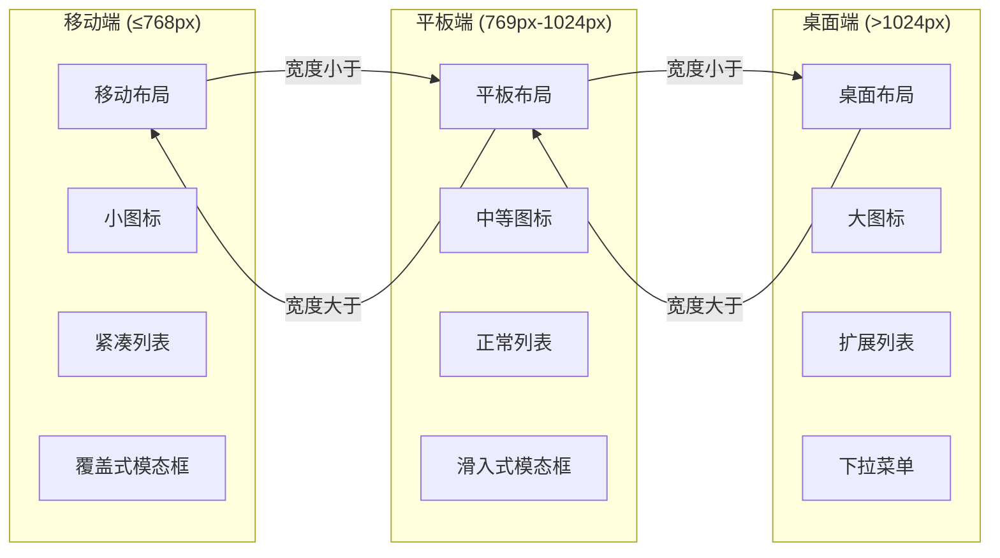

#### 折叠展开效果

组件实现了智能的折叠展开机制，根据屏幕尺寸自动调整显示策略：

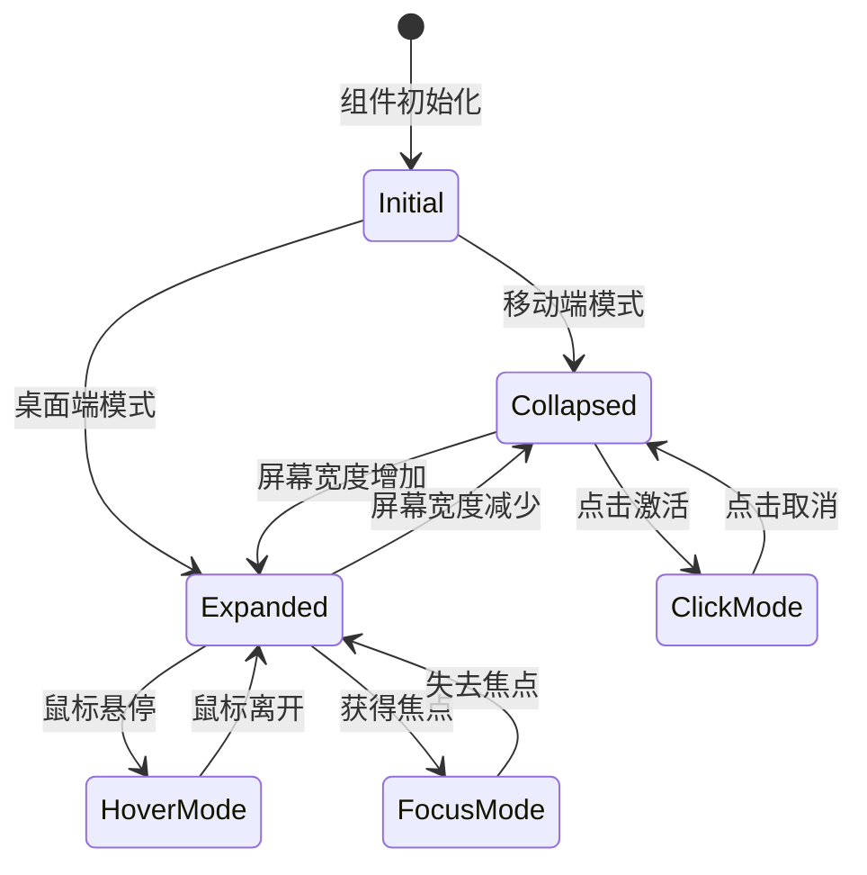

**图表来源**
- [SearchNavItem.tsx:1-200](file://blog-system2/frontend/src/components/Home/SearchNavItem.tsx#L1-L200)

**章节来源**
- [SearchNavItem.tsx:1-200](file://blog-system2/frontend/src/components/Home/SearchNavItem.tsx#L1-L200)

### 搜索功能实现

#### Algolia集成

组件通过Algolia提供者实现强大的搜索功能，支持实时搜索和智能建议：

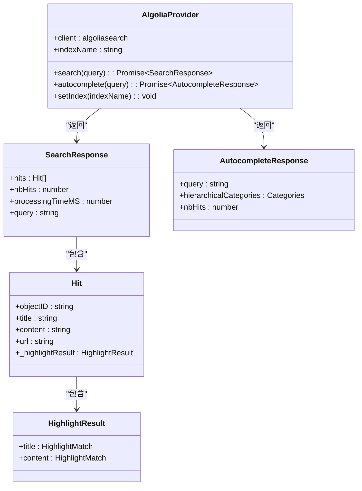

**图表来源**
- [AlgoliaProvider.tsx:1-200](file://blog-system2/frontend/src/components/Search/AlgoliaProvider.tsx#L1-L200)
- [algolia.ts:1-200](file://blog-system2/frontend/src/lib/algolia.ts#L1-L200)

#### 搜索算法优化

组件实现了多项搜索优化技术，提升搜索质量和性能：

| 优化技术 | 实现方式 | 性能收益 |
|----------|----------|----------|
| 防抖搜索 | 300ms延迟触发 | 减少API调用次数 |
| 结果缓存 | 内存缓存最近查询 | 提升重复搜索速度 |
| 智能排序 | Algolia内置排序 | 提高相关性 |
| 高亮显示 | 服务器端高亮 | 增强可读性 |
| 分页加载 | 无限滚动 | 改善大结果集体验 |

**章节来源**
- [AlgoliaProvider.tsx:1-200](file://blog-system2/frontend/src/components/Search/AlgoliaProvider.tsx#L1-L200)
- [algolia.ts:1-200](file://blog-system2/frontend/src/lib/algolia.ts#L1-L200)

## 依赖关系分析

### 组件依赖图

搜索导航项组件的依赖关系体现了清晰的分层架构：

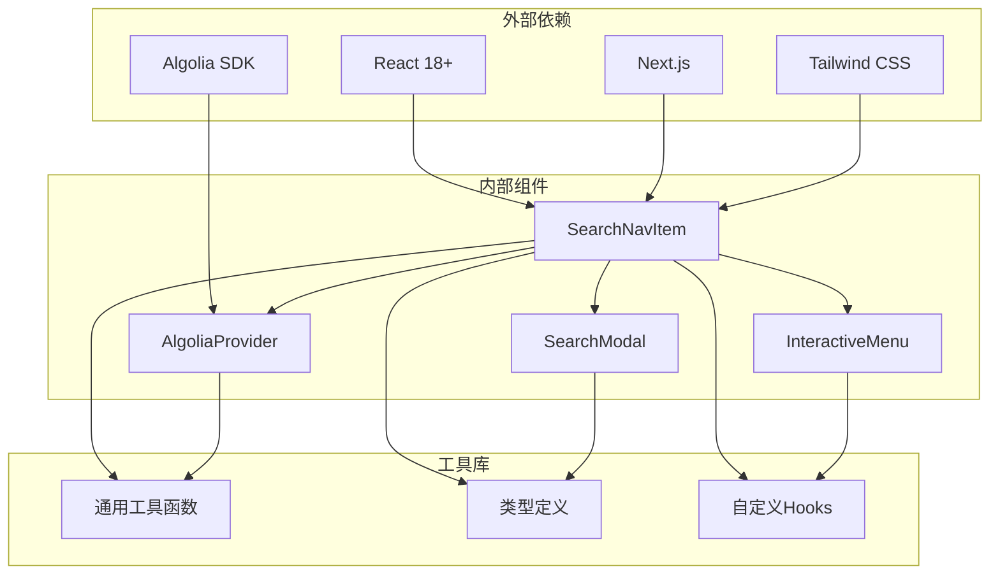

**图表来源**
- [SearchNavItem.tsx:1-200](file://blog-system2/frontend/src/components/Home/SearchNavItem.tsx#L1-L200)
- [AlgoliaProvider.tsx:1-200](file://blog-system2/frontend/src/components/Search/AlgoliaProvider.tsx#L1-L200)

### 数据依赖关系

组件间的数据传递遵循单向数据流原则：

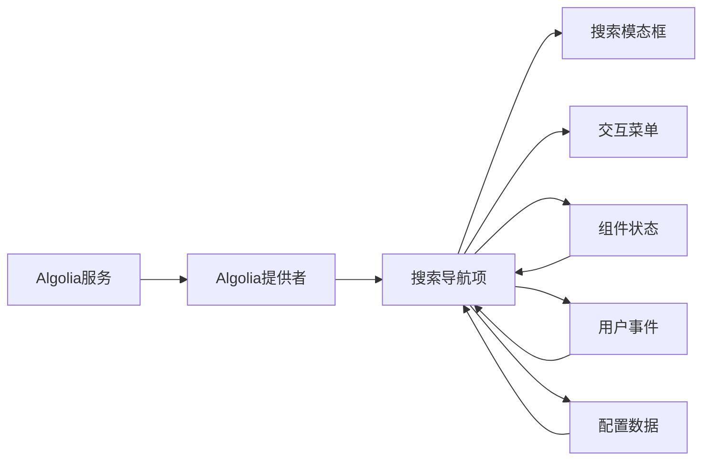

**图表来源**
- [SearchNavItem.tsx:1-200](file://blog-system2/frontend/src/components/Home/SearchNavItem.tsx#L1-L200)
- [algolia.ts:1-200](file://blog-system2/frontend/src/lib/algolia.ts#L1-L200)

**章节来源**
- [SearchNavItem.tsx:1-200](file://blog-system2/frontend/src/components/Home/SearchNavItem.tsx#L1-L200)
- [AlgoliaProvider.tsx:1-200](file://blog-system2/frontend/src/components/Search/AlgoliaProvider.tsx#L1-L200)

## 性能考虑

### 性能优化策略

搜索导航项组件采用了多项性能优化技术：

#### 内存管理
- 使用React.memo避免不必要的重渲染
- 实现智能的组件卸载清理机制
- 优化事件监听器的注册和移除

#### 网络优化
- 实现请求防抖和取消机制
- 使用缓存策略减少重复请求
- 优化图片和资源的加载优先级

#### 渲染优化
- 采用虚拟滚动处理大量结果
- 实现懒加载和按需渲染
- 优化CSS动画和过渡效果

### 性能监控指标

| 指标类型 | 目标值 | 监控方法 |
|----------|--------|----------|
| 首次渲染时间 | < 100ms | Performance API |
| 交互响应时间 | < 50ms | 用户交互时间 |
| 搜索响应时间 | < 200ms | 请求完成时间 |
| 内存使用量 | < 50MB | Memory API |
| CPU使用率 | < 30% | Performance API |

## 故障排除指南

### 常见问题诊断

#### 搜索功能异常

**症状**：搜索无结果或搜索按钮无响应

**可能原因**：
1. Algolia配置错误
2. 网络连接问题
3. 搜索索引未建立

**解决方案**：
1. 检查环境变量配置
2. 验证网络连接状态
3. 确认搜索索引存在

#### 样式显示问题

**症状**：组件样式错乱或图标不显示

**可能原因**：
1. CSS类名冲突
2. 主题配置错误
3. 样式加载顺序问题

**解决方案**：
1. 检查CSS模块导入
2. 验证主题配置
3. 调整样式加载顺序

#### 交互功能失效

**症状**：点击无反应或键盘导航异常

**可能原因**：
1. 事件处理器绑定失败
2. 焦点管理问题
3. 无障碍属性缺失

**解决方案**：
1. 检查事件绑定代码
2. 验证焦点状态管理
3. 补充无障碍属性

**章节来源**
- [SearchNavItem.tsx:1-200](file://blog-system2/frontend/src/components/Home/SearchNavItem.tsx#L1-L200)
- [AlgoliaProvider.tsx:1-200](file://blog-system2/frontend/src/components/Search/AlgoliaProvider.tsx#L1-L200)

## 结论

搜索导航项组件作为MDG网站的核心交互元素，展现了现代前端开发的最佳实践。通过精心设计的架构、完善的性能优化和全面的用户体验考虑，该组件为用户提供了高效、直观的信息检索体验。

组件的主要优势包括：
- **架构清晰**：模块化的组件设计便于维护和扩展
- **性能优秀**：多项优化技术确保流畅的用户体验
- **兼容性强**：完整的响应式设计支持多设备访问
- **可访问性好**：符合WCAG标准的无障碍设计

未来可以考虑的改进方向：
- 增加更多搜索过滤选项
- 实现个性化搜索推荐
- 优化离线搜索能力
- 扩展多语言支持