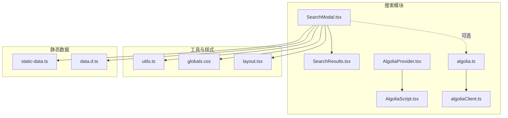
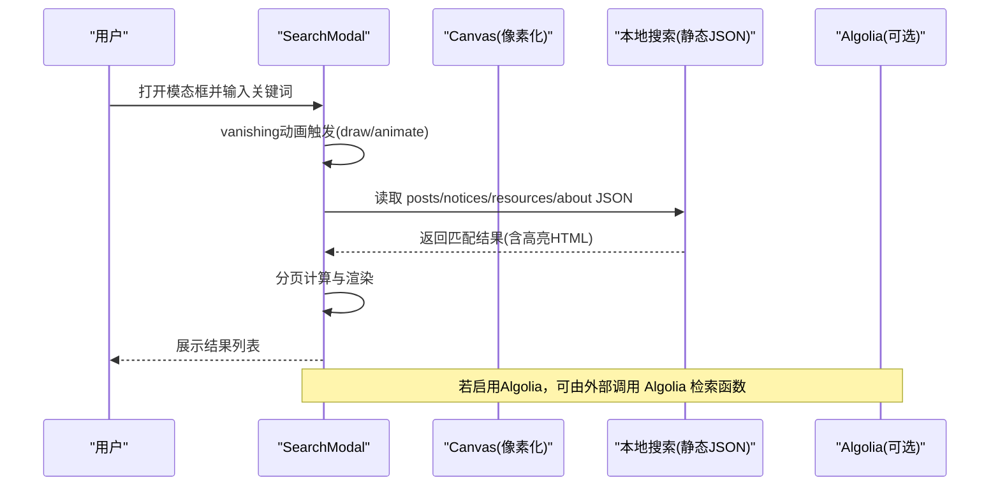
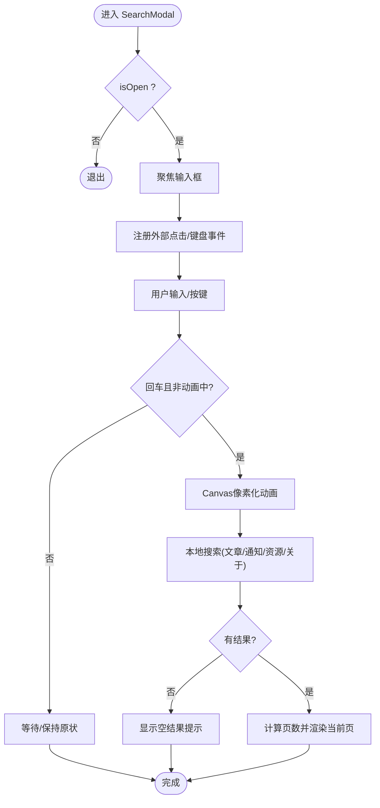
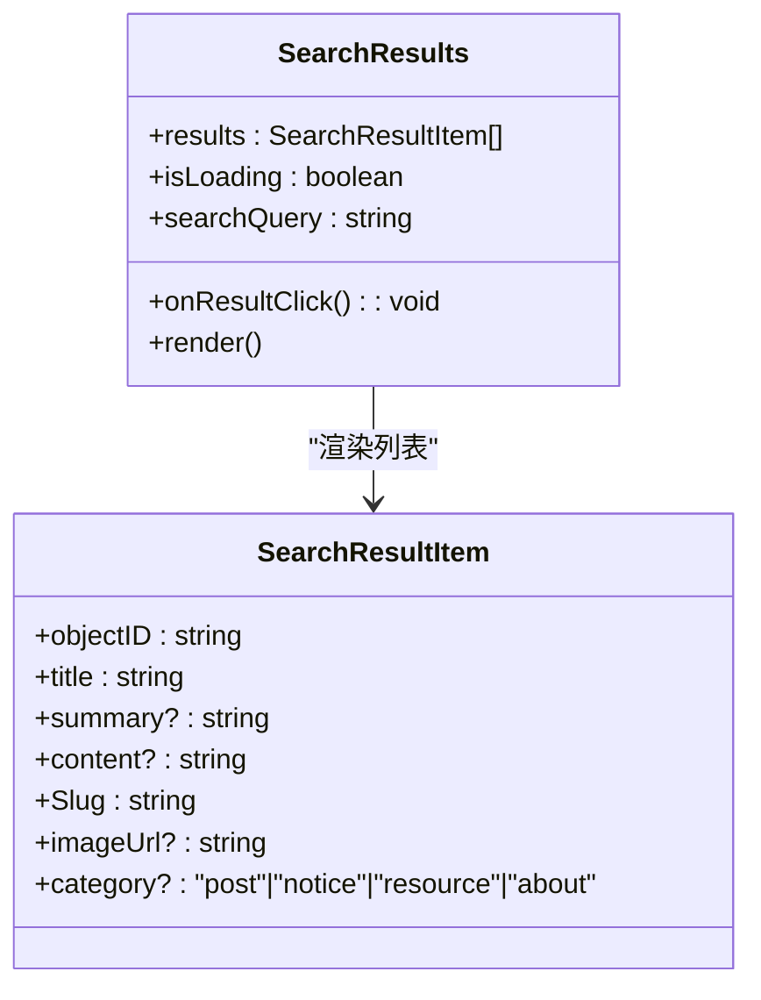
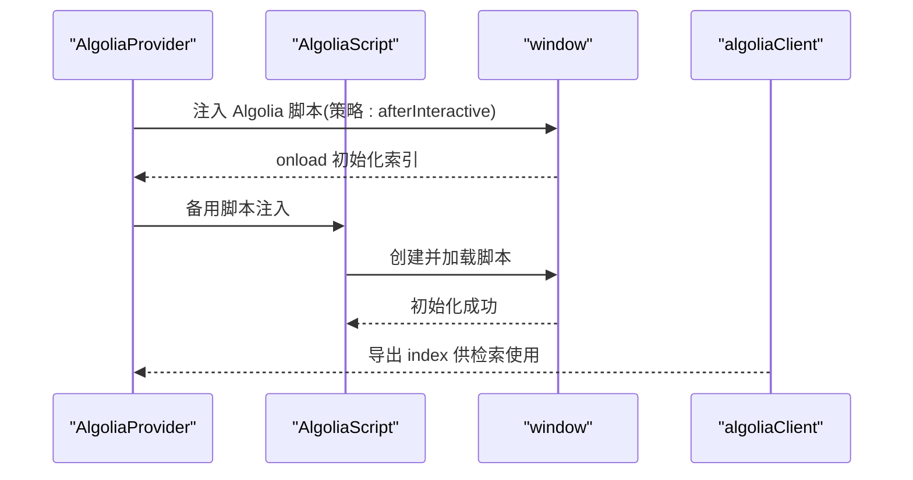
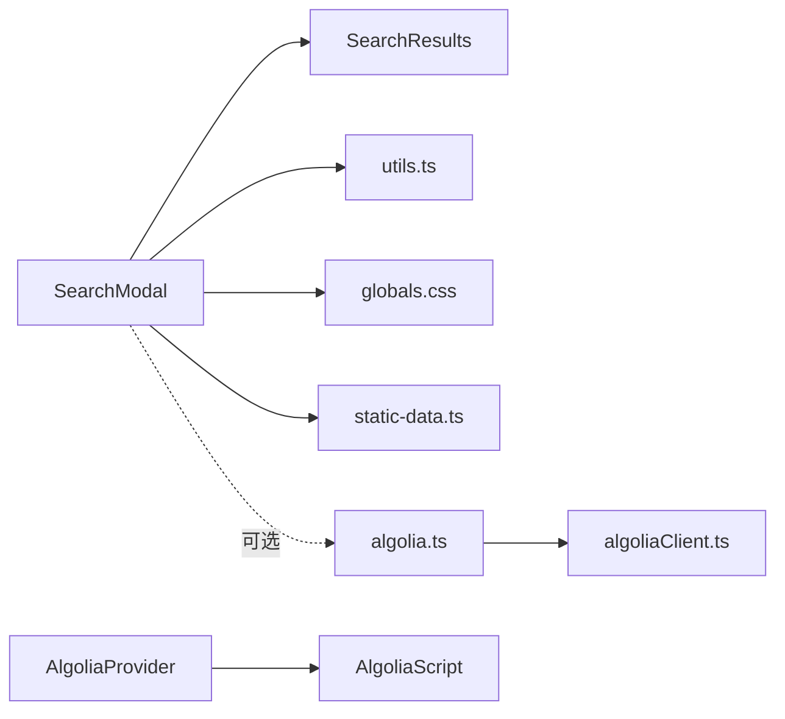

# 搜索模态框

<cite>
**本文引用的文件**
- [SearchModal.tsx](file://blog-system2/frontend/src/components/Search/SearchModal.tsx)
- [SearchResults.tsx](file://blog-system2/frontend/src/components/Search/SearchResults.tsx)
- [algolia.ts](file://blog-system2/frontend/src/lib/algolia.ts)
- [algoliaClient.ts](file://blog-system2/frontend/src/lib/algoliaClient.ts)
- [AlgoliaProvider.tsx](file://blog-system2/frontend/src/components/Search/AlgoliaProvider.tsx)
- [AlgoliaScript.tsx](file://blog-system2/frontend/src/components/Search/AlgoliaScript.tsx)
- [utils.ts](file://blog-system2/frontend/src/lib/utils.ts)
- [globals.css](file://blog-system2/frontend/src/app/globals.css)
- [layout.tsx](file://blog-system2/frontend/src/app/layout.tsx)
- [static-data.ts](file://blog-system2/frontend/src/lib/static-data.ts)
- [data.d.ts](file://blog-system2/frontend/src/types/data.d.ts)
</cite>

## 目录
1. [引言](#引言)
2. [项目结构](#项目结构)
3. [核心组件](#核心组件)
4. [架构总览](#架构总览)
5. [详细组件分析](#详细组件分析)
6. [依赖关系分析](#依赖关系分析)
7. [性能考量](#性能考量)
8. [故障排查指南](#故障排查指南)
9. [结论](#结论)
10. [附录](#附录)

## 引言
本文件为“搜索模态框”组件的完整技术文档，覆盖以下方面：
- 模态框的打开/关闭动画与交互行为（含 Esc 关闭、点击外部关闭）
- 搜索功能实现（本地搜索与 Algolia 搜索并存）
- 多数据源搜索（文章、通知、资源、关于页面）
- 搜索结果高亮与分页
- Canvas 动画效果（文字像素化与粒子消散）
- 组件 API（props、事件、状态）
- 实际使用示例、性能优化与可访问性建议

## 项目结构
该组件位于前端工程的搜索子目录下，配合工具函数与样式文件共同工作。

图表来源
- [SearchModal.tsx:1-935](file://blog-system2/frontend/src/components/Search/SearchModal.tsx#L1-L935)
- [SearchResults.tsx:1-96](file://blog-system2/frontend/src/components/Search/SearchResults.tsx#L1-L96)
- [AlgoliaProvider.tsx:1-100](file://blog-system2/frontend/src/components/Search/AlgoliaProvider.tsx#L1-L100)
- [AlgoliaScript.tsx:1-102](file://blog-system2/frontend/src/components/Search/AlgoliaScript.tsx#L1-L102)
- [algolia.ts:1-46](file://blog-system2/frontend/src/lib/algolia.ts#L1-L46)
- [algoliaClient.ts:1-33](file://blog-system2/frontend/src/lib/algoliaClient.ts#L1-L33)
- [utils.ts:1-7](file://blog-system2/frontend/src/lib/utils.ts#L1-L7)
- [globals.css:1-681](file://blog-system2/frontend/src/app/globals.css#L1-L681)
- [layout.tsx:1-48](file://blog-system2/frontend/src/app/layout.tsx#L1-L48)
- [static-data.ts:1-214](file://blog-system2/frontend/src/lib/static-data.ts#L1-L214)
- [data.d.ts:1-10](file://blog-system2/frontend/src/types/data.d.ts#L1-L10)

章节来源
- [SearchModal.tsx:1-935](file://blog-system2/frontend/src/components/Search/SearchModal.tsx#L1-L935)
- [SearchResults.tsx:1-96](file://blog-system2/frontend/src/components/Search/SearchResults.tsx#L1-L96)
- [AlgoliaProvider.tsx:1-100](file://blog-system2/frontend/src/components/Search/AlgoliaProvider.tsx#L1-L100)
- [AlgoliaScript.tsx:1-102](file://blog-system2/frontend/src/components/Search/AlgoliaScript.tsx#L1-L102)
- [algolia.ts:1-46](file://blog-system2/frontend/src/lib/algolia.ts#L1-L46)
- [algoliaClient.ts:1-33](file://blog-system2/frontend/src/lib/algoliaClient.ts#L1-L33)
- [utils.ts:1-7](file://blog-system2/frontend/src/lib/utils.ts#L1-L7)
- [globals.css:1-681](file://blog-system2/frontend/src/app/globals.css#L1-L681)
- [layout.tsx:1-48](file://blog-system2/frontend/src/app/layout.tsx#L1-L48)
- [static-data.ts:1-214](file://blog-system2/frontend/src/lib/static-data.ts#L1-L214)
- [data.d.ts:1-10](file://blog-system2/frontend/src/types/data.d.ts#L1-L10)

## 核心组件
- SearchModal：主模态框组件，负责动画、输入、搜索、分页、结果渲染与关闭逻辑
- SearchResults：结果列表展示组件，支持加载态、空结果与逐条动画
- AlgoliaProvider/AlgoliaScript：Algolia 客户端注入与初始化
- algolia.ts/algoliaClient.ts：Algolia 客户端封装与检索接口
- utils.ts：类名合并工具
- globals.css/layout.tsx：主题与全局动画、移动端适配

章节来源
- [SearchModal.tsx:10-13](file://blog-system2/frontend/src/components/Search/SearchModal.tsx#L10-L13)
- [SearchResults.tsx:7-22](file://blog-system2/frontend/src/components/Search/SearchResults.tsx#L7-L22)
- [AlgoliaProvider.tsx:22-70](file://blog-system2/frontend/src/components/Search/AlgoliaProvider.tsx#L22-L70)
- [AlgoliaScript.tsx:27-98](file://blog-system2/frontend/src/components/Search/AlgoliaScript.tsx#L27-L98)
- [algolia.ts:18-45](file://blog-system2/frontend/src/lib/algolia.ts#L18-L45)
- [algoliaClient.ts:15-32](file://blog-system2/frontend/src/lib/algoliaClient.ts#L15-L32)
- [utils.ts:4-6](file://blog-system2/frontend/src/lib/utils.ts#L4-L6)
- [globals.css:607-681](file://blog-system2/frontend/src/app/globals.css#L607-L681)
- [layout.tsx:28-47](file://blog-system2/frontend/src/app/layout.tsx#L28-L47)

## 架构总览
搜索流程分为两条路径：
- 本地搜索：从静态 JSON 数据源（文章、通知、资源、关于页面）检索并高亮匹配文本，支持分页
- Algolia 搜索：通过 Provider 注入 Algolia 客户端，调用远程索引进行检索（当前代码中 Algolia 的检索函数存在占位，未在 SearchModal 中直接调用）

图表来源
- [SearchModal.tsx:171-298](file://blog-system2/frontend/src/components/Search/SearchModal.tsx#L171-L298)
- [SearchModal.tsx:300-428](file://blog-system2/frontend/src/components/Search/SearchModal.tsx#L300-L428)
- [algolia.ts:28-45](file://blog-system2/frontend/src/lib/algolia.ts#L28-L45)

## 详细组件分析

### SearchModal 组件
- 状态与生命周期
  - 打开/关闭：通过 isOpen/onClose 控制，使用动画库实现淡入淡出与缩放弹跳
  - 输入焦点：模态框打开后延迟聚焦输入框
  - 点击外部关闭：监听 mousedown，若点击发生在模态外部则调用 onClose
  - Esc 键关闭：监听 keydown，按下 Escape 调用 onClose
  - 占位符轮播：模态打开时以定时器轮播多个占位文案
- Canvas 动画
  - 将输入框中的文本绘制到 Canvas，提取像素点生成粒子数组
  - 使用 requestAnimationFrame 逐步消散粒子，形成“文字消失”的视觉效果
  - 移动端检测：通过媒体查询判断是否为触摸设备，若为触摸设备则跳过 Canvas 动画直接执行搜索
- 搜索与高亮
  - 本地搜索：分别读取 posts、notices、resources 的 index.json，匹配标题或摘要/描述/标签
  - 高亮：对命中词使用标记包裹，返回安全的 HTML 字符串
  - 去重：基于 objectID 去重
  - 加载态：设置 isLoading，在搜索完成或异常后关闭
- 分页
  - 每页固定数量，动态计算页码并渲染分页按钮
  - 切换页码时仅渲染当前页结果
- 结果渲染
  - 根据类别显示颜色标签（文章/通知/资源/关于）
  - 使用 dangerouslySetInnerHTML 渲染高亮后的标题与摘要
  - 结果项点击时关闭模态框

图表来源
- [SearchModal.tsx:115-169](file://blog-system2/frontend/src/components/Search/SearchModal.tsx#L115-L169)
- [SearchModal.tsx:171-298](file://blog-system2/frontend/src/components/Search/SearchModal.tsx#L171-L298)
- [SearchModal.tsx:300-428](file://blog-system2/frontend/src/components/Search/SearchModal.tsx#L300-L428)
- [SearchModal.tsx:443-472](file://blog-system2/frontend/src/components/Search/SearchModal.tsx#L443-L472)

章节来源
- [SearchModal.tsx:22-132](file://blog-system2/frontend/src/components/Search/SearchModal.tsx#L22-L132)
- [SearchModal.tsx:134-169](file://blog-system2/frontend/src/components/Search/SearchModal.tsx#L134-L169)
- [SearchModal.tsx:171-298](file://blog-system2/frontend/src/components/Search/SearchModal.tsx#L171-L298)
- [SearchModal.tsx:300-428](file://blog-system2/frontend/src/components/Search/SearchModal.tsx#L300-L428)
- [SearchModal.tsx:443-472](file://blog-system2/frontend/src/components/Search/SearchModal.tsx#L443-L472)
- [SearchModal.tsx:801-935](file://blog-system2/frontend/src/components/Search/SearchModal.tsx#L801-L935)

### SearchResults 组件
- 接收结果数组、加载状态与查询词
- 加载态：显示旋转指示器与提示文本
- 空结果：当查询词非空但无结果时提示“没有找到”
- 结果列表：逐条渲染，带轻微入场动画；标题与摘要使用高亮 HTML
- 点击结果：触发 onResultClick 回调（通常用于关闭模态框）

图表来源
- [SearchResults.tsx:7-22](file://blog-system2/frontend/src/components/Search/SearchResults.tsx#L7-L22)

章节来源
- [SearchResults.tsx:24-95](file://blog-system2/frontend/src/components/Search/SearchResults.tsx#L24-L95)

### Algolia 集成（可选）
- AlgoliaProvider：在浏览器端注入 Algolia 客户端脚本，并初始化索引
- AlgoliaScript：作为备用脚本注入方式，确保在 SSR 环境下也能初始化
- algolia.ts/algoliaClient.ts：封装 Algolia 客户端与检索方法，当前在 SearchModal 中未直接调用

图表来源
- [AlgoliaProvider.tsx:74-98](file://blog-system2/frontend/src/components/Search/AlgoliaProvider.tsx#L74-L98)
- [AlgoliaScript.tsx:55-98](file://blog-system2/frontend/src/components/Search/AlgoliaScript.tsx#L55-L98)
- [algoliaClient.ts:15-32](file://blog-system2/frontend/src/lib/algoliaClient.ts#L15-L32)

章节来源
- [AlgoliaProvider.tsx:22-70](file://blog-system2/frontend/src/components/Search/AlgoliaProvider.tsx#L22-L70)
- [AlgoliaScript.tsx:27-98](file://blog-system2/frontend/src/components/Search/AlgoliaScript.tsx#L27-L98)
- [algolia.ts:18-45](file://blog-system2/frontend/src/lib/algolia.ts#L18-L45)
- [algoliaClient.ts:15-32](file://blog-system2/frontend/src/lib/algoliaClient.ts#L15-L32)

## 依赖关系分析
- 组件耦合
  - SearchModal 依赖 utils.cn 进行类名合并
  - SearchModal 依赖 Framer Motion 实现动画
  - SearchModal 依赖静态数据 JSON 文件（通过 fetch 读取）
  - SearchModal 与 SearchResults 通过 props 传递结果与回调
- 外部依赖
  - Algolia 客户端（可选），通过 Provider/Script 注入
- 样式与主题
  - 全局 CSS 提供暗色模式、动画与移动端适配
  - layout.tsx 设置根节点与视口参数

图表来源
- [SearchModal.tsx:1-13](file://blog-system2/frontend/src/components/Search/SearchModal.tsx#L1-L13)
- [SearchResults.tsx:1-6](file://blog-system2/frontend/src/components/Search/SearchResults.tsx#L1-L6)
- [utils.ts:1-7](file://blog-system2/frontend/src/lib/utils.ts#L1-L7)
- [globals.css:1-681](file://blog-system2/frontend/src/app/globals.css#L1-L681)
- [static-data.ts:1-214](file://blog-system2/frontend/src/lib/static-data.ts#L1-L214)
- [algolia.ts:1-46](file://blog-system2/frontend/src/lib/algolia.ts#L1-L46)
- [algoliaClient.ts:1-33](file://blog-system2/frontend/src/lib/algoliaClient.ts#L1-L33)
- [AlgoliaProvider.tsx:1-100](file://blog-system2/frontend/src/components/Search/AlgoliaProvider.tsx#L1-L100)
- [AlgoliaScript.tsx:1-102](file://blog-system2/frontend/src/components/Search/AlgoliaScript.tsx#L1-L102)

章节来源
- [SearchModal.tsx:1-13](file://blog-system2/frontend/src/components/Search/SearchModal.tsx#L1-L13)
- [SearchResults.tsx:1-6](file://blog-system2/frontend/src/components/Search/SearchResults.tsx#L1-L6)
- [utils.ts:1-7](file://blog-system2/frontend/src/lib/utils.ts#L1-L7)
- [globals.css:1-681](file://blog-system2/frontend/src/app/globals.css#L1-L681)
- [static-data.ts:1-214](file://blog-system2/frontend/src/lib/static-data.ts#L1-L214)
- [algolia.ts:1-46](file://blog-system2/frontend/src/lib/algolia.ts#L1-L46)
- [algoliaClient.ts:1-33](file://blog-system2/frontend/src/lib/algoliaClient.ts#L1-L33)
- [AlgoliaProvider.tsx:1-100](file://blog-system2/frontend/src/components/Search/AlgoliaProvider.tsx#L1-L100)
- [AlgoliaScript.tsx:1-102](file://blog-system2/frontend/src/components/Search/AlgoliaScript.tsx#L1-L102)

## 性能考量
- 搜索性能
  - 本地搜索：按需读取 JSON，匹配采用小写包含判断，复杂度近似 O(N)（N 为数据项数）
  - 去重：使用 Set 去除重复 objectID，避免重复渲染
  - 高亮：正则替换生成 HTML，注意避免过大文本导致的抖动
- 动画性能
  - Canvas 像素化与粒子消散使用 requestAnimationFrame，建议在低端设备上通过媒体查询禁用
  - 移动端自动跳过 Canvas 动画，降低 CPU/GPU 开销
- 分页
  - 每页固定条目，仅渲染当前页，减少 DOM 节点数量
- 样式与主题
  - 全局动画与暗色模式切换已做平滑处理，避免频繁重绘
- 可访问性
  - 搜索输入与按钮均提供 aria-label
  - 模态框打开时自动聚焦输入框，便于键盘操作
  - 支持 Esc 关闭，符合常见无障碍约定

[本节为通用性能建议，无需特定文件引用]

## 故障排查指南
- 搜索无结果
  - 检查静态 JSON 是否正确加载（posts/notices/resources/about 的 index.json）
  - 确认查询词大小写与匹配逻辑（当前为小写包含）
- Canvas 动画不生效
  - 确认输入框可见且尺寸正常，Canvas 尺寸固定为 800x800
  - 移动端会自动跳过动画，属预期行为
- Algolia 未初始化
  - 检查 AlgoliaProvider/AlgoliaScript 是否正确注入脚本
  - 确认 window.algoliasearch 可用且 index 初始化成功
- 模态框无法关闭
  - 确认外部点击事件与 Esc 键事件已注册
  - 检查 onClose 回调是否正确传入

章节来源
- [SearchModal.tsx:134-169](file://blog-system2/frontend/src/components/Search/SearchModal.tsx#L134-L169)
- [SearchModal.tsx:171-298](file://blog-system2/frontend/src/components/Search/SearchModal.tsx#L171-L298)
- [AlgoliaProvider.tsx:28-70](file://blog-system2/frontend/src/components/Search/AlgoliaProvider.tsx#L28-L70)
- [AlgoliaScript.tsx:27-98](file://blog-system2/frontend/src/components/Search/AlgoliaScript.tsx#L27-L98)

## 结论
该搜索模态框实现了完整的用户体验闭环：流畅的打开/关闭动画、便捷的键盘与外部点击关闭、本地多数据源搜索与高亮、分页展示，并在移动端做了适配优化。Algolia 集成已具备基础设施，可按需启用。整体架构清晰、职责分离明确，便于扩展与维护。

[本节为总结性内容，无需特定文件引用]

## 附录

### 组件 API 文档

- SearchModal(props)
  - isOpen: boolean
    - 描述：控制模态框显示/隐藏
    - 默认值：无
    - 必填：是
  - onClose: () => void
    - 描述：关闭模态框回调
    - 默认值：无
    - 必填：是
  - 内部状态
    - searchText: string
    - searchResults: SearchResultItem[]
    - isLoading: boolean
    - hasSearched: boolean
    - currentPage: number
    - animating: boolean
    - placeholders 轮播索引
  - 事件与交互
    - 外部点击关闭：mousedown 事件
    - Esc 键关闭：keydown 事件
    - 回车触发搜索：onSubmit/onKeyDown
  - 动画与样式
    - 打开/关闭使用 Framer Motion
    - Canvas 像素化粒子动画（移动端跳过）
  - 数据来源
    - 本地：/data/posts/index.json、/data/notices/index.json、/data/resources/index.json、关于页面预设段落
    - 可选：Algolia 检索（当前未在该组件中直接调用）

- SearchResults(props)
  - results: SearchResultItem[]
  - isLoading: boolean
  - searchQuery: string
  - onResultClick: () => void
  - 渲染行为
    - 加载态：显示旋转指示器
    - 空结果：提示“没有找到与...相关的结果”
    - 结果列表：逐条渲染，带入场动画，标题与摘要使用高亮 HTML

- SearchResultItem
  - objectID: string
  - title: string
  - summary?: string
  - content?: string
  - Slug: string
  - imageUrl?: string
  - category?: "post" | "notice" | "resource" | "about"

- Algolia 相关（可选）
  - AlgoliaProvider/AlgoliaScript：注入与初始化
  - algolia.ts/algoliaClient.ts：检索封装

章节来源
- [SearchModal.tsx:10-13](file://blog-system2/frontend/src/components/Search/SearchModal.tsx#L10-L13)
- [SearchModal.tsx:22-132](file://blog-system2/frontend/src/components/Search/SearchModal.tsx#L22-L132)
- [SearchModal.tsx:300-428](file://blog-system2/frontend/src/components/Search/SearchModal.tsx#L300-L428)
- [SearchResults.tsx:7-22](file://blog-system2/frontend/src/components/Search/SearchResults.tsx#L7-L22)
- [algolia.ts:18-45](file://blog-system2/frontend/src/lib/algolia.ts#L18-L45)
- [algoliaClient.ts:15-32](file://blog-system2/frontend/src/lib/algoliaClient.ts#L15-L32)
- [AlgoliaProvider.tsx:22-70](file://blog-system2/frontend/src/components/Search/AlgoliaProvider.tsx#L22-L70)
- [AlgoliaScript.tsx:27-98](file://blog-system2/frontend/src/components/Search/AlgoliaScript.tsx#L27-L98)

### 实际使用示例
- 在页面中引入 SearchModal，并传入 isOpen/onClose
- 将 SearchResults 与 SearchModal 的状态联动，实现点击结果后关闭模态框
- 如需 Algolia 检索，可在外部调用 algolia.ts 中的检索函数并传入 SearchResults

章节来源
- [SearchModal.tsx:430-441](file://blog-system2/frontend/src/components/Search/SearchModal.tsx#L430-L441)
- [SearchResults.tsx:65-68](file://blog-system2/frontend/src/components/Search/SearchResults.tsx#L65-L68)
- [algolia.ts:28-45](file://blog-system2/frontend/src/lib/algolia.ts#L28-L45)