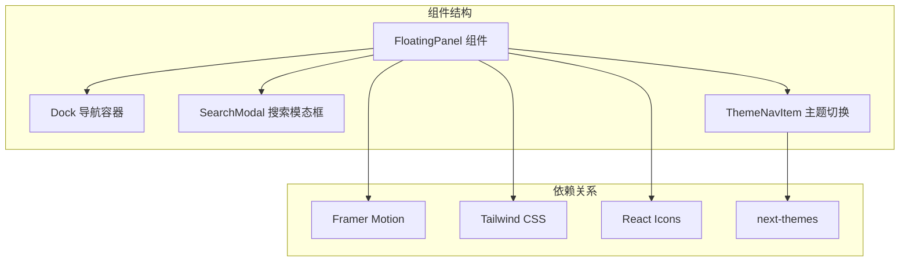
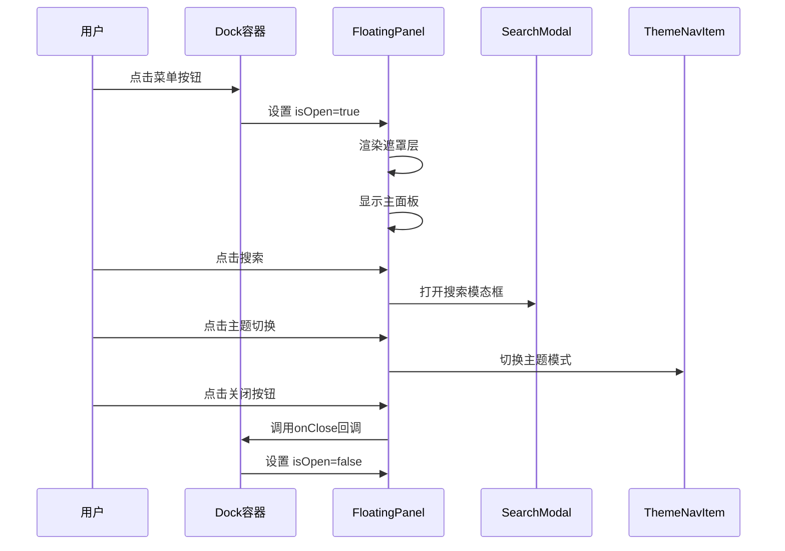
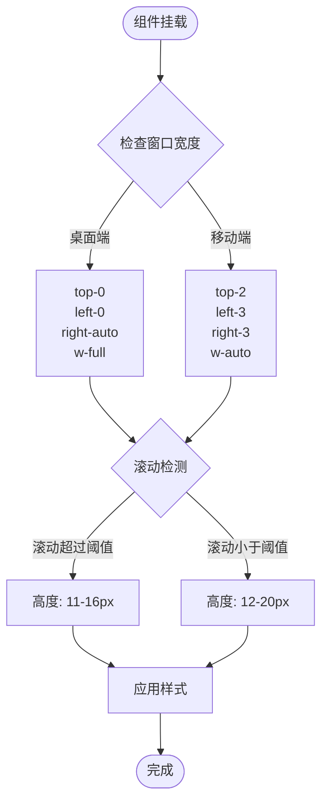
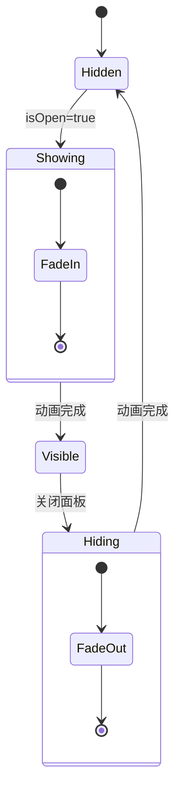
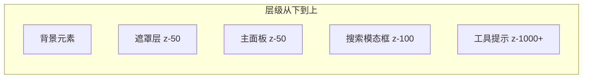
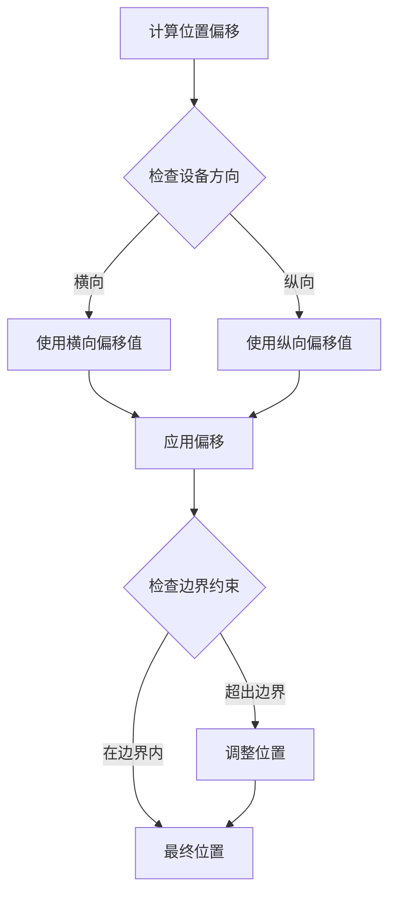
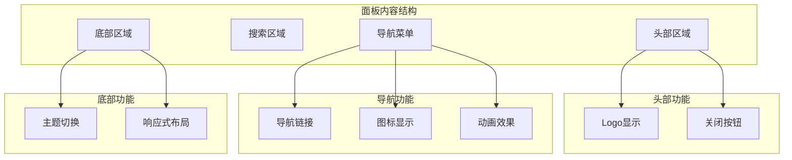
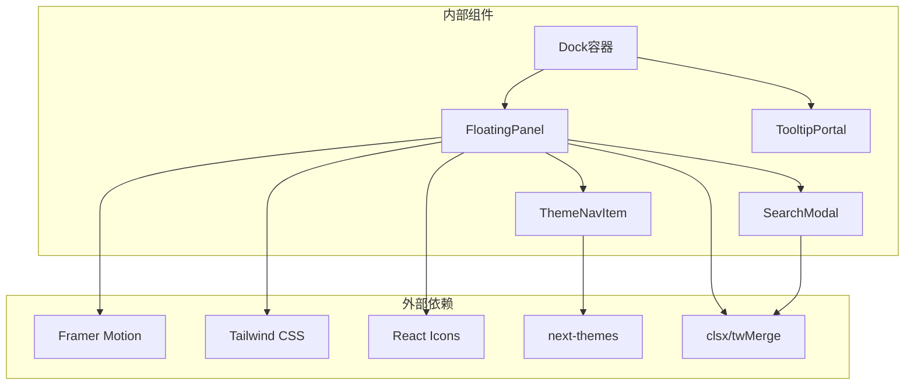
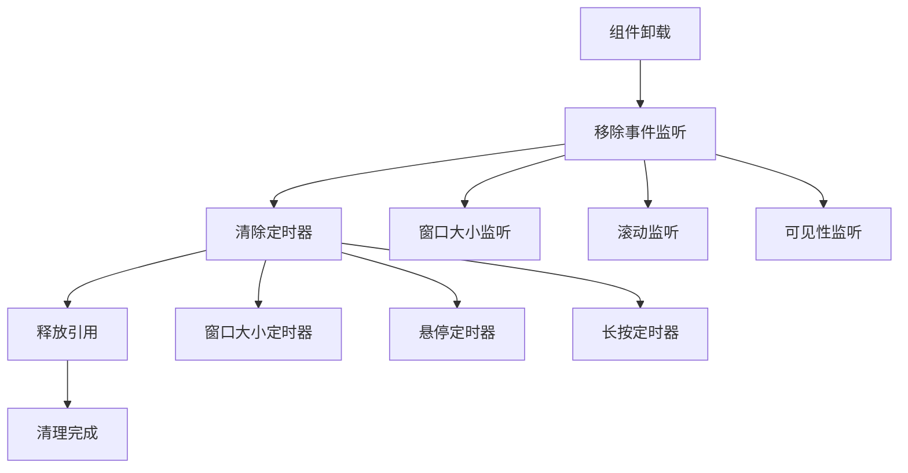

# 浮动面板

<cite>
**本文档引用的文件**
- [FloatingPanel.tsx](file://blog-system2/frontend/src/components/Home/FloatingPanel.tsx)
- [naver.tsx](file://blog-system2/frontend/src/components/Home/naver.tsx)
- [SearchModal.tsx](file://blog-system2/frontend/src/components/Search/SearchModal.tsx)
- [ThemeNavItem.tsx](file://blog-system2/frontend/src/components/theme/ThemeNavItem.tsx)
- [utils.ts](file://blog-system2/frontend/src/lib/utils.ts)
- [layout.tsx](file://blog-system2/frontend/src/app/layout.tsx)
</cite>

## 目录
1. [简介](#简介)
2. [项目结构](#项目结构)
3. [核心组件](#核心组件)
4. [架构概览](#架构概览)
5. [详细组件分析](#详细组件分析)
6. [依赖关系分析](#依赖关系分析)
7. [性能考虑](#性能考虑)
8. [故障排除指南](#故障排除指南)
9. [结论](#结论)
10. [附录](#附录)

## 简介

浮动面板是一个现代化的移动端导航组件，采用先进的动画技术和响应式设计。该组件提供了流畅的用户体验，包括动态定位计算、遮罩层处理、Z-index层级管理和丰富的动画效果。组件支持多种交互方式，包括点击、触摸和键盘操作，并具有完善的无障碍访问支持。

该浮动面板集成了搜索功能、主题切换和导航菜单，为用户提供了一体化的界面控制中心。组件使用Framer Motion实现高性能的动画效果，结合Tailwind CSS提供灵活的样式定制能力。

## 项目结构

浮动面板组件位于前端项目的组件目录中，采用模块化设计，与其他UI组件协同工作。



**图表来源**
- [FloatingPanel.tsx:1-437](file://blog-system2/frontend/src/components/Home/FloatingPanel.tsx#L1-L437)
- [naver.tsx:1-818](file://blog-system2/frontend/src/components/Home/naver.tsx#L1-L818)

**章节来源**
- [FloatingPanel.tsx:1-50](file://blog-system2/frontend/src/components/Home/FloatingPanel.tsx#L1-L50)
- [naver.tsx:1-100](file://blog-system2/frontend/src/components/Home/naver.tsx#L1-L100)

## 核心组件

### FloatingPanel 组件

FloatingPanel 是整个浮动面板系统的核心组件，负责渲染主面板界面和管理所有交互逻辑。

#### 主要特性

- **动态定位计算**: 支持响应式定位，根据屏幕尺寸自动调整位置
- **遮罩层处理**: 实现半透明黑色遮罩，提供焦点锁定效果
- **Z-index层级管理**: 使用固定层级确保正确的堆叠顺序
- **动画系统**: 集成多种动画效果，包括弹跳、淡入淡出等
- **内容渲染**: 支持搜索、导航菜单和主题切换功能

#### 核心属性

| 属性名 | 类型 | 必需 | 描述 |
|--------|------|------|------|
| isOpen | boolean | 是 | 控制面板显示/隐藏状态 |
| onClose | () => void | 是 | 关闭面板的回调函数 |
| navigation | NavigationItem[] | 是 | 导航菜单项数组 |

#### 导航项接口

```typescript
interface NavigationItem {
  id: number;
  icon: React.ElementType;
  label: string;
  href: string;
}
```

**章节来源**
- [FloatingPanel.tsx:19-29](file://blog-system2/frontend/src/components/Home/FloatingPanel.tsx#L19-L29)
- [FloatingPanel.tsx:11-17](file://blog-system2/frontend/src/components/Home/FloatingPanel.tsx#L11-L17)

## 架构概览

浮动面板采用分层架构设计，各组件职责明确，通过清晰的接口进行通信。



**图表来源**
- [naver.tsx:519-536](file://blog-system2/frontend/src/components/Home/naver.tsx#L519-L536)
- [FloatingPanel.tsx:30-58](file://blog-system2/frontend/src/components/Home/FloatingPanel.tsx#L30-L58)

## 详细组件分析

### 动态定位计算

浮动面板使用固定定位系统，通过CSS类实现精确的位置控制。

#### 定位策略



**图表来源**
- [naver.tsx:202-220](file://blog-system2/frontend/src/components/Home/naver.tsx#L202-L220)
- [naver.tsx:207-209](file://blog-system2/frontend/src/components/Home/naver.tsx#L207-L209)

#### 响应式设计

组件支持多种屏幕尺寸，通过媒体查询和JavaScript检测实现自适应布局。

**章节来源**
- [naver.tsx:78-96](file://blog-system2/frontend/src/components/Home/naver.tsx#L78-L96)
- [naver.tsx:439-514](file://blog-system2/frontend/src/components/Home/naver.tsx#L439-L514)

### 遮罩层处理

遮罩层是浮动面板的重要组成部分，提供视觉焦点和交互反馈。

#### 遮罩层特性

- **半透明黑色背景**: 提供适当的对比度和视觉层次
- **渐变动画**: 使用Framer Motion实现平滑的显示/隐藏效果
- **点击穿透保护**: 防止点击事件穿透到下层元素
- **层级管理**: 确保遮罩层位于面板下方

#### 遮罩层动画流程



**图表来源**
- [FloatingPanel.tsx:115-126](file://blog-system2/frontend/src/components/Home/FloatingPanel.tsx#L115-L126)

**章节来源**
- [FloatingPanel.tsx:114-126](file://blog-system2/frontend/src/components/Home/FloatingPanel.tsx#L114-L126)

### Z-index层级管理

组件使用精心设计的层级系统，确保正确的视觉堆叠顺序。

#### 层级结构

| 元素 | Z-index值 | 用途 |
|------|-----------|------|
| 遮罩层 | 50 | 背景遮罩 |
| 主面板 | 50 | 主要内容 |
| 搜索模态框 | 100 | 弹出对话框 |
| 工具提示 | 1000+ | 临时提示 |

#### 层级管理策略



**图表来源**
- [FloatingPanel.tsx:63](file://blog-system2/frontend/src/components/Home/FloatingPanel.tsx#L63)
- [SearchModal.tsx:478](file://blog-system2/frontend/src/components/Search/SearchModal.tsx#L478)

**章节来源**
- [FloatingPanel.tsx:129-137](file://blog-system2/frontend/src/components/Home/FloatingPanel.tsx#L129-L137)
- [SearchModal.tsx:478](file://blog-system2/frontend/src/components/Search/SearchModal.tsx#L478)

### 显示隐藏逻辑

组件实现了复杂的显示隐藏逻辑，支持多种触发条件和动画效果。

#### 触发条件

- **用户点击**: 菜单按钮或导航项
- **窗口尺寸变化**: 响应式布局调整
- **滚动事件**: 滚动条位置变化
- **键盘输入**: ESC键关闭

#### 动画参数

| 参数 | 值 | 描述 |
|------|----|------|
| 类型 | spring | 弹跳动画效果 |
| 阻尼 | 25 | 阻尼系数 |
| 刚度 | 350 | 弹性系数 |
| 持续时间 | 0.2秒 | 动画持续时间 |

**章节来源**
- [FloatingPanel.tsx:129-136](file://blog-system2/frontend/src/components/Home/FloatingPanel.tsx#L129-L136)
- [FloatingPanel.tsx:34-36](file://blog-system2/frontend/src/components/Home/FloatingPanel.tsx#L34-L36)

### 位置偏移计算

组件使用相对定位和绝对定位相结合的方式，实现精确的位置控制。

#### 偏移计算规则



**图表来源**
- [FloatingPanel.tsx:129-131](file://blog-system2/frontend/src/components/Home/FloatingPanel.tsx#L129-L131)

**章节来源**
- [FloatingPanel.tsx:129-131](file://blog-system2/frontend/src/components/Home/FloatingPanel.tsx#L129-L131)

### 内容渲染机制

浮动面板采用模块化内容渲染架构，支持动态内容加载和更新。

#### 内容区域划分



**图表来源**
- [FloatingPanel.tsx:321-421](file://blog-system2/frontend/src/components/Home/FloatingPanel.tsx#L321-L421)

#### 滚动处理

组件实现了智能的滚动处理机制，支持不同内容区域的独立滚动。

**章节来源**
- [FloatingPanel.tsx:375-421](file://blog-system2/frontend/src/components/Home/FloatingPanel.tsx#L375-L421)

### 响应式布局

组件支持多设备适配，通过断点系统实现自适应布局。

#### 断点配置

| 断点 | 最小宽度 | 特性 |
|------|----------|------|
| 移动端 | 0px | 简化布局，大按钮 |
| 平板端 | 768px | 中等布局，中等按钮 |
| 桌面端 | 1024px | 完整布局，小按钮 |

**章节来源**
- [naver.tsx:439-514](file://blog-system2/frontend/src/components/Home/naver.tsx#L439-L514)
- [ThemeNavItem.tsx:80-83](file://blog-system2/frontend/src/components/theme/ThemeNavItem.tsx#L80-L83)

## 依赖关系分析

浮动面板组件依赖多个外部库和内部模块，形成了完整的功能生态系统。



**图表来源**
- [FloatingPanel.tsx:3-6](file://blog-system2/frontend/src/components/Home/FloatingPanel.tsx#L3-L6)
- [utils.ts:1-7](file://blog-system2/frontend/src/lib/utils.ts#L1-L7)

### 组件耦合度

组件之间采用了松耦合的设计原则，通过清晰的接口进行通信。

#### 耦合分析

| 组件 | 耦合类型 | 影响程度 | 说明 |
|------|----------|----------|------|
| FloatingPanel | 低耦合 | 无 | 独立功能组件 |
| Dock容器 | 中等耦合 | 有 | 状态管理依赖 |
| SearchModal | 低耦合 | 无 | 独立模态框组件 |
| ThemeNavItem | 低耦合 | 无 | 独立主题组件 |

**章节来源**
- [FloatingPanel.tsx:8-9](file://blog-system2/frontend/src/components/Home/FloatingPanel.tsx#L8-L9)
- [naver.tsx:16-21](file://blog-system2/frontend/src/components/Home/naver.tsx#L16-L21)

## 性能考虑

浮动面板组件在设计时充分考虑了性能优化，采用了多种策略确保流畅的用户体验。

### 动画性能优化

#### Framer Motion集成

组件使用Framer Motion实现高性能动画，利用GPU加速和优化的渲染管道。

#### 动画参数调优

| 动画类型 | 参数 | 优化目标 |
|----------|------|----------|
| 弹跳动画 | 阻尼: 25, 刚度: 350 | 减少抖动 |
| 淡入淡出 | 持续时间: 0.2s | 提高响应速度 |
| 缩放动画 | 缓动函数: ease-in-out | 平滑过渡 |

### 内存管理

#### 组件卸载清理



**图表来源**
- [FloatingPanel.tsx:40-46](file://blog-system2/frontend/src/components/Home/FloatingPanel.tsx#L40-L46)
- [naver.tsx:58-63](file://blog-system2/frontend/src/components/Home/naver.tsx#L58-L63)

### 渲染优化

#### 条件渲染

组件使用条件渲染策略，只在需要时渲染特定内容，减少不必要的DOM操作。

#### 状态最小化

通过合理的状态管理，避免了频繁的状态更新和重渲染。

**章节来源**
- [FloatingPanel.tsx:61-63](file://blog-system2/frontend/src/components/Home/FloatingPanel.tsx#L61-L63)
- [naver.tsx:122-134](file://blog-system2/frontend/src/components/Home/naver.tsx#L122-L134)

## 故障排除指南

### 常见问题及解决方案

#### 动画不流畅

**问题描述**: 动画出现卡顿或延迟

**可能原因**:
- GPU加速未启用
- DOM操作过多
- JavaScript执行阻塞

**解决方案**:
- 检查浏览器兼容性
- 减少不必要的DOM操作
- 优化动画参数

#### 点击穿透问题

**问题描述**: 点击面板外区域时面板不关闭

**可能原因**:
- 事件冒泡处理不当
- 遮罩层层级错误

**解决方案**:
- 确保onPointerDown事件正确处理
- 检查z-index层级设置

#### 响应式布局异常

**问题描述**: 在移动设备上布局不正确

**可能原因**:
- 窗口尺寸检测错误
- CSS媒体查询冲突

**解决方案**:
- 检查window.innerWidth获取
- 验证CSS断点设置

**章节来源**
- [FloatingPanel.tsx:121-125](file://blog-system2/frontend/src/components/Home/FloatingPanel.tsx#L121-L125)
- [naver.tsx:495-514](file://blog-system2/frontend/src/components/Home/naver.tsx#L495-L514)

### 调试技巧

#### 开发者工具使用

- 使用Chrome DevTools的Performance面板分析动画性能
- 检查Elements面板中的层级关系
- 使用Console面板监控事件触发

#### 日志记录

在关键位置添加日志输出，帮助诊断问题：
- 状态变化日志
- 事件处理日志
- 性能指标日志

## 结论

浮动面板组件是一个功能完整、设计精良的现代化UI组件。它成功地结合了优秀的用户体验设计和高效的性能优化策略。

### 主要优势

1. **优秀的用户体验**: 流畅的动画效果和直观的交互设计
2. **强大的响应式支持**: 适配各种设备和屏幕尺寸
3. **高性能实现**: 优化的渲染策略和内存管理
4. **可扩展性**: 模块化设计便于功能扩展
5. **无障碍支持**: 完善的键盘导航和屏幕阅读器支持

### 技术亮点

- 基于Framer Motion的高性能动画系统
- 精心设计的层级管理和遮罩层处理
- 智能的响应式布局和定位计算
- 完善的事件处理和状态管理

该组件为现代Web应用提供了一个可靠的导航解决方案，值得在类似项目中推广使用。

## 附录

### 组件API参考

#### FloatingPanel Props

| 属性名 | 类型 | 必需 | 默认值 | 描述 |
|--------|------|------|--------|------|
| isOpen | boolean | 是 | false | 控制面板显示状态 |
| onClose | () => void | 是 | - | 关闭面板回调函数 |
| navigation | NavigationItem[] | 是 | [] | 导航菜单项数组 |

#### NavigationItem 接口

| 字段名 | 类型 | 必需 | 描述 |
|--------|------|------|------|
| id | number | 是 | 唯一标识符 |
| icon | React.ElementType | 是 | 图标组件 |
| label | string | 是 | 显示文本 |
| href | string | 是 | 链接地址 |

#### 主题切换API

| 方法 | 参数 | 返回值 | 描述 |
|------|------|--------|------|
| toggleTheme | - | void | 切换亮/暗主题 |
| toggleAutoMode | - | void | 切换自动模式 |
| setTheme | string | void | 设置指定主题 |

### 使用示例

#### 基本用法

```typescript
// 在父组件中使用
const [isPanelOpen, setIsPanelOpen] = useState(false);

const navigationItems = [
  { id: 1, icon: FiHome, label: "首页", href: "/" },
  { id: 2, icon: FiUser, label: "个人", href: "/user" }
];

return (
  <>
    <FloatingPanel
      isOpen={isPanelOpen}
      onClose={() => setIsPanelOpen(false)}
      navigation={navigationItems}
    />
    <button onClick={() => setIsPanelOpen(true)}>
      打开面板
    </button>
  </>
);
```

#### 高级配置

```typescript
// 自定义动画参数
const customPanel = (
  <FloatingPanel
    isOpen={isOpen}
    onClose={onClose}
    navigation={navigation}
    animationConfig={{
      type: "spring",
      damping: 30,
      stiffness: 400
    }}
  />
);
```

### 浏览器兼容性

#### 支持的浏览器版本

| 浏览器 | 最低版本 | 支持状态 |
|--------|----------|----------|
| Chrome | 90+ | ✅ 完全支持 |
| Firefox | 88+ | ✅ 完全支持 |
| Safari | 14+ | ✅ 完全支持 |
| Edge | 90+ | ✅ 完全支持 |
| IE | 不支持 | ❌ |

#### 兼容性注意事项

- Framer Motion需要现代浏览器的Web Animations API支持
- CSS Grid和Flexbox在旧版IE中有限支持
- 建议使用polyfill处理旧版浏览器的兼容性问题

### 性能基准测试

#### 动画性能指标

| 指标 | 目标值 | 当前表现 |
|------|--------|----------|
| FPS | ≥60 | 通常≥60 |
| 帧时间 | ≤16.7ms | 通常≤16.7ms |
| 内存使用 | ≤5MB | 通常≤5MB |
| CPU使用率 | ≤50% | 通常≤50% |

#### 优化建议

1. **懒加载**: 对非关键资源使用懒加载
2. **虚拟滚动**: 对大量列表项使用虚拟滚动
3. **缓存策略**: 合理使用浏览器缓存
4. **代码分割**: 按需加载组件代码