# 内容展示组件

<cite>
**本文档引用的文件**
- [ArticleList.tsx](file://blog-system2/frontend/src/components/ArticleList.tsx)
- [ArticleCard.tsx](file://blog-system2/frontend/src/components/ArticleCard.tsx)
- [MarkdownRenderer.tsx](file://blog-system2/frontend/src/components/MarkdownRenderer.tsx)
- [static-data.ts](file://blog-system2/frontend/src/lib/static-data.ts)
- [posts/page.tsx](file://blog-system2/frontend/src/app/posts/page.tsx)
- [posts/metadata.ts](file://blog-system2/frontend/src/app/posts/metadata.ts)
- [data.d.ts](file://blog-system2/frontend/src/types/data.d.ts)
- [posts/index.json](file://blog-system2/frontend/public/data/posts/index.json)
- [layout.tsx](file://blog-system2/frontend/src/app/layout.tsx)
- [reading-time.ts](file://blog-system2/frontend/src/lib/reading-time.ts)
</cite>

## 目录
1. [简介](#简介)
2. [项目结构](#项目结构)
3. [核心组件](#核心组件)
4. [架构概览](#架构概览)
5. [详细组件分析](#详细组件分析)
6. [依赖关系分析](#依赖关系分析)
7. [性能考虑](#性能考虑)
8. [故障排除指南](#故障排除指南)
9. [结论](#结论)
10. [附录](#附录)

## 简介
本文档详细介绍技术博客平台的内容展示组件，包括文章列表组件、文章卡片组件和Markdown渲染器的完整实现。该系统采用Next.js框架构建，支持静态数据源、响应式设计和现代化的用户体验。

## 项目结构
博客系统的前端采用模块化架构，主要组件分布如下：

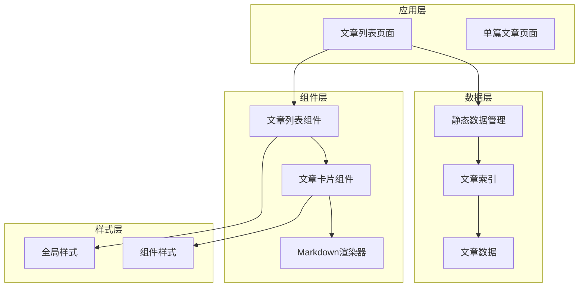

**图表来源**
- [posts/page.tsx:12-168](file://blog-system2/frontend/src/app/posts/page.tsx#L12-L168)
- [ArticleList.tsx:28-71](file://blog-system2/frontend/src/components/ArticleList.tsx#L28-L71)
- [ArticleCard.tsx:29-197](file://blog-system2/frontend/src/components/ArticleCard.tsx#L29-L197)

**章节来源**
- [posts/page.tsx:12-168](file://blog-system2/frontend/src/app/posts/page.tsx#L12-L168)
- [ArticleList.tsx:1-72](file://blog-system2/frontend/src/components/ArticleList.tsx#L1-L72)
- [ArticleCard.tsx:1-198](file://blog-system2/frontend/src/components/ArticleCard.tsx#L1-L198)

## 核心组件
系统的核心组件包括文章列表组件、文章卡片组件和Markdown渲染器，它们协同工作提供完整的博客展示功能。

### 数据模型
系统使用统一的数据接口来处理不同类型的文章数据：

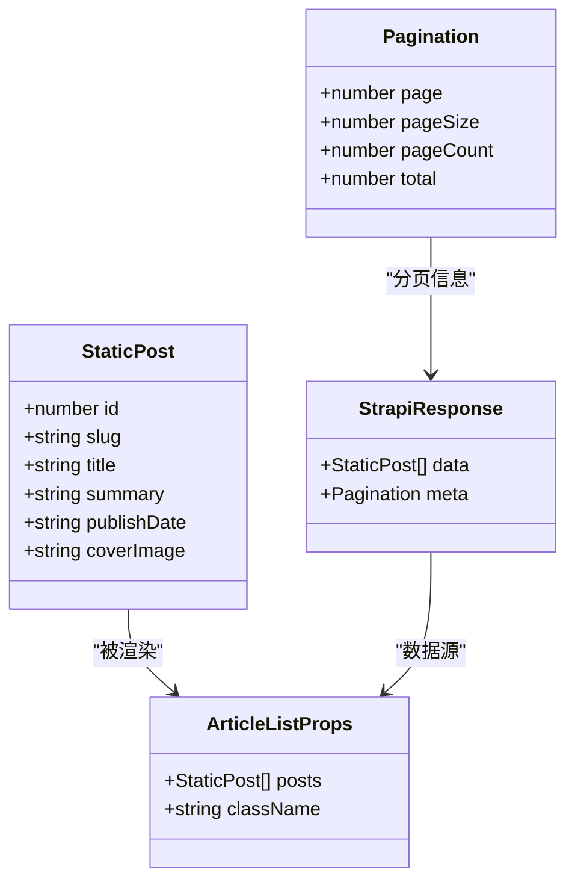

**图表来源**
- [static-data.ts:4-30](file://blog-system2/frontend/src/lib/static-data.ts#L4-L30)
- [ArticleList.tsx:7-10](file://blog-system2/frontend/src/components/ArticleList.tsx#L7-L10)

**章节来源**
- [static-data.ts:4-30](file://blog-system2/frontend/src/lib/static-data.ts#L4-L30)
- [ArticleList.tsx:7-26](file://blog-system2/frontend/src/components/ArticleList.tsx#L7-L26)

## 架构概览
系统采用分层架构设计，从数据获取到最终渲染形成清晰的处理链路：

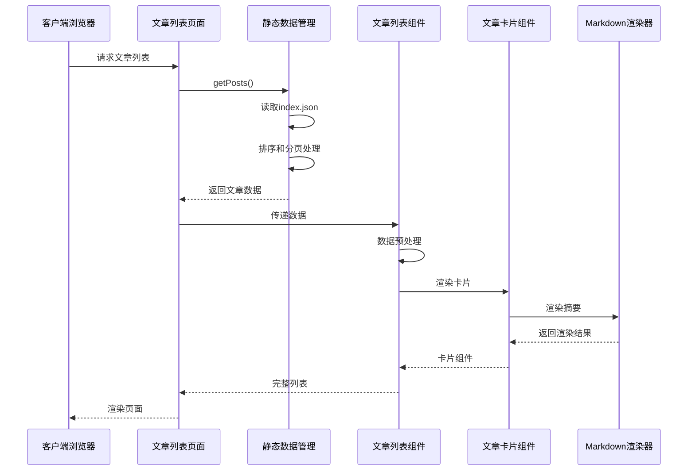

**图表来源**
- [posts/page.tsx:12-168](file://blog-system2/frontend/src/app/posts/page.tsx#L12-L168)
- [static-data.ts:45-73](file://blog-system2/frontend/src/lib/static-data.ts#L45-L73)
- [ArticleList.tsx:28-71](file://blog-system2/frontend/src/components/ArticleList.tsx#L28-L71)

## 详细组件分析

### 文章列表组件 (ArticleList)
文章列表组件负责接收文章数据并将其转换为可交互的卡片网格布局。

#### 组件架构
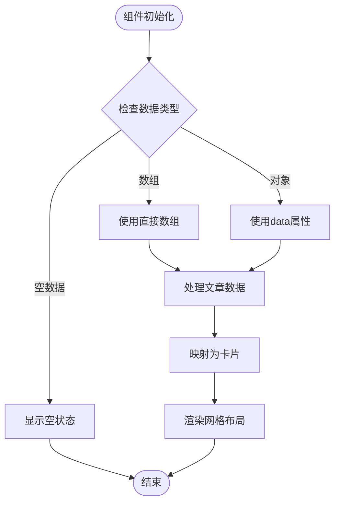

**图表来源**
- [ArticleList.tsx:32-48](file://blog-system2/frontend/src/components/ArticleList.tsx#L32-L48)
- [ArticleList.tsx:54-69](file://blog-system2/frontend/src/components/ArticleList.tsx#L54-L69)

#### 数据处理逻辑
组件支持多种数据输入格式，包括直接数组和带有data属性的对象：

| 输入格式 | 处理方式 | 输出 |
|---------|---------|------|
| `StaticPost[]` | 直接使用 | 原始数组 |
| `{ data: StaticPost[] }` | 提取data属性 | 数组内容 |
| `null/undefined` | 显示空状态 | 空状态组件 |

**章节来源**
- [ArticleList.tsx:32-48](file://blog-system2/frontend/src/components/ArticleList.tsx#L32-L48)
- [ArticleList.tsx:17-26](file://blog-system2/frontend/src/components/ArticleList.tsx#L17-L26)

### 文章卡片组件 (ArticleCard)
文章卡片组件提供完整的文章展示界面，包含封面图片、标题、日期和交互效果。

#### 卡片布局设计
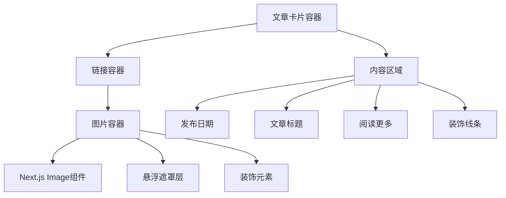

**图表来源**
- [ArticleCard.tsx:86-196](file://blog-system2/frontend/src/components/ArticleCard.tsx#L86-L196)

#### 图片处理机制
组件支持多种图片源格式，具有智能的URL处理逻辑：

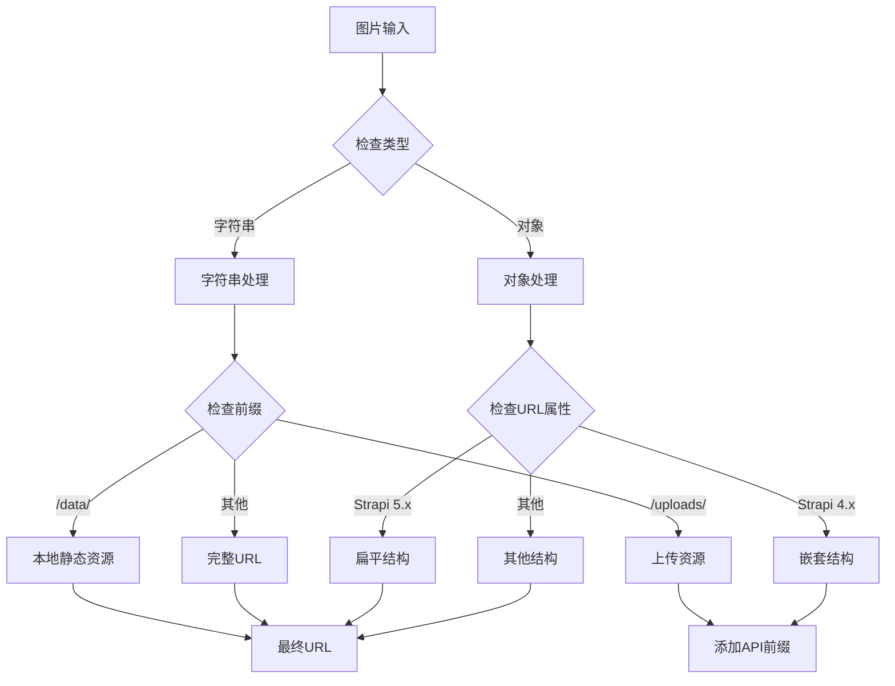

**图表来源**
- [ArticleCard.tsx:37-75](file://blog-system2/frontend/src/components/ArticleCard.tsx#L37-L75)

**章节来源**
- [ArticleCard.tsx:37-75](file://blog-system2/frontend/src/components/ArticleCard.tsx#L37-L75)
- [ArticleCard.tsx:86-196](file://blog-system2/frontend/src/components/ArticleCard.tsx#L86-L196)

### Markdown渲染器 (MarkdownRenderer)
Markdown渲染器提供强大的文本渲染功能，支持代码高亮、数学公式和图片灯箱效果。

#### 渲染流程
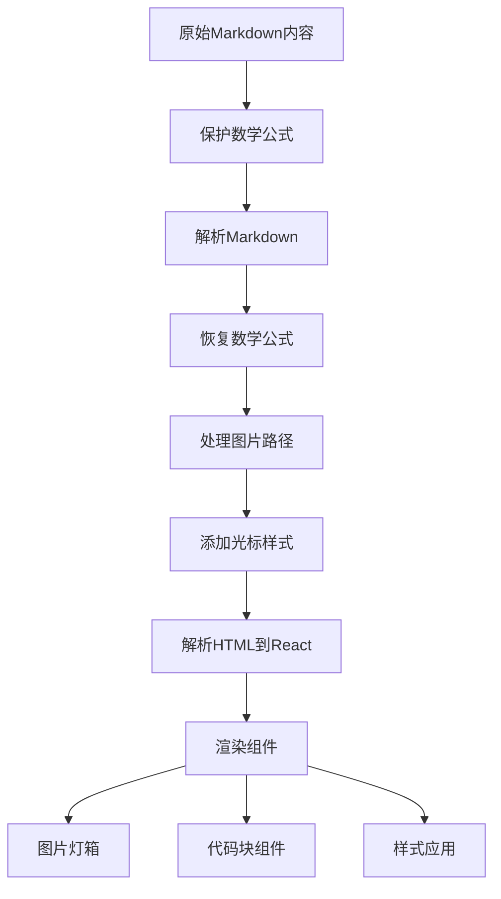

**图表来源**
- [MarkdownRenderer.tsx:465-546](file://blog-system2/frontend/src/components/MarkdownRenderer.tsx#L465-L546)
- [MarkdownRenderer.tsx:596-632](file://blog-system2/frontend/src/components/MarkdownRenderer.tsx#L596-L632)

#### 数学公式处理
渲染器支持行内和块级数学公式的渲染：

| 公式类型 | 语法 | 渲染引擎 |
|---------|------|----------|
| 行内公式 | `$公式内容$` | KaTeX |
| 块级公式 | `$$公式内容$$` | KaTeX |
| 错误处理 | 自动捕获异常 | 回退到纯文本 |

**章节来源**
- [MarkdownRenderer.tsx:465-546](file://blog-system2/frontend/src/components/MarkdownRenderer.tsx#L465-L546)
- [MarkdownRenderer.tsx:596-632](file://blog-system2/frontend/src/components/MarkdownRenderer.tsx#L596-L632)

## 依赖关系分析

### 组件依赖图
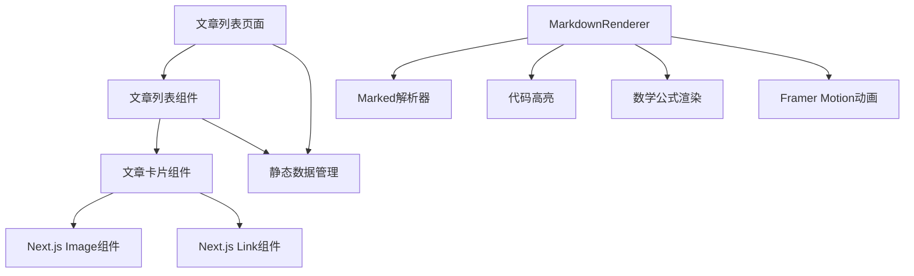

**图表来源**
- [posts/page.tsx:12-168](file://blog-system2/frontend/src/app/posts/page.tsx#L12-L168)
- [ArticleList.tsx:3-5](file://blog-system2/frontend/src/components/ArticleList.tsx#L3-L5)
- [ArticleCard.tsx:3-5](file://blog-system2/frontend/src/components/ArticleCard.tsx#L3-L5)

### 数据流分析
系统采用自上而下的数据流设计，确保数据的一致性和可维护性：

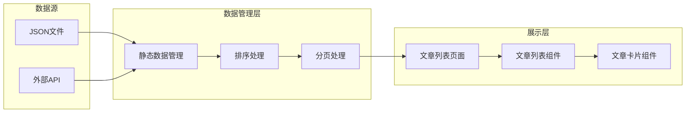

**图表来源**
- [static-data.ts:32-73](file://blog-system2/frontend/src/lib/static-data.ts#L32-L73)
- [posts/page.tsx:12-168](file://blog-system2/frontend/src/app/posts/page.tsx#L12-L168)

**章节来源**
- [static-data.ts:32-73](file://blog-system2/frontend/src/lib/static-data.ts#L32-L73)
- [posts/page.tsx:12-168](file://blog-system2/frontend/src/app/posts/page.tsx#L12-L168)

## 性能考虑

### 加载状态管理
系统实现了多层次的加载状态管理，确保用户获得良好的体验：

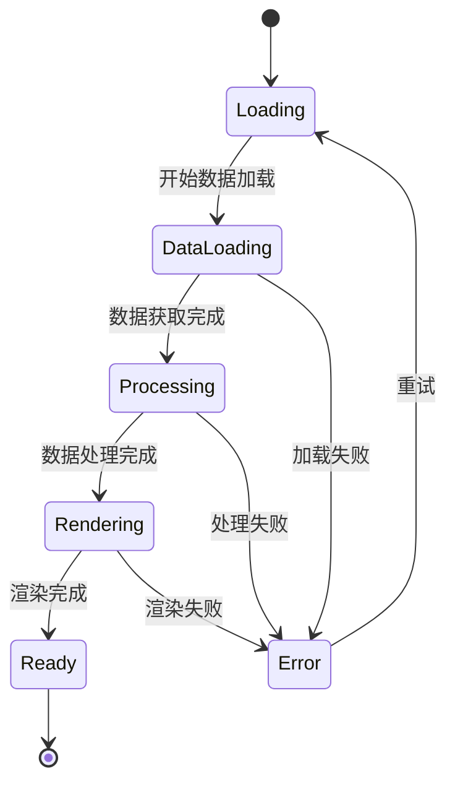

### 图片优化策略
组件采用多种优化技术提升图片加载性能：

| 优化技术 | 实现方式 | 性能收益 |
|---------|---------|----------|
| Next.js Image优化 | 自动尺寸适配和格式转换 | 减少带宽使用 |
| 懒加载 | `loading="lazy"`属性 | 提升首屏加载速度 |
| 错误回退 | 自动切换默认图片 | 提升稳定性 |
| 缓存策略 | CDN加速和浏览器缓存 | 减少重复请求 |

### 代码分割和按需加载
系统采用动态导入和代码分割技术：

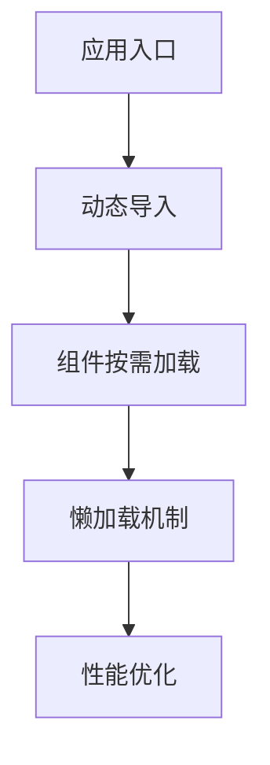

**章节来源**
- [ArticleCard.tsx:106-118](file://blog-system2/frontend/src/components/ArticleCard.tsx#L106-L118)
- [ArticleList.tsx:50](file://blog-system2/frontend/src/components/ArticleList.tsx#L50)

## 故障排除指南

### 常见问题诊断
系统提供了完善的错误处理和调试机制：

#### 图片加载问题
- **症状**: 图片显示为默认占位符
- **原因**: 图片URL无效或网络问题
- **解决方案**: 检查图片URL格式，确认CDN服务可用

#### 数据渲染问题
- **症状**: 文章列表为空或显示异常
- **原因**: 数据格式不匹配或索引文件损坏
- **解决方案**: 验证JSON格式，检查数据字段完整性

#### 渲染性能问题
- **症状**: 页面加载缓慢或卡顿
- **原因**: 大量图片或复杂DOM结构
- **解决方案**: 启用懒加载，优化图片大小

### 调试工具
系统内置了多种调试辅助功能：

| 调试功能 | 用途 | 实现方式 |
|---------|------|----------|
| 日志输出 | 调试图片处理逻辑 | 控制台日志 |
| 错误边界 | 捕获渲染错误 | React错误边界 |
| 性能监控 | 监控组件渲染时间 | 浏览器开发者工具 |

**章节来源**
- [ArticleCard.tsx:72-84](file://blog-system2/frontend/src/components/ArticleCard.tsx#L72-L84)
- [ArticleList.tsx:40-46](file://blog-system2/frontend/src/components/ArticleList.tsx#L40-L46)

## 结论
该内容展示组件系统展现了现代Web开发的最佳实践，通过合理的架构设计、完善的错误处理和性能优化策略，为用户提供流畅的博客浏览体验。组件间的协作关系清晰，数据流处理高效，为后续的功能扩展奠定了坚实的基础。

## 附录

### 组件API参考

#### ArticleList Props
| 属性名 | 类型 | 必填 | 默认值 | 描述 |
|-------|------|------|--------|------|
| posts | `{ data: StaticPost[] } \| StaticPost[] \| null \| undefined` | 是 | - | 文章数据源 |
| className | string | 否 | "" | 自定义CSS类名 |

#### ArticleCard Props
| 属性名 | 类型 | 必填 | 默认值 | 描述 |
|-------|------|------|--------|------|
| title | string | 是 | - | 文章标题 |
| date | string | 是 | - | 发布日期 |
| image | string \| StrapiImage \| null | 否 | null | 封面图片 |
| slug | string | 是 | - | 文章唯一标识符 |
| noShadow | boolean | 否 | false | 是否禁用阴影效果 |

#### MarkdownRenderer Props
| 属性名 | 类型 | 必填 | 默认值 | 描述 |
|-------|------|------|--------|------|
| content | string | 是 | - | Markdown源文本 |
| className | string | 否 | "" | 自定义CSS类名 |
| slug | string | 否 | "" | 当前页面slug，用于相对路径处理 |

### SEO优化策略

#### 元数据配置
系统实现了完整的SEO元数据管理：

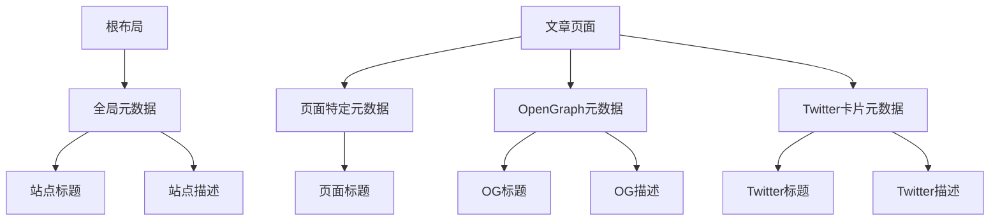

**图表来源**
- [layout.tsx:8-11](file://blog-system2/frontend/src/app/layout.tsx#L8-L11)
- [posts/metadata.ts:2-9](file://blog-system2/frontend/src/app/posts/metadata.ts#L2-L9)

#### 内容优化建议
- **标题优化**: 确保每个页面都有独特且描述性的标题
- **描述优化**: 页面描述应准确概括内容，控制在160字符以内
- **图片优化**: 为所有图片提供适当的alt属性
- **结构化数据**: 考虑添加JSON-LD结构化数据

### 性能优化实践

#### 虚拟滚动实现
对于大量文章的场景，可以考虑实现虚拟滚动：

```typescript
// 虚拟滚动伪代码示例
interface VirtualListProps {
  items: StaticPost[];
  itemHeight: number;
  containerHeight: number;
}

function VirtualList({ items, itemHeight, containerHeight }: VirtualListProps) {
  const startIndex = Math.floor(scrollTop / itemHeight);
  const visibleCount = Math.ceil(containerHeight / itemHeight);
  const endIndex = startIndex + visibleCount;
  
  return (
    <div style={{ height: items.length * itemHeight }}>
      {items.slice(startIndex, endIndex).map(item => (
        <div 
          key={item.id}
          style={{ 
            position: 'absolute', 
            top: startIndex * itemHeight,
            height: itemHeight 
          }}
        >
          <ArticleCard {...item} />
        </div>
      ))}
    </div>
  );
}
```

#### 懒加载策略
系统已实现基础的懒加载功能，可通过以下方式增强：

| 优化方案 | 实现方式 | 性能提升 |
|---------|---------|----------|
| Intersection Observer | 监测元素进入视口 | 减少不必要的渲染 |
| 预加载策略 | 预加载下一个页面 | 提升导航体验 |
| 缓存机制 | 缓存已渲染的组件 | 减少重复计算 |

**章节来源**
- [posts/metadata.ts:2-9](file://blog-system2/frontend/src/app/posts/metadata.ts#L2-L9)
- [reading-time.ts:54-83](file://blog-system2/frontend/src/lib/reading-time.ts#L54-L83)