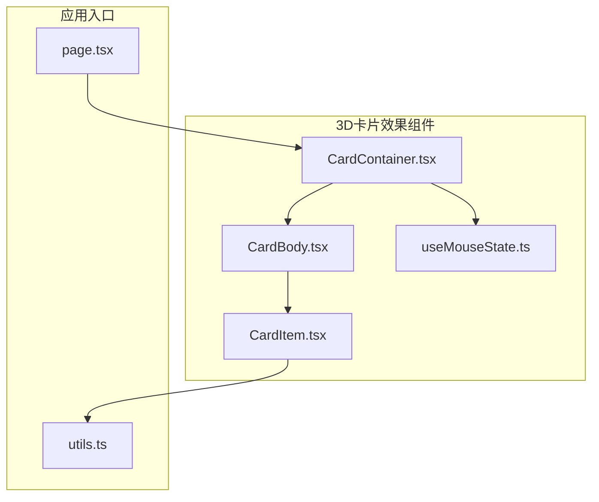
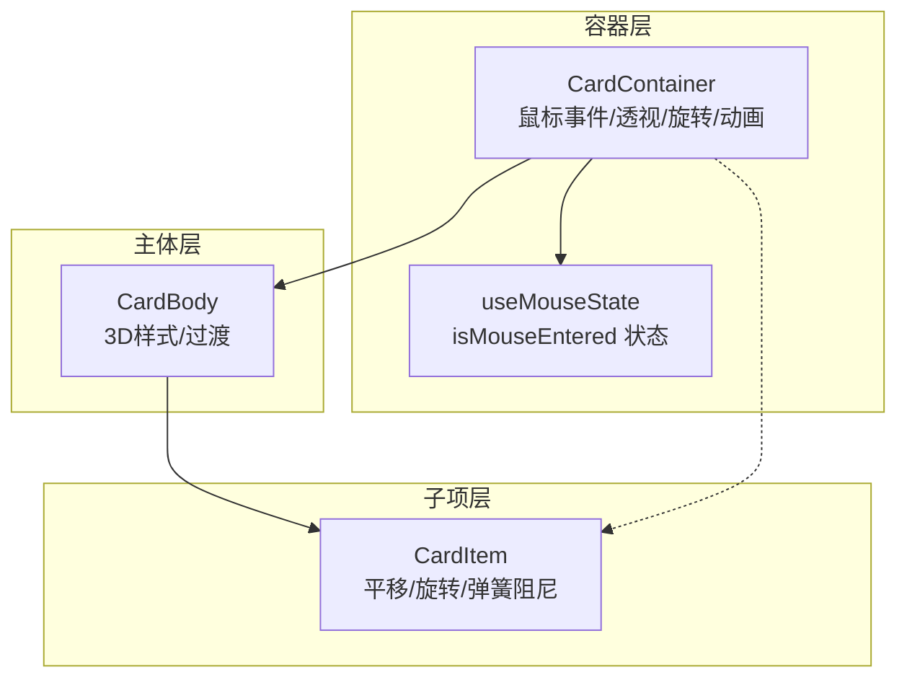
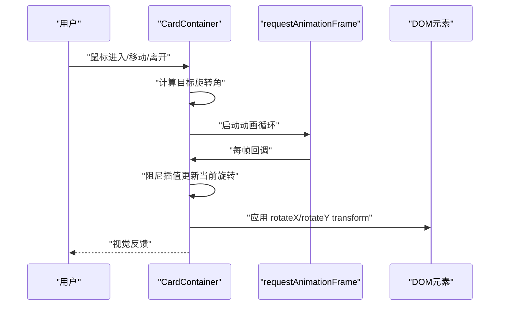
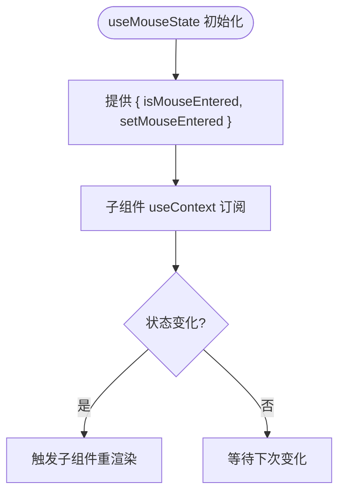
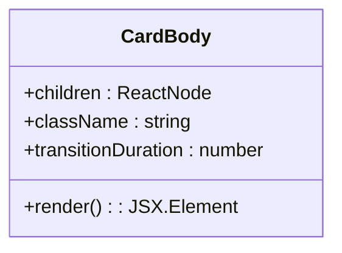
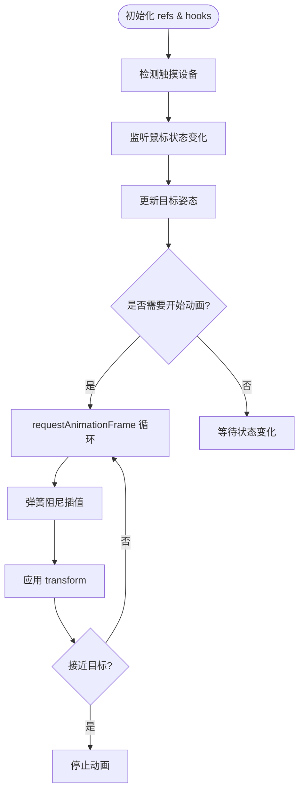
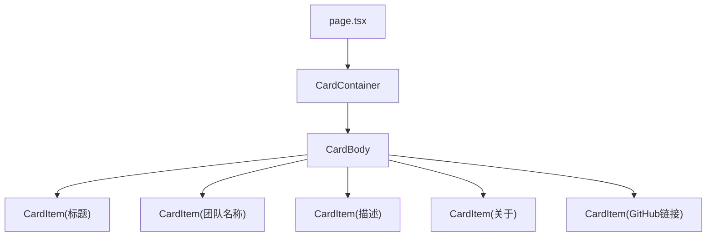
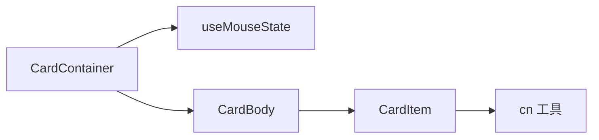

# 3D卡片效果组件

<cite>
**本文档引用的文件**
- [CardContainer.tsx](file://blog-system2/frontend/src/components/Home/3DCardEffect/CardContainer.tsx)
- [useMouseState.ts](file://blog-system2/frontend/src/components/Home/3DCardEffect/useMouseState.ts)
- [CardBody.tsx](file://blog-system2/frontend/src/components/Home/3DCardEffect/CardBody.tsx)
- [CardItem.tsx](file://blog-system2/frontend/src/components/Home/3DCardEffect/CardItem.tsx)
- [page.tsx](file://blog-system2/frontend/src/app/page.tsx)
- [utils.ts](file://blog-system2/frontend/src/lib/utils.ts)
</cite>

## 目录
1. [简介](#简介)
2. [项目结构](#项目结构)
3. [核心组件](#核心组件)
4. [架构总览](#架构总览)
5. [详细组件分析](#详细组件分析)
6. [依赖关系分析](#依赖关系分析)
7. [性能考量](#性能考量)
8. [故障排除指南](#故障排除指南)
9. [结论](#结论)
10. [附录](#附录)

## 简介
本项目实现了基于 Three.js 思想的 3D 卡片交互效果，通过 CSS 3D 变换矩阵、鼠标位置检测算法以及 GSAP 风格的缓动动画机制，构建了流畅且可定制的悬停交互体验。该组件体系包含三个核心模块：
- CardContainer：容器层，负责鼠标状态管理、透视设置、3D 旋转计算与动画调度
- CardBody：主体层，承载子元素并提供统一的 3D 样式与过渡
- CardItem：子项层，按需对单个元素应用平移、旋转与弹簧阻尼动画

同时，组件通过 useMouseState 钩子实现跨层级的状态共享，并支持触摸设备检测与响应式适配。

## 项目结构
3D 卡片效果组件位于前端工程的 Home 组件目录下，配合主页面进行演示集成。

图表来源
- [CardContainer.tsx:1-121](file://blog-system2/frontend/src/components/Home/3DCardEffect/CardContainer.tsx#L1-L121)
- [CardBody.tsx:1-30](file://blog-system2/frontend/src/components/Home/3DCardEffect/CardBody.tsx#L1-L30)
- [CardItem.tsx:1-136](file://blog-system2/frontend/src/components/Home/3DCardEffect/CardItem.tsx#L1-L136)
- [useMouseState.ts:1-11](file://blog-system2/frontend/src/components/Home/3DCardEffect/useMouseState.ts#L1-L11)
- [page.tsx:1-1179](file://blog-system2/frontend/src/app/page.tsx#L1-L1179)
- [utils.ts:1-7](file://blog-system2/frontend/src/lib/utils.ts#L1-L7)

章节来源
- [CardContainer.tsx:1-121](file://blog-system2/frontend/src/components/Home/3DCardEffect/CardContainer.tsx#L1-L121)
- [page.tsx:1-1179](file://blog-system2/frontend/src/app/page.tsx#L1-L1179)

## 核心组件
本节概述三个核心组件的功能职责与协作方式。

- CardContainer
  - 负责：鼠标进入/离开事件处理、触摸设备检测、透视设置、3D 旋转计算、动画调度
  - 关键能力：基于鼠标位置计算旋转角度，使用 requestAnimationFrame 实现平滑动画，支持 dampingFactor 控制阻尼
- CardBody
  - 负责：统一的 3D 样式、过渡动画、will-change 提升渲染性能
  - 关键能力：preserve-3d 保证子元素继承 3D 上下文，提供阴影过渡
- CardItem
  - 负责：单个元素的平移与旋转动画，支持 translateX/Y/Z 与 rotateX/Y/Z 参数
  - 关键能力：基于 springFactor 的弹簧阻尼系统，使用 requestAnimationFrame 实时更新 transform

章节来源
- [CardContainer.tsx:10-121](file://blog-system2/frontend/src/components/Home/3DCardEffect/CardContainer.tsx#L10-L121)
- [CardBody.tsx:6-30](file://blog-system2/frontend/src/components/Home/3DCardEffect/CardBody.tsx#L6-L30)
- [CardItem.tsx:7-136](file://blog-system2/frontend/src/components/Home/3DCardEffect/CardItem.tsx#L7-L136)

## 架构总览
3D 卡片效果采用“容器-主体-子项”的层级结构，通过上下文共享鼠标状态，实现从容器到子项的联动动画。

图表来源
- [CardContainer.tsx:102-119](file://blog-system2/frontend/src/components/Home/3DCardEffect/CardContainer.tsx#L102-L119)
- [useMouseState.ts:3-10](file://blog-system2/frontend/src/components/Home/3DCardEffect/useMouseState.ts#L3-L10)
- [CardBody.tsx:12-28](file://blog-system2/frontend/src/components/Home/3DCardEffect/CardBody.tsx#L12-L28)
- [CardItem.tsx:47-134](file://blog-system2/frontend/src/components/Home/3DCardEffect/CardItem.tsx#L47-L134)

## 详细组件分析

### CardContainer：3D 旋转容器
- 功能要点
  - 鼠标进入/离开事件：更新 useMouseState 的 isMouseEntered 状态
  - 触摸设备检测：通过媒体查询检测 `(hover: none) and (pointer: coarse)`
  - 透视设置：通过容器样式设置 perspective，影响 3D 旋转的视觉深度
  - 旋转计算：根据鼠标相对容器中心的位置计算目标旋转角，再通过阻尼算法平滑过渡
  - 动画调度：使用 requestAnimationFrame 实现帧循环，停止条件为接近目标值
- 关键参数
  - rotationFactor：控制旋转灵敏度，数值越小越敏感
  - perspective：控制透视距离，数值越大视角越“平”
  - dampingFactor：控制阻尼强度，越接近 1 越慢收敛
- 数据流
  - 鼠标移动 → 计算目标旋转 → 启动动画 → 每帧更新当前旋转 → 应用 transform

图表来源
- [CardContainer.tsx:78-119](file://blog-system2/frontend/src/components/Home/3DCardEffect/CardContainer.tsx#L78-L119)
- [CardContainer.tsx:47-76](file://blog-system2/frontend/src/components/Home/3DCardEffect/CardContainer.tsx#L47-L76)

章节来源
- [CardContainer.tsx:10-121](file://blog-system2/frontend/src/components/Home/3DCardEffect/CardContainer.tsx#L10-L121)

### useMouseState：状态钩子
- 功能要点
  - 提供 isMouseEntered 状态与 setter，供子组件订阅
  - 通过 Context 在容器与子项之间共享状态
- 设计意义
  - 将鼠标状态抽象为可复用的 Hook，避免重复逻辑
  - 便于扩展更多状态（如点击、触摸等）

图表来源
- [useMouseState.ts:3-10](file://blog-system2/frontend/src/components/Home/3DCardEffect/useMouseState.ts#L3-L10)
- [CardItem.tsx:48](file://blog-system2/frontend/src/components/Home/3DCardEffect/CardItem.tsx#L48)

章节来源
- [useMouseState.ts:1-11](file://blog-system2/frontend/src/components/Home/3DCardEffect/useMouseState.ts#L1-L11)

### CardBody：3D 主体
- 功能要点
  - 设置 preserve-3d 保持 3D 上下文
  - 提供统一的过渡动画与 will-change 提升性能
  - 默认尺寸与类名合并工具
- 性能建议
  - 合理设置 transitionDuration，避免过长导致卡顿
  - 使用 will-change: transform, box-shadow 减少布局抖动

图表来源
- [CardBody.tsx:6-30](file://blog-system2/frontend/src/components/Home/3DCardEffect/CardBody.tsx#L6-L30)

章节来源
- [CardBody.tsx:1-30](file://blog-system2/frontend/src/components/Home/3DCardEffect/CardBody.tsx#L1-L30)

### CardItem：3D 子项
- 功能要点
  - 接收 translateX/Y/Z 与 rotateX/Y/Z 参数，定义初始目标姿态
  - 基于 springFactor 的弹簧阻尼系统，实现平滑过渡
  - 支持 as 属性切换渲染标签，便于语义化与可访问性
  - 自动检测触摸设备并跳过动画
- 动画流程
  - 监听鼠标状态变化 → 更新目标值 → 启动动画循环 → 每帧插值 → 应用 transform

图表来源
- [CardItem.tsx:67-122](file://blog-system2/frontend/src/components/Home/3DCardEffect/CardItem.tsx#L67-L122)
- [CardItem.tsx:85-116](file://blog-system2/frontend/src/components/Home/3DCardEffect/CardItem.tsx#L85-L116)

章节来源
- [CardItem.tsx:1-136](file://blog-system2/frontend/src/components/Home/3DCardEffect/CardItem.tsx#L1-L136)

### 实际使用示例
在主页面中，3D 卡片效果被集成到首页展示区域，通过嵌套 CardContainer、CardBody 和多个 CardItem 实现层次化的 3D 效果。

图表来源
- [page.tsx:984-1056](file://blog-system2/frontend/src/app/page.tsx#L984-L1056)

章节来源
- [page.tsx:984-1056](file://blog-system2/frontend/src/app/page.tsx#L984-L1056)

## 依赖关系分析
- 组件间依赖
  - CardContainer 依赖 useMouseState 提供状态
  - CardBody 作为容器承载子项
  - CardItem 依赖 MouseStateContext 获取状态并驱动动画
- 外部依赖
  - React Hooks：useState、useContext、useRef、useEffect、useCallback
  - 浏览器 API：requestAnimationFrame、matchMedia、getBoundingClientRect
  - 工具函数：cn（类名合并）

图表来源
- [CardContainer.tsx:3-4](file://blog-system2/frontend/src/components/Home/3DCardEffect/CardContainer.tsx#L3-L4)
- [CardItem.tsx:4](file://blog-system2/frontend/src/components/Home/3DCardEffect/CardItem.tsx#L4)
- [utils.ts:4-6](file://blog-system2/frontend/src/lib/utils.ts#L4-L6)

章节来源
- [CardContainer.tsx:1-121](file://blog-system2/frontend/src/components/Home/3DCardEffect/CardContainer.tsx#L1-L121)
- [CardItem.tsx:1-136](file://blog-system2/frontend/src/components/Home/3DCardEffect/CardItem.tsx#L1-L136)
- [utils.ts:1-7](file://blog-system2/frontend/src/lib/utils.ts#L1-L7)

## 性能考量
- 动画与渲染
  - 使用 requestAnimationFrame 替代 setTimeout/setInterval，确保与浏览器刷新同步
  - 通过 will-change: transform, box-shadow 提升合成层，减少布局与绘制开销
- 触摸设备优化
  - 通过媒体查询检测触摸设备，避免在移动设备上执行昂贵的动画
- 3D 上下文
  - preserve-3d 仅在需要时启用，避免不必要的层提升
- 透视与阻尼
  - 合理设置 perspective 与 dampingFactor，平衡视觉深度与性能
- 用户偏好
  - 尊重 reduce-motion 偏好，必要时禁用或缩短动画

章节来源
- [CardContainer.tsx:36-37](file://blog-system2/frontend/src/components/Home/3DCardEffect/CardContainer.tsx#L36-L37)
- [CardItem.tsx:55-57](file://blog-system2/frontend/src/components/Home/3DCardEffect/CardItem.tsx#L55-L57)
- [CardBody.tsx:20-24](file://blog-system2/frontend/src/components/Home/3DCardEffect/CardBody.tsx#L20-L24)

## 故障排除指南
- 动画不生效
  - 检查容器是否正确设置 perspective 与 transform-style: preserve-3d
  - 确认鼠标事件绑定是否正常，触摸设备检测是否命中
- 旋转异常
  - 调整 rotationFactor 与 perspective，确保旋转范围与视觉效果匹配
  - 检查 dampingFactor 是否过大导致收敛过慢
- 子项无响应
  - 确认 CardItem 是否在 CardBody 内部正确渲染
  - 检查 MouseStateContext 是否由 CardContainer Provider 包裹
- 移动端卡顿
  - 确认触摸设备检测逻辑是否启用，避免在移动端执行动画
  - 检查 transitionDuration 与 will-change 的使用是否合理

章节来源
- [CardContainer.tsx:105-110](file://blog-system2/frontend/src/components/Home/3DCardEffect/CardContainer.tsx#L105-L110)
- [CardItem.tsx:48](file://blog-system2/frontend/src/components/Home/3DCardEffect/CardItem.tsx#L48)
- [CardContainer.tsx:36-37](file://blog-system2/frontend/src/components/Home/3DCardEffect/CardContainer.tsx#L36-L37)

## 结论
本 3D 卡片效果组件通过简洁的层级结构与高效的动画机制，实现了流畅的 3D 交互体验。其核心优势在于：
- 明确的职责分离：容器、主体、子项各司其职
- 基于浏览器原生 API 的高性能实现：requestAnimationFrame、preserve-3d
- 可配置的参数体系：rotationFactor、perspective、dampingFactor、springFactor
- 对触摸设备与用户偏好的兼容性

建议在实际项目中结合业务场景调优参数，并遵循性能最佳实践以获得更佳的用户体验。

## 附录

### API 文档

- CardContainer
  - children: ReactNode
  - className: string（容器内部元素类名）
  - containerClassName: string（外层容器类名）
  - rotationFactor: number（旋转灵敏度，默认 15）
  - perspective: number（透视距离，默认 1200）
  - dampingFactor: number（阻尼系数，默认 0.9）
- CardBody
  - children: ReactNode
  - className: string
  - transitionDuration: number（过渡时长，默认 200ms）
- CardItem
  - children: ReactNode
  - className: string
  - as: "div" | "a" | "button" | "p" | "h1"-"h6" | "span"
  - translateX/translateY/translateZ: number | string（平移量）
  - rotateX/rotateY/rotateZ: number | string（旋转角）
  - springFactor: number（弹簧阻尼系数，默认 0.15）
  - 其他原生属性：href、target、onClick 等

调优建议
- rotationFactor
  - 值越小越敏感；桌面端建议 10-20，移动端可适当增大
- perspective
  - 数值越大视角越“平”；默认 1200 适合大多数场景
- dampingFactor
  - 越接近 1 收敛越慢；默认 0.9 平衡流畅与稳定
- springFactor
  - 越大越快到达目标；默认 0.15 适合细腻过渡

章节来源
- [CardContainer.tsx:10-26](file://blog-system2/frontend/src/components/Home/3DCardEffect/CardContainer.tsx#L10-L26)
- [CardBody.tsx:6-16](file://blog-system2/frontend/src/components/Home/3DCardEffect/CardBody.tsx#L6-L16)
- [CardItem.tsx:7-46](file://blog-system2/frontend/src/components/Home/3DCardEffect/CardItem.tsx#L7-L46)