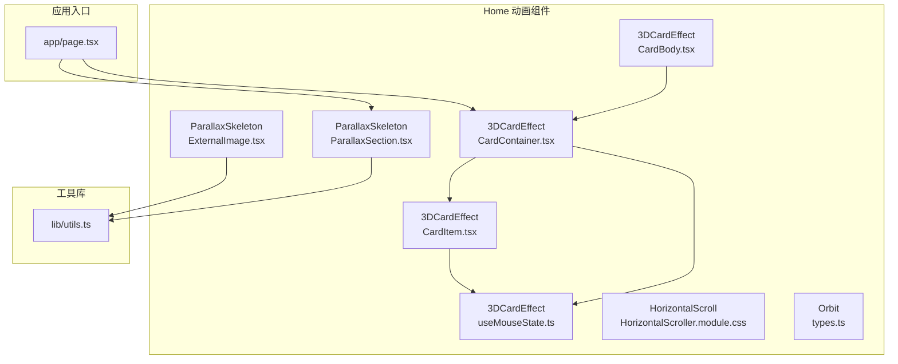
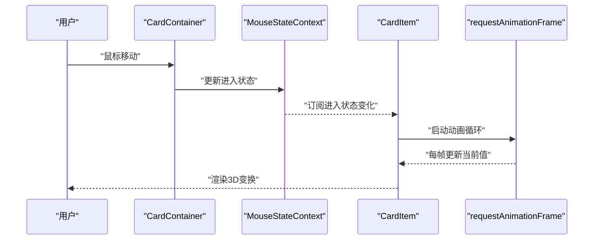
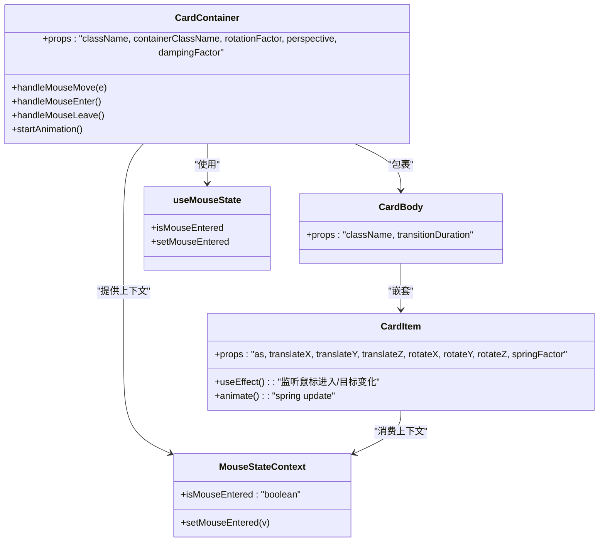
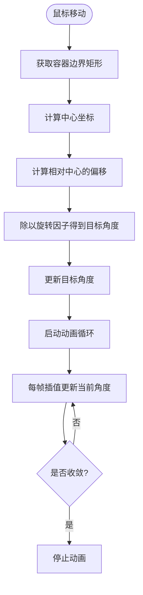
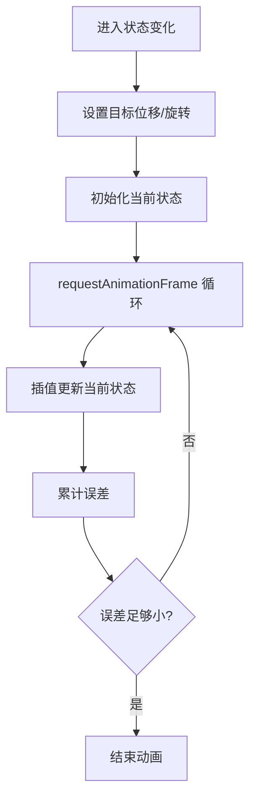
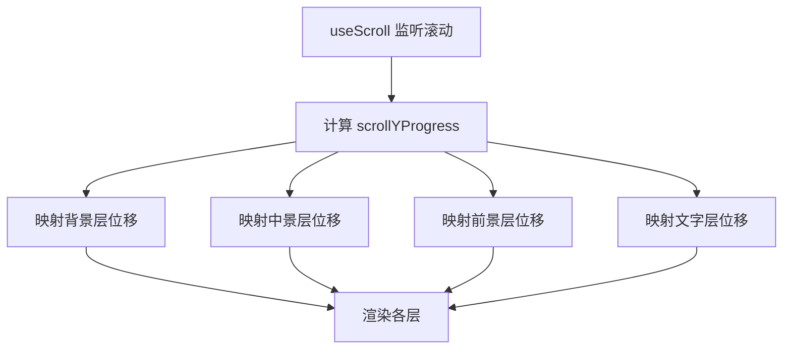
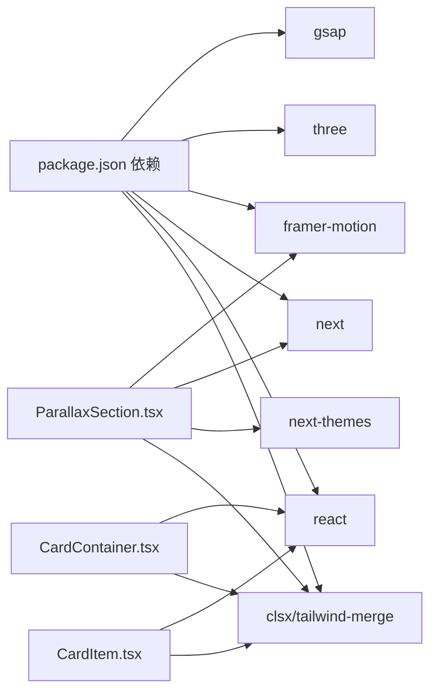

# 动画效果组件

<cite>
**本文引用的文件**
- [CardContainer.tsx](file://blog-system2/frontend/src/components/Home/3DCardEffect/CardContainer.tsx)
- [CardBody.tsx](file://blog-system2/frontend/src/components/Home/3DCardEffect/CardBody.tsx)
- [CardItem.tsx](file://blog-system2/frontend/src/components/Home/3DCardEffect/CardItem.tsx)
- [useMouseState.ts](file://blog-system2/frontend/src/components/Home/3DCardEffect/useMouseState.ts)
- [ParallaxSection.tsx](file://blog-system2/frontend/src/components/Home/ParallaxSkeleton/ParallaxSection.tsx)
- [ExternalImage.tsx](file://blog-system2/frontend/src/components/Home/ParallaxSkeleton/ExternalImage.tsx)
- [HorizontalScroller.module.css](file://blog-system2/frontend/src/components/Home/HorizontalScroll/HorizontalScroller.module.css)
- [types.ts](file://blog-system2/frontend/src/components/Home/Orbit/types.ts)
- [utils.ts](file://blog-system2/frontend/src/lib/utils.ts)
- [page.tsx](file://blog-system2/frontend/src/app/page.tsx)
- [package.json](file://blog-system2/frontend/package.json)
</cite>

## 目录
1. [简介](#简介)
2. [项目结构](#项目结构)
3. [核心组件](#核心组件)
4. [架构总览](#架构总览)
5. [详细组件分析](#详细组件分析)
6. [依赖分析](#依赖分析)
7. [性能考虑](#性能考虑)
8. [故障排查指南](#故障排查指南)
9. [结论](#结论)
10. [附录](#附录)

## 简介
本技术文档聚焦于技术博客平台中的两类动画效果组件：
- 3D卡片效果组件：基于原生DOM与React状态管理，实现鼠标交互驱动的3D旋转与弹簧缓动，强调可配置性与性能优化。
- 视差滚动组件：基于Framer Motion的useScroll与useTransform，实现多层级视差滚动与主题适配，兼顾桌面端与移动端体验。

文档将从系统架构、数据流、处理逻辑、集成点、错误处理与性能特性等维度进行深入解析，并提供API参考、使用示例、最佳实践与故障排查建议。

## 项目结构
动画效果组件主要位于前端源码的Home目录下，采用按功能分层组织：
- 3DCardEffect：3D卡片交互与动画
- ParallaxSkeleton：视差滚动骨架
- HorizontalScroll：水平滚动容器
- Orbit：轨道运动类型定义
- lib/utils：通用工具函数

图表来源
- [CardContainer.tsx:1-121](file://blog-system2/frontend/src/components/Home/3DCardEffect/CardContainer.tsx#L1-L121)
- [CardBody.tsx:1-30](file://blog-system2/frontend/src/components/Home/3DCardEffect/CardBody.tsx#L1-L30)
- [CardItem.tsx:1-136](file://blog-system2/frontend/src/components/Home/3DCardEffect/CardItem.tsx#L1-L136)
- [useMouseState.ts:1-11](file://blog-system2/frontend/src/components/Home/3DCardEffect/useMouseState.ts#L1-L11)
- [ParallaxSection.tsx:1-197](file://blog-system2/frontend/src/components/Home/ParallaxSkeleton/ParallaxSection.tsx#L1-L197)
- [ExternalImage.tsx:1-17](file://blog-system2/frontend/src/components/Home/ParallaxSkeleton/ExternalImage.tsx#L1-L17)
- [HorizontalScroller.module.css:1-36](file://blog-system2/frontend/src/components/Home/HorizontalScroll/HorizontalScroller.module.css#L1-L36)
- [types.ts:1-17](file://blog-system2/frontend/src/components/Home/Orbit/types.ts#L1-L17)
- [utils.ts:1-7](file://blog-system2/frontend/src/lib/utils.ts#L1-L7)
- [page.tsx:1-1052](file://blog-system2/frontend/src/app/page.tsx#L1-L1052)

章节来源
- [page.tsx:1-1052](file://blog-system2/frontend/src/app/page.tsx#L1-L1052)

## 核心组件
本节概述两大组件的功能职责与协作方式：
- 3D卡片组件：通过鼠标状态上下文与受控动画循环，实现平滑的3D旋转与位移缓动。
- 视差滚动组件：通过滚动进度驱动多层元素位移，结合主题切换与移动端降级策略，确保流畅体验。

章节来源
- [CardContainer.tsx:1-121](file://blog-system2/frontend/src/components/Home/3DCardEffect/CardContainer.tsx#L1-L121)
- [CardItem.tsx:1-136](file://blog-system2/frontend/src/components/Home/3DCardEffect/CardItem.tsx#L1-L136)
- [ParallaxSection.tsx:1-197](file://blog-system2/frontend/src/components/Home/ParallaxSkeleton/ParallaxSection.tsx#L1-L197)

## 架构总览
3D卡片与视差滚动组件均采用“声明式配置 + 受控动画”的设计模式：
- 3D卡片：MouseStateContext提供进入状态，CardContainer负责计算目标旋转，CardItem根据目标执行弹簧动画。
- 视差滚动：ParallaxSection基于useScroll与useTransform生成滚动进度，再映射到各层位移。

图表来源
- [CardContainer.tsx:35-76](file://blog-system2/frontend/src/components/Home/3DCardEffect/CardContainer.tsx#L35-L76)
- [CardItem.tsx:67-122](file://blog-system2/frontend/src/components/Home/3DCardEffect/CardItem.tsx#L67-L122)
- [useMouseState.ts:1-11](file://blog-system2/frontend/src/components/Home/3DCardEffect/useMouseState.ts#L1-L11)

## 详细组件分析

### 3D卡片效果组件
该组件由三个子组件协同工作：容器、主体与项。容器负责鼠标交互与旋转计算，主体负责3D样式与阴影过渡，项负责基于目标状态的弹簧动画。

图表来源
- [CardContainer.tsx:10-26](file://blog-system2/frontend/src/components/Home/3DCardEffect/CardContainer.tsx#L10-L26)
- [CardBody.tsx:6-16](file://blog-system2/frontend/src/components/Home/3DCardEffect/CardBody.tsx#L6-L16)
- [CardItem.tsx:7-32](file://blog-system2/frontend/src/components/Home/3DCardEffect/CardItem.tsx#L7-L32)
- [useMouseState.ts:3-9](file://blog-system2/frontend/src/components/Home/3DCardEffect/useMouseState.ts#L3-L9)

#### 鼠标交互检测与旋转计算
- 容器在鼠标进入时设置进入状态，在离开时重置目标旋转并触发回弹动画。
- 计算公式：以容器中心为原点，根据鼠标位置与旋转因子计算目标角度，负号保证Y轴方向符合直觉。
- 阻尼系数决定动画收敛速度，越接近1越“硬”，越接近0越“软”。

图表来源
- [CardContainer.tsx:78-99](file://blog-system2/frontend/src/components/Home/3DCardEffect/CardContainer.tsx#L78-L99)
- [CardContainer.tsx:47-76](file://blog-system2/frontend/src/components/Home/3DCardEffect/CardContainer.tsx#L47-L76)

章节来源
- [CardContainer.tsx:35-121](file://blog-system2/frontend/src/components/Home/3DCardEffect/CardContainer.tsx#L35-L121)

#### 弹簧动画机制与缓动
- CardItem根据进入状态与传入的位移/旋转参数设置目标状态。
- 使用指数衰减公式进行每帧插值，收敛阈值极小，确保视觉平滑。
- 支持移动端检测，避免触摸设备上的动画开销。

图表来源
- [CardItem.tsx:67-122](file://blog-system2/frontend/src/components/Home/3DCardEffect/CardItem.tsx#L67-L122)

章节来源
- [CardItem.tsx:1-136](file://blog-system2/frontend/src/components/Home/3DCardEffect/CardItem.tsx#L1-L136)

#### 组件API参考（3D卡片）
- CardContainer
  - 属性
    - className: 字符串，容器内层元素类名
    - containerClassName: 字符串，外层透视容器类名
    - rotationFactor: 数值，默认15，影响旋转灵敏度
    - perspective: 数值，默认1200，CSS透视距离
    - dampingFactor: 数值，默认0.9，阻尼系数
  - 事件与行为
    - 鼠标进入/移动/离开触发旋转与回弹
    - 内部使用requestAnimationFrame与will-change优化
- CardBody
  - 属性
    - className: 字符串
    - transitionDuration: 数值，默认200，阴影过渡时间
- CardItem
  - 属性
    - as: 元素标签，默认div
    - translateX/Y/Z: 位移量，默认0
    - rotateX/Y/Z: 旋转量，默认0
    - springFactor: 数值，默认0.15，弹簧系数
    - 其他：href、target、onClick等透传

章节来源
- [CardContainer.tsx:10-26](file://blog-system2/frontend/src/components/Home/3DCardEffect/CardContainer.tsx#L10-L26)
- [CardBody.tsx:6-16](file://blog-system2/frontend/src/components/Home/3DCardEffect/CardBody.tsx#L6-L16)
- [CardItem.tsx:7-32](file://blog-system2/frontend/src/components/Home/3DCardEffect/CardItem.tsx#L7-L32)

#### 使用示例与最佳实践
- 在页面中组合使用容器、主体与项，通过translateZ实现层次感。
- 对于按钮或链接，使用as属性指定为a/button，保持语义化与可访问性。
- 调整rotationFactor与springFactor平衡响应速度与顺滑度。
- 在移动端自动降级，避免不必要的动画。

章节来源
- [page.tsx:1003-1052](file://blog-system2/frontend/src/app/page.tsx#L1003-L1052)

### 视差滚动组件
该组件通过Framer Motion的useScroll与useTransform，将滚动进度映射到不同层级的位移，同时针对移动端进行性能优化与样式降级。

图表来源
- [ParallaxSection.tsx:34-56](file://blog-system2/frontend/src/components/Home/ParallaxSkeleton/ParallaxSection.tsx#L34-L56)

#### 滚动监听与位移计算
- 使用useScroll(target, offset)绑定容器，offset定义滚动起点与终点。
- 使用useTransform将scrollYProgress映射到各层的y位移区间，配合自定义缓动曲线。
- 移动端通过媒体查询检测，直接禁用滚动驱动，改为静态展示与CSS过渡。

章节来源
- [ParallaxSection.tsx:24-56](file://blog-system2/frontend/src/components/Home/ParallaxSkeleton/ParallaxSection.tsx#L24-L56)

#### 性能优化策略
- 移动端降级：禁用滚动驱动，减少动画开销。
- will-change与transform:translateZ(0)提示GPU加速。
- 主题切换：通过opacity与filter过渡，避免复杂动画。
- 图片加载：优先使用Next/Image并设置sizes与priority。

章节来源
- [ParallaxSection.tsx:64-193](file://blog-system2/frontend/src/components/Home/ParallaxSkeleton/ParallaxSection.tsx#L64-L193)

#### 组件API参考（视差滚动）
- ParallaxSection
  - 属性
    - foregroundImage: 字符串，前景图片路径
    - midgroundImage: 字符串，中景图片路径
    - backgroundImage: 字符串，背景图片路径
    - backgroundImageDark?: 字符串，深色主题背景图
  - 行为
    - 监听滚动并驱动多层位移
    - 根据主题切换显示不同背景与滤镜
    - 移动端禁用滚动驱动，使用CSS过渡

章节来源
- [ParallaxSection.tsx:9-19](file://blog-system2/frontend/src/components/Home/ParallaxSkeleton/ParallaxSection.tsx#L9-L19)

#### 使用示例与最佳实践
- 在首页主容器中引入ParallaxSection，传入三张图片资源。
- 为移动端设置合理的滤镜与遮罩，保证阅读体验。
- 注意图片尺寸与加载策略，避免首屏阻塞。

章节来源
- [page.tsx:499-504](file://blog-system2/frontend/src/app/page.tsx#L499-L504)

### 水平滚动组件（补充）
- 水平滚动容器通过CSS will-change与preserve-3d提升渲染性能。
- 在高对比度或减少动画偏好下，禁用过渡以降低视觉干扰。

章节来源
- [HorizontalScroller.module.css:1-36](file://blog-system2/frontend/src/components/Home/HorizontalScroll/HorizontalScroller.module.css#L1-L36)

### 轨道运动类型（补充）
- 提供轨道方向枚举，支持顺时针与逆时针。
- Props接口扩展HTML属性，便于复用。

章节来源
- [types.ts:1-17](file://blog-system2/frontend/src/components/Home/Orbit/types.ts#L1-L17)

## 依赖分析
- 3D卡片组件
  - React Hooks：useState/useEffect/useRef/useCallback
  - 工具函数：cn（Tailwind合并）
- 视差滚动组件
  - Framer Motion：useScroll、useTransform、motion
  - Next Themes：主题感知
  - Next/Image：图片优化
- 通用工具
  - clsx/tailwind-merge：类名合并

图表来源
- [package.json:13-42](file://blog-system2/frontend/package.json#L13-L42)
- [CardContainer.tsx:1-121](file://blog-system2/frontend/src/components/Home/3DCardEffect/CardContainer.tsx#L1-L121)
- [CardItem.tsx:1-136](file://blog-system2/frontend/src/components/Home/3DCardEffect/CardItem.tsx#L1-L136)
- [ParallaxSection.tsx:1-197](file://blog-system2/frontend/src/components/Home/ParallaxSkeleton/ParallaxSection.tsx#L1-L197)

章节来源
- [package.json:13-42](file://blog-system2/frontend/package.json#L13-L42)

## 性能考虑
- 动画驱动
  - 使用requestAnimationFrame替代定时器，确保与刷新率同步。
  - 使用will-change与transform:translateZ(0)提示GPU加速。
- 资源优化
  - 图片使用Next/Image，合理设置sizes与priority。
  - 移动端禁用滚动驱动，减少动画与重排。
- 内存与生命周期
  - 组件卸载时取消requestAnimationFrame，避免泄漏。
  - 使用useRef存储动画状态，减少闭包与重渲染。
- 缓动与收敛
  - 阻尼/弹簧系数需平衡响应速度与视觉顺滑度。
  - 收敛阈值足够小以避免视觉抖动。

章节来源
- [CardContainer.tsx:35-45](file://blog-system2/frontend/src/components/Home/3DCardEffect/CardContainer.tsx#L35-L45)
- [CardItem.tsx:59-65](file://blog-system2/frontend/src/components/Home/3DCardEffect/CardItem.tsx#L59-L65)
- [ParallaxSection.tsx:24-30](file://blog-system2/frontend/src/components/Home/ParallaxSkeleton/ParallaxSection.tsx#L24-L30)

## 故障排查指南
- 卡片无响应
  - 检查容器是否正确包裹CardItem，确保MouseStateContext可用。
  - 确认移动端检测未误判，必要时检查媒体查询匹配。
- 动画卡顿
  - 查看是否频繁触发重排，避免在动画循环中读取布局信息。
  - 检查will-change与transform是否正确设置。
- 视差滚动异常
  - 确认useScroll的target与offset配置正确。
  - 检查移动端降级逻辑是否生效。
- 图片加载问题
  - 确保图片路径正确且Next/Image已配置loader与sizes。

章节来源
- [CardContainer.tsx:35-45](file://blog-system2/frontend/src/components/Home/3DCardEffect/CardContainer.tsx#L35-L45)
- [CardItem.tsx:59-65](file://blog-system2/frontend/src/components/Home/3DCardEffect/CardItem.tsx#L59-L65)
- [ParallaxSection.tsx:24-30](file://blog-system2/frontend/src/components/Home/ParallaxSkeleton/ParallaxSection.tsx#L24-L30)

## 结论
本项目在动画组件层面实现了“轻量、可控、可降级”的设计目标：
- 3D卡片组件通过受控动画与弹簧插值，提供细腻的交互反馈。
- 视差滚动组件通过useScroll/useTransform与移动端降级，兼顾性能与体验。
- 两者均遵循现代前端最佳实践，注重生命周期管理与GPU加速。

## 附录
- 实际使用位置
  - 首页中同时引入了3D卡片与视差滚动组件，形成丰富的首屏动画体验。
- 工具函数
  - cn函数用于类名合并，确保样式一致性与可维护性。

章节来源
- [page.tsx:1-1052](file://blog-system2/frontend/src/app/page.tsx#L1-L1052)
- [utils.ts:4-6](file://blog-system2/frontend/src/lib/utils.ts#L4-L6)